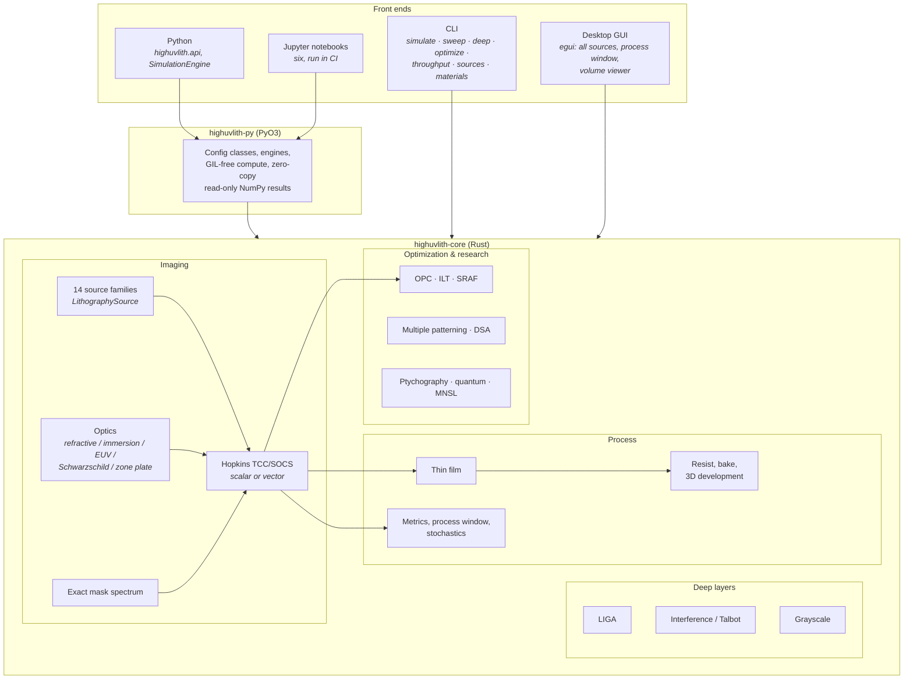
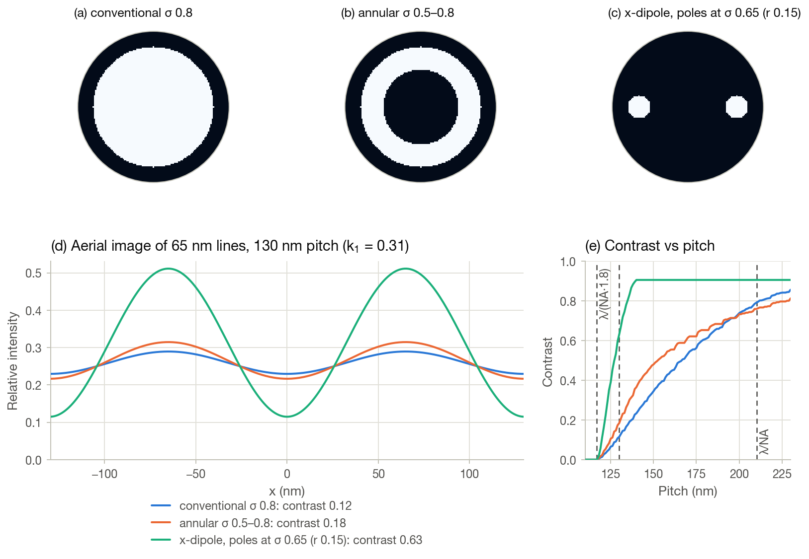
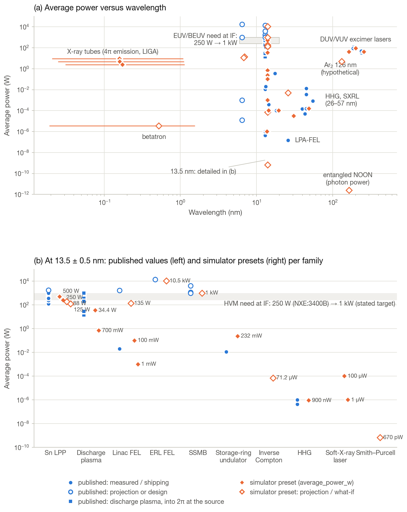
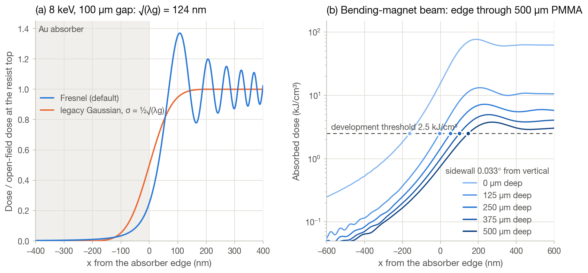
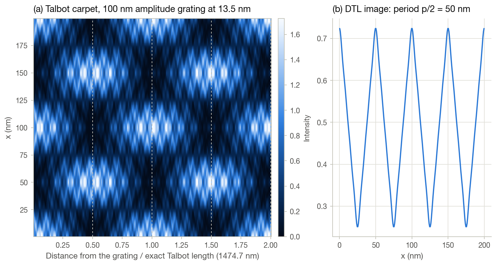
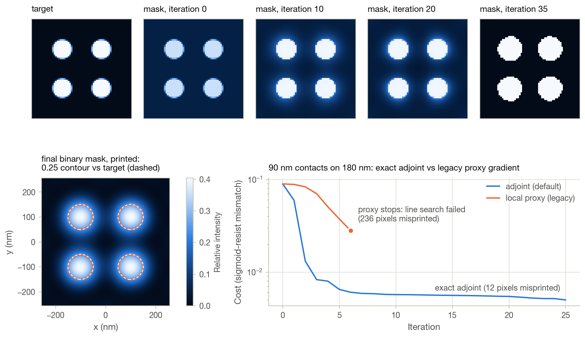

# highuvlith

Physics-first lithography simulation from the mercury g-line (436 nm) and DUV
excimer lasers through VUV (157 nm), EUV (13.5 nm) and beyond-EUV (6.7 nm) to
soft and hard X-rays.

[](https://github.com/sonoransun/highuvlith/actions/workflows/ci.yml)
[](https://sonoransun.github.io/highuvlith/)
[](LICENSE)

highuvlith is a Rust simulation engine with Python, command-line and desktop
front ends. It images masks with exact partially coherent Hopkins optics
(scalar or vector/polarized), through refractive dry and immersion lenses,
Schwarzschild and EUV projection mirrors, or Fresnel zone plates, and carries
the image into resist models, process-window analysis, stochastics, and
mask optimization (OPC, ILT, SRAF). Fourteen light-source families sit behind
one trait — from ArF, KrF and F₂ excimer lasers and tin laser-produced plasma
to synchrotrons, free-electron lasers, X-ray tubes and speculative concepts —
and deep-layer modules cover LIGA deep-X-ray lithography, z-resolved
exposure with 3D development, grayscale relief, interference and Talbot
lithography.

**Honesty is the product.** Every capability is graded ✅ Implemented ·
🔶 Simplified · 🧪 Theoretical · 🗺️ Planned in the
[capability matrix](docs/capability-matrix.md), which lists the assumptions
behind each row. Nothing in this README claims more than the matrix does.

## The documentation site

**[sonoransun.github.io/highuvlith](https://sonoransun.github.io/highuvlith/)**
is the project's GitHub Pages site. Besides the simulator reference it tells
the story the simulator sits in:

| Section | What you will find |
|---|---|
| [History of lithography](https://sonoransun.github.io/highuvlith/history/) | From Senefelder's stone to the projection era, excimer lasers, the 157 nm detour, immersion and multipatterning, the road to EUV, and the parallel paths (X-ray, e-beam, nanoimprint) |
| [Tour of process nodes](https://sonoransun.github.io/highuvlith/nodes/) | 90 nm to the Ångström era: pitches, transistor architectures, which layer needs which tool, and the arithmetic of k₁, depth of focus and photon counts |
| [The future](https://sonoransun.github.io/highuvlith/future/) | High-NA and hyper-NA, beyond-EUV wavelengths, accelerator light sources, the stochastic frontier, alternative patterning, and quantum and exotic ideas — each labelled by how ready it is |
| [Playground](https://sonoransun.github.io/highuvlith/playground/) | In-browser calculators for Rayleigh scaling, photon shot noise and a 1-D aerial image (teaching toys, not the Rust engine) |
| [Simulator docs](https://sonoransun.github.io/highuvlith/getting-started/) | Getting started, the imaging pipeline, sources, processes, the Python/CLI/GUI references and the capability matrix |

The same pages live in [`docs/`](docs/) and read on GitHub too.

## Capabilities at a glance

A condensed view of the [capability matrix](docs/capability-matrix.md).

| Area | Capability | Status |
|---|---|---|
| Imaging | Exact partially coherent Hopkins imaging (factorized TCC/SOCS, (1 + σ)·NA/λ support, defocus inside the pupil, matches a direct Abbe sum to ≤ 1e-8) | ✅ |
| Imaging | Vector (polarized) high-NA imaging: TE/TM per order, obliquity, immersion, film entrance | ✅ |
| Imaging | Per-wavelength broadband imaging (`compute_multiwavelength`) · narrow-band shortcut (`compute_polychromatic`) | ✅ · 🔶 |
| Imaging | Conventional, annular, dipole, quadrupole and Gaussian pupil fills, adaptively sampled | ✅ |
| Optics | Refractive dry, 193 nm water immersion (NA 1.35), Schwarzschild, Fresnel zone plate | ✅ |
| Optics | EUV projection NA 0.33 / High-NA 0.55 (isotropic, no anamorphic mask side) · opt-in multilayer pupil | 🔶 |
| Masks & metrics | Exact thin-mask spectra, commensurate periodic grids, sub-pixel CD / NILS / MEEF | ✅ |
| Masks & metrics | Mask model (Kirchhoff thin mask; alt-PSM treated as binary; no mask 3D) · dose-aware process window (constant-threshold resist) | 🔶 |
| Sources | ArF/KrF/F₂ excimer and Hg lamp lines, Sn laser-produced plasma, synchrotron, XFEL | ✅ (parameters 🔶 where stated) |
| Sources | HHG and soft-X-ray laser (✅ lines / 🔶 output estimates) · X-ray tube (✅ lines and edges / 🔶 continuum and absolute flux) · LPA-FEL, discharge plasma, throughput calculator | ✅/🔶 · 🔶/✅ · 🔶 |
| Sources | Inverse Compton, betatron, SSMB, Smith–Purcell, entangled-photon NOON | 🧪 |
| Resist | Anisotropic Gaussian bake, fast-marching 3D development · level-set development | ✅ · ✅/🔶 |
| Resist | Depth-averaged 2D Dill/Mack path, chemically amplified bake, volumetric exposure, grayscale | 🔶 |
| Deep layers | LIGA depth dose and absolute exposure time · Fresnel proximity diffraction | ✅ · ✅/🔶 |
| Deep layers | Multi-beam interference / two-photon · Talbot, DTL, ATL and two-grating EUV interference | ✅/🔶 · 🔶 |
| Optimization | True-adjoint ILT, fragment-based model OPC | ✅ |
| Optimization | SRAF insertion, LELE/SADP/SAQP, directed self-assembly | 🔶 |
| Stochastics | Photon shot noise and source dose jitter · LER/LWR Monte Carlo | ✅ · 🔶 |
| Materials | CXRO/Henke optical constants, NIST X-ray attenuation, multilayer mirrors, thin-film transfer matrix | ✅ |
| Research | Ptychography (ePIE) · quantum lithography (N-photon absorption and ideal N00N models), moiré nanosphere emission | 🔶 · 🧪 |
| Planned | GPU backend, mask 3D/EMF (non-goal), Jones-pupil polarization, stochastic resist Monte Carlo, … — see the [roadmap](docs/roadmap.md) | 🗺️ |

## Architecture

All physics lives in one Rust crate; the Python package, the CLI and the GUI
are thin adapters. See [docs/architecture.md](docs/architecture.md) for the
module map, the imaging data flow and the validation layers.



## Installation

highuvlith is **not published on PyPI yet**; build it from source. You need a
stable Rust toolchain ([rustup.rs](https://rustup.rs)) and Python ≥ 3.10.

```bash
git clone https://github.com/sonoransun/highuvlith.git
cd highuvlith
python -m venv .venv && source .venv/bin/activate
pip install maturin numpy
maturin develop --release        # builds the Rust extension into the venv
```

Optional extras install from the checkout, e.g. `pip install ".[viz]"`
(matplotlib) or `pip install ".[all]"`. The CLI and GUI are plain Cargo
binaries: `cargo run --release -p highuvlith-cli -- --help` and
`cargo run --release -p highuvlith-gui` — an interactive explorer for every
source family, imaging, the process window and 3D volumes (z-slice and x–z
views; screenshots in [docs/gui.md](docs/gui.md)).

## Quick start

Every snippet below was run against this repository; the printed numbers are
what it produced.

### Resolution comes from partial coherence

<!-- verify-example -->
```python
import highuvlith as huv

# 65 nm lines on a 180 nm pitch, F2 laser (157.63 nm), NA 0.75. The pitch is
# below lambda/NA = 210 nm, so only off-axis (partially coherent) light resolves it.
for sigma in (0.1, 0.7):
    r = huv.simulate_line_space(65.0, 180.0, na=0.75, sigma=sigma)
    nils = "n/a" if r.nils is None else f"{r.nils:.2f}"
    print(f"sigma {sigma}: contrast {r.contrast:.3f}, NILS {nils}")
```

```text
sigma 0.1: contrast 0.000, NILS n/a
sigma 0.7: contrast 0.454, NILS 0.65
```

The first diffraction orders of a 180 nm pitch fall outside the pupil for a
nearly coherent source; with σ = 0.7 the off-axis source points steer one of
them back in. The same case matches an independent Abbe reference (0.456).

### Immersion: a pitch dry optics cannot print

<!-- verify-example -->
```python
import highuvlith as huv

# 45 nm lines on a 90 nm pitch with an ArF laser (193.4 nm): below the dry
# NA 0.93 limit lambda/((1 + sigma) NA) = 109 nm, resolved by water immersion.
source = huv.SourceConfig.arf_laser(sigma=0.9)
mask = huv.MaskConfig.line_space(cd_nm=45.0, pitch_nm=90.0)
grid = mask.commensurate_grid(256, 1.0)  # field = whole number of pitches

for optics in (huv.OpticsConfig(numerical_aperture=0.93), huv.OpticsConfig.immersion_193i()):
    engine = huv.SimulationEngine(source, optics, mask, grid=grid)
    images = engine.compute_through_focus([0.0, 50.0, 100.0])
    contrast = [round(image.image_contrast(), 3) for image in images]
    print(f"NA {optics.numerical_aperture:.2f}: contrast at 0/50/100 nm defocus {contrast}")
```

```text
NA 0.93: contrast at 0/50/100 nm defocus [0.0, 0.0, 0.0]
NA 1.35: contrast at 0/50/100 nm defocus [0.201, 0.177, 0.118]
```

### EUV and High-NA

<!-- verify-example -->
```python
import highuvlith as huv

# 9 nm lines on an 18 nm pitch at 13.5 nm (Sn laser-produced plasma): below the
# NA 0.33 limit, resolved at NA 0.55 (isotropic High-NA model, no anamorphic mask side).
source = huv.SourceConfig.lpp_sn_13nm5(sigma=0.9)
mask = huv.MaskConfig.line_space(cd_nm=9.0, pitch_nm=18.0)
grid = mask.commensurate_grid(128, 0.5)
for optics in (huv.OpticsConfig.euv_nxe(), huv.OpticsConfig.euv_high_na()):
    engine = huv.SimulationEngine(source, optics, mask, grid=grid)
    print(f"{optics.kind} NA {optics.numerical_aperture}: contrast {engine.image_contrast(0.0):.3f}")
```

```text
euv_projection NA 0.33: contrast 0.000
euv_projection NA 0.55: contrast 0.447
```

### Polarization at high NA

<!-- verify-example -->
```python
import highuvlith as huv
from highuvlith import api

# Two-beam interference at NA 0.9: TE (y-polarized) keeps full contrast,
# TM (x-polarized) falls to |1 - 2 NA^2|, unpolarized light to 1 - NA^2.
for pol in ("y", "x", "unpolarized"):
    print(pol, round(api.vector_two_beam_contrast(0.9, pol), 3))

# The same physics in the imaging engine: vertical 64/128 nm lines at NA 0.9.
source = huv.SourceConfig.f2_laser(sigma=0.9)
optics = huv.OpticsConfig(numerical_aperture=0.9)
mask = huv.MaskConfig.line_space(cd_nm=64.0, pitch_nm=128.0)
grid = mask.commensurate_grid(64, 2.0)
print("scalar", round(huv.SimulationEngine(source, optics, mask, grid=grid).image_contrast(0.0), 3))
for pol in ("y", "x"):
    engine = huv.SimulationEngine(source, optics, mask, grid=grid,
                                  vector=api.VectorSettings(polarization=pol))
    print(pol, round(engine.image_contrast(0.0), 3))
```

```text
y 1.0
x 0.62
unpolarized 0.19
scalar 0.414
y 0.441
x 0.088
```

### Source physics and throughput

<!-- verify-example -->
```python
import highuvlith as huv

src = huv.SourceConfig.lpp_sn_13nm5()
print(f"{src.average_power_w:.0f} W in band at intermediate focus")
for name, value, unit, note in src.derived_quantities()[:3]:
    print(f"  {name} = {value:.4g} {unit}")
tp = src.wafer_throughput(dose_mj_cm2=30.0)  # illustrative EUV scanner defaults
print(f"{tp['wafers_per_hour']:.0f} wafers/h, {tp['power_at_wafer_w']:.2f} W at the wafer")
```

```text
250 W in band at intermediate focus
  photon_energy = 91.84 eV
  in_band_emission_2pi = 1290 W
  drive_laser_wavelength = 10.6 um
154 wafers/h, 4.59 W at the wafer
```

The throughput model is 🔶: one optics-train transmission, lumped overheads and
illustrative scanner parameters.

### Deep X-ray lithography (LIGA)

<!-- verify-example -->
```python
import highuvlith as huv

# 500 um of PMMA behind a 20 um Au mask, bending-magnet beamline 15 m from the
# source, 50 mm vertical scan: depth dose, beam hardening and exposure time.
bm = huv.SourceConfig.synchrotron_liga_bending_magnet()
liga = huv.simulate_liga(resist_thickness_um=500.0, source=bm, source_distance_m=15.0,
                         vertical_scan_mm=50.0, cd_nm=3200.0, pitch_nm=6400.0,
                         grid_size=128, pixel_nm=100.0)
print(f"top/bottom dose {liga.dose_ratio:.1f}, exposure {liga.exposure_time_s:.0f} s")
print(f"mean photon energy {liga.mean_energy_top_kev:.2f} keV (top) -> "
      f"{liga.mean_energy_bottom_kev:.2f} keV (bottom)")

# The same physics with a laboratory X-ray tube (W anode, 60 kV, 30 mA, 100 mm away)
tube = huv.SourceConfig.xray_tube("W")
flux = tube.spectral_flux_density(distance_mm=100.0)  # photons / s / mm^2 / keV
lab = huv.simulate_liga(resist_thickness_um=100.0, flux_density=flux, cd_nm=3200.0,
                        pitch_nm=6400.0, grid_size=128, pixel_nm=50.0)
print(f"X-ray tube, 100 um PMMA: exposure {lab.exposure_time_s / 3600:.1f} h")
```

```text
top/bottom dose 20.8, exposure 605 s
mean photon energy 2.85 keV (top) -> 7.57 keV (bottom)
X-ray tube, 100 um PMMA: exposure 39.5 h
```

The pixel is chosen to resolve the Fresnel scale √(λ·gap); coarser pixels
trigger a warning. The tube's absolute flux rests on an empirical
bremsstrahlung efficiency (🔶, about ±20 %).

### Command line

```bash
cargo build --release -p highuvlith-cli
B=target/release/highuvlith

$B simulate --config examples/sim.toml --output aerial.png      # F2, 65/180 nm, NA 0.75
$B simulate --config examples/sim_lpp_sn.toml --output euv.png  # 13.5 nm Sn LPP
$B deep --config examples/liga.toml --output liga.png           # LIGA with an Al filter
$B deep --config examples/volumetric.toml --output profile.png  # bake + level-set develop
$B deep --config examples/talbot.toml --output talbot.png       # achromatic Talbot
$B optimize --config examples/optimize_opc.toml                 # fragment OPC
$B throughput --config examples/sim_lpp_sn.toml                 # dose-limited wafers/hour
$B sources                                                      # every preset, with badges
$B materials --wavelength 13.5                                  # CXRO-derived constants
```

`examples/sim.toml` prints the source's derived quantities and a contrast of
0.4545; `liga.toml` reports a 996 s exposure and the developed sidewall. There
is a `sim_*.toml` for every source family in [examples/](examples/), and the
CLI test suite runs every one of them. Unknown or misspelled keys are rejected
with a suggestion; the TOML schema is documented in [docs/configuration.md](docs/configuration.md).

## Performance

Measured with `cargo bench -p highuvlith-core` (criterion, release build,
20 SOCS kernels) on an Apple M3 Pro (11 cores) that was shared with other build
jobs at the time — treat the numbers as ±20 %. VUV = F₂, σ 0.7, NA 0.75,
2 nm pixels; EUV = 13.5 nm, σ 0.7, Schwarzschild NA 0.33, 1 nm pixels. Measured
on 2026-09-30 when the exact engine was merged; later additions (clear-field
normalization, vector and multilayer options) were not re-benchmarked.

| Operation | Time |
|---|---|
| Engine creation (source sampling + TCC decomposition), VUV 128² / 256² | 0.26 ms / 1.4 ms |
| Engine creation, EUV 128² / 256² | 2.9 ms / 21 ms |
| One aerial image, VUV 128² / 256² / 512² | 0.56 ms / 2.7 ms / 21 ms |
| One aerial image, EUV 256² | 3.0 ms |
| 21-plane focus sweep with exact defocus (kernels rebuilt per plane), VUV / EUV 256² | 34 ms / 307 ms |
| 21-plane sweep with the legacy kernel-phase defocus, VUV 256² | 28 ms |
| Exact per-wavelength imaging of a 5-line comb, EUV 128² / 256² | 11 ms / 97 ms |

Source: the WP-A1 benchmark log. Image computation parallelizes over kernels,
focus planes and wavelengths with Rayon and is bit-reproducible regardless of
thread count.

## Testing

<!-- TEST-COUNTS: final full test run on 2026-10-01. -->
| Suite | Count (2026-10-01) |
|---|---|
| Rust core unit tests | 708 passed |
| Rust core integration tests | 90 (analytical 8, imaging validation 18, source sampling 2, optics presets 13, vector pupil 26, vector imaging 8, MNSL 13, property-based 2) + 1 doctest |
| CLI tests | 107 unit + 35 end-to-end (every `examples/*.toml` included) |
| GUI tests | 63 |
| Python tests | 360 passed |
| Docs example tests | 99 site examples, 101 tests (`tests/docs/test_site_examples.py`, release build) |
| Docs tooling | 42 MkDocs-hook tests, 18 playground-physics tests (Node), 31 math-linter tests |
<!-- /TEST-COUNTS -->

Validation is layered: closed-form fixtures computed independently of the
code, analytical limits (coherent three-beam images, two-beam TE/TM contrast,
Fresnel knife edge, Talbot lengths), a direct Abbe sum that the SOCS engine
must match to 1e-8, and regression tests for every corrected defect. CI runs
formatting, clippy, the Rust suites on Ubuntu, macOS and Windows (plus feature
subsets), rustdoc, cargo-audit, the Python suite on Python 3.12/3.13, ruff and
mypy, the six notebooks, the site's Python examples, the docs checks (Status lines, GitHub-safe math, links) and
a strict MkDocs build. [CONTRIBUTING.md](CONTRIBUTING.md) lists the commands.

## Documentation map

**Site sections:** [history](docs/history/index.md) · [process nodes](docs/nodes/index.md) ·
[the future](docs/future/index.md) · [playground](docs/playground/index.md) ·
[getting started](docs/getting-started.md)

**Simulator**
- [capability-matrix.md](docs/capability-matrix.md) — status of every capability, with assumptions
- [architecture.md](docs/architecture.md) — crates, module map, imaging data flow, validation layers
- [pipeline.md](docs/pipeline.md) · [optics.md](docs/optics.md) · [vector-imaging.md](docs/vector-imaging.md) · [masks-and-metrics.md](docs/masks-and-metrics.md) · [materials.md](docs/materials.md)
- [research-modules.md](docs/research-modules.md) — OPC, ILT, SRAF, multiple patterning, DSA, stochastics, ptychography, quantum, MNSL

**Sources** — [overview](docs/sources/index.md):
[DUV/UV heritage](docs/sources/duv-heritage.md) · [VUV excimer](docs/sources/vuv-excimer.md) ·
[laser-produced plasma](docs/sources/lpp.md) · [discharge plasma](docs/sources/dpp.md) ·
[synchrotron](docs/sources/synchrotron.md) · [XFEL](docs/sources/xfel.md) ·
[LPA-FEL](docs/sources/lpa-fel.md) · [HHG](docs/sources/hhg.md) ·
[soft-X-ray laser](docs/sources/soft-xray-laser.md) · [X-ray tube](docs/sources/xray-tube.md) ·
[inverse Compton](docs/sources/inverse-compton.md) · [betatron](docs/sources/betatron.md) ·
[SSMB](docs/sources/ssmb.md) · [Smith–Purcell](docs/sources/smith-purcell.md) ·
[entangled photons](docs/sources/entangled-photon.md)

**Processes** — [overview](docs/processes/index.md):
[thin film](docs/processes/thin-film.md) · [resist models](docs/processes/resist-models.md) ·
[volumetric exposure](docs/processes/volumetric-exposure.md) · [LIGA](docs/processes/liga-deep-xray.md) ·
[grayscale](docs/processes/grayscale.md) · [interference](docs/processes/interference-volumetric.md) ·
[Talbot](docs/processes/talbot.md)

**Reference** — [python-api.md](docs/python-api.md) · [cli.md](docs/cli.md) ·
[configuration.md](docs/configuration.md) · [gui.md](docs/gui.md)

**Development** — [extending.md](docs/extending.md) · [roadmap.md](docs/roadmap.md) ·
[CONTRIBUTING.md](CONTRIBUTING.md)

## Roadmap

The largest remaining gaps are depth-resolved vector imaging inside the resist
stack, a Jones-pupil lens model, the anamorphic High-NA mask side, a stochastic
resist Monte Carlo, resist models inside OPC/ILT, and a GPU backend; rigorous
mask 3D (EMF) simulation is an explicit non-goal. See
[docs/roadmap.md](docs/roadmap.md).

## Contributing

Build, test and documentation conventions — including the rule that a
capability change updates the module header, the capability matrix and the
page's Status line in the same PR — are in [CONTRIBUTING.md](CONTRIBUTING.md).

## Gallery

Every image below is computed by the simulator itself by
[`docs/figures/sim/make_all.py`](docs/figures/README.md) (light/dark variants; captions with
parameters and model status are on the linked pages). More figures are on the
technical pages of the [documentation site](https://sonoransun.github.io/highuvlith/).

<picture>
  <source media="(prefers-color-scheme: dark)" srcset="docs/assets/images/sim/imaging-illumination-shapes-dark.png">
  
</picture>

*Off-axis illumination below λ/NA: conventional, annular and two-pole dipole fills at k₁ ≈ 0.31 (scalar Hopkins/SOCS ✅).* — [details](docs/pipeline.md)

<picture>
  <source media="(prefers-color-scheme: dark)" srcset="docs/assets/images/sim/sources-landscape-dark.png">
  
</picture>

*Fourteen source families: published average powers (cited CSV) next to what the simulator's presets derive.* — [details](docs/sources/index.md)

<picture>
  <source media="(prefers-color-scheme: dark)" srcset="docs/assets/images/sim/liga-fresnel-edge-dark.png">
  
</picture>

*LIGA proximity diffraction: Fresnel knife-edge ringing vs the legacy Gaussian blur, and the edge through 500 µm of PMMA.* — [details](docs/processes/liga-deep-xray.md)

<picture>
  <source media="(prefers-color-scheme: dark)" srcset="docs/assets/images/sim/talbot-carpet-dark.png">
  
</picture>

*Talbot carpet of a 100 nm grating at 13.5 nm and the half-period DTL image (Talbot/DTL 🔶).* — [details](docs/processes/talbot.md)

<picture>
  <source media="(prefers-color-scheme: dark)" srcset="docs/assets/images/sim/optim-ilt-contacts-dark.png">
  
</picture>

*Inverse lithography of a contact array with the exact adjoint gradient (ILT ✅).* — [details](docs/research-modules.md)

## License

MIT — see [LICENSE](LICENSE).
