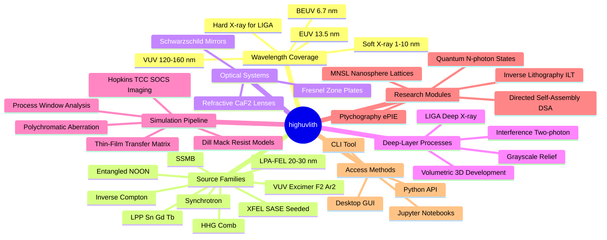
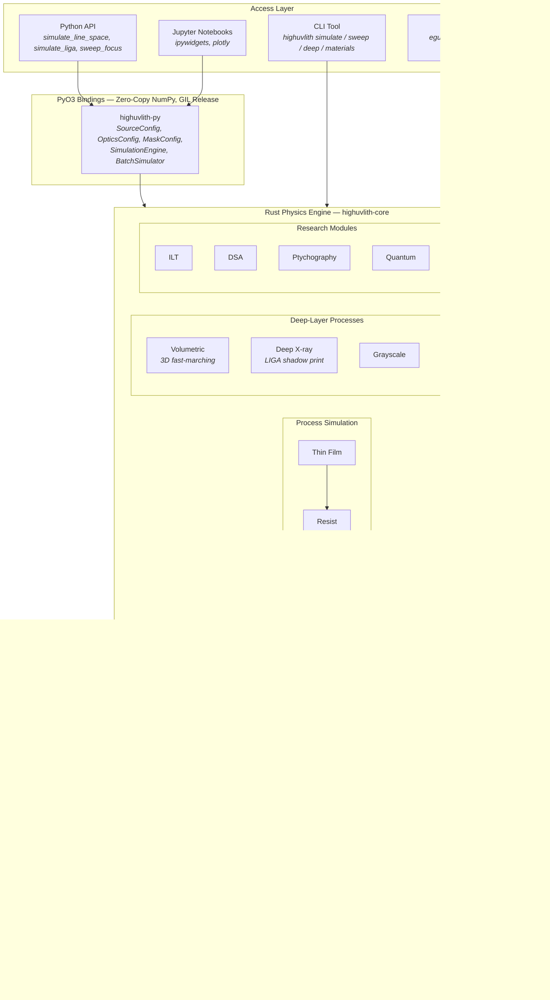

# highuvlith

High-performance lithography simulation framework spanning VUV through X-ray wavelengths.

[](https://github.com/martinpeck/highuvlith/actions/workflows/ci.yml)
[](https://pypi.org/project/highuvlith/)
[](LICENSE)

highuvlith simulates the optical-lithography pipeline across four decades of wavelength — from VUV excimer lasers (157 / 126 nm) through EUV (13.5 nm) and beyond-EUV (6.7 nm) to soft and hard X-rays. It ships nine pluggable source families (VUV excimer, LPA-FEL, laser-produced plasma, synchrotron, HHG, XFEL, inverse Compton, SSMB, and entangled-photon NOON), three optical systems, and deep-layer process modules: LIGA deep-X-ray shadow printing at aspect ratios beyond 100:1, volumetric z-resolved exposure with 3D fast-marching development, grayscale surface relief, and multi-beam interference. The Rust physics engine delivers parallel, GIL-free computation through four frontends — a Python API, a CLI, an egui desktop GUI, and Jupyter notebooks. Every claim below is graded against [docs/capability-matrix.md](docs/capability-matrix.md), the honest ledger of what is implemented, simplified, theoretical, or planned; nothing here is described as running beyond what that matrix records.

---

## Capabilities at a Glance



## Architecture

A Rust physics engine sits at the core, PyO3 bindings provide zero-copy NumPy interop, and four frontends sit on top. See [docs/architecture.md](docs/architecture.md) for the full module map, the Python-to-Rust data-flow sequence, and the layered validation model.



## Simulation Pipeline

Every projection simulation follows one modular pipeline from illumination source to lithographic metrics. See [docs/pipeline.md](docs/pipeline.md).

```mermaid
graph LR
    A["Source<br/><i>VUV F2/Ar2, LPA-FEL,<br/>LPP Sn/Gd, synchrotron,<br/>HHG, XFEL, ICS, SSMB, NOON</i>"] --> B["Optical System<br/><i>Refractive lens,<br/>zone plate,<br/>Schwarzschild</i>"]
    B --> C["Mask Spectrum<br/><i>2D FFT of transmittance<br/>Binary / AttPSM / AltPSM</i>"]
    C --> D["TCC Decomposition<br/><i>Eigendecompose into<br/>SOCS kernels</i>"]
    D --> E["Aerial Image<br/><i>Sum of coherent<br/>kernel convolutions</i>"]
    E --> F["Thin Film<br/><i>Transfer matrix,<br/>standing waves</i>"]
    F --> G["Resist Exposure<br/><i>Dill ABC model,<br/>latent image</i>"]
    G --> H["PEB + Development<br/><i>Mack model,<br/>resist profile</i>"]
    H --> I["Metrics<br/><i>CD, NILS, contrast,<br/>DOF, EL</i>"]

    style A fill:#e65100,stroke:#ff9800,color:#fff
    style B fill:#4a148c,stroke:#9c27b0,color:#fff
    style D fill:#1565c0,stroke:#42a5f5,color:#fff
    style E fill:#1565c0,stroke:#42a5f5,color:#fff
    style H fill:#2e7d32,stroke:#66bb6a,color:#fff
    style I fill:#6a1b9a,stroke:#ab47bc,color:#fff
```



Thick-resist and 3D work branch off this pipeline. The **volumetric** path ([docs/processes/volumetric-exposure.md](docs/processes/volumetric-exposure.md)) replaces the depth-averaged resist stage with a z-resolved exposure and 3D fast-marching development. The **LIGA deep-X-ray** path ([docs/processes/liga-deep-xray.md](docs/processes/liga-deep-xray.md)) bypasses projection imaging entirely for near-geometric shadow printing. See [docs/processes/index.md](docs/processes/index.md) for the full set.

## Illumination Sources

Nine source families satisfy the `LithographySource` trait and feed the same Hopkins TCC/SOCS pipeline. Status badges follow the [capability matrix](docs/capability-matrix.md) taxonomy: ✅ Implemented · 🔶 Simplified · 🧪 Theoretical.

| Family | λ (nm) | Class | Status | Docs |
|--------|--------|-------|--------|------|
| VUV excimer (F₂, Ar₂) | 157.63 / 126 | Refractive VUV | ✅ | [vuv-excimer](docs/sources/vuv-excimer.md) |
| LPA-FEL | 20–30 | Compact free-electron laser | 🔶 | [lpa-fel](docs/sources/lpa-fel.md) |
| LPP (Sn / Gd / Tb) | 13.5 / 6.7 / 6.5 | Laser-produced plasma | ✅ | [lpp](docs/sources/lpp.md) |
| Synchrotron (bending / undulator) | derived | Storage-ring | ✅ | [synchrotron](docs/sources/synchrotron.md) |
| HHG comb | 800 / q → 13.56 | Table-top EUV | ✅/🔶 | [hhg](docs/sources/hhg.md) |
| XFEL (SASE / seeded) | ~13.5 | Free-electron laser | ✅ | [xfel](docs/sources/xfel.md) |
| Inverse Compton | derived | Compact X-ray | 🧪 | [inverse-compton](docs/sources/inverse-compton.md) |
| SSMB | 13.5 | Storage-ring microbunching | 🧪 | [ssmb](docs/sources/ssmb.md) |
| Entangled NOON | physical λ | Quantum | 🧪 | [entangled-photon](docs/sources/entangled-photon.md) |

Wavelengths marked *derived* are computed from machine parameters (undulator resonance, Compton kinematics) rather than set directly. See [docs/sources/index.md](docs/sources/index.md) for the full comparison, factory presets, and TOML tags.

## Capability status

A condensed view of the [full matrix](docs/capability-matrix.md). Badges: ✅ Implemented (computed, tested, validated) · 🔶 Simplified (runs with documented approximations) · 🧪 Theoretical (runnable but speculative) · 🗺️ Planned (roadmap only).

| Capability | Status | Notes |
|------------|--------|-------|
| Hopkins TCC/SOCS aerial imaging | ✅ | Scalar diffraction; no vector high-NA polarization effects |
| Polychromatic imaging | 🔶 | Per-sample focus shift, TCC at center λ — narrow-band only |
| Refractive / zone-plate / Schwarzschild optics | ✅ | Chromatic defocus, annular pupil; multilayer reflectance as a scalar |
| Thin-film transfer matrix | ✅ | 2×2 characteristic matrix, TE/TM/unpolarized |
| Resist exposure + development (Dill / Mack) | 🔶 | Depth-averaged 2D; center-row etch (use volumetric for 3D) |
| Volumetric z-resolved exposure + 3D development | 🔶 | Separable focus mapping; eikonal fast-marching gives sidewalls |
| LIGA deep-X-ray depth dose | 🔶 | Shadow printing; Gaussian proximity blur; smoothed absorption edges |
| Grayscale surface relief | 🔶 | Log-linear contrast curve; fast 2.5D path ignores standing waves |
| Multi-beam interference / two-photon | ✅/🔶 | Exact vector field sum; scalar per-beam absorption |
| VUV / LPP / synchrotron / XFEL sources | ✅ | Live spectral + power chains |
| LPA-FEL / HHG sources | 🔶 | Simplified spectral bookkeeping with documented approximations |
| Inverse Compton / SSMB / entangled NOON | 🧪 | Runnable but speculative research projections |
| Process window, OPC, double patterning | ✅/🔶 | DP is an aerial-domain dose sum; OPC without SRAF insertion |
| Shot noise + LER/LWR Monte Carlo | ✅ | Poisson counts + Gamma shot-to-shot dose jitter |
| ILT / DSA | 🔶 | Proxy gradient / analytic morphology, not full adjoint or SCFT |
| Ptychography ePIE / MNSL | ✅ | Genuine iterative reconstruction / Rayleigh scattering |
| Quantum lithography (NOON λ/2N) | 🧪 | Theoretical N-photon sharpening with flux penalty |
| Optics honesty guard | ✅ | Warns / auto-selects Schwarzschild below 50 nm |
| GPU backend, Jupyter notebooks | 🗺️ | Planned; trait stub / helper functions only |

## Access Methods

- **Python API** — one-liners (`simulate_line_space`, `simulate_liga`, `sweep_focus`) plus `SimulationEngine` and `BatchSimulator` for full control and GIL-released sweeps. See [docs/python-api.md](docs/python-api.md).
- **CLI** — `highuvlith simulate / sweep / deep / materials` over TOML configs. See [docs/cli.md](docs/cli.md).
- **Desktop GUI** — egui app with real-time parameter sliders and a live aerial-image heatmap. See [docs/gui.md](docs/gui.md).
- **Jupyter notebooks** — ipywidgets explorers and worked examples in [examples/notebooks/](examples/notebooks/).

## Installation

```bash
pip install highuvlith
```

Optional extras:

```bash
pip install highuvlith[viz]         # matplotlib plots
pip install highuvlith[interactive] # plotly + polars
pip install highuvlith[notebook]    # Jupyter ipywidgets
pip install highuvlith[all]         # everything
```

Build from source:

```bash
git clone https://github.com/martinpeck/highuvlith.git
cd highuvlith
python -m venv .venv && source .venv/bin/activate
pip install maturin numpy
maturin develop
```

## Quick Start

### Python — one-liner

```python
import highuvlith as huv

result = huv.simulate_line_space(65.0, 180.0, na=0.75, with_resist=True)
print(f"Contrast: {result.contrast:.3f}, NILS: {result.nils:.2f}")
```

### Python — full control

```python
import highuvlith as huv

source = huv.SourceConfig.f2_laser(sigma=0.7)
optics = huv.OpticsConfig(numerical_aperture=0.85)
mask   = huv.MaskConfig.line_space(cd_nm=45.0, pitch_nm=120.0)
grid   = huv.GridConfig(size=512, pixel_nm=1.0)

engine = huv.SimulationEngine(source, optics, mask, grid=grid)
aerial = engine.compute_aerial_image(focus_nm=0.0)
print(f"Contrast: {aerial.image_contrast():.4f}")

sweep = huv.sweep_focus(cd_nm=65.0, pitch_nm=180.0, na=0.75)
print(f"Best focus: {sweep['best_focus_nm']:.0f} nm, peak {sweep['best_contrast']:.3f}")
```

### Python — 13.5 nm LPP through Schwarzschild optics

```python
import highuvlith as huv

# No lens material transmits at 13.5 nm, so Sn laser-produced plasma is imaged
# through a two-mirror reflective objective — refractive optics would be unphysical.
source = huv.SourceConfig.lpp_sn_13nm5(sigma=0.9)
optics = huv.OpticsConfig.schwarzschild(numerical_aperture=0.33)  # Mo/Si multilayer
mask   = huv.MaskConfig.line_space(cd_nm=22.0, pitch_nm=44.0)
grid   = huv.GridConfig(size=256, pixel_nm=1.0)

engine = huv.SimulationEngine(source, optics, mask, grid=grid, max_kernels=20)
aerial = engine.compute_aerial_image(focus_nm=0.0)
print(f"{source.kind} @ {source.wavelength_nm} nm through {optics.kind} optics")
print(f"Contrast: {aerial.image_contrast():.4f}")
```

The CLI and GUI reach the same reflective optics through `[optics] type = "schwarzschild"` and sub-50 nm auto-select; the optics honesty guard rejects refractive lenses in this regime.

### Python — deep X-ray LIGA teaser

```python
import highuvlith as huv

# 500 µm PMMA, 5 µm lines on a LIGA-class bending-magnet beamline -> 100:1 aspect
liga = huv.simulate_liga(resist_thickness_um=500.0, cd_nm=5000.0, pitch_nm=10000.0)
print(f"top:bottom dose ratio = {liga.dose_ratio:.1f}")
print(f"exceeds damage ceiling: {liga.exceeds_damage_ceiling}")
```

### CLI

```bash
# Aerial image from the F2 VUV config, exported as PNG
highuvlith simulate --config examples/sim.toml --output aerial.png

# EUV: 13.5 nm LPP through a Schwarzschild objective
highuvlith simulate --config examples/sim_lpp_sn.toml --output euv_aerial.png

# Deep X-ray LIGA: z-resolved dose through thick PMMA (mode set by [deep] mode)
highuvlith deep --config examples/liga.toml
```

The desktop GUI (`cargo run -p highuvlith-gui`) exposes the same engine with live sliders and source presets; see [docs/gui.md](docs/gui.md).

## Performance

Computation runs entirely in Rust with the Python GIL released; batch operations parallelize across cores via Rayon, and the `ComputeBackend` trait leaves room for a future wgpu GPU backend.

| Operation | Grid Size | Typical Time |
|-----------|-----------|-------------|
| Engine creation (TCC decomposition) | 128×128 | ~15 ms |
| Single aerial image | 128×128 | ~5 ms |
| Single aerial image | 256×256 | ~110 ms |
| 21-point focus sweep | 128×128 | ~100 ms |
| Process window (7×11) | 128×128 | ~400 ms |

## Testing

290+ Rust tests (unit, analytical validation, and proptest property-based) and 130+ Python integration tests — including a stub drift guard that keeps the `.pyi` type stubs in sync with the bindings — cover physics, error paths, and I/O. CI runs the matrix on Ubuntu, macOS, and Windows for Rust, and Ubuntu/macOS with Python 3.12/3.13, plus `rustdoc -D warnings` and a docs link check. See [docs/extending.md](docs/extending.md).

## Documentation

Start at the [documentation home](docs/index.md); the map below groups every page.

**Core**
- [pipeline.md](docs/pipeline.md) — the source-to-metrics projection pipeline
- [optics.md](docs/optics.md) — refractive, zone-plate, and Schwarzschild optical systems
- [materials.md](docs/materials.md) — optical constants, dispersion, diamond, X-ray attenuation
- [architecture.md](docs/architecture.md) — module map, data flow, validation layering, project structure
- [research-modules.md](docs/research-modules.md) — ILT, DSA, ptychography, quantum, stochastic, MNSL interactions

**Sources**
- [index.md](docs/sources/index.md) — comparison, factory presets, TOML tags
- [vuv-excimer.md](docs/sources/vuv-excimer.md) · [lpa-fel.md](docs/sources/lpa-fel.md) · [lpp.md](docs/sources/lpp.md) · [synchrotron.md](docs/sources/synchrotron.md) · [hhg.md](docs/sources/hhg.md) · [xfel.md](docs/sources/xfel.md) · [inverse-compton.md](docs/sources/inverse-compton.md) · [ssmb.md](docs/sources/ssmb.md) · [entangled-photon.md](docs/sources/entangled-photon.md)

**Processes**
- [index.md](docs/processes/index.md) — the process-module map
- [resist-models.md](docs/processes/resist-models.md) · [thin-film.md](docs/processes/thin-film.md) · [volumetric-exposure.md](docs/processes/volumetric-exposure.md) · [liga-deep-xray.md](docs/processes/liga-deep-xray.md) · [grayscale.md](docs/processes/grayscale.md) · [interference-volumetric.md](docs/processes/interference-volumetric.md)

**Reference**
- [capability-matrix.md](docs/capability-matrix.md) — the single source of truth for status badges
- [configuration.md](docs/configuration.md) · [cli.md](docs/cli.md) · [gui.md](docs/gui.md) · [python-api.md](docs/python-api.md)

**Development**
- [extending.md](docs/extending.md) — adding sources, optics, and process modules; testing
- [roadmap.md](docs/roadmap.md) — what is planned and why

## Roadmap

Near-term work targets the biggest honesty gaps: vector in-film imaging to replace scalar diffraction at high NA, and per-λ TCC construction so wide HHG combs image honestly instead of as spectral bookkeeping. Beyond that, level-set development will supersede the frozen-rate fast-marching front, and a wgpu GPU backend will fill in behind the existing `ComputeBackend` trait. See [docs/roadmap.md](docs/roadmap.md).

## License

This project is licensed under the MIT License. See [LICENSE](LICENSE) for details.
