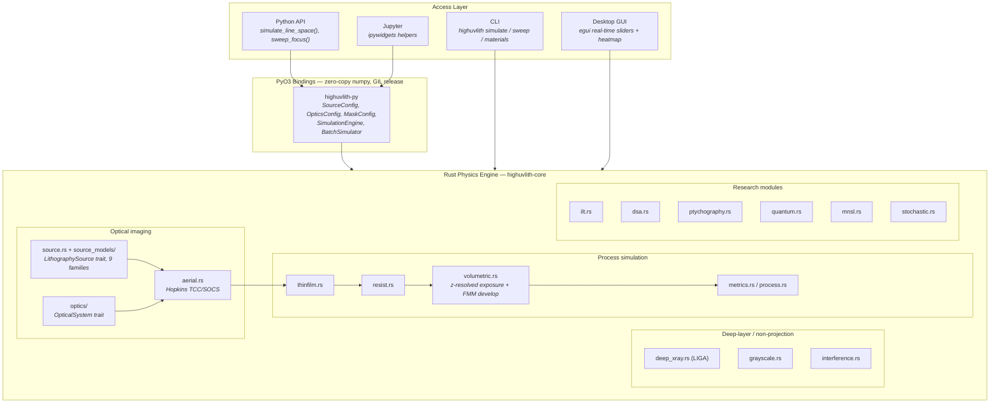
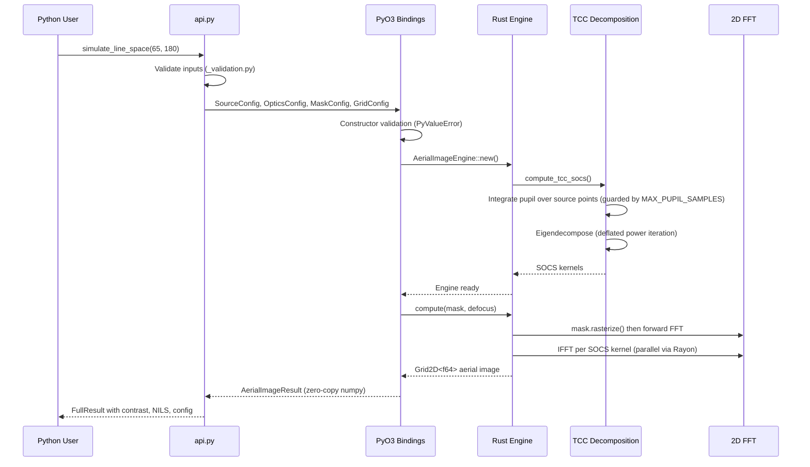
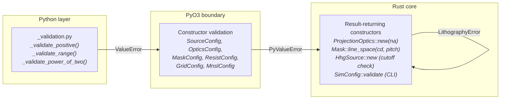

# Architecture

**Status:** ✅ Implemented — this page describes the code layout and layering as it exists in the repository today.

## Overview

highuvlith is a four-crate Cargo workspace with a Python package on top. All physics lives in one crate (`highuvlith-core`); the other three crates and the Python layer are deliberately thin adapters. The core pipeline is generic over three traits (source, optics, compute backend), so new hardware families slot in without touching the imaging code. For what each capability actually computes versus parameterizes, see the [capability matrix](./capability-matrix.md).

## Layering



Notes on honesty at the boundaries:

- The **aerial engine is scalar diffraction** (no polarization / vector high-NA effects) and guards pupil sampling density with `MAX_PUPIL_SAMPLES` so short wavelengths on fine grids fail loudly instead of exhausting memory ([aerial.rs](../crates/highuvlith-core/src/aerial.rs)).
- **`deep_xray.rs` bypasses the projection pipeline entirely** — LIGA is 1:1 proximity shadow printing with no pupil and no TCC; it consumes the synchrotron bending-magnet spectrum directly.
- **Polychromatic imaging** reuses the TCC built at the center wavelength and shifts focus per spectral sample — honest for narrow bands (Δλ/λ ≪ 1), not for wide combs.

## Workspace crates

| Crate | Role | Key contents |
|-------|------|--------------|
| [`highuvlith-core`](../crates/highuvlith-core) | Physics engine | Aerial imaging (Hopkins TCC/SOCS), 9 source families, 3 optical systems, thin-film TMM, Dill/Mack resist, volumetric exposure + fast-marching development, LIGA, grayscale, interference, research modules, materials DB |
| [`highuvlith-py`](../crates/highuvlith-py) | PyO3 bindings | Config wrapper classes, `SimulationEngine`, `BatchSimulator`; zero-copy numpy views; GIL released around compute |
| [`highuvlith-cli`](../crates/highuvlith-cli) | clap CLI | `simulate`, `sweep`, `materials` subcommands driven by TOML configs (see [configuration.md](./configuration.md)) |
| [`highuvlith-gui`](../crates/highuvlith-gui) | egui desktop app | Real-time parameter sliders, background compute thread, aerial heatmap |

## Data flow: Python call to Rust engine



## Validation layering

Every boundary validates independently, so a bad parameter is rejected at the outermost layer that can see it, with the innermost (Rust `Result`) as the last line of defense:



The CLI adds physics cross-checks on top of type validation: unknown `type` tags are rejected in `SimConfig::validate()` before any simulation work, undulator configs with an explicit `wavelength_nm` that disagrees with the resonance-derived value by more than 5% are rejected, and refractive optics selected below 50 nm produce a loud warning ([config.rs](../crates/highuvlith-cli/src/config.rs)).

## Project tree

```
highuvlith/
  Cargo.toml                         # Workspace: 4 Rust crates
  pyproject.toml                     # Maturin build + Python config
  crates/
    highuvlith-core/                 # Rust physics engine
      src/
        aerial.rs                    #   Hopkins TCC/SOCS aerial imaging (scalar)
        source.rs                    #   LithographySource trait, VuvSource, LpaFelSource,
                                     #   SourceKind enum + for_each_source! dispatch
        source_models/               #   Bleeding-edge source families
          physics.rs                 #     Shared formula layer (undulator resonance,
                                     #     critical energy, HHG cutoff, ICS kinematics)
          lpp.rs                     #     Laser-produced plasma (Sn/Gd/Tb)
          synchrotron.rs             #     Undulator + bending magnet (derived wavelength)
          hhg.rs                     #     High-harmonic generation (monochromatized/comb)
          xfel.rs                    #     SASE / self-seeded XFEL
          ics.rs                     #     Inverse Compton scattering
          ssmb.rs                    #     Steady-state microbunching
          entangled.rs               #     NOON-state source (theoretical)
        optics/                      #   OpticalSystem trait + implementations
          mod.rs                     #     Trait + refractive CaF2 ProjectionOptics
          zone_plate.rs              #     Fresnel zone plate (X-ray)
          schwarzschild.rs           #     Schwarzschild objective (EUV/BEUV)
        mask.rs                      #   Mask geometry + spectrum (incl. GrayRect)
        thinfilm.rs                  #   TMM: reflectance, exact intensity_profile()
        resist.rs                    #   Dill exposure + Mack development (2D path)
        volumetric.rs                #   z-resolved exposure, split-step bleaching,
                                     #   fast-marching 3D development
        deep_xray.rs                 #   LIGA proximity shadow printing (no pupil)
        grayscale.rs                 #   Contrast-curve 2.5D height maps
        interference.rs              #   Multi-beam interference + two-photon voxels
        process.rs                   #   Process window / Bossung analysis
        opc.rs                       #   Rule- and model-based OPC (no SRAF)
        double_patterning.rs         #   LELE double patterning
        stochastic.rs                #   Shot noise, Gamma dose jitter, LER/LWR
        ilt.rs                       #   Inverse lithography (proxy gradient)
        dsa.rs                       #   Directed self-assembly (analytic)
        ptychography.rs              #   ePIE coherent diffraction imaging
        quantum.rs                   #   Quantum lithography (theoretical)
        mnsl.rs                      #   Moire nanosphere lithographic reflection
        metrics.rs                   #   CD, NILS, contrast, MTF
        materials/                   #   Optical constants
          database.rs                #     VUV tabulated n,k + EUV entries (see materials.md)
          dispersion.rs              #     Sellmeier models
          attenuation.rs             #     X-ray mass attenuation (LIGA)
          diamond.rs                 #     Diamond substrate + X-ray window
          energy.rs                  #     eV <-> nm conversions
        math/                        #   2D FFT, Zernike, interpolation
        compute/                     #   ComputeBackend trait (CPU rayon; GPU planned)
        io/                          #   PNG/TIFF image export
        types.rs                     #   GridConfig, Grid2D, Grid3D, Polarization
      tests/                         #   analytical_validation.rs, proptest_physics.rs,
                                     #   test_mnsl.rs
      benches/                       #   Criterion benchmarks
    highuvlith-py/                   # PyO3 bindings (py_config.rs holds all factories)
    highuvlith-cli/                  # CLI (config.rs: TOML -> SourceKind/optics)
    highuvlith-gui/                  # egui desktop GUI
  python/highuvlith/                 # api.py, viz/, io/, interactive.py, _native.pyi
  tests/python/                      # pytest integration incl. test_stub_drift.py
  examples/                          # TOML configs + demo generators
```

## The three extension traits

### `LithographySource` — [source.rs](../crates/highuvlith-core/src/source.rs)

The pipeline consumes a source **only** through: `wavelength_nm()`, `spectral_weights()`, `intensity_at(fx, fy)` (pupil fill), `bandwidth_pm()`, and `photon_density_per_mj_cm2()` — plus pulse/coherence metadata (`shot_to_shot_rms()` feeds the stochastic module's Gamma dose jitter; `pulse_energy_j() × rep_rate_hz()` derives `average_power_w()`, reported through the bindings). Everything else a source struct stores is inert metadata until a consumer exists. Nine families implement the trait; the serde-tagged `SourceKind` enum type-erases them for the PyO3/CLI/GUI layers while the core pipeline stays generic via `impl LithographySource`. See [extending.md](./extending.md#a-adding-a-source-family) for the add-a-family recipe.

### `OpticalSystem` — [optics/mod.rs](../crates/highuvlith-core/src/optics/mod.rs)

A complex pupil function `pupil_function(fx, fy, defocus_nm, wavelength_nm) -> Complex64` plus `na()`, `reduction()`, `flare_fraction()`, and defaulted `chromatic_defocus()` / `cutoff_frequency()` / `rayleigh_resolution()`. Implementations: refractive CaF2 `ProjectionOptics` (Zernike aberrations, apodization, axial chromatic coefficient), `FresnelZonePlate` (strong chromatic dispersion Δf/f = Δλ/λ), `SchwarzschildObjective` (annular obscured pupil, multilayer reflectance as a scalar). Scalar pupil only — no polarization.

### `ComputeBackend` — [compute/](../crates/highuvlith-core/src/compute)

FFT/array backend abstraction. The CPU implementation (rustfft + rayon) is the only one; a wgpu GPU backend is 🗺️ planned ([roadmap.md](./roadmap.md)).

## Related pages

- [Simulation pipeline](./pipeline.md) — stage-by-stage physics
- [Research modules](./research-modules.md) — ILT, DSA, ptychography, quantum, MNSL, stochastic, double patterning, OPC
- [Extending highuvlith](./extending.md) — recipes for new sources, optics, and process modules
- [Capability matrix](./capability-matrix.md) — the single source of truth for status badges
