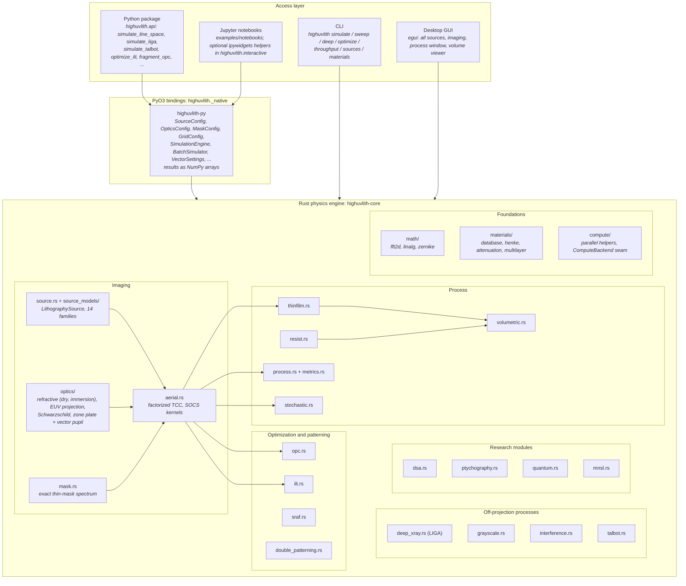
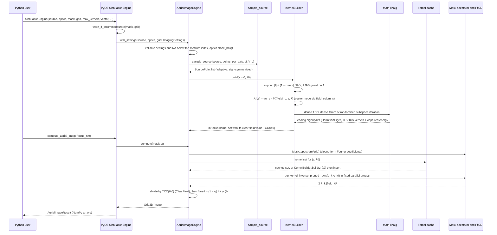
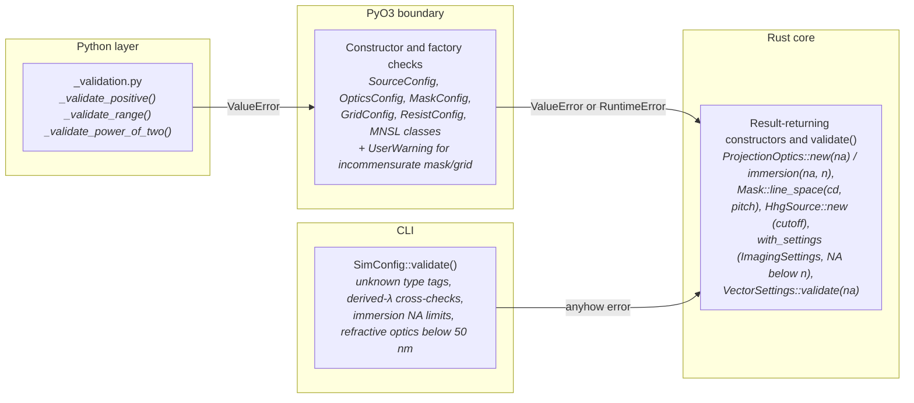

# Architecture

**Status:** ✅ Implemented — this page describes the code layout, the imaging data flow and the validation layering as they exist in the repository; what each capability computes versus approximates is graded in the [capability matrix](./capability-matrix.md).

## Overview

highuvlith is a four-crate Cargo workspace with a Python package on top. All physics lives in one crate, `highuvlith-core`; the other three crates and the Python layer are thin adapters. The imaging pipeline is generic over two traits — `LithographySource` (light sources) and `OpticalSystem` (pupil functions) — so a new source family or optic slots in without touching the imaging code. The engine constructor takes `impl LithographySource` and `impl OpticalSystem` arguments and keeps its own boxed clone of the optic (`Box<dyn OpticalSystem>`); the frontends carry the type-erased, serde-tagged `SourceKind` enum and `Box<dyn OpticalSystem>`. A third seam, `ComputeBackend`, exists as a trait with a CPU implementation but is not yet consumed by the engine (see [the trait section](#the-extension-traits)).

## Layering



Honest notes on the boundaries:

- **Thin mask everywhere.** The mask is a Kirchhoff thin complex transmittance; there is no mask-3D / EMF model ([mask.rs](../crates/highuvlith-core/src/mask.rs), [masks-and-metrics.md](./masks-and-metrics.md)).
- **Scalar imaging is exact up to the source discretization; vector imaging is opt-in.** `ImagingSettings::imaging_model = ImagingModel::Vector(VectorSettings)` switches the engine to the vector pupil of [optics/vector.rs](../crates/highuvlith-core/src/optics/vector.rs) ([vector-imaging.md](./vector-imaging.md)); Python reaches it through `SimulationEngine(..., vector=VectorSettings(...))`, the CLI through an `[imaging.vector]` table. The engine sets `VectorSettings::reduction` from the optic and requires `image_index` to equal the optic's immersion index (inheriting it when left at 1).
- **Images are relative intensity by default.** Every image is divided by the exact clear-field intensity `TCC(0,0)` of the same illumination, optics, wavelength and focus plane (`ImageNormalization::ClearField`), so a clear mask images to 1 before flare for any pupil — obscured, apodized, zone-plate efficiency or vector radiometric factor. `ImageNormalization::Absolute` skips the division, and `clear_field_intensity(z)` returns the factor. Dark-field configurations (clear field below 1 % of the pupil peak, e.g. an obscuration blocking the zero order) stay absolute and are flagged in the kernel diagnostics.
- **One image-space medium.** The defocus phase is evaluated in the medium of index `n` reported by `OpticalSystem::immersion_index()` (1 dry; water immersion via `ProjectionOptics::immersion(na, n)`), and the engine requires `NA < n`. Focus inside the resist (the resist index rather than the immersion fluid) is not modeled ([optics.md](./optics.md)).
- **EUV projection optics are a wafer-side model.** `EuvProjectionOptics` has an isotropic circular pupil with optional central obscuration (the 0.55-NA preset's obscuration of 0.2 NA is an assumed representative value); the anamorphic mask-side magnification and mask-3D effects are not modeled, and the multilayer angular response enters only through the opt-in multilayer pupil with user-supplied incidence-angle maps ([optics/euv.rs](../crates/highuvlith-core/src/optics/euv.rs), [optics/multilayer_pupil.rs](../crates/highuvlith-core/src/optics/multilayer_pupil.rs)).
- **Two polychromatic paths.** `compute_multiwavelength` rebuilds the kernels at every spectral sample (exact incoherent per-λ sum — the honest path for HHG combs and broadband sources); `compute_polychromatic` reuses the center-λ kernels and only shifts focus per sample (valid for Δλ/λ ≪ 1).
- **The simulation field is periodic.** Periodic masks must be commensurate with the field (`GridConfig::commensurate`, `Mask::commensurate_grid`); the Python engine constructors warn otherwise and the CLI adjusts the pixel by default.
- **Memory guard, not a sample-count cap.** `LithographyError::PupilSamplingTooDense` fires when the factor matrix `A` (mask frequencies × source columns) would exceed 1 GiB of complex entries.
- **Off-projection processes bypass the engine where the physics does.** [deep_xray.rs](../crates/highuvlith-core/src/deep_xray.rs) (LIGA) is 1:1 proximity shadow printing — no pupil, no TCC — driven by an X-ray spectrum (bending magnet, tabulated, or absolute flux density) with scalar Fresnel (angular-spectrum) diffraction over gap + depth; [talbot.rs](../crates/highuvlith-core/src/talbot.rs) propagates a grating's Fourier orders in free space (Talbot, DTL, ATL, two-grating EUV-IL); [interference.rs](../crates/highuvlith-core/src/interference.rs) superposes explicit plane waves.
- **Python boundary.** Every compute call releases the GIL (`py.allow_threads`); the large result arrays are zero-copy read-only NumPy views (`.copy()` to write) and small accessors are copies; [python-api.md](./python-api.md) is the authoritative page for the bindings.

## Workspace crates

| Crate | Role | Key contents |
|-------|------|--------------|
| [`highuvlith-core`](../crates/highuvlith-core) | Physics engine | Hopkins imaging with a factorized TCC (scalar or vector, relative or absolute intensity), 14 source families plus a throughput model, 4 optical systems, exact thin-mask spectra, thin-film TMM, Dill/Mack and CAR resist models, volumetric exposure with fast-marching and level-set development, LIGA, grayscale, interference, Talbot, OPC/SRAF/ILT/multiple patterning, research modules, materials data (Henke/CXRO, NIST) |
| [`highuvlith-py`](../crates/highuvlith-py) | PyO3 bindings | The `highuvlith._native` extension module (config classes, `SimulationEngine`, `BatchSimulator`, result classes, deep-layer, X-ray, vector and optimization functions); the Python package lives in [`python/highuvlith/`](../python/highuvlith) |
| [`highuvlith-cli`](../crates/highuvlith-cli) | clap CLI | `simulate` (one dose/focus condition), `sweep` (dose/focus process window), `deep` (`[deep] mode` = `liga`, `grayscale`, `interference`, `volumetric`, `talbot`), `materials` (optical-constant queries), all driven by TOML files ([configuration.md](./configuration.md), [cli.md](./cli.md)) |
| [`highuvlith-gui`](../crates/highuvlith-gui) | egui desktop app | All 14 source families with badges and derived quantities, optics and imaging settings, a dose-aware process window, a volume viewer (z-slice and x–z sections of volumetric resist, LIGA dose and Talbot carpets) and PNG export, computed on a background thread; its automatic optics are refractive at 110 nm and above and EUV projection optics below ([gui.md](./gui.md)) |

Cargo features of the core: `parallel` (Rayon, default) and `image-export` (PNG/TIFF via `image`, default). `cargo test -p highuvlith-core --no-default-features` builds and runs the serial, export-free configuration (CI runs it).

## Module map

```text
highuvlith/
  Cargo.toml                       # workspace: 4 crates
  pyproject.toml                   # maturin build of highuvlith._native + Python package metadata
  mkdocs.yml                       # documentation site (MkDocs Material)
  crates/
    highuvlith-core/               # Rust physics engine
      src/
        lib.rs                     #   crate root: module list, conventions, doc example
        aerial.rs                  #   Hopkins imaging: adaptive source sampling, TCC = A·Aᴴ,
                                   #   SOCS kernels cached per (focus, λ), scalar or vector
                                   #   columns, clear-field normalization, exact per-λ imaging
        source.rs                  #   LithographySource trait, DerivedQuantity, pupil and
                                   #   spectral shapes, VuvSource (Hg g/h/i, KrF, ArF, F2,
                                   #   Ar2 presets), LpaFelSource, SourceKind + for_each_source!
        source_models/
          physics.rs               #     shared machine-parameter physics (CODATA constants,
                                   #     undulator harmonics, Kim flux, BM flux, 1D/Ming-Xie
                                   #     FEL, Thomson yield, HHG ionization ...) + fixtures
          throughput.rs            #     dose-limited wafers/hour from average_power_w()
          lpp.rs                   #     Sn / Gd / Tb laser-produced plasma, power at IF
          synchrotron.rs           #     undulator (sinc² line, flux, coherence) and bending
                                   #     magnet; wavelength derived from the machine
          hhg.rs                   #     high-harmonic generation: cutoff law, comb, efficiency
          xfel.rs                  #     SASE / self-seeded FEL, Pierce ρ derived from machine
          ics.rs                   #     inverse Compton: kinematics, derived photon yield
          ssmb.rs                  #     steady-state microbunching, coherent power derived
          entangled.rs             #     NOON-state source (theoretical), ETPA exposure time
          xray_tube.rs             #     Kramers continuum + lines, Be window, absolute flux
          dpp.rs                   #     discharge-produced plasma (Xe / Sn) to IF
          sxrl.rs                  #     plasma soft-X-ray lasers (fixed lasing lines)
          betatron.rs              #     laser-wakefield betatron X-rays
          smith_purcell.rs         #     Smith–Purcell free-electron grating
        optics/
          mod.rs                   #     OpticalSystem trait, defocus_phase(_in_medium),
                                   #     refractive ProjectionOptics (dry or immersion;
                                   #     Zernike, apodization, chromatic defocus)
          euv.rs                   #     EUV projection optics: NA 0.33 / 0.55, central
                                   #     obscuration (isotropic wafer-side pupil)
          multilayer_pupil.rs      #     opt-in angle-dependent multilayer amplitude/phase
                                   #     across a mirror pupil (user angle maps)
          vector.rs                #     vector pupil: TE/TM per order, radiometric factor,
                                   #     image-medium index, film-entrance Fresnel
          zone_plate.rs            #     Fresnel zone plate (cutoff 1/(2Δr_N), chromatic)
          schwarzschild.rs         #     two-mirror reflective objective (annular pupil,
                                   #     constant reflectivity or multilayer pupil)
        mask.rs                    #   thin mask: exact analytic spectrum, periodic LineSpace /
                                   #   RectArray, commensurability, antialiased raster
        types.rs                   #   GridConfig (+ commensurate), Grid2D, Grid3D, Polarization
        error.rs                   #   LithographyError (incl. PupilSamplingTooDense)
        metrics.rs                 #   sub-pixel CD / ILS / NILS / MEEF, tone-aware periodic
        process.rs                 #   dose-aware process window: FEM, Bossung, ED window,
                                   #   EL-vs-DOF, batch_defocus
        thinfilm.rs                #   transfer-matrix stack: R, T, r, t at any angle, exact
                                   #   in-film intensity S(z)
        resist.rs                  #   Dill exposure, Mack / threshold develop (depth-averaged
                                   #   2D); exact anisotropic PEB diffusion, CAR bake
        volumetric.rs              #   z-resolved exposure I_aer × S(z), split-step bleaching,
                                   #   3D PEB (Gaussian or CAR), development by threshold,
                                   #   fast marching or level set (surface inhibition, ageing)
        deep_xray.rs               #   LIGA: spectral depth dose (μ, μ_en), absolute exposure
                                   #   time, Fresnel proximity diffraction
        grayscale.rs               #   contrast-curve 2.5D height maps, mask synthesis
        interference.rs            #   multi-beam interference lattices, two-photon voxels
        talbot.rs                  #   Talbot / DTL / ATL self-imaging, two-grating EUV-IL
        stochastic.rs              #   Poisson shot noise, Gamma dose jitter, LER/LWR Monte Carlo
        opc.rs                     #   rule, uniform model-based and fragment model-based OPC;
                                   #   exact-imaging helpers shared with ILT / SRAF
        sraf.rs                    #   rule-based SRAF placement, model print check, DOF study
        ilt.rs                     #   pixel ILT with the exact adjoint gradient through SOCS
        double_patterning.rs       #   LELE through the engine, geometric SADP / SAQP
        dsa.rs                     #   analytic block-copolymer morphologies (not SCFT)
        ptychography.rs            #   ePIE object + probe reconstruction
        quantum.rs                 #   classical N-photon absorption vs ideal N00N fringes
                                   #   and the λ/N limit (theoretical)
        mnsl.rs                    #   moiré nanosphere (MNSL) emission-pattern model
        materials/
          database.rs              #     n + ik by name and λ: Sellmeier crystals, tabulated
                                   #     VUV, Henke-derived EUV/BEUV, "henke:<formula>"
          dispersion.rs            #     Sellmeier model
          henke.rs                 #     CXRO f1/f2 → δ, β, n for any formula and density
          henke_data/              #     24 embedded CXRO .nff tables
          attenuation.rs           #     NIST μ/ρ and μ_en/ρ + Henke below 1 keV; compounds
          multilayer.rs            #     EUV/BEUV Bragg mirrors (Parratt + Névot–Croce, s/p)
          diamond.rs               #     diamond substrate and X-ray window
          energy.rs                #     eV ↔ nm conversions
        math/
          fft2d.rs                 #     cached, batched 2D FFT; pruned inverse rows
          linalg.rs                #     ColMatrix, HermitianEigen, randomized eigensolver
          zernike.rs               #     Fringe Zernike polynomials
          interpolation.rs         #     bilinear interpolation
        compute/
          mod.rs                   #     ComputeBackend trait (GPU seam, not yet consumed)
          cpu.rs                   #     CpuBackend over Fft2D
          parallel.rs              #     Rayon-or-serial map_range / fold_range / chunks
        io/image_export.rs         #   PNG / TIFF export (feature image-export)
      tests/
        analytical_validation.rs   #   closed forms: Fresnel, Brewster, AR, 3-beam image
        imaging_validation.rs      #   SOCS ≡ independent Abbe sum, resolution, DOF, determinism
        imaging_optics_presets.rs  #   immersion, EUV presets, clear-field normalization,
                                   #   multilayer pupil
        vector_pupil.rs            #   vector pupil closed forms (TE/TM, obliquity, film)
        vector_imaging.rs          #   engine-level vector imaging
        proptest_physics.rs        #   property tests on thin-film reflectance
        test_mnsl.rs               #   MNSL integration tests
      benches/aerial_benchmark.rs  #   Criterion: engine creation, one image, focus sweep, comb
    highuvlith-py/src/
      lib.rs                       #   registers the _native module
      py_config.rs                 #   SourceConfig factories, OpticsConfig, MaskConfig,
                                   #   ResistConfig, FilmStackConfig, ProcessConfig, GridConfig
      py_simulation.rs             #   SimulationEngine
      py_results.rs                #   AerialImageResult, ResistProfileResult
      py_sweep.rs                  #   BatchSimulator, ProcessWindowResult
      py_volumetric.rs             #   volumetric (level set, PEB), LIGA (simulate_liga),
                                   #   grayscale, interference, quantum, Talbot, EUV-IL
      py_xray.rs                   #   liga_edge_profile, MultilayerMirror, xray_optical_constants
      py_vector.rs                 #   VectorSettings + pupil-level vector helpers
      py_optim.rs                  #   ILT, fragment OPC, SRAF, SADP / SAQP
      py_mnsl.rs                   #   MNSL classes
    highuvlith-cli/src/
      main.rs                      #   clap: simulate / sweep / deep / optimize / throughput / sources / materials
      config.rs                    #   TOML → SourceKind, optics, mask, commensurate grid, [imaging]
      commands/                    #   deep.rs, materials.rs, optimize.rs, simulate.rs, sources.rs, sweep.rs, throughput.rs
    highuvlith-gui/src/            #   app.rs, panels.rs, views.rs, volume.rs (egui UI); compute.rs, jobs.rs (background compute)
  python/highuvlith/               # api.py (one-call wrappers), viz/, io/, mnsl.py,
                                   # interactive.py, _validation.py, _native.pyi (type stubs)
  tests/python/                    # pytest suite incl. test_stub_drift.py
  examples/                        # sim_*.toml per source family, liga / volumetric /
                                   # grayscale / interference / talbot.toml, notebooks/, scripts
  docs/                            # technical pages ("Simulator" section of the site),
                                   # narrative sections (history/, nodes/, future/),
                                   # playground/, and site plumbing (hooks/, includes/,
                                   # overrides/, stylesheets/, javascripts/)
  scripts/check_docs_math.py       # GitHub-safe math linter for the docs
  .github/workflows/               # ci.yml, release.yml (wheels), pages.yml (GitHub Pages)
```

## Data flow: factorized TCC and SOCS imaging

The aerial engine never builds the frequency² TCC entry by entry. It samples the source, assembles the factor `A` and decomposes the smaller of the two Gram matrices:

```math
\mathrm{TCC} = A A^{\dagger}, \qquad
A_{f s} = \sqrt{w_s}\; P\!\left(\frac{f + s}{f_c};\, z, \lambda\right), \qquad
I(x) = \frac{1}{I_{\mathrm{clear}}} \sum_k \lambda_k \left| \mathcal{F}^{-1}\!\left[ u_k(f)\, M(f) \right](x) \right|^2
```

with `f_c = NA/λ`, mask frequencies kept out to `|f| ≤ (1 + σ_max)·f_c`, `M(f)` the exact mask spectrum and `I_clear = TCC(0,0)` (omitted in absolute mode). The sequence for a Python call:



What each step guarantees:

- **Source sampling** (`aerial::sample_source`). The pupil fill is probed on a 129² lattice over σ ∈ [−2, 2]², zoomed until the support spans at least 24 cells per axis, then integrated over the cells of a square lattice (step ≤ 0.04 σ, ≳ 200 cells in the support) rotated by atan(1/φ) so no row of points is parallel to an axis. Edge cells carry their exact area weight at their intensity centroid, peaked (Gaussian) fills are refined until no point carries more than ~1/200 of the intensity, and the point set is exactly mirror-symmetric for symmetric boxes. `source_points_per_axis = Some(n)` uses a plain n × n midpoint grid; `Some(1)` or a tiny source collapses to one coherent point. The points are inspectable through `AerialImageEngine::source_points()`.
- **Decomposition choice** (`KernelBuilder::build`). With `n_f` kept mask frequencies and `n_c` source columns (× 3 or 6 in vector mode): dense eigensolution of the smaller Gram matrix — the TCC itself when `n_f ≤ n_c`, else `AᴴA` with `u_k = A v_k / √λ_k` — when `min(n_f, n_c) ≤ 320` (or ≤ 1536 when the requested subspace is at least a third of it); otherwise randomized subspace iteration (`max_kernels + 16` columns, 3 power iterations, fixed seed). The dense solver is the in-tree `math::linalg::HermitianEigen` (Householder tridiagonalization + implicit QL); `nalgebra`'s `SymmetricEigen` returned wrong eigenvectors for some complex Hermitian inputs and is not used. `kernel_energy_fraction` and `max_kernels` truncate the SOCS sum, and the captured energy `Σλ_k / ‖A‖_F²` is reported with every kernel set (`imaging_diagnostics()` in Python).
- **Focus and wavelength.** Under the default `DefocusModel::Exact` the defocus phase is evaluated inside the pupil at every source point, so a new focus plane means a new kernel set; sets are cached per (z, λ) in a bounded cache (`kernel_cache_capacity`, default 32). `DefocusModel::KernelPhase` keeps the legacy on-axis phase per mask frequency (wrong for off-axis illumination through focus). `compute_through_focus` computes the spectrum once and the planes in parallel; `compute_multiwavelength` builds one kernel set per spectral sample at focus `z + chromatic_defocus(λ_i − λ₀)`.
- **Determinism.** The SOCS sum splits the kernels into a fixed number of contiguous groups and adds the group images in index order, so images are bit-reproducible regardless of thread scheduling (`concurrent_use_is_deterministic`).
- **Consumers.** `process.rs` (process windows via `compute_through_focus`), `volumetric.rs` (focus planes through the resist) and the optimization modules (`opc.rs`, `sraf.rs`, `ilt.rs`, which read the same kernels through `AerialImageEngine::kernels(z)`) all sit on this engine.

## Validation layering

### Input validation

Every boundary validates independently, so a bad parameter is rejected at the outermost layer that can see it, with the Rust `Result` as the last line of defense:



The CLI adds physics cross-checks on top of type validation: `SimConfig::validate()` builds the source and optics before any simulation work, so unknown `type` tags are rejected, a configured `wavelength_nm` that disagrees with a machine-derived wavelength (undulator resonance, Compton kinematics) by more than 5 % is rejected, an immersion NA above 0.95 × the medium index is rejected, and refractive optics selected below 50 nm produce a loud warning ([config.rs](../crates/highuvlith-cli/src/config.rs)). Grids are made commensurate with periodic masks unless `[grid] commensurate = false`.

### Physics validation

| Tier | Where | What it pins |
|------|-------|--------------|
| Unit fixtures | inline `#[cfg(test)]` in every core module | Closed-form fixtures computed independently of the implementation (NumPy/SciPy/mpmath, CXRO and NIST tables), limits and scaling laws, constructor rejection of bad input |
| Analytical validation | [tests/analytical_validation.rs](../crates/highuvlith-core/tests/analytical_validation.rs) | Fresnel reflectance, Brewster angle, quarter-wave AR, defocus symmetry, energy conservation, the coherent three-beam grating image in closed form |
| Imaging validation | [tests/imaging_validation.rs](../crates/highuvlith-core/tests/imaging_validation.rs), [tests/imaging_optics_presets.rs](../crates/highuvlith-core/tests/imaging_optics_presets.rs) | All-kernel SOCS equals an independent direct Abbe sum to ≤ 1e-8 relative (dense-TCC, Gram, aberrated and att-PSM cases, in and out of focus), partial-coherence resolution limit, dipole depth of focus, unit clear field, per-λ sum, determinism under concurrency; immersion and High-NA resolution gains, defocus in the medium, dark-field detection for obscured pupils |
| Vector physics | [tests/vector_pupil.rs](../crates/highuvlith-core/tests/vector_pupil.rs), [tests/vector_imaging.rs](../crates/highuvlith-core/tests/vector_imaging.rs) | Two-beam TE/TM/unpolarized closed forms, the radiometric-factor energy statement, Fresnel film entrance; engine-level TE vs TM contrast, the clear-field invariant with obliquity on, and the NA² approach to scalar imaging |
| Property-based | [tests/proptest_physics.rs](../crates/highuvlith-core/tests/proptest_physics.rs) | Thin-film reflectance bounds and monotonicity over random stacks |
| Python | [tests/python/](../tests/python) | Binding round trips, API wrappers, error mapping, physics fixtures from Python, and `test_stub_drift.py` (every `_native` member must appear in `_native.pyi`) |
| Examples | CI `notebooks` job | The example notebooks execute headlessly |
| Docs | CI docs jobs | `**Status:**` line on every technical page, offline link check, GitHub-safe math lint, strict MkDocs build |

## The extension traits

### `LithographySource` — [source.rs](../crates/highuvlith-core/src/source.rs)

The pipeline consumes a source **only** through the trait: the required `wavelength_nm()`, `bandwidth_pm()`, `intensity_at(fx, fy)` (pupil fill) and `spectral_weights()`, plus defaulted `photon_energy_ev()`, `photon_density_per_mj_cm2()` (shot-noise photon counts), pulse metadata (`pulse_energy_j`, `rep_rate_hz`, `pulse_duration_s`), `average_power_w()` (usable power into the illuminator — in-band at intermediate focus for plasma sources; the input of `source_models::throughput`), `transverse_coherence()`, `shot_to_shot_rms()` (Gamma dose jitter in `stochastic.rs`) and `derived_quantities()`. The last returns `DerivedQuantity { name, value, unit, note }` records derived from machine parameters (flux, Pierce parameter, photon yield, ...); they are informational — printed by `highuvlith simulate`, written to its JSON, and exposed as `SourceConfig.derived_quantities()` in Python — and never read by the imaging pipeline. Everything else a source struct stores is inert metadata until a consumer exists. The serde-tagged `SourceKind` enum type-erases the families for the PyO3, CLI and GUI layers; `for_each_source!` keeps its dispatch to one line per method. See [extending.md](./extending.md#a-adding-a-source-family) and [sources/index.md](./sources/index.md).

### `OpticalSystem` — [optics/mod.rs](../crates/highuvlith-core/src/optics/mod.rs)

A complex scalar pupil `pupil_function(fx, fy, defocus_nm, wavelength_nm)` in coordinates normalized to `cutoff_frequency(λ)` (magnitude = transmission/apodization, phase = aberrations + defocus, zero outside the pupil, no chromatic focus shift — the engine adds `chromatic_defocus()` itself), plus `na()`, `reduction()`, `flare_fraction()` and the required `clone_box()` (the engine keeps its own boxed copy to rebuild kernels at new focus planes and wavelengths). Defaulted: `chromatic_defocus()`, `cutoff_frequency()` (`NA/λ`; the zone plate overrides it with the λ-independent `1/(2Δr_N)`), `immersion_index()` (1; the image-space medium used for the defocus phase and required to exceed the NA) and `rayleigh_resolution()`. The in-tree optics evaluate defocus with the shared `optics::defocus_phase_in_medium()` / `defocus_phase()` (exact plane-wave form, paraxial behind a `paraxial_defocus` flag). Vector imaging layers on top without any optic-specific code: for every non-zero scalar pupil value the engine calls `vector::field_columns(pupil, px, py, sx, sy, na_eff, &settings, out)` with `na_eff = cutoff_frequency(λ)·λ`. Implementations: `ProjectionOptics` (refractive, dry or immersion), `EuvProjectionOptics`, `SchwarzschildObjective`, `FresnelZonePlate` ([optics.md](./optics.md)).

### `ComputeBackend` — [compute/mod.rs](../crates/highuvlith-core/src/compute/mod.rs)

A two-method FFT trait (`fft2d_forward`, `fft2d_inverse`) with one implementation, `CpuBackend`, wrapping `math::fft2d::Fft2D`. **Nothing is generic over it yet**: the imaging engine calls `Fft2D` directly and parallelizes through `compute::parallel` (`map_range`, `fold_range`, `for_each_chunk_mut`, which compile to Rayon or to serial loops). It is the intended seam for a GPU backend, which is 🗺️ planned ([roadmap.md](./roadmap.md)).

## Related pages

- [Simulation pipeline](./pipeline.md) and [Optical systems](./optics.md) — stage-by-stage physics
- [Vector imaging](./vector-imaging.md) and [Masks & metrics](./masks-and-metrics.md) — the vector pupil and the exact mask spectrum
- [Sources](./sources/index.md) and [Processes](./processes/index.md) — the family and process indexes
- [Research modules](./research-modules.md) — ILT, OPC, SRAF, multiple patterning, DSA, ptychography, quantum, MNSL, stochastic
- [Extending highuvlith](./extending.md) — recipes for new sources, optics and process modules
- [Capability matrix](./capability-matrix.md) — the single source of truth for status badges
- [CONTRIBUTING.md](../CONTRIBUTING.md) — build, test, lint and docs workflow
