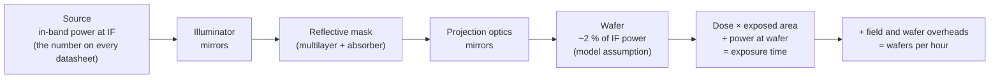
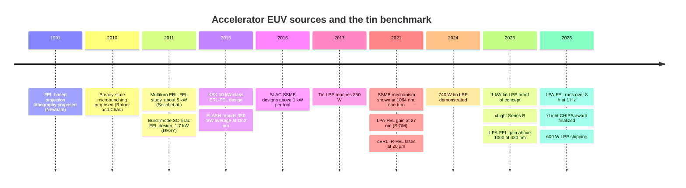

# Accelerator light sources for lithography

Every EUV scanner in a fab today gets its light from a tin plasma. A CO₂ laser hits
tin droplets tens of thousands of times a second, and a multilayer collector gathers
the 13.5 nm emission. That source is a feat of engineering, and it has been scaled
from a few watts to hundreds of watts of in-band power. It is also a machine
that turns kilowatts of laser light into a small fraction of EUV. Its own debris
and heat limit it.

Particle accelerators make light differently. A relativistic electron beam in an
undulator radiates at a wavelength set by its energy and the magnet period. When the
electrons are bunched on the scale of that wavelength, they radiate coherently, and the
power grows as the square of the number of electrons. This is the free-electron laser
(FEL) principle. It has led to a series of proposals to feed EUV lithography, or whole
fabs, from accelerators: linac and energy-recovery-linac FELs, storage rings with
steady-state microbunching, inverse Compton scattering, and plasma-based accelerators
small enough for a laboratory.

This page covers what each approach is, what has actually been demonstrated and at what
power, and what is still on paper. It also covers what highuvlith's source models can
and cannot tell you about each one. The yardstick throughout is the production tin
source, because that is the target every accelerator source has to beat.

## Readiness at a glance

| Technology | Readiness (as of Sep 2026) | highuvlith model |
|---|---|---|
| Tin laser-produced plasma, 250–600 W (the benchmark) | In production | ✅ [`lpp`](../sources/lpp.md): drive power × conversion efficiency × collection → power at IF |
| Tin LPP at 1 kW | Demonstrated in the lab (proof of concept, April 2025) | ✅ same model; the power is a parameter, not a prediction |
| Linac SASE FELs at EUV wavelengths (FLASH, FERMI) | Demonstrated in the lab (user facilities, sub-watt average) | ✅ [`xfel`](../sources/xfel.md) FLASH-like and FERMI-like presets |
| Kilowatt FELs for lithography: superconducting linac, energy-recovery linac (ERL) | Proposed (design study); the ERL lasing principle was shown in the infrared at KEK's cERL | 🧪 `xfel_cw_sc_13nm5()` and `xfel_erl_13nm5()` projection presets |
| xLight fab-scale FEL | Announced / in development | 🧪 no dedicated model; the ERL preset is the closest proxy |
| Steady-state microbunching (SSMB) ring | Demonstrated in the lab (mechanism only, 1064 nm, one turn); EUV source Proposed (design study) | 🧪 [`ssmb`](../sources/ssmb.md): coherent power derived from current and bunching factor |
| Inverse Compton scattering (ICS) at 13.5 nm | Theoretical / speculative (compact ICS sources exist only for hard X-rays) | 🧪 [`ics`](../sources/inverse-compton.md): kinematics exact, yield derived |
| Laser-plasma-accelerator FEL (LPA-FEL) | Demonstrated in the lab (27 nm SASE gain; stable 420 nm operation) | 🔶 [`lpa_fel`](../sources/lpa-fel.md): spectrum and jitter live, FEL physics estimated |
| Laser-wakefield betatron X-rays | Demonstrated in the lab (keV X-rays for imaging, not lithography) | 🧪 [`betatron`](../sources/betatron.md) |

Badges follow the [capability matrix](../capability-matrix.md). They grade the
*simulator model*, not the technology: a ✅ model of a source that does not yet exist is
still a model of a source that does not yet exist.

## The bar to clear: power at intermediate focus

Scanners are specified by dose and throughput, and source makers by in-band power at
the *intermediate focus* (IF). IF is the focal point where the collector hands the light
to the scanner's illuminator. The history of the tin source shows how fast that bar has
moved:

- **250 W** was demonstrated in 2017 and then became the production standard. ASML's
  2017 source paper reports an NXE:3400B running at 207 W and 126 wafers per hour
  [1]. In 2019, ASML authors described the 250 W source as giving a throughput
  capability "exceeding 140 wafers per hour at a dose of 20 mJ/cm²" [2].
- **500 W** is ASML's stated source for the NXE:3800E, which is rated at 220 wafers per
  hour at 30 mJ/cm². ASML also reported **740 W** demonstrated, with "measures identified
  to reach >1000W" [3].
- **1,000 W** was demonstrated in April 2025, according to ASML's annual report [4]. When
  ASML made this public in February 2026, it described the source as working "under all
  the same requirements that you could see at a customer." It said 600 W was its highest-power industrial source, and saw "a reasonably clear
  path toward 1,500 watts, and no fundamental reason why we couldn't get to 2,000 watts"
  [5, 6]. ASML expects this advance to lift output to about 330 wafers per hour per machine
  by 2030, up from 220 today [5].

So the target an accelerator source must beat is **not** 250 W any more. It is a tin
source heading for 1–2 kW per scanner. More power is wanted for dose more than for
speed. Photon shot noise pushes doses up as features shrink (see the
[stochastic frontier](stochastic-frontier.md)), and at a fixed dose throughput grows with
power until stage and wafer-handling overheads take over.

### Where the watts go

Only a small fraction of the power at IF reaches the resist. highuvlith's dose-limited
throughput model (🔶, `source_models/throughput.rs`, exposed as
`SourceConfig.wafer_throughput()`) makes the chain explicit. By default it assumes ten
multilayer mirrors at 70 % reflectance each and a mask efficiency of 0.65. These are
stated assumptions, not a vendor optical budget; see [Beyond EUV](beyond-euv.md) for
measured multilayer reflectances. Under them:

```math
T_\text{IF→wafer} = 0.70^{10} \times 0.65 \approx 1.8\,\%
\qquad\Rightarrow\qquad
250\ \text{W at IF} \;\to\; \approx 4.6\ \text{W on the wafer.}
```

At 30 mJ/cm² a 300 mm wafer with 84 full fields of 26 mm × 33 mm needs about
$30\ \text{mJ/cm}^2 \times 721\ \text{cm}^2 \approx 22$ J. That is roughly 5 s of
exposure at 4.6 W. Add the model's default overheads (0.1 s per field and 10 s per wafer)
and the result is about 150 wafers per hour. Doubling the source power only halves the
5 s. This is why the source roadmap is framed around higher dose at the same
productivity, not just more wafers.



<figure markdown="span">


<figcaption>Power becomes throughput (the accelerator page's example, swept over dose): <code>wafer_throughput()</code> with its defaults (ten mirrors at 0.70, mask 0.65, 84 fields, 0.1 s per field and 10 s per wafer). The ERL curve spreads one source over 16 scanners by multiplying each wafer's exposure time by 16 — the page's back-of-envelope sharing, not a feature of the code. Model: dose-limited throughput 🔶; SSMB and ERL powers are projections.</figcaption>
</figure>

## The landscape in one chart

<figure markdown="span">
  { width="860" }
  { width="860" }
  <figcaption>Reported average power versus wavelength, with production, demonstrated and projected (design-study) values marked differently. Every point comes from a cited source. The EUV points are in-band power at IF unless marked. Discharge-plasma (DPP) points are into 2π sr at the source, which is several times more than reaches IF. The shaded band is the 250 W → 1 kW requirement at 13.5 nm. Own work, generated by docs/figures/future/make_future_figures.py from a sourced dataset kept next to the script.</figcaption>
</figure>

??? info "Data: the accelerator-relevant points (with sources)"

    | Source | λ (nm) | Reported average power | Status | Ref. |
    |---|---|---|---|---|
    | ASML tin LPP (NXE:3400B source) | 13.5 | 250 W at IF | Production (from 2017) | [1] |
    | ASML tin LPP (NXE:3800E) | 13.5 | 500 W | Production | [3] |
    | ASML tin LPP, highest-power industrial source | 13.5 | 600 W | Production (per ASML, 2026) | [5, 6] |
    | ASML tin LPP, research source | 13.5 | 740 W | Demonstrated (2024) | [3] |
    | ASML tin LPP, proof of concept | 13.5 | 1,000 W | Demonstrated (April 2025) | [4, 5] |
    | ASML roadmap | 13.5 | 1,500–2,000 W | Projected | [5] |
    | FLASH (DESY), SASE | 18.2 | 0.35 W (80 µJ × 4300 pulses/s) | Demonstrated | [8] |
    | SIOM laser-wakefield FEL | 27 | ≈150 nJ per shot (maximum) | Demonstrated | [25] |
    | Multiturn ERL FEL study | 13.5 | ≈5 kW | Proposed (design study) | [10] |
    | DESY burst-mode SC-linac FEL | 13.5 | 1.7 kW | Proposed (design study) | [11] |
    | KEK ERL-FEL | 13.5 | 9 kW at 9.75 mA (11 kW with 10 % taper); 18 kW at 19.5 mA (22 kW tapered) | Proposed (design study, simulated) | [13] |
    | xLight FEL | 2–70 (tunable) | 120 kW output → 38 kW at IF for 16 scanners | Announced (company design) | [17] |
    | SLAC SSMB design (EUV case) | 13.7 | 1.12 kW per tool | Proposed (design study) | [21] |
    | Tsinghua SSMB-EUV target | 13.5 | > 1 kW per tool | Proposed (target) | [23] |
    | highuvlith ICS design point | 13.5 | 71 µW in a 2 % band | Simulator projection | [ics](../sources/inverse-compton.md) |

    The full chart dataset (DUV lasers, discharge plasmas, HHG and soft-X-ray lasers
    as well) lives next to the figure script. HHG and table-top lasers are discussed
    on [Quantum and exotic lithography](quantum-and-exotic.md).

At 13.5 nm the points pile on top of each other, so the second chart spreads them out by
source class, with production, demonstrated and projected values on separate rows.

<figure markdown="span">
  ![Horizontal dot plot of average power at 13.5 nanometres by source class. Tin laser-produced plasma: in production from 250 W in 2017 to 600 W in 2026, demonstrated from 125 W to 1 kW in 2025, roadmap 1.5 to 2 kW. Discharge plasma: xenon metrology lamps of 10 to 40 W into 2 pi, about 20 W at intermediate focus on an NXE:3100 in 2011, and 200 W to 1 kW into 2 pi at the source in the lab. Linac and ERL free-electron lasers: FLASH 20 mW at 13.7 nm demonstrated; designs from 1.7 kW to 38 kW. SSMB: no EUV power demonstrated; designs of 1 to 4 kW. Synchrotron undulator beamline: 11 mW. High-harmonic generation: 0.4 to 1 microwatt. A shaded band marks the 250 W to 1 kW requirement.](../assets/images/future/source-landscape-euv-light.svg#only-light){ width="860" }
  ![Horizontal dot plot of average power at 13.5 nanometres by source class. Tin laser-produced plasma: in production from 250 W in 2017 to 600 W in 2026, demonstrated from 125 W to 1 kW in 2025, roadmap 1.5 to 2 kW. Discharge plasma: xenon metrology lamps of 10 to 40 W into 2 pi, about 20 W at intermediate focus on an NXE:3100 in 2011, and 200 W to 1 kW into 2 pi at the source in the lab. Linac and ERL free-electron lasers: FLASH 20 mW at 13.7 nm demonstrated; designs from 1.7 kW to 38 kW. SSMB: no EUV power demonstrated; designs of 1 to 4 kW. Synchrotron undulator beamline: 11 mW. High-harmonic generation: 0.4 to 1 microwatt. A shaded band marks the 250 W to 1 kW requirement.](../assets/images/future/source-landscape-euv-dark.svg#only-dark){ width="860" }
  <figcaption>The 13.5 nm column of the chart above, by source class (rows within a class: in production, demonstrated, projected). Every point is a sourced row of the same dataset; the xLight point is a company design shared by 16 scanners. Own work, generated by docs/figures/future/make_future_figures.py.</figcaption>
</figure>

The chart spans more than ten orders of magnitude, which says most of what needs saying.
The accelerator sources that *exist* at EUV wavelengths are FEL user facilities. They
deliver milliwatts to a fraction of a watt, averaged over time, and are built for
peak brightness, not average power. The accelerator sources that would *beat* tin exist
only as design studies. Laser-plasma and inverse-Compton sources, the "compact" options,
sit many orders of magnitude further down.

## Free-electron lasers: from user facility to fab utility

### The physics in four equations

An electron with Lorentz factor $\gamma$ crossing a planar undulator of period
$\lambda_u$ and strength $K$ emits on axis at the resonant wavelength

```math
\lambda = \frac{\lambda_u}{2\gamma^2}\left(1 + \frac{K^2}{2}\right).
```

Because $\lambda \propto 1/\gamma^2$, 13.5 nm from a centimetre-period undulator needs
electrons of a few hundred MeV to about 1 GeV. The designs below use 0.5–1.25 GeV.
In a long enough undulator the radiation and the beam interact. The radiation
modulates the electrons' energy, the energy modulation becomes density modulation
(*microbunching*), and the bunched beam radiates coherently. Started from the beam's own
shot noise, this is self-amplified spontaneous emission (SASE). Its gain and
bandwidth are set by the Pierce parameter $\rho$ (typically $10^{-3}$ at these
wavelengths), which also sets the efficiency [7]:

```math
L_g \simeq \frac{\lambda_u}{4\pi\sqrt{3}\,\rho}, \qquad
\frac{\Delta\lambda}{\lambda} \simeq 2\rho, \qquad
P_\text{FEL,sat} \simeq \rho\,P_\text{beam}.
```

The last relation is the one that matters for lithography. An FEL converts about
0.1 % of the electron beam's power into light. Ten kilowatts of EUV therefore needs
megawatts of beam power. That is no problem for peak power, but average power is where
lithography lives, and a single-pass linac throws that beam power into a dump.

### Energy recovery

An energy-recovery linac (ERL) sends the spent beam back through the same
superconducting cavities half an RF period late. The beam is decelerated and returns
its energy to the RF field, which then accelerates the next bunches. Only the injection
energy ends up in the dump.

<figure markdown="span">
  { width="860" }
  { width="860" }
  <figcaption>Energy-recovery-linac FEL: accelerate, lase, then decelerate the same beam in the same cavities. Schematic, not to scale. Own work, generated by docs/figures/future/make_future_schematics.py.</figcaption>
</figure>

KEK's design study shows the scale of the lever. It is an 800 MeV ERL with 60 pC
bunches at 162.5 MHz. Simulations gave 9 kW of 13.5 nm FEL power at 9.75 mA, or
11 kW with a 10 % linear undulator taper, and 18 kW (22 kW tapered) at twice the
current [13]. The injection
energy is about 10.5 MeV [13]. With energy recovery, the dump therefore takes roughly
$10.5\ \text{MeV} \times 9.75\ \text{mA} \approx 0.1$ MW instead of the
$800\ \text{MeV} \times 9.75\ \text{mA} \approx 7.8$ MW the beam carries at full energy.
highuvlith's `xfel_erl_13nm5()` preset is an illustrative machine at this scale, not
KEK's exact lattice. It reports a 7.8 MW average beam power and 10.5 kW of FEL output,
an FEL efficiency of 0.14 %: the $P \simeq \rho P_\text{beam}$ rule in action.

### A thirty-five-year-old idea with a design shelf

Accelerator EUV sources are not new ideas:

- **1991.** Newnam described XUV free-electron-laser-based projection lithography
  systems [9].
- **2011.** Socol and co-authors studied a multiturn
  superconducting-ERL FEL for 13.5 nm on a 40 m × 20 m site, "using MW-scale
  consumption from the power grid," for "about 5 kW of average EUV power" [10]. The
  same year DESY proposed a burst-mode, FLASH-technology linac FEL at 1.25 GeV with
  1.7 kW average power [11].
- **2015.** Hosler and co-authors set out the considerations for an FEL-based EUV
  lithography program [12], and KEK published its 10 kW-class ERL design [13].
- **2021–2023.** KEK built a mid-infrared SASE FEL at its compact ERL (cERL) test
  facility and observed lasing at 20 µm [16]. This is the first step of its EUV-FEL
  proof of concept. KEK's papers argue the case for an EUV-FEL source: no tin debris,
  an upgrade path to beyond-EUV wavelengths, and polarization control for high-NA
  imaging [14, 15].

None of these machines has been built at EUV. What exists at EUV wavelengths are the
user-facility FELs. FLASH at DESY, for example, delivers 80 µJ pulses at 18.2 nm
4300 times a second, a 350 mW average [8]. That is impressive, and three orders of
magnitude short of the 250 W benchmark.

### xLight: the first company to try

xLight, a US start-up, is the first company trying to turn the design shelf into a
product. Its stated goal is "the world's most powerful Free Electron Lasers," and its
website claims "4X more EUV power" than today's most advanced source [17]. The dated
milestones on its news page are:

- Pat Gelsinger joined as executive chairman (26 March 2025).
- A $40 million Series B (22 July 2025).
- A $150 million letter of intent with the US Department of Commerce under the CHIPS
  and Science Act (1 December 2025), finalized as an award on 2 June 2026 [17].

xLight's public SPIE Advanced Lithography 2026 slides [17] describe a dual-ERL system
at 800 MeV. The FEL output is 120 kW, and after an assumed 25 % light transmission and
a 25 % bandwidth gain, 38 kW reaches intermediate focus, shared by up to 16 scanners
from one source. The slides quote a 9.8 MW wall-plug power for the dual-accelerator
system and a tunable range of 2–70 nm. The CHIPS award supports "prototype construction" at
the NY CREATES Albany NanoTech complex, and xLight aims to use that prototype there in 2028
[17]; as of September 2026 it is being built, not operating. The company also argues that splitting power "in the electron
domain" beats optical splitting, and that an FEL delivers about 35 % more in-band power
at IF than an LPP for the same projection-optics heat load. All of these are the
company's own design claims, not measurements. The page records them as
*announced / in development*.

!!! warning "What an FEL does not fix"
    An FEL removes tin debris and moves power scaling from plasma physics to
    accelerator engineering. It does **not** remove what happens after IF: the
    multilayer losses, the mask, the resist chemistry and the photon statistics are
    the same at 13.5 nm whatever made the photon. It also adds problems a plasma
    source does not have. Every scanner in the fab becomes dependent on one or two
    accelerators, which puts a premium on availability; xLight claims 99 % by
    design [17]. Other new problems are radiation shielding, a large footprint, and
    managing the FEL's high coherence (speckle) in an illuminator designed for an
    incoherent plasma.

## Steady-state microbunching: coherence at storage-ring repetition rates

A storage ring recirculates the same electrons millions of times per second. That is
the energy-recovery problem solved by design. But its bunches are millimetres long,
so it radiates EUV incoherently: power grows as $N_e$, not $N_e^2$. Ratner and Chao
proposed *steady-state microbunching* (SSMB) in 2010 [18]. A laser, phase-locked to the
ring, imprints an energy modulation on every turn. The ring lattice turns it into
microbunches much shorter than the laser wavelength at a radiator, and then undoes it
again before the next turn. The coherent power at harmonic $n$ of the laser is

```math
P_\text{coh} \propto N_e^2\,\lvert b_n\rvert^2,
\qquad
b_n = \left\lvert\left\langle e^{\,i n k z}\right\rangle\right\rvert,
```

where $b_n$ is the bunching factor. For Gaussian microbunches of rms length
$\sigma_z$, $b_n = e^{-(n k \sigma_z)^2/2}$. At 13.5 nm a bunching factor of 0.1 needs
microbunches about 4–5 nm long.

<figure markdown="span">
  { width="860" }
  { width="860" }
  <figcaption>The SSMB concept: energy modulation by a phase-locked laser, microbunching at the radiator, re-formed on every turn. Schematic, not to scale. Own work, generated by docs/figures/future/make_future_schematics.py.</figcaption>
</figure>

**What has been demonstrated.** In 2021 a team led from Tsinghua University, working
at the Metrology Light Source in Berlin, showed the *mechanism*. Electron bunches in a quasi-isochronous
ring "yield sub-micrometre microbunching and coherent radiation, one complete revolution
after energy modulation induced by a 1,064-nanometre-wavelength laser" [19]. The
authors wrote that they "expect that SSMB will be realized by applying a phase-locked
laser that interacts with the electrons turn by turn" [19], which means steady state
had not yet been shown. Follow-up measurements in 2024 confirmed the predicted
dependence of microbunching on modulation amplitude and on transverse–longitudinal
coupling [20]. Both are proof-of-principle measurements with a 1064 nm laser. No EUV
radiation, and no turn-after-turn steady state, has been reported.

**What is designed.** Chao and co-authors worked out strong-focusing SSMB examples for the
infrared, the deep UV and the EUV. The EUV case radiates at 13.7 nm with 1.12 kW per
tool and needs 1 kW of average seed-laser power per tool [21]. For the Tsinghua
collaboration's EUV ring, "the power aimed is >1kW per tool" [23], and its review
describes the planned SSMB-EUV source [22]. These are targets.

**What the simulator says.** highuvlith's `ssmb` model derives the coherent power from the
stored current, the radiator and the bunching factor, instead of storing a number. The
`ssmb_euv_13nm5()` preset uses a 400 MeV ring, a 1053 nm laser and harmonic 78, with a
1 A beam and a 100-period radiator. It reaches 1 kW only with $b \approx 0.146$,
equivalent to ≈4.2 nm rms microbunches sustained on every turn. Because
$P \propto b^2$, halving the bunching factor quarters the power: $b \approx 0.073$
gives 250 W. That quadratic sensitivity to an undemonstrated quantity is why the model
is 🧪 Theoretical.

<figure markdown="span">


<figcaption>What SSMB's kilowatt assumes (the accelerator page's example): coherent power of the <code>ssmb()</code> model versus the bunching factor b at 13.5 nm, P ∝ b² for the 1 A, 100-period, K = 1.6 radiator, and the rms microbunch length that b implies for a Gaussian bunch, b = exp(−k²σ²/2). The 1 kW preset needs b ≈ 0.146 — nanometre microbunches on every turn, which has not been demonstrated. Model: SSMB 🧪.</figcaption>
</figure>

## Inverse Compton scattering: compact, and very dim

Collide a laser pulse head-on with an electron bunch and the back-scattered photons are
shifted up by about $4\gamma^2$:

```math
\lambda_X \simeq \lambda_L\,\frac{1 + a_0^2/2 + \gamma^2\theta^2}{4\gamma^2}.
```

Because the shift is quadratic in $\gamma$, turning a 1030 nm laser into 13.5 nm needs
only $\gamma \approx 4.4$, about 1.7 MeV electrons. That is a tabletop accelerator,
which is the whole appeal.

<figure markdown="span">
  { width="860" }
  { width="860" }
  <figcaption>Inverse Compton scattering, head-on. At low γ the emission cone is wide (1/γ ≈ 13° for 13.5 nm from 1030 nm), and the wavelength changes across the cone. Schematic, not to scale. Own work, generated by docs/figures/future/make_future_schematics.py.</figcaption>
</figure>

The catch is the cross-section. Each electron–photon collision scatters with roughly
the Thomson cross-section $\sigma_T = 6.65\times10^{-29}$ m². Even very dense bunches
and laser foci give a small number of scattered photons per crossing. The low $\gamma$
that makes the source compact also spreads the photons over a wide cone, and the
$\gamma^2\theta^2$ term red-shifts the off-axis photons out of a 2 % multilayer band.
Compact ICS machines exist, but as hard-X-ray sources for imaging. The Munich Compact
Light Source, for example, was "the first commercially sold compact light source" [24].
We found no demonstration of an ICS source at EUV wavelengths.

highuvlith's `ics` model makes the arithmetic explicit. Its `ics_compact_euv_13nm5()`
design point collides 100 pC bunches with 10 mJ laser pulses at 100 MHz, which implies
about 17 kW of electron-beam power and 1 MW of circulating laser power. It collects
about 2.8 % of the scattered photons inside the 2 % band. The derived result is
**≈71 µW**, about 3.5 million times short of 250 W. The model is 🧪 because a real
design would need, among other things, cavity-enhanced lasers at that power, and none
has been built for this purpose.

## Laser-plasma accelerators: the smallest accelerators, far from the power

A laser wakefield accelerator uses an intense laser pulse in a plasma to drive a
charge-density wave whose fields reach gigavolts per centimetre. That is more than three
orders of magnitude above RF cavities [25, 27], so a GeV-class electron beam fits on an
optical table. LPA-driven FELs are therefore the "compact FEL" dream. The progress is
real, and all of it is at the proof-of-principle level:

- **2021, Shanghai (SIOM).** Exponential-gain undulator radiation at 27 nm from a
  laser-wakefield beam, about 100-fold gain, and up to about 150 nJ per shot
  (≈10¹⁰ photons) [25]. This is the only LPA-FEL gain result near EUV that we know of.
- **2022, Frascati (SPARC_LAB).** FEL lasing with a 3 cm *beam-driven* plasma
  accelerator, in the infrared [26].
- **2023, COXINEL / HZDR.** A *seeded* LPA-driven FEL with controlled wavelength and
  confirmed longitudinal coherence, at a wavelength still far above EUV [27].
- **2025–2026, LBNL BELLA.** SASE gain above 1000 at 420 nm, with more than 90 % of shots
  showing gain over an hour at 1 Hz [28]. Then over 8 h of continuous FEL operation
  without operator input, with 100 MeV beams at **1 Hz** [29].

!!! warning "Correction: 1 Hz, not 1 kHz"
    Press coverage of the 2026 BELLA result described "1,000 bunches per second" [34].
    The paper reports "100 MeV electron beams at 1 Hz" [29], and the companion gain
    measurement was also taken at 1 Hz [28]. The simulator's
    `lpa_fel_bella_25nm()` preset assumes a 1 kHz, 500 MeV *upgrade* target. That
    repetition rate is a projection, not a demonstrated number.

The gap to lithography is large on two separate axes. **Power:** nanojoules to
microjoules per shot at Hz-class rates means nanowatts to microwatts on average, eight
or more orders of magnitude below 250 W. **Beam quality:** plasma-accelerated beams
often have an energy spread of order a percent [30]. An FEL only lases if the relative energy
spread stays below about $\rho$, which at 25 nm is a few $10^{-3}$. Proposed fixes
include decompressing the beam or sending it through a transverse-gradient undulator
[30]. highuvlith's LPA-FEL model shows the problem quantitatively. With its illustrative
LPA-class beam, the energy-spread-to-$\rho$ ratio at 25 nm is about 1.9 and the 3D
gain-length degradation parameter is about 49, which means no practical gain. That
result is why the model stays 🔶 and keeps the imaging wavelength a set-point.

**Betatron radiation**, the X-rays emitted by electrons oscillating inside the plasma
wake, is the other laser-plasma light source. It produces broadband keV photons in
femtosecond flashes [31–33] and is well suited to imaging. It offers nothing for EUV
projection lithography. The simulator's [betatron model](../sources/betatron.md) (🧪)
exists to feed the [LIGA deep-X-ray module](../processes/liga-deep-xray.md) as a
lab-scale alternative to a synchrotron, and reports microwatts of average power.



## How the candidates compare

| | Best **demonstrated** at or near EUV | Best **projected** for lithography | Main obstacle |
|---|---|---|---|
| Tin LPP | 1 kW (proof of concept) [4] | 1.5–2 kW [5] | Engineering scale-up: droplet rate, drive-laser power, optics heat load |
| Linac / ERL FEL | 0.35 W at 18.2 nm (FLASH) [8] | 5–22 kW single source [10, 11, 13]; 38 kW at IF for 16 scanners (xLight) [17] | Facility scale and cost, availability, never built at EUV |
| SSMB ring | microbunching and coherent radiation one turn after a 1064 nm modulation [19, 20] | > 1 kW per tool [21, 23] | Steady-state microbunching at a high laser harmonic (78 in the simulator preset); kW-class phase-locked lasers [21] |
| ICS | none at EUV | simulator design point: 71 µW | Thomson cross-section; low γ spreads photons out of band |
| LPA-FEL | ≈150 nJ/shot at 27 nm [25] | simulator upgrade-target preset: 5 mW | Energy spread, repetition rate, stability |

<figure markdown="span">


<figcaption>Every EUV-range source preset's <code>average_power_w</code> against the 250 W – 1 kW band (250 W at IF on the NXE:3400B chain; 1 kW the stated target). Filled bars are anchored to a shipping or demonstrated machine class, open bars are projections or design points (as labelled in each preset's documentation). Powers are defined at different planes (IF, undulator exit, laser output), so compare orders of magnitude. Source models range from ✅ to 🧪 — see each family page.</figcaption>
</figure>

## Try it in highuvlith

!!! example "Try it in highuvlith: every accelerator preset against the 250 W benchmark"
    The presets are illustrative machines. Several are explicit **projections**, and
    their docstrings say so. The benchmark is the production tin source's in-band
    power at IF.

    <!-- verify-example -->
    ```python
    import highuvlith as huv

    presets = {
        "Sn LPP (production class)": huv.SourceConfig.lpp_sn_13nm5(0.9),
        "FLASH-like SASE FEL": huv.SourceConfig.xfel_flash_13nm5(),
        "CW-SC linac FEL (projection)": huv.SourceConfig.xfel_cw_sc_13nm5(),
        "ERL-FEL (projection)": huv.SourceConfig.xfel_erl_13nm5(),
        "SSMB 1 kW (projection)": huv.SourceConfig.ssmb_euv_13nm5(),
        "ICS design point": huv.SourceConfig.ics_compact_euv_13nm5(),
        "LPA-FEL 25 nm (projection)": huv.SourceConfig.lpa_fel_bella_25nm(0.7),
    }
    for name, src in presets.items():
        p = src.average_power_w
        print(f"{name:30s} {src.wavelength_nm:5.1f} nm {p:10.4g} W  {p / 250:9.2g} x 250 W")
    ```

    ??? success "Output"

        ```text
        Sn LPP (production class)       13.5 nm        250 W          1 x 250 W
        FLASH-like SASE FEL             13.5 nm        0.1 W     0.0004 x 250 W
        CW-SC linac FEL (projection)    13.5 nm        135 W       0.54 x 250 W
        ERL-FEL (projection)            13.5 nm  1.054e+04 W         42 x 250 W
        SSMB 1 kW (projection)          13.5 nm       1000 W          4 x 250 W
        ICS design point                13.5 nm  7.123e-05 W    2.8e-07 x 250 W
        LPA-FEL 25 nm (projection)      25.0 nm      0.005 W      2e-05 x 250 W
        ```

    Expect about 250 W for tin, 0.1 W for the FLASH-like FEL, about 135 W and
    10.5 kW for the two FEL projections, 1 kW for SSMB, about 71 µW for ICS and 5 mW
    for the LPA-FEL target.

!!! example "Try it in highuvlith: what SSMB's kilowatt assumes"
    `derived_quantities()` shows the physics behind a number. For SSMB the key input
    is the bunching factor, and the power scales as its square.

    <!-- verify-example -->
    ```python
    import highuvlith as huv

    ssmb = huv.SourceConfig.ssmb_euv_13nm5()
    for name, value, unit, _note in ssmb.derived_quantities():
        print(f"{name:26s} {value:12.4g} {unit}")

    # 1 A, 100-period, K = 1.6 radiator; the power is derived from b (P ∝ b²)
    for b in (0.02, 0.05, 0.0729, 0.1, 0.1458):
        src = huv.SourceConfig.ssmb(bunching_factor=b)
        sigma = src.derived_quantity("microbunch_rms_length")
        print(f"b = {b:<6}  P = {src.average_power_w:7.1f} W   microbunch {sigma:.1f} nm rms")
    ```

    ??? success "Output"

        ```text
        photon_energy                     91.84 eV
        harmonic_number                      78 -
        electron_gamma                    783.8 -
        radiator_period                   7.275 mm
        radiator_length                  0.7275 m
        bunching_factor                  0.1458 -
        microbunch_rms_length             4.216 nm
        coherent_power                     1000 W
        power_at_full_bunching        4.704e+04 W
        incoherent_power                  1.674 W
        coherent_enhancement              597.5 -
        bunching_for_projection          0.1458 -
        bunching_for_hvm                 0.0729 -
        projected_power                    1000 W
        photon_rate                   6.796e+19 photons/s
        hvm_power_ratio                       4 -
        b = 0.02    P =    18.8 W   microbunch 6.0 nm rms
        b = 0.05    P =   117.6 W   microbunch 5.3 nm rms
        b = 0.0729  P =   250.0 W   microbunch 4.9 nm rms
        b = 0.1     P =   470.4 W   microbunch 4.6 nm rms
        b = 0.1458  P =  1000.0 W   microbunch 4.2 nm rms
        ```

    `bunching_for_hvm` (≈0.073) is the bunching factor that gives 250 W with this
    radiator. `coherent_enhancement` (≈600) is the gain over the same beam radiating
    incoherently.

!!! example "Try it in highuvlith: power becomes throughput (or dose)"
    `wafer_throughput()` is the simplified dose-limited scanner model (🔶). Its
    defaults are ten mirrors at 0.70, mask efficiency 0.65, 84 full fields,
    0.1 s per field and 10 s per wafer. A kilowatt source buys more dose at
    the same throughput. An FEL serving many scanners splits its power among them.

    <!-- verify-example -->
    ```python
    import highuvlith as huv

    sources = {
        "Sn LPP ~250 W": huv.SourceConfig.lpp_sn_13nm5(0.9),
        "SSMB 1 kW (projection)": huv.SourceConfig.ssmb_euv_13nm5(),
        "ERL-FEL / 16 scanners": huv.SourceConfig.xfel_erl_13nm5(),
    }
    for dose in (30.0, 60.0, 100.0):
        for name, src in sources.items():
            t = src.wafer_throughput(dose_mj_cm2=dose)
            share = 16 if "ERL" in name else 1  # one ERL feeding 16 scanners
            wph = 3600 / (t["total_time_per_wafer_s"] + t["exposure_time_per_wafer_s"] * (share - 1))
            print(f"{dose:5.0f} mJ/cm²  {name:24s} {wph:6.1f} wph per scanner")
    ```

    ??? success "Output"

        ```text
           30 mJ/cm²  Sn LPP ~250 W             153.9 wph per scanner
           30 mJ/cm²  SSMB 1 kW (projection)    183.2 wph per scanner
           30 mJ/cm²  ERL-FEL / 16 scanners     177.4 wph per scanner
           60 mJ/cm²  Sn LPP ~250 W             126.8 wph per scanner
           60 mJ/cm²  SSMB 1 kW (projection)    172.3 wph per scanner
           60 mJ/cm²  ERL-FEL / 16 scanners     162.2 wph per scanner
          100 mJ/cm²  Sn LPP ~250 W             102.7 wph per scanner
          100 mJ/cm²  SSMB 1 kW (projection)    159.6 wph per scanner
          100 mJ/cm²  ERL-FEL / 16 scanners     145.6 wph per scanner
        ```

    The `wph` line spreads the ERL's power over 16 scanners by scaling each wafer's
    exposure time by 16. That is a back-of-envelope sharing model, not a feature of
    the code. In this model the 250 W tin source falls from about 154 to about
    103 wafers per hour between 30 and 100 mJ/cm². The 1 kW SSMB projection and the
    shared ERL stay at about 145–185, because overheads, not photons, dominate their
    wafer time.

## Key takeaways

- The target has moved. Tin LPP went from 250 W (2017) to 600 W shipping and a 1 kW
  proof of concept (April 2025), with 1.5–2 kW on ASML's roadmap. An accelerator source
  must beat *that*, not 250 W.
- FEL physics caps the efficiency at about $\rho \approx 10^{-3}$ of the beam power, so
  kilowatt EUV needs megawatt beams. Energy recovery (ERL) or a storage ring (SSMB) is
  what makes the average power plausible.
- **Demonstrated** accelerator EUV power is still sub-watt: 0.35 W average at 18.2 nm at
  FLASH. Every kilowatt figure (KEK, DESY, Socol et al., SLAC, Tsinghua, xLight) is a
  design study or a company claim.
- SSMB's mechanism has been shown at 1064 nm for one turn. The 1 kW EUV case needs
  ≈4 nm microbunches at harmonic ~78 on every turn, and the power falls as the square
  of the bunching factor.
- ICS and laser-plasma FELs are compact but many orders of magnitude too dim for
  exposure. Their near-term value is in science and imaging, not in HVM lithography.
- In highuvlith, the FLASH-like FEL model is ✅. The ERL/CW-SC FEL, SSMB, ICS and
  betatron sources are 🧪 projections with derived physics, and the LPA-FEL is 🔶. Use
  `derived_quantities()` to see exactly which assumption each number rests on.

## References and further reading

1. I. Fomenkov, "EUV Source for High Volume Manufacturing: Performance at 250 W and Key
   Technologies for Power Scaling," 2017 International Workshop on EUV and Soft X-ray
   Sources ([pdf](https://www.euvlitho.com/2017/S1.pdf)).
2. J. Miyazaki and A. Yen, "EUV Lithography Technology for High-volume Production of
   Semiconductor Devices," *J. Photopolym. Sci. Technol.* **32**(2), 195–201 (2019),
   [doi:10.2494/photopolymer.32.195](https://doi.org/10.2494/photopolymer.32.195).
3. ASML Investor Day presentation, 14 November 2024 (SEC filing, exhibit 99.4):
   "500W EUV Source", "740W EUV power demonstrated"
   ([link](https://www.sec.gov/Archives/edgar/data/937966/000093796624000026/exhibit994.htm)).
4. ASML, *Annual Report 2025*, strategic report, p. 31: "In April 2025, ASML reached a
   historic milestone: demonstrating the first ever 1,000-watt light source for EUV
   lithography"
   ([pdf](https://ourbrand.asml.com/m/8ab959d4926657b/original/asml-2025-annual-report-strategic-report-section.pdf)).
5. Reuters, "ASML unveils EUV light source advance that could yield 50% more chips by
   2030," 23 February 2026, via Investing.com
   ([link](https://www.investing.com/news/stock-market-news/exclusiveasml-unveils-euv-light-source-advance-that-could-yield-50-more-chips-by-2030-4518955)).
6. Bits&Chips, "ASML hits 1000 W in EUV source proof of concept," 24 February 2026
   ([link](https://bits-chips.com/article/asml-hits-1000-w-in-euv-source-proof-of-concept/)).
7. Z. Huang and K.-J. Kim, "Review of x-ray free-electron laser theory," *Phys. Rev. ST
   Accel. Beams* **10**, 034801 (2007),
   [doi:10.1103/PhysRevSTAB.10.034801](https://doi.org/10.1103/PhysRevSTAB.10.034801).
8. S. Schreiber and B. Faatz, "The free-electron laser FLASH," *High Power Laser Sci.
   Eng.* **3**, e20 (2015), [doi:10.1017/hpl.2015.16](https://doi.org/10.1017/hpl.2015.16).
9. B. Newnam, "XUV free-electron laser-based projection lithography systems," *Proc. SPIE*
   **1343**, 214 (1991), [doi:10.1117/12.23194](https://doi.org/10.1117/12.23194).
10. Y. Socol, G. Kulipanov, A. Matveenko, O. Shevchenko and N. Vinokurov, "Compact
    13.5-nm free-electron laser for extreme ultraviolet lithography," *Phys. Rev. ST
    Accel. Beams* **14**, 040702 (2011),
    [doi:10.1103/PhysRevSTAB.14.040702](https://doi.org/10.1103/PhysRevSTAB.14.040702).
11. E. A. Schneidmiller, V. F. Vogel, H. Weise and M. V. Yurkov, "A kilowatt-scale free
    electron laser driven by L-band superconducting linear accelerator operating in a
    burst mode," 2011 International Workshop on EUV and Soft X-ray Sources
    ([pdf](https://www.euvlitho.com/2011/S15.pdf)).
12. E. Hosler, O. Wood, W. Barletta, P. Mangat and M. Preil, "Considerations for a
    free-electron laser-based extreme-ultraviolet lithography program," *Proc. SPIE*
    **9422**, 94220D (2015), [doi:10.1117/12.2085538](https://doi.org/10.1117/12.2085538).
13. N. Nakamura et al., "Design Work of the ERL-FEL as the High Intense EUV Light
    Source," Proc. ERL2015, MOPCTH010,
    [doi:10.18429/JACoW-ERL2015-MOPCTH010](https://doi.org/10.18429/JACoW-ERL2015-MOPCTH010).
14. H. Kawata, N. Nakamura, H. Sakai, R. Kato and R. Hajima, "High power light source for
    future extreme ultraviolet lithography based on energy-recovery linac free-electron
    laser," *J. Micro/Nanopattern. Mater. Metrol.* **21**(2), 021210 (2022),
    [doi:10.1117/1.JMM.21.2.021210](https://doi.org/10.1117/1.JMM.21.2.021210).
15. N. Nakamura et al., "High-power EUV free-electron laser for future lithography,"
    *Jpn. J. Appl. Phys.* **62**, SG0809 (2023),
    [doi:10.35848/1347-4065/acc18c](https://doi.org/10.35848/1347-4065/acc18c).
16. Y. Honda et al., "Construction and commissioning of mid-infrared self-amplified
    spontaneous emission free-electron laser at compact energy recovery linac," *Rev. Sci.
    Instrum.* **92**, 113101 (2021), [doi:10.1063/5.0072511](https://doi.org/10.1063/5.0072511).
17. xLight: [company site](https://www.xlight.com/) ("4X more EUV power"),
    [news page](https://www.xlight.com/news) (dated milestones),
    [CHIPS final award release, 2 June 2026](https://www.xlight.com/blog/xlight-finalizes-150m-chips-incentives-with-u-s-department-of-commerce),
    and C. Anderson, "On The Deployment of Free Electron Lasers for EUV High-Volume
    Manufacturing," SPIE Advanced Lithography, 24 February 2026
    ([public slides](https://cdn.prod.website-files.com/69b41585dfb26ff2bd336332/6a035273113237be25916942_SPIE-AL-2026-xLight-Public.pdf));
    NIST, "Department of Commerce Announces Finalization of CHIPS Incentives with xLight …,"
    2 June 2026 ([nist.gov](https://www.nist.gov/news-events/news/2026/06/department-commerce-announces-finalization-chips-incentives-xlight-support));
    *Manufacturing Dive*, "XLight, Commerce Department finalize $150M CHIPS Act award"
    (updated 2 June 2026; prototype use in Albany targeted for 2028,
    [link](https://www.manufacturingdive.com/news/xlight-chips-science-act-commerce-fel-albany-nanoplex-former-intel-pat-gelsinger/806767/)).
    Company claims.
18. D. F. Ratner and A. W. Chao, "Steady-State Microbunching in a Storage Ring for
    Generating Coherent Radiation," *Phys. Rev. Lett.* **105**, 154801 (2010),
    [doi:10.1103/PhysRevLett.105.154801](https://doi.org/10.1103/PhysRevLett.105.154801).
19. X. Deng et al., "Experimental demonstration of the mechanism of steady-state
    microbunching," *Nature* **590**, 576–579 (2021),
    [doi:10.1038/s41586-021-03203-0](https://doi.org/10.1038/s41586-021-03203-0).
20. A. Kruschinski et al., "Confirming the theoretical foundation of steady-state
    microbunching," *Commun. Phys.* **7**, 160 (2024),
    [doi:10.1038/s42005-024-01657-y](https://doi.org/10.1038/s42005-024-01657-y).
21. A. Chao, E. Granados, X. Huang, H.-W. Luo and D. Ratner, "High Power Radiation Sources
    using the Steady-state Microbunching Mechanism," Proc. IPAC2016, TUXB01,
    [doi:10.18429/JACoW-IPAC2016-TUXB01](https://doi.org/10.18429/JACoW-IPAC2016-TUXB01).
22. C. Tang and X. Deng, "Steady-state micro-bunching accelerator light source," *Acta
    Phys. Sin.* **71**(15), 152901 (2022),
    [doi:10.7498/aps.71.20220486](https://doi.org/10.7498/aps.71.20220486).
23. The SSMB Collaboration, "Storage Ring EUV Light Source Based on Steady State
    Microbunching Mechanism," 2018 EUVL Workshop poster
    ([pdf](https://euvlitho.com/2018/P18.pdf)).
24. E. Eggl et al., "The Munich Compact Light Source: initial performance measures,"
    *J. Synchrotron Rad.* **23**, 1137–1142 (2016),
    [doi:10.1107/S160057751600967X](https://doi.org/10.1107/S160057751600967X).
25. W. Wang et al., "Free-electron lasing at 27 nanometres based on a laser wakefield
    accelerator," *Nature* **595**, 516–520 (2021),
    [doi:10.1038/s41586-021-03678-x](https://doi.org/10.1038/s41586-021-03678-x).
26. R. Pompili et al., "Free-electron lasing with compact beam-driven plasma wakefield
    accelerator," *Nature* **605**, 659–662 (2022),
    [doi:10.1038/s41586-022-04589-1](https://doi.org/10.1038/s41586-022-04589-1).
27. M. Labat et al., "Seeded free-electron laser driven by a compact laser plasma
    accelerator," *Nat. Photon.* **17**, 150–156 (2023),
    [doi:10.1038/s41566-022-01104-w](https://doi.org/10.1038/s41566-022-01104-w).
28. S. Barber et al., "Greater than 1000-fold Gain in a Free-Electron Laser Driven by a
    Laser-Plasma Accelerator with High Reliability," *Phys. Rev. Lett.* **135**, 055001
    (2025), [doi:10.1103/vh62-gz1p](https://doi.org/10.1103/vh62-gz1p).
29. F. Kohrell et al., "Over 8 hours of continuous operation of a free-electron laser
    driven by a laser-plasma accelerator," *Phys. Rev. Accel. Beams* **29**, 041301 (2026),
    [doi:10.1103/z2d3-bhyt](https://doi.org/10.1103/z2d3-bhyt).
30. Z. Huang, Y. Ding and C. B. Schroeder, "Compact X-ray Free-Electron Laser from a
    Laser-Plasma Accelerator Using a Transverse-Gradient Undulator," *Phys. Rev. Lett.*
    **109**, 204801 (2012),
    [doi:10.1103/PhysRevLett.109.204801](https://doi.org/10.1103/PhysRevLett.109.204801).
31. A. Rousse et al., "Production of a keV X-Ray Beam from Synchrotron Radiation in
    Relativistic Laser-Plasma Interaction," *Phys. Rev. Lett.* **93**, 135005 (2004),
    [doi:10.1103/PhysRevLett.93.135005](https://doi.org/10.1103/PhysRevLett.93.135005).
32. S. Kneip et al., "Bright spatially coherent synchrotron X-rays from a table-top
    source," *Nat. Phys.* **6**, 980–983 (2010),
    [doi:10.1038/nphys1789](https://doi.org/10.1038/nphys1789).
33. S. Corde et al., "Femtosecond x rays from laser-plasma accelerators," *Rev. Mod.
    Phys.* **85**, 1–48 (2013),
    [doi:10.1103/RevModPhys.85.1](https://doi.org/10.1103/RevModPhys.85.1).
34. Phys.org, "Laser-plasma free-electron laser runs for more than eight hours,"
    16 April 2026 ([link](https://phys.org/news/2026-04-laser-plasma-free-electron-hours.html)):
    cited only for its "1,000 bunches per second" wording, which the paper [29] does
    not support.

Related simulator pages: [source families](../sources/index.md) ·
[LPP](../sources/lpp.md) · [XFEL](../sources/xfel.md) · [SSMB](../sources/ssmb.md) ·
[inverse Compton](../sources/inverse-compton.md) · [LPA-FEL](../sources/lpa-fel.md) ·
[betatron](../sources/betatron.md) · [capability matrix](../capability-matrix.md).
Elsewhere in this section: [Beyond EUV](beyond-euv.md) ·
[The stochastic frontier](stochastic-frontier.md) ·
[Quantum and exotic](quantum-and-exotic.md) · [section overview](index.md).
