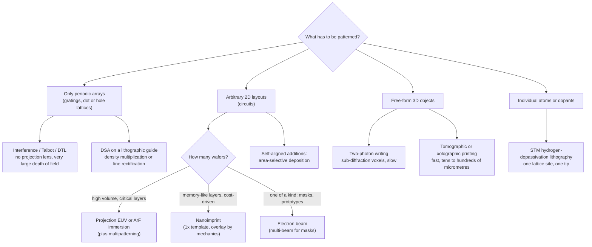

# Alternatives to projection lithography

Nearly every leading-edge chip is patterned the same way: a scanner projects a demagnified
image of a mask onto a thin resist, using light at 193 nm or 13.5 nm. Projection lithography
does not own that job because it is the only way to make nanometre patterns. It owns it
because it is the only method that combines four things at once: arbitrary layouts,
nanometre overlay between layers, hundreds of wafers per hour, and a defect rate low enough
for billions of transistors to work. Every alternative on this page gives up at least one of
those four in exchange for something else, such as no optics at all, atomic precision, true
3D shapes, or a much cheaper tool.

Several alternatives already run in factories, just not on the critical layers of logic
chips. Multi-beam electron-beam writers produce the masks that EUV scanners image.
Displacement Talbot lithography and two-photon 3D printers are sold as production tools for
photonics and microfabrication. Others, notably nanoimprint and directed self-assembly, have
spent decades as "next-generation lithography" candidates. A few, such as atom-by-atom
lithography with a scanning tunnelling microscope, are laboratory techniques whose value is
precision, not throughput.

For each technology this page gives the physical principle (with the equation that sets its
resolution or speed), the best results we could verify, what stops it, and exactly what
highuvlith does and does not model. The badges (✅ 🔶 🧪 🗺️, defined in the
[capability matrix](../capability-matrix.md)) grade the **simulator's model**, not the
technology. "Not modeled" means there is no code for it. The readiness words are the ones
used across [The Future](index.md).

## Readiness at a glance

| Technology | Readiness (as of Sep 2026) | highuvlith model |
|---|---|---|
| Nanoimprint lithography (NIL) for chips | Announced / in development (tool at a Toshiba Memory/Kioxia NAND fab since 2017; volume production not confirmed) | Not modeled |
| Directed self-assembly (DSA) | Demonstrated in the lab (pilot-line devices; being re-evaluated as an EUV repair step) | 🔶 analytic DSA module, Rust only ([research modules](../research-modules.md)) |
| Multi-beam e-beam **mask** writing | In production | Not modeled (masks enter as ideal thin transmittances, see [masks & metrics](../masks-and-metrics.md)) |
| Massively parallel e-beam writing on **wafers** | Demonstrated in the lab | Not modeled |
| Area-selective deposition (ASD) | Demonstrated in the lab | Not modeled |
| EUV interference lithography (EUV-IL) | Demonstrated in the lab (research and resist-screening tool) | ✅/🔶 [interference](../processes/interference-volumetric.md); 🔶 two-grating EUV-IL in [Talbot](../processes/talbot.md) |
| Displacement / achromatic Talbot lithography | In production (DTL, for photonics, per the vendor) | 🔶 [Talbot module](../processes/talbot.md) |
| STM hydrogen-depassivation lithography | Demonstrated in the lab | Not modeled |
| Two-photon polymerization (2PP) | In production (commercial micro-3D printers) | ✅/🔶 two-photon kinetics and voxel writer ([interference & two-photon](../processes/interference-volumetric.md)) |
| Tomographic and xolographic volumetric printing | Demonstrated in the lab | Not modeled |

## Nanoimprint: printing with a stamp

In nanoimprint lithography (NIL) the mask becomes a stamp. A template carrying the pattern
at 1× is pressed into a thin liquid or thermoplastic resist. The resist is hardened while in
contact, by UV light or heat, and the template is lifted off. What remains is a relief whose
thin residual layer is cleared by a short etch. No image is ever formed, so there is no
diffraction limit and no depth of focus to budget. The resolution is whatever the template
carries.

The idea is older than EUV production. Chou and co-workers imprinted sub-25 nm vias and
trenches in polymers in 1995 and reported 25 nm resolution in *Science* the following year
[1, 2]. Colburn et al. introduced UV-cured "step and flash" imprint lithography in 1999 [3].
Sreenivasan's review traces how the jet-and-flash (J-FIL) form of UV nanoimprint moved from
research to commercial steppers for advanced memory manufacturing [4]. Canon completed its
acquisition of Molecular Imprints, Inc. on 18 April 2014 and renamed it Canon
Nanotechnologies [5].

Canon's FPA-1200NZ2C, released on 13 October 2023, is the current product. Canon states a
minimum linewidth of 14 nm and says the tool can handle the "5-nm-node", which Canon itself
equates with a 15 nm linewidth. It expects NIL to reach a 10 nm linewidth ("2-nm-node")
"with further improvement of mask technology" and claims substantially lower power
consumption than the photolithography it would replace [6]. On 26 September 2024 Canon
announced a delivery to the Texas Institute for Electronics (TIE), a semiconductor
consortium, "for the research and development of advanced semiconductors and production of
prototypes" [7]. Memory came first. In July 2017 Canon delivered an FPA-1200NZ2C to
Toshiba Memory's Yokkaichi plant as "significant progress toward semiconductor device mass
production" [47]. Toshiba had decided not to move planar NAND from immersion
multipatterning to NIL and planned to apply it "for 3D NAND at first" [48]. By 2019 the tool
had shown 14 nm half-pitch patterning, 80–90 wafers per hour and 3.4 nm overlay; the main
obstacle named was overlay, "especially near the wafer edge" [8]. (That 2019 article also
says Toshiba "has used Canon's NIL system for the production of planar NAND," which
contradicts the 2018 report and Canon's own wording; we found no primary confirmation of
it.)

What limits NIL follows from the missing optics:

- **1× templates.** There is no 4× reduction to hide template errors. Every template defect,
  and every particle trapped between template and wafer, prints. Canon itself ties the next
  resolution step to "further improvement of mask technology" [6].
- **Overlay by mechanics.** Alignment and distortion correction happen at contact, field by
  field, so overlay becomes a mechanical problem. That is the obstacle Toshiba named [8].
- **Throughput.** 80–90 wafers per hour [8] is well below the ≥170 wafers per hour that
  ASML specifies for its 0.33 NA NXE:3400C at 20 mJ/cm² [46]. Why dose, and therefore
  throughput, matters so much at EUV is the subject of
  [the stochastic frontier](stochastic-frontier.md).

As of September 2026 we found no public confirmation that NIL is running in volume production
of NAND or of leading-edge logic. Canon describes itself as "the first in the world to commercialize" a
NIL semiconductor manufacturing system, and the one delivery it has announced is for R&D and
prototyping [7].

!!! warning "Myth: no optics means no resolution limit"
    NIL has no *optical* limit. The limit moves to the template, which must be made at
    final size, stay defect-free, and survive repeated contact. It also moves to
    overlay, which is set by mechanics instead of by a stage and a lens. Canon's "5-nm-node"
    and "2-nm-node" are process-node labels, not feature sizes (see
    [what a node is](../nodes/index.md)).

**highuvlith:** not modeled. The simulator has no imprint mechanics, residual-layer, template
or contact model. Its masks are projection masks imaged through a pupil.

## Directed self-assembly: letting polymers draw the lines

A diblock copolymer joins two chemically different chains, for example polystyrene (PS) and
poly(methyl methacrylate) (PMMA). The blocks cannot separate at large scale, so they
**micro**phase-separate into lamellae, cylinders or spheres with a natural period $L_0$ set by
the molecular weight. A lithographically made guide registers and orients those domains:
chemical stripes (chemo-epitaxy) or trenches (grapho-epitaxy). A sparse guide can multiply
pattern density, and the domains can sharpen a rough guide. Kim et al. showed in 2003 that
block copolymers on lithographically defined chemical patterns assemble epitaxially into
patterns that are "defect-free, … oriented and registered with the underlying substrate" over
large areas [9].

Two numbers from polymer physics set the scale. A symmetric diblock orders only above a
segregation strength of about

```math
(\chi N)_\mathrm{ODT} \approx 10.5 \qquad \text{(mean-field order–disorder transition [10])},
```

where $\chi$ is the Flory–Huggins interaction parameter and $N$ the degree of polymerization.
In the strong-segregation regime the period scales as

```math
L_0 \propto a\,N^{2/3}\chi^{1/6}
```

(statistical segment length $a$ [11]). A smaller period needs a shorter chain (smaller $N$).
To stay ordered, a shorter chain needs a larger $\chi$, which is why sub-10 nm DSA research
turns to "high-χ" block copolymers. The workhorse PS-*b*-PMMA runs out at about a 22 nm
pitch. Wan et al. directed PS-*b*-PMMA lamellae at full pitches from 27 nm down to 18.5 nm. Clean
removal of the PMMA and pattern transfer, however, worked only down to a 22 nm full pitch
(about 11 nm features), limited by the width of the interface between the blocks [12].

DSA reached device-oriented demonstrations, such as Liu et al.'s DSA patterning for
"7 nanometre FinFET technology and beyond" [13]. It did not reach high-volume manufacturing,
and defects are why. In 2019 SemiEngineering summarized that "the level of defects in DSA
has never reached a level adequate for good yield" [8]. In August 2023 it reported defect densities
still above the industry target of <1/cm², listing bridging, line collapse, bubbles and line
dislocations [14]. The same 2023 report describes a change of role. DSA "is being used to
assist EUV, not for multiplying the pitch but for rectifying the lines" (Brewer Science), and
Intel has shown "DSA-enhanced EUV multi-patterning" at an 18 nm metal pitch [14]. The appeal
is the EUV stochastic problem: Chris Mack is quoted there saying stochastic defects can be
"more than 50%" of a high-volume EUV patterning error budget. See
[the stochastic frontier](stochastic-frontier.md) for why.

**highuvlith: 🔶 Simplified** ([research modules](../research-modules.md)). The DSA module
composes analytic morphologies at $L_0$: tanh-smoothed lamellae, hexagonal cylinders and
cubic spheres. It registers lamellae in grapho-epitaxial trenches and scores trench
commensurability with the strong-segregation free-energy penalty

```math
\frac{F(L)}{F(L_0)} = \frac{r^2 + 2/r}{3}, \qquad r = \frac{L}{L_0},
```

choosing the optimal number of periods for a trench. It also rejects parameters below the
mean-field ODT ($\chi N < 10.495$). It is **not** a self-consistent-field (SCFT) solver. Its
defect index is an uncalibrated heuristic, not a defect density. It is currently Rust-only,
with no Python bindings.

## Electron beams: indispensable for masks, too slow for wafers

Electrons have wavelengths far below any feature size. At 50 keV the relativistic de Broglie
wavelength is

```math
\lambda_e = \frac{hc}{\sqrt{E_k^2 + 2E_k m_e c^2}} = \frac{1.23984\ \text{keV·nm}}{231.5\ \text{keV}} \approx 5.4\ \text{pm},
```

so diffraction is irrelevant. Electron scattering in the resist and substrate, beam optics,
and resist chemistry set the resolution instead. The real limit is **speed**, because a beam
of current $I$ must deliver a charge dose $D$ to every point of the area $A$ it writes:

```math
t = \frac{D\,A}{I}.
```

As an illustration with assumed round numbers, take $D = 50\ \mu\text{C/cm}^2$ over a 300 mm
wafer ($A \approx 707\ \text{cm}^2$). That is 35 mC per layer: about 10 hours at a total
current of 1 µA. A scanner-like 100 wafers per hour would need about 1 mA delivered with
nanometre placement. That target is far beyond anything shown for wafer writing.

**Masks: in production.** A photomask is written once and printed thousands of times, at 4×
the wafer dimensions, so e-beam speed is affordable there. It became unaffordable for
single-beam variable-shaped-beam (VSB) tools as mask shapes grew complex. By 2018 dense layers
could take "30 hours or even higher" on VSB writers. Industry voices called multi-beam writing
"a must for EUV" and necessary for curvilinear and inverse-lithography masks [15]. IMS
Nanofabrication, founded in Vienna in 1985, integrated the MBMW alpha tool in 2014. It has
shipped MBMW-101 production tools since 2016 (for the 7 nm node) and second-generation
MBMW-201 tools since 2019 [16, 17]. The architecture uses 262,144 programmable beams, "each
beam … 10nm", at 50 keV [18]. Intel invested in IMS in 2009 and had bought it by 2016
[16, 18]. In 2023 Intel sold a 20% stake to Bain Capital at a valuation of about $4.3 billion
and a 10% stake to TSMC [19, 20]. NuFlare shipped its first multi-beam writer by
2017 [18].

**Wafers: demonstrated, then abandoned.** MAPPER Lithography aimed for a 13,000-beam direct
writer but built "a system with 1,352 beams for a modest throughput of 1 wafer an hour" [8].
The company went bankrupt on 28 December 2018 with about 270 staff [21]. ASML acquired its
assets but said it would not continue the technology [8].

**highuvlith:** not modeled. The simulator's masks are ideal thin transmittances
([masks & metrics](../masks-and-metrics.md)). Its OPC and ILT modules
([research modules](../research-modules.md)) produce the kind of corrected, increasingly
curvilinear shapes that pushed the industry to multi-beam writers. How a writer renders those
shapes is outside the model.

## Area-selective deposition: patterning by surface chemistry

Area-selective deposition (ASD) turns patterning partly bottom-up. A chemical vapour
deposition (CVD) or atomic-layer deposition (ALD) process is tuned so that film grows on
one material (the growth area) and not on its neighbour (the non-growth area) [22]. The
pattern already on the wafer then acts as the mask, and new material lands in self-aligned
positions. That can relieve the overlay budget that makes stacked vias and caps so hard to
print. In practice selectivity is finite: nuclei eventually form on the non-growth surface,
so selective films are thin or need corrective steps. Parsons and Clark's review [22] covers
the fundamentals, applications and outlook. We found no verified public figure for ASD use in volume
manufacturing, so we rate it "Demonstrated in the lab".

**highuvlith:** not modeled. There is no deposition or surface-chemistry model.

## Interference and Talbot lithography: patterns without a projection lens

Two mutually coherent plane waves crossing at half-angle $\theta$ write fringes of period

```math
\Lambda = \frac{\lambda}{2\sin\theta}, \qquad \text{half-pitch} = \frac{\lambda}{4\sin\theta} \ge \frac{\lambda}{4}.
```

There is no mask image to focus, so the fringes have enormous depth of field, and the
resolution limit is a clean λ/4. Mojarad et al. put it at "≈3.5 nm" for 13.5 nm light [23].
The price is generality: interference prints only periodic patterns.

**EUV-IL at PSI.** The XIL-II beamline of the Swiss Light Source filters an undulator beam
through a pinhole to make it spatially coherent. It covers 70–500 eV, with a flux of
3 × 10¹⁵ photons s⁻¹ cm⁻² per 4% bandwidth per 0.3 A at 92 eV on a 5 × 5 mm² spot [24]. Its
record progression tracks the physics:

- 7 nm half-pitch (14 nm period) in silicon- and hafnium-based resists (2015) [23];
- 6 nm half-pitch (2016) [25];
- 5 nm half-pitch in HSQ (2024), with a new *mirror-based* interferometer that sidesteps the
  falling diffraction efficiency of transmission gratings near the diffraction limit [26].
  By the equation above, 5 nm half-pitch at 13.5 nm needs $\sin\theta = 13.5/(4 \times 5)
  = 0.675$. That exceeds the 0.55 NA of today's High-NA scanners, though not the 0.75 studied
  for Hyper-NA (see [High-NA and Hyper-NA](high-na-and-hyper-na.md)).

EUV-IL is also how resists are screened below 13.5 nm. Mojarad et al. compared resists at
beyond-EUV 6.x nm and 13.5 nm and found that inorganic resists performed much better at
6.x nm, while organic chemically amplified resists "would need serious adaptations" [27]
(see [Beyond EUV](beyond-euv.md)). PSI's source is itself in transition. The SLS 2.0 upgrade
began in September 2023; PSI's upgrade page expected first-phase user operation in
mid-2026 [28].

**Two-grating EUV-IL.** Conventional EUV-IL uses two transmission gratings of period $p$
whose $+m$ and $-m$ diffraction orders overlap at the wafer. With $\sin\theta = m\lambda/p$ the fringe
period is

```math
\Lambda = \frac{\lambda}{2\sin\theta} = \frac{p}{2m},
```

independent of the wavelength and of the resist index. The grating sets the pattern and the
source only has to be coherent.

**Talbot self-imaging.** A grating lit by a coherent plane wave re-images itself behind the
mask without any lens. The copy repeats every Talbot length, with a half-period-shifted copy
halfway and superpositions of shifted copies at fractional distances:

```math
z_T = \frac{2p^2}{\lambda} \quad \text{(paraxial)}.
```

<figure markdown="span">
  { width="860" }
  { width="860" }
  <figcaption>The Talbot carpet behind a binary amplitude grating with 25 % open fraction, in scaled units (x/p, z/z<sub>T</sub>, z<sub>T</sub> = 2p²/λ), so the picture holds for any wavelength and period. The mask pattern returns at z<sub>T</sub> and is shifted by p/2 at z<sub>T</sub>/2. Fractional planes hold superpositions of shifted copies: behind narrow slits z<sub>T</sub>/4 shows a half-period image, while behind a 50 % open grating the two copies interleave into almost uniform intensity. Computed, not measured: scalar paraxial Fresnel propagation of the grating's Fourier series (orders ±60), thin-mask, perfectly coherent. Own work, generated by docs/figures/future/make_future_figures.py.</figcaption>
</figure>

??? info "Data: what the carpet shows plane by plane"
    Paraxial Fresnel sums over orders ±200, evaluated with the same closed form as the figure
    (intensity normalized to the incident wave; "std" is the spatial standard deviation of
    the intensity):

    | Plane | 50 % open grating | 25 % open grating |
    |---|---|---|
    | $z = 0$ (mask) | period $p$ | period $p$ |
    | $z_T/4$ | almost uniform (mean 0.50, std 0.016) | period $p/2$ (std 0.25) |
    | $z_T/2$ | period $p$, shifted by $p/2$ | period $p$, shifted by $p/2$ |
    | $z_T$ | period $p$ (self-image) | period $p$ (self-image) |

    For $p = 100$ nm at 13.5 nm, $z_T = 1481$ nm. The exact (non-paraxial) rephasing length of
    the 0 and ±1 orders is 1475 nm (see the Talbot example below).

Printing at one gap is fragile, because the image changes within a fraction of $z_T$. Two
tricks make it stationary. **Achromatic Talbot lithography** uses a broadband source and
places the wafer beyond the achromatic distance ($z_A = 2p^2/\Delta\lambda$), where the
spectral average washes out the revivals and leaves a frequency-doubled, gap-independent
image [29]. **Displacement Talbot lithography** (DTL) scans the gap over one Talbot period
during exposure. The integrated image then "is independent of the absolute distance from the
mask", so periodic patterns print "without the depth-of-field limitation of Talbot
self-images" [30]. For a one-dimensional grating the DTL image has period $p/2$. Isoyan et al.
extended Talbot printing to complex (non-grating) periodic cells with a table-top 46.9 nm
laser [31]. DTL is commercial: Eulitha, founded in 2006, sells DTL tools for "patterning
solutions for research through production" in photonics manufacturing [32].

**Table-top EUV interference.** Interference needs coherence, not power, so compact sources
can do it. A table-top 46.9 nm capillary-discharge laser with a Lloyd's-mirror interferometer
printed arrays of 60 nm features [33]. A high-harmonic source at 29 nm (27th harmonic of a
1 kHz, 2 W Ti:sapphire laser) printed <200 nm pitches [34]. imec's AttoLab, with a commercial
13.5 nm high-harmonic source, printed sub-22 nm pitches in a metal-oxide resist [35]. These
sources are described on [Quantum and exotic](quantum-and-exotic.md) and on the simulator's
[HHG](../sources/hhg.md) and [soft-X-ray laser](../sources/soft-xray-laser.md) pages.

!!! warning "Myth: interference lithography could replace the scanner"
    Interference and Talbot methods print lattices, not circuits. A chip layer needs line
    ends, cuts, vias and irregular routing. Their industrial niches are periodic structures:
    gratings, photonics and resist research, where EUV-IL has probed the limits of
    photon-based resolution years ahead of scanners.

**highuvlith.** Two modules, both off the projection pipeline (no pupil, TCC or σ):

- [Interference & two-photon](../processes/interference-volumetric.md): **✅** for the
  analytic N-beam field (vector-component sum, so polarization-mismatch contrast loss is
  captured) and **🔶** for absorption and interfaces (scalar per-beam decay, no Fresnel
  coefficients or substrate reflection). The Python entry point is `simulate_interference`.
- [Talbot & EUV interference](../processes/talbot.md): **🔶**. It computes the Talbot carpet
  (exact angular-spectrum or paraxial propagation), DTL and ATL stationary images in closed
  form, and two-grating EUV-IL fringes that feed the same PAC and development tiers. It
  assumes a thin, scalar (Kirchhoff) grating whose coefficients do not change across a
  band, perfectly coherent normal illumination, and no Fresnel coefficients at the resist. It
  has no mask-3D model, so it cannot capture the falling grating efficiency near the
  diffraction limit that led PSI to a mirror-based design. The Python entry points are `highuvlith.api.simulate_talbot` and
  `simulate_euv_il`.

<figure markdown="span">


<figcaption>Talbot carpets of a 100 nm binary amplitude grating at 13.5 nm (the alternative-patterning page's example), ±10 orders: (a) exact angular-spectrum propagation, (b) its difference from the paraxial (Fresnel) carpet, both in units of the paraxial Talbot length 2p²/λ ≈ 1481 nm (dashed). With p/λ ≈ 7 the higher orders dephase in the exact propagation, so the fine structure differs strongly even though the 0/±1 self-image only moves to ≈ 1475 nm. (c) The stationary DTL image at half the period. Model: Talbot / DTL 🔶 (scalar thin mask, coherent normal illumination).</figcaption>
</figure>

## Atomic precision with a scanning tunnelling microscope

Hydrogen-depassivation lithography (HDL) works on a silicon (100) surface whose dangling
bonds are capped with hydrogen. Electrons from a scanning-tunnelling-microscope tip desorb
hydrogen locally, leaving bare, reactive silicon, so the monolayer of hydrogen acts as the
resist. Lyding et al. reported "linewidths of 1 nm on a 3 nm pitch" in 1994 and showed that
the patterned areas could be selectively oxidized [36]. Combining STM and hydrogen-resist
lithography, Fuechsle et al. placed a single phosphorus dopant atom in an epitaxial silicon
device "with a spatial accuracy of one lattice site" and operated it as a transistor at
liquid-helium temperatures [37]. Zyvex Labs markets an HDL system, ZyvexLitho1, as a
"sub-nm resolution lithography system". Its atomic-precision mode writes single-dimer-row
lines, its pixel is "4 surface Si atoms", and it adds precursor-gas dosing, silicon epitaxy and
scripted vector writing [38].

The precision is unmatched and the throughput is tiny. There is one tip, ultra-high vacuum,
one crystal surface, and one pattern at a time. We found no throughput figure on the vendor
pages we checked. HDL's natural domain is atomic-scale quantum and dopant devices, such as
Fuechsle's transistor, not wafer-scale patterning.

**highuvlith:** not modeled.

## Light in a volume: two-photon and volumetric printing

**Two-photon polymerization (2PP).** A femtosecond laser focused into a photopolymer drives
absorption that scales with $I^2$, so polymerization is confined to the focal volume and can
be written in 3D by moving the focus. Maruo, Nakamura and Kawata proposed and demonstrated the
method in 1997 with a 790 nm, 200 fs Ti:sapphire laser [39]. Kawata et al. used it for
"finer features for functional microdevices" in a 2001 *Nature* paper [40]. The
quadratic response sharpens the voxel. For a Gaussian focus

```math
I(r) \propto e^{-2r^2/w^2} \quad\Rightarrow\quad I^2(r) \propto e^{-4r^2/w^2},
```

so the $1/e^2$ radius of the exposure shrinks by $\sqrt{2}$. Thresholding the polymerization
then makes the voxel smaller than the diffraction-limited spot, and it stays elongated along
the beam axis. 2PP is commercial. Nanoscribe (founded in 2007 in Karlsruhe) became part of
the LAB14 group in November 2024 [41].

**Tomographic and xolographic volumetric printing.** These methods solidify a whole object at
once instead of point by point or layer by layer.

- *Computed axial lithography* rotates a volume of photopolymer inside a dynamically
  computed light pattern. It printed features "as small as 0.3 millimeters" and
  centimetre-scale objects in 30–120 s [42].
- A low-étendue, feedback-controlled tomographic printer reached 80 µm positive and 500 µm
  negative features, making centimetre-scale parts in under 30 s [43].
- *Xolography* intersects light beams of two different wavelengths in a resin containing
  photoswitchable photoinitiators, so polymerization happens only where they cross. It
  reported "a resolution about ten times higher than computed axial lithography without
  feedback optimization" and a volume generation rate "four to five orders of magnitude
  higher than two-photon photopolymerization" [44].

These are micrometre-to-centimetre manufacturing technologies for parts such as
microfluidics and soft hydrogels. They are not rivals for chip lithography. They matter here
because their physics (nonlinear or two-colour thresholds, dose accumulated over many exposures,
depth of focus) is lithography physics in a third dimension.

**highuvlith.** The [interference & two-photon](../processes/interference-volumetric.md)
module has a scanned two-photon voxel writer (`GaussianFocus`, `write_voxels`,
`voxels_to_pac`). It uses a scalar, paraxial Gaussian focus with no high-NA vector
focusing, no polymerization kinetics or oxygen inhibition, and is Rust only. It also has
two-photon ($I^2$) kinetics for interference lattices, available in Python as
`simulate_interference(..., two_photon=True)`. That is ✅ for the field and 🔶 for absorption
and kinetics. The [volumetric exposure](../processes/volumetric-exposure.md) path is
z-resolved *projection* exposure, not tomographic printing. Tomographic and xolographic
printing are not modeled.

!!! note "An exploratory module: MNSL"
    highuvlith also ships a moiré nanosphere module (MNSL, ✅ as code in the
    [capability matrix](../capability-matrix.md)). It computes the emission pattern of
    stacked, mutually rotated nanosphere arrays: Rayleigh scattering per sphere, moiré
    interference and single-plane substrate coupling
    ([research modules](../research-modules.md)). Nanosphere (colloidal) lithography is an
    established laboratory technique [45]. We did not find a verified publication of the
    moiré-stacked lithographic variant this module explores. Read its outputs as design
    exploration, not as a prediction of a demonstrated process.

## Choosing a method



## Try it in highuvlith

!!! example "Try it in highuvlith: interference fringes set by geometry alone"
    Two coherent 13.5 nm beams at the half-angle that gives a 50 nm period, recorded as a
    photoactive-compound (PAC) volume. The printed period is read back from an FFT of the top
    slice.

    <!-- verify-example -->
    ```python
    import math
    import numpy as np
    import highuvlith as huv

    lam = 13.5                                     # EUV wavelength (nm)
    theta = math.degrees(math.asin(lam / 100.0))   # half-angle giving a 50 nm period
    pac = huv.simulate_interference(
        "two_beam", wavelength_nm=lam, n_medium=1.0, half_angle_deg=theta,
        nx=128, ny=4, nz=4, x_span_nm=400.0, y_span_nm=20.0, z_span_nm=20.0,
        dose_scale=50.0,
    )
    row = pac.values[0, 0, :]                      # PAC along x in the top slice (nz, ny, nx)
    k = int(np.argmax(np.abs(np.fft.rfft(row - row.mean()))))
    print(f"printed period {400.0 / k:.1f} nm; lambda/(2 sin theta) = "
          f"{lam / (2 * math.sin(math.radians(theta))):.1f} nm")
    ```

    ??? success "Output"

        ```text
        printed period 50.0 nm; lambda/(2 sin theta) = 50.0 nm
        ```

!!! example "Try it in highuvlith: Talbot length and the frequency-doubled DTL image"
    A 100 nm binary amplitude grating at 13.5 nm. The coherent image at the Talbot length
    repeats the mask period. The displacement-Talbot (stationary) image has half the period.

    <!-- verify-example -->
    ```python
    import numpy as np
    from highuvlith.api import simulate_talbot

    p, lam = 100.0, 13.5
    res = simulate_talbot(lam, p, max_order=10, n_periods=2, nx=128)
    print(f"Talbot length {res.talbot_length_nm:.0f} nm "
          f"(2p^2/lambda = {2 * p**2 / lam:.0f} nm), "
          f"exact 0/+-1 rephasing {res.talbot_length_exact_nm:.0f} nm")
    for name in ("coherent_image", "stationary_image"):
        img = getattr(res, name)[0]                  # one row across two mask periods
        k = int(np.argmax(np.abs(np.fft.rfft(img - img.mean()))))
        print(f"{name:17s} dominant period {2 * p / k:.0f} nm")
    ```

    ??? success "Output"

        ```text
        Talbot length 1481 nm (2p^2/lambda = 1481 nm), exact 0/+-1 rephasing 1475 nm
        coherent_image    dominant period 100 nm
        stationary_image  dominant period 50 nm
        ```

!!! example "Try it in highuvlith: two-grating EUV-IL is wavelength-independent"
    The fringe period is $p/(2m)$ at any wavelength; only the diffraction angle and the
    beam efficiency change. A π-phase grating puts about four times more light into the
    first orders than an amplitude grating. A 50 % open amplitude grating has no second
    order at all, hence the 25 % open grating for $m = 2$.

    <!-- verify-example -->
    ```python
    from highuvlith.api import simulate_euv_il

    for lam in (13.5, 6.7):
        for grating in ("amplitude", "phase"):
            il = simulate_euv_il(100.0, lam, order=1, grating=grating)
            print(f"{lam:4.1f} nm {grating:9s}: period {il.fringe_period_nm:.1f} nm at "
                  f"{il.diffraction_angle_deg:.2f} deg, "
                  f"efficiency per beam {il.beam_intensities[0]:.3f}")
    il = simulate_euv_il(100.0, 13.5, order=2, duty_cycle=0.25)
    print(f"order 2 (25 % open): period {il.fringe_period_nm:.1f} nm, "
          f"efficiency per beam {il.beam_intensities[0]:.3f}")
    ```

    ??? success "Output"

        ```text
        13.5 nm amplitude: period 50.0 nm at 7.76 deg, efficiency per beam 0.101
        13.5 nm phase    : period 50.0 nm at 7.76 deg, efficiency per beam 0.405
         6.7 nm amplitude: period 50.0 nm at 3.84 deg, efficiency per beam 0.101
         6.7 nm phase    : period 50.0 nm at 3.84 deg, efficiency per beam 0.405
        order 2 (25 % open): period 25.0 nm, efficiency per beam 0.025
        ```

    Expect 50 nm fringes at 7.76° (13.5 nm) and 3.84° (6.7 nm), per-beam efficiencies of
    about 0.101 (1/π²) and 0.405 (4/π²), and 25 nm fringes for $m = 2$. The model's gratings
    are thin and scalar. A real EUV "phase" grating has absorption, and its phase step
    changes with wavelength.

## Key takeaways

- Projection lithography wins leading-edge chips by combining arbitrary layouts, nanometre
  overlay, high throughput and low defectivity. Each alternative trades at least one of
  these away.
- **Nanoimprint** removes the optics and moves the limits to 1× templates, defects and
  mechanical overlay. Canon sells a tool (14 nm linewidth, released October 2023) and
  has had one at a Toshiba Memory/Kioxia NAND fab since 2017, but volume production with NIL
  has not been publicly confirmed.
- **Directed self-assembly** reaches small pitches from a coarse guide but never met defect
  targets. It is returning as an EUV line-rectification step, not as a pitch multiplier.
- **Electron beams** are indispensable for masks: multi-beam writers with 262,144 beams have
  been in production since 2016. $t = DA/I$ keeps them off wafers, and MAPPER's 1,352-beam,
  ~1 wafer-per-hour system ended in bankruptcy.
- **Interference and Talbot** methods print only lattices, but with huge depth of field. EUV
  interference has reached 5 nm half-pitch at 13.5 nm, an effective sin θ of 0.675, and DTL is
  a commercial photonics tool.
- **STM lithography** places single atoms to one lattice site, **2PP** writes 3D voxels
  smaller than its diffraction-limited focus, and **volumetric printing** makes centimetre
  objects in tens of seconds. These are precision and 3D technologies, not wafer-throughput
  technologies.
- highuvlith models the interference and Talbot families (✅/🔶), two-photon kinetics
  (✅/🔶) and an analytic DSA (🔶). Nanoimprint, e-beam writing, ASD, STM lithography and
  tomographic printing are not modeled.

## References and further reading

1. S. Chou, P. Krauss, P. Renstrom, "Imprint of sub-25 nm vias and trenches in polymers," *Appl. Phys. Lett.* **67**, 3114–3116 (1995), [doi:10.1063/1.114851](https://doi.org/10.1063/1.114851).
2. S. Chou, P. Krauss, P. Renstrom, "Imprint lithography with 25-nanometer resolution," *Science* **272**, 85–87 (1996), [doi:10.1126/science.272.5258.85](https://doi.org/10.1126/science.272.5258.85).
3. M. Colburn et al., "Step and flash imprint lithography: a new approach to high-resolution patterning," *Proc. SPIE* **3676**, 379 (1999), [doi:10.1117/12.351155](https://doi.org/10.1117/12.351155).
4. S. Sreenivasan, "Nanoimprint lithography steppers for volume fabrication of leading-edge semiconductor integrated circuits," *Microsyst. Nanoeng.* **3**, 17075 (2017), [doi:10.1038/micronano.2017.75](https://doi.org/10.1038/micronano.2017.75).
5. Canon Inc., news release on completing the acquisition of Molecular Imprints, Inc. (23 April 2014; completion 18 April 2014), [global.canon](https://global.canon/en/news/2014/apr23e02.html).
6. Canon Inc., news release on the FPA-1200NZ2C nanoimprint semiconductor manufacturing equipment (13 October 2023), [global.canon](https://global.canon/en/news/2023/20231013.html).
7. Canon Inc., delivery of the FPA-1200NZ2C to the Texas Institute for Electronics (news release, 26 September 2024), [global.canon](https://global.canon/en/news/2024/20240926.html).
8. "Lots of lithography options for next-gen devices," *Semiconductor Engineering*, 18 April 2019, [semiengineering.com](https://semiengineering.com/lots-of-lithography-options-for-next-gen-devices/). Covers NIL for Toshiba 3D NAND, DSA defects, and MAPPER.
9. S. O. Kim, H. Solak, M. Stoykovich, N. Ferrier, J. de Pablo, P. Nealey, "Epitaxial self-assembly of block copolymers on lithographically defined nanopatterned substrates," *Nature* **424**, 411–414 (2003), [doi:10.1038/nature01775](https://doi.org/10.1038/nature01775).
10. L. Leibler, "Theory of microphase separation in block copolymers," *Macromolecules* **13**, 1602–1617 (1980), [doi:10.1021/ma60078a047](https://doi.org/10.1021/ma60078a047).
11. F. Bates, G. Fredrickson, "Block copolymer thermodynamics: theory and experiment," *Annu. Rev. Phys. Chem.* **41**, 525–557 (1990), [doi:10.1146/annurev.pc.41.100190.002521](https://doi.org/10.1146/annurev.pc.41.100190.002521).
12. L. Wan et al., "The limits of lamellae-forming PS-*b*-PMMA block copolymers for lithography," *ACS Nano* **9**, 7506–7514 (2015), [doi:10.1021/acsnano.5b02613](https://doi.org/10.1021/acsnano.5b02613).
13. C. Liu et al., "Directed self-assembly of block copolymers for 7 nanometre FinFET technology and beyond," *Nat. Electron.* **1**, 562–569 (2018), [doi:10.1038/s41928-018-0147-4](https://doi.org/10.1038/s41928-018-0147-4).
14. "Directed self-assembly gets another look," *Semiconductor Engineering*, 17 August 2023, [semiengineering.com](https://semiengineering.com/directed-self-assembly-gets-another-look/).
15. "Multi-beam mask writing finally comes of age," *Semiconductor Engineering*, 15 November 2018, [semiengineering.com](https://semiengineering.com/multi-beam-mask-writing-finally-comes-of-age/).
16. IMS Nanofabrication, company history, [ims.co.at](https://www.ims.co.at/en/company/history/).
17. C. Klein, E. Platzgummer, "MBMW-101: world's 1st high-throughput multi-beam mask writer," *Proc. SPIE* **9985**, 998505 (2016), [doi:10.1117/12.2243638](https://doi.org/10.1117/12.2243638).
18. "Next-gen mask writer race begins," *Semiconductor Engineering*, 19 October 2017, [semiengineering.com](https://semiengineering.com/next-gen-mask-writer-race-begins/).
19. "Week in review: semiconductor manufacturing, test," *Semiconductor Engineering*, 23 June 2023 (Intel stake sale to Bain Capital), [semiengineering.com](https://semiengineering.com/week-in-review-semiconductor-manufacturing-test-29/).
20. "Chip industry week in review," *Semiconductor Engineering*, 15 September 2023 (10% stake to TSMC), [semiengineering.com](https://semiengineering.com/chip-industry-week-in-review-2/).
21. NOS, "Delftse chipmachinemaker Mapper failliet," 28 December 2018, [nos.nl](https://nos.nl/artikel/2265346-delftse-chipmachinemaker-mapper-failliet.html).
22. G. Parsons, R. Clark, "Area-selective deposition: fundamentals, applications, and future outlook," *Chem. Mater.* **32**, 4920–4953 (2020), [doi:10.1021/acs.chemmater.0c00722](https://doi.org/10.1021/acs.chemmater.0c00722).
23. N. Mojarad, M. Hojeij, L. Wang, J. Gobrecht, Y. Ekinci, "Single-digit-resolution nanopatterning with extreme ultraviolet light for the 2.5 nm technology node and beyond," *Nanoscale* **7**, 4031–4037 (2015), [doi:10.1039/c4nr07420c](https://doi.org/10.1039/c4nr07420c).
24. Paul Scherrer Institute, XIL-II beamline, [psi.ch/en/sls/xil](https://www.psi.ch/en/sls/xil).
25. D. Fan, Y. Ekinci, "Photolithography reaches 6 nm half-pitch using extreme ultraviolet light," *J. Micro/Nanolithogr. MEMS MOEMS* **15**(3), 033505 (2016), [doi:10.1117/1.JMM.15.3.033505](https://doi.org/10.1117/1.JMM.15.3.033505).
26. I. Giannopoulos, I. Mochi, M. Vockenhuber, Y. Ekinci, D. Kazazis, "Extreme ultraviolet lithography reaches 5 nm resolution," *Nanoscale* **16**, 15533–15543 (2024), [doi:10.1039/D4NR01332H](https://doi.org/10.1039/D4NR01332H); see also *Proc. SPIE* (2024), [doi:10.1117/12.3010388](https://doi.org/10.1117/12.3010388).
27. N. Mojarad, J. Gobrecht, Y. Ekinci, "Beyond EUV lithography: a comparative study of efficient photoresists' performance," *Sci. Rep.* **5**, 9235 (2015), [doi:10.1038/srep09235](https://doi.org/10.1038/srep09235).
28. Paul Scherrer Institute, SLS 2.0 upgrade, [psi.ch/en/sls2-0](https://www.psi.ch/en/sls2-0).
29. H. Solak, Y. Ekinci, "Achromatic spatial frequency multiplication: a method for production of nanometer-scale periodic structures," *J. Vac. Sci. Technol. B* **23**, 2705–2710 (2005), [doi:10.1116/1.2121735](https://doi.org/10.1116/1.2121735).
30. H. Solak, C. Dais, F. Clube, "Displacement Talbot lithography: a new method for high-resolution patterning of large areas," *Opt. Express* **19**, 10686–10691 (2011), [doi:10.1364/OE.19.010686](https://doi.org/10.1364/OE.19.010686).
31. A. Isoyan et al., "Talbot lithography: self-imaging of complex structures," *J. Vac. Sci. Technol. B* **27**, 2931–2937 (2009), [doi:10.1116/1.3258144](https://doi.org/10.1116/1.3258144).
32. Eulitha AG, company website, [eulitha.com](https://www.eulitha.com/).
33. P. Wachulak, M. Capeluto, M. Marconi, C. Menoni, J. Rocca, "Patterning of nano-scale arrays by table-top extreme ultraviolet laser interferometric lithography," *Opt. Express* **15**, 3465 (2007), [doi:10.1364/OE.15.003465](https://doi.org/10.1364/OE.15.003465).
34. H. Kim et al., "Lloyd's mirror interference lithography with EUV radiation from a high-harmonic source," *Appl. Phys. Express* **9**, 076701 (2016), [doi:10.7567/APEX.9.076701](https://doi.org/10.7567/APEX.9.076701).
35. K. Dorney et al., "Lloyd's mirror interference lithography below a 22-nm pitch with an accessible, tabletop, 13.5 nm high-harmonic EUV source," *Proc. SPIE* (Novel Patterning Technologies 2021), [doi:10.1117/12.2595048](https://doi.org/10.1117/12.2595048).
36. J. Lyding, T. Shen, J. Hubacek, J. Tucker, G. Abeln, "Nanoscale patterning and oxidation of H-passivated Si(100)-2×1 surfaces with an ultrahigh vacuum scanning tunneling microscope," *Appl. Phys. Lett.* **64**, 2010–2012 (1994), [doi:10.1063/1.111722](https://doi.org/10.1063/1.111722).
37. M. Fuechsle et al., "A single-atom transistor," *Nat. Nanotechnol.* **7**, 242–246 (2012), [doi:10.1038/nnano.2012.21](https://doi.org/10.1038/nnano.2012.21).
38. Zyvex Labs, ZyvexLitho1 product pages, [zyvexlabs.com](https://www.zyvexlabs.com/apm/products/zyvex-litho-1/).
39. S. Maruo, O. Nakamura, S. Kawata, "Three-dimensional microfabrication with two-photon-absorbed photopolymerization," *Opt. Lett.* **22**, 132 (1997), [doi:10.1364/OL.22.000132](https://doi.org/10.1364/OL.22.000132).
40. S. Kawata, H. Sun, T. Tanaka, K. Takada, "Finer features for functional microdevices," *Nature* **412**, 697–698 (2001), [doi:10.1038/35089130](https://doi.org/10.1038/35089130).
41. LAB14 Group, "LAB14 welcomes Nanoscribe as a new subsidiary" (19 November 2024), [lab14.group](https://lab14.group/lab14-welcomes-nanoscribe-as-a-new-subsidiary/).
42. B. Kelly et al., "Volumetric additive manufacturing via tomographic reconstruction," *Science* **363**, 1075–1079 (2019), [doi:10.1126/science.aau7114](https://doi.org/10.1126/science.aau7114).
43. D. Loterie, P. Delrot, C. Moser, "High-resolution tomographic volumetric additive manufacturing," *Nat. Commun.* **11**, 852 (2020), [doi:10.1038/s41467-020-14630-4](https://doi.org/10.1038/s41467-020-14630-4).
44. M. Regehly et al., "Xolography for linear volumetric 3D printing," *Nature* **588**, 620–624 (2020), [doi:10.1038/s41586-020-3029-7](https://doi.org/10.1038/s41586-020-3029-7).
45. Y. Zhang et al., "Versatile nanosphere lithography technique combining multiple-exposure nanosphere lens lithography and nanosphere template lithography," *Chin. Opt. Lett.* **15**, 062201 (2017), [doi:10.3788/COL201715.062201](https://doi.org/10.3788/COL201715.062201).
46. ASML, TWINSCAN NXE:3400C product page (throughput ≥170 wafers/hour at 20 mJ/cm², ≥135 at 30 mJ/cm²; NA 0.33; 13 nm resolution), [asml.com](https://www.asml.com/en/products/euv-lithography-systems/twinscan-nxe3400c).
47. Canon Inc., news release on providing the FPA-1200NZ2C to Toshiba Memory Corporation's Yokkaichi Operations plant (20 July 2017), [global.canon](https://global.canon/en/news/2017/20170720.html).
48. "What happened to nanoimprint litho?," *Semiconductor Engineering*, 29 March 2018, [semiengineering.com](https://semiengineering.com/what-happened-to-nanoimprint-litho/).

Related pages: [The Future](index.md) · [The stochastic frontier](stochastic-frontier.md) ·
[Beyond EUV](beyond-euv.md) · [Quantum and exotic](quantum-and-exotic.md) ·
[Interference & two-photon](../processes/interference-volumetric.md) ·
[Talbot & EUV interference](../processes/talbot.md) · [Research modules](../research-modules.md) ·
[Capability matrix](../capability-matrix.md).
