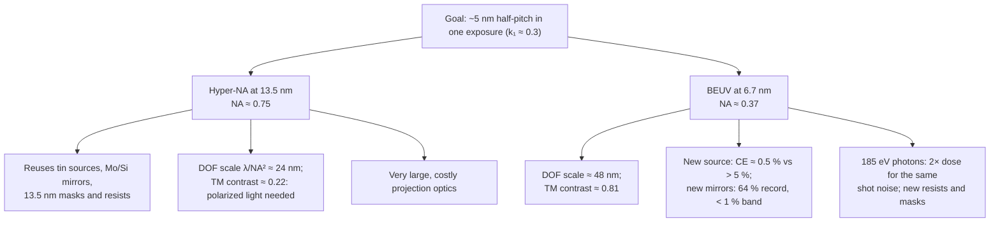
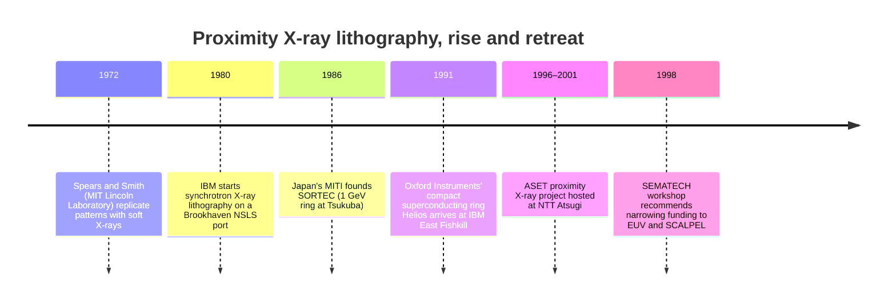

# Beyond EUV: 6.x nm and the X-ray revival

Almost every generation of lithography has made its pitch shrink with a shorter wavelength:
mercury g- and i-lines, then KrF at 248 nm, ArF at 193 nm, and finally the jump to 13.5 nm
extreme ultraviolet. The obvious next rung is **6.5–6.7 nm "beyond EUV" (BEUV)**, which
halves the wavelength again. It has been studied for well over a decade. The 2023 edition
of the International Roadmap for Devices and Systems (IRDS) says shorter wavelengths
"(6 nm < λ < 7 nm) are also being assessed" alongside hyper-NA optics. It also warns that
"changing to a shorter wavelength would be a much bigger change than increased NA and be
much more challenging" [1].

This page explains why (for a review of EUV lithography itself, see [11]). Every part of
the optical chain has to be reinvented at 6.x nm: the plasma that makes the light, the
mirrors that carry it, the resist that records it, and the photon statistics that set the
dose. The physics also offers real rewards: more
depth of focus and much milder polarization problems than hyper-NA at the same resolution.
The page also covers two other short-wavelength paths. One is the **11.2 nm** alternative,
now on a Russian national roadmap. The other is **X-ray proximity lithography**, which lost
the race for integrated circuits around 2000 but lives on as LIGA deep X-ray lithography.

## Readiness at a glance

| Technology | Readiness (as of Sep 2026) | highuvlith model |
|---|---|---|
| 6.x nm (BEUV) projection scanner | Theoretical / speculative. Assessed by IRDS; no exposure tool announced | ✅ Hopkins imaging at 6.7 nm through an ideal 🔶 [EUV projection pupil](../optics.md) (no BEUV lens design exists); source and mirror models below |
| Gd/Tb laser-produced plasma at 6.5–6.7 nm | Demonstrated in the lab. Conversion efficiency 0.54 % in a 0.6 % band with a dual-pulse low-density target [3]; up to 0.8 % in-band reported with twelve-beam irradiation of Gd microspheres [41, 43]; we found no report of watt-level in-band power | [`lpp_gd_6nm7` / `lpp_tb_6nm5`](../sources/lpp.md) ✅/🔶 (the power at intermediate focus is a projection) |
| kW-class 6.x nm sources (LPP, energy-recovery FEL) | Proposed (design study) [4, 17] | LPP power chain ✅/🔶; FEL physics in [XFEL](../sources/xfel.md) ✅, ERL preset 🧪 (at 13.5 nm) |
| La/B-family multilayer mirrors | Demonstrated in the lab. Record 64.1 % at 6.65 nm [5] | [`MultilayerMirror`](../materials.md) ✅ (ideal Parratt model, not yet wired into the optics) |
| 11.2 nm lithography (Xe plasma + Ru/Be optics) | Announced / in development. Russian roadmap; first tool planned for 2026–2028 [19] | Not modeled (a generic narrow-band 11.2 nm source can be imaged) |
| X-ray proximity lithography (~1 nm) for chips | Demonstrated in the lab. Pilot lines in the 1990s, abandoned around 2000 [27, 32] | Proximity shadow printing in the [LIGA module](../processes/liga-deep-xray.md) ✅/🔶 |
| Deep X-ray lithography (LIGA) | In production. Niche microfabrication, e.g. KIT's three LIGA beamlines [31] | [LIGA](../processes/liga-deep-xray.md) ✅/🔶, with [synchrotron](../sources/synchrotron.md) ✅, [X-ray tube](../sources/xray-tube.md) ✅/🔶 and [betatron](../sources/betatron.md) 🧪 sources |
| Accelerator-driven X-ray lithography start-up (Substrate) | Announced / in development. Company claims, publicly disputed [34, 35] | Not modeled |

Badges describe the *simulator's model*, not the technology; see the
[capability matrix](../capability-matrix.md).

## Why "6.x" nm? The boron K edge

EUV lithography has no lenses. Every optic is a **multilayer mirror**: a stack of a few
dozen to a few hundred bilayers of a strongly scattering material and a nearly transparent
spacer. ASML's EUV mirrors carry over 100 layers each [10]. The partial reflections from
the interfaces add in phase when the period $d$ satisfies a Bragg condition, to first order
and at normal incidence

```math
\lambda \;\approx\; 2d\,\sqrt{1-2\bar\delta}\;\;\Rightarrow\;\; d \approx \frac{\lambda}{2},
```

where $\bar\delta$ is the period-averaged index decrement ($n = 1-\delta+i\beta$). The
simulator's multilayer module tunes Mo/Si to $d = 6.91$ nm for 13.5 nm and La/B$_4$C to
$d = 3.37$ nm for 6.7 nm.

The whole trick is finding a spacer that barely absorbs. For Mo/Si that is silicon, just
longward of its L absorption edge near 100 eV. The 6.x nm analogue is **boron**. Its K edge
lies at 188 eV [14], which is $1239.84/188 = 6.595$ nm. Just longward of the edge boron is
nearly transparent, and lanthanum supplies the optical contrast. La/B multilayers therefore
peak at **6.63–6.65 nm**, just on the long-wavelength side of the edge [7]. That fixes the
famous "6.x": the working wavelength is set by boron, not by any convenient light source.
Photons there carry

```math
E_\gamma = \frac{hc}{\lambda} = \frac{1239.84\ \text{eV·nm}}{6.7\ \text{nm}} = 185\ \text{eV},
```

twice the 91.8 eV of a 13.5 nm photon. That doubling, as we will see, cuts both ways.

## The source problem: gadolinium and terbium plasmas

Production EUV light comes from tin droplets hit by a CO₂ laser. Tin ions emit an
**unresolved transition array (UTA)**: many overlapping lines merge into a narrow band that
happens to sit on the Mo/Si mirror band (see [LPP sources](../sources/lpp.md) and the
[accelerator page](accelerator-light-sources.md) for the power race). The rare earths
gadolinium (Z = 64) and terbium (Z = 65) have an analogous UTA near 6.5–6.7 nm.

- **First demonstrations.** Otsuka *et al.* (2010) demonstrated a laser-produced-plasma
  source "operating in the 6.5–6.7 nm region based on rare-earth targets of Gd and Tb".
  Multiply charged ions "produce strong resonance emission lines, which combine to yield an
  intense unresolved transition array". Increasing the plasma volume maximized the in-band
  emission at an electron temperature of about 50 eV [2].
- **Best conversion efficiency.** Using low-density Gd targets and a dual laser pulse,
  Higashiguchi *et al.* (2011) measured a maximum EUV conversion efficiency (CE) of
  **0.54 % for a 0.6 % bandwidth (1.8 % for a 2 % bandwidth)**. That was 1.6× better than
  the 0.33 % they got from solid-density targets [3]. The often-quoted "1.8 %" is therefore
  not comparable to the 6.x nm mirror band. A 2014 experiment that irradiated Gd
  microspheres with twelve laser beams, limiting plasma expansion, reported a maximum
  in-band CE of 0.8 % [41]; a 2019 review cites this as up to 0.8 % into a 0.6 % bandwidth
  [43]. That multi-beam geometry is a physics experiment, not a source design. The relevant
  numbers are 0.54–0.8 %, roughly six to ten times below tin's ~5–6 % in its 2 % band at
  13.5 nm [12].
- **Why the band matters.** A BEUV column is far narrower than a Mo/Si one. A single
  Mo/Si mirror passes $\Delta\lambda/\lambda \approx 4$ %, a single La/B$_4$C mirror less
  than 1 % [17]. The gadolinium UTA is wider than what the optics accept, so only a
  fraction of the emitted light is usable.
- **The kilowatt concept.** In 2012 Akira Endo sketched a BEUV "kW HVM source": 1 kW at
  intermediate focus (IF) from a **160 kW CO₂ laser**, a CE of 1.5 % in a 0.6 % band
  (marked "very probable") and 40 % collection [4]. Checking the arithmetic:
  $160\ \text{kW} \times 0.015 \times 0.40 \approx 0.96$ kW. With the *measured* CEs
  of 0.54–0.8 %, the same laser and collector would give about 350–510 W. The drive
  laser is also about seven times the 21.5 kW CO₂ laser of the 250 W NXE:3400B tin
  source [12]. The literature we checked reports conversion efficiencies, not in-band
  power at the watt level.

Accelerators are the other candidate. KEK's energy-recovery-linac FEL study was reproduced
in a 2019 overview: 12.7 kW (25.4 kW) of FEL power at 6.x nm with 9.75 mA (19.5 mA) of beam
current at 1131 MeV, with 2 % undulator tapering [17]. That is a design point, not a
demonstration. So are the Waseda inverse-Compton designs, which reach only 13 µW to 1 mW
per 2 % bandwidth at 6.7 nm [18]. The [accelerator page](accelerator-light-sources.md)
compares all of these against the power that high-volume manufacturing needs.

!!! note "What the simulator does with Gd and Tb"
    `LppSource` models BEUV with the same power chain as tin: drive power × CE × transport to
    IF, with the in-band spectrum as a Gaussian inside the mirror band (40 pm for Gd, 39 pm for
    Tb). The Gd preset assumes a 10 kW, 1 µm drive laser, 0.7 % CE and tin-calibrated
    collection, which gives about **13.6 W at IF**. That is an optimistic projection, not a
    measured source. Plasma hydrodynamics, UTA structure and debris are out of scope
    ([LPP page](../sources/lpp.md)).

## The mirror problem: La/B and the 64 % record

Mirrors are where BEUV has made the most measurable progress. Here are the headline
numbers, with measured records set against the simulator's *ideal* calculation:

<figure markdown="span">
  { width="860" }
  { width="860" }
  <figcaption>Best measured normal-incidence peak reflectance at 13.5, ~11 and 6.6–6.7 nm
  (records as stated in each paper's abstract, sourced in the table below) and the fraction
  left after 11 reflections, R¹¹ (simple arithmetic with a representative mirror count). The
  simulator's ideal values are in the table, not the chart. Own work, generated by
  <code>docs/figures/future/make_future_figures.py</code>.</figcaption>
</figure>

??? info "Data: multilayer mirror records and ideal values"

    | Multilayer | λ (nm) | Measured peak R | Source | highuvlith ideal (`MultilayerMirror`) |
    |---|---|---|---|---|
    | Mo/Si with B₄C interface barriers (50 periods) | 13.5 | 70.15 % (70.5 % at 13.3 nm); 70 % with 0.545 nm peak width in an earlier LLNL result | [39, 40] | 73.0 % at 13.48 nm, 40 bilayers, FWHM 0.63 nm |
    | Ru/Be with Mo interlayers | 11.4; ~11 | 72.2 % (record, 2022); > 71 % with near-zero stress (2024) | [42, 22] | not a preset |
    | Mo/Be (70 bilayers) | 11.3 | 68.7 ± 0.2 % (1995) | [21] | not a preset |
    | La/B (nitridated, "hybrid" deposition) | 6.65 | 64.1 % (1.5° off normal) | [5] | 80.3 % at 6.65 nm, 200 bilayers, FWHM 0.067 nm |
    | LaN/B (175 bilayers) | 6.6 | 57.3 % | [6] | not a preset |
    | La/B$_4$C | 6.7 | barrier-layer designs reported [8]; no record value verified here | [8] | 68.9 % at 6.7 nm, 200 bilayers, FWHM 0.061 nm; 63.9 % with 0.3 nm roughness |

    The ideal values come from highuvlith's multilayer module (Parratt recursion with Névot–Croce
    roughness and CXRO/Henke optical constants); see [materials](../materials.md).

Three things make BEUV mirrors harder than Mo/Si.

1. **Period.** A 3.3–3.4 nm period means each layer is only 1–2 nm thick. The 0.3–0.5 nm of
   roughness and interdiffusion that Mo/Si shrugs off is a large fraction of a La/B period.
   That is why the La/B record (64.1 %) sits well below the ~80 % ideal, while Mo/Si
   (~70 %) is close to its ~73 % ideal. The 2015 record needed selective nitridation of the
   lanthanum to stop LaB$_x$ and BN forming at the interfaces [5].
2. **Contrast and bandwidth.** The index contrast per interface at 6.7 nm is several times
   smaller than at 13.5 nm, so hundreds of bilayers are needed. Many weak reflections make a
   narrow band: the simulator gives 0.06–0.07 nm FWHM at 6.6–6.7 nm against 0.63 nm for
   Mo/Si. That matches the "< 1 % vs 4 %" single-mirror bandwidths quoted in the 2019 BEUV
   assessment [17]. A narrow band also rejects more of the source's UTA.
3. **Compounding.** A scanner reflects the light a dozen or so times between plasma and
   wafer, counting the reflective mask. A dozen reflections from 70 % mirrors leave about
   1.4 % [9]. The table shows what the records imply:

| Reflections | Mo/Si, R = 0.70 | La/B record, R = 0.641 | LaN/B, R = 0.573 |
|---|---|---|---|
| 10 | 2.8 % | 1.2 % | 0.38 % |
| 11 | 2.0 % | 0.75 % | 0.22 % |
| 12 | 1.4 % | 0.48 % | 0.13 % |

Scattered light gets worse too. The fraction a mirror scatters from mid-spatial-frequency
roughness grows as $1/\lambda^2$. The 2019 assessment estimated that flare at 6.x nm is four
times higher than at 13.5 nm for the same mirror finish [17].

<figure markdown="span">


<figcaption>EUV/BEUV multilayer mirrors from Parratt recursion with CXRO/Henke optical constants. (a) Mo/Si 40 × 6.9 nm (Mo fraction 0.4, ideal interfaces) against the best reported measured reflectance. (b) La/B<sub>4</sub>C and La/B, periods tuned to 6.7 / 6.65 nm: the ideal model sits well above the 64.1 % La/B record (Opt. Lett. 40, 3778, 2015) because interdiffusion and roughness are off. (c) Mo/Si at 13.5 nm vs angle of incidence, s and p. Model: multilayer mirrors ✅ (matches the CXRO calculator within 3·10⁻³; no interdiffusion layers by default).</figcaption>
</figure>

## Photons, focus and polarization: the case for and against a shorter wavelength

### The case for: depth of focus and polarization

Write the resolution as a half-pitch $R = k_1\lambda/\mathrm{NA}$ and the depth of focus as
$\mathrm{DOF} = k_2\lambda/\mathrm{NA}^2$ (see [lithography arithmetic](../nodes/litho-math.md)).
Eliminate NA:

```math
\mathrm{DOF} \;=\; \frac{k_2}{k_1^2}\,\frac{R^2}{\lambda}.
```

**At a fixed resolution, depth of focus grows as the wavelength shrinks.** Halving $\lambda$
doubles the DOF at the same $k_1$ and $k_2$. IRDS makes the same point: shorter-wavelength
lithography "would have larger depths-of-focus than hyper-NA at λ = 13.5 nm for the same
resolution" [1]. The lower NA also keeps the interfering orders at modest angles, where
TM-polarized light still interferes well (see the
[High-NA page](high-na-and-hyper-na.md) and
[vector imaging](../vector-imaging.md)). Here is the arithmetic for two targets at
$k_1 = 0.30$:

| Target half-pitch | Path | NA needed | $\lambda/\mathrm{NA}^2$ | $\sin\theta$ of the two orders | TM two-beam contrast | Photons per (half-pitch)² at 30 mJ/cm² |
|---|---|---|---|---|---|---|
| 6.0 nm | 13.5 nm, high NA | 0.675 | 29.6 nm | 0.56 | 0.37 | 734 |
| 6.0 nm | 6.7 nm (BEUV) | 0.335 | 59.7 nm | 0.28 | 0.84 | 364 |
| 5.4 nm | 13.5 nm, hyper-NA | 0.75 | 24.0 nm | 0.63 | 0.22 | 595 |
| 5.4 nm | 6.7 nm (BEUV) | 0.37 | 48.4 nm | 0.31 | 0.81 | 295 |

Here $\sin\theta = \lambda/(4R)$ for a symmetric two-beam image of pitch $2R$, the TM
contrast is $|\cos 2\theta|$, and photons are incident, not absorbed. Everything in the table
is arithmetic from the formulas above, not a simulation.

### The case against: photons, dose and power

The last column shows the price. A 185 eV photon carries twice the energy, so a given dose
delivers half as many photons: 0.337 photons/nm² per mJ/cm² at 6.7 nm against 0.680 at
13.5 nm. At fixed $k_1$ the feature area also shrinks, so photons per feature fall roughly
as $\lambda^3$:

<figure markdown="span">
  { width="860" }
  { width="860" }
  <figcaption>Photons incident on a (half-pitch)² square at 30 mJ/cm². Lines are arithmetic
  from CODATA constants. Filled points are ASML resolution specs; hollow points (Hyper-NA
  0.75 and BEUV 6.7 nm at NA 0.55, both with k₁ = 0.32) are hypothetical. Own work, generated
  by <code>docs/figures/future/make_future_figures.py</code>.</figcaption>
</figure>

The [stochastic frontier](stochastic-frontier.md) page follows this scaling into
resist chemistry. IRDS draws the consequence: "maintaining the same level of photon shot
noise at the shorter wavelength would require a doubling of light energy delivered to the wafer, which would
greatly increase the heating of masks and mirrors" [1]. Stacking the effects gives an
illustrative back-of-envelope estimate. Assume the same mask and illuminator losses and 11
reflections at the record reflectances ($0.70^{11}/0.641^{11} \approx 2.6$). A BEUV tool
would then need about $2.0 \times 2.6 \approx 5$ times more in-band power at IF than a 13.5 nm
tool for the same photon statistics and throughput. The source makes that power at roughly
a tenth of tin's conversion efficiency. These are ratios under stated assumptions, not a
design.

The resist problem does not go away either. At 185 eV each absorbed photon deposits twice the
energy and launches a more energetic photoelectron, so the secondary-electron blur that
already limits EUV resists is not expected to shrink with the wavelength (see the
[stochastic frontier](stochastic-frontier.md)). The same 2019 assessment expected current EUV
resists to lose sensitivity at 6.7 nm because they absorb less there, and estimated a
five- to seven-fold loss [17]. Experiment points the same way. BEUV interference
lithography at the Paul Scherrer Institute patterned resists "beyond 22 nm resolution", and
found that "inorganic photoresists have much better performance at BEUV, while organic
chemically-amplified photoresists would need serious adaptations" [13].



## The 11.2 nm alternative

A quieter proposal sits between 13.5 and 6.7 nm. In 2013 Chkhalo and Salashchenko of the
Institute for Physics of Microstructures (IPM RAS, Nizhny Novgorod) discussed "a prospective
move to 10.5 and 11.2 nm wavelengths, as an alternative to 6.7 and 13.5 nm". They compared
ten-mirror systems built from Ru/Be, Mo/Be, Rh/Sr, Mo/Si and La/B multilayers [23]. The
argument is reflectance. Beryllium-based mirrors near 11 nm reflect about as well as the best
Mo/Si, and much better than La/B:

- Mo/Be reached **68.7 ± 0.2 % at 11.3 nm** as early as 1995 [21];
- Ru/Be with Mo interlayers reached a record **72.2 % at 11.4 nm** in 2022 [42], and
  **R > 71 %** "at a wavelength close to 11 nm" with near-zero stress in 2024. The authors note that such mirrors "may be of interest for the
  next-generation projection lithography at a wavelength of 11.2 nm" [22];
- the proposed source is a laser-excited **xenon** plasma, which emits near 11 nm [24] and,
  unlike tin, leaves no droplet debris to contaminate optics and masks [19].

That program now has an announced roadmap. As reported in September 2025, IPM plans three
generations of 11.2 nm tools, all *announced* and none independently demonstrated [19]:

| Stage | Years | Target | Optics | Overlay | Field | Throughput |
|---|---|---|---|---|---|---|
| 1 | 2026–2028 | 40 nm-capable | two-mirror objective | 10 nm | up to 3 × 3 mm | > 5 wafers/h |
| 2 | 2029–2032 | 28 nm (potentially 14 nm) | four mirrors | 5 nm | 26 × 0.5 mm | > 50 wafers/h |
| 3 | 2033–2036 | sub-10 nm | six mirrors | 2 nm | 26 × 2 mm | > 100 wafers/h |

Earlier coverage quoted the program's leader, Nikolay Chkhalo, claiming a 20 % resolution
gain from the shorter wavelength and a throughput roughly 2.7 times lower than ASML's tools,
aimed at small-volume production [20]. The physics gain is real but modest: $11.2/13.5 = 0.83$,
a 17 % shorter wavelength. The cost is an entire separate ecosystem of sources, mirrors, masks,
resists and metrology, built for a wavelength nobody else uses.

## Where the industry stands

- **No scanner maker has announced a BEUV exposure tool** as far as we could find. The public
  High-NA roadmap stays at 13.5 nm and treats 0.75 NA as the possible next step (see
  [High-NA and Hyper-NA](high-na-and-hyper-na.md)). IRDS 2023 lists both hyper-NA and 6–7 nm as
  under consideration. It notes that a hyper-NA tool "would use much of the infrastructure
  already in place", but "could prove less effective than multiple patterning of 0.33 or
  0.55 NA EUV" [1].
- **Research continues.** In June 2026 Bits&Chips reported that "an international
  consortium", Blue-X, "is exploring whether semiconductor lithography can eventually move to
  an even shorter wavelength" [25]. Its membership, wavelength and budget are behind a
  paywall and are not summarized here.
- **The building blocks exist at lab scale.** There are 6.x nm plasma sources (CE ≈ 0.5 %),
  La/B mirrors (64 %), and interference-lithography resist screening at 6.x nm [13]. What
  does not exist is a source within an order of magnitude of the needed power.

## X-ray proximity lithography: the road not taken

Before EUV won, the leading "next-generation lithography" candidate was **proximity X-ray
lithography (PXL)**. Soft X-rays of about 1 nm (0.8–1.5 nm [28]) pass through a thin
membrane mask carrying a gold absorber pattern and cast a 1:1 shadow onto resist a few tens of micrometres below. There
is no projection optic, so there are no aberrations. Resolution is set by Fresnel diffraction
across the gap $g$ (plus photoelectron range):

```math
\sigma_\text{prox} \;\approx\; \tfrac12\sqrt{\lambda\,g},\qquad
\lambda = 1\ \text{nm},\ g = 10\ \mu\text{m}\ \Rightarrow\ \sigma \approx 50\ \text{nm}.
```

Printing ~100 nm features therefore needed gaps of only 10–15 µm [28].



The timeline draws on [26–30]. IBM's program began in 1980 on a Brookhaven port. Helios,
a 700 MeV, 4.5 T superconducting ring built by Oxford Instruments, reached IBM East Fishkill in
March 1991 and was in routine operation by early 1992 [27, 29]. Japan's SORTEC ring was later
transferred to Thailand's Siam Photon Source (agreed 1996) [30]. In December 1998 a SEMATECH
workshop recommended narrowing next-generation-lithography funding to EUV and SCALPEL, without
stopping X-ray work outright [32]. Japan's program wound down around 2000–2001.

What killed PXL was the **1× mask**. With no demagnification, every mask feature is
wafer-sized, and it sits on a micrometre-thin membrane that must not distort. Smith and
Schattenburg wrote in 1993 that "elimination of distortion at the pattern generation stage
remains the problem of greatest concern" [28]. A 2000 overview of Japan's ASET research
consortium put it bluntly: "the key issue in PXL technology is the mask writer" [33]. EUV sidestepped the problem
with 4× reduction optics and thick, reflective masks. In the same 1993 paper, the authors
asserted that "projection XRL using multilayer mirrors at 13 nm can never match the present
performance of proximity XRL" [28]. History went the other way.

!!! warning "Claims to watch: accelerator-driven X-ray lithography"
    In October 2025 the US start-up **Substrate** said it is developing X-ray lithography driven
    by a particle-accelerator light source. It showed images of contact arrays with 12 nm
    critical dimensions and vias at 30 nm pitch, and claims wafer costs of about USD 10,000 by
    the end of the decade [34]. Within a week an analyst report questioned the technology, the
    messaging and the team, likening the venture to a fraud [35]. None of this is peer reviewed.
    We list it as **announced, unverified**. The underlying idea (accelerator light sources for
    lithography) is covered on the [accelerator page](accelerator-light-sources.md).

## Where X-rays still pattern: LIGA

X-ray lithography did not disappear. It retreated to the job it does best: **very thick,
very straight structures**. LIGA (*Lithographie, Galvanoformung, Abformung*) was developed at
the Karlsruhe nuclear research centre in the early 1980s [36]. It uses hard synchrotron
X-rays to expose hundreds of micrometres of PMMA through a gold-on-membrane mask; the
developed mold is then electroplated and replicated. The Karlsruhe Institute of Technology
still runs **three LIGA beamlines** at its KARA storage ring. They cover mask making, deep
X-ray lithography, and ultra-deep lithography with optimized exposure conditions [31].

A modern example is grating-based X-ray phase-contrast imaging (Talbot–Lau interferometry).
It needs absorption gratings with very high aspect ratios, a textbook LIGA product
[37, 38]. The source side is broadening too. Lab X-ray tubes and laser-wakefield
**betatron** sources are candidates where a synchrotron is not available, and highuvlith
models both as LIGA inputs ([X-ray tube](../sources/xray-tube.md) ✅/🔶,
[betatron](../sources/betatron.md) 🧪).

!!! note "What the simulator does for X-ray lithography"
    The [LIGA module](../processes/liga-deep-xray.md) computes the polychromatic depth dose
    through filters, membrane and resist. It propagates the complex absorber field across the
    gap and into the resist with scalar Fresnel diffraction by default (the older Gaussian
    ½√(λg) blur remains as a fast option). It also reports absolute exposure time
    from ring parameters. It does not model photoelectron transport beyond an optional crude
    blur, fluorescence, or mask heating. It is shadow printing, so the projection pipeline is
    bypassed entirely.

## Try it in highuvlith

!!! example "Try it in highuvlith: the same optics at 13.5 nm and 6.7 nm"
    A 20 nm pitch is below the 13.5 nm resolution limit of an NA 0.33 objective with σ = 0.9:
    the first diffraction orders fall outside the pupil ($\lambda/[\mathrm{NA}(1+\sigma)] = 21.5$ nm).
    At 6.7 nm the same ideal optics print it (contrast about 0.75 against 0.00). No BEUV
    projection lens exists; the pupil here is the generic, unobscured `euv_projection`.

    <!-- verify-example -->
    ```python
    import highuvlith as huv

    pitch = 20.0  # nm
    optics = huv.OpticsConfig.euv_projection(numerical_aperture=0.33)  # ideal, unobscured pupil
    mask = huv.MaskConfig.line_space(cd_nm=pitch / 2, pitch_nm=pitch)
    grid = huv.GridConfig(128, pitch / 16)  # field = 8 periods (commensurate)
    for src in (huv.SourceConfig.lpp_sn_13nm5(0.9), huv.SourceConfig.lpp_gd_6nm7(0.9)):
        engine = huv.SimulationEngine(src, optics, mask, grid=grid)
        contrast = engine.compute_aerial_image(focus_nm=0.0).image_contrast()
        e_photon = 1239.84193 / src.wavelength_nm
        print(f"{src.wavelength_nm:4.1f} nm, {e_photon:5.1f} eV/photon: contrast {contrast:.2f}")
    ```

    ??? success "Output"

        ```text
        13.5 nm,  91.8 eV/photon: contrast 0.00
         6.7 nm, 185.1 eV/photon: contrast 0.75
        ```

!!! example "Try it in highuvlith: ideal Mo/Si versus La/B multilayers"
    The Parratt multilayer model reproduces the ideal peak, the ~10× narrower BEUV band, the
    damage done by 0.3 nm of interface roughness, and what 11 reflections leave.

    <!-- verify-example -->
    ```python
    from highuvlith.api import MultilayerMirror

    mirrors = {
        "Mo/Si x40": (MultilayerMirror.mo_si(), 12.5, 14.5),
        "La/B4C x200": (MultilayerMirror.la_b4c(), 6.4, 7.0),
        "La/B x200": (MultilayerMirror.la_b(), 6.4, 7.0),
    }
    for name, (m, lo, hi) in mirrors.items():
        lam, r = m.peak(lo, hi)
        fwhm = m.bandwidth_fwhm_nm(lo, hi)
        r_rough = m.with_roughness(0.3).peak(lo, hi)[1]
        print(f"{name:12s} R={r:.1%} at {lam:.3f} nm, FWHM {fwhm:.3f} nm, "
              f"0.3 nm rough {r_rough:.1%}, R^11={r ** 11:.2%}")
    ```

    ??? success "Output"

        ```text
        Mo/Si x40    R=73.0% at 13.480 nm, FWHM 0.629 nm, 0.3 nm rough 71.9%, R^11=3.14%
        La/B4C x200  R=68.9% at 6.700 nm, FWHM 0.061 nm, 0.3 nm rough 63.9%, R^11=1.66%
        La/B x200    R=80.3% at 6.651 nm, FWHM 0.066 nm, 0.3 nm rough 77.0%, R^11=8.89%
        ```

!!! example "Try it in highuvlith: the BEUV source penalty"
    Both LPP presets report their power chain as derived quantities. Compare the power at
    intermediate focus and the drive-laser watts needed per watt of in-band light. The Gd
    numbers are a projection built on lab conversion efficiencies.

    <!-- verify-example -->
    ```python
    import highuvlith as huv

    for src in (huv.SourceConfig.lpp_sn_13nm5(0.9), huv.SourceConfig.lpp_gd_6nm7(0.9)):
        p_if = src.derived_quantity("in_band_power_at_if") or float("nan")
        per_watt = src.derived_quantity("drive_watts_per_if_watt") or float("nan")
        photons = 1e-17 / (1239.84193 / src.wavelength_nm * 1.602176634e-19)
        print(f"{src.wavelength_nm:4.1f} nm: {p_if:6.1f} W at IF, "
              f"{per_watt:5.0f} W of laser per IF watt, "
              f"{photons:.3f} photons/nm² per mJ/cm²")
    ```

    ??? success "Output"

        ```text
        13.5 nm:  250.0 W at IF,    86 W of laser per IF watt, 0.680 photons/nm² per mJ/cm²
         6.7 nm:   13.6 W at IF,   737 W of laser per IF watt, 0.337 photons/nm² per mJ/cm²
        ```

For X-ray proximity and deep X-ray exposures, start from the runnable examples on the
[LIGA page](../processes/liga-deep-xray.md) (`huv.simulate_liga`).

<figure markdown="span">


<figcaption>The same optics at 13.5 nm and 6.7 nm (the Beyond-EUV page's example): Sn and Gd plasma presets (conventional σ 0.9) through an ideal, unobscured NA 0.33 <code>euv_projection</code> pupil. No BEUV projection lens exists; mirror reflectance, flare and mask-3D are not included, and the Gd source power is a projection. Models: scalar Hopkins imaging ✅, EUV projection optics 🔶, Gd LPP source 🧪 (power).</figcaption>
</figure>

## Key takeaways

- **6.x nm is fixed by boron.** La/B mirrors work just longward of the boron K edge
  (188 eV, 6.6 nm), so "beyond EUV" means about 6.6–6.7 nm.
- **Sources are the biggest gap.** The best published Gd conversion efficiencies are 0.54 %
  (2011) to 0.8 % (2014, twelve-beam experiment) in a 0.6 % band, about six to ten times
  below tin at 13.5 nm. We found no watt-level in-band BEUV
  source reported; kW designs (LPP, ERL-FEL) remain paper studies.
- **Mirrors are respectable but not good enough.** The 64.1 % La/B record trails Mo/Si's
  ~70 %, the ~0.06 nm band is about ten times narrower, and a dozen reflections leave under
  1 % of the light instead of ~1.4–2 %.
- **Physics favors BEUV on focus and polarization.** At a given resolution, DOF ∝ R²/λ
  doubles and TM contrast stays high, where hyper-NA at 13.5 nm needs polarized light.
- **Photon statistics punish it.** Each 185 eV photon counts twice toward the dose, so equal
  shot noise needs about twice the dose, on top of the mirror and source penalties.
- **11.2 nm is a pragmatic alternative** built on Be-based mirrors (Ru/Be record 72.2 %) and xenon plasma.
  It is on an announced Russian roadmap (2026–2036), not yet demonstrated as a tool.
- **X-ray proximity printing lost on the 1× mask, not on physics.** It survives as LIGA for
  high-aspect-ratio microstructures, which highuvlith models with Fresnel diffraction and
  absolute exposure time.

## References and further reading

1. IEEE IRDS, *International Roadmap for Devices and Systems, 2023 Edition: Lithography*
   ([pdf](https://irds.ieee.org/images/files/pdf/2023/2023IRDS_Litho.pdf)): hyper-NA
   (NA ≥ 0.75) and 6–7 nm "Beyond EUV" under assessment; DOF and shot-noise arguments.
2. T. Otsuka, D. Kilbane, J. White, T. Higashiguchi, N. Yugami, T. Yatagai *et al.*,
   "Rare-earth plasma extreme ultraviolet sources at 6.5–6.7 nm," *Appl. Phys. Lett.* **97**,
   111503 (2010), [doi:10.1063/1.3490704](https://doi.org/10.1063/1.3490704).
3. T. Higashiguchi, T. Otsuka, N. Yugami, W. Jiang, A. Endo, B. Li *et al.*, "Extreme
   ultraviolet source at 6.7 nm based on a low-density plasma," *Appl. Phys. Lett.* **99**,
   191502 (2011), [doi:10.1063/1.3660275](https://doi.org/10.1063/1.3660275).
4. A. Endo, "Extendability of LPP EUV source technology in higher power (kW) / shorter
   wavelength (6.x nm) operation," EUV Source Workshop, Dublin, 9 October 2012 (slides,
   [pdf](https://euvlitho.com/2012/S2.pdf)).
5. D. Kuznetsov, A. Yakshin, J. Sturm, R. van de Kruijs, E. Louis, F. Bijkerk,
   "High-reflectance La/B-based multilayer mirror for 6.x nm wavelength," *Opt. Lett.* **40**,
   3778 (2015), [doi:10.1364/OL.40.003778](https://doi.org/10.1364/OL.40.003778).
6. I. A. Makhotkin, E. Zoethout, R. van de Kruijs, S. N. Yakunin, E. Louis, A. M. Yakunin
   *et al.*, "Short period La/B and LaN/B multilayer mirrors for ~6.8 nm wavelength,"
   *Opt. Express* **21**, 29894 (2013),
   [doi:10.1364/OE.21.029894](https://doi.org/10.1364/OE.21.029894).
7. I. A. Makhotkin, E. Zoethout, E. Louis, A. M. Yakunin, S. Müllender, F. Bijkerk,
   "Wavelength selection for multilayer coatings for lithography generation beyond extreme
   ultraviolet," *J. Micro/Nanolithogr. MEMS MOEMS* **11**(4), 040501 (2012),
   [doi:10.1117/1.JMM.11.4.040501](https://doi.org/10.1117/1.JMM.11.4.040501).
8. N. I. Chkhalo, S. Künstner, V. N. Polkovnikov, N. N. Salashchenko, F. Schäfers,
   S. D. Starikov, "High performance La/B₄C multilayer mirrors with barrier layers for the
   next generation lithography," *Appl. Phys. Lett.* **102**, 011602 (2013),
   [doi:10.1063/1.4774298](https://doi.org/10.1063/1.4774298).
9. SPIE Photonics Focus, "Developing extreme ultraviolet lithography" (May/June 2023),
   [link](https://spie.org/news/photonics-focus/mayjune-2023/developing-extreme-ultraviolet-lithography):
   ~70 % mirrors, about 1.4 % left after a dozen reflections.
10. ASML, "Lenses and mirrors" (EUV multilayer mirrors with over 100 layers),
    [link](https://www.asml.com/en/technology/lithography-principles/lenses-and-mirrors).
11. D. Kazazis, J. G. Santaclara, J. van Schoot, I. Mochi, Y. Ekinci, "Extreme ultraviolet
    lithography," *Nat. Rev. Methods Primers* **4**, 84 (2024),
    [doi:10.1038/s43586-024-00361-z](https://doi.org/10.1038/s43586-024-00361-z).
12. I. Fomenkov, "EUV source for high volume manufacturing: performance at 250 W and key
    technologies for power scaling," Source Workshop, Dublin, 7 November 2017 (slides,
    [pdf](https://www.euvlitho.com/2017/S1.pdf)); see also O. O. Versolato, *Plasma Sources Sci.
    Technol.* **28**, 083001 (2019),
    [doi:10.1088/1361-6595/ab3302](https://doi.org/10.1088/1361-6595/ab3302).
13. N. Mojarad, J. Gobrecht, Y. Ekinci, "Beyond EUV lithography: a comparative study of
    efficient photoresists' performance," *Sci. Rep.* **5**, 9235 (2015),
    [doi:10.1038/srep09235](https://doi.org/10.1038/srep09235).
14. *X-Ray Data Booklet*, Lawrence Berkeley National Laboratory, Table 1-1 (electron binding
    energies; B K = 188 eV), [pdf](https://xdb.lbl.gov/Section1/Table_1-1.pdf).
15. highuvlith technical pages: [LPP sources](../sources/lpp.md), [materials and multilayer
    mirrors](../materials.md), [optics](../optics.md),
    [LIGA deep X-ray](../processes/liga-deep-xray.md), [thin film](../processes/thin-film.md),
    [capability matrix](../capability-matrix.md).
16. Lithography arithmetic (k₁, DOF, photon counting): [process-node section](../nodes/litho-math.md).
17. T. Watanabe (University of Hyogo), "EUV lithography research and development activities
    in Japan," EUVL Workshop 2019 (slides, [pdf](https://euvlitho.com/2019/P4.pdf)): BEUV
    challenges (single-mirror bandwidth 4 % vs < 1 %, flare ∝ 1/λ², resist sensitivity) and the
    KEK 6.x nm ERL-FEL design (12.7/25.4 kW).
18. K. Sakaue, A. Endo, M. Washio, "Design of high brightness laser-Compton light source for
    EUV lithography research in shorter wavelength region," 2011 International Workshop on EUV
    Lithography, Maui (slides, [pdf](https://euvlitho.com/2011/P30.pdf)).
19. A. Shilov, "Russia outlines EUV litho chipmaking tool roadmap through 2037," *Tom's
    Hardware*, 28 September 2025,
    [link](https://www.tomshardware.com/tech-industry/semiconductors/russia-outlines-euv-litho-chipmaking-tool-roadmap-through-2037-country-eyes-replacing-duv-with-euv-but-plans-appear-unrealistic).
20. A. Shilov, "Russia plans EUV chipmaking tools that it says will be cheaper and easier to
    build than ASML's," *Tom's Hardware*, 18 December 2024,
    [link](https://www.tomshardware.com/tech-industry/russia-plans-euv-chipmaking-tools-that-it-says-will-be-cheaper-and-easier-to-build-than-asmls-country-outlines-new-roadmap-to-smaller-chips).
21. K. M. Skulina, C. S. Alford, R. M. Bionta, D. M. Makowiecki, E. M. Gullikson, R. Soufli
    *et al.*, "Molybdenum/beryllium multilayer mirrors for normal incidence in the extreme
    ultraviolet," *Appl. Opt.* **34**, 3727 (1995),
    [doi:10.1364/AO.34.003727](https://doi.org/10.1364/AO.34.003727).
22. R. M. Smertin, N. I. Chkhalo, S. A. Garakhin, V. N. Polkovnikov, S. Yu. Zuev, "Stress,
    reflectance, and stability of Ru/Be multilayer coatings with Mo interlayers near the
    11 nm wavelength," *Opt. Lett.* **49**, 3690 (2024),
    [doi:10.1364/OL.528271](https://doi.org/10.1364/OL.528271).
23. N. I. Chkhalo, N. N. Salashchenko, "Next generation nanolithography based on Ru/Be and
    Rh/Sr multilayer optics," *AIP Adv.* **3**, 082130 (2013),
    [doi:10.1063/1.4820354](https://doi.org/10.1063/1.4820354).
24. S. G. Kalmykov, P. S. Butorin, "Laser-excited Xe plasma as a radiation source for
    lithography at wavelengths near 11 nm," *J. Opt. Technol.* **91**(6), 387 (2024),
    [doi:10.1364/JOT.91.000387](https://doi.org/10.1364/JOT.91.000387).
25. P. van Gerven, "Beyond EUV: Blue-X explores sub-13.5nm lithography," *Bits&Chips*,
    24 June 2026,
    [link](https://bits-chips.com/article/beyond-euv-blue-x-explores-sub-13-5nm-lithography/)
    (paywalled beyond the lead).
26. D. L. Spears, H. I. Smith, "High-resolution pattern replication using soft X rays,"
    *Electron. Lett.* **8**, 102 (1972),
    [doi:10.1049/el:19720074](https://doi.org/10.1049/el:19720074).
27. A. D. Wilson, "X-ray lithography in IBM, 1980–1992, the development years," *IBM J. Res.
    Dev.* **37**, 299 (1993), [doi:10.1147/rd.373.0299](https://doi.org/10.1147/rd.373.0299).
28. H. I. Smith, M. L. Schattenburg, "X-ray lithography from 500 to 30 nm: X-ray
    nanolithography," *IBM J. Res. Dev.* **37**, 319 (1993),
    [doi:10.1147/rd.373.0319](https://doi.org/10.1147/rd.373.0319).
29. R. J. Anderson *et al.* (Oxford Instruments), "Report on Helios: routine operation,"
    EPAC 1992, p. 187, [pdf](https://proceedings.jacow.org/e92/PDF/EPAC1992_0187.PDF).
30. SORTEC storage ring (PAC 1989, [pdf](https://proceedings.jacow.org/p89/PDF/PAC1989_0757.PDF));
    its transfer to the Siam Photon Source,
    [SLRI history](https://www.slri.or.th/en_web/aboutus/history.html).
31. Karlsruhe Institute of Technology, IMT, "LIGA beamlines at KARA,"
    [link](https://www.imt.kit.edu/2330.php).
32. "Field narrows for next-generation lithography," *Photonics Online* (SEMATECH NGL workshop,
    December 1998), [link](https://www.photonicsonline.com/doc/field-narrows-for-next-generation-lithography-0001).
33. Article on Japan's ASET research consortium, *The Electrochemical Society Interface*,
    Summer 2000, p. 17 ([pdf](https://www.electrochem.org/dl/interface/sum/sum00/IF6-00-Page17.pdf));
    F. Cerrina, "X-ray imaging: applications to patterning and lithography," *J. Phys. D*
    **33**, R103 (2000), [doi:10.1088/0022-3727/33/12/201](https://doi.org/10.1088/0022-3727/33/12/201).
34. A. Shilov, "American startup Substrate promises 2nm-class chipmaking with particle
    accelerators, at a tenth of the cost of EUV," *Tom's Hardware*, 31 October 2025,
    [link](https://www.tomshardware.com/tech-industry/semiconductors/american-startup-substrate-promises-2nm-class-chipmaking-with-particle-accelerators-at-a-tenth-of-the-cost-of-euv-x-ray-lithography-system-has-potential-to-surpass-asmls-euv-scanners).
35. "Substrate's claims about revolutionary ASML-beating chipmaking technology scrutinized,
    analyst likens the venture to a fraud," *Tom's Hardware*, 7 November 2025,
    [link](https://www.tomshardware.com/tech-industry/semiconductors/substrates-claims-about-revolutionary-asml-beating-chipmaking-technology-scrutinized-analyst-likens-the-venture-to-a-fraud-report-pokes-holes-in-the-startups-technology-messaging-and-leaders).
36. E. W. Becker, W. Ehrfeld, P. Hagmann, A. Maner, D. Münchmeyer, "Fabrication of
    microstructures with high aspect ratios and great structural heights by synchrotron
    radiation lithography, galvanoforming, and plastic moulding (LIGA process),"
    *Microelectron. Eng.* **4**, 35 (1986),
    [doi:10.1016/0167-9317(86)90004-3](https://doi.org/10.1016/0167-9317(86)90004-3).
37. D. Noda, M. Tanaka, K. Shimada, T. Hattori, "Fabrication of diffraction grating with high
    aspect ratio using X-ray lithography technique for X-ray phase imaging," *Jpn. J. Appl.
    Phys.* **46**, 849 (2007), [doi:10.1143/JJAP.46.849](https://doi.org/10.1143/JJAP.46.849).
38. J. Mohr, T. Grund, D. Kunka, J. Kenntner, J. Leuthold, J. Meiser *et al.*, "High aspect
    ratio gratings for X-ray phase contrast imaging," *AIP Conf. Proc.* (2012), pp. 41–50,
    [doi:10.1063/1.4742267](https://doi.org/10.1063/1.4742267).
39. A. E. Yakshin, R. W. E. van de Kruijs, I. Nedelcu, E. Zoethout, E. Louis, F. Bijkerk
    *et al.*, "Enhanced reflectance of interface engineered Mo/Si multilayers produced by
    thermal particle deposition," *Proc. SPIE* **6517**, 65170I (2007),
    [doi:10.1117/12.711796](https://doi.org/10.1117/12.711796) (70.15 % at 13.5 nm).
40. S. Bajt, J. B. Alameda, T. W. Barbee Jr., W. M. Clift, J. A. Folta, B. Kaufmann *et al.*,
    "Improved reflectance and stability of Mo/Si multilayers," *Opt. Eng.* **41**(8),
    1797–1804 (2002), [doi:10.1117/1.1489426](https://doi.org/10.1117/1.1489426) (70 % at
    13.5 nm, peak width 0.545 nm).
41. K. Yoshida, S. Fujioka, T. Higashiguchi, T. Ugomori, N. Tanaka, H. Ohashi *et al.*,
    "Efficient extreme ultraviolet emission from one-dimensional spherical plasmas produced
    by multiple lasers," *Appl. Phys. Express* **7**, 086202 (2014),
    [doi:10.7567/APEX.7.086202](https://doi.org/10.7567/APEX.7.086202) (maximum in-band CE 0.8 %).
42. R. M. Smertin, N. I. Chkhalo, M. N. Drozdov, S. A. Garakhin, S. Yu. Zuev,
    V. N. Polkovnikov, N. N. Salashchenko, P. A. Yunin, "Influence of Mo interlayers on the
    microstructure of layers and reflective characteristics of Ru/Be multilayer mirrors,"
    *Opt. Express* **30**(26), 46749 (2022),
    [doi:10.1364/OE.475079](https://doi.org/10.1364/OE.475079) (R = 72.2 % at 11.4 nm).
43. A. von Wezyk, K. Andrianov, T. Wilhein, K. Bergmann, "Target materials for efficient
    plasma-based extreme ultraviolet sources in the range of 6 to 8 nm," *J. Phys. D: Appl.
    Phys.* **52**(50), 505202 (2019),
    [doi:10.1088/1361-6463/ab4317](https://doi.org/10.1088/1361-6463/ab4317) ("up to 0.8 %
    into a 0.6 % spectral bandwidth has been reported" for Gd and Tb).
