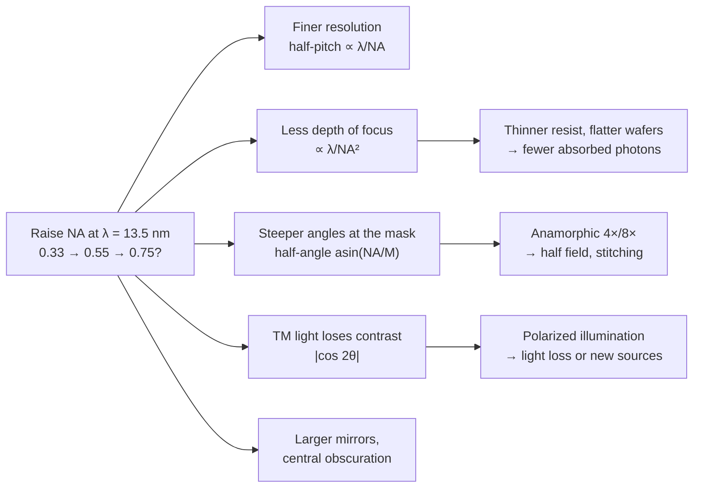

# High-NA and Hyper-NA EUV

EUV lithography reached volume manufacturing with 13.5 nm light and projection optics
of numerical aperture (NA) 0.33. There are only two optical knobs left once the
wavelength is fixed: the process factor $k_1$, which is already close to its floor, and
the NA. ASML's EXE platform raises the NA to **0.55** ("High-NA"), and the first such
scanners are now exposing production wafers. A further step to about **0.75**
("Hyper-NA") is being studied, but no one has committed to building it.

Every step up in NA buys resolution in proportion to $1/\mathrm{NA}$. It pays for it
several times over. Depth of focus shrinks faster than resolution improves. The mask sees
steeper angles, so the optics become anamorphic and the exposure field halves. The
mirrors get larger and the pupil acquires a central hole. Light polarized in the plane of
incidence stops interfering usefully. This page works through those trade-offs one at a
time.

The deployment chronology (which company inserts High-NA into which node, and when) is
told in the [Ångström era](../nodes/angstrom-era.md) page of the Process Nodes section.
Here the focus is the optics physics, and how much of it highuvlith can honestly
simulate.

## Readiness at a glance

| Technology | Readiness (as of Sep 2026) | highuvlith model |
|---|---|---|
| 0.33 NA EUV (NXE), 4× isotropic, 26 × 33 mm field | In production | ✅ [Hopkins imaging](../pipeline.md) through 🔶 [EUV projection optics](../optics.md) (`euv_nxe()`: ideal, unobscured, isotropic pupil); ✅ [Sn LPP source](../sources/lpp.md) |
| 0.55 NA EUV (EXE:5000 / EXE:5200B), anamorphic 4×/8× | In production on selected layers (Intel 18A, since July 2026); TSMC has announced volume use from 2030 | 🔶 [EUV projection optics](../optics.md) `euv_high_na()` (isotropic pupil, assumed 0.2·NA obscuration) with ✅ [vector pupil](../vector-imaging.md); anamorphic reduction and mask-3D effects not modeled (thin mask at wafer scale) |
| Stitching two half fields for large dies | Required for dies larger than 26 × 16.5 mm; throughput penalty press-reported (about 175 → 125 wph), no ASML-published measurement found | not modeled |
| 6 × 12-inch masks restoring a 26 × 33 mm High-NA field | Announced / in development (pilot line planned for 2031) | not modeled |
| Centrally obscured projection pupil | In production (EXE optics) | 🔶 [EUV projection optics](../optics.md) with `central_obscuration` (the EXE's real value is not public; 0.2·NA is assumed) |
| Polarized illumination for EUV | Proposed (design study): IRDS 2024 lists polarized sources among the Hyper-NA challenges | ✅ X/Y/TE/TM/linear illumination states in the [vector pupil](../vector-imaging.md) |
| Hyper-NA EUV (NA ≈ 0.75) | Proposed (design study): on ASML's roadmap as feasibility studies | 🔶 the engines run at NA 0.75 with an idealized pupil; no Hyper-NA lens design, mask-3D or polarized source model |
| NA ≈ 0.85 | Theoretical / speculative: reported as "under investigation" | 🔶 same idealized-pupil caveat |
| 5 nm half-pitch by EUV interference (no projection optics) | Demonstrated in the lab (PSI, 2024) | ✅/🔶 [interference module](../processes/interference-volumetric.md); see [Alternative patterning](alternative-patterning.md) |

Badges follow the [capability matrix](../capability-matrix.md): ✅ implemented,
🔶 simplified, 🧪 theoretical, 🗺️ planned.



## What more NA buys: resolution

The Rayleigh criterion ties the smallest printable half-pitch (HP) to wavelength and NA
[1, 2]:

```math
\mathrm{HP} = k_1 \frac{\lambda}{\mathrm{NA}}.
```

For dense lines and spaces, $k_1$ cannot go below 0.25 in a single exposure. The image
of a grating needs at least two diffraction orders inside the pupil. The widest two can be
apart is the full pupil diameter, $2 \mathrm{NA}/\lambda$ in spatial frequency. So the
smallest pitch is $\lambda/(2 \mathrm{NA})$, a half-pitch of $\lambda/(4 \mathrm{NA})$,
and $k_1 = 0.25$. Production processes sit above that floor. ASML's resolution specs
imply $k_1 \approx 0.32$ at both NAs: 13 nm at NA 0.33 for the NXE:3800E and 8 nm at NA
0.55 for the EXE systems [3, 4].

| NA | HP at the floor ($k_1 = 0.25$) | HP at $k_1 = 0.32$ | Vendor spec (implied $k_1$) |
|---|---|---|---|
| 0.33 | 10.2 nm | 13.1 nm | 13 nm (0.318) |
| 0.55 | 6.1 nm | 7.9 nm | 8 nm (0.326) |
| 0.75 (Hyper-NA) | 4.5 nm | 5.8 nm | none: no product |

!!! warning "Myth: "8 nm resolution" means an 8 nm pitch"
    ASML quotes the EXE's resolution as a critical dimension of 8 nm [4]. That is a
    **half-pitch**: 8 nm lines with 8 nm spaces, a 16 nm pitch, printed at
    $k_1 \approx 0.33$. ASML's own framing is that the EXE prints features 1.7× smaller and
    so reaches transistor densities 2.9× higher than NXE systems ($1.7^2 \approx 2.9$) [4].
    Node names are a separate story again: see
    [What a node is](../nodes/index.md).

The 0.25 floor is a property of *imaging a grating through a lens*, not of 13.5 nm light.
Without projection optics, two coherent EUV beams can interfere at any angle. The Paul
Scherrer Institute printed 5 nm half-pitch lines at 13.5 nm by EUV interference
lithography in 2024 [5]. Two beams meeting at $\sin\theta = \lambda/(2p) = 0.675$ make a
10 nm pitch, so the record corresponds to a two-beam "NA" of 0.675. That arithmetic is
ours; it is not a figure from the paper. It shows that resists and 13.5 nm light can form
such images. It does not show that a scanner can.

## What it costs, part 1: depth of focus

The paraxial Rayleigh depth of focus falls with the *square* of the NA,

```math
\mathrm{DOF} = k_2 \frac{\lambda}{\mathrm{NA}^2},
```

so each step in resolution costs more in focus budget than it gains. At high NA the
paraxial form is too optimistic. Lin derived the non-paraxial version from the
optical-path difference between the axial and the marginal ray, $z(1 - \cos\theta)$ [6]:

```math
\mathrm{DOF} = k_3 \frac{\lambda}{\sin^2(\theta/2)}, \qquad \sin\theta = \mathrm{NA},
```

which reduces to the paraxial form for small angles. His abstract reports that the
paraxial equation overestimates DOF by 10–20% at NA 0.6–0.8. highuvlith's imaging engine
uses the same exact phase: the defocus term is
$(2\pi/\lambda) z (1 - \sqrt{1 - \mathrm{NA}^2\rho^2})$ at every pupil point
([pipeline](../pipeline.md)).

| Step | DOF shrinks by (paraxial, $\propto \mathrm{NA}^{-2}$) | DOF shrinks by (Lin, $\propto \sin^{-2}(\theta/2)$) |
|---|---|---|
| 0.33 → 0.55 | 2.78× | 2.94× |
| 0.55 → 0.75 | 1.86× | 2.05× |
| 0.33 → 0.75 | 5.17× | 6.04× |

A thinner focus budget reaches down the whole process. Resist films must get thinner,
and imec puts it plainly: High-NA brings "thinner films (by the reduced depth of focus
(DOF))" [7]. A thinner film absorbs fewer photons, and fewer photons mean more stochastic
noise, which the [stochastic frontier](stochastic-frontier.md) page follows up. Wafer
flatness and focus control must tighten too. The 2024 IRDS lithography chapter lists
"solutions for meeting small depths-of-focus at 0.55 NA, LER < 1 nm, and overlay ≤ 1.6 nm"
among High-NA's key challenges [8]. Levinson's 2022 review makes the same point about
focus systems and wafer flatness [9].

<figure markdown="span">


<figcaption>The depth-of-focus price of 0.55 NA (Sn LPP, conventional σ 0.9). (a) The angstrom-era page's example: a 32 nm pitch through the NXE and High-NA presets. (b) The High-NA page's example: equal k<sub>1</sub> (32 nm at 0.33, 19.2 nm at 0.55) through ideal unobscured pupils. The engine applies the exact non-paraxial defocus phase per source point; image in air, no resist, no mask-3D best-focus shifts. Models: defocus / through-focus imaging ✅, EUV projection optics 🔶.</figcaption>
</figure>

## What it costs, part 2: the mask, and why the optics are anamorphic

An EUV mask is a mirror. It is a Mo/Si multilayer with an absorber pattern on top,
illuminated off-axis so that the reflected light can leave for the projection optics. In
today's scanners the light "hits the mask at a 6° angle" [21]. The mask side of the
optics has its own numerical aperture: with a reduction factor $M$, the cone of light at
the mask has half-angle

```math
\alpha_\text{mask} = \arcsin\!\left(\frac{\mathrm{NA}}{M}\right).
```

The incident and reflected cones straddle the mask normal. They stay separate only if the
chief ray is tilted by more than $\alpha_\text{mask}$. At NA 0.33 and 4× reduction,
$\alpha_\text{mask} = 4.7°$. Raising the NA to 0.55 at the same 4× would make it 7.9°. The
cones would then overlap around the normal unless the illumination were tilted further
still, and every degree of extra tilt pushes the steepest rays further off the
multilayer's reflection peak and deepens mask shadowing.

<figure markdown="span">
  { width="860" }
  { width="860" }
  <figcaption>Why High-NA optics are anamorphic. The mask-side half-angles asin(NA/M) are computed: 4.7° (0.33 NA, 4×), 7.9° (0.55 NA, 4×), 3.9° (0.55 NA, 8×). All three panels use the same illustrative chief-ray angle of about 6°, and every angle is drawn 3× larger than real. Own work, generated by docs/figures/future/make_future_schematics.py.</figcaption>
</figure>

ASML explains the design choice in plain terms. The bigger mirrors needed for 0.55 NA
"increase the angle at which light hit the reticle", and "at the larger angle the reticle
loses its reflectivity". A uniform 8× reduction would have fixed that but forced
chipmakers onto larger reticles. So the EXE optics demagnify **4× in one direction and 8×
in the other** [4]. The 8× direction is the scan direction, which lies in the plane of
incidence at the mask. Levinson summarizes the rationale in one line: the lenses "are
anamorphic to address mask 3D issues" [9]. With 8× along the scan the mask-side
half-angle drops to 3.9°, and the cones separate again at the usual illumination angle.
Across the slit, where the illumination is not tilted, 4× is kept.

The price is paid in field size. A standard 6-inch mask exposes a 26 × 33 mm field
(858 mm²) at 4×, but only **26 × 16.5 mm** (429 mm²) through anamorphic optics [9]. ASML
compensated with faster stages. The EXE wafer stage accelerates at 8 g and the reticle
stage at 32 g, twice and four times as fast as on NXE, so that doubling the number of
exposures per wafer does not halve the throughput [4]. Dies larger than a half field must
be **stitched** from two exposures, with the two halves aligned across the seam. Tom's
Hardware reports that stitching cuts an EXE:5200B from up to 175 wafers per hour to about
125 [10, 11]. That figure is press-reported; we found no ASML publication of a measured
stitching throughput, and ASML's own specification (≥ 175 wph at 50 mJ/cm²) is for
unstitched half fields [4]. The longer-term fix now being organized is a new mask format.
ASML, Intel, Samsung and TSMC back a move to 6 × 12-inch reticles, which double the mask
along the 8× direction and restore the full 26 × 33 mm field [11]. TSMC has announced that
it will start High-NA volume production in 2030 on conventional 6 × 6-inch masks, run a
6 × 12-inch pilot line in 2031, and bring 6 × 12-inch High-NA systems into production by
2033 [12]. These are announced plans, not delivered results.

!!! note "Mask 3D effects: real, and outside this simulator"
    An EUV absorber is tens of nanometres thick, several wavelengths, and it is lit at an
    angle. The reflections can cause shadowing and mask-induced imaging aberrations [21].
    The literature groups these "3-D mask effects" as telecentricity errors, contrast
    fading and best-focus shifts [14]. They are the reason the optics are anamorphic, and
    they grow with NA. Lee *et al.* expect "the larger incidence angles on mask when the
    NA increases above 0.55" to "further enhance the M3D effects forcing additional mask
    changes" [13]. Attenuated phase-shift absorbers are one studied mitigation [14], and
    the IRDS lists new absorber materials among the mask challenges [8]. **highuvlith
    uses a thin (Kirchhoff) mask everywhere.** Masks are specified at wafer scale, so the
    anamorphic reduction does not enter the wafer image at all. Rigorous mask 3D (EMF)
    simulation is out of scope today; see the [roadmap](../roadmap.md).

What highuvlith *can* show is the multilayer's side of ASML's argument. The new
[multilayer module](../materials.md) computes an ideal Mo/Si stack with Parratt recursion
and CXRO/Henke optical constants. Tuned for the chief ray, the stack reflects about 0.72
to 0.63 across the NXE cone. For a 0.55 NA cone at 4×, with the chief ray tilted just
enough to clear the normal, it falls to about 0.11 at the steepest ray. The example
further down reproduces these numbers.

<figure markdown="span">


<figcaption>Why the High-NA mask wants 8× in one direction (the High-NA page's example): reflectance of an ideal 40-period Mo/Si blank at 13.5 nm, period tuned for the chief-ray angle (max(6°, cone half-angle)), against the mask-side cone half-angle asin(NA/M). Bars show each design's cone and the reflectance at its two edges. Ideal multilayer: no absorber, capping or roughness, and the single worst ray — not a mask-3D calculation. Model: multilayer mirrors ✅.</figcaption>
</figure>

## What it costs, part 3: bigger mirrors and a central obscuration

A higher NA means a wider cone of light and therefore larger optics. ASML states that its
EUV machines' "largest mirrors are 1 meter across" at NA 0.55 [15]. The EXE design also
has a **central obscuration**: part of the middle of the pupil is blocked. Levinson notes
that High-NA simulators characterize the aberrations of "lenses with central
obscurations" with Tatian polynomials rather than the usual Zernikes [9].

An obscured pupil transmits an annulus of angles rather than a full disc. Diffraction
orders that land in the hole do not reach the wafer, so which pitches image well depends
on how the illuminator places the orders around it. highuvlith's
[EUV projection optics](../optics.md) (🔶) take an optional central obscuration:
`OpticsConfig.euv_projection(numerical_aperture=…, central_obscuration=…)`, with presets
`euv_nxe()` (0.33 NA, unobscured) and `euv_high_na()` (0.55 NA, obscuration 0.2·NA). The
0.2 is an assumption, not a published EXE number. The model is an isotropic wafer-side
pupil: it has no anamorphic reduction, no mask 3D effects and no multilayer apodization,
so treat it as a feel for obscured-pupil imaging rather than a model of the EXE. Avoid
near-coherent illumination with an obscured pupil unless you want dark-field imaging:
the zero order then falls into the hole. The examples on this page use an unobscured
`euv_projection` pupil so that NA is the only thing that changes.

## What it costs, part 4: polarization

Light is a transverse wave, and at high NA that starts to matter. When two diffraction
orders interfere on the wafer, only the components of their electric fields along the
same direction can interfere. Take two plane waves at angles $\pm\theta$ from the normal.

- **TE (s) polarization**, with the field perpendicular to the plane of incidence: the two
  fields are parallel, and the fringes keep full contrast, $V_\text{TE} = 1$.
- **TM (p) polarization**, with the field in the plane of incidence: the two fields are
  rotated by $2\theta$ relative to each other. Only the projection interferes, so
  $V_\text{TM} = |\cos 2\theta|$. It reaches zero at $\theta = 45°$, and beyond that the
  fringes reverse.
- **Unpolarized light** is an incoherent mix of the two, with
  $V = (1 + \cos 2\theta)/2 = \cos^2\theta$.

These are standard vector-imaging results [16]. At the pitch limit the two orders sit at
the pupil edge, so $\sin\theta = \mathrm{NA}$ in the recording medium, or $\mathrm{NA}/n$
inside a resist of index $n$.

<figure markdown="span">
  { width="860" }
  { width="860" }
  <figcaption>Two-beam fringe contrast for TE, TM and unpolarized light (closed-form optics, computed). Markers sit at the pitch limit (orders at the pupil edge) for EUV 0.33, 0.55 and 0.75 NA, with resist index ≈ 1 at 13.5 nm, and for ArF immersion at NA 1.35 inside a resist of index ≈ 1.7. Own work, generated by docs/figures/future/make_future_figures.py.</figcaption>
</figure>

??? info "Data: contrast at the pitch limit"

    | Case | $\sin\theta$ | TE | TM, $\lvert\cos 2\theta\rvert$ | Unpolarized, $\cos^2\theta$ |
    |---|---|---|---|---|
    | EUV, NA 0.33 | 0.33 | 1 | 0.78 | 0.89 |
    | High-NA, 0.55 | 0.55 | 1 | 0.40 | 0.70 |
    | Hyper-NA, 0.75 | 0.75 | 1 | 0.13 | 0.44 |
    | ArF immersion, NA 1.35, in resist $n \approx 1.7$ | 0.79 | 1 | 0.26 | 0.37 |

    The same numbers come out of highuvlith's vector pupil (example below). Inside a real
    resist, the Fresnel transmission at the film entrance differs for s and p, so the
    unpolarized ArF value computed with a film comes out at 0.34 rather than 0.37.

The table reads directly as a roadmap. At 0.33 NA an unpolarized source loses little. At
0.55 the TM half of the light has already lost more than half its contrast at the tightest
pitches. Lee *et al.* at imec conclude that "already at NA 0.55, a small contrast loss is
predicted due to the use of unpolarized light in the scanner. Further increasing the NA
will enhance the contrast loss" [13]. At 0.75 the TM fringes are nearly gone. imec's Kurt
Ronse put it bluntly in 2024: "If you go higher than 0.55, very quickly you see that
polarization is killing your contrast" [17].

Deep-UV lithography met the same physics first. In November 2004 Nikon announced "the
industry's first advanced polarized illumination system" (POLANO) for its dry ArF
scanners with NA above 0.90. Nikon claimed it improved image contrast by 20 percent
[18]. The cure in EUV is harder. The IRDS notes that current tin-plasma
sources produce unpolarized light, that "using polarizers would reduce the light
transmitted to wafer by over a factor of 2", and that free-electron lasers, which emit
polarized light, are one alternative [8]. That links Hyper-NA to the
[accelerator light sources](accelerator-light-sources.md) page.

highuvlith has a full [vector imaging](../vector-imaging.md) path (✅): TE/TM
decomposition for every diffraction order, unpolarized, X, Y, linear, TE and TM
illumination, an immersion index, and Fresnel transmission into a film. It still treats
the mask as thin and the lens as ideal: there is no Jones pupil or birefringence model.
The scalar engine remains the default and is flagged 🔶 above NA ≈ 0.8, where it
overstates contrast.

<figure markdown="span">


<figcaption>Polarization at high NA. (a) Fringe contrast of two diffraction orders at the pupil edge from the vector pupil model: TE stays at 1, TM follows |cos 2θ| and vanishes at NA = 1/√2, unpolarized light gives cos²θ; inside a resist film (n = 1.7) the refracted angle is smaller and TM recovers. (b) Full vector imaging of dense 1:1 lines (193.368 nm, pitch 1.1 λ/NA, conventional σ 0.3) shows the same ordering. Model: vector (TE/TM) imaging ✅ — thin mask, no mask-3D or lens polarization aberrations.</figcaption>
</figure>

## Hyper-NA: the next step, if it is taken

**Status.** Hyper-NA is on ASML's roadmap as a study, not a product.

- Martin van den Brink, ASML's then technology chief, said in early 2024 that an NA above
  0.7 "is certainly an opportunity that will become more visible from around 2030" [19].
- In June 2024 EE Times reported his vision of offering Hyper-NA, "reaching 0.75 NA",
  around 2030. ASML clarified that "this is Martin's vision regarding Hyper-NA, and
  feasibility studies are currently ongoing" [17].
- ASML placed Hyper-NA on its roadmap at imec's ITF World in May 2024 [19].
- At its November 2024 Investor Day, ASML spoke of affordable scaling "for both 0.33 NA,
  0.55 NA and potentially Hyper NA". It showed a common platform in which a Hyper NA
  (0.75) configuration would share modules with the lower-NA tools [20].
- Tom's Hardware reported in May 2026 that the primary target is 0.75 NA, that 0.85 NA
  is also under investigation, and that Zeiss has begun preliminary lens designs [19].

A cost of roughly $720 million per tool circulates in the press, attributed to TrendForce
[19]. Treat it as speculation: no such tool has been specified or priced.

**What it would buy.** At $k_1 = 0.32$, 0.75 NA reaches a 5.8 nm half-pitch; the
single-exposure floor is 4.5 nm. The IRDS says Hyper-NA systems (NA ≥ 0.75) are "under
consideration to address <16 nm pitches as may be required after 2035", and that the
option "could be in use as early as 2033 if this option is pursued" [8].

**What it would cost.** Every item on this page gets worse.

- **Depth of focus.** DOF shrinks by another 1.9–2.1× relative to 0.55 NA. The IRDS
  expects this to "drive resist thicknesses even smaller and flatness requirements even
  tighter" [8].
- **Polarization.** TM contrast at the pitch limit is 0.13. Polarized illumination costs
  more than half the light with polarizers, or needs a new kind of source [8].
- **Mask angles.** At 8× the mask-side half-angle would be 5.4°, which uses up nearly all
  of today's 6° illumination tilt [21]. Steeper mask illumination strengthens the mask 3D
  effects that are already a problem at 0.55 [13].
- **Optics.** The IRDS notes that higher NA "would inherently drive larger optical
  elements" [8], on top of mirrors that are already a meter across [15].
- **Photons.** Smaller features at the same dose collect fewer photons each. See the
  λ³ argument on the [stochastic frontier](stochastic-frontier.md) page.

The IRDS also frames the real decision. The industry "must make an ecosystem development
decision in the next few years as to whether hyper-NA 13.5 nm or BEUV is preferred" [8].
The shorter-wavelength branch of that choice is on the
[Beyond EUV](beyond-euv.md) page.

!!! warning "Myth: Hyper-NA has been announced"
    As of September 2026 no Hyper-NA scanner has been announced as a product, specified,
    or priced by ASML. Every public statement on this page is a roadmap option, a vision,
    or a feasibility study. The timeline above is the industry's stated intent, and it can
    change.

## Try it in highuvlith

Each example runs in under half a minute; the imaging ones spend most of it building
kernels. Contrast values quoted in the text come from the current engine and may shift
slightly as the models improve.

!!! example "Try it in highuvlith: resolution at 0.33 vs 0.55 NA"
    The same 13.5 nm source through an ideal, unobscured EUV projection pupil at two NAs.
    Grids are commensurate: the field is 8 pitches wide.

    <!-- verify-example -->
    ```python
    import highuvlith as huv

    src = huv.SourceConfig.lpp_sn_13nm5(0.9)            # 13.5 nm, conventional sigma 0.9
    for na in (0.33, 0.55):
        opt = huv.OpticsConfig.euv_projection(numerical_aperture=na)   # isotropic, unobscured
        for pitch in (32.0, 24.0, 16.0):
            mask = huv.MaskConfig.line_space(pitch / 2, pitch)
            grid = huv.GridConfig(128, pitch / 16)      # field = 8 pitches (commensurate)
            c = huv.SimulationEngine(src, opt, mask, grid=grid).compute_aerial_image().image_contrast()
            print(f"NA {na:.2f}  pitch {pitch:4.0f} nm  k1 {pitch / 2 * na / 13.5:.2f}  contrast {c:.2f}")
    ```

    ??? success "Output"

        ```text
        NA 0.33  pitch   32 nm  k1 0.39  contrast 0.51
        NA 0.33  pitch   24 nm  k1 0.29  contrast 0.11
        NA 0.33  pitch   16 nm  k1 0.20  contrast 0.00
        NA 0.55  pitch   32 nm  k1 0.65  contrast 0.89
        NA 0.55  pitch   24 nm  k1 0.49  contrast 0.75
        NA 0.55  pitch   16 nm  k1 0.33  contrast 0.25
        ```

    At 0.33 NA the contrast falls from about 0.50 (32 nm pitch) to 0.10 (24 nm) and zero
    at 16 nm, where $k_1 = 0.20$ is below the floor. At 0.55 NA the same pitches give about
    0.89, 0.75 and 0.26. Conventional illumination keeps the example simple; real scanners
    use dipole or other off-axis illumination to recover contrast near the limit.

!!! example "Try it in highuvlith: why the mask wants 8× (multilayer angular acceptance)"
    Reflectance of an ideal Mo/Si mask blank across the mask-side cone, with the period
    tuned for the chief ray.

    <!-- verify-example -->
    ```python
    import math
    from highuvlith.api import MultilayerMirror, tune_multilayer_period

    for label, na, mag in (("NXE 0.33, 4x", 0.33, 4), ("0.55 at 4x", 0.55, 4), ("EXE 0.55, 8x", 0.55, 8)):
        half = math.degrees(math.asin(na / mag))        # mask-side cone half-angle
        cra = max(6.0, half)                            # chief ray must clear the mask normal
        d = tune_multilayer_period("mo_si", 13.5, 40, angle_deg=cra)
        ml = MultilayerMirror.mo_si(period_nm=d)        # Mo/Si tuned for the chief ray
        lo, hi = (ml.reflectance(13.5, angle_deg=a) for a in (cra - half, cra + half))
        print(f"{label:13s} cone {half:3.1f} deg, chief ray {cra:3.1f} deg: R = {lo:.2f} ... {hi:.2f}")
    ```

    ??? success "Output"

        ```text
        NXE 0.33, 4x  cone 4.7 deg, chief ray 6.0 deg: R = 0.72 ... 0.63
        0.55 at 4x    cone 7.9 deg, chief ray 7.9 deg: R = 0.71 ... 0.11
        EXE 0.55, 8x  cone 3.9 deg, chief ray 6.0 deg: R = 0.72 ... 0.68
        ```

    This prints roughly R = 0.72 … 0.63 for NXE, 0.71 … 0.11 for 0.55 NA at 4×, and
    0.72 … 0.68 for the EXE's 8× direction. It models an ideal multilayer (no absorber,
    capping or roughness) and the single worst ray, not a full mask-3D calculation.

!!! example "Try it in highuvlith: TE, TM and unpolarized two-beam contrast"
    The [vector pupil](../vector-imaging.md) reproduces the closed forms above. For orders
    along x, `"y"` is TE and `"x"` is TM; `p0=1` (the default) puts both orders at the
    pupil edge.

    <!-- verify-example -->
    ```python
    from highuvlith.api import vector_two_beam_contrast

    for na in (0.33, 0.55, 0.75):
        te = vector_two_beam_contrast(na, "y")            # E perpendicular to the plane of incidence
        tm = vector_two_beam_contrast(na, "x")            # E in the plane of incidence
        un = vector_two_beam_contrast(na, "unpolarized")
        print(f"NA {na:.2f}:  TE {te:.3f}  TM {tm:.3f}  unpolarized {un:.3f}")
    # ArF immersion, NA 1.35 in water (n = 1.437), recorded inside a resist of index 1.7:
    print(f"NA 1.35 water, TM in resist: {vector_two_beam_contrast(1.35, 'x', image_index=1.437, film_n=1.7):.3f}")
    ```

    ??? success "Output"

        ```text
        NA 0.33:  TE 1.000  TM 0.782  unpolarized 0.891
        NA 0.55:  TE 1.000  TM 0.395  unpolarized 0.697
        NA 0.75:  TE 1.000  TM 0.125  unpolarized 0.437
        NA 1.35 water, TM in resist: 0.261
        ```

    Expected: TM 0.782, 0.395 and 0.125 and unpolarized 0.891, 0.697 and 0.437 at 0.33,
    0.55 and 0.75 NA. The ArF TM value inside the resist is 0.261.

!!! example "Try it in highuvlith: depth of focus at equal k1"
    Compare 0.33 and 0.55 NA at the same $k_1 \approx 0.39$ (32 nm and 19.2 nm pitch)
    through focus. The engine applies the exact non-paraxial defocus phase at every
    source point.

    <!-- verify-example -->
    ```python
    import highuvlith as huv

    src = huv.SourceConfig.lpp_sn_13nm5(0.9)
    focus = [0.0, 30.0, 60.0, 90.0]                         # nm of defocus
    for na, pitch in ((0.33, 32.0), (0.55, 19.2)):          # same k1 = 0.39
        opt = huv.OpticsConfig.euv_projection(numerical_aperture=na)
        mask = huv.MaskConfig.line_space(pitch / 2, pitch)
        eng = huv.SimulationEngine(src, opt, mask, grid=huv.GridConfig(128, pitch / 16))
        cs = [img.image_contrast() for img in eng.compute_through_focus(focus)]
        print(f"NA {na}: " + "  ".join(f"{z:+4.0f} nm {c:.2f}" for z, c in zip(focus, cs)))
    ```

    ??? success "Output"

        ```text
        NA 0.33:   +0 nm 0.51   +30 nm 0.48   +60 nm 0.41   +90 nm 0.31
        NA 0.55:   +0 nm 0.51   +30 nm 0.32   +60 nm 0.03   +90 nm 0.05
        ```

    Both start near 0.50 contrast in focus. The 0.55 NA image fades roughly three times
    faster with defocus, in line with the 2.8–2.9× DOF ratio in the table above.

## Key takeaways

- High-NA (0.55) is in production for selected layers. Its resolution spec is an **8 nm
  half-pitch** at $k_1 \approx 0.33$, and the gain over 0.33 NA is about 1.7× in
  dimension and 2.9× in density.
- Depth of focus shrinks about 2.8–2.9× from 0.33 to 0.55 NA, and another 1.9–2.1× to
  0.75. Thinner resists follow, and with them more photon noise.
- The optics are **anamorphic (4×/8×)** because a reflective mask cannot accept the
  steeper cone of light that 0.55 NA at 4× would need. The price is a 26 × 16.5 mm field,
  stitching for large dies, and an industry push toward 6 × 12-inch masks.
- **Polarization** costs TM contrast as $|\cos 2\theta|$. It is already noticeable at
  0.55 NA and severe at 0.75, where tin-plasma sources would need polarizers (more than
  2× light loss) or new, polarized sources.
- **Hyper-NA (0.75)** is a feasibility study, not a product. The IRDS places it after
  about 2033–2035 and pits it against a shorter-wavelength (BEUV) alternative.
- highuvlith simulates the imaging side honestly: exact scalar imaging and defocus, a
  vector pupil with polarized illumination, isotropic EUV projection pupils with an
  optional (assumed) central obscuration, and ideal multilayers. It does **not** model
  mask 3D effects, the anamorphic reduction, or real EXE lens aberrations.

## References and further reading

1. E. Abbe, "Beiträge zur Theorie des Mikroskops und der mikroskopischen Wahrnehmung," *Archiv für mikroskopische Anatomie* **9**, 413–468 (1873), [doi:10.1007/BF02956173](https://doi.org/10.1007/BF02956173).
2. Lord Rayleigh, "Investigations in optics, with special reference to the spectroscope," *Philosophical Magazine* **8**(49), 261–274 (1879), [doi:10.1080/14786447908639684](https://doi.org/10.1080/14786447908639684).
3. ASML, TWINSCAN NXE:3800E product page (13 nm resolution, 0.33 NA, ≥ 220 wafers per hour), [asml.com](https://www.asml.com/en/products/euv-lithography-systems/twinscan-nxe-3800e) (retrieved 30 Sep 2026).
4. ASML, "5 things you should know about High NA EUV lithography," 25 January 2024, [asml.com](https://www.asml.com/en/company/stories/2024/5-things-high-na-euv); and the TWINSCAN [EXE:5000](https://www.asml.com/en/products/euv-lithography-systems/twinscan-exe-5000) (8 nm, 0.55 NA, ≥ 110 wafers per hour at 50 mJ/cm²) and [EXE:5200B](https://www.asml.com/en/products/euv-lithography-systems/twinscan-exe-5200b) (≥ 175 wafers per hour at 50 mJ/cm²) product pages (retrieved 30 Sep 2026).
5. I. Giannopoulos, I. Mochi, M. Vockenhuber, Y. Ekinci, D. Kazazis, "Extreme ultraviolet lithography reaches 5 nm resolution," *Nanoscale* **16**, 15533–15543 (2024), [doi:10.1039/D4NR01332H](https://doi.org/10.1039/D4NR01332H).
6. B. J. Lin, "The k3 coefficient in nonparaxial λ/NA scaling equations for resolution, depth of focus, and immersion lithography," *J. Micro/Nanolithogr. MEMS MOEMS* **1**(1), 7–12 (2002), [doi:10.1117/1.1445798](https://doi.org/10.1117/1.1445798).
7. imec, "Imec demonstrates readiness of High-NA EUV patterning ecosystem," press release, 26 February 2024, [imec-int.com](https://www.imec-int.com/en/press/imec-demonstrates-readiness-high-na-euv-patterning-ecosystem).
8. IEEE IRDS, *International Roadmap for Devices and Systems, 2024 Edition: Lithography*, [pdf](https://irds.ieee.org/images/files/pdf/2024/2024IRDS_LITHO.pdf) (Tables LITH-2 and LITH-4 and the Hyper-NA and BEUV discussion).
9. H. J. Levinson, "High-NA EUV lithography: current status and outlook for the future," *Jpn. J. Appl. Phys.* **61**, SD0803 (2022), [doi:10.35848/1347-4065/ac49fa](https://doi.org/10.35848/1347-4065/ac49fa).
10. A. Shilov, "Intel surpasses one million High-NA EUV wafers processed …," *Tom's Hardware*, 8 September 2026, [link](https://www.tomshardware.com/tech-industry/semiconductors/intel-surpasses-one-million-high-na-euv-wafers-processed-outpaces-the-rest-of-the-industry-combined-company-also-trailblazing-giant-6-12-photomasks-to-speed-production-and-lower-costs1).
11. A. Shilov, "TSMC, Samsung, and Intel shore up support with ASML to deploy larger High-NA EUV photomasks …," *Tom's Hardware*, 10 September 2026, [link](https://www.tomshardware.com/tech-industry/semiconductors/tsmc-samsung-and-intel-shore-up-support-with-asml-to-deploy-larger-high-na-euv-photomasks-6-12-inch-photomask-transition-may-take-years-despite-unified-effort).
12. A. Shilov, "TSMC to start using High-NA EUV lithography in 2030 …," *Tom's Hardware*, 8 September 2026, [link](https://www.tomshardware.com/tech-industry/semiconductors/tsmc-to-start-using-high-na-euv-lithography-in-2030-a10-or-a11-technology-prime-candidates-for-use).
13. I. Lee, J. Franke, V. Philipsen, K. Ronse, S. De Gendt, E. Hendrickx, "Hyper-NA EUV lithography: an imaging perspective," *Proc. SPIE* **12494**, 1249405 (2023), [doi:10.1117/12.2659153](https://doi.org/10.1117/12.2659153).
14. A. Erdmann, P. Evanschitzky, H. Mesilhy, V. Philipsen, E. Hendrickx, M. Bauer, "Attenuated phase shift mask for extreme ultraviolet: can they mitigate three-dimensional mask effects?," *J. Micro/Nanolithogr. MEMS MOEMS* **18**(1), 011005 (2018), [doi:10.1117/1.JMM.18.1.011005](https://doi.org/10.1117/1.JMM.18.1.011005).
15. ASML, "Lenses & mirrors" (lithography principles), [asml.com](https://www.asml.com/en/technology/lithography-principles/lenses-and-mirrors) (retrieved 30 Sep 2026).
16. D. G. Flagello, T. Milster, A. E. Rosenbluth, "Theory of high-NA imaging in homogeneous thin films," *J. Opt. Soc. Am. A* **13**(1), 53–64 (1996), [doi:10.1364/JOSAA.13.000053](https://doi.org/10.1364/JOSAA.13.000053).
17. A. Patterson, "ASML Aims for Hyper-NA EUV, Shrinking Chip Limits," *EE Times*, 12 June 2024, [eetimes.com](https://www.eetimes.com/asml-aims-for-hyper-na-euv-shrinking-chip-limits/).
18. Nikon Precision, "Nikon Pushes Dry Lithography below the 65 nm Node with POLANO," press release, 20 November 2004, [nikonprecision.com](https://www.nikonprecision.com/nikon-pushes-dry-lithography-below-the-65-nm-node-with-polano/).
19. L. James, "ASML's roadmap for chipmaking lithography tools examined — from DUV to Low-NA, High-NA, Hyper-NA, and beyond," *Tom's Hardware*, 1 May 2026, [link](https://www.tomshardware.com/tech-industry/semiconductors/asml-lithograpy-roadmap-examined-from-duv-to-hyper-na).
20. ASML, Investor Day presentation, 14 November 2024 (SEC Form 6-K exhibit 99.4), [sec.gov](https://www.sec.gov/Archives/edgar/data/937966/000093796624000026/exhibit994.htm).
21. M. LaPedus, "Gearing Up For High-NA EUV," *Semiconductor Engineering*, 21 October 2021, [semiengineering.com](https://semiengineering.com/gearing-up-for-high-na-euv/) ("EUV light hits the mask at a 6° angle"; shadowing and mask-induced aberrations).

Further reading on deployment and pilot results:

- A. Shilov, "Intel installs industry's first commercial High-NA EUV lithography tool — ASML Twinscan EXE:5200B sets the stage for 14A," *Tom's Hardware*, 17 December 2025, [link](https://www.tomshardware.com/tech-industry/semiconductors/intel-installs-industrys-first-commercial-high-na-euv-lithography-tool-asml-twinscan-exe-5200b-sets-the-stage-for-14a) (175 wafers per hour at 50 mJ/cm², 0.7 nm overlay).
- E. Uko, "Intel becomes the first company to ship high-volume logic chips made with ASML's High NA EUV …," *Tom's Hardware*, 15 July 2026, [link](https://www.tomshardware.com/tech-industry/semiconductors/intel-becomes-the-first-company-to-ship-high-volume-logic-chips-made-with-asmls-high-na-euv-select-panther-lake-layers-on-18a-are-now-dual-qualified-for-0-55-na-scanners) (selected 18A layers, dual-qualified on 0.33 and 0.55 NA scanners).
- "ASML sets density record with latest chipmaking tools — High-NA EUV equipment prints first patterns," *Tom's Hardware*, 17 April 2024, [link](https://www.tomshardware.com/tech-industry/asml-sets-density-record-with-latest-chipmaking-tools-high-na-euv-equipment-prints-first-patterns) ("the first-ever 10 nanometer dense lines").
- imec press releases: [logic and DRAM structures with High NA EUV](https://www.imec-int.com/en/press/imec-demonstrates-logic-and-dram-structures-using-high-na-euv-lithography) (7 Aug 2024: random logic down to 9.5 nm lines at 19 nm pitch in single exposure); [single-patterning milestones](https://www.imec-int.com/en/press/imec-achieves-new-milestones-single-patterning-high-na-euv-lithography-both-damascene-and) (22 Sep 2025: 20 nm pitch lines with 13 nm tip-to-tip; 100% electrical test yield on 20 nm pitch Ru lines); [chemically amplified resists for High NA](https://www.imec-int.com/en/press/imec-demonstrates-extension-chemically-amplified-resists-high-na-euv-lithography) (8 Sep 2026: 22 nm pitch lines, 28 nm via spacing).
- J. van Schoot *et al.*, "EUV lithography scanner for sub-8nm resolution," *Proc. SPIE* **9422**, 94221F (2015), [doi:10.1117/12.2087502](https://doi.org/10.1117/12.2087502), an early description of the anamorphic High-NA concept.
- In this site: [Ångström era](../nodes/angstrom-era.md) and [lithography arithmetic](../nodes/litho-math.md) (Process Nodes); [Beyond EUV](beyond-euv.md), [stochastic frontier](stochastic-frontier.md), [accelerator light sources](accelerator-light-sources.md); simulator pages on [vector imaging](../vector-imaging.md), [optics](../optics.md), [materials and multilayers](../materials.md) and the [capability matrix](../capability-matrix.md).
