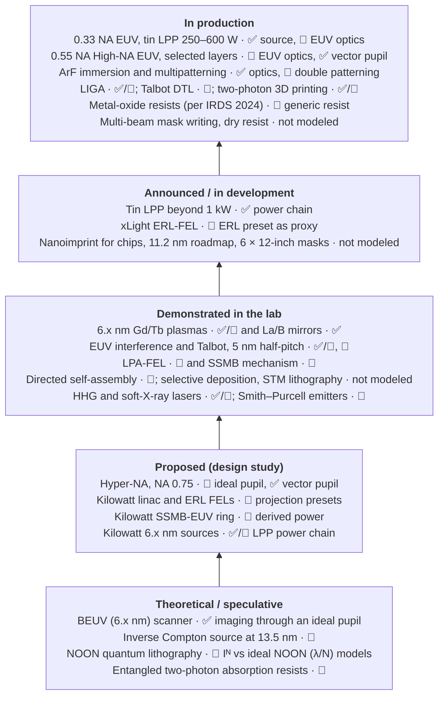

# The future of lithography

Chipmaking now prints its finest layers with 13.5 nm extreme-ultraviolet (EUV) light,
through reflective optics with a numerical aperture (NA) of 0.33. The first 0.55 NA
"High-NA" scanners have started exposing production wafers. What comes after that? The
candidates fall into six families: more NA, a shorter wavelength, a brighter source,
better resists, a different way of patterning altogether, and physics that has not yet
left the laboratory. This section takes each family in turn and asks the same three
questions:

- **How ready is it?** In production, announced, shown in a lab, only designed, or still
  theory.
- **What limits it?** Usually one of a handful of physical constraints, set out
  [below](#the-limits-that-frame-everything).
- **What can the simulator tell you about it?** highuvlith models some of these ideas in
  detail, some only roughly, and some not at all. Every page says which.

!!! info "How to read this section"
    Two scales appear throughout, and they measure different things.

    **Readiness** describes the *technology*, as of September 2026, in five steps:
    **In production** (running in fabs or sold as production tools) · **Announced / in
    development** (a company or national program has committed and published plans) ·
    **Demonstrated in the lab** (the key physics has been shown experimentally, not at
    production scale) · **Proposed (design study)** (worked out on paper, not built) ·
    **Theoretical / speculative** (physically possible in principle, far from any
    design).

    The **badges** describe the *simulator's model* and come from the
    [capability matrix](../capability-matrix.md): ✅ Implemented (computed and validated) ·
    🔶 Simplified (runs, with stated approximations) · 🧪 Theoretical (runnable, but it
    models speculative physics) · 🗺️ Planned (not in code). "Not modeled" means there is
    no code at all. A ✅ model of a source that does not exist is still a model of a source
    that does not exist.

<div class="grid cards" markdown>

-   **[High-NA and Hyper-NA EUV](high-na-and-hyper-na.md)**

    0.55 NA in production, 0.75 NA on the drawing board: anamorphic optics, half fields,
    depth of focus and polarization.

-   **[Beyond EUV: 6.x nm and X-rays](beyond-euv.md)**

    Gadolinium plasmas, lanthanum/boron mirrors, the 11.2 nm alternative, and the X-ray
    lithography that survives as LIGA.

-   **[Accelerator light sources](accelerator-light-sources.md)**

    Free-electron lasers, energy-recovery linacs, steady-state microbunching, inverse
    Compton and laser-plasma accelerators against the kilowatt tin source.

-   **[The stochastic frontier](stochastic-frontier.md)**

    Photons, electrons and molecules at EUV doses; the resolution–roughness–dose
    trade-off; failures, throughput and the new resists.

-   **[Alternatives to projection](alternative-patterning.md)**

    Nanoimprint, self-assembly, electron beams, selective deposition, interference and
    Talbot lithography, atom-by-atom patterning and 3D printing.

-   **[Quantum and exotic lithography](quantum-and-exotic.md)**

    Entangled-photon (NOON) lithography, the entangled two-photon absorption dispute, and
    free-electron and table-top sources.

</div>

## The readiness ladder

Every technology discussed in this section sits on one rung, with the simulator's badge
beside it. The rung is the most advanced *lithography-relevant* result we could verify;
the pages give the evidence and the sources.



??? info "The ladder as a table, with links"

    | Technology | Readiness (Sep 2026) | highuvlith model | Page |
    |---|---|---|---|
    | 0.33 NA EUV with tin LPP sources (250–600 W) | In production | ✅ [LPP source](../sources/lpp.md), 🔶 [EUV projection optics](../optics.md) | [High-NA](high-na-and-hyper-na.md), [accelerators](accelerator-light-sources.md) |
    | 0.55 NA High-NA EUV | In production (selected layers) | 🔶 isotropic EUV projection pupil, ✅ [vector pupil](../vector-imaging.md) | [High-NA](high-na-and-hyper-na.md) |
    | ArF immersion and multipatterning | In production | ✅ immersion optics, 🔶 double patterning | [research modules](../research-modules.md) |
    | Multi-beam e-beam mask writing | In production | not modeled | [alternatives](alternative-patterning.md) |
    | Dry metal-organic resist | In production (company-reported, DRAM) | not modeled | [stochastics](stochastic-frontier.md) |
    | LIGA deep X-ray lithography | In production (niche) | ✅/🔶 [LIGA](../processes/liga-deep-xray.md) | [beyond EUV](beyond-euv.md) |
    | Displacement Talbot lithography | In production (photonics, per the vendor) | 🔶 [Talbot](../processes/talbot.md) | [alternatives](alternative-patterning.md) |
    | Two-photon polymerization | In production (micro-3D printers) | ✅/🔶 [two-photon voxels](../processes/interference-volumetric.md) | [alternatives](alternative-patterning.md) |
    | Tin LPP beyond 1 kW | Announced (1 kW proof of concept 2025; 1.5–2 kW roadmap) | ✅ power chain | [accelerators](accelerator-light-sources.md) |
    | xLight fab-scale FEL | Announced / in development | 🧪 ERL preset as proxy | [accelerators](accelerator-light-sources.md) |
    | Nanoimprint for chips | Announced / in development (NAND fab evaluation since 2017; volume production not confirmed) | not modeled | [alternatives](alternative-patterning.md) |
    | Spin-on metal-oxide resists | In production (IRDS 2024: "started to be used in production") | 🔶 generic resist parameters | [stochastics](stochastic-frontier.md) |
    | 11.2 nm lithography (Xe plasma, Ru/Be mirrors) | Announced (national roadmap) | not modeled | [beyond EUV](beyond-euv.md) |
    | 6 × 12-inch masks for full-field High-NA | Announced / in development | not modeled | [High-NA](high-na-and-hyper-na.md) |
    | Gd/Tb plasma sources at 6.5–6.7 nm | Demonstrated in the lab | ✅/🔶 [LPP](../sources/lpp.md) | [beyond EUV](beyond-euv.md) |
    | La/B multilayer mirrors | Demonstrated in the lab | ✅ [multilayer model](../materials.md) | [beyond EUV](beyond-euv.md) |
    | EUV interference and Talbot lithography | Demonstrated in the lab | ✅/🔶 [interference](../processes/interference-volumetric.md), 🔶 [Talbot](../processes/talbot.md) | [alternatives](alternative-patterning.md) |
    | Laser-plasma-accelerator FEL | Demonstrated in the lab | 🔶 [LPA-FEL](../sources/lpa-fel.md) | [accelerators](accelerator-light-sources.md) |
    | Steady-state microbunching (mechanism) | Demonstrated in the lab (1064 nm, one turn) | 🧪 [SSMB](../sources/ssmb.md) | [accelerators](accelerator-light-sources.md) |
    | Directed self-assembly | Demonstrated in the lab (pilot lines) | 🔶 [DSA](../research-modules.md) | [alternatives](alternative-patterning.md) |
    | Area-selective deposition, STM lithography, volumetric printing | Demonstrated in the lab | not modeled | [alternatives](alternative-patterning.md) |
    | HHG and soft-X-ray lasers at EUV wavelengths | Demonstrated in the lab | ✅/🔶 [HHG](../sources/hhg.md), [soft-X-ray laser](../sources/soft-xray-laser.md) | [quantum and exotic](quantum-and-exotic.md) |
    | Smith–Purcell and van der Waals X-ray emitters | Demonstrated in the lab (not at useful EUV power) | 🧪 [Smith–Purcell](../sources/smith-purcell.md) | [quantum and exotic](quantum-and-exotic.md) |
    | Hyper-NA (NA ≈ 0.75) | Proposed (feasibility studies) | 🔶 ideal pupil, ✅ vector pupil | [High-NA](high-na-and-hyper-na.md) |
    | Kilowatt linac and ERL FELs | Proposed (design study) | 🧪 `xfel_cw_sc_13nm5`, `xfel_erl_13nm5` | [accelerators](accelerator-light-sources.md) |
    | Kilowatt SSMB-EUV ring | Proposed (design study) | 🧪 derived coherent power | [accelerators](accelerator-light-sources.md) |
    | Kilowatt 6.x nm sources (LPP, FEL) | Proposed (design study) | ✅/🔶 LPP power chain | [beyond EUV](beyond-euv.md) |
    | 6.x nm (BEUV) projection scanner | Theoretical / speculative | ✅ imaging at 6.7 nm, ideal pupil | [beyond EUV](beyond-euv.md) |
    | Inverse Compton source at 13.5 nm | Theoretical / speculative | 🧪 [ICS](../sources/inverse-compton.md) | [accelerators](accelerator-light-sources.md) |
    | NOON-state quantum lithography | Theoretical / speculative | 🧪 [quantum module](../research-modules.md) | [quantum and exotic](quantum-and-exotic.md) |
    | Entangled two-photon absorption as exposure | Theoretical / speculative (disputed cross-section) | 🧪 [entangled source](../sources/entangled-photon.md) | [quantum and exotic](quantum-and-exotic.md) |

## The limits that frame everything

Almost every argument in this section comes back to five constraints. They are worth
having in one place.

### 1. Diffraction: Abbe, Rayleigh and the k₁ floor

A lens can only form an image from the diffraction orders it collects. For a grating of
pitch $p$ the first orders leave at $\sin\theta = \lambda/p$, and an image needs at least
two orders inside the pupil. With the orders at opposite edges of a pupil of numerical
aperture NA, the smallest pitch is $\lambda/(2 \mathrm{NA})$. Written as the usual
resolution equation [1, 2, 3]:

```math
\mathrm{HP} = k_1\,\frac{\lambda}{\mathrm{NA}}, \qquad k_1 \ge 0.25 \ \text{(single exposure, dense lines)},
\qquad \mathrm{DOF} = k_2\,\frac{\lambda}{\mathrm{NA}^2}.
```

Production lives above the floor. ASML's resolution specifications imply $k_1 \approx 0.27$
for ArF immersion and $k_1 \approx 0.32$ for both EUV generations [4, 5, 6]:

| System | λ (nm) | NA | Half-pitch at $k_1 = 0.25$ | Vendor half-pitch spec | Implied $k_1$ |
|---|---|---|---|---|---|
| ArF immersion | 193 | 1.35 | 35.7 nm | 38 nm (dipole) [4] | 0.266 |
| EUV | 13.5 | 0.33 | 10.2 nm | 13 nm [5] | 0.318 |
| High-NA EUV | 13.5 | 0.55 | 6.1 nm | 8 nm [6] | 0.326 |
| Hyper-NA (study) | 13.5 | 0.75 | 4.5 nm | none | — |
| BEUV (speculative) | 6.7 | 0.55 | 3.0 nm | none | — |

Below the floor, the only ways forward are more exposures per layer (multipatterning), a
shorter wavelength, or a larger NA, and each has a price. The
[playground](../playground/index.md) calculates these relations interactively, and
[lithography arithmetic](../nodes/litho-math.md) works them for every node.

### 2. Photons: shot noise

A dose $D$ delivers $n = D\lambda/(hc)$ photons per unit area: 9.72 per nm² per mJ/cm² at
193 nm, 0.680 at 13.5 nm and 0.338 at 6.7 nm (CODATA constants). Photon arrival is a
Poisson process, so a feature that collects $N$ photons has a relative dose noise of
$1/\sqrt N$. At fixed $k_1$ and dose, the photons per feature scale as $\lambda^3/\mathrm{NA}^2$:
every step to a shorter wavelength or a higher NA takes photons away faster than it takes
nanometres.

<figure markdown="span">
  { width="860" }
  { width="860" }
  <figcaption>Incident photons per (half-pitch)² square at a fixed 30 mJ/cm². Lines are arithmetic from CODATA constants; filled points use ASML resolution specs [4, 5, 6]; hollow points are hypothetical systems at k₁ = 0.32. Own work, generated by docs/figures/future/make_future_figures.py. The data table is on the stochastic frontier page.</figcaption>
</figure>

### 3. Resolution, roughness and dose: pick two

Resists add their own randomness: secondary electrons, acid and quencher molecules.
Gallatin showed that a conventional chemically amplified resist cannot deliver high
resolution, low line-edge roughness (LER) and low dose at the same time [7]. Wallow and
co-workers condensed the trade-off into a figure of merit, $Z = \mathrm{HP}^3 \cdot
\mathrm{LER}^2 \cdot D$ [8]. At constant $Z$, halving the roughness costs four times the
dose. The [stochastic frontier](stochastic-frontier.md) page follows this into failure
rates and resist chemistry.

### 4. Electrons: a blur that does not shrink with the wavelength

A 92 eV EUV photon does not trigger chemistry directly. It ionizes the resist, and the
photoelectron and its secondary electrons deposit the energy over a few nanometres.
Kozawa and Tagawa describe EUV imaging as radiation chemistry rather than photochemistry
[9], and measured and simulated acid-generation blur is of order 2 nm [10]. That blur is set
by electron transport, not by the wavelength, so it becomes a larger fraction of each new,
smaller feature.

### 5. Throughput and cost

A scanner's productivity is roughly a fixed overhead plus a dose term,
$t_\text{wafer} \approx t_0 + D A / P_\text{wafer}$. ASML's NXE:3400C specification, at
least 170 wafers per hour at 20 mJ/cm² and 135 at 30 mJ/cm² [5], shows the exchange rate:
50 % more dose costs about 21 % of the output. Cost per wafer layer is the tool's cost of
ownership divided by the wafers it exposes, so dose, source power and the number of
exposures per layer (multipatterning) all feed straight into it. Source power is the lever
that buys dose without losing throughput, which is why the
[source roadmap](accelerator-light-sources.md) matters as much as the optics.

!!! note "The atomic floor"
    Silicon's lattice constant is 0.5431 nm [11]. An 8 nm High-NA half-pitch is about
    15 lattice constants wide. The 2024 IRDS More Moore roadmap reaches a 14 nm metal
    pitch (7 nm half-pitch) around 2035 while the node *names* continue into "A3.5" and
    below [12]. Node names stopped being dimensions long ago (see
    [what a node is](../nodes/index.md)); the physical pitches are shrinking slowly and are
    still tens of atoms wide.

## What the simulator can and cannot tell you

highuvlith is a physics simulator, not a technology forecast. Used on the future, it is
good at some questions and silent on others.

**It can** image any wavelength through an ideal pupil at any NA below the medium index,
with exact scalar or vector (polarized) imaging and exact defocus. It can run EUV
projection pupils with a central obscuration (🔶), compute ideal multilayer mirrors (✅),
and count photons with Poisson shot noise and source dose jitter (✅). It derives source
physics from machine parameters: FEL gain, SSMB coherent power, inverse-Compton yield,
plasma power chains (✅ to 🧪 by family). It turns source power into dose-limited
throughput (🔶), and it models interference, Talbot and two-photon exposure (✅/🔶) and
explicitly theoretical quantum models (🧪): N-photon sharpening and the ideal NOON (λ/N) limit.

**It cannot** simulate thick-mask (mask 3D) electromagnetics, anamorphic magnification,
secondary-electron transport, molecule-level resist stochastics or failure probabilities,
plasma or accelerator dynamics, or cost. Where a page leans on those, it says so and cites
the literature instead.

## Try it in highuvlith

!!! example "Try it in highuvlith: the photon and power ladder of the source presets"
    Photon energy, photons per nm² per mJ/cm², and the average power each preset reports.
    The DUV numbers are laser output, the EUV numbers in-band power at intermediate focus;
    the Gd value is a projection built on lab conversion efficiencies.

    <!-- verify-example -->
    ```python
    import highuvlith as huv

    sources = {
        "KrF 248 nm": huv.SourceConfig.krf_laser(0.7),
        "ArF 193 nm": huv.SourceConfig.arf_laser(0.7),
        "F2 157 nm": huv.SourceConfig.f2_laser(0.7),
        "Sn LPP 13.5 nm": huv.SourceConfig.lpp_sn_13nm5(0.9),
        "Gd LPP 6.7 nm": huv.SourceConfig.lpp_gd_6nm7(0.9),
    }
    for name, src in sources.items():
        e_ev = 1239.84193 / src.wavelength_nm                # photon energy
        per_nm2 = 1e-17 / (e_ev * 1.602176634e-19)          # photons/nm² per mJ/cm²
        print(f"{name:15s} {e_ev:6.1f} eV {per_nm2:6.2f} /nm² per mJ/cm² {src.average_power_w:7.1f} W")
    ```

    ??? success "Output"

        ```text
        KrF 248 nm         5.0 eV  12.50 /nm² per mJ/cm²    40.0 W
        ArF 193 nm         6.4 eV   9.73 /nm² per mJ/cm²    90.0 W
        F2 157 nm          7.9 eV   7.94 /nm² per mJ/cm²    40.0 W
        Sn LPP 13.5 nm    91.8 eV   0.68 /nm² per mJ/cm²   250.0 W
        Gd LPP 6.7 nm    185.1 eV   0.34 /nm² per mJ/cm²    13.6 W
        ```

!!! example "Try it in highuvlith: one pitch, four futures"
    A 16 nm pitch (the High-NA "8 nm" half-pitch) through ideal, unobscured projection
    pupils. The 0.75 NA and 6.7 nm cases are hypothetical optics.

    <!-- verify-example -->
    ```python
    import highuvlith as huv

    pitch = 16.0
    mask = huv.MaskConfig.line_space(pitch / 2, pitch)
    grid = huv.GridConfig(128, pitch / 16)              # field = 8 pitches (commensurate)
    sn, gd = huv.SourceConfig.lpp_sn_13nm5(0.9), huv.SourceConfig.lpp_gd_6nm7(0.9)
    for src, na in ((sn, 0.33), (sn, 0.55), (sn, 0.75), (gd, 0.33)):
        opt = huv.OpticsConfig.euv_projection(numerical_aperture=na)
        c = huv.SimulationEngine(src, opt, mask, grid=grid).compute_aerial_image().image_contrast()
        k1 = pitch / 2 * na / src.wavelength_nm
        print(f"{src.wavelength_nm:4.1f} nm, NA {na:.2f}: k1 = {k1:.2f}, contrast {c:.2f}")
    ```

    ??? success "Output"

        ```text
        13.5 nm, NA 0.33: k1 = 0.20, contrast 0.00
        13.5 nm, NA 0.55: k1 = 0.33, contrast 0.25
        13.5 nm, NA 0.75: k1 = 0.44, contrast 0.65
         6.7 nm, NA 0.33: k1 = 0.39, contrast 0.51
        ```

    Expect zero contrast at 13.5 nm and NA 0.33 ($k_1 = 0.20$, below the floor), a weak
    image at NA 0.55 (about 0.26), a strong one at NA 0.75 (about 0.65), and a usable image
    (about 0.51) from 6.7 nm light through the same 0.33 NA optics. The contrast is scalar (no polarization loss) and the pupils are
    ideal, which flatters the high-NA case (see [High-NA](high-na-and-hyper-na.md)).

## Key takeaways

- The industry's near future is already built: 0.55 NA EUV is in production on selected
  layers, tin sources run at 500–600 W in production (500 W in ASML's NXE:3800E
  specification; 600 W per ASML's February 2026 statement to Reuters), and 1 kW has been
  shown. Everything beyond that is a study, a design or a lab result.
- The next steps compete on physics that is easy to state: $k_1 \ge 0.25$ for a single
  exposure, depth of focus $\propto \lambda/\mathrm{NA}^2$, photons per feature
  $\propto \lambda^3/\mathrm{NA}^2$ at fixed dose, and a few-nanometre electron blur that
  does not shrink.
- Higher NA, shorter wavelengths and brighter sources each attack one constraint and
  worsen another. Alternatives to projection trade away generality, overlay or
  throughput. Quantum schemes founder on photon flux.
- highuvlith lets you compute the optics, the photon statistics and the source physics
  honestly, with badges that say how much to trust each number, and says plainly where
  it has no model.

## References and further reading

1. E. Abbe, "Beiträge zur Theorie des Mikroskops und der mikroskopischen Wahrnehmung,"
   *Archiv für mikroskopische Anatomie* **9**, 413–468 (1873),
   [doi:10.1007/BF02956173](https://doi.org/10.1007/BF02956173).
2. Lord Rayleigh, "Investigations in optics, with special reference to the spectroscope,"
   *Philosophical Magazine* **8**(49), 261–274 (1879),
   [doi:10.1080/14786447908639684](https://doi.org/10.1080/14786447908639684).
3. C. A. Mack, *Fundamental Principles of Optical Lithography: The Science of
   Microfabrication* (Wiley, 2007).
4. ASML, TWINSCAN NXT:2000i product page ("production resolutions down to 40 nm (C-quad)
   and 38 nm (dipole)"),
   [asml.com](https://www.asml.com/en/products/duv-lithography-systems/twinscan-nxt2000i)
   (retrieved 30 Sep 2026).
5. ASML, TWINSCAN NXE:3400C product page (13 nm resolution; ≥ 170 wafers per hour at
   20 mJ/cm², ≥ 135 at 30 mJ/cm²),
   [asml.com](https://www.asml.com/en/products/euv-lithography-systems/twinscan-nxe3400c)
   (retrieved 30 Sep 2026).
6. ASML, TWINSCAN EXE:5000 product page (0.55 NA, 8 nm resolution),
   [asml.com](https://www.asml.com/en/products/euv-lithography-systems/twinscan-exe-5000)
   (retrieved 30 Sep 2026).
7. G. M. Gallatin, "Resist blur and line edge roughness," *Proc. SPIE* **5754**, Optical
   Microlithography XVIII (2005),
   [doi:10.1117/12.607233](https://doi.org/10.1117/12.607233).
8. T. Wallow, C. Higgins, R. Brainard, K. Petrillo, W. Montgomery, C.-S. Koay *et al.*,
   "Evaluation of EUV resist materials for use at the 32 nm half-pitch node," *Proc. SPIE*
   **6921**, 69211F (2008), [doi:10.1117/12.772943](https://doi.org/10.1117/12.772943).
9. T. Kozawa, S. Tagawa, "Radiation chemistry in chemically amplified resists," *Jpn. J.
   Appl. Phys.* **49**, 030001 (2010),
   [doi:10.1143/JJAP.49.030001](https://doi.org/10.1143/JJAP.49.030001).
10. S. Bhattarai, A. R. Neureuther, P. P. Naulleau, "Study of shot noise in photoresists
    for extreme ultraviolet lithography through comparative analysis of line edge
    roughness in electron beam and extreme ultraviolet lithography," *J. Vac. Sci.
    Technol. B* **35**, 061602 (2017),
    [doi:10.1116/1.4991054](https://doi.org/10.1116/1.4991054).
11. NIST, CODATA recommended value, "lattice parameter of silicon," 5.431 020 511 × 10⁻¹⁰ m,
    [physics.nist.gov](https://physics.nist.gov/cgi-bin/cuu/Value?asil).
12. IEEE IRDS, *International Roadmap for Devices and Systems, 2024 Edition: More Moore*,
    [pdf](https://irds.ieee.org/images/files/pdf/2024/2024IRDS_MM.pdf) (ground-rule table
    MM-7).

Related pages elsewhere on this site: the [History](../history/index.md) of how lithography
got here, the [Process Nodes](../nodes/index.md) tour of today's manufacturing, and the
simulator's [capability matrix](../capability-matrix.md) and [roadmap](../roadmap.md).
