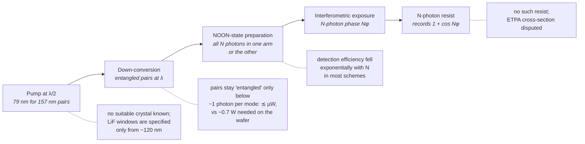

# Quantum and exotic lithography

!!! warning "Speculative territory"
    Everything on this page is at least one of these: not demonstrated as lithography,
    disputed in the literature, or many orders of magnitude short of production needs.
    The readiness labels are deliberate. highuvlith's models of these ideas carry the
    🧪 Theoretical badge unless a section says otherwise. Where a number is a simulator
    preset rather than a measurement, the text says so.

The other pages in this section are about engineering physics we already understand:
more numerical aperture, shorter wavelengths, brighter sources, better resists. This page
looks at proposals that would change the physics of exposure itself. The first is to use
**entangled photons** to write finer than the diffraction limit allows. The second is to
use quantum correlations to make **two-photon absorption** efficient at low flux. The
third is to make EUV and X-ray light from **free electrons skimming nanostructures**, or
from lasers that fit on a table.

All of this is real physics, and some of it has produced striking laboratory results:
interference fringes at half the classical period, tunable X-rays from layered crystals,
and coherent 13.5 nm light on an optical bench. What none of it has produced is a pattern
written into a resist by entangled light, or an exposure source within a factor of ten
thousand of what a production scanner uses. The reasons are a useful tour of the hard
limits of lithography: photon statistics, photon flux, and the materials that have to
record the light.

The simulator's models of these ideas are there to make the gaps quantitative, not to
suggest a path to production. They are the quantum research module, the entangled-photon
source, and the Smith–Purcell source (all theoretical), plus simplified models of the more
mature table-top sources (soft-X-ray lasers and high-harmonic generation).

## Readiness at a glance

| Technology | Readiness (as of Sep 2026) | highuvlith model |
|---|---|---|
| NOON-state (entangled-photon) interferometric lithography | **Theoretical / speculative.** λ/N fringes have been seen only in photon-coincidence counts, never recorded in a resist | 🧪 [quantum module](../research-modules.md) and [entangled-photon source](../sources/entangled-photon.md): classical N-photon absorption Iᴺ (sharpening at the classical period), plus the ideal NOON model: analytic two-beam fringes at λ/(2N sin θ) and a λ/N ideal-limit image for general masks |
| Classical multiphoton sub-Rayleigh recording (phase-shifted gratings) | **Demonstrated in the lab** (2× beyond the Rayleigh limit in PMMA, 2006) | Partly: the quantum module's `n_photon_absorption_image` applies the same Iᴺ nonlinearity. The multi-exposure phase-shift scheme is not modeled. Two-photon voxel kinetics: [interference module](../processes/interference-volumetric.md) ✅/🔶 |
| Entangled two-photon absorption (ETPA) as an exposure mechanism | **Theoretical / speculative.** The cross-section is disputed by four orders of magnitude or more | 🧪 [entangled-photon source](../sources/entangled-photon.md): exposure time for the claimed and the bounded cross-sections |
| Free-electron nanophotonic sources (Smith–Purcell, van der Waals X-rays) | **Demonstrated in the lab** as emitters (Smith–Purcell down to 230 nm; keV X-rays from layered crystals). Nothing at 13.5 nm with useful power | 🧪 [Smith–Purcell source](../sources/smith-purcell.md) |
| Table-top soft-X-ray lasers (46.9 nm down to 6.85 nm) | **Demonstrated in the lab**, including interference and Talbot printing | ✅/🔶 [soft-X-ray laser source](../sources/soft-xray-laser.md) |
| High-harmonic generation (HHG) at 13.5 nm | **Demonstrated in the lab** as an exposure source. Table-top systems are used for actinic metrology and coherent imaging | ✅/🔶 [HHG source](../sources/hhg.md) |

Badges follow the [capability matrix](../capability-matrix.md). They grade the
*simulator's model*, not the technology.

## Quantum lithography: the NOON-state proposal

### The idea

Classical interferometric lithography writes fringes by overlapping two coherent beams.
Two plane waves meeting at half-angle θ produce an intensity pattern

```math
I(x) \propto 1 + \cos\varphi(x), \qquad \varphi(x) = 2kx\sin\theta, \qquad
\Lambda = \frac{\lambda}{2\sin\theta} \;\ge\; \frac{\lambda}{2}.
```

In 2000, Boto and co-workers showed that this limit is not absolute. They considered
N photons shared between the two arms in a *NOON state*:

```math
\lvert\psi\rangle = \frac{\lvert N,0\rangle + \lvert 0,N\rangle}{\sqrt 2}.
```

All N photons are in arm *a* or all are in arm *b*. The N-photon amplitude then picks up
the phase Nφ where one photon picks up φ. The rate at which an **N-photon absorber**
records the pattern is

```math
P_N(x) \propto 1 + \cos\big(N\varphi(x)\big), \qquad \Lambda_N = \frac{\Lambda}{N}.
```

The fringe period shrinks by N without shortening the wavelength. Boto et al. put it in
lithographic terms: features of size λ/(2N) instead of λ/2, and N² more elements per chip
area. They also suggested that N = 2 "can be achieved easily" with photon pairs from
spontaneous parametric down-conversion (SPDC) [1]. For a 157.63 nm F₂ system this would
mean printing as if at ~79 nm, through the same optics.

### Sharper is not finer

Any N-photon absorber sharpens a classical fringe. Its response goes as Iᴺ, which makes
the bright lines narrower and the dark gaps wider. **But Iᴺ keeps the classical period.**
Raising 1 + cos φ to the N-th power adds harmonics up to Nφ, but the fundamental at φ
always remains, so the pattern still repeats every Λ. Only the NOON state removes the
lower harmonics and leaves 1 + cos Nφ. Agarwal, Chan, Boyd, Cable and Dowling made the
same point for bright light from a high-gain optical parametric amplifier recorded by an
N-photon absorber. Contrast and the sharpness of the fringe maxima grow with N, but "the
density of fringes and thus the limiting resolution does not increase with N" [10].

<figure markdown="span">
  { width="860" }
  { width="860" }
  <figcaption>Classical one-photon exposure I = (1 + cos φ)/2, classical two-photon exposure I², and the ideal N = 2 NOON pattern (1 + cos 2φ)/2. All three are closed-form expressions (nothing measured). I² is exactly what highuvlith's <code>quantum_aerial_image</code> returns for N = 2 and fidelity 1: sharper lines at the classical period. Own work, generated by <code>docs/figures/future/make_future_figures.py</code>.</figcaption>
</figure>

??? info "Data behind the figure"
    Values at five positions across half a classical period (x in units of Λ):

    | x / Λ | I = (1 + cos φ)/2 | I² | NOON, N = 2: (1 + cos 2φ)/2 |
    |---|---|---|---|
    | 0 | 1.000 | 1.000 | 1.000 |
    | 0.125 | 0.854 | 0.729 | 0.500 |
    | 0.25 | 0.500 | 0.250 | 0.000 |
    | 0.375 | 0.146 | 0.021 | 0.500 |
    | 0.5 | 0.000 | 0.000 | 1.000 |

!!! info "What highuvlith actually computes"
    The [quantum module](../research-modules.md) (`quantum.rs`, 🧪) keeps the two curves
    apart.

    - **Classical N-photon absorption**, $E = I^N$ of a *classical* aerial image
      (`n_photon_absorption_image`). This is the orange curve above: sharper, at the
      classical period. The older `quantum_aerial_image` call returns exactly this for
      any fidelity F.
    - **The ideal NOON pattern.** `TwoBeamNPhoton` gives the green curve in closed form,
      period Λ/N. For general masks, `noon_ideal_image` images the same system at λ/N
      with the same NA and pupil fill. This is Boto et al.'s ideal limit, and it presumes
      that the entangled states can be prepared for the pattern.

    The fidelity F is the share of the exposure from the ideal NOON component. The rest is
    classical N-photon absorption of the same light, not linear absorption:

    ```math
    E = F\,I_{\lambda/N} + (1 - F)\,I_\lambda^{\,N} \quad \text{(general masks)}
    ```

    The flux budget comes from the entangled-photon source's constants. These are the
    entangled-regime ceiling of about 10¹³ photons/s and the ETPA cross-section bounds.
    For N = 2, exposure takes at least 4.5 × 10¹⁰ times longer than a classical
    30 mJ/cm² exposure at production wafer power. The
    [entangled-photon source](../sources/entangled-photon.md) feeds the imaging pipeline
    its *physical* wavelength, and nothing quantum happens unless you call the quantum
    module explicitly. Read the λ/N images as the theoretical NOON claim, not a
    prediction of what any resist would record.

<figure markdown="span">


<figcaption>Sharpening without a finer period (the quantum page's example): the classical aerial image (F<sub>2</sub> 157.63 nm, NA 0.75, σ 0.7) and the N = 2 post-step I² at fidelity 1. Contrast rises, but the dominant Fourier component of both images is the 240 nm mask period — the I² model is a sharpening proxy, not λ/N resolution. Model: quantum lithography 🧪 (classical N-photon absorption; the ideal N00N limit is a separate model).</figcaption>
</figure>

### What has actually been demonstrated

The quantum-optics experiments are real, careful and elegant. Every one of them detected
the fringes with photon counters:

- **2001, two-photon diffraction.** D'Angelo, Chekhova and Shih sent entangled SPDC pairs
  through a double slit. The two-photon diffraction pattern beat the classical diffraction
  limit by a factor of two, recorded by joint (coincidence) detection [2].
- **2007, four-photon phase super-resolution.** Nagata et al. used four-photon entangled
  states to beat the standard quantum limit in interferometric phase measurement. This is
  metrology, not patterning [3].
- **2007, sub-diffraction fringes.** Kawabe et al. produced a two-photon NOON fringe at
  λ = 702.2 nm. Measured with a near-field optical probe and two-photon detection, its
  period was 328.2 nm, below the 351 nm (λ/2) diffraction limit [4].
- **2010, N = 5.** Afek, Ambar and Silberberg made "high-NOON" states with up to five
  photons by mixing quantum and classical light [5].
- **2014, scalable detection.** Rozema et al. recorded spatial super-resolution fringes with
  N = 2, 3 and 4 NOON states. They used an "optical centroid measurement" that avoids the
  loss of detection efficiency that grows exponentially with N in earlier methods. They
  also showed that classical super-resolution fringes lose visibility exponentially with
  N, while the NOON fringes keep theirs [6].

The only sub-Rayleigh fringes *written into a material* used **classical** light.
Bentley and Boyd proposed recording several phase-shifted exposures in an N-photon
absorber [7], and Hemmer et al. proposed another classical-light route [8]. In 2006,
Chang, Shin, O'Sullivan-Hale and Boyd implemented the phase-shifted-grating method in
PMMA, which absorbs multiphotonically when exposed with visible light. They achieved a
two-fold resolution gain over the λ/2 Rayleigh limit [9]. We found no report of a
sub-Rayleigh pattern written into a material by entangled photons, and the field's own
status reviews make instructive reading [11, 12].

## The flux problem

### What a scanner puts on the wafer

A production EUV scanner is a photon firehose. ASML specifies the NXE:3400C at
≥ 170 wafers per hour at 20 mJ/cm² [13]. Treating the whole 300 mm wafer
(π × 15² ≈ 707 cm²) as exposed gives an upper-end estimate (derived, not a vendor figure):

```math
P_{\text{wafer}} \approx \frac{170 \times 707\ \text{cm}^2 \times 20\ \text{mJ/cm}^2}{3600\ \text{s}}
\approx 0.67\ \text{W}.
```

At 13.5 nm, where a photon carries 91.84 eV, that is about 4.5 × 10¹⁶ photons per second.
At 157.63 nm (7.87 eV) the same power is 5.3 × 10¹⁷ photons per second. The photon
arithmetic behind these numbers is worked through in
[lithography arithmetic](../nodes/litho-math.md).

### How much entangled light can exist

The quantum advantage belongs to **isolated** photon pairs. Once pairs overlap in time
within the same optical mode, down-converted light behaves like a bright, classical-like
squeezed field. N-photon absorption then scales with the square of the flux, as it does for
ordinary light. Agarwal et al. found the two-photon excitation rate is linear in intensity
"only for output beams so weak that they contain fewer than one photon per mode" [10].
Engineering broadband sources pushes this ceiling up, because a wider bandwidth means more
modes per second. Dayan et al. generated an "ultrahigh flux" of broadband entangled pairs
that drove visible sum-frequency generation while keeping the linear intensity dependence
[15]. Szoke et al. designed octave-spanning sources that reach near-µW flux while
respecting the single-photon-per-mode limit [16]. A 2026 paper sums up the state of the
art: ETPA enhancement "has thus far been realized only at low photon rates, typically
ranging from 10⁷ (on the pW level) to 10¹³ (on the µW level) photons/s" [23].

Against the ~10¹³ photons/s ceiling, the scanner's photon rate is about 4,500 times
higher at 13.5 nm and about 50,000 times higher at 157 nm. In optical power the gap is
five to six orders of magnitude, because those µW beams are made of visible or
near-infrared photons. And all of this assumes the entangled light exists at a
lithographic wavelength. SPDC splits a pump photon of wavelength λ/2
into two photons at λ, so 157 nm pairs need a 79 nm pump and a nonlinear crystal that is
transparent there. Lithium fluoride, the standard vacuum-ultraviolet window material, is
specified to transmit only from about 120 nm [14].



!!! warning "Myth: quantum lithography beats the diffraction limit for free"
    It swaps a diffraction limit for a flux limit. The resolution gain N arrives only if
    every photon arrives in an N-photon bundle, and bundles are exactly what cannot be
    made bright. Each exposure event would also consume N photons, so a given photon dose
    yields N times fewer events to average over. Stochastic effects get *worse*, not better
    (see [the stochastic frontier](stochastic-frontier.md)).

## Entangled two-photon absorption: the cross-section controversy

Even with the flux ceiling, one version of the idea would matter: a resist that absorbed
**entangled pairs** efficiently at low flux would combine two-photon confinement with a
dose that scales linearly with exposure time. The absorption rate per molecule is usually
written as

```math
R = \sigma_E\,\phi \;+\; \delta\,\phi^2 ,
```

where φ is the photon-pair flux density (cm⁻² s⁻¹), δ the classical two-photon
cross-section (cm⁴ s; 1 GM = 10⁻⁵⁰ cm⁴ s), and σ_E the *entangled* two-photon absorption
(ETPA) cross-section (cm²). The linear term wins below a crossover flux σ_E/δ. The value of
σ_E decides everything, and it is disputed.

Early experiments reported large values. Lee and Goodson measured σ_E ≈ 10⁻¹⁷ cm² at
800 nm in a porphyrin dendrimer and contrasted it with a classical δ of about
10⁻⁴⁸ cm⁴ s [17]. Later work reported entangled two-photon fluorescence microscopy at
excitation levels six orders of magnitude below classical two-photon imaging [18], and
linear ETPA signals in Rhodamine 6G [19, 20]. Since 2020 several independent groups have
tried to reproduce such signals under controlled conditions:

| Year | Study | System / method | Reported result | Reading |
|---|---|---|---|---|
| 2006 | Lee & Goodson [17] | Porphyrin dendrimer, 800 nm | σ_E ≈ 10⁻¹⁷ cm² | Claim |
| 2020 | Varnavski & Goodson [18] | Entangled two-photon fluorescence microscopy | Images at excitation six orders of magnitude below classical two-photon imaging | Claim |
| 2021 | Tabakaev et al. [19] | Rhodamine 6G, fluorescence | Linear rate against pair flux; first concentration-dependent σ_E estimates | Claim |
| 2022 | Tabakaev et al. [20] | Rhodamine 6G, beam-waist (Z-scan) dependence | ETPA shares the beam-waist dependence of classical two-photon absorption | Claim |
| 2021 | Landes et al. [24] | Rhodamine 6G against sum-frequency generation, isolated pairs | Upper bound on the enhancement "well below previously reported values" | Bound |
| 2021 | Parzuchowski et al. [25] | Six fluorophores, fluorescence | Upper bounds up to four orders of magnitude below the smallest published σ_E; four and five orders below prior values for Rhodamine 6G and 9R-S | Bound |
| 2022 | Mikhaylov et al. [26] | Rhodamine 6G, LDS798 at 1060 nm | Hot-band (one-photon) absorption gives a linear signal that mimics ETPA and can overestimate the advantage by orders of magnitude | Artifact |
| 2022 | Corona-Aquino et al. [27] | Rhodamine B, ZnTPP, transmission | Reproduced earlier signals, but they persist at delays far beyond the pair correlation time: linear losses, not ETPA | Artifact |
| 2022 | Hickam et al. [28] | Rhodamine 6G, full state characterization | Any entangled interaction is no larger than classical single-photon scattering, which can explain the spread of reported values | Artifact |
| 2024 | He et al. [29] | Indocyanine green (resonance-enhanced) | No signal; upper bound 6 × 10⁻²³ cm² per molecule | Bound |
| 2024 | Triana-Arango et al. [30] | Rhodamine B, transmission with Hong–Ou–Mandel analysis | Linear optical losses corrupt or emulate transmission-based ETPA signals | Artifact |
| 2024 | Landes, Smith & Raymer [31] | Close replication of the 2022 experiment [20] | In the low-gain (isolated-pair) regime, fluorescence was below the detection threshold | Null |
| 2025 | Parzuchowski et al. [32] | Liquid-core fibre waveguide | No evidence of ETPA; bound consistent with the recent reports | Null |
| 2026 | Kasamatsu, Hisamatsu & Toida [23] | Fluorescence at µW and mW pump power, high-gain down-conversion | Increased absorption rate with a linear rate–power relation in both ranges | Claim |
| 2026 | Pollmann et al. [33] | Method paper | A single sensitivity figure (in GM) that says whether a given setup could detect ETPA at all | Method |
| 2026 | Hedse et al. [34] (preprint) | Rhodamine 6G, Franson interferometry | Model-derived effective σ_E ≈ 2.1 × 10⁻²¹ cm², but systematics prevent a definitive assignment; presented as a bound | Open |

On the theory side, Raymer and co-workers argue that the enhancement is "tightly bounded by
the physics of photonic entanglement and nonlinear response" [21], and their tutorial
lays out the regimes [22]. Parzuchowski et al. summarize the consequence: with the smaller
cross-sections, "the linear scaling dominates at photon fluxes so low that it is extremely
difficult or impossible to measure" with conventional free-space techniques [32]. As of
September 2026 the dispute is not closed, because positive reports continue [23]. But for
the same dyes the independent bounds sit four to five orders of magnitude below the early
claims [25]. The controlled replications and bound-setting studies in the table either
found no ETPA signal at isolated-pair fluxes or traced the signal to linear losses,
scattering or hot-band absorption.

For lithography the arithmetic is decisive either way. The entangled-photon source in
highuvlith turns its pair rate into the time needed to clear a resist,
t = p_clear / (σ_E φ), with an *assumed* 10 % of molecules that must react. It reports the
result for the disputed range of σ_E (defaults: N = 2, 10⁶ pairs per second, 1 cm²):

| σ_E scenario (simulator constant) | Clearing fluence | Time to clear 1 cm² at 10⁶ pairs/s |
|---|---|---|
| Largest early claim, 10⁻¹⁷ cm² | 10¹⁶ pairs/cm² | 10¹⁰ s, about 320 years |
| Smallest early claim, 10⁻²¹ cm² | 10²⁰ pairs/cm² | 10¹⁴ s, about 3 million years |
| Loosest independent bound, 10⁻²³ cm² (default) | ≥ 10²² pairs/cm² | ≥ 10¹⁶ s, about 300 million years |
| Tightest independent bound, 10⁻²⁵ cm² | ≥ 10²⁴ pairs/cm² | ≥ 10¹⁸ s, longer than the age of the Universe (≈ 4.4 × 10¹⁷ s [35]) |

The times scale inversely with pair rate. Even at the entangled-regime ceiling of about
5 × 10¹² pairs per second, the default bound scenario needs roughly 2 × 10⁹ s (about
60 years) per square centimetre (derived). A 300 mm wafer is about 700 cm².

## Exotic compact sources

These sources are real, coherent or tunable, and genuinely useful in the laboratory. None
of them is anywhere near exposure-class power.

### Free electrons and nanostructures: Smith–Purcell and van der Waals X-rays

An electron passing a periodic structure radiates at every period. The contributions add in
phase only at the **Smith–Purcell** wavelength [36]:

```math
\lambda = \frac{a}{m}\left(\frac{1}{\beta} - \cos\theta\right),
```

where a is the period, m the diffraction order, β = v/c and θ the observation angle. A
single device is tunable by angle, beam energy or period, with no resonator and no
population inversion. The catch is how far the electron's field reaches. The evanescent
interaction height is about h ≈ βγλ/4π, which is only 0.37 nm at 13.5 nm for a 30 keV
beam. A 13.5 nm Smith–Purcell source at 90° needs a period of a = βλ ≈ 4.4 nm, and the
electrons must pass within a fraction of a nanometre of it. The shortest Smith–Purcell
emission we found reported is 230 nm, from electrons threaded through 30 nm slots in an
aluminium grating (Ye et al., 2019) [37].

A different route uses the atomic planes of crystals as the "grating". Free electrons
crossing **van der Waals** crystals generate X-rays whose photon energy can be tuned [38].
Later work reached the biologically important "water window" between the carbon and
oxygen absorption edges (roughly 2.3–4.4 nm), with a predictive model and a projected
path to "over 10⁸ photons per second on sample" [39]. At ~400 eV that is about 6 nW. A
broad review covers the whole field of free-electron nanophotonics [40]. highuvlith's
[Smith–Purcell source](../sources/smith-purcell.md) (🧪) computes the kinematics exactly
and labels its power an order-of-magnitude estimate. The default 13.5 nm preset (30 keV,
10 nA, assumed coupling ε = 10⁻³) gives about 0.7 nW, some 10¹¹ times below 250 W.

### Table-top soft-X-ray lasers

Plasma-based soft-X-ray lasers amplify a fixed atomic transition. Their wavelength is set
by the ion, not by a machine parameter. Rocca and co-workers demonstrated the first
discharge-pumped table-top soft-X-ray laser in 1994: Ne-like argon at 46.9 nm [41]. By 1999
their capillary amplifier delivered 0.88 mJ pulses at 4 Hz [42], about 3.5 mW average
(derived). A 2005 desk-top version produced ~13 µJ pulses at up to 12 Hz [43], about
0.16 mW. At shorter wavelengths, a diode-pumped system ran a Ni-like molybdenum laser at
18.9 nm and 100 Hz for an hour at "about 0.1 mW" average. The authors used it to
lithographically print nanoscale arrays by coherent Talbot self-imaging [44]. Gain-saturated
table-top lasers now reach 6.85 nm [45]. Their narrow lines and partial coherence make them
natural tools for interference and Talbot lithography (see
[alternatives to projection lithography](alternative-patterning.md)). highuvlith's
[soft-X-ray laser source](../sources/soft-xray-laser.md) (✅/🔶) uses the exact atomic
lines, with order-of-magnitude output presets: 10 µJ × 10 Hz at 46.9 nm, 2 µJ × 10 Hz at
13.9 nm.

### High-harmonic generation at 13.5 nm

HHG converts a femtosecond driver laser into a comb of odd harmonics. It is the only
table-top route to laser-like light at exactly 13.5 nm. The measured power there is
tiny. A KMLabs/JILA system reported about 2.9 × 10¹⁰ photons per second at 92 eV
(≈ 0.43 µW) [46], and a University of Hyogo/RIKEN source about 1 µW at the 59th harmonic
[47]. The milliwatt-class HHG results we found are all at longer wavelengths:
(832 ± 204) µW at 21.7 eV (57 nm) [48] and (12.9 ± 3.9) mW in a single line at 26.5 eV
(47 nm) [49]. At 13.5 nm, HHG's
lithographic role is actinic metrology and coherent imaging, such as subwavelength
coherent diffractive imaging of periodic samples [50]. highuvlith's
[HHG source](../sources/hhg.md) (✅/🔶) computes the cutoff law and comb exactly. Its
neon 13.5 nm preset stores about 1 µW, the upper end of what has been measured.

| Source (best reported) | λ (nm) | Average power | Below 250 W by | Reference |
|---|---|---|---|---|
| Capillary-discharge Ar laser (1999) | 46.9 | ≈ 3.5 mW | ~7 × 10⁴ | [42] |
| HHG, single harmonic (2021) | 46.8 | 12.9 mW | ~2 × 10⁴ | [49] |
| Ni-like Mo laser (2013) | 18.9 | ≈ 0.1 mW | ~2.5 × 10⁶ | [44] |
| HHG at 13.5 nm (2012, 2017) | 13.5 | 0.4–1 µW | ~2.5–6 × 10⁸ | [46, 47] |
| Entangled pairs, isolated-pair regime | visible / near-IR | ≲ µW | not an EUV source | [23] |

The comparison is deliberately crude: 250 W is the in-band power at the intermediate focus
of a 13.5 nm scanner, and most rows are at other wavelengths. It shows the scale. The
[accelerator light sources](accelerator-light-sources.md) page plots these and many more
sources against the production requirement.

## Try it in highuvlith

!!! example "Try it in highuvlith: sharpening without a finer period"
    Image 120 nm lines on a 240 nm pitch at 157.63 nm (NA 0.75), then apply classical
    N = 2 photon absorption, I². Contrast rises, but the strongest spatial frequency, and so the
    period, is unchanged. The field is 128 × 3.75 nm = 480 nm, exactly two pitches. (With
    the current engine this prints contrast 0.884 → 0.992 and a 240 nm period for both
    images; exact contrasts can shift slightly between engine versions.)

    <!-- verify-example -->
    ```python
    import numpy as np
    import highuvlith as huv

    PIXEL = 3.75  # nm; 128 px x 3.75 nm = 480 nm = two 240 nm periods
    r = huv.simulate_quantum_line_space(120.0, 240.0, n=2, fidelity=1.0,
                                        grid_size=128, pixel_nm=PIXEL)

    def period_nm(img):
        row = img[img.shape[0] // 2] - img[img.shape[0] // 2].mean()
        k = int(np.argmax(np.abs(np.fft.rfft(row))[1:])) + 1  # strongest non-DC order
        return row.size * PIXEL / k

    print(f"contrast: classical {r.classical_contrast:.3f}, I^2 model {r.quantum_contrast:.3f}")
    print(f"period:   classical {period_nm(r.classical):.0f} nm, I^2 model {period_nm(r.quantum):.0f} nm")
    ```

    ??? success "Output"

        ```text
        contrast: classical 0.881, I^2 model 0.992
        period:   classical 240 nm, I^2 model 240 nm
        ```

!!! example "Try it in highuvlith: the entangled-photon budget"
    The entangled-photon source reports its effective wavelength, beam power and the ETPA
    exposure times for the disputed cross-section range, plus the comparison with a
    production scanner.

    <!-- verify-example -->
    ```python
    import highuvlith as huv

    # N = 2 NOON source at the F2 wavelength; the default pair rate is 1e6 pairs/s
    src = huv.SourceConfig.entangled_noon(wavelength_nm=157.63, n=2, fidelity=1.0)
    for name, value, unit, _note in src.derived_quantities():
        print(f"{name:34s} {value:11.3g} {unit}")
    print("one year = 3.16e7 s")
    ```

    ??? success "Output"

        ```text
        effective_wavelength                      78.8 nm
        photon_power                          2.52e-12 W
        clearing_fluence_bound                   1e+22 pairs/cm^2
        exposure_time_bound                      1e+16 s
        exposure_time_bound_tight                1e+18 s
        clearing_fluence_claims_optimistic       1e+16 pairs/cm^2
        exposure_time_claims_optimistic          1e+10 s
        exposure_time_claims_pessimistic         1e+14 s
        pair_rate_for_1s_bound                   1e+22 pairs/s
        entangled_flux_ceiling                   1e+13 photons/s
        hvm_wafer_photon_rate                 5.32e+17 photons/s
        hvm_rate_over_flux_ceiling            5.32e+04 -
        classical_photons_30mj                2.38e+16 photons/cm^2
        classical_rate_gap                    2.38e+10 -
        one year = 3.16e7 s
        ```

!!! example "Try it in highuvlith: exotic sources against 250 W"
    Average power of three compact sources, from the simulator's presets (the Smith–Purcell
    number is an order-of-magnitude estimate with an assumed coupling), compared with
    250 W in band at intermediate focus.

    <!-- verify-example -->
    ```python
    import highuvlith as huv

    sources = {
        "Smith-Purcell, 30 keV / 10 nA": huv.SourceConfig.smith_purcell(),
        "Ni-like Ag soft-X-ray laser": huv.SourceConfig.sxrl_ag_13nm9(),
        "Ne-like Ar capillary laser": huv.SourceConfig.sxrl_ar_46nm9(),
        "HHG in neon, harmonic 59": huv.SourceConfig.hhg_ne_13nm5(),
    }
    for name, src in sources.items():
        p = src.average_power_w
        print(f"{name:32s} {src.wavelength_nm:6.2f} nm {p:9.2e} W  x{250.0 / p:8.1e} short")
    ```

    ??? success "Output"

        ```text
        Smith-Purcell, 30 keV / 10 nA     13.50 nm  6.70e-10 W  x 3.7e+11 short
        Ni-like Ag soft-X-ray laser       13.90 nm  1.00e-04 W  x 2.5e+06 short
        Ne-like Ar capillary laser        46.90 nm  1.56e-04 W  x 1.6e+06 short
        HHG in neon, harmonic 59          13.56 nm  9.00e-07 W  x 2.8e+08 short
        ```

## Key takeaways

- **NOON-state lithography is real physics without a lithography demonstration.** Fringes
  at λ/(2N) have been observed only by counting photon coincidences. The only
  sub-Rayleigh patterns written into a material used classical light and an N-photon
  absorber, which sharpens lines but does not shrink the period.
- **highuvlith keeps sharpening and the NOON claim apart.** It separates Iᴺ sharpening
  (classical period) from an ideal NOON model (λ/(2N sin θ) fringes, λ/N ideal-limit
  images), mixes decoherence as classical N-photon absorption, and derives the flux
  penalty from the ETPA bounds. It is 🧪 Theoretical by design.
- **Flux, not optics, is the wall.** Entangled pairs keep their advantage only below about
  one photon per mode, which means µW-class beams at best. A production EUV scanner puts
  roughly 0.7 W, about 5 × 10¹⁶ photons per second, on the wafer.
- **The ETPA cross-section is disputed.** Early claims reached ~10⁻¹⁷ cm². Independent
  bounds are four to five orders of magnitude lower, several signals were traced to
  artifacts, and positive reports continue. At the bounds, clearing a square centimetre
  would take geological time.
- **Exotic compact sources are laboratory tools.** Smith–Purcell and van der Waals
  emitters, soft-X-ray lasers and HHG are tunable, coherent or both, and sit 10⁴ to 10¹¹
  below production power. They are valuable for metrology and for interference or Talbot
  printing, not for high-volume exposure.

## References and further reading

**Quantum (NOON-state) lithography**

1. A. N. Boto, P. Kok, D. S. Abrams, S. L. Braunstein, C. P. Williams, J. P. Dowling, "Quantum interferometric optical lithography: exploiting entanglement to beat the diffraction limit," *Phys. Rev. Lett.* **85**, 2733 (2000), [doi:10.1103/PhysRevLett.85.2733](https://doi.org/10.1103/PhysRevLett.85.2733).
2. M. D'Angelo, M. V. Chekhova, Y. Shih, "Two-photon diffraction and quantum lithography," *Phys. Rev. Lett.* **87**, 013602 (2001), [doi:10.1103/PhysRevLett.87.013602](https://doi.org/10.1103/PhysRevLett.87.013602).
3. T. Nagata, R. Okamoto, J. L. O'Brien, K. Sasaki, S. Takeuchi, "Beating the standard quantum limit with four-entangled photons," *Science* **316**, 726 (2007), [doi:10.1126/science.1138007](https://doi.org/10.1126/science.1138007).
4. Y. Kawabe, H. Fujiwara, R. Okamoto, K. Sasaki, S. Takeuchi, "Quantum interference fringes beating the diffraction limit," *Opt. Express* **15**, 14244 (2007), [doi:10.1364/OE.15.014244](https://doi.org/10.1364/OE.15.014244).
5. I. Afek, O. Ambar, Y. Silberberg, "High-NOON states by mixing quantum and classical light," *Science* **328**, 879 (2010), [doi:10.1126/science.1188172](https://doi.org/10.1126/science.1188172).
6. L. A. Rozema, J. D. Bateman, D. H. Mahler, R. Okamoto, A. Feizpour, A. Hayat, A. M. Steinberg, "Scalable spatial super-resolution using entangled photons," *Phys. Rev. Lett.* **112**, 223602 (2014), [doi:10.1103/PhysRevLett.112.223602](https://doi.org/10.1103/PhysRevLett.112.223602).
7. S. J. Bentley, R. W. Boyd, "Nonlinear optical lithography with ultra-high sub-Rayleigh resolution," *Opt. Express* **12**, 5735 (2004), [doi:10.1364/OPEX.12.005735](https://doi.org/10.1364/OPEX.12.005735).
8. P. R. Hemmer, A. Muthukrishnan, M. O. Scully, M. S. Zubairy, "Quantum lithography with classical light," *Phys. Rev. Lett.* **96**, 163603 (2006), [doi:10.1103/PhysRevLett.96.163603](https://doi.org/10.1103/PhysRevLett.96.163603).
9. H. J. Chang, H. Shin, M. N. O'Sullivan-Hale, R. W. Boyd, "Implementation of sub-Rayleigh-resolution lithography using an N-photon absorber," *J. Mod. Opt.* **53**, 2271 (2006), [doi:10.1080/09500340600895656](https://doi.org/10.1080/09500340600895656).
10. G. S. Agarwal, K. W. Chan, R. W. Boyd, H. Cable, J. P. Dowling, "Quantum states of light produced by a high-gain optical parametric amplifier for use in quantum lithography," *J. Opt. Soc. Am. B* **24**, 270 (2007), [doi:10.1364/JOSAB.24.000270](https://doi.org/10.1364/JOSAB.24.000270).
11. R. W. Boyd, J. P. Dowling, "Quantum lithography: status of the field," *Quantum Inf. Process.* **11**, 891 (2012), [doi:10.1007/s11128-011-0253-y](https://doi.org/10.1007/s11128-011-0253-y).
12. J. P. Dowling, "Quantum optical metrology — the lowdown on high-N00N states," *Contemp. Phys.* **49**, 125 (2008), [doi:10.1080/00107510802091298](https://doi.org/10.1080/00107510802091298).

**Flux, materials and the production reference**

13. ASML, "TWINSCAN NXE:3400C" product page (throughput ≥ 170 wph at 20 mJ/cm², NA 0.33), [asml.com](https://www.asml.com/en/products/euv-lithography-systems/twinscan-nxe3400c), retrieved 2026-09-30.
14. Crystran, "Lithium Fluoride (LiF)" optical material data (transmission range 0.12–6 µm), [crystran.com](https://www.crystran.com/optical-materials/lithium-fluoride-lif), retrieved 2026-09-30.
15. B. Dayan, A. Pe'er, A. A. Friesem, Y. Silberberg, "Nonlinear interactions with an ultrahigh flux of broadband entangled photons," *Phys. Rev. Lett.* **94**, 043602 (2005), [doi:10.1103/PhysRevLett.94.043602](https://doi.org/10.1103/PhysRevLett.94.043602). See also the same authors' "Two photon absorption and coherent control with broadband down-converted light," *Phys. Rev. Lett.* **93**, 023005 (2004), [doi:10.1103/PhysRevLett.93.023005](https://doi.org/10.1103/PhysRevLett.93.023005).
16. S. Szoke, M. He, B. P. Hickam, S. K. Cushing, "Designing high-power, octave spanning entangled photon sources for quantum spectroscopy," *J. Chem. Phys.* **154**, 244201 (2021), [doi:10.1063/5.0053688](https://doi.org/10.1063/5.0053688).

**Entangled two-photon absorption**

17. D.-I. Lee, T. Goodson III, "Entangled photon absorption in an organic porphyrin dendrimer," *J. Phys. Chem. B* **110**, 25582 (2006), [doi:10.1021/jp066767g](https://doi.org/10.1021/jp066767g).
18. O. Varnavski, T. Goodson III, "Two-photon fluorescence microscopy at extremely low excitation intensity: the power of quantum correlations," *J. Am. Chem. Soc.* **142**, 12966 (2020), [doi:10.1021/jacs.0c01153](https://doi.org/10.1021/jacs.0c01153).
19. D. Tabakaev et al., "Energy-time-entangled two-photon molecular absorption," *Phys. Rev. A* **103**, 033701 (2021), [doi:10.1103/PhysRevA.103.033701](https://doi.org/10.1103/PhysRevA.103.033701).
20. D. Tabakaev et al., "Spatial properties of entangled two-photon absorption," *Phys. Rev. Lett.* **129**, 183601 (2022), [doi:10.1103/PhysRevLett.129.183601](https://doi.org/10.1103/PhysRevLett.129.183601).
21. M. G. Raymer, T. Landes, M. Allgaier, S. Merkouche, B. J. Smith, A. H. Marcus, "How large is the quantum enhancement of two-photon absorption by time-frequency entanglement of photon pairs?" *Optica* **8**, 757 (2021), [doi:10.1364/OPTICA.426674](https://doi.org/10.1364/OPTICA.426674).
22. M. G. Raymer, T. Landes, A. H. Marcus, "Entangled two-photon absorption by atoms and molecules: a quantum optics tutorial," *J. Chem. Phys.* **155**, 081501 (2021), [doi:10.1063/5.0049338](https://doi.org/10.1063/5.0049338).
23. T. Kasamatsu, K. Hisamatsu, M. Toida, "Experimental observation of enhanced quantum-entangled two-photon absorption fluorescence at milliwatt pump power levels," *Appl. Phys. Lett.* **128**, 104001 (2026), [doi:10.1063/5.0316664](https://doi.org/10.1063/5.0316664).
24. T. Landes, M. Allgaier, S. Merkouche, B. J. Smith, A. H. Marcus, M. G. Raymer, "Experimental feasibility of molecular two-photon absorption with isolated time-frequency-entangled photon pairs," *Phys. Rev. Research* **3**, 033154 (2021), [doi:10.1103/PhysRevResearch.3.033154](https://doi.org/10.1103/PhysRevResearch.3.033154).
25. K. M. Parzuchowski et al., "Setting bounds on entangled two-photon absorption cross sections in common fluorophores," *Phys. Rev. Applied* **15**, 044012 (2021), [doi:10.1103/PhysRevApplied.15.044012](https://doi.org/10.1103/PhysRevApplied.15.044012).
26. A. Mikhaylov et al., "Hot-band absorption can mimic entangled two-photon absorption," *J. Phys. Chem. Lett.* **13**, 1489 (2022), [doi:10.1021/acs.jpclett.1c03751](https://doi.org/10.1021/acs.jpclett.1c03751).
27. S. Corona-Aquino et al., "Experimental study of the validity of entangled two-photon absorption measurements in organic compounds," *J. Phys. Chem. A* **126**, 2185 (2022), [doi:10.1021/acs.jpca.2c00720](https://doi.org/10.1021/acs.jpca.2c00720).
28. B. P. Hickam, M. He, N. Harper, S. Szoke, S. K. Cushing, "Single-photon scattering can account for the discrepancies among entangled two-photon measurement techniques," *J. Phys. Chem. Lett.* **13**, 4934 (2022), [doi:10.1021/acs.jpclett.2c00865](https://doi.org/10.1021/acs.jpclett.2c00865).
29. M. He, B. P. Hickam, N. Harper, S. K. Cushing, "Experimental upper bounds for resonance-enhanced entangled two-photon absorption cross section of indocyanine green," *J. Chem. Phys.* **160**, 094305 (2024), [doi:10.1063/5.0193311](https://doi.org/10.1063/5.0193311).
30. F. Triana-Arango, R. Ramírez-Alarcón, G. Ramos-Ortiz, "Entangled two-photon absorption in transmission-based experiments: deleterious effects from linear optical losses," *J. Phys. Chem. A* **128**, 2210 (2024), [doi:10.1021/acs.jpca.3c06863](https://doi.org/10.1021/acs.jpca.3c06863).
31. T. Landes, B. J. Smith, M. G. Raymer, "Limitations in fluorescence-detected entangled two-photon-absorption experiments: exploring the low- to high-gain squeezing regimes," *Phys. Rev. A* **110**, 033708 (2024), [doi:10.1103/PhysRevA.110.033708](https://doi.org/10.1103/PhysRevA.110.033708).
32. K. M. Parzuchowski, M. D. Mazurek, C. H. Camp Jr., M. J. Stevens, R. Jimenez, "A liquid-core fiber platform for classical and entangled two-photon absorption measurements," *ACS Photonics* **12**, 1470 (2025), [doi:10.1021/acsphotonics.4c02076](https://doi.org/10.1021/acsphotonics.4c02076).
33. R. Pollmann, F. Roeder, C. Silberhorn, B. Brecht, "Limitations of entangled two-photon absorption detection," *Phys. Rev. A* **114**, 013718 (2026), [doi:10.1103/qpb1-hk5l](https://doi.org/10.1103/qpb1-hk5l).
34. A. Hedse et al., "Franson-interferometric bounds on entangled two-photon absorption," arXiv:2608.27157 (2026, preprint, not peer reviewed), [arxiv.org/abs/2608.27157](https://arxiv.org/abs/2608.27157).
35. Planck Collaboration, "Planck 2018 results. VI. Cosmological parameters," *Astron. Astrophys.* **641**, A6 (2020), [doi:10.1051/0004-6361/201833910](https://doi.org/10.1051/0004-6361/201833910) (age of the Universe ≈ 13.8 Gyr).

**Exotic compact sources**

36. S. J. Smith, E. M. Purcell, "Visible light from localized surface charges moving across a grating," *Phys. Rev.* **92**, 1069 (1953), [doi:10.1103/PhysRev.92.1069](https://doi.org/10.1103/PhysRev.92.1069).
37. Y. Ye et al., "Deep-ultraviolet Smith–Purcell radiation," *Optica* **6**, 592 (2019), [doi:10.1364/OPTICA.6.000592](https://doi.org/10.1364/OPTICA.6.000592).
38. M. Shentcis et al., "Tunable free-electron X-ray radiation from van der Waals materials," *Nat. Photon.* **14**, 686 (2020), [doi:10.1038/s41566-020-0689-7](https://doi.org/10.1038/s41566-020-0689-7).
39. N. Pramanik et al., "Fundamental scaling laws of water-window X-rays from free-electron-driven van der Waals structures," *Nat. Photon.* **18**, 1203 (2024), [doi:10.1038/s41566-024-01547-3](https://doi.org/10.1038/s41566-024-01547-3).
40. C. Roques-Carmes et al., "Free-electron–light interactions in nanophotonics," *Appl. Phys. Rev.* **10**, 011303 (2023), [doi:10.1063/5.0118096](https://doi.org/10.1063/5.0118096).
41. J. J. Rocca, V. Shlyaptsev, F. G. Tomasel, O. D. Cortázar, D. Hartshorn, J. L. A. Chilla, "Demonstration of a discharge pumped table-top soft-x-ray laser," *Phys. Rev. Lett.* **73**, 2192 (1994), [doi:10.1103/PhysRevLett.73.2192](https://doi.org/10.1103/PhysRevLett.73.2192).
42. C. D. Macchietto, B. R. Benware, J. J. Rocca, "Generation of millijoule-level soft-x-ray laser pulses at a 4-Hz repetition rate in a highly saturated tabletop capillary discharge amplifier," *Opt. Lett.* **24**, 1115 (1999), [doi:10.1364/OL.24.001115](https://doi.org/10.1364/OL.24.001115).
43. S. Heinbuch, M. Grisham, D. Martz, J. J. Rocca, "Demonstration of a desk-top size high repetition rate soft x-ray laser," *Opt. Express* **13**, 4050 (2005), [doi:10.1364/OPEX.13.004050](https://doi.org/10.1364/OPEX.13.004050).
44. B. A. Reagan et al., "Hour-long continuous operation of a tabletop soft x-ray laser at 50–100 Hz repetition rate," *Opt. Express* **21**, 28380 (2013), [doi:10.1364/OE.21.028380](https://doi.org/10.1364/OE.21.028380).
45. A. Rockwood, Y. Wang, S. Wang, M. Berrill, V. N. Shlyaptsev, J. J. Rocca, "Compact gain-saturated x-ray lasers down to 6.85 nm and amplification down to 5.85 nm," *Optica* **5**, 257 (2018), [doi:10.1364/OPTICA.5.000257](https://doi.org/10.1364/OPTICA.5.000257).
46. KMLabs / JILA (H. Kapteyn, M. Murnane et al.), presentation at the 2017 International Workshop on EUV Lithography (2.9 × 10¹⁰ photons/s at 92 eV), [euvlitho.com/2017/P4.pdf](https://euvlitho.com/2017/P4.pdf).
47. H. Kinoshita, T. Harada, Y. Nagata, M. Toyoda and T. Watanabe (University of Hyogo / RIKEN / Tohoku University), "Development of Actinic Mask Inspection," presentation at the 2012 International Workshop on EUV Lithography, 7 June 2012 ("Output EUV (59th) 1 uW"), [euvlitho.com/2012/P33.pdf](https://euvlitho.com/2012/P33.pdf).
48. R. Klas et al., "Table-top milliwatt-class extreme ultraviolet high harmonic light source," *Optica* **3**, 1167 (2016), [doi:10.1364/OPTICA.3.001167](https://doi.org/10.1364/OPTICA.3.001167).
49. R. Klas et al., "Ultra-short-pulse high-average-power megahertz-repetition-rate coherent extreme-ultraviolet light source," *PhotoniX* **2**, 4 (2021), [doi:10.1186/s43074-021-00028-y](https://doi.org/10.1186/s43074-021-00028-y).
50. D. F. Gardner et al., "Subwavelength coherent imaging of periodic samples using a 13.5 nm tabletop high-harmonic light source," *Nat. Photon.* **11**, 259 (2017), [doi:10.1038/nphoton.2017.33](https://doi.org/10.1038/nphoton.2017.33).

**In this documentation**

- Simulator models: [entangled-photon source](../sources/entangled-photon.md), [quantum module](../research-modules.md), [Smith–Purcell](../sources/smith-purcell.md), [soft-X-ray laser](../sources/soft-xray-laser.md), [HHG](../sources/hhg.md), [capability matrix](../capability-matrix.md).
- Related pages in this section: [the map of the future](index.md), [accelerator light sources](accelerator-light-sources.md) (source power landscape), [the stochastic frontier](stochastic-frontier.md) (photon statistics), [alternatives to projection lithography](alternative-patterning.md) (interference and Talbot printing).
