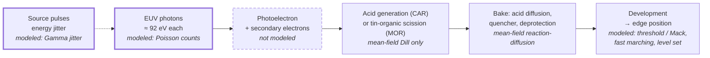

# The stochastic frontier

For most of lithography's history an aerial image could be treated as a smooth function:
intensity in, dose out, a threshold, an edge. That continuum picture fails when the number of
discrete events behind each edge becomes small. At the dimensions EUV prints today, a
16 nm-wide line edge is written by a few thousand photons, of which only a fraction are
absorbed, each one launching a short cascade of electrons and a handful of chemical reactions.
Counting statistics — the same shot noise Schottky described in vacuum tubes in 1918 — now set
line-edge roughness (LER), local CD variation, and, most expensively, rare *printing failures*:
a contact that never opens, a line that bridges to its neighbour.

The industry's levers against this are few and each has a price. More dose means fewer
wafers per hour; more absorbing resists change the chemistry; more source power moves the
problem into a light source that is already the most complex part of the scanner. This page
follows the chain from photon to edge, puts numbers on each link, and says precisely which
links the highuvlith simulator models and which it does not.

!!! info "Scope"
    The basic photon arithmetic for each node generation (incident photons per contact, the
    14× gap between ArF and EUV) is worked in [Lithography arithmetic](../nodes/litho-math.md),
    and today's stochastic defects and pellicles appear in
    [7 nm and 5 nm](../nodes/7-and-5nm.md). This page is the forward-looking view: what happens
    as half-pitch keeps shrinking, and what the proposed remedies cost.

## Readiness at a glance

| Technology or effect | Readiness (as of Sep 2026) | highuvlith model |
|---|---|---|
| Chemically amplified resists (CAR) at EUV doses of tens of mJ/cm² | In production | 🔶 Dill exposure plus a deterministic acid/quencher bake ([resist models](../processes/resist-models.md)); molecule-number noise not modeled |
| Photon shot noise and pulse-to-pulse source dose jitter | In production (every EUV exposure) | ✅ Poisson photon counts and Gamma-distributed dose jitter feeding an LER/LWR Monte Carlo ([research modules](../research-modules.md)) |
| Secondary-electron blur and electron "strings" | In production (physics of every EUV resist) | not modeled |
| Spin-on metal-oxide resists (tin-oxo clusters) | In production (IRDS 2024: MOR "have started to be used in production" [19]; which fabs and layers is not public) | 🔶 generic Dill parameters and a representative EUV resist n,k ([materials](../materials.md)); no MOR chemistry |
| Vapour-deposited "dry" metal-organic resist | In production (company-reported: DRAM tool of record, 2025) | not modeled |
| Higher source power to pay for dose (500–600 W in production, 1 kW shown) | In production (500–600 W); Demonstrated in the lab (1 kW) | 🔶 dose-limited throughput model, `SourceConfig.wafer_throughput` ([sources](../sources/index.md)) |
| Stochastic-failure predictors in OPC verification | Demonstrated in the lab | not modeled |
| Single-digit half-pitch (5 nm) by EUV interference lithography | Demonstrated in the lab | ✅/🔶 multi-beam interference ([interference](../processes/interference-volumetric.md)); photon statistics ✅ |
| Stochastic budgets at Hyper-NA or 6.x nm wavelength | Theoretical / speculative | ✅ photon arithmetic only |

Badges follow the [capability matrix](../capability-matrix.md): ✅ Implemented,
🔶 Simplified, 🧪 Theoretical, 🗺️ Planned. "Not modeled" means no code exists and none is
planned yet.

## 1. Counting photons

A dose $D$ is energy per area; the number of photons it contains depends on the photon
energy $E_\gamma = hc/\lambda$:

```math
n_\gamma = \frac{D}{E_\gamma} = \frac{D\,\lambda}{hc},
\qquad
E_\gamma(13.5\ \text{nm}) = 91.84\ \text{eV}
\;\Rightarrow\;
n_\gamma = 0.680\ \text{photons nm}^{-2}\ \text{per mJ cm}^{-2}.
```

At 193 nm the same dose carries 9.72 photons nm⁻² per mJ cm⁻², 14.3 times more. The count
that matters is the number landing in the area that defines one edge or one feature. Taking a
square of side equal to the half-pitch, $\mathrm{HP} = k_1 \lambda / \mathrm{NA}$:

```math
N = n_\gamma\,\mathrm{HP}^2 = \frac{D\,k_1^2}{hc}\,\frac{\lambda^{3}}{\mathrm{NA}^{2}},
\qquad
\frac{\sigma_N}{N} = \frac{1}{\sqrt{N}} .
```

The $\lambda^3$ is the whole story in one symbol. Shortening the wavelength shrinks the
feature area as $\lambda^2$ and the photon count per unit dose as $\lambda$, so at a fixed
dose and a fixed $k_1$ every wavelength step removes photons faster than it removes
nanometres. Raising NA shrinks the feature too, at the same dose, which is why High-NA is
no escape from the counting problem.

<figure markdown="span">
  { width="860" }
  { width="860" }
  <figcaption>Incident photons per (half-pitch)² square at a fixed 30 mJ/cm². Lines are
  arithmetic from CODATA constants. Filled markers use ASML's published resolution specs
  (NXT:2000i 38 nm, NXE:3400C 13 nm, EXE:5000 8 nm); hollow markers are hypothetical systems
  extrapolated at k₁ = 0.32, the k₁ implied by the two EUV specs. Own work, generated by
  <code>docs/figures/future/make_future_figures.py</code>.</figcaption>
</figure>

??? info "Data behind the chart"
    | System | λ (nm) | Half-pitch (nm) | Photons per (HP)² at 30 mJ/cm² | 3σ count noise |
    |---|---|---|---|---|
    | ArF immersion, NA 1.35 (vendor spec) | 193 | 38 | 420,890 | 0.46 % |
    | EUV, NA 0.33 (vendor spec) | 13.5 | 13 | 3,446 | 5.1 % |
    | High-NA EUV, NA 0.55 (vendor spec) | 13.5 | 8 | 1,305 | 8.3 % |
    | Hyper-NA, NA 0.75 (hypothetical, k₁ 0.32) | 13.5 | 5.8 | 676 | 11.5 % |
    | 6.7 nm, NA 0.55 (hypothetical, k₁ 0.32) | 6.7 | 3.9 | 154 | 24 % |

    Real doses are not fixed at 30 mJ/cm²: ASML quotes NXE:3400C throughput at 20 and
    30 mJ/cm² and EXE:5000 throughput at 50 mJ/cm². The chart isolates the geometry.

### Incident is not absorbed

A photon only matters if the resist absorbs it. Organic chemically amplified resists are
nearly transparent at 13.5 nm — an absorption coefficient of roughly 5 µm⁻¹ — so a 35 nm film
takes up only about $1 - e^{-0.175} \approx 0.16$ (16 %) of the light. Resists built around tin
absorb more: Fallica and co-workers measured tin-cage films with EUV absorption "up to three
times higher than conventional organic-based photoresists" [7]. With
$f_\text{abs} = 1 - e^{-\alpha t}$, a threefold $\alpha$ (about 15 µm⁻¹) lifts the absorbed
fraction of the same 35 nm film to about 41 %. At the High-NA half-pitch of 8 nm and
30 mJ/cm² that is roughly 530 absorbed photons per (8 nm)² instead of about 210. The
[first example](#try-it-in-highuvlith) reproduces these numbers.

## 2. From photons to electrons to acids

A 92 eV photon does not do chemistry directly. It ionizes the resist, and the ejected
photoelectron (carrying most of the photon's energy) sheds it in a cascade of lower-energy
secondary electrons. Writing in 2010, Kozawa and Tagawa noted that EUV, once in production,
"will be the first ionizing radiation used for the mass production of semiconductor devices,"
and that above the ionization energy the science of imaging changes from photochemistry to
radiation chemistry [1]. Monte Carlo work and measurements summarized by
Torok and co-workers put the yield at a few secondary electrons per absorbed photon, each
able to activate an acid generator [2]. In tin-based resists, electrons with energies as low
as 1.2 eV already trigger chemical change [3].

Two consequences follow. First, the reaction sites are scattered over a few nanometres
around each absorption event: an intrinsic blur, set by electron transport, that does not
shrink with the wavelength. Second, events arrive in clusters rather than independently.
Fukuda modelled how densely localized secondary-electron generation, and cascades along a
photoelectron track running from a pattern edge into a dark region, raise the probability of
stochastic defects in the range that matters for manufacturing, typically 10⁻⁴ down to
~10⁻¹² [4].



The diagram marks where randomness enters and what highuvlith does with each link: thick
borders are stochastic in the simulator, dashed is absent, the rest are deterministic
(mean-field) models of steps that are random in reality.

## 3. Chemical stochastics

In a chemically amplified resist the light generates acid, and the acid, during the
post-exposure bake, catalyses many deprotection reactions while diffusing and being
neutralized by a base quencher. Amplification lowers the dose, but the molecules involved are
also countable. A 2017 Berkeley thesis calibrated a stochastic CAR model and, for the resist it studied,
attributed 46 % of the modeled LER to photon shot noise, 22 % to acid-generation statistics and
32 % to quencher (base) loading statistics [6]. Shot noise is the largest single term, but
the chemistry together contributes more — a single calibration, but a clear warning that
halving photon noise alone does not halve roughness.

Acid diffusion is the classic knob. More diffusion averages the chemical noise but blurs the
image; less diffusion sharpens the image but lets the noise through. Gallatin formalized the
consequence: for a conventional chemically amplified resist, resolution, roughness and
sensitivity cannot all be improved together [8].

Metal-oxide resists (MOR) change the balance rather than escape it. Tin-oxo clusters absorb
more of the light, which raises the count of absorbed events per nanometre, and their
chemistry does not rely on acid diffusion — Inpria describes its materials as eliminating the
acid-diffusion mechanism of conventional resists [22]. The randomness of which clusters react
remains.

## 4. The resolution–LER–sensitivity trade-off

The trade-off is usually summarized by the Z-factor of Wallow and co-workers [9],

```math
Z = \mathrm{HP}^3 \cdot \mathrm{LER}^2 \cdot D ,
```

a figure of merit in which a lower $Z$ is a better resist. At fixed $Z$, halving LER costs four
times the dose, and shrinking the half-pitch by 20 % at the same LER costs
$0.8^{-3} \approx 2\times$ the dose.

A shot-noise argument gives a similar scaling from first principles. Keeping *relative*
roughness constant means keeping the number of absorbed events per critical volume constant.
If the resist thickness shrinks with the feature to hold the aspect ratio, that volume scales
as $\mathrm{CD}^3$, so

```math
\alpha\,D \;\propto\; \frac{1}{\mathrm{CD}^{3}}
\qquad\Rightarrow\qquad
\mathrm{CD} \times 0.7 \;\Rightarrow\; \alpha D \times 2.9,
\qquad
\mathrm{CD} \times 0.6 \;\Rightarrow\; \alpha D \times 4.6 .
```

Mack puts it bluntly: a 0.7× shrink demands about three times the dose, unless the resist
absorbs more [11]. The second route — raising $\alpha$ — is exactly what the metal-containing
resists attempt.

The roadmap asks for the opposite of relief. The 2024 IRDS lithography tables specify metal
LER alongside metal half-pitch; the targets fall almost in proportion to the dimensions [19]:

| Year | 2024 | 2025 | 2027 | 2029 | 2031 | 2033 | 2035 | 2037 | 2039 |
|---|---|---|---|---|---|---|---|---|---|
| MPU/ASIC minimum metal ½ pitch (nm) | 11.5 | 11 | 11 | 10 | 9 | 8 | 7 | 7 | 7 |
| Metal LER target (nm) | 1.3 | 1.2 | 1.2 | 1.1 | 1.0 | 0.8 | 0.7 | 0.7 | 0.7 |

Relative roughness stays near 10 % of the half-pitch throughout, so by the $\mathrm{CD}^{-3}$
argument the absorbed-dose requirement keeps climbing. The same tables list "LER < 1 nm" among
the key challenges for both 0.55 NA and ≥ 0.75 NA EUV [19].

## 5. When roughness becomes failure

Roughness degrades performance; failures destroy chips. A missing contact or a microbridge
between lines leaves no CD to measure, so imec introduced a separate failure metric ("NOK",
not OK) counted from SEM images of line/space and contact arrays [14]. Follow-up work
described failure rates that rise over several orders of magnitude within a small range of
CD or dose — "cliffs" on either side of a narrow process window — and a floor that
dose alone does not remove [15, 16, 17]. IBM's defect-inspection work shows microbridging and
scumming among the defects that narrow the window of single-exposure EUV patterning [18].

The required failure rate is set by the number of features. With something like 10¹⁰ vias on
a chip, Brunner and co-authors argued that per-via failure probabilities of order 10⁻¹² are
needed [13]. That is where Poisson statistics become unforgiving.

!!! note "A toy model of a stochastic failure"
    Suppose a feature fails whenever it receives fewer than half of its mean number of
    effective events $\mu$ (absorbed photons, or acids, in its critical volume). The exact
    Poisson probability of that is
    $P(X \le \mu/2) = 2.4\times10^{-8}$ at $\mu = 100$, $2.4\times10^{-11}$ at $\mu = 144$ and
    $3.7\times10^{-15}$ at $\mu = 200$. A failure rate below 10⁻⁹ needs $\mu \gtrsim 122$
    events; below 10⁻¹², $\mu \gtrsim 166$. Compare the few hundred absorbed photons per
    (8 nm)² in section 1, and remember that the critical volume at an edge is smaller than the
    whole feature. The threshold rule is invented for illustration; the arithmetic is exact.

A metrology vendor, Fractilia, argues in a white paper that high-volume manufacturing stalls
several nanometres above the half-pitch the scanner can resolve, because of stochastics — a
"stochastics resolution gap" [26]. It is vendor material, not peer-reviewed, but the argument
is the one above: resolution is no longer set by optics alone.

## 6. Dose, throughput and money

A scanner exposing a dose $D$ over an area $A$ with power $P_\text{wafer}$ at the wafer spends
roughly

```math
t_\text{wafer} \approx t_0 + \frac{D\,A}{P_\text{wafer}},
\qquad
\text{wafers per hour} = \frac{3600\ \text{s}}{t_\text{wafer}} ,
```

with $t_0$ the dose-independent overhead (wafer exchange, alignment, stepping). ASML's
published NXE:3400C specification — at least 170 wafers per hour at 20 mJ/cm² and at least 135
at 30 mJ/cm² [20] — fits this form with $t_0 \approx 10$ s and about 0.55 s per mJ/cm². A 50 %
dose increase therefore costs about 21 % of the throughput. Extrapolating the same two-point
fit (our arithmetic, not an ASML figure) gives about 96 wafers per hour at 50 mJ/cm² and 84 at
60 mJ/cm².

Poisson statistics make the return on dose poor: doubling the dose reduces relative photon
noise only by $\sqrt 2$. The lever that does not cost throughput is source power, and it is
moving. ASML's NXE:3800E specification assumes a 500 W source; Reuters reported in February
2026 that ASML's production sources run at 600 W, that a
1,000 W source had been demonstrated "under all the same requirements," and that ASML sees a
path to 1,500 W and possibly 2,000 W, aiming at about 330 wafers per hour by the end of the
decade instead of 220 today [21]. The dose that chipmakers choose is an economic compromise
between that power and the stochastic failure rate they can tolerate; the physics of that
trade is on the [accelerator light sources](accelerator-light-sources.md) page.

!!! warning "Myth: more dose fixes stochastics"
    Dose buys statistics at a square-root rate and costs throughput linearly. Doubling the
    dose on an NXE:3400C-class tool would take roughly a third off its throughput — 34 % from
    20 to 40 mJ/cm² and 38 % from 30 to 60 mJ/cm² with the two-point fit above (fixed
    overhead, fixed source power; our arithmetic, not an ASML figure) — to cut photon noise by
    only 29 %. It also leaves the electron and chemical
    contributions, and failure floors, untouched. Resist absorption, blur and pattern design
    matter as much as dose.

## 7. New resists and processes

**Metal-oxide resists.** Inpria was founded in 2007 as a spin-out from Oregon State
University's chemistry department and makes EUV resists from organometallic clusters with a
tin-oxide core [22]. JSR agreed to acquire it in September 2021 and closed the deal on
8 November 2021; in August 2022 Inpria announced co-development of a metal-oxide resist with
SK hynix for next-generation DRAM [22]. The physics case is the one in sections 1 and 4:
roughly three times the absorption of an organic resist [7]. The IRDS 2024 lithography
chapter calls metal-oxide resists the biggest competitor to CAR and states that they "have
started to be used in production" [19]; it does not say where or on which layers.

**Dry resist.** Lam Research's dry photoresist is deposited from the vapour phase and developed
without liquids; Lam dates the technology to 2020. In January 2025 Lam announced that imec had
qualified it for direct-print 28 nm pitch back-end-of-line logic "at 2nm and below," and that a
leading memory manufacturer had selected it as "production tool of record for the most
advanced DRAM processes" [23, 24]. Lam claims it overcomes "the traditional tradeoff between
exposure dose and manufacturing defectivity" and uses five to ten times less chemistry than wet
resist processes; these are company statements, not independent measurements.

**How far resolution can go.** Resolution itself is not the barrier. Using EUV interference
lithography at the Swiss Light Source, PSI printed 7 nm half-pitch in 2015, 6 nm in 2016 and
5 nm in 2024 [25]. Those are research exposures at doses and failure rates no fab
would accept; the gap between them and the roughly 11–16 nm half-pitches (about 23–32 nm
pitch) of today's tightest production metal layers is the stochastic frontier. (IRDS 2024
Table LITH-1 lists an 11.5 nm minimum metal half-pitch for 2024 [19].)

**Roughness after lithography.** Etch and deposition steps can smooth high-frequency roughness.
Mack proposes treating lithography and etch together — lithography minimizing low-frequency
roughness, etch removing high-frequency roughness — instead of chasing the 3σ LER of each step
separately [12].

## 8. What highuvlith models, and what it does not

The simulator's stochastic module
([`stochastic.rs`](../../crates/highuvlith-core/src/stochastic.rs), described under
[research modules](../research-modules.md)) is deliberately narrow.

| Noise source | In highuvlith |
|---|---|
| Photon shot noise | ✅ Per-pixel Poisson sampling of the aerial image (Gaussian above 1,000 photons), with the photon density derived from the source wavelength through the `LithographySource` trait |
| Source pulse-energy jitter | ✅ A Gamma-distributed dose factor per realization, with the rms taken from the source (`shot_to_shot_rms`); `StochasticParams::from_source_multi_pulse` divides it by √N for an exposure that integrates N pulses |
| Photon absorption in the film | 🔶 Deterministic Beer–Lambert coupling (2D path) or an exact thin-film standing-wave profile ([volumetric exposure](../processes/volumetric-exposure.md)); the Poisson draw is of incident, not absorbed, photons |
| Photoelectrons and secondary electrons | not modeled |
| Acid, quencher and PAG number fluctuations | not modeled; the chemically amplified bake is a deterministic (mean-field) acid–quencher reaction–diffusion model, and the empirical `apply_acid_noise` function is not wired into the LER Monte Carlo |
| Stochastic failure probabilities (missing contacts, bridges) | not modeled |
| Metal-oxide or dry-resist chemistry | not modeled (generic Dill parameters only) |

The LER estimate itself is simple: in each Monte Carlo realization the module adds photon noise
and dose jitter to the aerial image, thresholds the centre row, and records the edge positions;
LER and LWR are the 3σ spreads over realizations. It is therefore an edge-placement and
linewidth statistic driven by photon and source statistics, not a full resist-stochastics
simulation. The capability matrix grades the photon-statistics row ✅; the module header calls
the overall model 🔶 Simplified, which is the more useful reading for LER numbers. The Monte Carlo
is available from Rust (`compute_ler_lwr`); from Python, the photon arithmetic and the
dose-limited throughput model are the handles, as below.

## Try it in highuvlith

!!! example "Try it in highuvlith: absorbed photons per feature, CAR versus metal-oxide"
    Incident photons per (half-pitch)² at 30 mJ/cm² from the Sn LPP preset's wavelength, then
    the fraction a 35 nm film absorbs for an organic-like (5 µm⁻¹) and a tin-like (15 µm⁻¹)
    resist. The 5.8 nm row is the hypothetical Hyper-NA point from the chart.

    <!-- verify-example -->
    ```python
    import math
    import highuvlith as huv

    euv = huv.SourceConfig.lpp_sn_13nm5(0.9)
    e_photon_j = 1239.84193 / euv.wavelength_nm * 1.602176634e-19
    per_nm2 = 30.0 * 1e-17 / e_photon_j            # incident photons/nm² at 30 mJ/cm²
    film_um = 0.035                                # 35 nm resist film
    for label, hp in [("NA 0.33, 13 nm", 13.0), ("NA 0.55, 8 nm", 8.0), ("NA 0.75?, 5.8 nm", 5.8)]:
        for resist, alpha in [("CAR ~5/um", 5.0), ("MOR ~15/um", 15.0)]:
            n = per_nm2 * hp**2 * (1 - math.exp(-alpha * film_um))
            print(f"{label:17s} {resist:11s} {n:6.0f} absorbed   3-sigma {300 / math.sqrt(n):5.1f} %")
    ```

    ??? success "Output"

        ```text
        NA 0.33, 13 nm    CAR ~5/um      553 absorbed   3-sigma  12.8 %
        NA 0.33, 13 nm    MOR ~15/um    1407 absorbed   3-sigma   8.0 %
        NA 0.55, 8 nm     CAR ~5/um      209 absorbed   3-sigma  20.7 %
        NA 0.55, 8 nm     MOR ~15/um     533 absorbed   3-sigma  13.0 %
        NA 0.75?, 5.8 nm  CAR ~5/um      110 absorbed   3-sigma  28.6 %
        NA 0.75?, 5.8 nm  MOR ~15/um     280 absorbed   3-sigma  17.9 %
        ```

    Expect roughly 550 and 1,400 absorbed photons at 13 nm, 210 and 530 at 8 nm, and 110 and 280
    at 5.8 nm. These are counts per (HP)² square, not LER: blur and the image slope decide how
    much of this noise reaches the edge.

!!! example "Try it in highuvlith: what dose costs in wafers per hour"
    The dose-limited throughput model (🔶, illustrative scanner assumptions: ten 70 % mirrors,
    65 % mask reflectance, 26 × 33 mm fields, fixed overheads) applied to the Sn LPP preset's
    ~250 W at intermediate focus.

    <!-- verify-example -->
    ```python
    import highuvlith as huv

    src = huv.SourceConfig.lpp_sn_13nm5(0.9)
    for dose in (20.0, 30.0, 60.0):
        r = src.wafer_throughput(dose_mj_cm2=dose, cd_nm=16.0)
        print(f"{dose:4.0f} mJ/cm2: {r['wafers_per_hour']:6.1f} wafers/h, "
              f"{r['photons_per_cd_square']:6.0f} photons per (16 nm)^2, "
              f"1-sigma count noise {100 * r['relative_shot_noise']:.2f} %")
    ```

    ??? success "Output"

        ```text
          20 mJ/cm2:  165.7 wafers/h,   3480 photons per (16 nm)^2, 1-sigma count noise 1.70 %
          30 mJ/cm2:  153.9 wafers/h,   5219 photons per (16 nm)^2, 1-sigma count noise 1.38 %
          60 mJ/cm2:  126.8 wafers/h,  10439 photons per (16 nm)^2, 1-sigma count noise 0.98 %
        ```

    The model gives about 165, 154 and 126 wafers per hour. It is less dose-sensitive than
    ASML's NXE:3400C specification (170 → 135 between 20 and 30 mJ/cm²) because its default
    overheads dominate and it has no stage-speed limit — try `max_scan_speed_mm_s=...` or larger
    `field_overhead_s` to explore.

!!! example "Try it in highuvlith: pulse jitter averages out, power does not"
    Each exposure point integrates many source pulses, so single-pulse energy jitter averages
    down by √N. The Sn discharge-plasma preset assumes 5 % jitter per pulse; the FLASH-like SASE
    preset derives about 57 % from its mode count.

    <!-- verify-example -->
    ```python
    import highuvlith as huv

    sources = {"Sn DPP (5 % per pulse, assumed)": huv.SourceConfig.dpp_sn_13nm5(0.9),
               "FLASH-like SASE FEL": huv.SourceConfig.xfel_flash_13nm5()}
    for name, src in sources.items():
        r = src.wafer_throughput(dose_mj_cm2=30.0)
        n, rms = r["pulses_per_point"], src.shot_to_shot_rms
        print(f"{name:32s} {rms:5.3f} per pulse, {n:7.0f} pulses/point "
              f"-> {rms / n**0.5:.4f} per exposure, {r['wafers_per_hour']:7.2f} wafers/h")
    ```

    ??? success "Output"

        ```text
        Sn DPP (5 % per pulse, assumed)  0.050 per pulse,      49 pulses/point -> 0.0071 per exposure,   65.78 wafers/h
        FLASH-like SASE FEL              0.570 per pulse,    8496 pulses/point -> 0.0062 per exposure,    0.29 wafers/h
        ```

    Both end up well below 1 % dose noise per exposure point (about 180 and 8,500 pulses per
    point). The FEL preset's problem is not jitter but power: at its 0.1 W the model manages
    about 0.3 wafers per hour.

## Key takeaways

- At fixed dose and $k_1$, photons per feature scale as $\lambda^3/\mathrm{NA}^2$. EUV at the
  High-NA half-pitch delivers about 1,300 incident photons per (8 nm)² at 30 mJ/cm², and only
  a fraction of those are absorbed.
- EUV exposure is radiation chemistry: photoelectrons and secondary electrons add a few
  nanometres of blur and clustered events that do not shrink with the wavelength.
- Photon, electron, acid and quencher statistics all contribute to roughness; reducing one
  alone gives diminishing returns.
- Resolution, roughness and dose trade off ($Z = \mathrm{HP}^3 \mathrm{LER}^2 D$); holding
  relative roughness constant through a 0.7× shrink needs about 3× the absorbed dose.
- Failures, not roughness, set the economics: 10⁻¹²-class failure rates need well over a hundred
  effective events in each critical volume.
- Dose costs throughput linearly and buys statistics only as √dose; higher-absorbing resists and
  more source power are the levers being pulled.
- highuvlith models photon counting and source dose jitter stochastically (✅), resist chemistry
  deterministically (🔶), and electrons, molecular noise and failure rates not at all.

## References and further reading

1. T. Kozawa and S. Tagawa, "Radiation chemistry in chemically amplified resists,"
   *Jpn. J. Appl. Phys.* **49**, 030001 (2010),
   [doi:10.1143/JJAP.49.030001](https://doi.org/10.1143/JJAP.49.030001).
2. J. Torok et al., "Secondary electrons in EUV lithography," *J. Photopolym. Sci. Technol.*
   **26**(5), 625–634 (2013),
   [doi:10.2494/photopolymer.26.625](https://doi.org/10.2494/photopolymer.26.625).
3. I. Bespalov et al., "Key role of very low energy electrons in tin-based molecular resists for
   extreme ultraviolet nanolithography," *ACS Appl. Mater. Interfaces* **12**(8), 9881–9889
   (2020), [doi:10.1021/acsami.9b19004](https://doi.org/10.1021/acsami.9b19004).
4. H. Fukuda, "Localized and cascading secondary electron generation as causes of stochastic
   defects in extreme ultraviolet projection lithography," *J. Micro/Nanolith. MEMS MOEMS*
   **18**(1), 013503 (2019),
   [doi:10.1117/1.JMM.18.1.013503](https://doi.org/10.1117/1.JMM.18.1.013503).
5. S. Bhattarai, A. R. Neureuther and P. P. Naulleau, "Study of shot noise in photoresists for
   extreme ultraviolet lithography through comparative analysis of line edge roughness in
   electron beam and extreme ultraviolet lithography," *J. Vac. Sci. Technol. B* **35**(6),
   061602 (2017), [doi:10.1116/1.4991054](https://doi.org/10.1116/1.4991054).
6. S. Bhattarai, *Study of Line Edge Roughness and Interactions of Secondary Electrons in
   Photoresists for EUV Lithography*, Ph.D. thesis, University of California, Berkeley,
   Technical Report UCB/EECS-2017-125 (2017),
   [link](https://www2.eecs.berkeley.edu/Pubs/TechRpts/2017/EECS-2017-125.html).
7. R. Fallica, J. Haitjema, L. Wu, S. Castellanos Ortega, A. M. Brouwer and Y. Ekinci,
   "Absorption coefficient of metal-containing photoresists in the extreme ultraviolet,"
   *J. Micro/Nanolith. MEMS MOEMS* **17**(2), 023505 (2018),
   [doi:10.1117/1.JMM.17.2.023505](https://doi.org/10.1117/1.JMM.17.2.023505).
8. G. M. Gallatin, "Resist blur and line edge roughness," *Proc. SPIE* **5754**, Optical
   Microlithography XVIII (2005), [doi:10.1117/12.607233](https://doi.org/10.1117/12.607233).
9. T. Wallow et al., "Evaluation of EUV resist materials for use at the 32 nm half-pitch node,"
   *Proc. SPIE* **6921**, 69211F (2008),
   [doi:10.1117/12.772943](https://doi.org/10.1117/12.772943).
10. C. A. Mack, "Line-edge roughness and the ultimate limits of lithography," *Proc. SPIE*
    **7639**, 763931 (2010), [doi:10.1117/12.848236](https://doi.org/10.1117/12.848236).
11. C. A. Mack, "Shot noise: a 100-year history, with applications to lithography,"
    *J. Micro/Nanolith. MEMS MOEMS* **17**(4), 041002 (2018),
    [doi:10.1117/1.JMM.17.4.041002](https://doi.org/10.1117/1.JMM.17.4.041002).
12. C. A. Mack, "Reducing roughness in extreme ultraviolet lithography," *J. Micro/Nanolith.
    MEMS MOEMS* **17**(4), 041006 (2018),
    [doi:10.1117/1.JMM.17.4.041006](https://doi.org/10.1117/1.JMM.17.4.041006).
13. T. A. Brunner, X. Chen, A. Gabor, C. Higgins, L. Sun and C. A. Mack, "Line-edge roughness
    performance targets for EUV lithography," *Proc. SPIE* **10143**, 101430E (2017),
    [doi:10.1117/12.2258660](https://doi.org/10.1117/12.2258660).
14. P. De Bisschop, "Stochastic effects in EUV lithography: random, local CD variability, and
    printing failures," *J. Micro/Nanolith. MEMS MOEMS* **16**(4), 041013 (2017),
    [doi:10.1117/1.JMM.16.4.041013](https://doi.org/10.1117/1.JMM.16.4.041013).
15. P. De Bisschop and E. Hendrickx, "Stochastic effects in EUV lithography," *Proc. SPIE*,
    Extreme Ultraviolet (EUV) Lithography IX (2018),
    [doi:10.1117/12.2300541](https://doi.org/10.1117/12.2300541).
16. P. De Bisschop and E. Hendrickx, "Stochastic printing failures in EUV lithography,"
    *Proc. SPIE*, Extreme Ultraviolet (EUV) Lithography X (2019),
    [doi:10.1117/12.2515082](https://doi.org/10.1117/12.2515082).
17. P. De Bisschop and E. Hendrickx, "On the dependencies of the stochastic patterning-failure
    cliffs in EUVL lithography," *Proc. SPIE*, Extreme Ultraviolet (EUV) Lithography XI (2020),
    [doi:10.1117/12.2552179](https://doi.org/10.1117/12.2552179).
18. L. Meli et al., "Defect detection strategies and process partitioning for single-expose EUV
    patterning," *J. Micro/Nanolith. MEMS MOEMS* **18**(1), 011006 (2018),
    [doi:10.1117/1.JMM.18.1.011006](https://doi.org/10.1117/1.JMM.18.1.011006).
19. IEEE IRDS, *International Roadmap for Devices and Systems, 2024 Edition: Lithography*
    ([report](https://irds.ieee.org/images/files/pdf/2024/2024IRDS_LITHO.pdf),
    [tables](https://ieeeirds.wpenginepowered.com/wp-content/uploads/2025/07/2024IRDS_LITHO_Tables.xlsx)):
    Table LITH-1 (metal half-pitch and metal LER targets) and LITH-2 (EUV key challenges).
20. ASML, "TWINSCAN NXE:3400C" product page (throughput ≥ 170 wph at 20 mJ/cm², ≥ 135 wph at
    30 mJ/cm²), [link](https://www.asml.com/en/products/euv-lithography-systems/twinscan-nxe3400c);
    "TWINSCAN EXE:5000" (throughput specified at 50 mJ/cm²),
    [link](https://www.asml.com/en/products/euv-lithography-systems/twinscan-exe-5000).
21. Reuters, "ASML unveils EUV light source advance that could yield 50% more chips by 2030,"
    23 February 2026, via
    [Investing.com](https://www.investing.com/news/stock-market-news/exclusiveasml-unveils-euv-light-source-advance-that-could-yield-50-more-chips-by-2030-4518955).
22. Inpria (a JSR company), company site: founding, tin-oxide-core resists, JSR acquisition
    closed 8 November 2021, SK hynix co-development (2 August 2022),
    [inpria.com](https://www.inpria.com/).
23. Lam Research, "Lam Research Establishes 28nm Pitch in High-Resolution Patterning Through Dry
    Photoresist Technology," 14 January 2025,
    [press release](https://newsroom.lamresearch.com/2025-01-14-Lam-Research-Establishes-28nm-Pitch-in-High-Resolution-Patterning-Through-Dry-Photoresist-Technology).
24. Lam Research, "Breakthrough EUV Dry Photoresist Technology from Lam Research Adopted by
    Leading Memory Manufacturer," 29 January 2025,
    [press release](https://newsroom.lamresearch.com/2025-01-29-Breakthrough-EUV-Dry-Photoresist-Technology-from-Lam-Research-Adopted-by-Leading-Memory-Manufacturer).
25. EUV interference-lithography resolution records at PSI:
    (a) N. Mojarad, M. Hojeij, L. Wang, J. Gobrecht and Y. Ekinci, "Single-digit-resolution
    nanopatterning with extreme ultraviolet light for the 2.5 nm technology node and beyond,"
    *Nanoscale* **7**, 4031–4037 (2015),
    [doi:10.1039/C4NR07420C](https://doi.org/10.1039/C4NR07420C);
    (b) D. Fan and Y. Ekinci, "Photolithography reaches 6 nm half-pitch using extreme
    ultraviolet light," *J. Micro/Nanolith. MEMS MOEMS* **15**(3), 033505 (2016),
    [doi:10.1117/1.JMM.15.3.033505](https://doi.org/10.1117/1.JMM.15.3.033505);
    (c) I. Giannopoulos, I. Mochi, M. Vockenhuber, Y. Ekinci and D. Kazazis, "Extreme
    ultraviolet lithography reaches 5 nm resolution," *Nanoscale* **16**, 15533–15543 (2024),
    [doi:10.1039/D4NR01332H](https://doi.org/10.1039/D4NR01332H).
26. Fractilia, "Closing the stochastics resolution gap" (white paper, vendor material),
    linked from [fractilia.com](https://www.fractilia.com/).

Related pages: [Lithography arithmetic](../nodes/litho-math.md) ·
[7 nm and 5 nm](../nodes/7-and-5nm.md) · [High-NA and Hyper-NA](high-na-and-hyper-na.md) ·
[Beyond EUV](beyond-euv.md) · [Accelerator light sources](accelerator-light-sources.md) ·
[Resist models](../processes/resist-models.md) · [Capability matrix](../capability-matrix.md)
