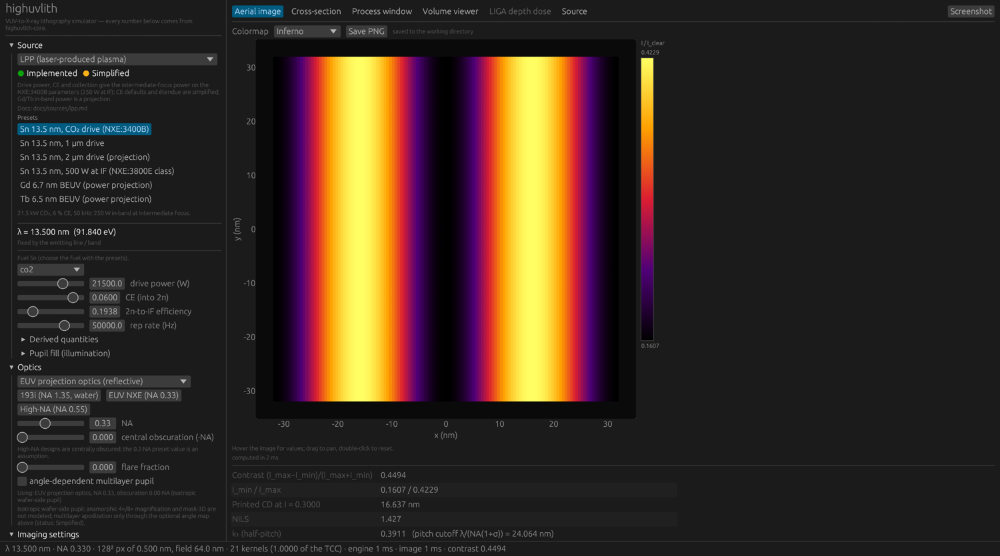
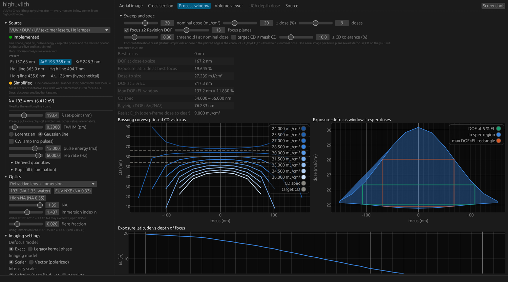
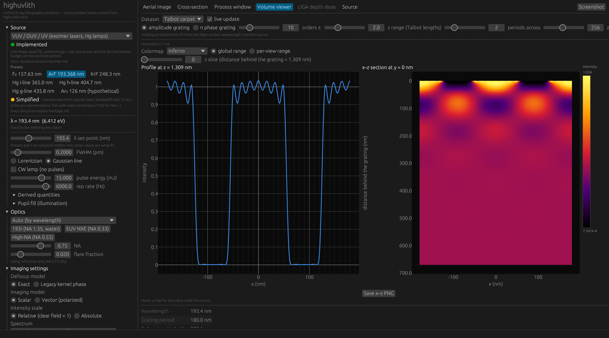
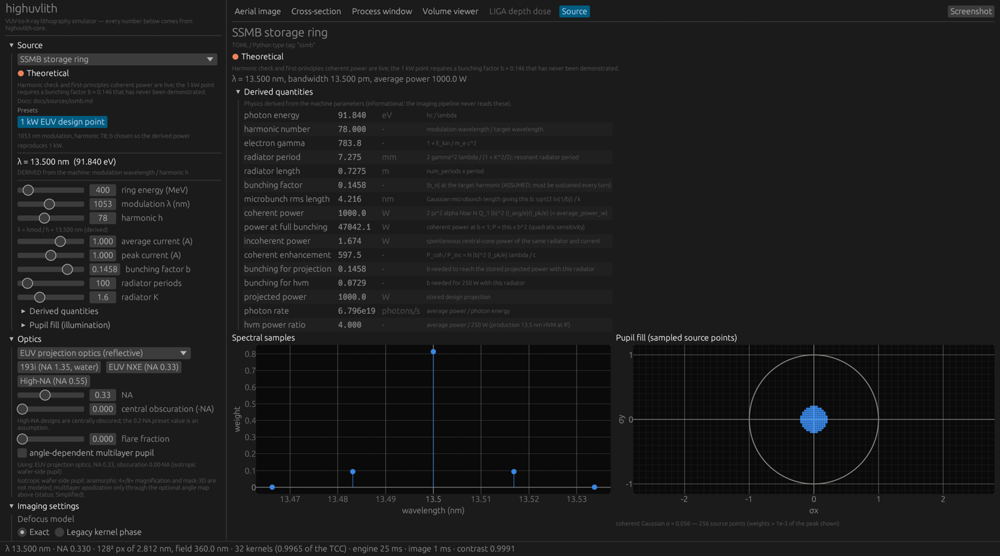

# Desktop GUI Reference

**Status:** ✅ Implemented — the [egui](https://github.com/emilk/egui) app in [`crates/highuvlith-gui`](../crates/highuvlith-gui/src) drives the same core models as the CLI and Python API on background threads; it adds no physics of its own, so every number it shows carries the fidelity badge of the core model behind it (shown next to each source family).

The GUI is an interactive front end for the whole pipeline: pick any of the fourteen light-source families (or one of their presets), see the physics derived from its machine parameters, choose optics and imaging settings, and look at the aerial image, its cross-section, the dose-aware process window, 3D resist / LIGA / Talbot volumes, and the LIGA depth dose.

## Running

```bash
cargo run -p highuvlith-gui --release
```

A debug build works but is noticeably slower on the process-window and volume views. Command-line options (all optional):

| Option | Meaning |
|---|---|
| `--preset NAME` | source preset, e.g. `arf`, `f2`, `lpp-sn`, `lpp-sn-500w`, `xfel-flash`, `hhg-ne`, `tube-w`, `betatron` (the full list is the `cli_name` table in [`sources.rs`](../crates/highuvlith-gui/src/sources.rs)) |
| `--optics NAME` | optics preset: `193i` (NA 1.35 water immersion), `nxe` (EUV NA 0.33), `high-na` (EUV NA 0.55) |
| `--tab NAME` | `aerial`, `cross-section`, `process-window`, `volume`, `liga`, `source` |
| `--dataset NAME` | volume dataset: `latent`, `developed`, `liga`, `talbot` |
| `--cd NM`, `--pitch NM` | mask line CD and pitch |
| `--size WxH` | window size in points (default 1500x950) |
| `--screenshot FILE.png` | save a PNG of the window once the view has been computed, then exit |

## Screenshots

These are real captures of the running app made with its own `--screenshot` mode (egui reads the rendered frame back from the GPU; nothing is mocked). They were made on macOS at 2× scale and downscaled to 1500 px wide:

```bash
B=target/release/highuvlith-gui
$B --preset lpp-sn --optics nxe --cd 16 --pitch 32 --tab aerial --screenshot gui-aerial-euv.png
$B --preset arf --optics 193i --cd 60 --pitch 130 --tab process-window --screenshot gui-process-window.png
$B --preset arf --tab volume --dataset talbot --screenshot gui-volume-talbot.png
$B --preset ssmb --optics nxe --tab source --screenshot gui-source-ssmb.png
```

**Aerial image** — Sn LPP (NXE:3400B preset) through NA 0.33 EUV optics, 16 nm lines at 32 nm pitch (k₁ = 0.39): contrast 0.45, printed CD 16.6 nm at threshold 0.3.



**Process window** — ArF on 193i water immersion, 60 nm lines at 130 nm pitch: Bossung curves, the exposure–defocus window with the largest DOF×EL rectangle and the DOF at 5 % exposure latitude, and the EL-vs-DOF curve.



**Volume viewer** — Talbot carpet behind a 180 nm amplitude grating at 193.4 nm: a z-slice profile (left) and the x–z section (right) with colour bar.



**Source view** — the SSMB 1 kW design point (🧪): its derived quantities with units and notes, the spectral samples and the sampled pupil fill.



## Layout

- **Left panel** — collapsible sections: Source, Optics, Imaging settings, Mask, Grid, Focus & threshold (and LIGA exposure when an X-ray source is selected).
- **Central panel** — six tabs: Aerial image, Cross-section, Process window, Volume viewer, LIGA depth dose, Source. Tabs that make no sense for the selected source are disabled (projection views for LIGA sources and vice versa).
- **Bottom bar** — wavelength, NA, grid, number of SOCS kernels and the fraction of the TCC they capture, engine/image times and the contrast; a spinner while a computation runs.

All physics runs on worker threads with latest-wins coalescing: dragging a slider never queues a backlog and the UI never blocks. Engines are cached by everything that defines them (source, optics, imaging settings, grid), so moving focus, CD or threshold reuses the engine. Errors from the core (an HHG harmonic beyond the cutoff, an unreachable FEL set-point, NA above the immersion limit, …) are shown in place of the result and clear when the inputs become valid.

## Source panel

A dropdown selects the family; buttons below it load the family's presets. Every preset is built from the corresponding core factory, so its numbers are the core's.

| Family (type tag) | Presets | Wavelength | Route |
|---|---|---|---|
| VUV / DUV / UV (`vuv`) | F₂ 157.63, ArF 193.368, KrF 248.3, Hg i/h/g lines, Ar₂ 126 (🧪 hypothetical) | fixed line | projection |
| LPA-FEL (`lpa_fel`) | 25 nm / 500 MeV (projection), 420 nm / 100 MeV (BELLA, demonstrated) | **derived**: undulator resonance | projection |
| LPP (`lpp`) | Sn CO₂ (NXE:3400B, 250 W at IF), Sn 1 µm, Sn 2 µm (projection), Sn 500 W at IF (NXE:3800E class; drive power assumed), Gd 6.7, Tb 6.5 (power projections) | fixed line | projection |
| Synchrotron (`synchrotron`) | compact EUV undulator, LIGA bending magnet | **derived**: undulator resonance (bending magnet: white beam) | projection / LIGA |
| HHG (`hhg`) | Ne q = 59 (13.56 nm), Ar q = 27 (29.6 nm) | **derived**: driver / q | projection |
| XFEL / FEL (`xfel`) | FLASH-like SASE, FERMI-like seeded, CW-SC (🧪), ERL (🧪) | set-point (K gap-tuned) | projection |
| Inverse Compton (`ics`) | compact EUV design point | **derived**: Compton upshift | projection |
| SSMB (`ssmb`) | 1 kW EUV design point | **derived**: modulation λ / harmonic | projection |
| Entangled photons (`entangled`) | NOON N = 2 at 157.63 nm | set-point | projection (classical imaging) |
| Hard X-ray tube (`xray_tube`) | W 60 kV, Mo 50 kV, Cu 40 kV, Rh 50 kV | **derived**: mean photon energy of the filtered spectrum | LIGA |
| DPP / LDP (`dpp`) | Sn LDP (360 W into 2π, ≈ 34 W at IF), Xe DPP (metrology class) | fixed line | projection |
| Soft-X-ray laser (`sxrl`) | Ni-like Ag 13.9, Cd 13.2, Mo 18.9, Ne-like Ar 46.9 nm | fixed atomic line | projection |
| Betatron (`betatron`) | 100 TW-class LWFA | **derived**: hc / mean photon energy | LIGA |
| Smith–Purcell (`smith_purcell`) | 30 keV, first order at 90° (13.5 nm) | **derived**: dispersion relation | projection |

For each family the panel shows:

- the **status badges** (✅ / 🔶 / 🧪) and a one-line justification mirroring the family's docs page, plus a preset-specific badge and provenance note where the preset differs (e.g. Ar₂ 🧪, LPP Gd/Tb power projections, XFEL CW-SC/ERL 🧪);
- the **wavelength** with how it arises — "fixed by the emitting line", a set-point, or "DERIVED from the machine" with the formula; for derived families the wavelength moves when the machine sliders move;
- the family's **main machine parameters** as sliders (e.g. LPP drive power, CE, 2π-to-IF efficiency and rep rate; undulator energy, period and K; HHG gas, intensity, harmonic with the live cutoff limit, and either the driver average power — the harmonic power is then derived as P_driver × η_q — or a stored pulse energy; X-ray tube anode, kV, mA and Be window);
- a collapsible **Derived quantities** table: every entry of the core's `derived_quantities()` with value, unit and note (gain lengths, flux, photon budgets, power ratios to a 250 W HVM source, exposure-time bounds, …);
- a collapsible **Pupil fill** section: the family default (a conventional disk of σ for incoherent sources, a coherence-derived Gaussian for beams) or an explicit conventional, annular, dipole (two poles) or quadrupole fill.

**X-ray tube, betatron and bending-magnet sources** are broadband and incoherent: the panel says so and routes them to the LIGA view (deep X-ray proximity printing) instead of projection imaging.

The **Source** tab repeats the badges and derived quantities at full width and plots the spectral samples and the sampled pupil fill (for X-ray sources: the photon spectrum).

## Optics

- **Kind**: Auto (refractive above 110 nm, reflective EUV projection optics below — no transparent lens material exists below ~110 nm), dry refractive lens, refractive lens + water immersion (NA up to 0.95·n; n = 1.437 at 193 nm), EUV projection optics, Schwarzschild objective, Fresnel zone plate. Forcing a refractive lens below 110 nm is allowed but flagged as unphysical.
- **Presets**: 193i (NA 1.35, water), EUV NXE (NA 0.33, unobscured), High-NA (NA 0.55 with a 0.2·NA central obscuration — an assumed value).
- **NA**, **central obscuration** (reflective optics), **flare fraction**.
- **Angle-dependent multilayer pupil** (EUV projection / Schwarzschild, opt-in, 🔶): Mo/Si, La/B₄C or La/B coating, period, number of coated mirrors and an incidence-angle map (angle at the pupil centre, radial change at the rim, linear tilt and its azimuth) applied to every mirror. The panel shows the single-mirror reflectance at the source wavelength so a mistuned coating is visible. The angle map is a user assumption, not a ray trace of a real design; with the clear-field normalization it changes the image shape (apodization and phase), not the dose.

The EUV pupil is isotropic on the wafer side: anamorphic 4×/8× magnification and mask-3D effects are not modelled.

## Imaging settings

- **Defocus model**: Exact (defocus inside the pupil at every source point, the default) or the legacy kernel-phase approximation, kept for comparison.
- **Imaging model**: scalar, or vector with illumination polarization X, Y, TE (azimuthal), TM (radial) or unpolarized.
- **Intensity scale**: relative (clear field = 1, the default) or absolute.
- **Spectrum**: monochromatic (centre wavelength), narrow-band (centre-wavelength kernels with a chromatic focus shift per spectral sample; valid for Δλ/λ ≪ 1) or per-wavelength (a TCC rebuilt at every spectral sample — the honest mode for an HHG comb or other broad spectra); the number of spectral samples can be overridden.
- **Max SOCS kernels**.

## Mask, grid, focus

- **Mask**: lines/spaces or a contact array; pitch and CD (or hole size); reverse field tone; 6 % / 180° attenuated PSM. Thin (Kirchhoff) mask with the exact Fourier-series spectrum; no mask-3D.
- **Grid**: grid size (power of two) with an automatic commensurate grid — the field holds a whole number of pitches and the pixel is small enough to represent the full band (1+σ)·NA/λ that reaches the pupil. The chosen field, pixel and Nyquist-safe pixel are shown; a manual target pixel is available.
- **Focus & threshold**: focus slider scaled to the Rayleigh DOF nλ/(2NA²) and the constant-threshold print level used for printed CD and NILS.

## Views

- **Aerial image** — heatmap (Inferno, Blues or grayscale colormap) with colour bar and value readout on hover; contrast, I_min/I_max, printed CD and NILS at the threshold, and k₁ with the pitch cutoff λ/(NA(1+σ)).
- **Cross-section** — intensity along the y = 0 row with the threshold line and marked printed edges; a data table.
- **Process window** — a dose × focus sweep through the core's dose-aware `ProcessWindow::compute` with a constant-threshold resist (🔶): Bossung curves (printed CD vs focus per dose) with the CD spec band, the exposure–defocus window (in-spec region, largest DOF×EL rectangle, DOF at 5 % EL), and EL vs DOF. Best focus, dose-to-size, DOF and EL are tabulated.
- **Volume viewer** — z-slice scrubber with an x–y slice and an x–z cross-section at a chosen y, colormap with global or per-view range, colour bar and value readout on hover, PNG export of either view. Datasets:
  - resist latent image (PAC) of the volumetric exposure through focus, after an optional Gaussian or CAR reaction–diffusion bake;
  - developed resist from fast-marching or level-set development (1 = dissolved). Defaults: 150 nm resist, 15 mJ/cm², Gaussian bake σxy = 10 nm / σz = 20 nm, 30 s. The bake is on by default because on bare Si the ≈ 48 nm standing waves otherwise stall the dissolution front at the first node; the core's default resist is illustrative and low contrast, so the window is narrow (spaces reach the substrate between 20 and 30 s, lines are gone by 60 s). See [volumetric-exposure.md](processes/volumetric-exposure.md);
  - LIGA absorbed dose (kJ/cm³) — X-ray sources only;
  - Talbot carpet I(x, z) behind an amplitude or π-phase grating (an x–z plane).
- **LIGA depth dose** — for X-ray tube, betatron and bending-magnet sources: absorbed dose vs depth in PMMA with the bottom (clearing) dose and damage ceiling, exposure time from the absolute flux when enabled (tube and betatron as point sources at a given distance, bending magnet from ring current, acceptance and scan), Be/Al/Kapton filters, Au absorber and Ti membrane, Fresnel or legacy Gaussian proximity model, and a warning when the grid under-resolves the Fresnel scale √(λd). "Open the 3D dose in the volume viewer" hands the dose volume to the volume viewer.
- **Source** — see above.

## Export

- **Save PNG** (aerial image and each volume view) writes the image at its native resolution with the colours shown.
- **Screenshot** (top right) saves the whole window; `--screenshot FILE.png` does the same from the command line and exits.

Both are written to the working directory as compressed RGBA PNGs (adaptive row filters plus DEFLATE via the `png` crate). A full-window capture at 2× scale (3000 × 1670 px, 20 MB of raw pixels) is about 0.4 MB.

## What the GUI does not show

- Grayscale lithography, interference lithography, ILT/OPC/SRAF, double patterning, DSA, ptychography, MNSL, stochastic/shot-noise analysis and the quantum N-photon imaging module are not in the GUI; use the [Python API](./python-api.md) (and, where a mode exists, the [CLI](./cli.md)).
- Thin-film stack reflectivity (swing curves) and resist chemistry beyond the volumetric exposure / bake / development chain are not exposed as separate views.
- Entangled-photon sources are imaged classically, like the rest of the pipeline; the λ/N figure appears only as a derived quantity.
