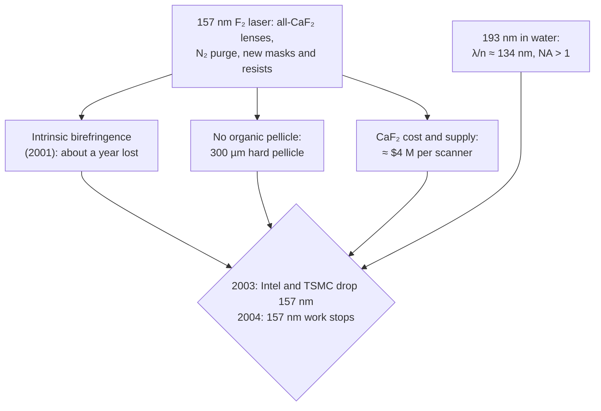

# The 157 nm detour

For a few years around 2000, the industry's plan after 193 nm was obvious. The next excimer
line down was the **F₂ (molecular fluorine) laser at 157 nm**. It would give 19 % shorter
wavelength with the same kind of refractive scanner. The programme reached prototype
scanners, then ended within about a year, and the way it ended changed the course of
lithography. It also matters for this project: **highuvlith began as a simulator for this
wavelength**, the 157.63 nm F₂ line and the 126 nm Ar₂ excimer (see
[VUV excimer sources](../sources/vuv-excimer.md), ✅ Implemented).

## The plan

MIT Lincoln Laboratory made the case in 1997. Bloomstein and co-workers printed features down
to 80 nm with a 157 nm F₂ laser and set out what the wavelength would need [1]. According to
Ronse, development started in the late 1990s and initially targeted the 65 nm node and
beyond [2]. ASML shipped its first 157 nm tool, a Micrascan VII step-and-scan system from its
newly acquired SVG Lithography division, to IMEC in 2003 [3, 4]. Bruning's table of Micrascan
generations lists it at NA 0.75 and 100 nm, and notes that it "never advanced beyond the
prototype stage" [5]. Canon was preparing its own: in May 2003 it planned an NA 0.80 beta tool, the
FPA-5800FS1, for early 2004, with a production model to follow in 2005 [6].

## What made 157 nm hard

Every part of the optical chain had to change. At 157 nm oxygen and water absorb, fused
silica stops being transparent enough, and the organic materials of 193 nm masks and
resists absorb too [2]. Ronse's list of the challenges [2]:

- **Lens material.** Every lens element between laser and wafer had to be calcium fluoride
  (CaF₂). At 193 nm only a small fraction of the elements are CaF₂ and the rest fused silica.
  Growing large, homogeneous CaF₂ crystals in volume needed "very long and tedious cooling and
  annealing steps". In early 2003 Intel told EE Times that each scanner needed roughly
  $4 million of lens-quality CaF₂ [7]. Nikon started its own CaF₂ crystal-growing plant in
  2001 [4].
- **Intrinsic birefringence.** Cubic CaF₂ was supposed to be optically isotropic. In 2001
  Burnett, Levine and Shirley at NIST measured an intrinsic birefringence for light travelling
  along the crystal's [110] direction. The two published records of the paper give different
  numbers: NIST's record lists (6.5 ± 0.4) × 10⁻⁷ at 157.10 nm and (3.6 ± 0.2) × 10⁻⁷ at
  193.09 nm, while the abstract of the published *Phys. Rev. B* paper gives
  (−11.8 ± 0.4) × 10⁻⁷ at 156.10 nm [8]. Either way the authors called it "considerably larger
  than the present semiconductor industry birefringence specifications" for 193 nm and 157 nm
  optics [8]. Being intrinsic, it could not be removed by growing better crystals.
  The effect "set the program back by a full year" [7]. Lens designs were redone to combine elements cut along different crystal axes
  (⟨100⟩ and ⟨111⟩) so the contributions cancel [2].
- **Colour.** With only one lens material, chromatic aberration cannot be corrected by
  combining glasses. Lens designers turned to **catadioptric** designs with a few mirrors,
  which allow colour correction for the laser's residual bandwidth [2].
- **Pellicles.** In five years of research no organic pellicle film was found with enough
  transparency and lifetime at 157 nm. The fallback was a "hard" pellicle: a 300 µm plate of
  modified fused silica mounted precisely over the reticle, which then counted as an optical
  element that the lens had to be designed around [2].
- **Masks and resists.** Mask substrates had to be fluorine-doped. Resists needed new,
  fluorinated polymers to be transparent enough [2].
- **Atmosphere.** Oxygen and water absorb 157 nm light, so the whole beam path was purged with
  nitrogen [2].



## How it ended

On 23 May 2003 EE Times reported that Intel had "dropped 157-nm tools from its roadmap". Intel
would stretch 193 nm scanners across its 90, 65 and 45 nm generations and named EUV the
"primary candidate" for 32 nm, then planned for 2009. It cited the cost and short supply of
CaF₂, immature 157 nm resists and pellicles, and the "unsuspected high levels of intrinsic
birefringence" [9]. On 14 October 2003 TSMC confirmed it had cancelled its 157 nm orders:
"We are interested in immersion lithography instead" [10]. In 2004 the industry stopped
157 nm work [2].

Ronse is clear about the cause. The technical problems "were not the main reason" 157 nm was
removed from the roadmap; "157 nm was really killed by the early R&D on 193 nm immersion
lithography" [2]. Filling the gap between the last lens and the wafer with water (n ≈ 1.44)
raises the possible NA by that factor. That gain is larger than the one from moving to
157 nm. Immersion also kept most of the 193 nm infrastructure: fused-silica lenses, 193 nm
reticles and pellicles, and resists that were already largely developed [2].

| Option | Wavelength in the resist-side medium | NA ceiling | Lens material | Pellicle |
|---|---|---|---|---|
| 193 nm dry | 193 nm | < 1 (0.93 in practice) | mostly fused silica | organic |
| 157 nm dry | 157 nm | < 1 | all CaF₂ | 300 µm hard pellicle |
| 193 nm water immersion | 193/1.44 ≈ 134 nm | ≈ 1.44 (1.35 in practice) | mostly fused silica | organic |

Immersion itself had been tried at 157 nm: in 2001 Switkes and Rothschild at MIT Lincoln
Laboratory showed 157 nm immersion lithography with perfluoropolyether fluids [11]. The
simpler 193 nm water version won. Its story continues on
[the immersion page](immersion-multipatterning.md).

## What 157 nm left behind

Ronse concludes that 157 nm "has not been a complete waste of time" [2]:

- the first catadioptric lithography lens designs were made for 157 nm, and hyper-NA 193 nm
  immersion lenses then adopted catadioptric designs;
- the push for better CaF₂ paid off in hyper-NA immersion lenses;
- work on 157 nm resists fed into the hydrophobic resists used for immersion;
- intrinsic and stress birefringence are now checked carefully in any new lens material.

!!! note "The Ar₂ excimer at 126 nm"
    highuvlith also ships an Ar₂ excimer preset at 126 nm, the practical short-wavelength end of
    transmissive optics. It is a what-if. Ar₂* emits a continuum several nanometres wide, a
    picometre-class line-narrowed Ar₂ lithography laser has never been demonstrated, and the
    sources checked for this page show no lithography programme at 126 nm. The source page
    labels the preset accordingly.

## What highuvlith models, and what it does not

| 157 nm issue | In highuvlith |
|---|---|
| F₂ line, bandwidth, pulse energy × rep rate | ✅ `SourceConfig.f2_laser`: Lorentzian line (1.1 pm preset), 10 mJ × 4 kHz → 40 W ([VUV sources](../sources/vuv-excimer.md)) |
| CaF₂ refractive optics with chromatic defocus | ✅ refractive optics (Zernike aberrations, axial chromatic coefficient, 15 nm of defocus per pm by default, the CaF₂ value at 157 nm); polychromatic imaging exact per wavelength with `compute_multiwavelength` (✅), or as a narrow-band focus shift per spectral sample with `compute_polychromatic` (🔶) ([optics](../optics.md), [pipeline](../pipeline.md)) |
| Fluoropolymer resist | 🔶 Dill ABC + Mack development with `ResistConfig.vuv_fluoropolymer()` parameters; no fluoropolymer chemistry ([resist models](../processes/resist-models.md)) |
| VUV optical constants | 🔶 tabulated n, k for 126–160 nm ([materials](../materials.md)) |
| Intrinsic birefringence of CaF₂ | not modeled: the vector model assumes an ideal, non-birefringent lens ([vector imaging](../vector-imaging.md)) |
| Hard pellicle, N₂ purge, O₂/H₂O absorption | not modeled |
| Catadioptric lens design | not modeled (pupil-function level only) |

## Try it

!!! example "Try it in highuvlith: why a single lens material makes bandwidth matter"
    With CaF₂ only, the lens cannot be colour-corrected. Each picometre of bandwidth moves best
    focus (15 nm per pm in the default optics), so a broader line blurs the image. Compare the
    monochromatic and polychromatic images of 100 nm lines at NA 0.85 as the F₂ linewidth grows.

    <!-- verify-example -->
    ```python
    import highuvlith as huv

    optics = huv.OpticsConfig(numerical_aperture=0.85)
    mask = huv.MaskConfig.line_space(cd_nm=100.0, pitch_nm=200.0)
    grid = huv.GridConfig(size=128, pixel_nm=3.125)  # 400 nm field = 2 periods
    for bw_pm in (0.5, 1.1, 5.0):
        src = huv.SourceConfig(wavelength_nm=157.63, sigma_outer=0.7,
                               bandwidth_pm=bw_pm, spectral_samples=7)
        engine = huv.SimulationEngine(src, optics, mask, grid=grid)
        mono = engine.compute_aerial_image(focus_nm=0.0).image_contrast()
        poly = engine.compute_polychromatic(focus_nm=0.0).image_contrast()
        print(f"{bw_pm:.1f} pm FWHM: monochromatic {mono:.3f}, polychromatic {poly:.3f}")
    ```

    ??? success "Output"

        ```text
        0.5 pm FWHM: monochromatic 0.847, polychromatic 0.846
        1.1 pm FWHM: monochromatic 0.847, polychromatic 0.841
        5.0 pm FWHM: monochromatic 0.847, polychromatic 0.753
        ```

<figure markdown="span">


<figcaption>Why a single lens material makes bandwidth matter (the page's bandwidth example, swept). Each spectral sample (7 per line) is focused at a different depth by the default chromatic coefficient of a CaF<sub>2</sub> lens at 157 nm, so contrast falls with FWHM. The exact path (<code>compute_multiwavelength</code>) and the narrow-band approximation (<code>compute_polychromatic</code>) agree at Δλ/λ ~ 10<sup>−5</sup>. Default 2 % flare. Models: broadband imaging ✅, narrow-band approximation 🔶, refractive optics ✅ (linear axial chromatic coefficient).</figcaption>
</figure>

!!! example "Try it in highuvlith: 157 nm dry against 193 nm water immersion"
    The comparison that ended the programme: 45 nm lines and spaces through a dry 157 nm lens at
    NA 0.85 (a little beyond the 0.75–0.80 of the 157 nm tools actually built or planned), against
    193 nm in water at NA 1.35. At 157 nm and NA 0.85, k₁ is 0.24, below the single-exposure
    floor. With immersion it is 0.31.

    <!-- verify-example -->
    ```python
    import highuvlith as huv

    mask = huv.MaskConfig.line_space(cd_nm=45.0, pitch_nm=90.0)
    grid = huv.GridConfig(size=128, pixel_nm=1.40625)  # 180 nm field = 2 periods
    cases = [
        ("F2 157 nm, dry NA 0.85", huv.SourceConfig.f2_laser(sigma=0.9),
         huv.OpticsConfig(numerical_aperture=0.85)),
        ("ArF 193 nm, water NA 1.35", huv.SourceConfig.arf_laser(sigma=0.9),
         huv.OpticsConfig.immersion_193i()),  # NA 1.35 in water, n = 1.437
    ]
    for label, source, optics in cases:
        engine = huv.SimulationEngine(source, optics, mask, grid=grid)
        print(f"{label}: contrast {engine.compute_aerial_image(focus_nm=0.0).image_contrast():.3f}")
    ```

    ??? success "Output"

        ```text
        F2 157 nm, dry NA 0.85: contrast 0.000
        ArF 193 nm, water NA 1.35: contrast 0.200
        ```

<figure markdown="span">


<figcaption>The comparison that ended the 157 nm programme, across half-pitch: conventional σ 0.9, default 2 % flare, two-period commensurate fields. Dotted lines mark each tool's k<sub>1</sub> = 0.25 half-pitch; with σ 0.9 the image vanishes slightly above it, at λ/(2NA·1.9). The dashed line is the 45 nm example on the page. Models: scalar Hopkins imaging ✅, immersion optics ✅ (water n = 1.437; no polarization in this chart).</figcaption>
</figure>

## Key takeaways

- 157 nm was the natural next excimer wavelength. It reached the prototype stage (ASML/SVGL
  Micrascan VII, NA 0.75, 2003) and went no further.
- At 157 nm every material becomes a problem: all-CaF₂ lenses, the discovery of intrinsic
  birefringence in 2001, no usable organic pellicle, new fluorinated resists and nitrogen
  purging.
- Water immersion at 193 nm gave a larger resolution gain than 157 nm dry, and kept the 193 nm
  infrastructure. Intel dropped 157 nm in May 2003 and TSMC in October 2003; the work
  stopped in 2004.
- The detour left catadioptric lens designs, better CaF₂ and hydrophobic-resist know-how that
  hyper-NA immersion then used.

## References and further reading

1. T. M. Bloomstein, M. W. Horn, M. Rothschild, R. R. Kunz, S. T. Palmacci, R. B. Goodman,
   "Lithography with 157 nm lasers," *J. Vac. Sci. Technol. B* **15**, 2112–2116 (1997),
   [doi:10.1116/1.589230](https://doi.org/10.1116/1.589230).
2. K. Ronse, "Optical lithography—a historical perspective," *C. R. Physique* **7**, 844–857
   (2006), sections 7.1–7.2, [doi:10.1016/j.crhy.2006.10.007](https://doi.org/10.1016/j.crhy.2006.10.007).
3. A. Kato, "Chronology of Lithography Milestones," v0.9 (May 2007),
   [lithoguru.com](https://www.lithoguru.com/scientist/litho_history/Kato_Litho_History.pdf).
4. C. A. Mack, "Milestones in Optical Lithography Tool Suppliers" (2005),
   [lithoguru.com](https://lithoguru.com/scientist/litho_history/milestones_tools.pdf).
5. J. H. Bruning, "Optical lithography … 40 years and holding," *Proc. SPIE* **6520**, 652004
   (2007), Table 2, [doi:10.1117/12.720631](https://doi.org/10.1117/12.720631).
6. EE Times, ["ASML, Canon remain committed to 157-nm"](https://www.eetimes.com/asml-canon-remain-committed-to-157-nm/) (23 May 2003).
7. EE Times, ["Intel: 157-nm and EUV tools may be late"](https://www.eetimes.com/document.asp?doc_id=1145551)
   (17 February 2003).
8. J. H. Burnett, Z. H. Levine, E. L. Shirley, "Intrinsic birefringence in calcium fluoride and
   barium fluoride," *Phys. Rev. B* **64**, 241102(R) (2001),
   [doi:10.1103/PhysRevB.64.241102](https://doi.org/10.1103/PhysRevB.64.241102);
   abstract at [NIST](https://www.nist.gov/publications/intrinsic-birefringence-calcium-fluoride-and-barium-floride).
9. EE Times, ["Intel drops 157-nm tools from lithography roadmap"](https://www.eetimes.com/intel-drops-157-nm-tools-from-lithography-roadmap/)
   (23 May 2003).
10. EE Times, ["TSMC cancels 157-nm litho orders, backs immersion"](https://www.eetimes.com/tsmc-cancels-157-nm-litho-orders-backs-immersion/)
    (14 October 2003).
11. M. Switkes, M. Rothschild, "Immersion lithography at 157 nm," *J. Vac. Sci. Technol. B*
    **19**, 2353–2356 (2001), [doi:10.1116/1.1412895](https://doi.org/10.1116/1.1412895).
