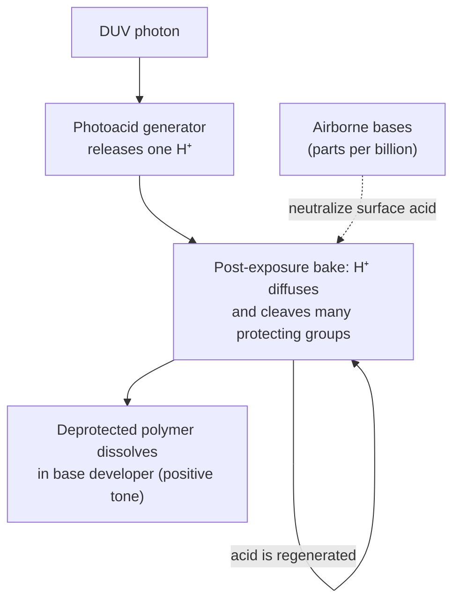

# Excimer lasers and the deep-UV era

Leaving the mercury lamp meant rebuilding almost everything at once. The light source, the
resist chemistry, the lens materials and the mask design all changed. Bruning's summary is
that changing from a lamp to an excimer laser "required a change of optical materials, a change
of photoresist materials, chemistry and processes, as well as the development of improved
tools, metrology and processes for lens manufacturing" [1]. The payoff was two wavelength steps,
248 nm (KrF) and 193 nm (ArF). The same era also cut k₁ from about 0.6 to 0.3, and that cut
turned out to matter as much as the wavelengths.

## Why the mercury lamp ran out

Two problems met at 248 nm. The first was **light**: a mercury lamp emits only about 1/30 as
much at 248 nm as in its other UV bands [2]. Ronse puts early 248 nm sources, lamps and KrF
lasers alike, at an order of magnitude less power than the i-line [3]. The second was
**colour**. The i-line is about 3 nm wide, so g- and i-line lenses combined several glasses to
correct chromatic aberration. Few glasses transmit in the deep UV, but a laser narrowed to a
few picometres removes the need for colour correction: "the few-pm source bandwidth allowed
all elements of the lens to be made from fused silica" [1].

## Excimer lasers

An excimer ("excited dimer") laser uses a molecule that is bound only in its excited state.
The rare-gas halides used in lithography, KrF at 248 nm and ArF at 193 nm, are formed in a
pulsed electric discharge through a krypton or argon and fluorine gas mixture. They fall
apart as soon as they emit, so the lower laser level empties itself.

- **1970–1971.** N. G. Basov and colleagues at the Lebedev Institute reported the first excimer
  laser, xenon dimers excited by an electron beam, emitting near 172–176 nm [4].
- **1975.** Lasers on rare-gas halides followed, among them KrF and XeCl, reported by Ewing and
  Brau [5]. **ArF at 193 nm** followed in 1976 (Hoffman, Hays and Tisone at Sandia) [6].
- **1982.** Kanti Jain, C. Grant Willson and Burn Lin at IBM published "Ultrafast deep UV
  lithography with excimer lasers", the first demonstration of excimer-laser lithography [7].

Lithography-grade lasers came later. According to Kato, Komatsu shipped the first KrF laser
built for lithography (KLE-630S) in 1987. Cymer, founded in San Diego in 1986, shipped its
first prototype, the CX-2LS, in 1988: 200 Hz, 3 W and 3 pm bandwidth, used in Nikon's first KrF
stepper [8]. Cymer went on to hold more than 80 % of the market through the 1990s. Its 1995
ELS-4000F replaced the thyratron switch with solid-state pulsed power and reached 600 Hz and
6 W [8]. Lambda Physik left the market in 2004, leaving Cymer and Gigaphoton (a 2000 joint
venture of Komatsu and Ushio) [8]. ASML acquired Cymer in 2013 [9].

!!! note "Line narrowing and polychromatic imaging"
    A free-running excimer laser emits a band far too wide for an all-fused-silica lens. Grating
    and etalon line narrowing cuts it to the picometre level. The residual bandwidth still
    matters: every picometre shifts best focus slightly. highuvlith models this directly.
    Sources carry a line shape and bandwidth, and the refractive optics carry an
    axial-chromatic coefficient in nm of defocus per pm (the default, 15 nm/pm, is the 157 nm
    CaF₂ value, so set your own for a KrF or ArF lens). `compute_multiwavelength` rebuilds the
    imaging kernels at every spectral sample (✅). The faster `compute_polychromatic` keeps the
    centre-wavelength kernels and adds only the focus shift (🔶, valid for Δλ/λ ≪ 1). See the
    [pipeline](../pipeline.md), [optics](../optics.md) and
    [DUV heritage sources](../sources/duv-heritage.md) pages.

## Chemically amplified resists

DNQ/novolac, the positive resist of the g- and i-line era, absorbs too strongly at 248 nm and
below [3], and the weak DUV sources needed a far more sensitive resist. The
answer came from IBM. In early 1979 **C. Grant Willson** and **Jean Fréchet** at IBM San Jose
decided that the needed innovation was a chain reaction [2]. With **Hiroshi Ito** they built a
resist from poly(p-t-butyloxycarbonyloxystyrene), PBOCST, and an onium-salt **photoacid
generator** (PAG). Each absorbed photon releases one acid molecule. During the post-exposure
bake that acid catalytically cleaves many protecting groups, changing the polymer's
solubility; this is the chemical amplification [2, 10].



The first production use was in **negative** tone: PBOCST with triphenylsulfonium
hexafluoroantimonate printed the recessed-oxide isolation level of IBM's 1 Mb DRAM, at
100 five-inch wafers per hour and 0.9 µm. Willson and co-authors call it "the first full
scale, commercial application of deep UV photolithography", with photosensitivity improved by
two orders of magnitude [10]. The IBM Burlington line was in full production by 1986, on
Perkin-Elmer Micralign tools using the lamp's deep-UV output [2]. Manufacturing then exposed
a new problem, "aging". Sensitivity drifted because the resist absorbed basic contaminants,
such as N-methylpyrrolidone at parts-per-billion levels, from the air between coating and
exposure. Carbon-filtered enclosures fixed it. Together with robotic wafer transfer they were
the precursor of today's linked track-and-scanner clusters [10].

At 193 nm both the novolac and the polyhydroxystyrene platforms absorb far too strongly, and
entirely new materials were needed. The first viable 193 nm resist came from IBM: an acrylate
analogue of PBOCST, first designed for visible-laser exposure of printed circuit boards and
transparent at 193 nm once its sensitizing dye was removed [10].

!!! info "What highuvlith models here"
    The resist models are 🔶 Simplified (see [resist models](../processes/resist-models.md)).
    The standard path is Dill ABC exposure, a Gaussian post-exposure-bake blur with diffusion
    length `peb_diffusion_nm`, and Mack development. A separate chemically amplified bake
    model solves the standard acid–quencher reaction–diffusion equations, with constant
    diffusivities, no acid loss and illustrative default constants. Airborne-base
    contamination (T-topping) is not modeled. Photon shot noise and the line-edge roughness it
    causes are ✅ in the stochastic module (see [research modules](../research-modules.md)).

## KrF and ArF go into production

KrF began with an R&D tool, Nikon's NSR-1505EX of 1988 (NA 0.42, 0.5 µm), which resist
makers used to develop KrF resists [8]. ASML's first KrF stepper, the PAS 5000/70, followed in
1991 [8]. The production workhorses were the scanners of the mid-1990s: Nikon NSR-S201A (1995),
SVGL Micrascan III (1996), and ASML PAS 5500/500 and Canon FPA-4000ES1 (1997) [8, 11]. KrF took
over the critical layers in the late 1990s [12].

The first ArF scanners arrived within two years of each other: ASML's PAS 5500/900 (1998; its
NA is given as adjustable from 0.45 to below 0.6 in ASML's product description [18], while
Bruning's table of Zeiss lenses lists the "900" lens at 0.63 [1]), Nikon's NSR-S302A (1999, which Nikon calls the first dry ArF scanner produced), Canon's
FPA-5000AS1 (1999) and SVGL's Micrascan 193 (1999, NA 0.6) [8, 11, 1, 13]. ArF entered
production mainly at the 90 nm node. Dry lenses went up to NA 0.93, and "all critical layers
utilize one or more low-k₁ techniques such as PSM or OPC" [3]. In May 2003 Intel said it would
use 193 nm for its 90, 65 and 45 nm generations [14]. The 157 nm alternative was dropped, as
told on [the next page](157nm-detour.md).

The ASML/Zeiss 193 nm lenses Bruning tabulates show the whole story in one row of numbers.
From the "900" lens to the "1900" (the XT:1900i generation), NA rose from 0.63 to 1.35 while k₁ fell from 0.42 to
0.31 [1].

## Resolution enhancement: k₁ below 0.5

With λ and NA each approaching a wall, the process factor k₁ became the lever. Three
**resolution-enhancement techniques** (RETs) did most of the work [3, 15].

**Off-axis illumination (OAI).** A dense grating diffracts its first orders at angles whose
sine is λ/pitch. If that exceeds the lens NA, on-axis light passes only the zero order and no
pattern forms. Tilting the illumination brings the zero order and one first order inside
the pupil together, and their two-beam interference prints the grating. Nikon (Shiraishi et
al.) and Canon (Noguchi et al.) published OAI systems in 1992 [3]. Early illuminators wasted the
blocked light, until tool makers found ways to redistribute it. The method helps dense lines
but can degrade isolated lines and "forbidden" intermediate pitches, and quadrupoles favour
horizontal and vertical lines over diagonal ones [3]. Nikon later sued ASML over OAI patents.
The case settled in 2004 with ASML paying $87 million and Zeiss $58 million [11].

<figure markdown="span">
  { width="820" }
  { width="820" }
  <figcaption markdown="span">Why off-axis illumination helps. Every illumination shape shown is available in
  highuvlith's core `IlluminationShape` (with a graded
  `CoherentGaussian` fill as well). In Python, `SourceConfig` carries the
  conventional σ; the OPC, ILT and SRAF functions accept the other shapes. Script:
  [make_history_schematics.py](../figures/history/make_history_schematics.py).</figcaption>
</figure>

**Phase-shift masks (PSM).** M. D. Levenson, N. S. Viswanathan and R. A. Simpson at IBM
showed in 1982 that shifting the phase of every other opening by 180° makes the light between
them cancel [16]. Kato notes that M. Shibuya of Nikon had filed a phase-shift-mask patent in
1980, independently of Levenson [8]. Research took off in the early 1990s [3]. The
**alternating** PSM suited regular patterns such as memory word and bit lines. It was hard to
apply to random logic, where phase assignments conflict, and phase defects were hard to find
and repair, so mask shops could not guarantee defect-free masks. The simpler **attenuated (embedded) PSM**, whose absorber passes a
few percent of the light with a 180° shift, was adopted widely for contact and via layers
and later for gates [3].

<figure markdown="span">
  ![Two columns comparing a binary mask with an alternating phase-shift mask for two openings
  close together. Top: mask amplitude, both openings plus one for the binary mask, plus one and
  minus one for the phase-shift mask. Middle: the band-limited field at the wafer, which stays
  positive between the openings for the binary mask but crosses zero for the phase-shift
  mask. Bottom: intensity, where the binary openings merge into one blurred peak pair with a
  shallow dip while the phase-shift mask leaves a dark null between two clear
  peaks.](../assets/images/history/psm-principle-light.svg#only-light){ width="820" }
  ![Two columns comparing a binary mask with an alternating phase-shift mask for two openings
  close together. Top: mask amplitude, both openings plus one for the binary mask, plus one and
  minus one for the phase-shift mask. Middle: the band-limited field at the wafer, which stays
  positive between the openings for the binary mask but crosses zero for the phase-shift
  mask. Bottom: intensity, where the binary openings merge into one blurred peak pair with a
  shallow dip while the phase-shift mask leaves a dark null between two clear
  peaks.](../assets/images/history/psm-principle-dark.svg#only-dark){ width="820" }
  <figcaption markdown="span">Levenson's idea in one dimension. The same lens (coherent illumination, pupil
  cutoff 0.4 per opening width) images two openings. With opposite phases the field must pass
  through zero between them, and intensity is the square of the field. This is a 1D scalar model
  (numpy), not a highuvlith run. Script:
  [make_history_figures.py](../figures/history/make_history_figures.py).</figcaption>
</figure>

**Optical proximity correction (OPC).** Near the resolution limit the printed shape no
longer follows the mask: line ends pull back, corners round, and isolated and dense lines print
at different widths. OPC pre-distorts the mask to compensate, with serifs, hammerheads, biases
and sub-resolution assist features. Rule-based OPC applies corrections from a look-up table.
Model-based OPC simulates the image and iterates edge positions until the print matches the
target, and it took over as layouts grew more complex. The first automated approaches were
published in 1994 [3, 15]. ASML bought MaskTools, with its OPC software and scattering-bar
patents, in 1999 [11].

<figure markdown="span">
  { width="820" }
  { width="820" }
  <figcaption markdown="span">k₁ = R·NA/λ derived from vendor-stated resolution for each tool model in the
  data set. Vendors define "resolution" in different ways, so read the trend, not individual
  points. Data and sources: the [History
  overview](index.md#the-resolution-story-in-data).</figcaption>
</figure>

!!! info "Resolution enhancement in highuvlith"
    - **OPC and ILT**: rule-based and model-based OPC and inverse lithography with an exact
      adjoint gradient are ✅ Implemented; sub-resolution assist-feature (SRAF) insertion, a
      rule deck with a model print check, is 🔶 Simplified. See
      [research modules](../research-modules.md) and the [capability matrix](../capability-matrix.md).
    - **Illumination**: conventional, annular, dipole and quadrupole pupils exist in the Rust
      core (`IlluminationShape`). From Python they reach the OPC, ILT and SRAF functions
      through an `illumination` argument; `SimulationEngine` and the CLI use the conventional σ.
    - **Phase-shift masks**: the thin-mask model represents an attenuated PSM as
      √T·e^{iφ} on the absorber (see [masks and metrics](../masks-and-metrics.md)). The
      alternating PSM is treated as a binary mask, and thick-mask (3D/EMF) effects are not
      modeled.

## Try it

!!! example "Try it in highuvlith: why larger σ helps a k₁ ≈ 0.29 grating"
    90 nm lines on a 180 nm pitch at KrF with NA 0.80 put k₁ at 0.29. With a small partial
    coherence σ, no first order reaches the pupil. Opening σ tilts part of the illumination far
    enough off axis for one first order to enter, a crude version of off-axis illumination
    built from a conventional disc. Here that takes σ above about 0.72, and even at σ = 0.9 the
    contrast stays low because only the outer part of the disc contributes. A dipole or annular
    source puts most of its light where it helps.

    <!-- verify-example -->
    ```python
    import highuvlith as huv

    mask = huv.MaskConfig.line_space(cd_nm=90.0, pitch_nm=180.0)
    optics = huv.OpticsConfig(numerical_aperture=0.80)
    grid = huv.GridConfig(size=128, pixel_nm=2.8125)  # 360 nm field = 2 periods
    for sigma in (0.3, 0.5, 0.7, 0.9):
        source = huv.SourceConfig.krf_laser(sigma=sigma)
        engine = huv.SimulationEngine(source, optics, mask, grid=grid)
        contrast = engine.compute_aerial_image(focus_nm=0.0).image_contrast()
        print(f"sigma = {sigma:.1f}: contrast = {contrast:.3f}")
    ```

    ??? success "Output"

        ```text
        sigma = 0.3: contrast = 0.000
        sigma = 0.5: contrast = 0.000
        sigma = 0.7: contrast = 0.000
        sigma = 0.9: contrast = 0.090
        ```

<figure markdown="span">


<figcaption>Why larger σ helps a k<sub>1</sub> ≈ 0.29 grating (the page's σ-sweep example; dots = the four values it prints; default adaptive source sampling throughout). Below σ = λ/(p·NA) − 1 ≈ 0.72 no source point can put a first diffraction order through the pupil and the image is flat; above it the off-axis part of the fill forms two-beam images. Conventional fill only; default 2 % flare. Model: scalar Hopkins imaging ✅, illumination pupil fills ✅.</figcaption>
</figure>

## Key takeaways

- Moving to the deep UV meant a new source (the excimer laser, line-narrowed to picometres),
  all-fused-silica lenses and a new resist chemistry at the same time.
- Chemically amplified resists multiplied each photon's effect through acid catalysis. They
  went into production at IBM in the mid-1980s, before KrF lasers took over.
- ArF at 193 nm entered production around the 90 nm node. Dry NA stopped at 0.93.
- Off-axis illumination, phase-shift masks and OPC pushed k₁ from about 0.6 to about 0.3.
  These techniques did as much for resolution as the wavelength changes.

## References and further reading

1. J. H. Bruning, "Optical lithography … 40 years and holding," *Proc. SPIE* **6520**, 652004
   (2007), [doi:10.1117/12.720631](https://doi.org/10.1117/12.720631).
2. D. C. Brock, "Patterning the world: the rise of chemically amplified photoresists,"
   *Chemical Heritage* (Science History Institute, 2007),
   [sciencehistory.org](https://www.sciencehistory.org/stories/magazine/patterning-the-world-the-rise-of-chemically-amplified-photoresists/).
3. K. Ronse, "Optical lithography—a historical perspective," *C. R. Physique* **7**, 844–857
   (2006), [doi:10.1016/j.crhy.2006.10.007](https://doi.org/10.1016/j.crhy.2006.10.007).
4. N. G. Basov, V. A. Danilychev, Yu. M. Popov, "Stimulated emission in the vacuum
   ultraviolet region," *Sov. J. Quantum Electron.* **1**, 18 (1971),
   [doi:10.1070/QE1971v001n01ABEH003011](https://doi.org/10.1070/QE1971v001n01ABEH003011).
5. J. J. Ewing, C. A. Brau, "Laser action on the ²Σ⁺½ → ²Σ⁺½ bands of KrF and XeCl," *Appl.
   Phys. Lett.* **27**, 350 (1975), [doi:10.1063/1.88473](https://doi.org/10.1063/1.88473).
6. J. M. Hoffman, A. K. Hays, G. C. Tisone, "High power uv noble-gas-halide lasers," *Appl.
   Phys. Lett.* **28**, 538–539 (1976), [doi:10.1063/1.88813](https://doi.org/10.1063/1.88813).
7. K. Jain, C. G. Willson, B. J. Lin, "Ultrafast deep UV lithography with excimer lasers,"
   *IEEE Electron Device Lett.* **3**, 53–55 (1982),
   [doi:10.1109/EDL.1982.25476](https://doi.org/10.1109/EDL.1982.25476).
8. A. Kato, "Chronology of Lithography Milestones," v0.9 (May 2007),
   [lithoguru.com](https://www.lithoguru.com/scientist/litho_history/Kato_Litho_History.pdf).
9. ASML, [company history](https://www.asml.com/en/company/about-asml/history).
10. C. G. Willson, R. A. Dammel, A. Reiser, "Photoresist materials: a historical perspective,"
    *Proc. SPIE* **3051**, 28–41 (1997),
    [author copy](http://www.lithoguru.com/scientist/litho_history/Photoresist_materials_historical_perspective_Willson_1997.pdf).
11. C. A. Mack, "Milestones in Optical Lithography Tool Suppliers" (2005),
    [lithoguru.com](https://lithoguru.com/scientist/litho_history/milestones_tools.pdf).
12. C. A. Mack, "Seeing double," *IEEE Spectrum* (November 2008),
    [spectrum.ieee.org](https://spectrum.ieee.org/seeing-double).
13. Nikon, [history of semiconductor lithography systems](https://www.nikon.com/business/semi/history/).
14. EE Times, ["Intel drops 157-nm tools from lithography roadmap"](https://www.eetimes.com/intel-drops-157-nm-tools-from-lithography-roadmap/) (May 2003).
15. N. Cobb, *Fast optical and process proximity correction algorithms for integrated circuit
    manufacturing*, PhD thesis, University of California, Berkeley (1998),
    [PDF](http://www-video.eecs.berkeley.edu/papers/ncobb/cobb_phd_thesis.pdf).
16. M. D. Levenson, N. S. Viswanathan, R. A. Simpson, "Improving resolution in photolithography
    with a phase-shifting mask," *IEEE Trans. Electron Devices* **29**, 1828–1836 (1982),
    [doi:10.1109/T-ED.1982.21037](https://doi.org/10.1109/T-ED.1982.21037).
17. H. Ito, "Chemical amplification resists: history and development within IBM," *IBM J. Res.
    Dev.* **41**(1/2) (1997), [doi:10.1147/rd.411.0069](https://doi.org/10.1147/rd.411.0069).
18. Semiconductor Online, ["PAS 5500/900 193 nm Step and Scan System"](https://www.semiconductoronline.com/doc/pas-5500900-193-nm-step-and-scan-system-0001)
    (ASML product description: Starlith 900 lens, NA adjustable from 0.45 to <0.6, for
    linewidths from 150 nm down to 130 nm).
