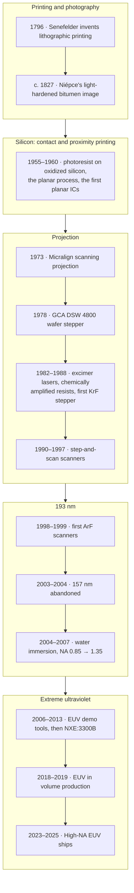

# A history of lithography

*Lithography* means "writing on stone" (Greek *lithos*, stone, and *graphein*, to write or
draw).
The name comes from a printing process invented in Munich in the 1790s. The same word now
covers the most precise manufacturing step ever put into mass production: projecting a
circuit pattern through a lens or a set of mirrors onto a light-sensitive film on a silicon
wafer, with features a few tens of atoms wide. This section tells how one became the other.

The thread through the whole story is one equation. Each generation of lithography tools
attacked one or more of its three factors, and each page below is about one of those attacks.

<div class="grid cards" markdown>

-   **[From stone to silicon](origins.md)**

    Printing lithography, the first photoresists, the planar process, and contact and
    proximity printing (1796–1970s).

-   **[The projection era](projection-era.md)**

    Scanning projection, the wafer stepper, g-line and i-line lenses, and the move to
    step-and-scan (1973–1990s).

-   **[Excimer lasers and deep UV](excimer-duv.md)**

    KrF and ArF lasers, chemically amplified resists, and the resolution-enhancement
    tricks that took k₁ below 0.5.

-   **[The 157 nm detour](157nm-detour.md)**

    The F₂-laser programme this simulator was first built for, and why water immersion
    ended it.

-   **[Immersion and multiple patterning](immersion-multipatterning.md)**

    NA above 1, pitch splitting, and computational lithography (2004 onward).

-   **[The long road to EUV](euv.md)**

    From soft-X-ray projection experiments in the 1980s to tin-plasma sources and
    High-NA EUV.

-   **[Parallel paths](parallel-paths.md)**

    X-ray proximity printing, LIGA, electron and ion beams, nanoimprint and self-assembly:
    what survived, and where.

</div>

## One equation, three levers

The smallest half-pitch a projection system can print in a single exposure is usually
written as the Rayleigh-style scaling law

```math
R = k_1\,\frac{\lambda}{\mathrm{NA}},
\qquad
\mathrm{DOF} = k_2\,\frac{\lambda}{\mathrm{NA}^2},
\qquad
\mathrm{NA} = n\,\sin\theta .
```

- **λ, the exposure wavelength.** Lithography went from the mercury g-line (436 nm) to the
  i-line (365 nm), then to KrF (248 nm) and ArF (193 nm) excimer lasers, and finally to
  13.5 nm extreme ultraviolet (EUV) light from a tin plasma.
- **NA, the numerical aperture.** NA measures the widest cone of light the lens accepts: θ is
  the half-angle of that cone at the wafer and *n* the refractive index of the medium the
  light ends in. Lens NA grew from about 0.16 in 1973 to 0.93 for dry lenses. Filling the gap
  under the lens with water (*n* ≈ 1.44 at 193 nm) took it to 1.35.
- **k₁, the process factor.** k₁ lumps together everything else: illumination shape, mask
  type, resist and process control. Rayleigh's classical two-point criterion gives
  k₁ = 0.61. For dense lines and spaces there is a hard floor: a grating of pitch *p* can only
  be imaged if at least two of its diffraction orders get through the pupil, and even with the
  most oblique illumination those orders can be at most 2NA/λ apart. The smallest printable
  pitch in one exposure is therefore λ/(2NA), a half-pitch of λ/(4NA), which is **k₁ = 0.25**.

The depth of focus (DOF) falls as 1/NA², so each gain in NA is paid for in focus budget.
Flatter wafers and tighter focus control had to keep pace. Bruning (2007) puts the practical
DOF of 193 nm tools at about λ/2, roughly 100 nm, which is workable only because chemical
mechanical polishing planarizes the wafer before most lithography steps [1].

!!! tip "Try the numbers"
    The [playground](../playground/index.md) has an interactive Rayleigh calculator. Enter any
    tool on this page and read off R and DOF for your own choice of k₁.

## The resolution story in data

The chart below plots 86 exposure-tool models, from the 1973 Perkin-Elmer Micralign to
ASML's 2025 EXE:5200B. It shows each factor in turn and then the k₁ that results. Every
value comes from a cited source (vendor pages and filings, SPIE papers, museum and company
histories); the table under the chart lists them.
Read top to bottom, it shows how the attack moved between the three factors:

1. **1978 to about 1995: wavelength and NA together.** The g-line went to the i-line and then
   to KrF, while lens NA rose from 0.28 to about 0.6. k₁ stayed high, around 0.6–0.8.
2. **About 1995 to 2008: k₁.** With ArF at 193 nm and a hard NA ceiling approaching, most of
   the gain came from lowering k₁. Off-axis illumination, phase-shift masks, OPC and better
   resists took it from about 0.6 to 0.3. Water immersion then pushed NA past 1, and the
   stated k₁ settled at about 0.27, just above the 0.25 floor.
3. **2008 to about 2019: a pause in single exposure.** Immersion scanners at NA 1.35 were
   specified to 38 nm half-pitch from 2008 on (the flat row of squares). Smaller pitches came
   from splitting each layer into several exposures (multiple patterning).
4. **2010 onward: a fourteen-fold jump in wavelength.** EUV cut λ from 193 to 13.5 nm. It
   restarted near k₁ ≈ 0.5 with NA 0.25–0.33, and the familiar descent began again. High-NA
   EUV (0.55) is the next NA step.

<figure markdown="span">
  ![Four stacked charts sharing a year axis from 1972 to 2027. Panel 1: exposure wavelength
  of each tool model, with rows at 436, 365, 248, 193, 157 and 13.5 nanometres. Panel 2:
  numerical aperture rising from 0.17 in 1973 to 0.93 for dry lenses, 1.35 for water
  immersion from 2007, and 0.33 then 0.55 for EUV. Panel 3: vendor-stated resolution on a log
  scale, falling from about 1000 nm in 1980 to 38 nm for immersion and 8 nm for High-NA EUV.
  Panel 4: derived k1 falling from about 0.8 in the early 1980s to about 0.27 for immersion,
  with EUV restarting near 0.5 and falling to about 0.32.](../assets/images/history/resolution-story-light.svg#only-light){ width="820" }
  ![Four stacked charts sharing a year axis from 1972 to 2027. Panel 1: exposure wavelength
  of each tool model, with rows at 436, 365, 248, 193, 157 and 13.5 nanometres. Panel 2:
  numerical aperture rising from 0.17 in 1973 to 0.93 for dry lenses, 1.35 for water
  immersion from 2007, and 0.33 then 0.55 for EUV. Panel 3: vendor-stated resolution on a log
  scale, falling from about 1000 nm in 1980 to 38 nm for immersion and 8 nm for High-NA EUV.
  Panel 4: derived k1 falling from about 0.8 in the early 1980s to about 0.27 for immersion,
  with EUV restarting near 0.5 and falling to about 0.32.](../assets/images/history/resolution-story-dark.svg#only-dark){ width="820" }
  <figcaption markdown="span">The resolution story, one dot per tool model. Squares are 193 nm water-immersion
  scanners, diamonds EUV systems, and circles dry tools. Open circles mark dry tools
  introduced from 2007 on, after immersion reached volume production: newer models of older
  exposure technologies. k₁ is derived as R·NA/λ from the vendor's stated resolution, which
  vendors define in different ways, so treat it as an indicator. The two Micrascan points near
  250 nm (1990, 1992) used a filtered mercury-lamp band, not a KrF laser. The 157 nm point is
  the Micrascan VII prototype. Data: [litho_tools.csv](../figures/history/litho_tools.csv);
  script: [make_history_figures.py](../figures/history/make_history_figures.py).</figcaption>
</figure>

??? info "Data table: the 86 tool models behind the charts"
    Year is the year of introduction or first shipment; the CSV notes which. Blank cells mean
    no source was found for that value, so the chart skips the point. The PAS 5500/900's NA is
    blank because its sources disagree: ASML's product description gives an NA adjustable from
    0.45 to below 0.6 (S41), while Bruning's table of Zeiss 193 nm lenses lists the "900" lens at
    0.63 (S3). R is the vendor's stated
    resolution, not a measured half-pitch; for the NXT:1980Di, for example, ASML quotes 38 nm
    with dipole illumination and 40 nm with C-quad (S30).

    | Year | Vendor | Model | λ (nm) | NA | R (nm) | k₁ | Sources |
    |---:|---|---|---:|---:|---:|---:|---|
    | 1973 | Perkin-Elmer | Micralign | – | 0.167 | – | – | S1, S2 |
    | 1978 | GCA | DSW 4800 | 436 | 0.28 | – | – | S1, S2 |
    | 1980 | Nikon | NSR-1010G | 436 | – | 1000 | – | S1, S5 |
    | 1981 | Nikon | NSR-1505G | 436 | 0.3 | 1200 | 0.83 | S4, S5 |
    | 1984 | Canon | FPA-1500FA | 436 | – | – | – | S1, S2 |
    | 1984 | Nikon | NSR-1010i3 | 365 | – | 800 | – | S1, S2, S5 |
    | 1986 | Canon | FPA-1550MII | 436 | 0.43 | 800 | 0.79 | S4 |
    | 1987 | Nikon | NSR-1505G4B | 436 | – | 900 | – | S1, S5 |
    | 1987 | Nikon | NSR-1505G4D | 436 | 0.45 | 750 | 0.77 | S4 |
    | 1987 | ASML | PAS 2500/40 | 365 | 0.4 | 700 | 0.77 | S1, S2 |
    | 1988 | Nikon | NSR-1505EX | 248 | 0.42 | 500 | 0.85 | S1, S5 |
    | 1988 | Nikon | NSR-1505G6E | 436 | – | 650 | – | S5 |
    | 1989 | Nikon | NSR-1505i6A | 365 | – | 650 | – | S5 |
    | 1989 | Nikon | NSR-1755G7A | 436 | – | 650 | – | S5 |
    | 1990 | Canon | FPA-2000i1 | 365 | – | – | – | S1, S2 |
    | 1990 | SVG Lithography | Micrascan I | 250 | 0.35 | 350 | 0.49 | S1, S2, S3 |
    | 1990 | Nikon | NSR-2005G8C | 436 | – | 550 | – | S5 |
    | 1991 | Nikon | NSR-1755EX8A | 248 | – | 450 | – | S5 |
    | 1991 | ASML | PAS 5000/70 | 248 | 0.42 | – | – | S1, S2 |
    | 1992 | SVG Lithography | Micrascan II | 250 | 0.5 | 250 | 0.50 | S2, S3 |
    | 1993 | Nikon | NSR-2005i10C | 365 | – | 450 | – | S5 |
    | 1994 | Canon | FPA-3000i4 | 365 | 0.63 | 350 | 0.60 | S8 |
    | 1994 | Nikon | NSR-2205i11D | 365 | 0.63 | 350 | 0.60 | S5, S6 |
    | 1995 | Nikon | NSR-S201A | 248 | 0.6 | 250 | 0.60 | S2, S5, S6 |
    | 1996 | Canon | FPA-3000EX3 | 248 | – | – | – | S8 |
    | 1996 | SVG Lithography | Micrascan III | 248 | 0.6 | 250 | 0.60 | S1, S2 |
    | 1996 | Nikon | NSR-2205EX12B | 248 | 0.55 | 280 | 0.62 | S5, S6 |
    | 1996 | Nikon | NSR-2205i12D | 365 | 0.63 | 350 | 0.60 | S5, S6 |
    | 1997 | Canon | FPA-4000ES1 | 248 | – | – | – | S1, S2 |
    | 1997 | Nikon | NSR-2205EX14C | 248 | 0.6 | 250 | 0.60 | S5, S6 |
    | 1997 | Nikon | NSR-2205i14E | 365 | 0.63 | 350 | 0.60 | S5, S6 |
    | 1997 | ASML | PAS 5500/500 | 248 | 0.63 | 220 | 0.56 | S1, S2 |
    | 1998 | Nikon | NSR-S203B | 248 | 0.68 | 180 | 0.49 | S5, S6 |
    | 1998 | ASML | PAS 5500/900 | 193 | – | 130 | – | S1, S2, S3, S41 |
    | 1999 | Canon | FPA-3000EX6 | 248 | 0.65 | 150 | 0.39 | S9, S10 |
    | 1999 | Canon | FPA-5000AS1 | 193 | – | – | – | S1, S2 |
    | 1999 | SVG Lithography | Micrascan 193 | 193 | 0.6 | – | – | S2 |
    | 1999 | Nikon | NSR-2205i14E2 | 365 | 0.63 | 350 | 0.60 | S5, S6 |
    | 1999 | Nikon | NSR-S204B | 248 | 0.68 | 150 | 0.41 | S5, S6 |
    | 1999 | Nikon | NSR-S302A | 193 | – | 180 | – | S1, S5 |
    | 1999 | Nikon | NSR-S305B | 193 | 0.68 | 110 | 0.39 | S5, S6 |
    | 1999 | Nikon | NSR-SF100 | 365 | 0.52 | 400 | 0.57 | S5, S6 |
    | 2000 | Nikon | NSR-S205C | 248 | 0.75 | 130 | 0.39 | S5, S6 |
    | 2001 | SVG Lithography | Micrascan V | 193 | 0.75 | 130 | 0.51 | S3 |
    | 2001 | Nikon | NSR-S306C | 193 | 0.78 | 100 | 0.40 | S5, S6 |
    | 2002 | Nikon | NSR-S206D | 248 | 0.82 | 110 | 0.36 | S5, S6 |
    | 2003 | SVG Lithography / ASML | Micrascan VII | 157 | 0.75 | 100 | 0.48 | S1, S2, S3 |
    | 2003 | Nikon | NSR-S307E | 193 | 0.85 | 80 | 0.35 | S5, S6 |
    | 2004 | Nikon | NSR-S208D | 248 | 0.82 | 110 | 0.36 | S5, S6 |
    | 2004 | Nikon | NSR-S308F | 193 | 0.92 | 65 | 0.31 | S5, S6 |
    | 2004 | ASML | TWINSCAN XT:1250i | 193 | 0.85 | 70 | 0.31 | S1, S19 |
    | 2004 | ASML | TWINSCAN XT:1400 | 193 | 0.93 | – | – | S19 |
    | 2005 | Nikon | NSR-S609B | 193 | 1.07 | 55 | 0.30 | S1, S5, S6 |
    | 2005 | Nikon | NSR-SF140 | 365 | 0.62 | 280 | 0.48 | S5, S6 |
    | 2006 | ASML | EUV Alpha Demo Tool | 13.5 | 0.25 | – | – | S18, S20 |
    | 2006 | Nikon | NSR-S610C | 193 | 1.3 | 45 | 0.30 | S1, S5, S6 |
    | 2006 | ASML | TWINSCAN XT:1700i | 193 | 1.2 | 45 | 0.28 | S1, S21 |
    | 2007 | Nikon | NSR-S210D | 248 | 0.82 | 110 | 0.36 | S5, S6 |
    | 2007 | Nikon | NSR-S310F | 193 | 0.92 | 65 | 0.31 | S5, S6 |
    | 2007 | ASML | TWINSCAN XT:1900i | 193 | 1.35 | 40 | 0.28 | S15, S21 |
    | 2008 | Nikon | NSR-S620D | 193 | 1.35 | 38 | 0.27 | S5, S6 |
    | 2008 | ASML | TWINSCAN NXT:1950i | 193 | 1.35 | 38 | 0.27 | S16, S21 |
    | 2010 | ASML | TWINSCAN NXE:3100 | 13.5 | 0.25 | 27 | 0.50 | S21, S22 |
    | 2011 | Nikon | NSR-S320F | 193 | 0.92 | 65 | 0.31 | S5, S6 |
    | 2012 | Canon | FPA-6300ES6a | 248 | 0.86 | 90 | 0.31 | S11, S12 |
    | 2012 | Nikon | NSR-S621D | 193 | 1.35 | 38 | 0.27 | S5, S6 |
    | 2013 | Nikon | NSR-S622D | 193 | 1.35 | 38 | 0.27 | S5, S6 |
    | 2013 | ASML | TWINSCAN NXE:3300B | 13.5 | 0.33 | 22 | 0.54 | S22, S23 |
    | 2014 | Nikon | NSR-S630D | 193 | 1.35 | 38 | 0.27 | S5, S6 |
    | 2015 | ASML | TWINSCAN NXE:3350B | 13.5 | 0.33 | 16 | 0.39 | S23 |
    | 2015 | ASML | TWINSCAN NXT:1980Di | 193 | 1.35 | 38 | 0.27 | S30 |
    | 2016 | Canon | FPA-5550iZ2 | 365 | 0.57 | 350 | 0.55 | S13, S14 |
    | 2016 | Nikon | NSR-S631E | 193 | 1.35 | 38 | 0.27 | S5, S6 |
    | 2017 | ASML | TWINSCAN NXE:3400B | 13.5 | 0.33 | 13 | 0.32 | S24, S35 |
    | 2019 | ASML | TWINSCAN NXE:3400C | 13.5 | 0.33 | 13 | 0.32 | S36 |
    | 2020 | ASML | TWINSCAN NXT:1470 | 193 | 0.93 | 57 | 0.27 | S16, S32 |
    | 2021 | ASML | TWINSCAN NXE:3600D | 13.5 | 0.33 | 13 | 0.32 | S25, S37 |
    | 2021 | ASML | TWINSCAN XT:860N | 248 | 0.8 | 110 | 0.35 | S26, S33 |
    | 2022 | ASML | TWINSCAN NXT:2100i | 193 | 1.35 | 38 | 0.27 | S17, S31 |
    | 2023 | Nikon | NSR-2205iL1 | 365 | 0.45 | 350 | 0.43 | S5, S7 |
    | 2023 | Nikon | NSR-S636E | 193 | 1.35 | 38 | 0.27 | S5, S7 |
    | 2023 | ASML | TWINSCAN EXE:5000 | 13.5 | 0.55 | 8 | 0.33 | S27, S39 |
    | 2024 | ASML | TWINSCAN NXE:3800E | 13.5 | 0.33 | 13 | 0.32 | S28, S38 |
    | 2025 | Nikon | NSR-S333F | 193 | 0.92 | 65 | 0.31 | S5, S7 |
    | 2025 | ASML | TWINSCAN EXE:5200B | 13.5 | 0.55 | 8 | 0.33 | S29, S40 |
    | 2025 | ASML | TWINSCAN XT:260 | 365 | 0.35 | 400 | 0.38 | S15, S34 |

    **Sources**

    - **S1** [A. Kato, 'Chronology of Lithography Milestones', v0.9, May 2007](https://www.lithoguru.com/scientist/litho_history/Kato_Litho_History.pdf)
    - **S2** [C. A. Mack, 'Milestones in Optical Lithography Tool Suppliers', 2005](https://lithoguru.com/scientist/litho_history/milestones_tools.pdf)
    - **S3** [J. H. Bruning, 'Optical lithography ... 40 years and holding', Proc. SPIE 6520, 652004 (2007)](https://doi.org/10.1117/12.720631)
    - **S4** [Semiconductor History Museum of Japan, stepper exhibit](https://www.shmj.or.jp/museum2010/exhibi2446.html)
    - **S5** [Nikon, history of semiconductor lithography systems](https://www.nikon.com/business/semi/history/)
    - **S6** [Nikon, lithography system archive (NA, resolution per model)](https://www.nikon.com/business/semi/lineup/archives/)
    - **S7** [Nikon, current lithography line-up](https://www.nikon.com/business/semi/lineup/)
    - **S8** [Canon, history of industrial equipment (IP history pages)](https://global.canon/en/intellectual-property/history/industrial.html)
    - **S9** [Canon, FPA-3030EX6 product page](https://global.canon/en/product/indtech/semicon/fpa3030ex6.html)
    - **S10** [Photonics Online, 'Canon introduces the first 0.65-NA DUV stepper'](https://www.photonicsonline.com/doc/canon-introduces-the-first-065-na-duv-stepper-0001)
    - **S11** [Canon, FPA-6300ES6a product page](https://global.canon/en/product/indtech/semicon/fpa6300es6a.html)
    - **S12** [Canon news release, 5 Apr 2012](https://global.canon/en/news/2012/apr05e.html)
    - **S13** [Canon, FPA-5550iZ2 product page](https://global.canon/en/product/indtech/semicon/fpa5550iz2.html)
    - **S14** [Canon news release, 11 Dec 2017](https://global.canon/en/news/2017/20171211.html)
    - **S15** [ASML, company history](https://www.asml.com/en/company/about-asml/history)
    - **S16** [ASML, 'TWINSCAN: 20 years of lithography innovation' (2021)](https://www.asml.com/en/company/stories/2021/twinscan-20-years-innovation)
    - **S17** [ASML, 'How immersion lithography saved Moore's Law' (2023)](https://www.asml.com/en/company/stories/2023/how-immersion-lithography-saved-moores-law)
    - **S18** [ASML, 'Making EUV: from lab to fab' (2022)](https://www.asml.com/en/company/stories/2022/making-euv-lab-to-fab)
    - **S19** [ASML Form 20-F, fiscal 2004](https://www.sec.gov/Archives/edgar/data/937966/000115697305000129/u48286e20vf.htm)
    - **S20** [ASML Form 20-F, fiscal 2006](https://www.sec.gov/Archives/edgar/data/937966/000095012307000854/u51076e20vf.htm)
    - **S21** [ASML Form 20-F, fiscal 2010](https://www.sec.gov/Archives/edgar/data/937966/000095012311013996/u09689e20vf.htm)
    - **S22** [ASML Form 20-F, fiscal 2013](https://www.sec.gov/Archives/edgar/data/937966/000119312514046822/d546896d20f.htm)
    - **S23** [ASML Form 20-F, fiscal 2015](https://www.sec.gov/Archives/edgar/data/937966/000093796616000017/a20-fasml2015.htm)
    - **S24** [ASML Form 20-F / integrated report, fiscal 2017](https://www.sec.gov/Archives/edgar/data/937966/000093796618000007/a2017integratedreportbased.htm)
    - **S25** [ASML Q2 2021 results press release](https://www.sec.gov/Archives/edgar/data/937966/000093796621000016/pressreleasequarterlyresul.htm)
    - **S26** [ASML Q4 2021 results press release](https://www.sec.gov/Archives/edgar/data/937966/000093796622000004/pressreleasequarterlyresul.htm)
    - **S27** [ASML Q4 2023 results press release](https://www.sec.gov/Archives/edgar/data/937966/000093796624000003/pressreleasequarterlyresul.htm)
    - **S28** [ASML Q1 2024 investor presentation](https://www.sec.gov/Archives/edgar/data/937966/000093796624000013/presentationinvestorrela.htm)
    - **S29** [ASML Q2 2025 results press release](https://www.sec.gov/Archives/edgar/data/937966/000162828025034992/pressreleasequarterlyresul.htm)
    - **S30** [ASML, TWINSCAN NXT:1980Di product page](https://www.asml.com/en/products/duv-lithography-systems/twinscan-nxt1980di)
    - **S31** [ASML, TWINSCAN NXT:2100i product page](https://www.asml.com/en/products/duv-lithography-systems/twinscan-nxt2100i)
    - **S32** [ASML, TWINSCAN NXT:1470 product page](https://www.asml.com/en/products/duv-lithography-systems/twinscan-nxt1470)
    - **S33** [ASML, TWINSCAN XT:860N product page](https://www.asml.com/en/products/duv-lithography-systems/twinscan-xt860n)
    - **S34** [ASML, TWINSCAN XT:260 product page](https://www.asml.com/en/products/duv-lithography-systems/twinscan-xt-260)
    - **S35** [ASML, TWINSCAN NXE:3400B product page](https://www.asml.com/en/products/euv-lithography-systems/twinscan-nxe3400b)
    - **S36** [ASML, TWINSCAN NXE:3400C product page](https://www.asml.com/en/products/euv-lithography-systems/twinscan-nxe3400c)
    - **S37** [ASML, TWINSCAN NXE:3600D product page](https://www.asml.com/en/products/euv-lithography-systems/twinscan-nxe-3600d)
    - **S38** [ASML, TWINSCAN NXE:3800E product page](https://www.asml.com/en/products/euv-lithography-systems/twinscan-nxe-3800e)
    - **S39** [ASML, TWINSCAN EXE:5000 product page](https://www.asml.com/en/products/euv-lithography-systems/twinscan-exe-5000)
    - **S40** [ASML, TWINSCAN EXE:5200B product page](https://www.asml.com/en/products/euv-lithography-systems/twinscan-exe-5200b)
    - **S41** [Semiconductor Online, 'PAS 5500/900 193 nm Step and Scan System' (ASML product description: NA 0.45 to <0.6, linewidths 150-130 nm)](https://www.semiconductoronline.com/doc/pas-5500900-193-nm-step-and-scan-system-0001)

## The whole arc on one timeline



## Era by era

| Era | First tools | λ | NA (tools in the data) | k₁ (derived) | What changed |
|---|---|---|---|---|---|
| [Contact and proximity](origins.md) | 1960s | mercury lamp, broadband | no lens | — | mask touches or nearly touches the wafer; resolution set by gap and resist |
| [1:1 scanning projection](projection-era.md) | 1973 | mercury lamp | about 0.16 | — | mirror optics image the mask; no contact damage |
| [g-line steppers](projection-era.md) | 1978 | 436 nm | 0.28–0.45 | about 0.8 | reduction imaging, step-and-repeat |
| [i-line steppers](projection-era.md) | 1984 | 365 nm | 0.40–0.63 | 0.4–0.8 | shorter λ, higher NA |
| [KrF](excimer-duv.md) | 1988 (R&D), 1995 (scanners) | 248 nm | 0.42–0.86 | 0.85 → 0.31 | excimer lasers, chemically amplified resists, step-and-scan |
| [ArF dry](excimer-duv.md) | 1998–1999 | 193 nm | 0.60–0.93 | 0.5 → 0.31 | shorter λ; resolution enhancement drives k₁ down |
| [F₂ (abandoned)](157nm-detour.md) | 2003 (prototype) | 157 nm | 0.75 | about 0.48 | CaF₂-only optics; cancelled in 2003–2004 |
| [ArF immersion](immersion-multipatterning.md) | 2004 | 193 nm (134 nm in water) | 0.85–1.35 | 0.31 → 0.27 | NA above 1; multiple patterning beyond the k₁ floor |
| [EUV](euv.md) | 2006 (demo), 2013 (NXE:3300B) | 13.5 nm | 0.25–0.33 | 0.54 → 0.32 | all-reflective optics in vacuum, tin-plasma source |
| [High-NA EUV](euv.md) | 2023 | 13.5 nm | 0.55 | about 0.33 | anamorphic optics with 4×/8× reduction, half-size field |

## Old wavelengths never die

A new wavelength does not retire the old ones. The chart below marks each year in which a
tool model in the data set was introduced for a given exposure technology. i-line tools are
still being launched (Nikon NSR-2205iL1 in 2023, ASML's XT:260 packaging scanner in 2025),
and so are KrF (ASML XT:860N, 2021) and dry ArF tools (Nikon NSR-S333F, 2025). A modern
chip is built from dozens of patterned layers, and only the most critical need the newest
tools; the rest can go to older, cheaper ones that still meet their specifications. The
[process-nodes section](../nodes/index.md) follows that mix layer by layer.

<figure markdown="span">
  { width="820" }
  { width="820" }
  <figcaption markdown="span">When each exposure technology received new tool models, using the same data as
  above. The data set is a sample of Nikon, Canon, ASML, GCA and Perkin-Elmer/SVG models,
  not a complete catalogue, so gaps in a lane mean only that no model from those years was
  included.</figcaption>
</figure>

## Where highuvlith fits

!!! note "A simulator that started at the far end of this story"
    highuvlith began as a vacuum-ultraviolet simulator for the 157 nm F₂ laser and the
    126 nm Ar₂ excimer (see [the 157 nm detour](157nm-detour.md)). Today the same imaging
    engine takes sources from across the whole arc. Its Hopkins partially coherent imaging
    is ✅ Implemented as a scalar model, flagged 🔶 above NA ≈ 0.8 where polarization
    matters, with a separate [vector model](../vector-imaging.md) for high NA and immersion.
    Tin-plasma EUV sources are ✅, Schwarzschild mirror objectives ✅, EUV projection pupils
    for 0.33 and 0.55 NA 🔶, and LIGA deep-X-ray shadow printing 🔶. It does **not** model
    mask topography (3D/EMF effects) or the mechanics of scanners, and its chemically
    amplified resist bake is a simplified reaction–diffusion model (🔶). The
    [capability matrix](../capability-matrix.md) is the authority on what runs and how
    faithfully; every page in this section points to the matching rows.

## Try it: one pitch through four eras

!!! example "Try it in highuvlith: a 400 nm pitch from the g-line to ArF"
    The same 200 nm lines and spaces, imaged by four representative tools from the data set.
    The g-line stepper prints no pattern at all. At k₁ ≈ 0.21 neither first diffraction order
    enters its pupil, so only uniform background light reaches the wafer. The i-line stepper
    (k₁ ≈ 0.35) shows only a faint modulation: with σ = 0.5, just the rim of the illumination
    disc tilts a first order into its pupil.

    <!-- verify-example -->
    ```python
    import highuvlith as huv

    mask = huv.MaskConfig.line_space(cd_nm=200.0, pitch_nm=400.0)
    grid = huv.GridConfig(size=128, pixel_nm=6.25)  # 800 nm field = 2 periods
    eras = [
        ("g-line stepper, NA 0.45 (1987)", huv.SourceConfig.hg_g_line(sigma=0.5), 0.45),
        ("i-line stepper, NA 0.63 (1994)", huv.SourceConfig.hg_i_line(sigma=0.5), 0.63),
        ("KrF scanner,    NA 0.68 (1998)", huv.SourceConfig.krf_laser(sigma=0.5), 0.68),
        ("ArF scanner,    NA 0.92 (2004)", huv.SourceConfig.arf_laser(sigma=0.5), 0.92),
    ]
    for label, source, na in eras:
        optics = huv.OpticsConfig(numerical_aperture=na)
        engine = huv.SimulationEngine(source, optics, mask, grid=grid)
        contrast = engine.compute_aerial_image(focus_nm=0.0).image_contrast()
        print(f"{label}: k1 = {200.0 * na / source.wavelength_nm:.2f}, contrast = {contrast:.2f}")
    ```

    ??? success "Output"

        ```text
        g-line stepper, NA 0.45 (1987): k1 = 0.21, contrast = 0.00
        i-line stepper, NA 0.63 (1994): k1 = 0.35, contrast = 0.04
        KrF scanner,    NA 0.68 (1998): k1 = 0.55, contrast = 0.90
        ArF scanner,    NA 0.92 (2004): k1 = 0.95, contrast = 0.99
        ```

<figure markdown="span">


<figcaption>The page's “one pitch through four eras” example as images: 200 nm lines and spaces through a g-line (NA 0.45), i-line (NA 0.63), KrF (NA 0.68) and ArF (NA 0.92) tool, conventional σ 0.5, default 2 % flare; two periods of the simulated field. Model: scalar Hopkins imaging ✅, thin mask, no resist.</figcaption>
</figure>

## Key takeaways

- Resolution scales as R = k₁λ/NA. Lithography has improved by shortening λ, raising NA and
  lowering k₁, usually two at a time.
- Dense lines cannot go below k₁ = 0.25 in one exposure. Immersion scanners reached about
  0.27 by 2008; beyond that, pitch splitting and then EUV took over.
- The wavelength fell in steps (436 → 365 → 248 → 193 → 13.5 nm), and every step needed a
  new light source, new resists and new optical materials. The 157 nm step was attempted
  and abandoned.
- Old wavelengths stay in production for the less critical layers; new tool models for
  i-line, KrF and dry ArF were still being introduced in the 2020s.

## References and further reading

1. J. H. Bruning, "Optical lithography … 40 years and holding," *Proc. SPIE* **6520**, 652004
   (2007), [doi:10.1117/12.720631](https://doi.org/10.1117/12.720631). An author's copy is
   hosted on [lithoguru.com](http://www.lithoguru.com/scientist/litho_history/Optical_lithography_40_years_and_holding_Bruning_2007.pdf).
2. K. Ronse, "Optical lithography—a historical perspective," *C. R. Physique* **7**, 844–857
   (2006), [doi:10.1016/j.crhy.2006.10.007](https://doi.org/10.1016/j.crhy.2006.10.007) (open access).
3. B. J. Lin, "Optical lithography—present and future challenges," *C. R. Physique* **7**,
   858–874 (2006), [doi:10.1016/j.crhy.2006.10.005](https://doi.org/10.1016/j.crhy.2006.10.005).
4. C. A. Mack, "Milestones in Optical Lithography Tool Suppliers" (2005),
   [lithoguru.com](https://lithoguru.com/scientist/litho_history/milestones_tools.pdf).
5. A. Kato, "Chronology of Lithography Milestones," version 0.9 (May 2007),
   [lithoguru.com](https://www.lithoguru.com/scientist/litho_history/Kato_Litho_History.pdf).
6. C. A. Mack, "Seeing double," *IEEE Spectrum* (November 2008),
   [spectrum.ieee.org](https://spectrum.ieee.org/seeing-double).
7. Nikon, [history of semiconductor lithography systems](https://www.nikon.com/business/semi/history/);
   ASML, [company history](https://www.asml.com/en/company/about-asml/history).
8. Computer History Museum, [*The Silicon Engine* timeline](https://www.computerhistory.org/siliconengine/).
9. Online Etymology Dictionary, ["lithography"](https://www.etymonline.com/word/lithography).
10. Tool data for the charts: [litho_tools.csv](../figures/history/litho_tools.csv) and
    [make_history_figures.py](../figures/history/make_history_figures.py) (sources S1–S40
    in the data table above).
