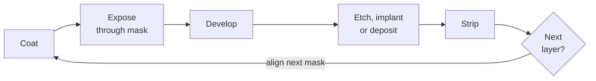

# From stone to silicon

Semiconductor lithography borrowed almost everything from printing: the name, the idea of a
light-sensitive coating that survives where it is exposed (or where it is not), and the
habit of copying a master pattern many times. This page follows that inheritance from a
Munich print shop in the 1790s to the contact and proximity aligners of the 1960s and 1970s.
By then the simplest way to print a circuit had reached its limits.

## Writing on stone

Lithographic printing is credited to **Alois Senefelder** of Munich, who is said to have
invented it around 1796 [1]. It rests on the fact that grease and water do not mix. A design
drawn on porous limestone with a greasy substance holds ink, while the wetted bare stone
repels it, so a flat stone can print an image with no relief at all [2]. German took up the
word *Lithographie* around 1804 and English *lithography* is attested from 1813; both come
from the Greek *lithos*, stone, and *graphein*, to write or draw [1].

Nothing in Senefelder's process involves light. The link to modern lithography came from
early photography.

## Coatings that light makes insoluble

**Nicéphore Niépce** coated a polished pewter plate with bitumen dissolved in oil of lavender
and exposed it in a camera. Bitumen hardens and becomes less soluble where light falls on
it; washing the plate afterwards removed the unexposed coating and left an image of the view
from his window. The Harry Ransom Center, which has held the plate since buying the Gernsheim
Collection in 1963, dates it to 1827 and gives the exposure as several days [3]. Older
accounts give "about 1826" and an eight-hour exposure [4]. Willson, Dammel and Reiser, in their
history of resist materials, argue that Niépce's other bitumen plates make him the inventor
of photolithography as well as of photography. He contact-printed a drawing onto a
bitumen-coated plate, developed it, and etched the bare metal with acid, "a process that is
an exact analogy to the processes used to make semiconductor devices today" [4].

Faster light-sensitive coatings followed, all based on dichromate [4]:

- **1839.** Mungo Ponton showed that paper soaked in dichromate solution is light-sensitive.
- **1840.** Edmond Becquerel made relief images in a starch–dichromate film and is credited
  with coining the word *resist* for it.
- **1852.** William Henry Fox Talbot patented dichromated gelatin for etching images into
  metal and stone (British patent No. 565). It became the workhorse of the printing trade.
- **1855.** Alphonse Poitevin patented the carbon process, based on the same light-hardened
  bichromated gelatin [5].

The basic loop has not changed since. Coat the substrate, expose it through a pattern, and
develop away the soluble parts. Then etch, deposit or implant through the openings, and
strip the rest.



## Photoresist meets the transistor

When Bell Labs began making silicon devices in the 1950s, the team first used dichromated
gelatin. It resolved well but did not resist the hydrofluoric acid used to etch silicon
dioxide. Bell Labs asked Eastman Kodak for help [4]:

- **Louis Minsk** at Kodak developed **poly(vinyl cinnamate)**, a synthetic polymer that
  crosslinks in light and has none of gelatin's slow "dark reaction". It withstood HF, but
  adhesion to oxidized wafers was poor [4].
- **Martin Hepher and Hans Wagner** of Kodak Ltd. in England mixed a cyclized synthetic rubber
  with a light-sensitive bis-azide crosslinker. Kodak sold it as **Kodak Thin Film Resist
  (KTFR)**, the industry's negative-tone workhorse "from 1957 until about 1972", when
  features of about 2 µm reached its resolution limit [4].
- **Positive resists** came from the printing-plate trade. Kalle AG in Wiesbaden had made
  diazonaphthoquinone (DNQ) and novolac printing plates since around 1950; their US outlet,
  Azoplate, sold the chemistry to chipmakers as "AZ Photoresists". Once projection printing
  arrived, DNQ/novolac displaced KTFR at the high end, completely by 1972, because it gave
  higher contrast and did not swell during development [4].

At the same time the silicon process took shape around the oxide:

- **1955.** At Bell Labs, **Carl Frosch and Lincoln Derick** found that a grown silicon-dioxide
  layer masks dopant diffusion [6, 7]. **Jules Andrus and Walter L. Bond** adapted
  photoengraving from the printing industry to etch diffusion "windows" in that oxide [7].
- **1957.** **Jay Lathrop and James Nall** at the US Army's Diamond Ordnance Fuze Laboratories
  filed a patent (granted in 1959) on using a "photosensitive resist" to pattern thin-film metal
  strips about 200 µm wide and holes etched in oxide [7, 8]. Their exposure system was a microscope used in reverse, which
  shrank the pattern onto the substrate. Lathrop later recalled that they named the process
  *photolithography* [9]. He moved to Texas Instruments in 1958.
- **1958–1960.** At Fairchild, Jay Last and Robert Noyce built an early step-and-repeat camera
  to make masks with many identical transistors [7]. **Jean Hoerni's planar process** (patent
  filed May 1959) kept the oxide on the finished device, and Noyce's integrated-circuit patent
  (filed July 1959) built on it [10]. Last's team produced the first working planar integrated
  circuits on 26 May 1960 [11].

Planar integrated circuits made lithography the step that set both yield and density. Every
layer needed a mask, and each mask had to be aligned to the patterns already on the wafer.

## Contact and proximity printing

Throughout the 1960s the pattern was transferred by **shadow printing**: a mask the same size
as the wafer, held against or just above the resist, lit by a mercury lamp. Making the mask
was itself a chain of optical steps, as described in Bruning's history [12, 13]:

1. The layout was cut by hand into Rubylith, a red film on clear plastic, at a large scale.
2. A copy camera reduced it 10–50 times onto a photographic plate.
3. A step-and-repeat photorepeater, usually at 10:1, printed that pattern hundreds of times
   onto a master plate. GCA's David W. Mann division showed the first commercial two-stage
   photorepeater in 1961 [14].
4. The master was too valuable to touch a wafer. Sub-masters and working copies were contact
   printed from it, and each working copy was used **1–25 times** depending on how
   defect-sensitive the circuit was [12].

Soft photographic emulsion masks gave way to **chrome on glass**, which survived cleaning and
reuse [12]. Chipmakers first built their own aligners; Kulicke & Soffa offered the first
commercial contact aligners in 1965, and Kasper Instruments (founded 1968) and Cobilt (bought
by Computervision in 1972) took over the market [14, 15]. In Japan, Canon's first mask
aligner, the PPC-1 of 1970, was in fact a 1:1 projection printer (a g-line lens of NA 0.14
rated for 2–3 µm). Its PLA-300 contact aligner followed in 1973 [12, 14].

<figure markdown="span">
  { width="820" }
  { width="820" }
  <figcaption markdown="span">Three ways to transfer a mask pattern. The profiles are a 1D scalar model in
  arbitrary units, drawn at mask scale. Proximity: Fresnel propagation over the gap, averaged
  over a ±20 % spread of λg as a broadband lamp would give. Projection: a partially coherent,
  band-limited image. Script:
  [make_history_schematics.py](../figures/history/make_history_schematics.py).</figcaption>
</figure>

**Contact printing** gives the sharpest copy of the three, although even in perfect contact
light diffracts slightly just behind each opening [16]. The trouble is physical. Every contact
moves particles from wafer to mask and back and damages both; defects accumulate on the mask
with each use and reduce yield [12, 13].

**Proximity printing** leaves a gap *g* between mask and resist to spare the mask. Light
leaving an opening then diffracts before it reaches the resist. The blur is about one Fresnel
zone,

```math
R \;\approx\; k\sqrt{\lambda g}, \qquad k \approx 1,
```

so resolution improves only as the square root of the wavelength or the gap [12, 16]. With
g-line light (436 nm) and a 20 µm gap, √(λg) is already about 3 µm. Kasper introduced the
first contact aligner with a proximity mode in 1973, but according to Kato its aligners
"were only rarely used in proximity mode, (because it didn't work well)". Canon went on to
dominate proximity aligners with a reliable gap-setting mechanism and an understanding of
Fresnel diffraction [14].

<figure markdown="span">
  { width="820" }
  { width="820" }
  <figcaption markdown="span">The proximity trade-off, R ≈ √(λg). Sub-micrometre shadow printing at a
  workable gap needs a wavelength near 1 nm. That is the reasoning behind
  [proximity X-ray lithography](parallel-paths.md#proximity-x-ray-lithography), and why LIGA can print through
  hundreds of micrometres of resist. The lines are the formula, not data; the marked points
  are one sourced X-ray example [17] and the simulator's LIGA preset.</figcaption>
</figure>

Bruning's 1997 review states the consequence: to reach below 1 µm at reasonable gaps,
shadow printing needs wavelengths near 1 nm, "the realm of x-ray lithography" [12]. Optical
lithography went the other way instead and put a lens between mask and wafer, which is the
subject of [the projection era](projection-era.md).

!!! info "The same physics inside highuvlith"
    highuvlith's [LIGA deep-X-ray model](../processes/liga-deep-xray.md) (🔶 Simplified) is a
    shadow printer. A synchrotron white beam passes a gold-on-titanium mask and a proximity gap
    before entering hundreds of micrometres of PMMA. For every energy bin it propagates the
    transmitted field across the gap and into the resist with scalar Fresnel
    (angular-spectrum) diffraction; a Gaussian blur of width σ = ½√(λg), the
    first-Fresnel-zone penumbra, remains as a faster option. Photoelectron transport and beam
    divergence are not modeled. Optical contact and proximity aligners are not modeled as
    such: the main pipeline is a projection imager.

<figure markdown="span">


<figcaption>LIGA proximity diffraction. (a) Monochromatic 8 keV straight edge, 100 µm gap: the default Fresnel (angular-spectrum) model gives the knife-edge pattern — 0.25 at the geometric edge, a 1.37 maximum and ringing — while the legacy <code>gaussian</code> option smooths the step with σ = ½√(λg). Both curves are simulator output. (b) Polychromatic bending-magnet beam (no filter): absorbed dose across the edge at five depths and the developed edge at a 2.5 kJ/cm³ threshold. Model: LIGA proximity diffraction ✅/🔶 (thin-screen absorber; no photo-/secondary-electron transport).</figcaption>
</figure>

## Try it

!!! example "Try it in highuvlith: shadow printing with hard X-rays"
    The LIGA preset uses a bending magnet with a 6.23 keV critical energy, 500 µm of PMMA and
    a 100 µm gap. The simulator reports the dose-weighted Fresnel scale √(λg): a few hundred
    nanometres for its X-rays, against about 3 µm for g-line light across a 20 µm gap.
    Unfiltered, the soft part of the beam overdoses the top of the resist; the LIGA example on
    [parallel paths](parallel-paths.md#try-it) shows the cure.

    <!-- verify-example -->
    ```python
    import highuvlith as huv

    # Deep X-ray shadow printing: 500 um PMMA, 5 um lines on a 10 um pitch, 100 um gap.
    result = huv.simulate_liga(critical_energy_kev=6.23, resist_thickness_um=500.0,
                               grid_size=128, pixel_nm=78.125, nz=32)  # 10 um field
    top, bottom = result.fresnel_scale_nm  # dose-weighted sqrt(lambda * g), nm
    print(f"X-rays, 100 um gap: sqrt(lambda g) = {top:.0f} nm (top), {bottom:.0f} nm (bottom)")
    print(f"g-line light, 20 um gap: sqrt(lambda g) = {(436.0 * 20e3) ** 0.5:.0f} nm")
    print(f"top/bottom dose ratio {result.dose_ratio:.1f}, "
          f"damage ceiling exceeded: {result.exceeds_damage_ceiling}")
    ```

    ??? success "Output"

        ```text
        X-rays, 100 um gap: sqrt(lambda g) = 227 nm (top), 331 nm (bottom)
        g-line light, 20 um gap: sqrt(lambda g) = 2953 nm
        top/bottom dose ratio 20.8, damage ceiling exceeded: True
        ```

## Key takeaways

- Lithography is named after a printing process, and semiconductor photolithography came
  straight from photoengraving: coat, expose through a mask, develop, etch.
- Resists moved from bitumen and dichromated gelatin to synthetic polymers: Kodak's KTFR from
  1957, then DNQ/novolac positive resists, which had displaced KTFR at the leading edge by 1972.
- Contact printing was sharp but destroyed masks: working copies lasted 1 to 25 exposures.
  Proximity printing saved the mask but blurred edges by about √(λg).
- Below about 1 µm, shadow printing needs X-rays. Optical lithography took the projection
  route instead.

## References and further reading

1. Online Etymology Dictionary, ["lithography"](https://www.etymonline.com/word/lithography).
2. A. Kato, "Chronology of Lithography Milestones," v0.9 (2007), section "History of
   lithography as an art form" (quoting *Encyclopaedia Britannica*),
   [lithoguru.com](https://www.lithoguru.com/scientist/litho_history/Kato_Litho_History.pdf).
3. Harry Ransom Center, University of Texas at Austin,
   ["The Niépce Heliograph"](https://www.hrc.utexas.edu/niepce-heliograph/).
4. C. G. Willson, R. A. Dammel, A. Reiser, "Photoresist materials: a historical perspective,"
   *Proc. SPIE* **3051**, 28–41 (1997),
   [author copy](http://www.lithoguru.com/scientist/litho_history/Photoresist_materials_historical_perspective_Willson_1997.pdf).
5. The Historic New Orleans Collection, ["Carbon process"](https://hnoc.org/virtual-exhibitions/from_daguerreotype_to_digital/carbon-process).
6. C. J. Frosch, L. Derick, "Surface protection and selective masking during diffusion in
   silicon," *J. Electrochem. Soc.* **104**, 547–552 (1957),
   [doi:10.1149/1.2428650](https://doi.org/10.1149/1.2428650).
7. Computer History Museum, *The Silicon Engine*,
   ["1955: Photolithography techniques are used to make silicon devices"](https://www.computerhistory.org/siliconengine/photolithography-techniques-are-used-to-make-silicon-devices/)
   and ["1955: Development of oxide masking"](https://www.computerhistory.org/siliconengine/development-of-oxide-masking/).
8. J. W. Lathrop, J. R. Nall, "Semiconductor construction," US patent 2,890,395 (filed 1957,
   granted 1959), [Google Patents](https://patents.google.com/patent/US2890395A/en).
9. Engineering and Technology History Wiki, ["Oral-History: Jay Lathrop"](https://ethw.org/Oral-History:Jay_Lathrop).
10. Computer History Museum, ["1959: Invention of the planar manufacturing process"](https://www.computerhistory.org/siliconengine/invention-of-the-planar-manufacturing-process/)
    and ["1959: Practical monolithic integrated circuit concept patented"](https://www.computerhistory.org/siliconengine/practical-monolithic-integrated-circuit-concept-patented/).
11. Computer History Museum, ["1960: First planar integrated circuit is fabricated"](https://www.computerhistory.org/siliconengine/first-planar-integrated-circuit-is-fabricated/).
12. J. H. Bruning, "Optical lithography: thirty years and three orders of magnitude," *Proc.
    SPIE* **3051**, 14–27 (1997),
    [author copy](http://www.lithoguru.com/scientist/litho_history/Optical_lithography_thirty_years_and_three_orders_of_magnitude_Bruning_1997.pdf).
13. J. H. Bruning, "Optical lithography … 40 years and holding," *Proc. SPIE* **6520**, 652004
    (2007), [doi:10.1117/12.720631](https://doi.org/10.1117/12.720631).
14. A. Kato, "Chronology of Lithography Milestones," v0.9 (May 2007),
    [lithoguru.com](https://www.lithoguru.com/scientist/litho_history/Kato_Litho_History.pdf).
15. C. A. Mack, "Milestones in Optical Lithography Tool Suppliers" (2005),
    [lithoguru.com](https://lithoguru.com/scientist/litho_history/milestones_tools.pdf).
16. MicroChemicals GmbH, ["Exposure of photoresists"](https://www.microchemicals.com/technical_information/exposure_photoresist.pdf)
    (section "Wavelength and mask distance as the lower resolution limit").
17. H. I. Smith, M. L. Schattenburg, "X-ray lithography from 500 to 30 nm: X-ray nanolithography,"
    *IBM J. Res. Dev.* **37**, 319–329 (1993), [doi:10.1147/rd.373.0319](https://doi.org/10.1147/rd.373.0319).
