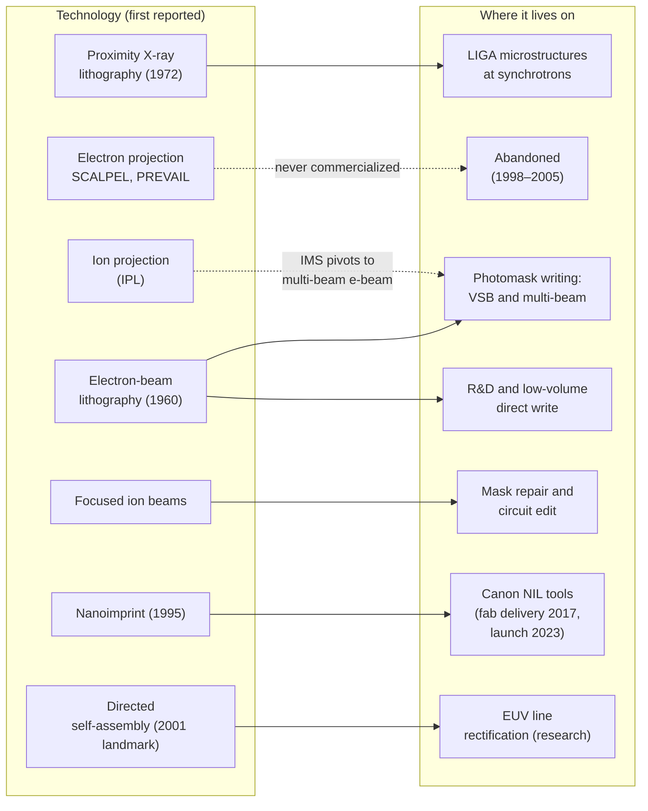

# Parallel paths

For fifty years, lithographers expected optical projection to hit a wall that some other
technology would then get past. Each "next-generation lithography" had a real physical
advantage: shorter wavelengths, no diffraction limit, or no lens at all. Each also ran into
the same problem, which Bruning describes as optics' unmatched pixel rate. A 45 nm immersion
scanner exposing 300 mm wafers at 100 per hour writes roughly 10¹⁵ pixels per second [1]. None
of the alternatives displaced optical projection for high-volume chips, but almost all of them
found places where they are still essential.



## Proximity X-ray lithography

The [proximity-printing trade-off](origins.md#contact-and-proximity-printing), a blur of about
√(λg), has an obvious fix: make λ tiny. In 1972 D. L. Spears and H. I. Smith at MIT Lincoln
Laboratory reported "high-resolution pattern replication using soft X rays" [2]. Proximity X-ray
lithography (XRL) used wavelengths of about 0.8–1.5 nm and a gap of tens of micrometres, shrinking
with feature size, between a thin membrane mask and the wafer. Smith and Schattenburg wrote in 1993 that
100 nm features could be printed at gaps of 10–15 µm, and that X-rays offered "absorption without
scattering" [3].

The effort was large. IBM began its synchrotron X-ray programme in 1980 and in 1991 installed
**Helios**, a compact superconducting storage ring built by Oxford Instruments, at its Advanced
Lithography Facility in East Fishkill [4]. In Japan, SORTEC, set up by MITI in 1986 as a
collaboration of thirteen companies, developed its own synchrotron sources and beamlines, and NTT
built a superconducting storage ring, SUPER-ALIS [5].

The weak point was the **mask**. A proximity X-ray mask is a 1:1 copy of the circuit: a
micrometre-thin membrane carrying a heavy-metal absorber pattern, with no reduction to relax
its tolerances. Smith and Schattenburg named "elimination of distortion at the pattern
generation stage" as "the problem of greatest concern" [3]. In December 1998 a SEMATECH
workshop recommended narrowing its 1999 next-generation-lithography funding to EUV and SCALPEL
electron projection, while adding that X-ray and ion-projection work need not stop [6].
Proximity XRL never entered mainstream manufacturing; Cerrina's review describes the state of the
art around 2000 [40]. In 1993 Smith and Schattenburg had doubted that projection XRL with
multilayer mirrors at 13 nm could ever match proximity XRL [3]. That projection approach became
[EUV](euv.md).

## LIGA: deep X-rays for tall microstructures

X-ray shadow printing did find a lasting home, at much harder X-rays and much larger scales.
At the Kernforschungszentrum Karlsruhe, E. W. Becker, W. Ehrfeld and colleagues combined
synchrotron X-ray lithography with electroplating to make separation nozzles for uranium
enrichment. They published the approach in 1982 [7] and gave the full LIGA process
(*Lithographie, Galvanoformung, Abformung*: lithography, electroforming, moulding) in 1986 [8].
Multi-keV photons pass through hundreds of micrometres of PMMA with almost no diffraction or
scattering, so sidewalls stay nearly vertical at aspect ratios above 100:1. The Karlsruhe
Institute of Technology, successor to the Kernforschungszentrum, still runs three LIGA beamlines
at its KARA synchrotron, covering 2.2–20 keV for mask making, deep and ultra-deep X-ray
lithography [9].

!!! info "LIGA in highuvlith"
    Deep-X-ray lithography is modeled directly (see
    [LIGA deep X-ray](../processes/liga-deep-xray.md), 🔶 Simplified overall: the depth dose and
    exposure time are ✅, the proximity diffraction ✅/🔶). A bending-magnet white beam, computed
    with the same flux function as the [synchrotron source](../sources/synchrotron.md), passes
    filters, a membrane and a partly transparent gold absorber. For every energy bin, scalar
    Fresnel (angular-spectrum) propagation carries the transmitted field across the gap and
    down through the PMMA. The model yields the spectral depth dose, the top-to-bottom dose
    ratio, a damage-ceiling check, the exposure time for an absolute beam, and the developed
    depth. It does not model photoelectron transport, beam divergence, beamline mirrors, or the
    electroforming and moulding steps.

<figure markdown="span">


<figcaption>The page's LIGA example as depth-dose curves: bending-magnet spectra of critical energy 3, 6.23 and 10 keV (and 6.23 keV through a 20 µm Al filter) on 500 µm PMMA behind the default 20 µm Au / 2 µm Ti mask, each scaled so the bottom receives the 3 kJ/cm³ clearing dose. Model: LIGA depth dose ✅ (NIST μ / μ<sub>en</sub>, collimated beam, no beamline mirrors).</figcaption>
</figure>

## Electron beams

An electron beam has a wavelength of a few picometres, so it is not diffraction-limited in any
practical sense. It writes serially, one spot or shape at a time, instead of printing a whole
field at once.

- **Beginnings.** In 1960 Gottfried Möllenstedt and R. Speidel in Tübingen described an
  electron-optical "micro-writer" for storing information in very small areas [10]. In 1968
  Haller, Hatzakis and Srinivasan at IBM introduced **PMMA** as a high-resolution positive
  electron-beam resist [11]; it is still standard.
- **Mask writing.** Bell Labs built **EBES**, "a practical electron lithographic system", in the
  1970s [12]. According to Bruning, three generations were licensed and commercialized in the
  early 1980s, and 1:1 masks came to be written by electron beam at final size [1]. IBM's
  variable-shaped-beam approach (Pfeiffer, 1978) exposes
  a whole rectangle per flash [13]; IBM also used its EL-3 shaped-beam system for direct writing
  in manufacturing [14]. Variable-shaped-beam writers became the standard for advanced masks.
- **Projection e-beam.** Bell Labs' SCALPEL (1990) and IBM and Nikon's PREVAIL (1999) tried to
  project electrons through a mask like a scanner [15, 16]. ASML and Applied Materials formed a
  joint venture, eLITH, to commercialize SCALPEL in 1999 and closed it by the end of 2000
  [17]; the dissolution was reported in January 2001, after ASML withdrew because key customers
  preferred EUV [44]. Nikon announced in October 2005 that it would not commercialize electron
  projection lithography [17].
- **Multi-beam direct write.** Mapper Lithography in Delft developed maskless tools that wrote
  with many parallel electron beams [18]. It went bankrupt on 28 December 2018 with about 270
  staff [19].
- **Multi-beam mask writers.** IMS Nanofabrication in Vienna built the first commercial one
  (alpha tool 2014, production MBMW-101 from 2016), writing with 512 × 512 = 262,144 beamlets at
  50 keV [20, 21, 22]. Intel first invested in IMS in 2009 [20]. Multi-beam writing is what made
  curvilinear masks practical. An IMS executive put it bluntly in 2018: "It's a must for EUV"
  [23].

!!! note "Laser writers too"
    Not every mask is written with electrons. Laser-scanning pattern generators, such as Applied
    Materials' ALTA series [24], write many of the less critical layers.

## Ion beams

Ions scatter less than electrons in resist and can be focused tightly. **Ion projection
lithography** was developed in Europe through the 1990s. IMS in Vienna built an IPL prototype that
resolved below 50 nm by 2001, before the industry settled on EUV, and then turned its
beam-array technology into the multi-beam mask writer [20, 25]. **Focused ion beams** (FIB)
found their niche early. Already in 1987 Melngailis listed mask repair as an immediate
application, together with ion-induced deposition for rewiring circuits [26]. FIB repair and
circuit edit remain standard. Helium-ion microscopes (introduced in 2006) have since written
lines below 10 nm in research [27, 28].

## Nanoimprint

Nanoimprint lithography replaces optics with a mould. In 1995 Stephen Chou, Peter Krauss and
Preston Renstrom pressed a patterned mould into a heated polymer and made vias and trenches
smaller than 25 nm [29, 30]. At the University of Texas, Grant Willson's group
introduced **step-and-flash imprint lithography** in 1999: a transparent template is pressed into a
liquid resist that is then cured with UV light [31]. Canon had been developing nanoimprint tools
with the Austin company Molecular Imprints and a major chipmaker since 2009, and agreed to acquire
Molecular Imprints in February 2014 [32].

Canon delivered an FPA-1200NZ2C to Toshiba Memory's Yokkaichi fab in July 2017, as "significant
progress toward semiconductor device mass production" [45]. In 2018 Semiconductor Engineering reported
that Toshiba had decided not to move planar NAND production to imprint and would apply it to
3D NAND first [46]; a 2019 article by the same publication says instead that Toshiba "has used
Canon's NIL system for the production of planar NAND" [47]. Volume production with imprint is
not confirmed by Canon or Toshiba/Kioxia. Canon announced the
general launch of the **FPA-1200NZ2C** in October 2023. It presses a mask carrying the circuit
pattern into the resist "like a stamp", reaching a minimum linewidth of 14 nm, and Canon claims
lower power use and possibly lower cost of ownership than projection tools [33]. In September
2024 Canon delivered one to the Texas Institute for Electronics [34]. Sreenivasan's 2017 review
describes how imprint steppers were engineered for semiconductor volume production [35].

## Directed self-assembly

Block copolymers, two polymers chemically joined end to end, separate into regular domains with
periods of a few tens of nanometres. **Directed self-assembly** (DSA) uses a coarse
lithographic guide to line those domains up: topography in **grapho-epitaxy** (Segalman,
Yokoyama and Kramer, 2001) [36], or a chemical surface pattern in **chemo-epitaxy** (Kim, Nealey
and co-workers, 2003) [37]. In 2018 researchers from IBM and its partners reported DSA patterning
for 7 nm FinFET technology [38]. Defect control never reached manufacturing levels, and the
method was largely shelved for pitch multiplication [39]. By 2023 it was returning in a new
role: smoothing and "rectifying" EUV patterns, whose stochastic defects, according to the same
report, now make up more than half of the total error budget [39].

!!! info "DSA in highuvlith"
    The DSA research module is 🔶 Simplified. It renders analytic morphologies (lamellae,
    cylinders, spheres), registers lamellae to graphoepitaxy trench walls with a
    strong-segregation commensurability penalty, and reports a heuristic defect index. It does
    not solve self-consistent-field theory. See [research modules](../research-modules.md).

## Interference lithography

Two coherent beams crossing at a half-angle θ make fringes with period λ/(2 sin θ), with no mask
and no lens. Interference lithography is a standard way to write large, precise gratings; at MIT,
for example, achromatic interference lithography produced 100 nm-period gratings and grids over
large areas [41].

A grating mask can also print a copy of itself without a lens. In 1836 William Henry Fox Talbot,
who appears in [the origins](origins.md) for his photoengraving work, observed that the light
behind a grating repeats the grating's image at regular distances [42]. Each of these Talbot
self-images has a very shallow depth of field. In 2011 H. H. Solak, C. Dais and F. Clube showed
that integrating the transmitted field over one Talbot period of mask-to-wafer distance gives an
image that does not depend on the gap. They called the method displacement Talbot lithography
and used it to print linear gratings and hexagonal arrays of holes [43].

!!! info "Interference in highuvlith"
    Multi-beam interference lithography (two-beam gratings, three-beam hexagonal and four-beam
    lattices) and two-photon exposure are ✅/🔶: the vector-sum field is exact, while absorption
    is per-beam scalar. See
    [interference and volumetric exposure](../processes/interference-volumetric.md). The Talbot
    carpet, displacement and achromatic Talbot lithography, and two-grating EUV interference
    are 🔶 Simplified: scalar thin-mask gratings under coherent normal illumination. See
    [Talbot and EUV interference lithography](../processes/talbot.md).

<figure markdown="span">


<figcaption>Lensless patterning at 193 nm. (a) The page's two-beam example (30° half-angle in air, resist n = 1.7): fringe period λ/(2 sin θ) = 193 nm, shown as the Dill photoactive compound (PAC) through depth; at the example's default dose the PAC only falls from 1.00 to 0.92 (colour scale stretched). (b) Self-imaging behind a 1 µm binary amplitude grating, exact angular-spectrum propagation; (c) averaging over a scanned gap (DTL) gives a stationary image at half the period. Models: multi-beam interference ✅/🔶 (per-beam scalar absorption, no substrate reflection); Talbot/DTL 🔶 (scalar thin mask, coherent normal illumination).</figcaption>
</figure>

## Where each path survived

Where these alternatives may go next, from nanoimprint and DSA to multi-beam writing, is the
subject of [alternatives to projection lithography](../future/alternative-patterning.md) in the
future section; [beyond EUV](../future/beyond-euv.md) returns to X-ray proximity printing.

| Path | Proposed as successor for | What stopped it | Where it lives on |
|---|---|---|---|
| Proximity X-ray (≈ 1 nm) | sub-100 nm chips (1980s–1990s) | 1:1 membrane masks, synchrotron sources | LIGA and deep X-ray microfabrication [9] |
| Electron projection (SCALPEL, PREVAIL) | 100 nm and below (1990s–2000s) | throughput; never commercialized [17] | — |
| Electron-beam writing | always a candidate for maskless patterning | serial writing is too slow for wafers | photomask writing (VSB, multi-beam) [22, 23]; R&D and prototyping |
| Ion projection | sub-100 nm (1990s) | industry moved to EUV [20] | IMS's multi-beam writers; FIB repair and circuit edit [26] |
| Nanoimprint | sub-20 nm patterning, with Canon from 2014 [32] | not displaced; a tool at a NAND fab since 2017, general launch in 2023; volume production not confirmed | Canon FPA-1200NZ2C [33, 34, 45] |
| Directed self-assembly | pitch multiplication | defectivity [39] | EUV line rectification (research) [39] |

## Try it

!!! example "Try it in highuvlith: harder X-rays, more uniform LIGA exposure"
    Soft photons are absorbed near the top of thick PMMA, so the top receives far more dose
    than the bottom. The bottom must reach the clearing dose (3 kJ/cm³ here) while the top
    stays below the damage ceiling (20 kJ/cm³), so the top-to-bottom ratio must stay below
    about 6.7. A harder white beam (a higher critical energy) helps a little. An upstream
    filter that absorbs the soft photons helps much more.

    <!-- verify-example -->
    ```python
    import highuvlith as huv

    # (bending-magnet critical energy in keV, upstream filters as (material, thickness in um))
    cases = [(3.0, None), (6.23, None), (10.0, None), (6.23, [("Al", 20.0)])]
    for e_c, filters in cases:
        result = huv.simulate_liga(critical_energy_kev=e_c, resist_thickness_um=500.0,
                                   filters=filters, grid_size=128, pixel_nm=78.125, nz=32)
        print(f"E_c {e_c:5.2f} keV, filters {filters}: top/bottom dose ratio "
              f"{result.dose_ratio:5.2f}, damage ceiling exceeded: {result.exceeds_damage_ceiling}")
    ```

    ??? success "Output"

        ```text
        E_c  3.00 keV, filters None: top/bottom dose ratio 46.57, damage ceiling exceeded: True
        E_c  6.23 keV, filters None: top/bottom dose ratio 20.79, damage ceiling exceeded: True
        E_c 10.00 keV, filters None: top/bottom dose ratio 15.37, damage ceiling exceeded: True
        E_c  6.23 keV, filters [('Al', 20.0)]: top/bottom dose ratio  2.86, damage ceiling exceeded: False
        ```

!!! example "Try it in highuvlith: a 193 nm-period interference grating"
    Two beams at a 30° half-angle in air give a fringe period of λ/(2 sin θ) = 193 nm for 193 nm
    light, whatever the resist index.

    <!-- verify-example -->
    ```python
    import math
    import highuvlith as huv

    wavelength, half_angle = 193.0, 30.0
    result = huv.simulate_interference("two_beam", wavelength_nm=wavelength, n_medium=1.7,
                                       half_angle_deg=half_angle, nx=128, ny=4, nz=8,
                                       x_span_nm=772.0, y_span_nm=100.0, z_span_nm=100.0)
    period = wavelength / (2 * math.sin(math.radians(half_angle)))
    pac = result.values[0, 0, :]  # top slice, one row across the grating
    print(f"fringe period {period:.0f} nm; PAC ranges from {pac.min():.2f} to {pac.max():.2f}")
    ```

    ??? success "Output"

        ```text
        fringe period 193 nm; PAC ranges from 0.92 to 1.00
        ```

## Key takeaways

- Every alternative to optical projection had a real advantage, but none matched its throughput,
  roughly 10¹⁵ pixels per second.
- Proximity X-ray lithography failed on the 1:1 mask. Deep X-rays live on in LIGA.
- Electron beams write the masks that optical and EUV scanners print. Multi-beam writers made
  curvilinear and EUV masks practical.
- Ion projection faded, but its beam-array know-how became the multi-beam mask writer, and
  focused ion beams repair masks and edit circuits.
- A nanoimprint tool has been at a memory fab since 2017, and Canon's went on general sale in
  2023; volume production is not confirmed. DSA was shelved for pitch multiplication and is
  returning as an aid to EUV.

## References and further reading

1. J. H. Bruning, "Optical lithography … 40 years and holding," *Proc. SPIE* **6520**, 652004
   (2007), [doi:10.1117/12.720631](https://doi.org/10.1117/12.720631).
2. D. L. Spears, H. I. Smith, "High-resolution pattern replication using soft X rays," *Electron.
   Lett.* **8**, 102–104 (1972), [doi:10.1049/el:19720074](https://doi.org/10.1049/el:19720074).
3. H. I. Smith, M. L. Schattenburg, "X-ray lithography from 500 to 30 nm: X-ray nanolithography,"
   *IBM J. Res. Dev.* **37**, 319–329 (1993), [doi:10.1147/rd.373.0319](https://doi.org/10.1147/rd.373.0319).
4. A. D. Wilson, "X-ray lithography in IBM, 1980–1992, the development years," *IBM J. Res. Dev.*
   **37**, 299–318 (1993), [doi:10.1147/rd.373.0299](https://doi.org/10.1147/rd.373.0299).
5. J. B. Murphy, "X-ray lithography sources: a review," *Proc. 1989 IEEE Particle Accelerator
   Conference*, [JACoW PDF](https://proceedings.jacow.org/p89/PDF/PAC1989_0757.PDF).
6. Photonics Online, ["Field narrows for next-generation lithography"](https://www.photonicsonline.com/doc/field-narrows-for-next-generation-lithography-0001)
   (22 December 1998).
7. E. W. Becker, W. Ehrfeld, D. Münchmeyer, H. Betz, A. Heuberger et al., "Production of
   separation-nozzle systems for uranium enrichment by a combination of X-ray lithography and
   galvanoplastics," *Naturwissenschaften* **69**, 520–523 (1982),
   [doi:10.1007/BF00463495](https://doi.org/10.1007/BF00463495).
8. E. W. Becker, W. Ehrfeld, P. Hagmann, A. Maner, D. Münchmeyer, "Fabrication of microstructures
   with high aspect ratios and great structural heights by synchrotron radiation lithography,
   galvanoforming, and plastic moulding (LIGA process)," *Microelectron. Eng.* **4**, 35–56 (1986),
   [doi:10.1016/0167-9317(86)90004-3](https://doi.org/10.1016/0167-9317(86)90004-3).
9. Karlsruhe Institute of Technology, Institute of Microstructure Technology,
   [LIGA beamlines at KARA](https://www.imt.kit.edu/2330.php).
10. G. Möllenstedt, R. Speidel, "Elektronenoptischer Mikroschreiber unter elektronenmikroskopischer
    Arbeitskontrolle," *Phys. Blätter* **16**, 192–198 (1960),
    [doi:10.1002/phbl.19600160412](https://doi.org/10.1002/phbl.19600160412).
11. I. Haller, M. Hatzakis, R. Srinivasan, "High-resolution positive resists for electron-beam
    exposure," *IBM J. Res. Dev.* **12**, 251–256 (1968),
    [doi:10.1147/rd.123.0251](https://doi.org/10.1147/rd.123.0251).
12. D. R. Herriott, R. J. Collier, D. S. Alles, J. W. Stafford, "EBES: a practical electron
    lithographic system," *IEEE Trans. Electron Devices* **22**, 385–392 (1975),
    [doi:10.1109/T-ED.1975.18149](https://doi.org/10.1109/T-ED.1975.18149).
13. H. C. Pfeiffer, "Variable spot shaping for electron-beam lithography," *J. Vac. Sci. Technol.*
    **15**, 887–890 (1978), [doi:10.1116/1.569621](https://doi.org/10.1116/1.569621).
14. D. E. Davis et al., "EL-3 application to 0.5 µm semiconductor lithography," *J. Vac. Sci.
    Technol. B* **1**, 1003–1006 (1983), [doi:10.1116/1.582662](https://doi.org/10.1116/1.582662).
15. S. D. Berger, J. M. Gibson, "New approach to projection-electron lithography with demonstrated
    0.1 µm linewidth," *Appl. Phys. Lett.* **57**, 153–155 (1990),
    [doi:10.1063/1.103969](https://doi.org/10.1063/1.103969).
16. H. C. Pfeiffer et al., "Projection reduction exposure with variable axis immersion lenses: next
    generation lithography," *J. Vac. Sci. Technol. B* **17**, 2840–2846 (1999),
    [doi:10.1116/1.591080](https://doi.org/10.1116/1.591080).
17. C. A. Mack, "Milestones in Optical Lithography Tool Suppliers" (2005),
    [lithoguru.com](https://lithoguru.com/scientist/litho_history/milestones_tools.pdf).
18. B. J. Kampherbeek, M. J. Wieland, A. van Zuuk, P. Kruit, "An experimental setup to test the
    MAPPER electron lithography concept," *Microelectron. Eng.* **53**, 279–282 (2000),
    [doi:10.1016/S0167-9317(00)00314-2](https://doi.org/10.1016/S0167-9317(00)00314-2).
19. NOS, ["Delftse chipmachinemaker Mapper failliet"](https://nos.nl/artikel/2265346-delftse-chipmachinemaker-mapper-failliet.html)
    (28 December 2018, in Dutch).
20. IMS Nanofabrication, [company history](https://www.ims.co.at/en/company/history/).
21. IMS Nanofabrication, [products](https://www.ims.co.at/en/products/).
22. C. Klein, E. Platzgummer, "MBMW-101: World's 1st high-throughput multi-beam mask writer,"
    *Proc. SPIE* **9985**, 998505 (2016), [doi:10.1117/12.2243638](https://doi.org/10.1117/12.2243638).
23. Semiconductor Engineering, ["Multi-beam mask writing finally comes of age"](https://semiengineering.com/multi-beam-mask-writing-finally-comes-of-age/)
    (15 November 2018).
24. P. C. Allen, "Laser scanning for semiconductor mask pattern generation," *Proc. IEEE* **90**,
    1653–1669 (2002), [doi:10.1109/JPROC.2002.803664](https://doi.org/10.1109/JPROC.2002.803664).
25. G. Gross, R. Kaesmaier, H. Löschner, G. Stengl, "Ion projection lithography: status of the
    MEDEA project and United States/European cooperation," *J. Vac. Sci. Technol. B* **16**,
    3150–3153 (1998), [doi:10.1116/1.590454](https://doi.org/10.1116/1.590454).
26. J. Melngailis, "Focused ion beam technology and applications," *J. Vac. Sci. Technol. B* **5**,
    469–495 (1987), [doi:10.1116/1.583937](https://doi.org/10.1116/1.583937).
27. B. W. Ward, J. A. Notte, N. P. Economou, "Helium ion microscope: a new tool for nanoscale
    microscopy and metrology," *J. Vac. Sci. Technol. B* **24**, 2871–2874 (2006),
    [doi:10.1116/1.2357967](https://doi.org/10.1116/1.2357967).
28. V. Sidorkin et al., "Sub-10-nm nanolithography with a scanning helium beam," *J. Vac. Sci.
    Technol. B* **27**, L18–L20 (2009), [doi:10.1116/1.3182742](https://doi.org/10.1116/1.3182742).
29. S. Y. Chou, P. R. Krauss, P. J. Renstrom, "Imprint of sub-25 nm vias and trenches in polymers,"
    *Appl. Phys. Lett.* **67**, 3114–3116 (1995), [doi:10.1063/1.114851](https://doi.org/10.1063/1.114851).
30. S. Y. Chou, P. R. Krauss, P. J. Renstrom, "Imprint lithography with 25-nanometer resolution,"
    *Science* **272**, 85–87 (1996), [doi:10.1126/science.272.5258.85](https://doi.org/10.1126/science.272.5258.85).
31. M. Colburn et al., "Step and flash imprint lithography: a new approach to high-resolution
    patterning," *Proc. SPIE* **3676**, 379 (1999), [doi:10.1117/12.351155](https://doi.org/10.1117/12.351155).
32. Canon, ["Canon to acquire Molecular Imprints"](https://global.canon/en/news/2014/feb14e.html) (14 February 2014).
33. Canon, [FPA-1200NZ2C nanoimprint lithography system release](https://global.canon/en/news/2023/20231013.html) (13 October 2023).
34. Canon, [delivery of the FPA-1200NZ2C to the Texas Institute for Electronics](https://global.canon/en/news/2024/20240926.html) (26 September 2024).
35. S. V. Sreenivasan, "Nanoimprint lithography steppers for volume fabrication of leading-edge
    semiconductor integrated circuits," *Microsyst. Nanoeng.* **3**, 17075 (2017),
    [doi:10.1038/micronano.2017.75](https://doi.org/10.1038/micronano.2017.75).
36. R. A. Segalman, H. Yokoyama, E. J. Kramer, "Graphoepitaxy of spherical domain block copolymer
    films," *Adv. Mater.* **13**, 1152–1155 (2001),
    [doi:10.1002/1521-4095(200108)13:15<1152::AID-ADMA1152>3.0.CO;2-5](https://doi.org/10.1002/1521-4095%28200108%2913%3A15%3C1152%3A%3AAID-ADMA1152%3E3.0.CO%3B2-5).
37. S. O. Kim et al., "Epitaxial self-assembly of block copolymers on lithographically defined
    nanopatterned substrates," *Nature* **424**, 411–414 (2003),
    [doi:10.1038/nature01775](https://doi.org/10.1038/nature01775).
38. C.-C. Liu et al., "Directed self-assembly of block copolymers for 7 nanometre FinFET technology
    and beyond," *Nature Electronics* **1**, 562–569 (2018),
    [doi:10.1038/s41928-018-0147-4](https://doi.org/10.1038/s41928-018-0147-4).
39. Semiconductor Engineering, ["Directed self-assembly gets another look"](https://semiengineering.com/directed-self-assembly-gets-another-look/)
    (17 August 2023).
40. F. Cerrina, "X-ray imaging: applications to patterning and lithography," *J. Phys. D* **33**,
    R103–R116 (2000), [doi:10.1088/0022-3727/33/12/201](https://doi.org/10.1088/0022-3727/33/12/201).
41. T. A. Savas, M. L. Schattenburg, J. M. Carter, H. I. Smith, "Large-area achromatic
    interferometric lithography for 100 nm period gratings and grids," *J. Vac. Sci. Technol. B*
    **14**, 4167–4170 (1996), [doi:10.1116/1.588613](https://doi.org/10.1116/1.588613).
42. H. F. Talbot, "Facts relating to optical science. No. IV," *Philos. Mag.* **9**, 401–407
    (1836), [doi:10.1080/14786443608649032](https://doi.org/10.1080/14786443608649032).
43. H. H. Solak, C. Dais, F. Clube, "Displacement Talbot lithography: a new method for
    high-resolution patterning of large areas," *Opt. Express* **19**, 10686 (2011),
    [doi:10.1364/OE.19.010686](https://doi.org/10.1364/OE.19.010686).
44. EE Times, ["EUV gains as ASML/Applied venture ends e-beam lithography work"](https://www.eetimes.com/euv-gains-as-asml-applied-venture-ends-e-beam-lithography-work/)
    (5 January 2001).
45. Canon, ["Canon provides nanoimprint lithography manufacturing equipment to Toshiba Memory's Yokkaichi Operations plant"](https://global.canon/en/news/2017/20170720.html)
    (20 July 2017).
46. M. LaPedus, ["What Happened To Nanoimprint Litho?"](https://semiengineering.com/what-happened-to-nanoimprint-litho/),
    *Semiconductor Engineering* (29 March 2018).
47. M. LaPedus, ["Lots Of Lithography Options For Next-Gen Devices"](https://semiengineering.com/lots-of-lithography-options-for-next-gen-devices/),
    *Semiconductor Engineering* (18 April 2019).
