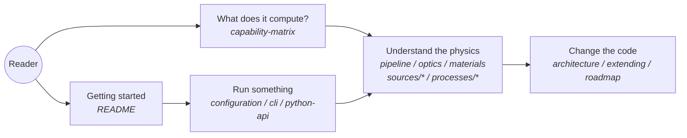

# highuvlith Documentation

**Status:** ✅ Implemented — this page is the documentation home; every linked page carries its own status badge per the taxonomy defined in the [capability matrix](./capability-matrix.md).

highuvlith simulates optical lithography from VUV (120–160 nm) through EUV (13.5 nm) to soft and hard X-ray, with a Rust physics core behind Python, CLI, GUI, and Jupyter frontends. The documentation follows one rule everywhere: **honesty is the product** — pages state what the code computes, what it approximates, and what it merely stores or plans, with the capability matrix as the single source of truth.

## Getting started

- [README](../README.md) — installation (`pip install highuvlith` or `maturin develop`), quick-start snippets for Python/CLI/GUI, and the project overview.

## Core

- [Architecture](./architecture.md) — workspace crates, layering, data flow, project tree, and the three extension traits.
- [Simulation pipeline](./pipeline.md) — Source → Optics → Mask → Hopkins TCC/SOCS aerial image → thin film → resist → metrics, stage by stage with the scalar-diffraction caveats.
- [Optical systems](./optics.md) — the `OpticalSystem` trait and its three implementations: refractive CaF₂, Fresnel zone plate, Schwarzschild objective.
- [Materials database](./materials.md) — Sellmeier fits, VUV tabulated n,k, X-ray attenuation, and the honesty warning on the approximate EUV/BEUV entries.

## Sources

All nine families implement one trait and run through the identical imaging path; the [sources index](./sources/index.md) documents the trait contract, the `SourceKind` dispatch, and a comparison table.

- [VUV excimer](./sources/vuv-excimer.md) — F₂ 157.63 nm and Ar₂ 126 nm gas-discharge lasers; the mature baseline. ✅
- [LPA-FEL](./sources/lpa-fel.md) — laser-plasma-accelerator FEL, 20–30 nm (BELLA-class), fs pulses, high coherence. 🔶
- [LPP](./sources/lpp.md) — laser-produced plasma: Sn 13.5 nm EUV and Gd/Tb 6.7/6.5 nm beyond-EUV. ✅
- [Synchrotron](./sources/synchrotron.md) — bending magnet (LIGA white beam) and undulator beamlines; wavelength **derived** from machine parameters. ✅
- [HHG](./sources/hhg.md) — table-top high-harmonic generation; monochromatized single harmonic (default) or full-comb spectral bookkeeping (not honest imaging). ✅/🔶
- [XFEL](./sources/xfel.md) — SASE and self-seeded free-electron lasers; wavelength is a gap-tunable set-point. ✅
- [Inverse Compton scattering](./sources/inverse-compton.md) — compact ICS; electron energy derived from Compton kinematics. 🧪
- [SSMB](./sources/ssmb.md) — steady-state microbunching storage ring, projected kW-class 13.5 nm. 🧪
- [Entangled-photon](./sources/entangled-photon.md) — NOON-state source bridging the quantum research module. 🧪

## Processes

The [processes index](./processes/index.md) maps each page onto the post-optics pipeline.

- [Thin-film transfer matrix](./processes/thin-film.md) — 2×2 TMM: reflectance, Brewster angle, and the exact `intensity_profile()` standing-wave field.
- [Resist models](./processes/resist-models.md) — Dill ABC exposure, PEB acid diffusion, Mack development (the fast depth-averaged 2D path).
- [Volumetric exposure & 3D development](./processes/volumetric-exposure.md) — z-resolved separable exposure, split-step Dill bleaching, fast-marching development front.
- [LIGA deep X-ray](./processes/liga-deep-xray.md) — 1:1 proximity shadow printing (no pupil, no TCC): polychromatic depth dose, spectral hardening, Fresnel-zone proximity blur.
- [Grayscale lithography](./processes/grayscale.md) — contrast-curve 2.5D height maps, blazed gratings, microlens arrays, inverse mask synthesis.
- [Interference & two-photon](./processes/interference-volumetric.md) — multi-beam plane-wave lattices and two-photon voxel writing feeding the volumetric tiers.

## Research modules

- [Research modules](./research-modules.md) — one page for all eight: ILT (proxy gradient), DSA (analytic), ptychography (genuine ePIE), quantum (theoretical), MNSL, stochastic LER/LWR (incl. Gamma dose jitter), double patterning, OPC (no SRAF).

## Reference

- [Capability matrix](./capability-matrix.md) — the authoritative ✅ / 🔶 / 🧪 / 🗺️ ledger; every capability-changing PR updates it.
- [TOML configuration](./configuration.md) — every `[source]` / `[optics]` / `[mask]` / `[grid]` / `[process]` field, defaults, and validation rules.
- [CLI](./cli.md) — `highuvlith simulate / sweep / materials` usage and output formats.
- [GUI](./gui.md) — the egui desktop app: sliders, presets, and what it does (and does not) visualize.
- [Python API](./python-api.md) — config classes, `SimulationEngine` / `BatchSimulator`, result objects, and viz helpers.

> Note: the four reference pages above (configuration, CLI, GUI, Python API) are being written in the current documentation phase — the paths are fixed, so links remain valid as the pages land.

## Development

- [Extending highuvlith](./extending.md) — exact recipes (files, steps, tests) for adding a source family, an optical system, or a process module.
- [Roadmap](./roadmap.md) — everything 🗺️ planned, with rationale: vector in-film imaging, per-λ TCC for honest HHG combs, Fresnel–Kirchhoff LIGA diffraction, level-set development, GPU backend, true adjoint ILT, SRAF, and more.
- [CLAUDE.md](../CLAUDE.md) — build commands, test commands, and contributor conventions.

## Orientation map

