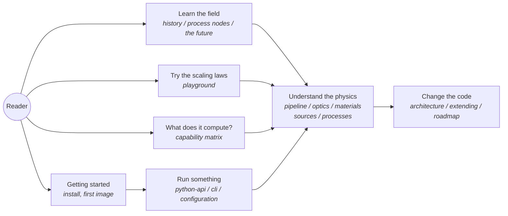

---
hide:
  - navigation
---

# highuvlith

<p class="huv-lead"><strong>A lithography simulator that tells you exactly what it computes</strong>
&mdash; from vacuum-ultraviolet excimer lasers through EUV (13.5&nbsp;nm) and beyond-EUV
(6.7&nbsp;nm) to soft and hard X-rays &mdash; and a guided tour of how chips have been
printed, how today's process nodes are made, and where the physics could go next.</p>

highuvlith is a Rust physics engine with Python, CLI, desktop GUI and notebook frontends.
It computes exact scalar Hopkins (TCC/SOCS) images ✅ and a vector TE/TM mode for high NA ✅,
through dry and water-immersion (193i, NA 1.35) projection lenses ✅ and EUV projection optics
at NA 0.33 and 0.55 🔶, for fourteen light-source families graded one by one from ✅ to 🧪.
Downstream it models thin films, resist exposure, baking and 3-D development, deep-layer
processes such as LIGA and Talbot lithography, and mask optimization. **Honesty is the
product:** every capability is graded ✅ Implemented · 🔶 Simplified · 🧪 Theoretical ·
🗺️ Planned in the [capability matrix](capability-matrix.md), and no page describes more than
the code does.

<div class="huv-actions" markdown>

[Get started](getting-started.md) · [What does it compute?](capability-matrix.md) · [Open the playground](playground/index.md)

</div>

## Explore lithography

<div class="grid cards huv-sections" markdown>

-   **📜 History**

    ---

    From a Munich printing stone in the 1790s to High-NA EUV scanners: contact printing,
    projection steppers, excimer lasers, the 157 nm detour, immersion, multiple patterning
    and the long road to EUV, told with sourced tool data.

    [Read the history →](history/index.md) · [The road to EUV →](history/euv.md)

-   **🔬 Process nodes**

    ---

    From the 90 nm generation to the Ångström era: what changed in the transistor (planar,
    FinFET, nanosheet, CFET), which layers became hard to print, how they were printed
    anyway, and why node names are marketing labels.

    [Tour the nodes →](nodes/index.md) · [Lithography arithmetic →](nodes/litho-math.md)

-   **🔭 The future**

    ---

    High-NA and Hyper-NA EUV, beyond-EUV wavelengths, accelerator light sources, the
    stochastic frontier, alternatives to projection and quantum schemes, each rated for
    readiness and for what the simulator can and cannot say about it.

    [Look ahead →](future/index.md) · [High-NA and Hyper-NA →](future/high-na-and-hyper-na.md)

</div>

## Use the simulator

<div class="grid cards" markdown>

-   **🚀 Getting started**

    ---

    Build the Python package from source, run a first aerial image, and find the CLI and
    GUI.

    [Getting started →](getting-started.md)

-   **🧭 Simulation pipeline**

    ---

    Source → optics → mask → Hopkins imaging → thin film → resist → metrics, stage by
    stage with every approximation stated, plus exact mask spectra and the CD, NILS and
    process-window metrics.

    [Pipeline →](pipeline.md) · [Masks & metrics →](masks-and-metrics.md) · [Architecture →](architecture.md)

-   **💡 Light sources**

    ---

    Fourteen families: Hg-lamp, KrF, ArF and F₂ lines, laser- and discharge-produced
    plasma (including a 500 W NXE:3800E-class tin preset), synchrotrons, free-electron
    lasers, X-ray tubes and speculative sources such as SSMB, all behind one source trait.

    [Sources →](sources/index.md) · [DUV/UV heritage →](sources/duv-heritage.md)

-   **🔍 Optics and materials**

    ---

    Dry and immersion lenses ✅, EUV projection optics 🔶 with an opt-in multilayer pupil 🔶,
    zone plates and Schwarzschild mirrors ✅, vector imaging ✅, and CXRO/NIST optical
    constants ✅.

    [Optics →](optics.md) · [Vector imaging →](vector-imaging.md) · [Materials →](materials.md)

-   **🧱 Processes**

    ---

    Thin films ✅, chemically amplified bakes 🔶, 3-D development by fast marching ✅ or level
    set ✅/🔶, LIGA deep X-ray with absolute exposure times ✅, grayscale lithography 🔶,
    multi-beam interference ✅/🔶 and Talbot lithography 🔶.

    [Processes →](processes/index.md) · [Talbot lithography →](processes/talbot.md)

-   **🧩 Optimization and research**

    ---

    Exact-adjoint ILT ✅, fragment OPC ✅, SRAF insertion 🔶, LELE/SADP/SAQP multiple
    patterning 🔶, DSA 🔶, photon shot noise and dose jitter ✅, and the research modules.

    [Research modules →](research-modules.md)

-   **📚 Reference**

    ---

    Every TOML field, CLI command, GUI control and Python class.

    [Configuration →](configuration.md) · [CLI →](cli.md) · [Python API →](python-api.md)

-   **🎛️ Playground**

    ---

    Resolution, photon shot-noise and aerial-image calculators that run in the browser,
    with every formula written out: teaching toys 🔶, not the engine.

    [Open the playground →](playground/index.md)

</div>

## How lithography resolution scales

The smallest half-pitch a projection scanner can print, and the focus range it can hold,
follow the Rayleigh scaling laws

```math
R = k_1 \frac{\lambda}{\mathrm{NA}}, \qquad \mathrm{DOF} = k_2 \frac{\lambda}{\mathrm{NA}^2}
```

where λ is the exposure wavelength, NA the numerical aperture of the projection lens,
and k₁, k₂ process factors. There are three levers: a shorter wavelength, a larger NA,
and a smaller k₁, which resolution-enhancement techniques push down towards its
single-exposure floor of k₁ = 0.25 for dense lines. Each lever has its price &mdash; the
depth of focus shrinks with NA², which is one reason every new generation is harder than
the last.

| Scanner class (example) | λ (nm) | NA | λ / NA (nm) | Quoted resolution (nm) | Implied k₁ |
|---|---:|---:|---:|---:|---:|
| KrF dry (ASML NXT:870) | 248 | 0.80 | 310 | 110 | 0.35 |
| ArF dry (ASML NXT:1470) | 193 | 0.93 | 208 | 57 | 0.27 |
| ArF immersion (ASML NXT:2000i) | 193 | 1.35 | 143 | 38 | 0.27 |
| EUV (ASML NXE) | 13.5 | 0.33 | 41 | 13 | 0.32 |
| High-NA EUV (ASML EXE) | 13.5 | 0.55 | 25 | 8 | 0.33 |

NA and resolution are the manufacturer's published figures ([references](#references)); the
implied k₁ = R · NA / λ treats the quoted resolution as a half-pitch. Recompute any row, or
try your own numbers, in the [playground](playground/index.md).

The simulator's optics presets show the same two NA steps. Its water-immersion lens (NA 1.35,
n = 1.437) images a 90 nm pitch at 193 nm with annular illumination at contrast 0.368, where a
dry NA 0.93 lens gives none ✅. Its EUV projection optics resolve an 18 nm pitch at NA 0.55
(contrast 0.495) but not at NA 0.33 🔶. Both results are recorded in the
[capability matrix](capability-matrix.md); the lens models are described under
[optical systems](optics.md).

## How to read the badges

| Badge | Meaning |
|---|---|
| ✅ Implemented | Computed by code, covered by tests, physics validated against analytical results |
| 🔶 Simplified | Runs end-to-end but with documented approximations or reduced dimensionality; the assumption is stated inline wherever the capability is described |
| 🧪 Theoretical | Parameterized and runnable, but models speculative physics; outputs are research projections, not validated engineering |
| 🗺️ Planned | Not in code; roadmap only. Never described in prose as if it runs |

A split badge such as ✅/🔶 means the named parts are exact and tested while the rest rests on
the stated approximation.

Every technical page opens with a **Status:** line carrying one of these grades; the
[capability matrix](capability-matrix.md) is the single source of truth for all of them.

## Orientation map



## About this site

This site is built with [MkDocs](https://www.mkdocs.org/) and
[Material for MkDocs](https://squidfunk.github.io/mkdocs-material/) from the `docs/`
folder of the [repository](https://github.com/sonoransun/highuvlith); every page also reads
as plain Markdown on GitHub. To preview it locally:

```bash
python -m venv .venv-docs
.venv-docs/bin/pip install -r docs/requirements-docs.txt
.venv-docs/bin/mkdocs serve
```

The `pages.yml` GitHub Actions workflow rebuilds and publishes the site on every push to
`main` (repository owners enable it once under *Settings → Pages → Source: GitHub
Actions*). Corrections and additions are welcome &mdash; see the
[contributing guide](https://github.com/sonoransun/highuvlith/blob/main/CONTRIBUTING.md).

## References

- ASML, [TWINSCAN NXT:870](https://www.asml.com/en/products/duv-lithography-systems/twinscan-nxt870) &mdash; KrF (248 nm), variable NA 0.55–0.80, resolution at and below 110 nm.
- ASML, [TWINSCAN NXT:1470](https://www.asml.com/en/products/duv-lithography-systems/twinscan-nxt1470) &mdash; ArF dry, variable NA 0.70–0.93, production resolution down to 57 nm.
- ASML, [TWINSCAN NXT:2000i](https://www.asml.com/en/products/duv-lithography-systems/twinscan-nxt2000i) &mdash; ArF immersion, NA 1.35, resolution down to 38 nm (dipole illumination).
- ASML, [EUV lithography systems](https://www.asml.com/en/products/euv-lithography-systems) &mdash; NXE systems NA 0.33 with 13 nm resolution; EXE (High-NA) systems NA 0.55 with 8 nm resolution.
