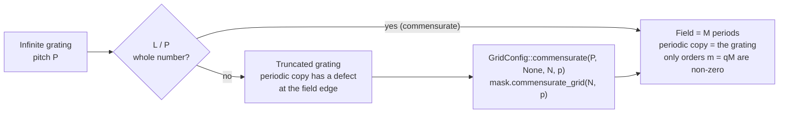
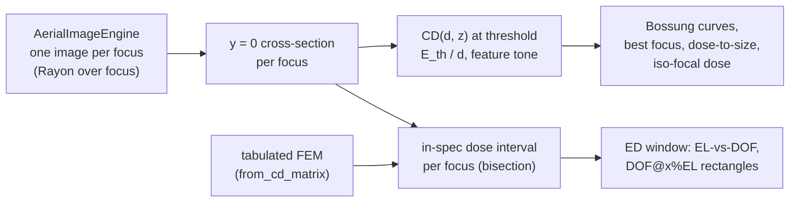

# Masks, metrics and process windows

**Status:** ✅ Implemented — exact thin-mask spectra, commensurate grids and tone-aware sub-pixel CD/NILS metrics are validated against closed forms and independent quadrature; the process-window dose axis is 🔶 simplified (constant-threshold resist).

This page covers the three stages between the optics and the resist:

- the **mask** — geometry, complex transmittance and its spectrum ([`mask.rs`](../crates/highuvlith-core/src/mask.rs));
- the **simulation grid** it lives on ([`types.rs`](../crates/highuvlith-core/src/types.rs));
- the image **metrics** and **process-window** analysis that read the aerial image
  ([`metrics.rs`](../crates/highuvlith-core/src/metrics.rs),
  [`process.rs`](../crates/highuvlith-core/src/process.rs)).

The imaging engine itself is described in [pipeline.md](./pipeline.md).

## Mask model

A `Mask` is an ordered list of features plus a mask type and a dark-/bright-field flag.
It uses the thin-mask (Kirchhoff) approximation: every feature is a region of constant
complex amplitude.

| Feature | Geometry | Amplitude |
|---|---|---|
| `Rect { x, y, w, h }` | axis-aligned rectangle, centre and size | feature amplitude |
| `Polygon { vertices }` | even-odd filled polygon | feature amplitude |
| `GrayRect { x, y, w, h, transmittance }` | rectangle | its own $\sqrt{T}$, zero phase (grayscale lithography) |
| `LineSpace { cd, pitch, orientation, offset }` | infinite grating of lines of width `cd`; one line centred at `offset` along the periodic axis; `Vertical` (default) = lines along y | feature amplitude |
| `RectArray { w, h, pitch_x, pitch_y, offset_x, offset_y }` | infinite lattice of `w × h` rectangles | feature amplitude |

The feature amplitude and the background swap with `dark_field`:

| | background | features |
|---|---|---|
| bright field (`dark_field = false`) | clear, 1 | absorber |
| dark field (`dark_field = true`) | absorber | clear, 1 |

The absorber is 0 for `Binary`, $\sqrt{T} e^{i\varphi}$ for `AttenuatedPSM { transmission, phase_deg }`,
and 0 for `AlternatingPSM` (its phase regions are not modelled). Features are painted
in order, so where they overlap **the later feature wins**.

The two constructors build periodic primitives:

- `Mask::line_space(cd, pitch)` — bright field, **opaque lines of width `cd`**, one
  centred at x = 0, periodic over the whole field. `Mask::line_space_with` adds the
  orientation and offset.
- `Mask::contact_hole(d, px, py)` — dark field, clear `d × d` holes on a `px × py`
  lattice, one centred at the origin. `d` must be smaller than both pitches.

New variants were added without renaming any existing ones, so serialized masks
(TOML/JSON, external variant tag) from before this change still load. The new fields
`orientation` and `offset*` default when omitted.

### Model coverage

| Field | Status |
|---|---|
| `Rect`, `GrayRect`, `Polygon`, `LineSpace`, `RectArray` geometry | live |
| `GrayRect.transmittance` | live (clamped to [0, 1]) |
| `AttenuatedPSM.transmission`, `.phase_deg` | live |
| `AlternatingPSM` | stored (inert) — imaged as a binary mask |
| mask topography (absorber height, sidewalls, mask-3D) | planned |

## The simulation field is one unit cell

An $N \times N$ grid of pixel $p$ covers the field $[-L/2, L/2)^2$ with $L = Np$, and
pixel $j$ is centred at $x_j = -L/2 + (j + \tfrac12)p$ — the `Grid2D` convention used by
every image the engine returns. The imaging FFTs make this field **periodic**. The mask
model states that explicitly: geometry outside the field is clipped away, and the field
is one period of an infinitely repeated mask.

A grating is therefore imaged as the infinite grating only if the field holds a whole
number of its periods:

```math
L = M_x P_x = M_y P_y,\qquad M_x, M_y \in \{1, 2, \dots\}
```

Otherwise the FFT splices a truncated grating onto itself, producing one line or space
of the wrong width at the field edge.



This was the largest silent error in the old model. `line_space` always laid down ten
periods regardless of the grid, so on the default 256 nm field a 180 nm pitch was
imaged as a 256 nm-period pattern with two unequal lines. (90, 190) and (100, 200)
gave bit-identical images, and `simulate_line_space(65, 180, na=0.75)` reported
contrast 0.854 and NILS 3.12. The correct partially coherent image of that grating
($\sigma = 0.7$, 2 % flare) has contrast 0.456 — an independent scalar Abbe
calculation. The old answer came from the spurious 256 nm period.

<figure markdown="span">


<figcaption>What was fixed in the mask model. Top: the intended 65 nm lines on a 180 nm pitch. Middle: what v1 rasterized for <code>line_space(65, 180)</code> on the old 256 nm default field — re-drawn from the v1 source, not simulated: the absorber was the 115 nm space width, and because the FFT treats the field as one period, the image was that of a 256 nm-period pattern with a 12 nm absorber sliver at the seam. Bottom: v2 rasterizes one 180 nm unit cell on a commensurate grid (antialiased; the exact analytic spectrum is used for imaging). Exact thin-mask spectrum ✅; Kirchhoff thin-mask model 🔶.</figcaption>
</figure>

### Commensurate grids

`GridConfig::commensurate(pitch_x, pitch_y, size, target_pixel)` keeps `size` and picks
the pixel:

1. The unit cell is the pitch, or the smallest common period of both pitches, found as
   the smallest $iP_x$ ($i \le 1000$) that is also a whole multiple of $P_y$ to $10^{-9}$.
   Pitches without one, such as $P_y/P_x = \sqrt2$, are an error: a square field cannot
   hold whole periods of both.
2. The field holds $M = \max(1, \lfloor N p_\mathrm{target} / \mathrm{cell} \rfloor)$
   cells, so the pixel $M\cdot\mathrm{cell}/N$ is **never coarser than the target**.
   The one exception is a grid too small to hold one cell at the target pixel, where
   the pixel coarsens to $\mathrm{cell}/N$.

For example, 180 nm on 256 px at 1 nm gives pixel 0.703125 nm (one period). 100 nm
gives 0.78125 nm (two periods). A 150 × 200 nm lattice has a 600 nm cell.

A periodic image is fully described by one period, so fewer periods at a finer pixel
lose nothing.

`Mask::periodicity()` returns the pitches the field must hold, as `(p1, p2)`.
`Mask::check_commensurate(grid)` returns an error naming the pitch, the fractional
period count and the exact fix (`GridConfig::commensurate(180, None, 256, 1) -> pixel
0.703125 nm, field 180 nm (1 period)`). `Mask::commensurate_grid(size, target)`
combines the two.

The frontends apply the rule automatically:

| Frontend | Behaviour |
|---|---|
| Python `simulate_line_space`, `simulate_contact_hole`, `sweep_focus` | pick `mask.commensurate_grid(grid_size, pixel_nm)`; the returned config records `pixel_nm` (used), `pixel_nm_requested`, `field_nm`, `periods_in_field` |
| Python `SimulationEngine`, `BatchSimulator` | run on the grid given (or the 512 × 1 nm default), but emit a `UserWarning` quoting the fix when it is incommensurate |
| CLI (`simulate`, `sweep`, `deep` volumetric/LIGA) | `[grid] commensurate = true` (default) adjusts `pixel_nm` and prints a `note:` line; `false` keeps the configured pixel |

## Exact spectrum

The engine images a mask through its spectrum. `Mask::spectrum(grid, fft)` returns

```math
S[k] = N^2\, c(m)\, e^{-i\pi (m_x + m_y)(N-1)/N},\qquad
c(m) = \frac{1}{L^2}\iint_\mathrm{field} t(x, y)\, e^{-2\pi i (m_x x + m_y y)/L}\,dx\,dy
```

with $m = k$ for $k < N/2$ and $m = k - N$ otherwise, the same order convention as the
engine's frequency loops. $c(m)$ is the exact Fourier-series coefficient of the
continuous (clipped, periodized) mask, and the phase factor places the samples on the
pixel centres. Three consequences:

- `IFFT(kernel ⊙ S)` evaluates the band-limited field exactly at the `Grid2D` pixel
  centres, so a feature centred at the origin images centred at the origin.
- A clear mask has $S[0,0] = N^2$ exactly.
- $S$ equals `fft.forward(rasterize(grid))` in the fine-pixel limit.

The building blocks are closed forms:

```math
\frac1L\int_a^b e^{-2\pi i m x/L}dx = \frac{b-a}{L}\,\mathrm{sinc}\frac{\pi m (b-a)}{L}\,e^{-i\pi m (a+b)/L},
\qquad
c_\mathrm{grating}(m) = \frac{w}{P}\,\mathrm{sinc}\frac{\pi q w}{P}\,e^{-2\pi i q x_0/P}\ \ (m = qM)
```

with $\mathrm{sinc}(u) = \sin u / u$. A grating on a field of $M$ periods has
**exactly zero** coefficients off its harmonics. Rectangles and gratings are separable,
so their 2D coefficient is a product of 1D ones.

Simple polygons are integrated edge by edge with the divergence theorem,

```math
\iint_P e^{-i\mathbf k\cdot\mathbf r}\,d^2r = \frac{i}{|\mathbf k|^2}\sum_\mathrm{edges}(k_x\Delta y - k_y\Delta x)\,\mathrm{sinc}\frac{\mathbf k\cdot\boldsymbol\Delta}{2}\,e^{-i\mathbf k\cdot\mathbf r_\mathrm{mid}}
```

for a counter-clockwise polygon (the sign flips for clockwise), after clipping to the
field. At $\mathbf k = 0$ the integral is the polygon area.

Overlapping rectangles and gratings are first resolved into disjoint cells with the
painter's rule, on the grid formed by all their edges, so overlaps stay exact.
`Mask::spectrum_method(grid)` reports which path a mask takes:

| Method | When | Accuracy |
|---|---|---|
| `Analytic` | rectangles, gray rectangles, gratings, simple polygons (overlaps resolved) | exact |
| `Mixed` | a self-intersecting polygon is present | exact except that polygon, which uses the raster path |
| `Raster` | a polygon overlaps another feature, or the analytic cost exceeds its budget ($2^{26}$ multiply-adds) | antialiased raster × pixel transfer |

The raster path multiplies the FFT of the exact-coverage raster by the pixel transfer
function $\mathrm{sinc}(\pi m_x/N) \cdot \mathrm{sinc}(\pi m_y/N)$. That is exact for
pixel-aligned edges. A sub-pixel edge leaves an error of first order in $p/L$ — the
first moment of the mask inside each edge pixel — about 0.4 % of DC at the second order
for 4 nm pixels on a 256 nm field.

### Validation

| Check | Result |
|---|---|
| sub-pixel rectangle vs brute-force quadrature (numpy, $2\times10^6$ points per axis) | 7 orders agree to $10^{-9}$ of DC |
| 65/180 grating on a 2-period field vs closed form (quadrature cross-check) | harmonics to $10^{-8}$; all non-harmonic orders exactly 0 |
| pixel-aligned rectangle: FFT(raster) × pixel transfer | equals the analytic spectrum to $10^{-12}$ at every order, Nyquist included |
| sub-pixel shift by $\delta = 0.37$ nm | spectrum multiplied by $e^{-2\pi i m_x\delta/L}$ to $10^{-9}$ (a raster cannot move by a tenth of a pixel) |
| centred rectangle, Gaussian-apodized inverse FFT | real and mirror-symmetric about $x = 0$, $y = 0$ to $10^{-12}$ |
| fine-pixel limit (256 nm field, 4 → 1 nm pixels) | FFT(raster) → spectrum, error shrinks ~4× (first order) and is < $5\times10^{-4}$ of DC at 1 nm |
| overlapping rectangles (line + serif) | equals the hand-made disjoint decomposition to $10^{-12}$; DC = union area |
| rectangle drawn as a polygon (either orientation), concave clipped L-shape | equals the rectangle spectrum to $10^{-11}$ |
| sub-pixel mask bias through the engine (100/300 L/S, NA 0.75, σ 0.7, 2.34 nm pixels) | MEEF identical for ±0.25, ±0.5 and ±1 nm biases (≈ 1.05); the old pixel-quantized raster gave 0, 0 and −3.5 |

## Rasterization

`Mask::rasterize(grid)` returns the **area-averaged complex amplitude** of each pixel,
blended by covered area: $t_j = t_\mathrm{bg} + \sum_f (t_f - t_\mathrm{bg}) A_{jf}/p^2$
over disjoint pieces. Coverage is exact for every feature type:

- rectangles and gratings, as products of 1D interval overlaps;
- polygons, by cutting them into bands at vertices, edge crossings, pixel rows and
  pixel-column crossings, where the trapezoid rule is exact.

The only approximate path is a 4 × 4 supersampled painter's fallback, used when a
polygon overlaps another feature.

The average amplitude is the right input for coherent imaging of a sampled map, but on
edge pixels $|\langle t\rangle|^2 \ne \langle |t|^2\rangle$. Geometric-shadow consumers
(proximity printing, deep X-ray) should use `Mask::rasterize_intensity`, the
area-averaged intensity transmittance. For a 10 nm stripe on 4 nm pixels, an edge pixel
has amplitude 0.25, so $|\langle t\rangle|^2 = 0.0625$, while its intensity average is
0.25.

## Python and CLI

<!-- verify-example -->
```python
import highuvlith as huv

mask = huv.MaskConfig.line_space(65.0, 180.0)               # opaque 65 nm lines, x = 0 centred
grid = mask.commensurate_grid(size=256, target_pixel_nm=1.0)  # pixel 0.703125 nm, field 180 nm
mask.check_commensurate(grid)                                 # raises ValueError with the fix if not
spec = mask.spectrum(grid)                                    # numpy.fft.fft2 layout and scale
assert mask.spectrum_method(grid) == "analytic"

holes = huv.MaskConfig.contact_hole(60.0, 150.0, 200.0)     # 600 nm common cell
custom = huv.MaskConfig.from_features(
    [{"type": "rect", "x": 0, "y": 0, "w": 40, "h": 200},
     {"type": "polygon", "vertices": [(30, -10), (60, -10), (45, 20)]}],
    dark_field=True,
)
g = huv.GridConfig.commensurate(150.0, 200.0, size=512, target_pixel_nm=1.0)
```

```toml
[grid]
size = 256
pixel_nm = 1.0
commensurate = true   # default: pixel -> 0.703125 nm for a 180 nm pitch, with a note on stderr
```

### Limitations

- Thin-mask model only: no mask-3D effects (absorber height, shadowing, edge
  diffraction), and no alternating-PSM phase regions.
- Geometry outside the field is clipped, not wrapped. Place finite features inside
  the field, or use a periodic primitive on a commensurate grid.
- The raster fallback (overlapping polygons, oversize masks) is exact only for
  pixel-aligned edges.
- Gratings with more than $2^{20}$ periods in the field, i.e. far below the pixel,
  are replaced by their zeroth order (area-weighted mean amplitude).
- A square field holds whole periods of both lattice pitches only if their ratio is a
  small-integer fraction.
- On a commensurate field, a pitch between $\lambda/\mathrm{NA}$ and
  $\lambda/((1+\sigma)\mathrm{NA})$ is resolved only through partially coherent orders
  up to $(1+\sigma)\mathrm{NA}/\lambda$. The engine must keep those mask orders (see
  [pipeline.md](./pipeline.md)).


## Metrics

Implementation: [`crates/highuvlith-core/src/metrics.rs`](../crates/highuvlith-core/src/metrics.rs).
All metrics are image-plane quantities: a CD here is the width of an intensity
threshold contour on the y = 0 cross-section of the aerial image (a
constant-threshold resist), not a developed resist profile.

### Sub-pixel threshold crossings

Every CD, ILS and NILS function shares one crossing finder. Between the two samples
that bracket the threshold, the profile is interpolated by a cubic Hermite polynomial
whose node slopes come from the five-point central difference
$(-y_{k+2} + 8y_{k+1} - 8y_{k-1} + y_{k-2})/(12\Delta x)$, Fritsch–Carlson limited so
the cubic is monotone on the segment. The crossing is the unique root of that cubic,
and the edge slope $dI/dx$ is its derivative **at** the crossing (the previous code
used a one-sided secant between the bracketing samples).

For smooth (band-limited) images the crossing position is fourth-order and the slope
third-order accurate in the sample spacing. On the closed-form fixture below, the
worst case over 16 sub-pixel phases is:

| samples per 180 nm period | CD error (nm) | NILS error |
|---:|---:|---:|
| 20 (9 nm pixel) | 1.3 × 10⁻³ | 3.7 × 10⁻⁴ |
| 40 | 7.1 × 10⁻⁵ | 1.5 × 10⁻⁵ |
| 80 | 3.4 × 10⁻⁶ | 6.0 × 10⁻⁶ |
| 160 | 2.2 × 10⁻⁷ | 6.9 × 10⁻⁷ |

(NILS ≈ 2.32 on this fixture, $a = 0.5$, $b = 0.4$, $t = 0.27$.)

### Feature tone and periodic images

The imaging engine returns one period of a periodic image (the FFT's boundary
condition), so the recommended functions treat the profile as periodic — crossings
wrap around the field edge and a feature straddling it is measured whole — and take an
explicit `FeatureTone`:

- **Dark** — the feature is where $I <$ threshold (an opaque line on a bright-field
  mask; a resist line in positive resist).
- **Bright** — the feature is where $I \ge$ threshold (a space, or a contact hole on a
  dark-field mask). `FeatureTone::of_mask` picks Bright for dark-field masks, Dark
  otherwise.

| Function | Returns |
|---|---|
| `measure_cd_periodic(profile, x, t, tone)` | width of the `tone` feature whose centre is nearest the field centre |
| `periodic_features(profile, x, t, tone)` | every feature: edges, width, centre, edge slopes |
| `image_log_slope(profile, x, t, tone)` | ILS $= \lvert dI/dx\rvert / t$ (1/nm), mean of the two edges |
| `nils_periodic(profile, x, t, tone, width)` | NILS $= w \cdot$ ILS, $w$ = measured CD or a supplied nominal width |
| `meef(...)`, `meef_central(cd, δ, f)` | MEEF $= \partial CD_\mathrm{wafer}/\partial CD_\mathrm{mask}$ (both at wafer scale) |
| `centre_profile(image)` | y = 0 cross-section: four-row cubic midpoint rule $(-r_{-2}+9r_{-1}+9r_{+1}-r_{+2})/16$ |

The legacy open-profile functions `measure_cd`, `measure_cd_2d` and `nils` keep their
signatures and semantics — the width between the two consecutive crossings whose
midpoint is nearest the profile centre, whatever its tone — but now use the same
crossing finder, and `measure_cd_2d` reads the y = 0 profile instead of the row at
$y = +\Delta y/2$. Because they measure whichever feature straddles x = 0, the tone
they report depends on where the pattern's phase puts the origin; prefer the
tone-explicit functions.

### Closed-form checks

For $I(x) = a - b\cos(2\pi x/p)$ the dark feature centred on $x = 0$ has

```math
CD_\mathrm{dark}(t) = \frac{p}{\pi}\arccos\frac{a - t}{b},\qquad
\left.\frac{dI}{dx}\right|_\mathrm{edge} = b\,\frac{2\pi}{p}\,\sin\frac{\pi\,CD}{p},
```

e.g. $a = 0.5$, $b = 0.4$, $p = 180$ nm, $t = 0.3$: CD = 60 nm (bright: 120 nm), NILS =
2.418399 (bright: 4.836798). A two-beam image of an opaque line of width $w$,
$I = (1 - w/p) - 2M\sin(\pi w/p)/\pi\cdot\cos(2\pi x/p)$ with $M = 0.8$, $t = 0.3$, gives
CD(58 nm) = 28.9937 nm, CD(62 nm) = 37.7506 nm, so the central-difference MEEF at
60 nm is 2.1892 (analytic derivative 2.1621). These numbers are computed independently
with numpy and asserted in the unit tests.

<figure markdown="span">


<figcaption>Mask error enhancement. For 1:1 lines at three pitches (F<sub>2</sub> 157.63 nm, NA 0.75, σ 0.7, 2 % flare) the threshold is set so the nominal line prints on size; the mask line is then biased by ±25 nm (wafer scale) and the printed CD measured with the sub-pixel crossing finder. MEEF = dCD<sub>wafer</sub>/dCD<sub>mask</sub> rises well above 1 as k<sub>1</sub> falls. Models: exact thin-mask spectrum ✅, scalar imaging ✅, CD metrics ✅; constant-threshold resist 🔶.</figcaption>
</figure>

## Process window and ED analysis

Implementation: [`crates/highuvlith-core/src/process.rs`](../crates/highuvlith-core/src/process.rs).
Status: 🔶 Simplified — the dose axis comes from a constant-threshold resist.



### Resist model and dose

`ThresholdResist { dose_to_clear_mj_cm2 }`: with the aerial image normalized to the
clear field ($I = 1$ for an open frame), a point receives dose $d \cdot I(x)$ and clears
where $d \cdot I(x) \ge E_\mathrm{th}$. At dose $d$ the printed edge is therefore the
intensity contour

```math
I(x_\mathrm{edge}; z) = E_\mathrm{th} / d .
```

A dark (opaque-line) feature narrows as dose rises; a bright (hole/space) feature
widens. The legacy `ProcessWindow::compute(engine, mask, doses, focuses, cd_threshold,
target, tol)` keeps its signature: `cd_threshold` is the intensity threshold at the
**nominal dose**, the median of `doses`, i.e. $E_\mathrm{th} = $ `cd_threshold` $\cdot
d_\mathrm{nom}$. Previously the dose was ignored and every row of the CD matrix was
identical. `compute_threshold_model` takes the resist explicitly; `from_profiles`
(precomputed cross-sections) and `from_cd_matrix` (tabulated or measured
focus–exposure matrices) are engine-free.

Only one aerial image per focus is computed. Every dose is evaluated on the stored
cross-sections, so dose is continuous: at each focus the measured feature is tracked
through its extreme-intensity sample, its CD is monotone in the threshold, and the
in-spec dose interval $[d_\mathrm{min}(z), d_\mathrm{max}(z)]$ for the spec
$CD_t(1 \mp \mathrm{tol})$ is found by bisection — exact model evaluation, so these
limits are not clipped to the swept dose range (the swept doses only set the rows of
`cd_matrix` and the nominal dose). `cd_matrix` holds NaN where the
feature does not print or has merged with its neighbours (it used to hold 0.0).

### Figures of merit

| Method | Definition |
|---|---|
| `nominal_dose()` | median of the swept doses |
| `best_focus()` | focus of $dCD/dz = 0$ on the Bossung curve at the dose-to-size (least-squares quadratic vertex through the 5 samples around the extremum); falls back to the centre of the in-spec focus interval |
| `dose_to_size()` | dose printing the target CD at best focus |
| `depth_of_focus()` | in-spec focus range around best focus at the dose-to-size (spec crossings interpolated between focus samples) |
| `exposure_latitude()` | EL at best focus, $\mathrm{EL} = (d_\mathrm{max} - d_\mathrm{min}) / \tfrac12(d_\mathrm{max} + d_\mathrm{min}) \times 100$ % |
| `iso_focal_dose()` | dose minimizing $\max_z CD - \min_z CD$ over the focus samples that print at every swept dose |
| `el_vs_dof(n)` | exposure–defocus curve: for each DOF, the largest EL of any in-window rectangle of that focus extent |
| `dof_at_el(el)` | largest-DOF rectangle with EL ≥ `el` (DOF@5 %EL = `dof_at_el(5.0)`) |
| `el_at_dof(dof)`, `max_area_rectangle()` | largest-EL rectangle of a given DOF; rectangle maximizing DOF × EL |

An ED rectangle $[z_1, z_2] \times [d_1, d_2]$ lies inside the window when
$d_1 \ge \max_{[z_1,z_2]} d_\mathrm{min}(z)$ and $d_2 \le \min_{[z_1,z_2]} d_\mathrm{max}(z)$;
the in-spec dose limits are interpolated linearly between focus samples and the
search runs on a 16× refined focus grid. EL(DOF) never increases with DOF (a longer
focus range only adds constraints), which `dof_at_el` exploits by bisection.

### Closed-form validation

For the synthetic window $I(x; z) = a - b(z)\cos(2\pi x/p)$,
$b(z) = b_0 e^{-((z - z_0)/s)^2}$ with $a = 0.5$, $b_0 = 0.45$, $z_0 = 40$ nm,
$s = 150$ nm, $p = 180$ nm, $E_\mathrm{th} = 9$ mJ/cm² and a 60 nm ± 10 % spec,
the in-spec condition is
$a - b(z)\cos(\pi CD_\mathrm{lo}/p) \le E_\mathrm{th}/d \le a - b(z)\cos(\pi CD_\mathrm{hi}/p)$,
which gives (numpy, asserted in the tests on a 10 nm focus grid):

| Quantity | Closed form | Tolerance in test |
|---|---:|---:|
| dose limits at $z_0$ | 28.3940 – 38.2171 mJ/cm² | 0.02 % |
| EL at best focus | 29.494 % | 0.2 % |
| best focus | 40 nm | 0.5 nm |
| dose-to-size | 32.7273 mJ/cm² ($t^* = a - b_0/2$) | 0.01 % |
| DOF at dose-to-size | 120.656 nm | 0.5 % |
| EL of the 100 nm-DOF rectangle | 18.493 % | 0.3 % |
| DOF @ 5 % EL / 10 % EL | 160.745 / 139.277 nm | 0.3 % |
| iso-focal dose | 18 mJ/cm² ($= E_\mathrm{th}/a$: CD = p/2 at every focus) | 0.01 % |

<figure markdown="span">


<figcaption>Dose-aware process window of 65 nm lines on a 180 nm pitch (F<sub>2</sub> 157.63 nm, NA 0.75, σ 0.7, 2 % flare), from <code>BatchSimulator.process_window</code>: printed CD per (dose, focus) with a constant-threshold resist, Bossung curves around the dose-to-size, continuous dose limits, the largest-DOF window at 5 % exposure latitude, the max-area rectangle and the EL–DOF curve. Model: process window / ED analysis 🔶 (constant threshold; no resist blur, diffusion or development; CD on the y = 0 cut).</figcaption>
</figure>

### Model status and limitations

- Constant-threshold resist only: no acid diffusion or image blur, no development
  kinetics, no resist thickness, standing waves or mask-3D effects. The only dose
  dependence is the threshold shift $E_\mathrm{th}/d$.
- CD is measured on the y = 0 cross-section (the x-width of a line, or of a contact
  through its centre); no 2D contour metrics.
- Focus is sampled at the sweep points; DOF resolution is set by the focus step (dose
  resolution is not). Tabulated matrices are linear in dose between rows.
- The ED window uses inscribed rectangles only (no ellipse); EL is relative to the
  rectangle's centre dose.
- Frontends: Python `BatchSimulator.process_window` (legacy signature, dose-aware),
  `BatchSimulator.process_window_threshold`, `ProcessWindowResult.from_profiles` /
  `.from_cd_matrix`, `AerialImageResult.cd` / `.nils_periodic` / `.image_log_slope` /
  `.features`; the CLI `sweep` command reports dose-aware CDs and an ED summary
  (best focus, dose-to-size, DOF, EL, DOF@5 %EL, iso-focal dose) with the config dose
  as nominal and 0.3 as its intensity threshold.
