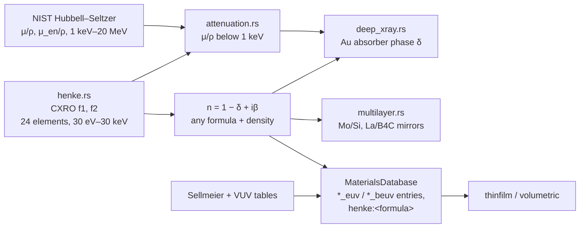

# Materials Database

**Status:** 🔶 Simplified — X-ray/EUV/BEUV optical constants are computed from the embedded CXRO/Henke scattering factors and X-ray attenuation from the NIST Hubbell–Seltzer tables (both fixture-tested against the source databases), and multilayer mirrors reproduce the CXRO calculator; the VUV (126–160 nm) tables remain approximate transcriptions and the EUV resist entries are representative stand-ins.

## Overview

Optical constants decide everything downstream of the aerial image: thin-film standing waves, resist coupling, mirror reflectance, LIGA depth dose. highuvlith carries five material layers, each matched to the physics that consumes it:



1. **[`MaterialsDatabase`](../crates/highuvlith-core/src/materials/database.rs)** — complex index n + ik by name and wavelength: Sellmeier fits ([dispersion.rs](../crates/highuvlith-core/src/materials/dispersion.rs)) for transparent crystals, tabulated VUV points, and **Henke-computed** EUV/BEUV entries. Queried by the CLI `materials` command, the Python `refractive_index`, and the CLI `deep` volumetric mode (`resist_on_silicon_stack`). Every entry has a data range and lookups never extrapolate (see the [range policy](#range-policy-no-silent-extrapolation)). `FilmStack::default()` still carries fixed 157 nm values (resist 1.65 + 0.015i on Si 0.88 + 2.10i) and should only be used near 157 nm.
2. **[Henke/CXRO scattering factors](../crates/highuvlith-core/src/materials/henke.rs)** — `f1`, `f2` for 24 elements and δ, β for any formula and density.
3. **[X-ray attenuation](../crates/highuvlith-core/src/materials/attenuation.rs)** — μ/ρ and μ_en/ρ, 30 eV – 20 MeV, with a mixture-rule `Compound`; consumed by the LIGA module.
4. **[Multilayer mirrors](../crates/highuvlith-core/src/materials/multilayer.rs)** — periodic EUV/BEUV Bragg reflectors.
5. **[Diamond](../crates/highuvlith-core/src/materials/diamond.rs)** — Sellmeier index, thermal properties, film-stack presets, X-ray window transmission.

## X-ray / EUV optical constants (`henke.rs`) ✅

In the independent-atom model every material has, between ~30 eV and 30 keV,

```math
n = 1 - \delta + i\beta,\qquad \delta = \frac{r_e\lambda^2}{2\pi}\sum_q n_q f_{1,q}(E),\qquad \beta = \frac{r_e\lambda^2}{2\pi}\sum_q n_q f_{2,q}(E),\qquad n_q = \frac{\rho N_A x_q}{\sum_p x_p A_p},
```

with $r_e$ = 2.8179403262 × 10⁻¹⁵ m, formula counts $x_q$, standard atomic weights $A_p$ and density $\rho$; photoabsorption is $\mu_a = 4\pi\beta/\lambda = 2r_e\lambda\sum_q n_q f_{2,q}$. `Material::new("B4C", 2.52)?.refractive_index(6.7)` returns `n + ik` (the thin-film convention, k ≥ 0). Interpolation between tabulated energies: f2 log-log, f1 linear in ln E (it changes sign near some edges); edges are duplicated rows, and an energy exactly on an edge takes the above-edge value. Energies outside 30 eV – 30 keV (0.0413–41.3 nm) are rejected, not extrapolated.

**Provenance.** The per-element files in [`materials/henke_data/`](../crates/highuvlith-core/src/materials/henke_data) are the CXRO tables `https://henke.lbl.gov/optical_constants/sf/<el>.nff`, retrieved **2026-09-30**, stored byte-for-byte except CR-LF → LF line endings (an FNV-1a hash of each stored file is pinned by `test_embedded_tables_unmodified`). They are the Henke, Gullikson & Davis compilation as maintained by CXRO, including CXRO's updates: the Cr file is headed "Cr from F. Delmotte et al, J. Appl. Phys. 124, 035107 (2018)", Pt "Pt from R. Soufli et al, J. Appl. Phys. 125, 085106 (2019)", Ta "updated with ALS measurements from 2008" (quoted from the file headers).

| Element | SHA-256 of the CXRO download (first 16 hex) | Element | SHA-256 (first 16 hex) |
|---|---|---|---|
| H | `470dd8087b9893e7` | Cu | `fd6252d25ab3ee51` |
| Be | `3faa000d53c7e974` | Zr | `e0d500b40dfcae2b` |
| B | `d83807d0f87dfdab` | Mo | `fb8ccfa0bac4e49c` |
| C | `bcf593b59cee89ef` | Ru | `3c1e8cc8e6068914` |
| N | `06024c69974137e7` | Sn | `111495ca907dfb72` |
| O | `adb1540b11008383` | Te | `eb275632720494c0` |
| Al | `ed07171a6500b307` | La | `2c134f07074d1af4` |
| Si | `2bbd2aef0292aa39` | Hf | `3e41104e4001de94` |
| Ti | `f3e3c7c01ec8dfff` | Ta | `a4486da26b8ecf48` |
| Cr | `401c30b4f97740f7` | W | `dd11d29386952edd` |
| Co | `c2cd72cad01bb4d2` | Pt | `04126c0d32ecc24f` |
| Ni | `d8a5f70f81c14fbf` | Au | `684ff0d70ad266f5` |

**Validation against the CXRO calculator** (`henke.lbl.gov/cgi-bin/getdb.pl`, 2026-09-30, 30 materials at 13.5 and 6.7 nm plus wavelength scans): δ and β agree to ≤ 3 × 10⁻⁴ relative wherever δ is not near a zero crossing, and to ≤ 2 × 10⁻⁶ absolute otherwise. The residual is the atomic-weight table (CXRO uses slightly older values, e.g. Mo 95.94 vs the IUPAC 95.95 used here).

`default_density(formula)` returns the density the CXRO calculator uses by default (bulk values, e.g. Mo 10.22, Ru 12.41, Ta 16.65, La 6.166, B4C 2.52, Si3N4 3.44, SiO2 2.2 g/cm³; H, N, O have none). Thin films are often 5–10 % less dense — pass a measured density when you have one.

Limits: isolated atoms — no chemical shifts or solid-state near-edge structure (XANES/EXAFS) except where CXRO replaced an element's table with measured data; results are only as good as the density supplied.

## Refractive-index coverage matrix

`MaterialsDatabase::refractive_index(name, λ_nm)` tries Sellmeier first (k = 0), then the VUV tables (linear interpolation in n and k), then the named X-ray/EUV/BEUV entries (computed at λ), then `"henke:<formula>"` (CXRO default density) or `"henke:<formula>@<density>"`; unknown names return `MaterialNotFound`. `wavelength_ranges_nm(name)` returns the accepted ranges of an entry.

### Range policy (no silent extrapolation)

Before 2026-10-01 the VUV tables clamped silently at their ends and the Sellmeier fits were evaluated at any wavelength: `refractive_index("Si", 13.5)` returned the 126 nm value 0.55 + 1.75i (the correct EUV value is 0.99900 + 0.00183i) and `"CaF2"` at 13.5 nm returned 0.973. Now every entry has an accepted range and a lookup outside it either

1. **falls back to Henke** — when the name is itself a formula of embedded Henke elements with a CXRO default density (`"Si"` 2.33, `"Cr"` 7.19, `"SiO2"` 2.2 g/cm³) and λ is in 0.0413–41.3 nm. The value is identical to `"henke:<name>"` (so `"Si"` at 13.5 nm equals `"Si_euv"`); or
2. **fails** with the typed error `LithographyError::WavelengthOutOfRange { material, wavelength_nm, range_nm, hint }`. The hint names the alternative key: `"henke:Si"` for `"Si"` at 41.3–125 nm, the `_euv`/`_beuv` entries and `henke:` for fluorides at EUV (no fluorine table), `'Si'` for `"Si_euv"` in the VUV. Python raises `ValueError` with the same text; the CLI `materials --name` exits non-zero with it and the listing prints the data range in place of a value.

| Entry | Accepted range (nm) | Outside |
|---|---|---|
| CaF2, MgF2, LiF, BaF2 (Sellmeier) | 125, 115, 105, 135 – 2000 | error |
| SiO2 (Sellmeier) | 165 – 2000 | Henke (amorphous SiO2, 2.2 g/cm³) at 0.0413–41.3 nm, else error |
| Cr, Si (tables) | 125 – 161 | Henke at 0.0413–41.3 nm, else error |
| AlF3, Na3AlF6, LaF3, GdF3, VUV_resist, VUV_BARC (tables) | 125 – 158 | error |
| `*_euv`, `*_beuv`, resist stand-ins, `henke:` | 0.0413 – 41.3 | error |
| Diamond (`diamond_index`, `diamond.rs`) | 226.7 – 2000 | error |

The one remaining hold is deliberate: the VUV tables return their end value up to 1 nm (`TABLE_EDGE_HOLD_NM`) beyond their first/last node, so the F2 line (157.63 nm) can use the 157 nm node of the two-point tables. Over 1 nm the tabulated dispersion (Si: about 0.011 per nm between 140 and 157 nm) moves n by less than the tables' transcription accuracy. The Sellmeier lower limits are the approximate VUV transmission edges of the crystals (SiO2: its ~165 nm absorption onset); the 2000 nm upper limit covers every lithography and drive-laser wavelength in the code and stays far below the infrared resonances.

`MaterialsDatabase::resist_on_silicon_stack(t, λ)` builds the default single-resist-on-Si stack from the database: `VUV_resist` on `Si` in the VUV range, the `EUV_resist` stand-in on Si (Henke) at 0.0413–41.3 nm, and an error elsewhere (for example 193 or 248 nm, where the database has no resist entry). The CLI `deep` volumetric mode uses it, so volumetric runs at EUV wavelengths no longer reuse the 157 nm constants, and runs at other wavelengths stop with the error instead.

### Sellmeier models (dispersive, k = 0)

```math
n^2(\lambda) = 1 + \sum_i \frac{B_i\, \lambda^2}{\lambda^2 - C_i} \qquad (\lambda\ \text{in}\ \mu\mathrm{m})
```

`dispersion(name, λ)` also returns dn/dλ analytically (surfaced by the CLI `materials` command). It quantifies CaF2's steep VUV dispersion — the physical reason for the large axial chromatic defocus at 157 nm — but note the 15 nm/pm default in `ProjectionOptics` is an independent hardcoded constant, not derived from this function at runtime. Resonance (λ² → C_i) and unphysical n² < 0 are rejected as `NumericalError` rather than returning NaN.

| Material | Accepted range | Provenance | Status |
|----------|----------|------------|--------|
| CaF2 | 125 nm – 2 µm | Malitson's fit, *Appl. Opt.* 2, 1103 (1963), measured 0.23–9.7 µm (earlier docs credited Daimon & Masumura 2002; the coefficients are Malitson's) | ✅ above 230 nm; 🔶 VUV (extrapolated fit: 1.5570 at 157.63 nm vs ~1.559 measured) |
| MgF2 (ordinary ray) | 115 nm – 2 µm | Dodge, *Appl. Opt.* 23, 1980 (1984) | ✅ UV–IR; 🔶 VUV (extrapolated, not checked) |
| LiF | 105 nm – 2 µm | Li, *J. Phys. Chem. Ref. Data* 5, 329 (1976) | ✅ UV–IR; 🔶 VUV (extrapolated, not checked) |
| BaF2 | 135 nm – 2 µm | standard Sellmeier fit | ✅ UV–IR; 🔶 VUV (extrapolated, not checked) |
| SiO2 (fused silica) | 165 nm – 2 µm — absorbs below; DUV reference | Malitson's fit, *J. Opt. Soc. Am.* 55, 1205 (1965) | ✅ |
| Diamond (type IIa) | 226.7 nm (bandgap) – 2 µm | Peter (1923); in `diamond.rs`, not the database map | ✅ |

### Tabulated n + ik — VUV band (126–160 nm) 🔶

Two-to-four-point tables, linearly interpolated (unchanged by the 2026-09-30 EUV/BEUV pass), accepted from 1 nm below the first node to 1 nm above the last (see the range policy). These are the materials of the F2/Ar2 thin-film stacks.

| Material | Role | Entries (λ nm) |
|----------|------|----------------|
| Cr | mask absorber | 126, 140, 157, 160 |
| Si | substrate | 126, 140, 157, 160 |
| AlF3, Na3AlF6 (cryolite) | low-n AR coatings | 126, 157 |
| LaF3, GdF3 | high-n HR coatings | 126, 157 |
| VUV_resist | generic fluoropolymer resist | 126, 157 |
| VUV_BARC | bottom AR coating | 126, 157 |

All VUV metal/coating values are approximate transcriptions (marked so in the source); they are physically ordered (Cr strongly absorbing, fluorides near-transparent) and adequate for standing-wave and reflectance studies.

### EUV (13.5 nm) and BEUV (6.7 nm) entries — computed ✅ / representative 🔶

Each entry is a formula + density evaluated with the Henke tables **at the requested wavelength** (dispersive across the band). At these energies all condensed matter has n slightly below 1.

| Name | Formula @ g/cm³ | n + ik (computed) | Previous single-point value | Status |
|------|-----------------|-------------------|-----------------------------|--------|
| `Si_euv` | Si @ 2.33 | 0.99900 + 0.00183i at 13.5 nm | 0.99901 + 0.00182i | ✅ CXRO |
| `Mo_euv` | Mo @ 10.22 | 0.92380 + 0.00644i at 13.5 nm | 0.92380 + 0.00644i | ✅ CXRO |
| `Ru_euv` | Ru @ 12.41 | 0.88636 + 0.01707i at 13.5 nm | 0.886 + 0.017i | ✅ CXRO |
| `Ta_euv` | Ta @ 16.65 | 0.95669 + 0.03433i at 13.5 nm | 0.943 + 0.041i (was off) | ✅ CXRO |
| `La_beuv` | La @ 6.166 | 0.98390 + 0.00136i at 6.7 nm | 0.988 + 0.0027i (was off) | ✅ CXRO |
| `B4C_beuv` | B4C @ 2.52 | 0.99897 + 0.00053i at 6.7 nm | 0.9947 + 0.0004i (δ 5× too large) | ✅ CXRO |
| `EUV_resist` | C5H8O2 @ 1.19 (organic stand-in) | 0.97569 + 0.00563i at 13.5 nm (α = 5.2 /µm) | 0.976 + 0.0054i | 🔶 representative |
| `MOx_resist` | Sn12C48H116O22 @ 2.0 (assumed density) | 0.97258 + 0.01551i at 13.5 nm (α = 14.4 /µm) | 0.935 + 0.021i | 🔶 representative |
| `BEUV_resist` | C5H8O2 @ 1.19 | 0.99410 + 0.00061i at 6.7 nm (α = 1.15 /µm) | 0.994 + 0.002i | 🔶 representative |

The resist entries are **stand-ins, not measured resist data**: the organic one uses PMMA stoichiometry for the organic backbone of EUV chemically amplified resists (photo-acid generators and quenchers containing S, F or I raise the real absorption by roughly 10–40 %); the metal-oxide one uses the butyltin-oxo "Sn12" cage stoichiometry (with hydroxide counter-ions) at an assumed density. Below the carbon K edge organic resists are nearly transparent at 6.7 nm (α ≈ 1.2 /µm vs 5.2 /µm at 13.5 nm) — the BEUV resist-absorption problem. For anything else use `"henke:<formula>@<density>"`.

The Mo/Si pair is the physics anchor: Mo has 3.5× the absorption and 76× the index decrement of Si — the contrast that makes Mo/Si multilayers reflect (pinned by `test_euv_mo_si_multilayer_pair`); 6.7 nm sits just below the boron K edge (188 eV), where B4C is nearly transparent — the basis of La/B4C mirrors (`test_beuv_boron_transparency`).

## X-ray attenuation (LIGA, 30 eV – 20 MeV) ✅

[attenuation.rs](../crates/highuvlith-core/src/materials/attenuation.rs) carries, per element, the total mass attenuation coefficient μ/ρ (photoabsorption + coherent + incoherent scattering — it attenuates the beam) and the mass energy-absorption coefficient μ_en/ρ (the energy that stays local — it sets the dose):

- **1 keV – 20 MeV:** the NIST *X-Ray Mass Attenuation Coefficients* tables of J. H. Hubbell and S. M. Seltzer (physics.nist.gov/PhysRefData/XrayMassCoef, element pages `ElemTab/zNN.html`, retrieved 2026-09-30), transcribed verbatim — every row, 4 significant figures, edges as duplicated rows. Log-log interpolation within edge-free segments.
- **30 eV – 1 keV:** the NIST tables stop at 1 keV; below it both μ/ρ and μ_en/ρ are the Henke photoabsorption $2r_e\lambda f_2N_A/A$ (scattering is negligible there). The two data sets do not join perfectly at 1 keV: Henke/NIST is within 1.5 % for Be, B, C, N, O, Al, Ti, Cr, Cu; 1.02 for Si; 0.94 for H (NIST includes Compton); 1.05–1.07 for Ni, Mo, W; 1.16 for Au.
- **Elements:** H, Be, B, C, N, O, Al, Si, Ti, Cr, Ni, Cu, Mo, W, Au. Outside 30 eV – 20 MeV the infallible accessors (`mu_over_rho`, `mu_per_um`, …) clamp to the end values as an internal guard only. Every path that takes a caller's energy checks it first with `check_energy_kev`: the LIGA `energy_range_kev` window (rejected by `shadow_image`, `expose_volumetric` and the 1D Fresnel tools; truncated to the data range with a warning by `expose_depth`) and `diamond::xray_transmission` (now returns `Result`).

Compounds follow the mixture rule by mass fraction (validated to sum to 1 within 1 %):

```math
\left(\frac{\mu}{\rho}\right)_{\!\mathrm{comp}} = \sum_i w_i \left(\frac{\mu}{\rho}\right)_{\!i},\qquad \left(\frac{\mu_{en}}{\rho}\right)_{\!\mathrm{comp}} \approx \sum_i w_i \left(\frac{\mu_{en}}{\rho}\right)_{\!i},\qquad \mu\,[1/\mu\mathrm{m}] = \frac{(\mu/\rho)\,\rho}{10^4}
```

Presets: `pmma()` (C5H8O2, 1.19), `su8()` (**approximate** C22H22O4), `kapton()` (C22H10N2O5, 1.42), `diamond()` (3.515), and single elements `gold/beryllium/titanium/silicon/aluminum/nickel/copper/tungsten(ρ)`; `Compound::from_formula(name, "Si3N4", 3.44)` and the frontend spec parser `Compound::from_spec("Be" | "Kapton" | "Au@17.5" | "C22H10N2O5@1.42")`.

What changed on 2026-09-30 (behaviour change for every LIGA result): the previous hand-transcribed 17-node table had **Au ~1.9× too transparent at 4–20 keV** (111 instead of 207 cm²/g at 8 keV) and approximate sub-keV values; the LIGA module also took μ_en ≈ μ, which overstates the dose from hard photons in low-Z resists (PMMA μ_en/μ = 0.94 at 8 keV, 0.76 at 15 keV, 0.58 at 20 keV). NIST's own PMMA compound table is reproduced by the mixture rule to its printed precision (`test_pmma_matches_nist_compound_table`).

## Multilayer mirrors (`multilayer.rs`) ✅

Periodic Bragg reflectors computed by the Parratt recursion with Névot–Croce interface roughness [4, 5], s and p separately, at any wavelength and angle (from the surface **normal**), with wavelength-dependent Henke constants for every layer:

```math
q_j = \sqrt{n_j^2 - \sin^2\theta_0},\quad \eta_j = q_j\ (s)\ \text{or}\ n_j^2/q_j\ (p),\quad \tilde r_{jk} = \frac{\eta_j-\eta_k}{\eta_j+\eta_k}\,e^{-2k_0^2 q_j q_k\sigma^2},\quad R_{j-1} = \frac{\tilde r_{j-1,j} + R_j e^{2ik_0q_jd_j}}{1 + \tilde r_{j-1,j}R_je^{2ik_0q_jd_j}} .
```

Without roughness the recursion equals the independent characteristic-matrix solution of [thin-film](processes/thin-film.md) to ~10⁻¹²; against the CXRO multilayer calculator (`multi2.html`, 2026-09-30) reflectance agrees to better than 3 × 10⁻³ across wavelength and angle scans, with and without roughness. The amplitude phase is the complex conjugate of CXRO's (CXRO uses the opposite sign convention), pinned by `test_s_phase_is_conjugate_of_cxro`.

| Mirror | Result (ideal interfaces, CXRO bulk densities, normal incidence) |
|---|---|
| Mo/Si 40 × 6.9 nm, Γ(Mo) = 0.4, on SiO2 | peak **73.0 %** at 13.48 nm (CXRO 73.0 %); FWHM 0.63 nm (4.7 %); R(13.5) at 0/5/10/15/20°: s 72.9/72.2/53.2/15.8/4.2 %, p 72.9/71.5/44.0/10.2/1.5 %; symmetric angular acceptance ≈ 22° (s) at 13.5 nm |
| + 2 nm Ru cap | peak 74.2 % at 13.48 nm |
| + 0.3 nm roughness | peak 71.9 % |
| La/B4C, Γ(La) = 0.4, tuned to 6.7 nm | N = 100: d = 3.372 nm, 57.5 %; **N = 200: d = 3.370 nm, 68.9 %, FWHM 0.061 nm (0.9 %)**; N = 300: 69.6 %; with 0.3 nm roughness (N = 200): 63.9 % |
| La/B (pure boron, 2.34 g/cm³), Γ(La) = 0.4, N = 200 | tuned to 6.65 nm: d = 3.329 nm, **80.3 %**, FWHM 0.067 nm (1.0 %); tuned to 6.7 nm: 75.3 %; 2 % at 6.5 nm (above the boron K edge in energy) |

**Ideal vs measured.** These are ideal sharp-interface values at bulk densities (add `with_roughness(σ)` or explicit interlayers to approach real mirrors). Measured Mo/Si mirrors reach about 70 % — EUV mirrors are described as "~70 percent reflective" with over 100 layers (~50 bilayers) [11], and reported records rose from 67.5 % (1998) to 70.15 % (2007) — against the 73.0 % computed here for 40 ideal bilayers; the first Mo/Si reduction imaging at 14 nm used mirrors of ~40 % [10]. At 6.x nm the boron K edge (188 eV = 6.595 nm [12]) sets the working point: La/B multilayers peak at 6.63–6.65 nm, just longward of the edge [13], where boron's δ turns negative (anomalous dispersion) and its absorption is ~25× lower than just above the edge. The measured record is 64.1 % at 6.65 nm [14] (La/B4C/C and LaN/B variants 57–61 %), against published ideal estimates of ~70–80 % depending on the optical constants and this module's 80.3 % (La/B) and 68.9 % (La/B4C at 6.7 nm). The single-mirror bandwidth is ≈ 0.06 nm (~0.9 %) for La/B versus ≈ 0.55 nm (~4 %) for Mo/Si; this module gives 0.067 nm and 0.63 nm.

Why La/B4C is lower and far narrower than Mo/Si: at 6.7 nm the index contrast per interface is ~5× smaller (|Δn| ≈ 0.015 vs 0.075), so hundreds of periods are needed and absorption (La β = 0.0014) caps the saturated reflectance, while the many periods make the bandwidth ~5× narrower in relative terms. Real mirrors fall well below these ideals — La/B4C typically far more than Mo/Si, because interdiffusion and roughness at the ~0.3–0.5 nm scale matter more for a 3.4 nm period.

API: `MultilayerMirror::mo_si(periods, period_nm, gamma)`, `la_b4c(...)`, `la_b(...)`, `periodic(top, bottom, n, substrate)`, `.with_capping(material, t)`, `.with_roughness(σ)`, `.amplitude/reflectance(λ, θ, pol)`, `.peak`, `.bandwidth_fwhm_nm`, `.angular_acceptance_fwhm_deg`, `.pupil_response(λ, θ)` (s/p amplitudes, unpolarized reflectance, phases), `.to_film_stack(λ)`, and `tune_period_nm(build, target, θ, pol, d0)`. **Pupil integration (planned for the optics owners):** a reflective objective would evaluate `pupil_response` at each pupil ray's incidence angle on each mirror and multiply the amplitudes (apodization) and add the phases (wavefront) of the mirrors in sequence; the optics modules do not do this yet.

Idealizations: abrupt layers at bulk densities, one roughness for every interface, no interdiffusion layers (add MoSi2-like layers explicitly), no thickness errors, no oxidized cap, scalar plane waves per polarization.

<figure markdown="span">


<figcaption>EUV/BEUV multilayer mirrors from Parratt recursion with CXRO/Henke optical constants. (a) Mo/Si 40 × 6.9 nm (Mo fraction 0.4, ideal interfaces) against the best reported measured reflectance. (b) La/B<sub>4</sub>C and La/B, periods tuned to 6.7 / 6.65 nm: the ideal model sits well above the 64.1 % La/B record (Opt. Lett. 40, 3778, 2015) because interdiffusion and roughness are off. (c) Mo/Si at 13.5 nm vs angle of incidence, s and p. Model: multilayer mirrors ✅ (matches the CXRO calculator within 3·10⁻³; no interdiffusion layers by default).</figcaption>
</figure>

## Diamond substrate module ✅ / 🔶

[diamond.rs](../crates/highuvlith-core/src/materials/diamond.rs) covers diamond as substrate, membrane, and X-ray window:

- **Index:** `diamond_sellmeier()` (Peter 1923; n ≈ 2.417 at 589 nm), range-checked by `diamond_index(λ)` to 226.7 nm (the 5.47 eV bandgap cutoff) – 2000 nm. Shorter wavelengths return `WavelengthOutOfRange`, because diamond absorbs strongly above its gap and no absorbing-regime n + ik is carried. Until 2026-10-01 the presets substituted a fixed n = 2.7, k = 0 there.
- **Thermal:** `DiamondProperties` (2200 W/m·K, α = 1e-6/K, ρ = 3.515 g/cm³) with a simple max-dose-before-distortion estimate (`max_dose_mj_cm2`).
- **Film stacks:** `resist_on_diamond(t, λ, resist_n)` and `diamond_on_silicon(t, λ, silicon_n)` return `Result<FilmStack>`. The resist and Si indices are now explicit arguments: the old presets hard-coded the 157 nm VUV resist (1.65 + 0.015i) and Si (0.88 + 2.10i) values, which do not apply anywhere in diamond's transparent range.
- **X-ray window:** `xray_transmission(thickness, E)` uses the NIST carbon μ/ρ of the attenuation module (e.g. 100 µm at 10 keV transmits 0.920) and returns an error outside 0.03 keV – 20 MeV.

## How to add a material

- **Transparent crystal (dispersive):** add a `SellmeierCoefficients` constructor in [dispersion.rs](../crates/highuvlith-core/src/materials/dispersion.rs) with a literature citation, register it in `MaterialsDatabase::new()` via `sellmeier.insert(...)`, and add a test pinning n at a published wavelength (see `test_caf2_at_157nm`).
- **EUV/X-ray material:** nothing to transcribe — use `henke::Material::new(formula, density)` or the database name `"henke:<formula>@<density>"`. For a new *element*, download `https://henke.lbl.gov/optical_constants/sf/<el>.nff` into `materials/henke_data/` (LF line endings), add a `spec!` row (symbol, Z, IUPAC atomic weight, file, FNV-1a hash) in [henke.rs](../crates/highuvlith-core/src/materials/henke.rs), record the SHA-256 here, and add a CXRO fixture.
- **Named EUV/BEUV entry:** add `(name, formula, density)` to the X-ray list in `MaterialsDatabase::new()` with a comment on the density's origin, and a CXRO fixture test.
- **LIGA attenuation element:** transcribe every row of the NIST `ElemTab/zNN.html` table into a `[[E keV, μ/ρ, μ_en/ρ]; N]` array in [attenuation.rs](../crates/highuvlith-core/src/materials/attenuation.rs), add an `element_static!` line and the `ELEMENTS` entry (the element also needs a Henke table for the sub-keV branch), and pin a NIST value in a test.

## Usage

```bash
# CLI: query the built-in database at a wavelength (EUV entries below 41.3 nm)
highuvlith materials --wavelength 157
highuvlith materials --wavelength 13.5
highuvlith materials --wavelength 6.7 --name "henke:B4C@2.52"
highuvlith materials --wavelength 13.5 --name Si     # Henke fallback: n = 0.999001, k = 0.001826
highuvlith materials --wavelength 80 --name Si       # error (exit 1): no Si data between 41.3 and 125 nm
```

<!-- verify-example -->
```python
from highuvlith import api

delta, beta = api.xray_optical_constants("Mo", [13.0, 13.5, 14.0])   # CXRO default density
m = api.MultilayerMirror.mo_si(40, 6.9, 0.4).with_capping("Ru", 2.0)
lam, r = m.peak(13.0, 14.0)                                        # ~ (13.48, 0.742)
d = api.tune_multilayer_period("la_b4c", 6.7, 200)                 # ~ 3.370 nm
```

```rust
use highuvlith_core::materials::{database::MaterialsDatabase, henke, attenuation::Compound};
use highuvlith_core::materials::multilayer::MultilayerMirror;

let db = MaterialsDatabase::new();
let n_mo = db.refractive_index("Mo_euv", 13.5)?;                 // 0.92380 + 0.00644i
let n_b4c = henke::Material::new("B4C", 2.52)?.refractive_index(6.7)?;
let mu_en = Compound::pmma().mu_en_per_um(8.0);                  // deposit, 1/um
let r = MultilayerMirror::mo_si(40, 6.9, 0.4)?.reflectance(13.5, 0.0, highuvlith_core::types::Polarization::TE)?;
```

## Validation

- [henke.rs](../crates/highuvlith-core/src/materials/henke.rs): `test_matches_cxro_calculator` (24 CXRO δ/β fixtures at 13.5 and 6.7 nm), `test_matches_cxro_scan_between_nodes`, `test_au_hard_xray_fixture` (Au at 8 keV), `test_delta_beta_fixture_by_hand`, `test_number_density_fixture`, `test_embedded_tables_unmodified`, `test_tables_parse_sorted_and_cover_range`, `test_interpolation_exact_at_nodes_and_log_log_between`, `test_high_energy_f1_approaches_z`, `test_delta_scales_with_density_and_lambda_squared_far_from_edges`, `test_mass_fraction_route_matches_formula_route`, `test_attenuation_length_and_photoabsorption`, `test_formula_parsing`, `test_out_of_range_rejected` (typed `WavelengthOutOfRange`, exact range end points).
- [attenuation.rs](../crates/highuvlith-core/src/materials/attenuation.rs): `test_nist_nodes_reproduced_exactly`, `test_nist_fixture_values`, `test_pmma_matches_nist_compound_table`, `test_edges_resolved`, `test_log_log_between_nodes`, `test_mu_en_never_exceeds_mu`, `test_compton_dominates_hydrogen_but_not_gold`, `test_henke_branch_below_1kev`, `test_clamp_outside_range`, `test_element_anchors`, `test_pmma_anchor_8kev`, `test_pmma_anchor_3kev`, `test_mixture_rule_sum_validation`, `test_from_formula_matches_pmma_preset`, `test_from_spec_presets_and_formulas`, `test_mu_per_um_units`.
- [multilayer.rs](../crates/highuvlith-core/src/materials/multilayer.rs): `test_parratt_matches_characteristic_matrix`, `test_mo_si_matches_cxro_wavelength_scan`, `test_mo_si_roughness_matches_cxro`, `test_mo_si_matches_cxro_angle_scans`, `test_s_phase_is_conjugate_of_cxro`, `test_la_b4c_matches_cxro`, `test_bare_substrate_is_fresnel`, `test_peak_follows_refraction_corrected_bragg_law`, `test_reflectance_saturates_with_periods`, `test_polarization_and_angular_behaviour`, `test_bandwidth_and_angular_acceptance_are_sensible`, `test_ru_capping_and_period_tuning`, `test_invalid_inputs`.
- [database.rs](../crates/highuvlith-core/src/materials/database.rs): `test_vuv_names_fall_back_to_henke_in_euv` (Si/Cr/SiO2 at 13.5 nm vs CXRO), `test_out_of_range_errors_name_the_alternative`, `test_table_edge_hold`, `test_sellmeier_ranges`, `test_resist_on_silicon_stack`, `test_euv_entries_match_cxro`, `test_euv_entries_are_dispersive_and_bounded`, `test_henke_prefix_lookup`, `test_caf2_lookup`, `test_cr_lookup`, `test_unknown_material`, `test_interpolation`, `test_euv_mo_si_multilayer_pair`, `test_euv_resist_absorption_ordering`, `test_beuv_boron_transparency`.
- [dispersion.rs](../crates/highuvlith-core/src/materials/dispersion.rs): `test_caf2_at_157nm`, `test_caf2_at_visible`, `test_dispersion_negative`, `test_caf2_dispersion_steeper_at_vuv`, `test_mgf2_reasonable_index`, `test_sellmeier_resonance_error`.
- [diamond.rs](../crates/highuvlith-core/src/materials/diamond.rs): `test_diamond_refractive_index`, `test_diamond_uv_cutoff`, `test_diamond_thermal_capacity`, `test_xray_transmission_nist_fixture`, `test_xray_transmission_high_energy`, `test_xray_transmission_low_energy`, `test_resist_on_diamond_stack`, `test_diamond_index_range`.
- Python: `tests/python/test_liga.py::test_xray_optical_constants_match_cxro`, `test_mo_si_multilayer_matches_cxro`, `test_la_b4c_period_tuning`; `tests/python/test_materials_range.py` (Henke fallback vs CXRO, `ValueError` messages naming the alternative key, unchanged in-range values).
- CLI: `commands::deep::tests::test_all_example_configs_build` (every `examples/*.toml` parses, validates and builds; volumetric examples get a film stack at their wavelength), `test_volumetric_default_stack_is_wavelength_checked`. LIGA: `deep_xray::tests::test_energy_window_outside_data_range`.

## References

1. B. L. Henke, E. M. Gullikson & J. C. Davis, "X-ray interactions: photoabsorption, scattering, transmission, and reflection at E = 50–30,000 eV, Z = 1–92," *At. Data Nucl. Data Tables* **54**, 181 (1993) — the CXRO tables, [henke.lbl.gov](https://henke.lbl.gov/optical_constants/).
2. J. H. Hubbell & S. M. Seltzer, *X-Ray Mass Attenuation Coefficients* (NIST), [physics.nist.gov/PhysRefData/XrayMassCoef](https://physics.nist.gov/PhysRefData/XrayMassCoef/).
3. CXRO on-line calculators ("Index of Refraction", "Multilayer Reflectivity"), henke.lbl.gov/optical_constants — used only to generate independent test fixtures.
4. L. G. Parratt, "Surface studies of solids by total reflection of X-rays," *Phys. Rev.* **95**, 359 (1954).
5. L. Névot & P. Croce, "Caractérisation des surfaces par réflexion rasante de rayons X," *Rev. Phys. Appl.* **15**, 761 (1980).
6. I. H. Malitson, "A redetermination of some optical properties of calcium fluoride," *Appl. Opt.* **2**, 1103 (1963) — the CaF2 Sellmeier coefficients; I. H. Malitson, "Interspecimen comparison of the refractive index of fused silica," *J. Opt. Soc. Am.* **55**, 1205 (1965) — the SiO2 coefficients.
7. M. J. Dodge, "Refractive properties of magnesium fluoride," *Appl. Opt.* **23**, 1980 (1984).
8. H. H. Li, "Refractive index of alkali halides…," *J. Phys. Chem. Ref. Data* **5**, 329 (1976).
9. F. Peter, "Über Brechungsindizes und Absorptionskonstanten des Diamanten," *Z. Phys.* **15**, 358 (1923).
10. J. E. Bjorkholm et al., "Reduction imaging at 14 nm using multilayer-coated optics," *J. Vac. Sci. Technol. B* **8**(6), 1509 (1990), doi:10.1116/1.585106. Early multilayer X-ray mirror work: E. Spiller, *Appl. Phys. Lett.* **20**, 365 (1972), doi:10.1063/1.1654189; J. H. Underwood & T. W. Barbee, *Appl. Opt.* **20**, 3027 (1981), doi:10.1364/AO.20.003027; T. W. Barbee, S. Mrowka & M. C. Hettrick, *Appl. Opt.* **24**, 883 (1985), doi:10.1364/AO.24.000883 (Mo/Si measured at 16–23 nm, not 13.5 nm).
11. ASML, "Lenses and mirrors" (lithography principles) — EUV mirrors with over 100 layers, https://www.asml.com/en/technology/lithography-principles/lenses-and-mirrors .
12. *X-Ray Data Booklet*, Lawrence Berkeley National Laboratory, Table 1-1 (electron binding energies; B K = 188 eV), https://xdb.lbl.gov/Section1/Table_1-1.pdf .
13. *J. Micro/Nanolithogr. MEMS MOEMS* **11**(4), 040501, doi:10.1117/1.JMM.11.4.040501 — La/B reflectance peak at 6.63–6.65 nm.
14. *Opt. Lett.* **40**, 3778 (2015), doi:10.1364/OL.40.003778 — La/B multilayer, 64.1 % at 6.65 nm.
