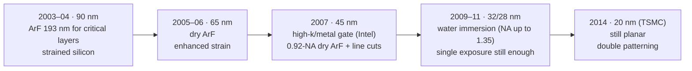

# 90 nm to 28 nm: the last planar decade

The decade from the "90 nm" generation (2003–2004) to "28 nm" (2011) was the last in which
the leading edge used flat, planar transistors and printed its tightest layers in a single
exposure. Two quiet revolutions kept it going. In lithography, 193 nm ArF excimer lasers
replaced 248 nm KrF for critical layers, the planned move to 157 nm was dropped, and water
between lens and wafer raised the numerical aperture past 1. In the transistor, mechanical
strain and then high-k dielectrics with metal gates bought performance that shrinking alone
could no longer deliver.



## ArF takes the critical layers

The 193 nm wavelength was introduced for critical layers by many companies during the 90 nm
generation, which a long list of manufacturers brought to market in 2003–2005 (Fujitsu in
2003, TSMC in 2004, and Intel, IBM, AMD, Samsung and others). Intel's roadmap of the time, for
example, used 193 nm tools for the critical layers of its 90 nm node in 2003. Relaxed layers
stayed on 248 nm KrF and the least critical on i-line: a mix-and-match that continues today,
with ASML still selling KrF and i-line scanners next to its immersion and EUV systems.

Dry ArF scanners climbed in NA along the way: ASML's PAS 5500/1100 (announced in 2000 for
0.10 µm rules) had a 0.75-NA lens, the TWINSCAN XT:1250 0.85 and the XT:1400 (introduced in
2004 for the 65 nm node) 0.93. That is where dry ArF stopped. ASML's current dry systems are
still 0.93-NA tools, specified at ≤ 65 nm half-pitch (XT:1460K, 57 nm with polarized
illumination) and ≤ 57 nm (NXT:1470), i.e. k₁ ≈ 0.27–0.31. A dense grating tighter than about
115 nm pitch was beyond practical single-exposure dry ArF.

!!! info "Why 157 nm never happened"
    The F₂ excimer laser at 157 nm was the planned successor to ArF, targeted at the 65 nm
    generation, and experimental 157 nm exposure tools were built. In May 2003 Intel dropped
    157 nm from its roadmap and the industry followed. The reasons reported at the time: the
    calcium fluoride needed for 157 nm lenses was expensive and scarce, the lens material
    showed unexpectedly high intrinsic birefringence, and 157 nm resists and pellicles were
    still immature. Beyond that, oxygen absorbs so strongly at 157 nm that every beam path
    needs vacuum or nitrogen purge (details on the [VUV excimer page](../sources/vuv-excimer.md);
    the whole story is in the history section's [157 nm detour](../history/157nm-detour.md)).

    highuvlith started life as a vacuum-UV simulator, so the road not taken is fully modeled:
    the F₂ laser at 157.63 nm is a ✅ Implemented source, and the example below compares it
    with dry and wet ArF.

## Water between lens and wafer

The numerical aperture is $\mathrm{NA} = n \sin\theta$, with $n$ the refractive index of the
medium in front of the wafer. In air $n = 1$ and NA can only approach 1. Filling the gap between
the last lens element and the wafer with water, whose refractive index at 193 nm is about 1.44,
lets NA exceed 1: inside the water the wavelength is $193/1.44 \approx 134$ nm, and the same ray
angles resolve 1.44× finer detail.

The idea is old: patents for immersion projection lithography were filed around 1980 (see the
history section on [immersion and multipatterning](../history/immersion-multipatterning.md)).
For 193 nm it was championed by Burn J. Lin of TSMC, who published a non-paraxial scaling
analysis of resolution and depth of focus for immersion in 2002 and a review of its impact on
manufacturing in 2004. In December 2003 TSMC became the first chipmaker to commit to 193 nm
immersion, ordering an ASML XT:1250i, and in early 2004 IBM announced plans of its own. The
tools followed quickly:

| Year | Immersion scanner | NA | Note |
|---|---|---|---|
| 2003 | ASML AT:1150i | 0.75 | prototype; first scanned immersion images |
| 2004 | ASML XT:1250i | 0.85 | announced December 2003 as the first immersion system; shipped late 2004 |
| 2006 | Nikon NSR-S609B | 1.07 | first NA above 1; shipped January 2006 for 55 nm memory |
| 2006 | ASML XT:1700i | 1.20 | first shipped in Q1 2006; brought immersion into volume production |
| 2007 | Nikon NSR-S610C | 1.30 | 45 nm production scanner |
| 2007 | ASML XT:1900i | 1.35 | 40 nm half-pitch; ASML also showed 36.5 nm (k₁ = 0.255) |
| 2009 | ASML NXT:1950i | 1.35 | new dual-stage platform, 38 nm |

Water immersion stopped at NA 1.35. ASML describes it as the largest NA that is practically
possible with water: at NA 1.35 the steepest ray in the water is already at
$\sin\theta = 1.35/1.44 \approx 0.94$. Around 2005–2008 the industry pursued higher-index fluids
and lens crystals that might have reached NA ≈ 1.5–1.65; the effort stalled, and
multipatterning and EUV took over instead. The practical problems of water itself (bubbles,
water marks, particles and chemical exchange with the resist) were solved with protective
top-coats, hydrophobic surfaces, careful wafer routing and the "immersion hood" that keeps a
puddle of water under the moving lens.

At these angles the polarization of the light matters: the two interfering waves of a dense
grating interfere well only when their electric fields are parallel (TE polarization).
Polarized illumination actually arrived first on dry tools (Nikon, 2004) and became standard
at hyper-NA. highuvlith's default scalar model does not capture this; the
[vector imaging](../vector-imaging.md) page describes the polarization-aware path.

Immersion arrived company by company. Memory makers went first, in 2006; IBM's 45 nm SOI
logic process (IEDM 2006) names immersion lithography in its title. Intel stayed with dry ArF at
45 nm, where its process paper describes "0.92NA 193nm dry patterning" and an extra mask to cut
lines at its 160 nm gate pitch, and moved its critical layers to immersion at 32 nm, keeping dry
193 nm or 248 nm for less critical layers.

## Strain and high-k/metal gates

As supply voltages came down, shrinking alone no longer delivered the drive current each
generation needed, and the industry added "performance boosters" (the IRDS's term) to
compensate. Two materials innovations defined the era:

Strained silicon (90 nm)
:   Stretching or compressing the silicon lattice in the channel changes the carrier mobility.
    Intel's 90 nm process (IEDM 2003) strained PMOS channels with embedded silicon-germanium
    source/drain regions (17 % germanium, more than 50 % higher hole mobility) and NMOS
    channels with a highly tensile silicon-nitride cap; its authors believed it was "the first
    time that strained Si transistors are being implemented in a manufacturing technology". The
    65 nm generation enhanced the strain further (23 % germanium).

High-k dielectric and metal gate, HKMG (45 nm at Intel, 2007)
:   The silicon-dioxide gate insulator had stopped at about 1.2 nm, a few atomic layers, where
    quantum tunnelling makes gate leakage a limit; there was essentially no oxide thinning from
    90 to 65 nm. A hafnium-based high-k dielectric can be physically thicker for the same
    capacitance, and a metal gate electrode replaces polysilicon. Intel announced its 45 nm
    HKMG transistors in late January 2007 (Gordon Moore called it "the biggest change in
    transistor technology since the introduction of polysilicon gate MOS transistors in the late
    1960s") and shipped the first products in November 2007. Its flow put the high-k first and
    the metal gate last (a "replacement metal gate"), a choice Intel had made in 2004 although,
    as its engineers later wrote, "many of our peers saw the gate-last process ... as too much
    of a departure and too challenging".
    TSMC skipped 32 nm, going from 40 nm (2008) to 28 nm (2011), and offered high-k/metal gate
    versions of its 28 nm family.

## Pitches and k₁ of the era

Intel published its pitches for every generation of the era; for the foundries, verified
numbers are scarce. What the sources support:

| Process | Year | Contacted gate pitch | Tightest metal pitch | Lithography | k₁ of the tightest pitch |
|---|---|---|---|---|---|
| Intel 65 nm | 2005 | 220 nm | — | dry ArF | 0.53 (gate pitch, at NA 0.93) |
| Intel 45 nm | 2007 | 160 nm | 160 nm | 0.92-NA dry ArF + line-cut mask | 0.38 |
| Intel 32 nm | 2009 | 112.5 nm | 112.5 nm | ArF immersion (critical layers) | 0.39 (NA 1.35) |
| Intel 22 nm | 2011 | 90 nm | 80 nm | ArF immersion, "single patterning" at 80 nm | 0.28 (NA 1.35) |

Down to Intel's 22 nm, a single exposure could still print everything, though at 80 nm pitch
only just (k₁ = 0.28, the practical immersion limit; see
[lithography arithmetic](litho-math.md)). Extra masks appeared anyway, for pattern quality rather
than resolution, such as Intel's 45 nm line cuts. The next step broke the pattern. TSMC's 20 nm
process entered volume production in 2014 "using its innovative double patterning technology",
and double patterning stayed a necessity at 16/14 nm: Intel's 14 nm process used self-aligned
(spacer) double patterning, which Intel said gave "a significant density and yield advantage"
over litho-etch-litho-etch ([22 nm to 10 nm](22-to-10nm.md)).

## The end of planar

Planar scaling ended for electrostatic reasons. As IEEE Spectrum put it in 2011, "as engineers
have shrunk the distance between the source and drain, the gate's control over the transistor
channel has gotten weaker": the drain field reaches under the gate (drain-induced barrier
lowering), off-state leakage and its variability grow, and the supply voltage can no longer
come down. Intel's case for its 22 nm tri-gate transistors was exactly this: "the 'fully
depleted' characteristics of Tri-Gate transistors provide a steeper sub-threshold slope that
reduces leakage current".

Intel switched to tri-gate FinFETs at 22 nm (announced May 2011). The foundries took one more
planar step: TSMC's 20 nm process (2014) was planar, and its first FinFET process was the 16 nm
generation that followed (risk production in 2013). From there on, every leading-edge logic node
used FinFETs, the subject of the [next page](22-to-10nm.md).

## Try it in highuvlith

!!! example "Dry ArF, F₂ and water immersion at the same pitches"
    Compare 193 nm dry (NA 0.93), the abandoned 157 nm F₂ route (NA 0.93) and 193 nm water
    immersion (NA 1.35) on line/space gratings at 130, 100 and 80 nm pitch. With σ = 0.9, a
    pitch prints only while $\lambda/p < \mathrm{NA} (1+\sigma)$: down to about 109 nm for dry
    ArF, 89 nm for F₂ and 75 nm for water immersion.

    <!-- verify-example -->
    ```python
    import highuvlith as huv

    arf = huv.SourceConfig.arf_laser(0.9)                            # ArF excimer, 193.4 nm
    cases = {
        "ArF dry,   NA 0.93": (arf, huv.OpticsConfig(numerical_aperture=0.93)),
        "F2 dry,    NA 0.93": (huv.SourceConfig.f2_laser(0.9), huv.OpticsConfig(numerical_aperture=0.93)),
        "ArF water, NA 1.35": (arf, huv.OpticsConfig.immersion_193i()),  # water, n = 1.437
    }
    for name, (src, opt) in cases.items():
        row = []
        for pitch in (130.0, 100.0, 80.0):
            mask = huv.MaskConfig.line_space(pitch / 2, pitch)
            eng = huv.SimulationEngine(src, opt, mask, grid=huv.GridConfig(64, pitch / 16))
            row.append(round(eng.compute_aerial_image(focus_nm=0.0).image_contrast(), 2))
        print(name, row)
    ```

    ??? success "Output"

        ```text
        ArF dry,   NA 0.93 [0.19, 0.0, 0.0]
        F2 dry,    NA 0.93 [0.47, 0.11, 0.0]
        ArF water, NA 1.35 [0.66, 0.35, 0.04]
        ```

The simulator images the patterns; it does not model transistors, so strain and high-k/metal
gates have no highuvlith counterpart.

## Key takeaways

- 193 nm ArF took over the critical layers during the 90 nm generation (2003–2005); KrF and
  i-line kept the relaxed layers. Dry ArF topped out at NA 0.93.
- Intel dropped 157 nm in 2003 (lens material, birefringence, resists, pellicles), and the
  industry moved to 193 nm water immersion, which reached NA 1.35 by 2007 (water: n ≈ 1.44).
- Strained silicon (Intel 90 nm, 2003) and high-k/metal gates (Intel 45 nm, 2007) kept planar
  transistors improving when shrinking alone no longer did.
- Pitches fell from 220 nm (Intel 65 nm gate pitch) to 80 nm (Intel 22 nm metal), the limit of
  one immersion exposure; TSMC's 20 nm (2014) needed double patterning, and FinFETs took over
  from the next generation on.

## References and further reading

- T. Ghani et al., "A 90nm high volume manufacturing logic technology featuring novel 45nm gate
  length strained silicon CMOS transistors," *IEDM* 2003, 11.6.1–11.6.3,
  [doi:10.1109/IEDM.2003.1269442](https://doi.org/10.1109/IEDM.2003.1269442).
- S. Thompson et al., "A 90 nm logic technology featuring 50 nm strained silicon channel
  transistors, 7 layers of Cu interconnects, low k ILD, and 1 µm² SRAM cell," *IEDM* 2002,
  61–64, [doi:10.1109/IEDM.2002.1175779](https://doi.org/10.1109/IEDM.2002.1175779).
- P. Bai et al., "A 65nm logic technology featuring 35nm gate lengths, enhanced channel
  strain, 8 Cu interconnect layers, low-k ILD and 0.57 µm² SRAM cell," *IEDM* 2004, 657–660,
  [doi:10.1109/IEDM.2004.1419253](https://doi.org/10.1109/IEDM.2004.1419253).
- K. Mistry et al., "A 45nm Logic Technology with High-k+Metal Gate Transistors, Strained
  Silicon, 9 Cu Interconnect Layers, 193nm Dry Patterning, and 100% Pb-free Packaging,"
  *IEDM* 2007, 247–250, [doi:10.1109/IEDM.2007.4418914](https://doi.org/10.1109/IEDM.2007.4418914).
- P. Packan et al., "High performance 32nm logic technology featuring 2nd generation high-k +
  metal gate transistors," *IEDM* 2009,
  [doi:10.1109/IEDM.2009.5424253](https://doi.org/10.1109/IEDM.2009.5424253).
- "High Performance 45-nm SOI Technology with Enhanced Strain, Porous Low-k BEOL, and Immersion
  Lithography" (IBM), *IEDM* 2006,
  [doi:10.1109/IEDM.2006.346879](https://doi.org/10.1109/IEDM.2006.346879).
- M. Bohr, R. Chau, T. Ghani, K. Mistry, "The High-k Solution," *IEEE Spectrum*, October 2007
  ([link](https://spectrum.ieee.org/the-highk-solution)); M. Bohr, "The New Era of Scaling in an
  SoC World," *ISSCC* 2009 (oxide thickness from 90 to 65 nm).
- B. J. Lin, "The k3 coefficient in non-paraxial λ/NA scaling equations for resolution, depth
  of focus, and immersion lithography," *J. Micro/Nanolith. MEMS MOEMS* **1**(1), 7–12 (2002),
  [doi:10.1117/1.1445798](https://doi.org/10.1117/1.1445798); "Immersion lithography and its
  impact on semiconductor manufacturing," **3**(3), 377 (2004),
  [doi:10.1117/1.1756917](https://doi.org/10.1117/1.1756917).
- J. de Klerk et al., "Performance of a 1.35NA ArF immersion lithography system for 40-nm
  applications," *Proc. SPIE* **6520**, 65201Y (2007),
  [doi:10.1117/12.712094](https://doi.org/10.1117/12.712094).
- EE Times, "Intel drops 157-nm tools from lithography roadmap" (May 2003,
  [link](https://www.eetimes.com/intel-drops-157-nm-tools-from-lithography-roadmap/)) and
  "TSMC is first to commit to 193-nm immersion litho" (December 2003,
  [link](https://www.eetimes.com/tsmc-is-first-to-commit-to-193-nm-immersion-litho/)).
- ASML, company history ([link](https://www.asml.com/en/company/about-asml/history)) and product
  pages for [XT:1460K](https://www.asml.com/en/products/duv-lithography-systems/twinscan-xt1460k),
  [NXT:1470](https://www.asml.com/en/products/duv-lithography-systems/twinscan-nxt1470) and
  [NXT:1980Fi](https://www.asml.com/en/products/duv-lithography-systems/twinscan-nxt1980fi)
  (immersion hood); Nikon, NSR-S609B and NSR-S610C announcements
  ([link](https://www.nikonprecision.com/nikon-ships-worlds-first-45-nm-production-immersion-scanner/)).
- M. Bohr and K. Mistry, "Intel's Revolutionary 22 nm Transistor Technology" (May 2011,
  [pdf](https://www.intel.com/content/dam/www/public/us/en/documents/presentation/revolutionary-22nm-transistor-technology-presentation.pdf));
  S. Ahmed and K. Schuegraf, "Transistor Wars," *IEEE Spectrum*, 2011
  ([link](https://spectrum.ieee.org/transistor-wars)).
- TSMC technology pages: [28nm](https://www.tsmc.com/english/dedicatedFoundry/technology/logic/l_28nm),
  [20nm](https://www.tsmc.com/english/dedicatedFoundry/technology/logic/l_20nm) (double
  patterning, 2014) and [16/12nm](https://www.tsmc.com/english/dedicatedFoundry/technology/logic/l_16_12nm).
- Wikipedia: "[90 nm process](https://en.wikipedia.org/wiki/90_nm_process)",
  "[32 nm process](https://en.wikipedia.org/wiki/32_nm_process)",
  "[Immersion lithography](https://en.wikipedia.org/wiki/Immersion_lithography)" and
  "[Photolithography](https://en.wikipedia.org/wiki/Photolithography)" (chronology and
  157 nm history).
