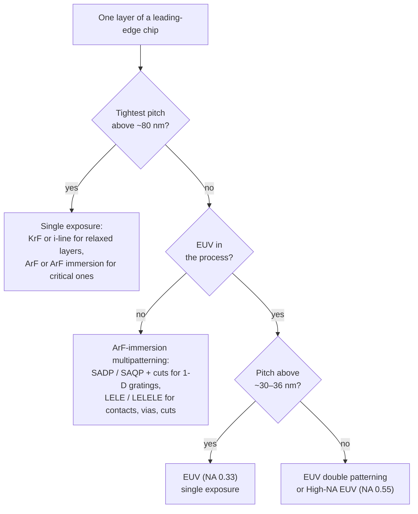

# A tour of modern process nodes

This section follows leading-edge logic manufacturing from the "90 nm" generation of
2003–2004 to the Ångström-class nodes announced for the second half of this decade, with
lithography as the thread. Each page asks the same three questions: what changed in the
transistor, which layers became hard to print, and how the industry printed them anyway.
For how lithography got to 2003, start with the [history section](../history/index.md); for
what might come after the roadmap, see [the future](../future/index.md).

<div class="grid cards" markdown>

-   **[90 nm to 28 nm](90-to-28nm.md)**

    Dry 193 nm, water immersion, strained silicon, high-k/metal gates, and the end of the
    planar transistor.

-   **[22 nm to 10 nm](22-to-10nm.md)**

    FinFETs and the multipatterning era: LELE, SADP, SAQP, cut masks, pitch walk and
    overlay budgets.

-   **[7 nm and 5 nm](7-and-5nm.md)**

    Immersion multipatterning versus EUV insertion, EUV single exposure at 30–40 nm pitch,
    stochastic defects and pellicles.

-   **[3 nm and 2 nm](3nm-and-2nm.md)**

    Tight EUV pitches, EUV double patterning, gate-all-around nanosheets and backside power
    delivery.

-   **[The Ångström era](angstrom-era.md)**

    High-NA EUV, CFETs and the roadmap to the 2030s, with production facts, company plans,
    roadmaps and speculation kept apart.

-   **[Lithography arithmetic](litho-math.md)**

    k₁, depth of focus, photons per contact and overlay budgets, worked for every generation.

</div>

## What a "node" is, and what it isn't

For decades a node name was a real dimension. Gate length and metal half-pitch were roughly
the same number, and that number became the name of the generation. The two drifted apart as
gate lengths shrank faster than wiring and then stopped shrinking, and the names followed
neither. Since at least the late 1990s a node label has been a generation marker chosen by
the manufacturer, not a measurement: no gate length, gate pitch or metal pitch on a "3 nm"
chip is 3 nm. Companies even rename nodes: at its July 2021 "Intel Accelerated" event Intel
relabelled its 10 nm Enhanced SuperFin process as "Intel 7" and its former 7 nm process as
"Intel 4".

!!! warning "Myth: the node name is the feature size"
    TSMC's N3E ("3 nm") process is reported with a contacted gate pitch of 48 nm and has a
    tightest metal pitch of 23 nm (the latter from TSMC's IEDM 2022 paper). That metal pitch
    is roughly eight times the node name, and even its half-pitch is almost four times larger.
    Different companies' "same" node can also differ substantially: compare the Intel and
    TSMC rows in the table below.

The International Roadmap for Devices and Systems (IRDS) states it plainly: "there is not
yet a consensus on the node naming across different foundries and integrated device
manufacturers". Its tables therefore carry a physical label next to the marketing one,
**GxxMxx**: G followed by the contacted gate pitch and M followed by the tightest metal pitch,
both in nm (plus /Tn for the number of stacked device tiers). The IRDS 2024 roadmap, for
example, labels its 2025 generation G48M22. Researchers have proposed going further and
replacing node names with measured densities of logic, memory and memory-to-logic connections
(the "LMC" metric of Wong et al., 2020).

## The pitches that set density

<figure markdown="span">
  { width="720" }
  { width="720" }
  <figcaption>A logic standard cell is a whole number of gate pitches wide and a whole
  number of routing tracks tall. Schematic, not to scale.</figcaption>
</figure>

Logic density comes from a few repeated distances:

Contacted poly pitch (CPP), or contacted gate pitch
:   The distance from one transistor gate to the next with a source/drain contact between
    them. A cell is an integer number of CPPs wide.

Minimum metal pitch (MMP)
:   The tightest line-plus-space of the lowest wiring levels (called M0, M1 or M2 depending on
    the company). Cell height is a number of routing *tracks* times a metal pitch; a
    "6-track" cell is six metal pitches tall.

Fin pitch, sheet width
:   FinFETs place fins on a regular grid, and a transistor's drive current comes from its
    number of fins. Nanosheet transistors replace the fin count with a sheet width that can
    vary.

To first order, cell area scales as CPP × (tracks × MMP). Once pitch scaling slowed, the
industry turned to design-technology co-optimization (DTCO) "scaling boosters" that shrink
cells without shrinking pitches: fewer fins per device, fewer tracks per cell, contacts placed
over the active gate, power rails moved to the back of the wafer, and eventually nFETs stacked
on pFETs. The IRDS 2024 roadmap puts the high-density cell height at 160 nm in 2024, 120 nm in
2025 and 63 nm by 2031, a faster shrink than any pitch in the same table.

These pitches are also what lithography has to print. CPP and fin pitch are regular gratings,
which spacer patterning handles well; metal layers mix dense gratings with irregular line ends
and vias, which is where EUV earned its place. The [lithography arithmetic](litho-math.md)
page turns each generation's pitches into the k₁ value each tool would need.

## From planar to CFET

<figure markdown="span">
  { width="780" }
  { width="780" }
  <figcaption>Each architecture gives the gate more control over the channel (planar →
  FinFET → nanosheet), and CFET then stacks the two transistor types to save area.
  Schematic cross-sections, not to scale.</figcaption>
</figure>

The gate has to switch the channel off hard, and a short channel controlled from one side
leaks. Each architectural step wraps the gate around more of the channel:

| Architecture | Gate control | First in volume production | Status |
|---|---|---|---|
| Planar MOSFET (with strain, high-k/metal gate) | one side | decades of production | ended at the leading edge with TSMC's 20 nm (2014) |
| FinFET / tri-gate | three sides of a fin | Intel 22 nm: manufacturing from late 2011, products April 2012 | still used at TSMC's 3 nm |
| Gate-all-around nanosheet (MBCFET, RibbonFET) | all four sides | Samsung 3 nm, 2022; TSMC N2 and Intel 18A, 2025 | leading edge today |
| Complementary FET (CFET), n and p stacked | all sides, two tiers | research demonstrations | IRDS 2024 projects about 2031; imec about 2033 |

The research lineage is older than the production dates suggest: a fully depleted vertical
"DELTA" transistor was presented by Hitachi researchers at IEDM 1989, and the name *FinFET*
comes from the Berkeley group's 2000 paper on self-aligned double-gate MOSFETs.

## The generations at a glance

Numbers are rounded reported values and vary by company and by source; a dash means we found
no value we could verify (for older nodes, mostly only Intel published its pitches). Each
generation page names its sources. Years are first volume production of the leading
company's process. "Critical-layer lithography" is the tool set for the tightest layers only;
every chip also uses KrF and i-line for relaxed layers.

| Node label | First volume production (approx.) | Examples | Transistor | Contacted gate pitch (nm) | Tightest metal pitch (nm) | Critical-layer lithography |
|---|---|---|---|---|---|---|
| 90 nm | 2003–2004 | Fujitsu, TSMC, Intel, IBM | planar; strained Si (Intel) | — | — | ArF (193 nm) introduced for critical layers |
| 65 nm | 2005–2006 | Intel, AMD, IBM, UMC | planar, strained Si | 220 (Intel) | — | dry ArF |
| 45 / 40 nm | 2007–2008 | Intel, IBM, TSMC (40 nm) | planar; high-k/metal gate at Intel | 160 (Intel) | 160 (Intel) | dry ArF with line cuts (Intel); water immersion in IBM's 45 nm SOI process |
| 32 / 28 nm | 2009–2011 | Intel 32 nm, TSMC 28 nm | planar, high-k/metal gate | 112.5 (Intel) | 112.5 (Intel) | ArF immersion, single exposure |
| 22 / 20 nm | 2011–2014 | Intel 22 nm, TSMC 20 nm | FinFET (Intel), planar (TSMC) | 90 (Intel) | 80 (Intel) | ArF immersion; double patterning at TSMC 20 nm |
| 16 / 14 nm | 2014–2015 | Intel, Samsung, TSMC | FinFET | 70–90 | 52–67 | SADP (Intel); double patterning (foundries) |
| 10 nm | 2016–2019 | Samsung, TSMC, Intel | FinFET | 54–68 | 36–51 | SAQP (Intel); triple patterning (Samsung) |
| 7 nm | 2018–2019 | TSMC, Samsung | FinFET | 54–57 | 36–40 | immersion multipatterning (TSMC N7); first EUV processes (Samsung 7LPP, TSMC N7+) |
| 5 nm | 2020 | TSMC, Samsung | FinFET | 50–57 | 28–36 | EUV on more than ten layers (TSMC N5) |
| 3 nm | 2022–2023 | TSMC (FinFET), Samsung (nanosheet) | FinFET / GAA nanosheet | 45–48 (TSMC) | 23 (TSMC N3E) | EUV; some critical layers double patterned on TSMC's first N3 |
| 2 nm class | 2025 | TSMC N2, Intel 18A, Samsung SF2 | GAA nanosheet; backside power at Intel | ≈ 50 (Intel 18A) | ≈ 32 (Intel 18A) | EUV; High-NA on selected Intel 18A layers (reported, 2026) |
| Announced | 2026–2029 (plans) | TSMC A16, A14, A13/A12; Intel 14A | nanosheet + backside power | — | — | EUV; High-NA for Intel 14A, TSMC from 2030 (plans) |
| IRDS 2024 roadmap | 2027–2033 (projection) | — | nanosheet, then CFET from 2031 | 48 → 44 | 22 → 16 | High-NA EUV (IRDS) |

<figure markdown="span">
  { width="760" }
  { width="760" }
  <figcaption>Gate and metal pitch against the node name. Before 2014 the points are Intel's
  published pitches; afterwards bars span the values reported for different companies (Intel 4
  and 18A labelled separately). Hollow points are IRDS 2024 projections or announced names.
  Data and sources in <code>docs/figures/nodes/make_node_figures.py</code>.</figcaption>
</figure>

## Which layers need which tool

A modern chip has dozens of mask layers, and only a handful of them are hard. A simplified
decision flow, using the single-exposure limits from the
[lithography arithmetic](litho-math.md) page (the EUV figure is what volume production has
achieved, set by stochastics rather than optics):



Real process flows are more tangled than this: a company may keep a layer on immersion
multipatterning even when EUV could print it (because the immersion flow is mature and
cheaper), and it may use EUV for a layer immersion could handle if that removes several masks.
The generation pages show how those trade-offs actually played out.

## What highuvlith can show you along the way

highuvlith is a lithography *imaging* simulator, so it can reproduce the optical part of the
story on this tour: contrast versus pitch for each tool generation (Hopkins/SOCS aerial
imaging, ✅), photon shot noise and its effect on line-edge roughness (✅), LELE double
patterning (🔶 aerial-domain model) and the geometry of spacer patterning. It does not model
transistors, etch or deposition physics, or 3D mask effects; the
[capability matrix](../capability-matrix.md) is the authoritative list.

!!! example "Try it in highuvlith: can a literal 7 nm pitch print?"
    Image equal lines and spaces on an EUV (NA 0.33) system at the metal pitches of the
    "7 nm" and "5 nm" generations, then at a pitch equal to the node name. The first two give
    a usable image; the literal 7 nm pitch gives none. Its first diffraction orders land
    $\lambda/(p \mathrm{NA}) = 13.5/(7 \times 0.33) \approx 5.8$ pupil radii from the zeroth
    order, far beyond the $1 + \sigma = 1.9$ that any source point can bridge.

    <!-- verify-example -->
    ```python
    import highuvlith as huv

    src = huv.SourceConfig.lpp_sn_13nm5(0.9)
    opt = huv.OpticsConfig.euv_nxe()          # NA 0.33, unobscured EUV projection pupil
    cases = {
        "7 nm-class metal pitch": 40.0,
        "5 nm-class metal pitch": 28.0,
        "a literal 7 nm pitch": 7.0,
    }
    for label, pitch in cases.items():
        mask = huv.MaskConfig.line_space(pitch / 2, pitch)
        eng = huv.SimulationEngine(src, opt, mask, grid=huv.GridConfig(128, pitch / 16))
        contrast = eng.compute_aerial_image(focus_nm=0.0).image_contrast()
        print(f"{label:24s} pitch {pitch:4.0f} nm  contrast {contrast:.2f}")
    ```

    ??? success "Output"

        ```text
        7 nm-class metal pitch   pitch   40 nm  contrast 0.75
        5 nm-class metal pitch   pitch   28 nm  contrast 0.32
        a literal 7 nm pitch     pitch    7 nm  contrast 0.00
        ```

## Key takeaways

- A node name is a generation label, not a dimension. The physically meaningful labels are
  pitches: contacted gate pitch and minimum metal pitch (the IRDS "GxxMxx" notation).
- Cell area scales as CPP × tracks × MMP; since the mid-2010s much of the density gain has
  come from DTCO tricks (fewer tracks, fewer fins, backside power), not only from pitches.
- The transistor evolved to keep the gate in control of ever shorter channels: planar →
  FinFET (2011) → gate-all-around nanosheet (2022–2025) → CFET (projected for the early
  2030s).
- Only a few layers are lithographically hard; for those, the choice between immersion
  multipatterning, EUV and High-NA EUV follows from pitch, pattern type and cost.

## References and further reading

- IEEE IRDS, *International Roadmap for Devices and Systems, 2024 Edition: More Moore*
  ([pdf](https://irds.ieee.org/images/files/pdf/2024/2024IRDS_MM.pdf),
  [tables](https://irds.ieee.org/images/files/pdf/2024/2024IRDS_MM_Tables.xlsx)): node-naming
  statement, GxxMxx ground rules, cell-height roadmap, CFET timing.
- Intel, "[Intel Accelerates Process and Packaging Innovations](https://www.intc.com/news-events/press-releases/detail/1486/intel-accelerates-process-and-packaging-innovations)",
  26 July 2021 (the "Intel 7" / "Intel 4" renaming).
- S. K. Moore, "A Better Way to Measure Progress in Semiconductors," *IEEE Spectrum*, 21 July
  2020 ([link](https://spectrum.ieee.org/a-better-way-to-measure-progress-in-semiconductors)).
- H.-S. P. Wong, K. Akarvardar, D. Antoniadis, J. Bokor, C. Hu, T.-J. King-Liu et al.,
  "A Density Metric for Semiconductor Technology," *Proc. IEEE* **108**(4), 478–482 (2020),
  [doi:10.1109/JPROC.2020.2981715](https://doi.org/10.1109/JPROC.2020.2981715).
- S.-Y. Wu et al., "A 3nm CMOS FinFlex™ Platform Technology with Enhanced Power Efficiency and
  Performance for Mobile SoC and High Performance Computing Applications," *IEDM* 2022,
  [doi:10.1109/IEDM45625.2022.10019498](https://doi.org/10.1109/IEDM45625.2022.10019498).
- S. K. Moore, "The Next 15 Years of Moore's Law, According to Imec," *IEEE Spectrum*,
  19 May 2026 ([link](https://spectrum.ieee.org/semiconductor-technology-roadmap)): imec's
  roadmap with CFETs from about 2033.
- D. Hisamoto, T. Kaga, Y. Kawamoto, E. Takeda, "A fully depleted lean-channel transistor
  (DELTA) — a novel vertical ultra thin SOI MOSFET," *IEDM Tech. Dig.* 1989, 833–836,
  [doi:10.1109/IEDM.1989.74182](https://doi.org/10.1109/IEDM.1989.74182).
- D. Hisamoto et al., "FinFET — a self-aligned double-gate MOSFET scalable to 20 nm,"
  *IEEE Trans. Electron Devices* **47**(12), 2320–2325 (2000),
  [doi:10.1109/16.887014](https://doi.org/10.1109/16.887014).
- The generation pages list the company papers, press releases and teardown analyses behind
  every row of the table above.
