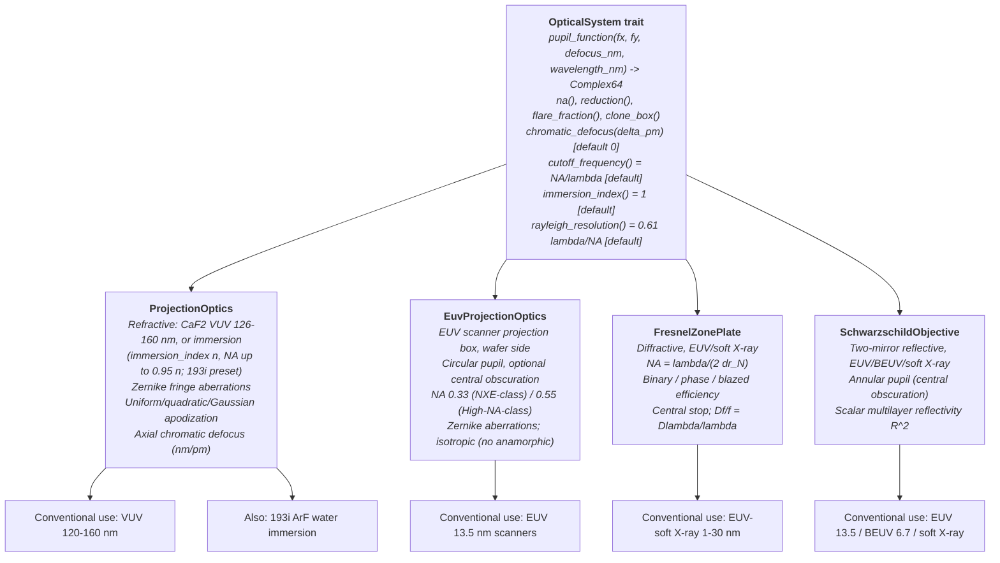

# Optical Systems

**Status:** ✅ Implemented — four `OpticalSystem` implementations behind one trait (refractive dry/immersion, zone plate, Schwarzschild, EUV projection 🔶); scalar pupils with the exact (non-paraxial) defocus phase in the image medium; polarization / vector effects are applied by the imaging engine through `optics::vector`, not by these pupils.

## Overview

The aerial-image engine never sees a lens, mirror, or zone plate — it sees a complex pupil function. The [`OpticalSystem`](../crates/highuvlith-core/src/optics/mod.rs) trait reduces every optic to `P(fx, fy; z, λ)` whose **magnitude** is the pupil transmission (apodization, obscuration, mirror reflectivity) and whose **phase** carries aberrations plus defocus, together with the scalar queries the pipeline needs (NA, flare, chromatic defocus). That is why refractive VUV/DUV lenses (dry or water immersion), diffractive X-ray zone plates, and reflective EUV objectives and scanner projection optics all run through the identical Hopkins TCC/SOCS code in [pipeline.md](./pipeline.md).



## The trait contract

```rust
pub trait OpticalSystem: Send + Sync {
    fn pupil_function(&self, fx_norm: f64, fy_norm: f64,
                      defocus_nm: f64, wavelength_nm: f64) -> Complex64;
    fn na(&self) -> f64;
    fn reduction(&self) -> f64;
    fn flare_fraction(&self) -> f64;
    fn clone_box(&self) -> Box<dyn OpticalSystem>;                           // engine keeps a copy
    fn chromatic_defocus(&self, delta_wavelength_pm: f64) -> f64 { 0.0 }  // default achromatic
    fn cutoff_frequency(&self, wavelength_nm: f64) -> f64 { self.na() / wavelength_nm }
    fn immersion_index(&self) -> f64 { 1.0 }                               // image-space medium
    fn rayleigh_resolution(&self, wavelength_nm: f64) -> f64 { 0.61 * wavelength_nm / self.na() }
}
```

Conventions the imaging engine relies on:

- `(fx, fy)` are normalized to `cutoff_frequency(λ)` at the wavelength being imaged; every implementation returns zero for $\rho > 1$.
- `pupil_function(…, z, λ)` is the pupil **at wavelength λ with the image plane `z` away from best focus at λ**. It must not contain a chromatic focus shift: the engine adds `chromatic_defocus(Δλ_pm)` (relative to the source center wavelength) explicitly in `compute_multiwavelength` and `compute_polychromatic`, so nothing is counted twice.
- `clone_box` lets `AerialImageEngine` own the optics; it re-evaluates the pupil whenever it builds kernels for a new focus plane or wavelength. `Box<dyn OpticalSystem>` implements `Clone` through it.
- `immersion_index()` is the refractive index of the image-space medium (1 dry/vacuum). The defocus phase is evaluated in it, the engine requires `na() < immersion_index()`, and vector imaging requires `VectorSettings::image_index` to equal it (inherited when left at 1.0) — one image-space medium for the defocus phase and the vector fields.
- `reduction()` enters only the vector radiometric (obliquity) factor: the engine copies it into `VectorSettings::reduction`. Mask coordinates are wafer-scale everywhere.
- **Pupil magnitude sets absolute radiometry only.** Images are reported as relative intensity by default — divided by the clear-field intensity $I_{\text{clear}} = \sum_s w_s |P(s)|^2$ of the same illumination, optics and focus — so a clear mask images to 1 for every optic here (zone-plate efficiency, mirror reflectivity, obscuration and apodization included). The absolute value is `AerialImageEngine::clear_field_intensity(z)`; `ImageNormalization::Absolute` skips the division (see [pipeline.md](./pipeline.md)).

### Defocus phase

All implementations use the shared helpers `optics::defocus_phase_in_medium` / `optics::defocus_phase` (the latter is the `n = 1` case): the exact phase that the plane-wave order at $n \sin\theta = \mathrm{NA} \rho$ accumulates over a focus displacement $z$ in an image-space medium of index $n$, relative to the axial wave (angular-spectrum propagation; $\lambda$ is the vacuum wavelength):

```math
\Phi_z(\rho) = \frac{2\pi n}{\lambda}\, z\, \left(1 - \sqrt{1 - \left(\frac{\mathrm{NA}\,\rho}{n}\right)^2}\right)
\;\xrightarrow{\ \mathrm{NA}\rho \ll n\ }\; \frac{\pi z\, \mathrm{NA}^2 \rho^2}{n\,\lambda},
```

evaluated as $(2\pi n/\lambda) z \sin^2\theta/(1+\cos\theta)$ to avoid cancellation. It is continuous in $n$ and reduces exactly to the dry formula $(2\pi/\lambda) z (1 - \sqrt{1-\mathrm{NA}^2\rho^2})$ at $n = 1$. The paraxial form (the v1 behavior, generalized to $n$) is selected per optic with `paraxial_defocus = true` (a `#[serde(default)]` field, so old configs parse). Dry: the two agree to $\sin^2\theta/4$ relative (0.25 % at NA 0.1); at NA 0.8 the paraxial phase is 20 % short at the pupil edge and images at two Rayleigh depths differ by ~0.1 in intensity — the known failure of paraxial λ/NA² depth-of-focus scaling at high NA (Lin 2002). In water at fixed NA·ρ the phase is smaller (1.84 → 1.03 rad at NA·ρ = 0.9, z = 100 nm, λ = 193 nm): immersion buys depth of focus. The pupil is

```math
P(\rho, \theta) = A(\rho)\, e^{\,i\left( W_{\mathrm{aberr}}(\rho,\theta) + \Phi_z(\rho) \right)}, \qquad \rho \le 1 .
```

Honesty: $n$ is the immersion medium (water for 193i, 1 otherwise); focus *inside the resist* (index of the resist) is not modeled by the pupil — the volumetric path maps depth to defocus with its own $z/n$ approximation.

`chromatic_defocus` is the hook both spectral paths use: each spectral sample's wavelength offset (in pm) becomes an extra focus shift. `compute_multiwavelength` additionally rebuilds the kernels at every wavelength (cutoff, source-point spacing and pupil all at λ_i); `compute_polychromatic` keeps the center-wavelength kernels (narrow-band approximation) — see [pipeline.md](./pipeline.md).

## ProjectionOptics — refractive (dry CaF2, or immersion) ✅

[`ProjectionOptics`](../crates/highuvlith-core/src/optics/mod.rs) models a refractive projection lens: circular pupil, Fringe-Zernike aberration phase from user-supplied `(index, coefficient_in_waves)` pairs (table extends to fringe index 48 in `math/zernike`), radial apodization, uniform flare, and a **linear axial-chromatic coefficient** in nm of defocus per pm of wavelength offset. `ProjectionOptics::new(na)` builds a **dry** lens: it validates NA ∈ (0, 1) (unchanged — NA ≥ 1 is rejected) and defaults to 4× reduction, 2% flare, and `axial_chromatic_nm_per_pm = 15.0` — the CaF2-only value at 157 nm (no achromatization partner exists at VUV; typical published values are 10–30 nm/pm). Apodization options: `Uniform`, `Quadratic` T(ρ) = 1 − αρ², `Gaussian` T(ρ) = exp(−αρ²). Convenience: `rayleigh_dof(λ) = n λ/(2 NA²)` (λ/(2 NA²) dry).

### Immersion ✅

Immersion lithography fills the gap between the last lens element and the wafer with a liquid of index $n > 1$, so the image-side numerical aperture $\mathrm{NA} = n \sin\theta_{\max}$ can exceed 1:

- `ProjectionOptics::immersion(na, immersion_index)` — validates $n \ge 1$ and $0 < \mathrm{NA} \le 0.95 n$ (`IMMERSION_NA_MARGIN`: the marginal ray must stay clear of grazing incidence in the fluid); chromatic aberration defaults to 0 (the 157 nm CaF2 value of `new` does not apply — set your lens's coefficient).
- `ProjectionOptics::immersion_193i()` — the ArF water-immersion preset: NA 1.35, $n$ = `WATER_INDEX_193NM` = 1.437 (published measurements of ultrapure water near 193.4 nm and room temperature give 1.436–1.437; 1.44 is the common rounded figure), 4×, 2 % flare. NA/n = 0.94.
- What changes physically: the defocus phase is evaluated in the medium (above), `immersion_index()` reports $n$, and vector imaging evaluates the field in the medium. What does not: the scalar spatial-frequency cutoff stays $\mathrm{NA}/\lambda$ (the medium changes angles, not the mask frequencies that pass), so resolution follows $\lambda/(\mathrm{NA}(1+\sigma))$ with the larger NA: at λ = 193 nm with an annular σ 0.7–0.9 source a 90 nm pitch is uniform through a dry NA 0.93 lens but resolved at NA 1.35 (test `immersion_resolves_a_pitch_dry_optics_cannot`).
- Honesty: at NA 1.35 the scalar pupil misses polarization effects (TM contrast loss) — use `ImagingModel::Vector`, which takes $n$ as the image-medium index. Water absorption, bubbles, and temperature dependence of $n$ are not modeled.

| Field | Unit | Consumed by | Status |
|-------|------|-------------|--------|
| `na` | — | Pupil cutoff, defocus phase, TCC, resolution/DOF queries | live |
| `reduction` | × | Vector radiometric factor (engine copies it into `VectorSettings`); inert in scalar mode | live (vector) |
| `zernike_coefficients` | waves | Pupil phase in every TCC build | live |
| `flare_fraction` | 0–1 | Uniform flare blend in the aerial image | live |
| `axial_chromatic_nm_per_pm` | nm/pm | `chromatic_defocus` → per-sample focus shifts in `compute_multiwavelength` / `compute_polychromatic` | live |
| `apodization` | enum | Pupil magnitude (absolute radiometry; relative images are clear-field normalized) | live |
| `paraxial_defocus` | bool | Selects the paraxial instead of the exact defocus phase (default `false`) | live |
| `immersion_index` | — | Image-space medium: defocus phase, NA limit, vector image index (default 1.0 = dry) | live |

<figure markdown="span">


<figcaption>Simulated contrast of 1:1 lines vs pitch for ArF (193.368 nm, conventional σ 0.9, no flare): dry optics at NA 0.93 against water immersion at NA 1.35 (n = 1.437, <code>OpticsConfig.immersion</code>). The scalar curves show the NA gain; the vector curves show why 193i needs polarization control — unpolarized light loses much of the gain, TE (y-) polarized light keeps it. Models: immersion optics ✅, scalar and vector imaging ✅ (thin mask; no water absorption or in-resist focus).</figcaption>
</figure>

## EuvProjectionOptics — EUV scanner projection optics 🔶

[`EuvProjectionOptics`](../crates/highuvlith-core/src/optics/euv.rs) is the wafer-side pupil of an EUV scanner projection box: circular pupil of numerical aperture NA with an optional **central obscuration** (radius `central_obscuration` as a fraction of NA, default 0), Fringe-Zernike aberrations, the exact defocus phase in vacuum, a uniform flare fraction (0 in the presets — flare is not modeled by default; set a measured value), and an intensity transmission `transmission` (default 1; scales only absolute radiometry). Presets:

| Preset | NA | Central obscuration | Reduction | Basis |
|--------|----|---------------------|-----------|-------|
| `nxe_033()` | 0.33 | 0 | 4× | 0.33-NA (NXE-class) EUV projection optics — unobscured pupil |
| `high_na_055()` | 0.55 | 0.2·NA (**assumed**) | 4× (isotropic stand-in) | 0.55-NA (High-NA / EXE-class) — centrally obscured pupil (Levinson 2022) |

Honest labels (why this is 🔶, not ✅):

- **Isotropic wafer-side pupil.** High-NA EUV uses *anamorphic* magnification (4× in the slit direction, 8× in the scan direction); that changes mask-side dimensions and angles only. Mask coordinates in highuvlith are wafer-scale and the pupil is circular, so anamorphic effects are **not modeled**; `reduction` = 4 feeds only the vector radiometric factor.
- **Obscuration size is an assumption.** High-NA projection optics are centrally obscured; 0.2·NA is a representative value, not a published design figure — set `central_obscuration` for your study. The obscuration blocks the zero order of source points with |σ| < 0.2 and removes low pupil frequencies; with near-on-axis illumination imaging becomes dark field (the engine then reports absolute rather than relative intensity).
- **Not modeled:** mask 3D effects (absorber thickness, shadowing at the 6° chief ray), the non-telecentric chief ray, and polarization (use `ImagingModel::Vector`; at NA 0.55 unpolarized imaging already loses some contrast). Multilayer angular/spectral reflectance is off by default (uniform pupil) and available through the optional `multilayer` field (below).

| Field | Unit | Consumed by | Status |
|-------|------|-------------|--------|
| `numerical_aperture` | — | Pupil cutoff, defocus phase, TCC | live |
| `central_obscuration` | 0–1 of NA | Central pupil hole | live |
| `reduction` | × | Vector radiometric factor only | live (vector) |
| `zernike_coefficients` | waves | Pupil phase | live |
| `flare` | 0–1 | Uniform flare blend | live |
| `transmission` | 0–1 | Pupil amplitude √T → absolute radiometry only | live (absolute mode) |
| `paraxial_defocus` | bool | Paraxial instead of exact defocus phase | live |
| `multilayer` | `Option<MultilayerPupil>` | Angle-dependent multilayer apodization + phase (default `None` = uniform pupil) | live (opt-in) |

## FresnelZonePlate — diffractive ✅

[`FresnelZonePlate`](../crates/highuvlith-core/src/optics/zone_plate.rs) models the workhorse optic of X-ray microscopy. Zone radii follow $r_n = \sqrt{n \lambda f}$; resolution is set by the outermost zone width, giving

```math
\mathrm{NA} = \frac{\lambda}{2\,\Delta r_N}, \qquad f = \frac{r_N^2}{N \lambda}, \qquad \frac{\Delta f}{f} = \frac{\Delta\lambda}{\lambda}
```

The last relation is the zone plate's defining weakness: it is **strongly chromatic** (`chromatic_defocus_per_pm` = f·10⁻³/λ per pm), which is why zone-plate systems demand narrow-band or monochromatized sources. Because the outermost zone diffracts at $\sin\theta = \lambda/(2\Delta r_N)$, the transmitted spatial-frequency cutoff $1/(2\Delta r_N)$ does **not** depend on wavelength: `cutoff_frequency` and `rayleigh_resolution` (= 1.22 Δr_N) are overridden accordingly, and the defocus phase uses the NA at the imaging wavelength, $\mathrm{NA}(\lambda) = \lambda/(2\Delta r_N)$ (`na()` reports the design-wavelength value). Following the trait convention, the pupil carries **no** chromatic phase: defocus is measured from best focus at the imaging wavelength, and the in-band focal shift relative to the source center wavelength comes from `chromatic_defocus` in the spectral imaging paths. (Up to v1 the pupil also added an off-design focal-shift phase, which `compute_polychromatic` then counted a second time.) The static focal shift of operating a zone plate away from its design wavelength is therefore treated as refocused, not simulated. First-order diffraction efficiency depends on the zone profile — `ZonePlateEfficiency::Binary` (1/π² ≈ 10.1%), `Phase` (4/π² ≈ 40.5% for a π-shift), `Blazed { efficiency }` (up to ~100% theoretical) — applied as a uniform pupil amplitude `sqrt(efficiency)` (absolute clear-field intensity η; relative images are normalized to 1). An optional central stop blocks ρ < `central_stop_fraction` (zero-order suppression); `flare_fraction()` is a two-value heuristic: 5% with a stop, 15% without (zero-order leakage).

| Field | Unit | Consumed by | Status |
|-------|------|-------------|--------|
| `outermost_zone_width_nm` | nm | Cutoff 1/(2Δr_N), NA(λ), resolution, defocus phase | live |
| `num_zones` | — | Focal length → chromatic defocus | live |
| `design_wavelength_nm` | nm | `na()` (design value), focal length → chromatic defocus | live |
| `efficiency` | enum | Pupil amplitude | live |
| `central_stop_fraction` | 0–1 | Annular pupil hole + flare heuristic | live |
| `reduction_ratio` | × | Vector radiometric factor only (1:1 typical) | live (vector) |
| `paraxial_defocus` | bool | Paraxial instead of exact defocus phase (default `false`) | live |

## SchwarzschildObjective — reflective ✅

[`SchwarzschildObjective`](../crates/highuvlith-core/src/optics/schwarzschild.rs) models the two-concentric-mirror objective used where no lens can exist. The secondary mirror shadows the pupil center, producing an **annular pupil**: zero for ρ < `obscuration_ratio` (typical 0.2–0.4). Mirror coatings enter as a single scalar per-mirror reflectivity; the two-mirror system transmission R² is applied as pupil amplitude √(R²) = R. Presets:

| Preset | NA | Obscuration | R (per mirror) | Coating basis |
|--------|----|-------------|----------------|---------------|
| `euv_standard()` | 0.33 | 0.25 | 0.67 | Mo/Si multilayer at 13.5 nm |
| `beuv()` | 0.25 | 0.30 | 0.50 | La/B4C multilayer at 6.7 nm |
| `soft_xray(na)` | user | 0.30 | 0.30 | grazing-incidence / multilayer, ~1 nm |

Honesty: by default the reflectivity is a **scalar constant** — a documented choice, not a hard limitation: attach a [`MultilayerPupil`](#multilayer-pupil--angle-dependent-mirror-response-) (`multilayer` field) to replace it with the angle-dependent Mo/Si or La/B₄C multilayer response across the pupil. There is no per-mirror wavefront error (the pupil phase is defocus only, no Zernike terms on this type), and the trait's default `chromatic_defocus = 0` applies (mirrors are achromatic to first order; the multilayer's spectral response enters per wavelength in `compute_multiwavelength` when a `MultilayerPupil` is attached). The obscuration also removes the zero order of near-axis source points, so the absolute clear-field intensity is $R^2 \times$ (fraction of the source outside the obscuration); relative images are normalized to 1 (dark field — clear field below 1 % of $R^2$, e.g. a near-coherent beam inside the obscuration — stays absolute).

| Field | Unit | Consumed by | Status |
|-------|------|-------------|--------|
| `numerical_aperture` | — | Pupil cutoff, defocus phase, TCC | live |
| `obscuration_ratio` | 0–1 | Annular pupil hole | live |
| `reduction_ratio` | × | Vector radiometric factor only | live (vector) |
| `mirror_reflectivity` | 0–1 | Pupil amplitude (R per mirror, R² system); ignored when `multilayer` is set | live |
| `flare` | 0–1 | Uniform flare blend | live |
| `paraxial_defocus` | bool | Paraxial instead of exact defocus phase (default `false`) | live |
| `multilayer` | `Option<MultilayerPupil>` | Angle-dependent multilayer apodization + phase replacing the constant (default `None`) | live (opt-in) |

## Multilayer pupil — angle-dependent mirror response 🔶

[`MultilayerPupil`](../crates/highuvlith-core/src/optics/multilayer_pupil.rs) (opt-in, `multilayer` field of `SchwarzschildObjective` and `EuvProjectionOptics`) replaces the scalar-constant mirror reflectivity with the angle-dependent response of Bragg multilayer coatings. Each ray through the wafer-side pupil point $p$ (normalized to NA) meets mirror $j$ at the incidence angle

```math
\theta_j(p) = \left| \theta_{c,j} + t_j \, (p \cdot u_j) + g_j \, |p|^2 \right| ,
```

a user-supplied `MirrorAngleMap` (`center_deg` $\theta_c$, linear `tilt_deg` $t$ along `azimuth_deg`, rotationally symmetric `radial_deg` $g$). The coating's s and p amplitude reflectances $r_s(\lambda, \theta)$, $r_p(\lambda, \theta)$ come from WP-E1's [`MultilayerMirror`](../crates/highuvlith-core/src/materials/multilayer.rs) (Parratt recursion with Névot–Croce roughness, Henke optical constants; Mo/Si 40×6.9 nm: 72.9 % at 13.5 nm, normal incidence), multiplied along the mirror train and combined into one scalar pupil factor:

```math
R_s(p) = \prod_j r_s(\lambda, \theta_j(p)), \qquad R_p(p) = \prod_j r_p(\lambda, \theta_j(p)), \qquad
M(p) = \sqrt{\frac{|R_s|^2 + |R_p|^2}{2}} \; e^{\, i \arg(R_s + R_p)} .
```

$|M|^2$ is the unpolarized intensity transmission of the mirror train along that ray; $\arg M$ its phase. The response is tabulated once per wavelength (0°–60°, 0.02° steps, cubic interpolation, relative error ≲ 1e-6) when the engine calls `OpticalSystem::prepare(λ)` before a kernel build — pupil sampling never re-runs the Parratt recursion, and images reuse the kernels.

**With the default clear-field normalization the overall reflectance level cancels**: a uniform angle map (same angle everywhere) leaves relative images unchanged and only rescales `clear_field_intensity` (by $|r|^4$ for two mirrors) — test `uniform_multilayer_reflectance_is_only_a_dose_change`. The angle *dependence* shows up in the image as pupil apodization and phase, not as a dose change: with 0° at the pupil centre rising to 15° at the rim on two Mo/Si mirrors, a 60 nm grating at 13.5 nm / NA 0.33 loses in-focus contrast (rim darkened, reflection phase acting as an aberration) and its best focus moves (contrast higher at z = +60 nm than at z = 0) — test `angle_dependent_multilayer_apodizes_and_shifts_focus`.

Honest labels (🔶): the angle maps are **user assumptions** (first/second-order models; real maps come from ray-tracing the actual design, which the repo does not contain); all mirrors share one coating and one s/p basis per ray (coaxial); the scalar polarization average above is applied even in vector mode (polarization-resolved $r_s \ne r_p$ on the TE/TM field components is not modeled); `mirror_reflectivity` (Schwarzschild) is ignored while a multilayer is attached, `transmission` (EUV projection) multiplies it. Python: `OpticsConfig.schwarzschild(...).with_multilayer_pupil([(center_deg, tilt_deg, azimuth_deg, radial_deg), ...], coating="mo_si", periods=40, period_nm=6.9, gamma=0.4)` (also for `euv_projection` optics). CLI: the `[optics.multilayer_pupil]` table with the same parameters ([configuration](configuration.md#optics)).

## Honesty rules: wavelength ranges are conventional, not enforced

Nothing in the trait stops you evaluating a CaF2 lens at 13.5 nm — the math will happily produce an image. **Physically, no transparent lens material exists below ~110 nm** (CaF2's transmission edge), so refractive results at shorter wavelengths are not physical. The frontends guard this:

- **CLI** ([config.rs](../crates/highuvlith-cli/src/config.rs)): selecting `type = "refractive"` with a source wavelength below 50 nm prints a warning — *"no transparent lens material exists below ~110 nm; results are not physical"* — and suggests `type = "schwarzschild"` or `"zone_plate"`. The `schwarzschild` type auto-picks the preset by band (soft-X-ray < 3 nm, BEUV < 10 nm, else EUV) and then applies your NA/flare; `zone_plate` defaults the outer zone width to λ/(2 NA) if unset.
- **GUI** ([imaging.rs](../crates/highuvlith-gui/src/imaging.rs)): the default *Auto* optics choose a refractive lens above 110 nm and reflective EUV projection optics below; a refractive lens forced below 110 nm is flagged as unphysical in the panel (see [gui.md](gui.md#optics)).
- The stated "conventional use" bands in the diagram above are documentation, not code — pick the optic that is physical for your source.

## Usage

<!-- verify-example -->
```python
import highuvlith as huv

# All optics families are available from Python; .kind reports the family
optics = huv.OpticsConfig(numerical_aperture=0.75, reduction=4.0, flare_fraction=0.02)
arf_i  = huv.OpticsConfig.immersion_193i()             # NA 1.35 in water (n = 1.437)
wet    = huv.OpticsConfig.immersion(numerical_aperture=1.2, immersion_index=1.437)
euv    = huv.OpticsConfig.schwarzschild(numerical_aperture=0.33, mirror_reflectivity=0.67)
nxe    = huv.OpticsConfig.euv_nxe()                     # NA 0.33, unobscured
hna    = huv.OpticsConfig.euv_high_na()                 # NA 0.55, central obscuration 0.2 NA (assumed)
custom = huv.OpticsConfig.euv_projection(numerical_aperture=0.55, central_obscuration=0.15)
xray   = huv.OpticsConfig.zone_plate(outer_zone_width_nm=20.0, design_wavelength_nm=2.5)
```

```toml
# CLI: [optics] table, type = "refractive" (default) | "schwarzschild" | "zone_plate" | "euv_projection"
[optics]
type = "schwarzschild"        # band-matched preset, then na/flare applied
na = 0.33
flare_fraction = 0.03

# Water immersion (refractive): NA up to 0.95 × immersion_index
# [optics]
# na = 1.35
# immersion_index = 1.437

# EUV scanner projection optics (isotropic wafer-side pupil):
# [optics]
# type = "euv_projection"
# na = 0.55
# central_obscuration = 0.2   # fraction of NA; 0 for NA 0.33
# flare_fraction = 0.0

# Zone plate variant:
# [optics]
# type = "zone_plate"
# na = 0.1
# outer_zone_width_nm = 25.0  # optional; defaults to lambda / (2 * na)
```

## Validation

- [optics/mod.rs](../crates/highuvlith-core/src/optics/mod.rs): `test_cutoff_frequency`, `test_rayleigh_resolution`, `test_pupil_inside` / `test_pupil_outside` / `test_pupil_at_edge`, `test_defocus_adds_phase`, `test_aberrated_pupil`, `test_invalid_na_zero`, `test_invalid_na_one`; `test_defocus_phase_fixtures` (exact and paraxial phases vs independently computed values), `test_defocus_phase_paraxial_limit_and_scaling` (ratio → 1 + sin²θ/4, linear in z, ∝ 1/λ), `test_pupil_uses_exact_defocus_by_default`, `test_paraxial_flag_defaults_false_in_serde`, `test_clone_box_preserves_pupil`.
- [zone_plate.rs](../crates/highuvlith-core/src/optics/zone_plate.rs): `test_zone_plate_na` (NA = λ/(2Δr_N)), `test_zone_plate_resolution` (≈ Δr_N), `test_zone_plate_focal_length`, `test_efficiency_values` (1/π², 4/π²), `test_central_stop`, `test_strong_chromatic_aberration`, `test_invalid_zero_zone_width`, `test_cutoff_is_wavelength_independent`, `test_pupil_defocus_uses_wavelength_na_and_no_chromatic_phase`.
- [schwarzschild.rs](../crates/highuvlith-core/src/optics/schwarzschild.rs): `test_euv_na`, `test_annular_pupil`, `test_system_transmission` (0.67²), `test_beuv_lower_reflectivity`, `test_euv_resolution` (≈ 24.9 nm at 13.5 nm), `test_soft_xray_invalid_na`, `test_defocus_matches_shared_formula`.
- Immersion ([optics/mod.rs](../crates/highuvlith-core/src/optics/mod.rs)): `test_defocus_phase_in_medium_fixtures` (exact and paraxial medium phases vs independently computed values), `test_defocus_phase_in_medium_is_continuous_at_n_1` (bit-identical to the dry formula at n = 1, O(Δn) change for n = 1 + 1e-9), `test_immersion_constructors_and_validation` (`new(1.2)` still rejected, NA > 0.95 n rejected, DOF = nλ/(2NA²)), `test_immersion_pupil_uses_medium_defocus`.
- [euv.rs](../crates/highuvlith-core/src/optics/euv.rs): `test_presets`, `test_obscured_pupil_and_defocus`, `test_transmission_and_aberrations`, `test_validation_and_serde_defaults`.
- [multilayer_pupil.rs](../crates/highuvlith-core/src/optics/multilayer_pupil.rs): `angle_map_geometry`, `normal_incidence_two_mirror_transmission` ($r_s = r_p$ at 0°, $|M|^2 = R(0)^2$ vs the direct multilayer reflectance to 1e-12, R(0°) ≈ 0.729), `interpolated_response_matches_direct_evaluation` (≤ 2e-6), `steep_angles_apodize_the_pupil_edge`, `validation_prepare_and_serde`; Schwarzschild `test_multilayer_pupil_replaces_constant_reflectivity`; engine tests `uniform_multilayer_reflectance_is_only_a_dose_change`, `angle_dependent_multilayer_apodizes_and_shifts_focus`, `multilayer_pupil_rejects_wavelengths_without_optical_constants`.
- Imaging with these pupils: `nonparaxial_defocus_reduces_to_paraxial_at_low_na` (≤ 3e-3 at NA 0.1, > 0.03 at NA 0.8) and `test_coherent_three_beam_image_closed_form` (exact defocus phase inside a coherent grating image, to 1e-12) — see [pipeline.md](./pipeline.md#validation). [tests/imaging_optics_presets.rs](../crates/highuvlith-core/tests/imaging_optics_presets.rs): `immersion_resolves_a_pitch_dry_optics_cannot` (90 nm at 193 nm: dry NA 0.93 uniform, NA 1.35 water resolved), `immersion_defocus_uses_the_medium_index` (closed-form coherent grating image with the water phase, 1e-12), `engine_rejects_na_above_the_medium_index`, `vector_imaging_inherits_the_immersion_index`, `high_na_resolves_a_pitch_below_the_nxe_limit` (18 nm at 13.5 nm: NA 0.33 uniform, NA 0.55 resolved), `obscured_pupil_with_on_axis_light_is_dark_field`, `lossy_pupils_image_a_clear_field_to_exactly_one` (apodized, Schwarzschild, obscured High-NA, zone plate; clear field vs an independent Σ w|P|²).

## References

- M. Born & E. Wolf, *Principles of Optics*, 7th ed. — pupil function, Zernike polynomials, defocus.
- D. Attwood & A. Sakdinawat, *X-Rays and Extreme Ultraviolet Radiation*, 2nd ed. — zone plate relations (NA = λ/2Δr, Δf/f = Δλ/λ, efficiency by profile) and multilayer reflectors.
- K. Schwarzschild, "Untersuchungen zur geometrischen Optik II" (1905) — the two-mirror aplanat.
- E. Louis et al., "Nanometer interface and materials control for multilayer EUV-optical applications," *Prog. Surf. Sci.* **86** (2011) — Mo/Si reflectivity ~0.67–0.70 at 13.5 nm.
- B. J. Lin, "The k3 coefficient in non-paraxial λ/NA scaling equations for resolution, depth of focus, and immersion lithography," *J. Micro/Nanolith. MEMS MOEMS* **1**(1), 7–12 (2002), doi:10.1117/1.1445798 — non-paraxial depth of focus; paraxial λ/NA² scaling overestimates DOF at high NA.
- H. J. Levinson, "High-NA EUV lithography: current status and outlook for the future," *Jpn. J. Appl. Phys.* **61**, SD0803 (2022), doi:10.35848/1347-4065/ac49fa — High-NA EUV projection optics with central obscuration and anamorphic 4×/8× magnification.
