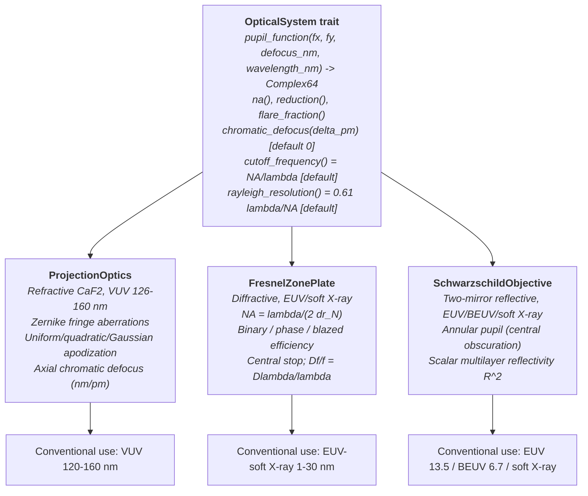

# Optical Systems

**Status:** ✅ Implemented — three `OpticalSystem` implementations behind one trait; scalar pupil model throughout (no polarization / vector high-NA effects).

## Overview

The aerial-image engine never sees a lens, mirror, or zone plate — it sees a complex pupil function. The [`OpticalSystem`](../crates/highuvlith-core/src/optics/mod.rs) trait reduces every optic to `P(fx, fy; z, λ)` whose **magnitude** is the pupil transmission (apodization, obscuration, mirror reflectivity) and whose **phase** carries aberrations plus defocus, together with the scalar queries the pipeline needs (NA, flare, chromatic defocus). That is why refractive VUV lenses, diffractive X-ray zone plates, and reflective EUV objectives all run through the identical Hopkins TCC/SOCS code in [pipeline.md](./pipeline.md).



## The trait contract

```rust
pub trait OpticalSystem: Send + Sync {
    fn pupil_function(&self, fx_norm: f64, fy_norm: f64,
                      defocus_nm: f64, wavelength_nm: f64) -> Complex64;
    fn na(&self) -> f64;
    fn reduction(&self) -> f64;
    fn flare_fraction(&self) -> f64;
    fn chromatic_defocus(&self, delta_wavelength_pm: f64) -> f64 { 0.0 }  // default achromatic
    fn cutoff_frequency(&self, wavelength_nm: f64) -> f64 { self.na() / wavelength_nm }
    fn rayleigh_resolution(&self, wavelength_nm: f64) -> f64 { 0.61 * wavelength_nm / self.na() }
}
```

Frequencies are normalized to the cutoff $f_c = \mathrm{NA}/\lambda$; every implementation returns zero outside $\rho > 1$. All three implementations share the same paraxial defocus phase:

$$
P(\rho, \theta) = A(\rho)\, e^{\,i\left( W_{\mathrm{aberr}}(\rho,\theta) + \pi z \rho^2 \mathrm{NA}^2 / \lambda \right)}, \qquad \rho \le 1
$$

`chromatic_defocus` is the hook the polychromatic loop uses: each spectral sample's wavelength offset (in pm) becomes an extra focus shift. Note the TCC is still built at the center wavelength — see the honesty note in [pipeline.md](./pipeline.md).

## ProjectionOptics — refractive CaF2 ✅

[`ProjectionOptics`](../crates/highuvlith-core/src/optics/mod.rs) models a CaF2 projection lens for VUV: circular pupil, Fringe-Zernike aberration phase from user-supplied `(index, coefficient_in_waves)` pairs (table extends to fringe index 48 in `math/zernike`), radial apodization, uniform flare, and a **linear axial-chromatic coefficient** in nm of defocus per pm of wavelength offset. `ProjectionOptics::new(na)` validates NA ∈ (0, 1) and defaults to 4× reduction, 2% flare, and `axial_chromatic_nm_per_pm = 15.0` — the CaF2-only value at 157 nm (no achromatization partner exists at VUV; typical published values are 10–30 nm/pm). Apodization options: `Uniform`, `Quadratic` T(ρ) = 1 − αρ², `Gaussian` T(ρ) = exp(−αρ²). Convenience: `rayleigh_dof(λ) = λ/(2 NA²)`.

| Field | Unit | Consumed by | Status |
|-------|------|-------------|--------|
| `na` | — | Pupil cutoff, defocus phase, TCC, resolution/DOF queries | live |
| `reduction` | × | Nothing in the pipeline (mask coordinates are already wafer-scale); exposed via Python | stored (inert) |
| `zernike_coefficients` | waves | Pupil phase in every TCC build | live |
| `flare_fraction` | 0–1 | Uniform flare blend in the aerial image | live |
| `axial_chromatic_nm_per_pm` | nm/pm | `chromatic_defocus` → polychromatic focus shifts | live |
| `apodization` | enum | Pupil magnitude | live |

## FresnelZonePlate — diffractive ✅

[`FresnelZonePlate`](../crates/highuvlith-core/src/optics/zone_plate.rs) models the workhorse optic of X-ray microscopy. Zone radii follow $r_n = \sqrt{n \lambda f}$; resolution is set by the outermost zone width, giving

$$
\mathrm{NA} = \frac{\lambda}{2\,\Delta r_N}, \qquad f = \frac{r_N^2}{N \lambda}, \qquad \frac{\Delta f}{f} = \frac{\Delta\lambda}{\lambda}
$$

The last relation is the zone plate's defining weakness: it is **strongly chromatic** (`chromatic_defocus_per_pm` = f·10⁻³/λ per pm), which is why zone-plate systems demand narrow-band or monochromatized sources. Off the design wavelength, `pupil_function` adds an explicit chromatic phase from the focal shift. First-order diffraction efficiency depends on the zone profile — `ZonePlateEfficiency::Binary` (1/π² ≈ 10.1%), `Phase` (4/π² ≈ 40.5% for a π-shift), `Blazed { efficiency }` (up to ~100% theoretical) — applied as a uniform pupil amplitude `sqrt(efficiency)`. An optional central stop blocks ρ < `central_stop_fraction` (zero-order suppression); `flare_fraction()` is a two-value heuristic: 5% with a stop, 15% without (zero-order leakage).

| Field | Unit | Consumed by | Status |
|-------|------|-------------|--------|
| `outermost_zone_width_nm` | nm | NA (hence cutoff, resolution, defocus phase) | live |
| `num_zones` | — | Focal length → chromatic defocus and off-design phase | live |
| `design_wavelength_nm` | nm | NA, focal length, chromatic phase reference | live |
| `efficiency` | enum | Pupil amplitude | live |
| `central_stop_fraction` | 0–1 | Annular pupil hole + flare heuristic | live |
| `reduction_ratio` | × | Nothing in the pipeline (1:1 typical); exposed | stored (inert) |

## SchwarzschildObjective — reflective ✅

[`SchwarzschildObjective`](../crates/highuvlith-core/src/optics/schwarzschild.rs) models the two-concentric-mirror objective used where no lens can exist. The secondary mirror shadows the pupil center, producing an **annular pupil**: zero for ρ < `obscuration_ratio` (typical 0.2–0.4). Mirror coatings enter as a single scalar per-mirror reflectivity; the two-mirror system transmission R² is applied as pupil amplitude √(R²) = R. Presets:

| Preset | NA | Obscuration | R (per mirror) | Coating basis |
|--------|----|-------------|----------------|---------------|
| `euv_standard()` | 0.33 | 0.25 | 0.67 | Mo/Si multilayer at 13.5 nm |
| `beuv()` | 0.25 | 0.30 | 0.50 | La/B4C multilayer at 6.7 nm |
| `soft_xray(na)` | user | 0.30 | 0.30 | grazing-incidence / multilayer, ~1 nm |

Honesty: reflectivity is a **scalar constant** — no multilayer angular or spectral response, no per-mirror wavefront error (the pupil phase is defocus only, no Zernike terms on this type), and the trait's default `chromatic_defocus = 0` applies (mirrors are achromatic to first order, but multilayer bandwidth effects are not modeled).

| Field | Unit | Consumed by | Status |
|-------|------|-------------|--------|
| `numerical_aperture` | — | Pupil cutoff, defocus phase, TCC | live |
| `obscuration_ratio` | 0–1 | Annular pupil hole | live |
| `reduction_ratio` | × | Nothing in the pipeline; exposed | stored (inert) |
| `mirror_reflectivity` | 0–1 | Pupil amplitude (R per mirror, R² system) | live |
| `flare` | 0–1 | Uniform flare blend | live |

## Honesty rules: wavelength ranges are conventional, not enforced

Nothing in the trait stops you evaluating a CaF2 lens at 13.5 nm — the math will happily produce an image. **Physically, no transparent lens material exists below ~110 nm** (CaF2's transmission edge), so refractive results at shorter wavelengths are not physical. The frontends guard this:

- **CLI** ([config.rs](../crates/highuvlith-cli/src/config.rs)): selecting `type = "refractive"` with a source wavelength below 50 nm prints a warning — *"no transparent lens material exists below ~110 nm; results are not physical"* — and suggests `type = "schwarzschild"` or `"zone_plate"`. The `schwarzschild` type auto-picks the preset by band (soft-X-ray < 3 nm, BEUV < 10 nm, else EUV) and then applies your NA/flare; `zone_plate` defaults the outer zone width to λ/(2 NA) if unset.
- **GUI** ([state.rs](../crates/highuvlith-gui/src/state.rs)): wavelengths below 50 nm **auto-select a Schwarzschild objective** (BEUV preset below 10 nm, EUV otherwise, NA clamped to ≤ 0.6) and the UI labels it.
- The stated "conventional use" bands in the diagram above are documentation, not code — pick the optic that is physical for your source.

## Usage

```python
import highuvlith as huv

# All three optics families are available from Python; .kind reports the family
optics = huv.OpticsConfig(numerical_aperture=0.75, reduction=4.0, flare_fraction=0.02)
euv    = huv.OpticsConfig.schwarzschild(numerical_aperture=0.33, mirror_reflectivity=0.67)
xray   = huv.OpticsConfig.zone_plate(outer_zone_width_nm=20.0, design_wavelength_nm=2.5)
```

```toml
# CLI: [optics] table, type = "refractive" (default) | "schwarzschild" | "zone_plate"
[optics]
type = "schwarzschild"        # band-matched preset, then na/flare applied
na = 0.33
flare_fraction = 0.03

# Zone plate variant:
# [optics]
# type = "zone_plate"
# na = 0.1
# outer_zone_width_nm = 25.0  # optional; defaults to lambda / (2 * na)
```

## Validation

- [optics/mod.rs](../crates/highuvlith-core/src/optics/mod.rs): `test_cutoff_frequency`, `test_rayleigh_resolution`, `test_pupil_inside` / `test_pupil_outside` / `test_pupil_at_edge`, `test_defocus_adds_phase`, `test_aberrated_pupil`, `test_invalid_na_zero`, `test_invalid_na_one`.
- [zone_plate.rs](../crates/highuvlith-core/src/optics/zone_plate.rs): `test_zone_plate_na` (NA = λ/(2Δr_N)), `test_zone_plate_resolution` (≈ Δr_N), `test_zone_plate_focal_length`, `test_efficiency_values` (1/π², 4/π²), `test_central_stop`, `test_strong_chromatic_aberration`, `test_invalid_zero_zone_width`.
- [schwarzschild.rs](../crates/highuvlith-core/src/optics/schwarzschild.rs): `test_euv_na`, `test_annular_pupil`, `test_system_transmission` (0.67²), `test_beuv_lower_reflectivity`, `test_euv_resolution` (≈ 24.9 nm at 13.5 nm), `test_soft_xray_invalid_na`.

## References

- M. Born & E. Wolf, *Principles of Optics*, 7th ed. — pupil function, Zernike polynomials, defocus.
- D. Attwood & A. Sakdinawat, *X-Rays and Extreme Ultraviolet Radiation*, 2nd ed. — zone plate relations (NA = λ/2Δr, Δf/f = Δλ/λ, efficiency by profile) and multilayer reflectors.
- K. Schwarzschild, "Untersuchungen zur geometrischen Optik II" (1905) — the two-mirror aplanat.
- E. Louis et al., "Nanometer interface and materials control for multilayer EUV-optical applications," *Prog. Surf. Sci.* **86** (2011) — Mo/Si reflectivity ~0.67–0.70 at 13.5 nm.
