# Simulation Pipeline

**Status:** ✅ Implemented — exact scalar Hopkins imaging (factorized TCC, defocus inside the pupil, per-wavelength TCCs) validated against a direct Abbe sum; individual stages carry 🔶 caveats noted inline.

## Overview

Every highuvlith simulation runs the same pipeline: an illumination source fills the pupil, an optical system defines the transfer function, a mask supplies a complex transmittance, the Hopkins partially-coherent image is formed by TCC/SOCS, the thin-film stack modulates intensity in depth, resist chemistry converts dose to a latent image, and metrics quantify the result. The pipeline is generic over the [`LithographySource`](../crates/highuvlith-core/src/source.rs) and [`OpticalSystem`](../crates/highuvlith-core/src/optics/mod.rs) traits, so every source family and optic goes through the identical imaging code. Status taxonomy is defined in [capability-matrix.md](./capability-matrix.md).

```mermaid
graph LR
    A["Source<br/><i>wavelength, spectral weights,<br/>pupil fill intensity_at(fx,fy)</i>"] --> B["Optical System<br/><i>pupil_function P(f; z, lambda)<br/>refractive / zone plate / Schwarzschild</i>"]
    B --> C["Mask Spectrum<br/><i>rasterize to complex transmittance,<br/>2D FFT — Binary / AttPSM / GrayRect</i>"]
    C --> D["TCC Decomposition<br/><i>adaptive source samples,<br/>TCC = A·Aᴴ, Hermitian eigen / randomized SOCS</i>"]
    D --> E["Aerial Image<br/><i>eigenvalue-weighted sum of coherent<br/>kernel images per focus plane + flare</i>"]
    E --> F["Thin Film<br/><i>transfer matrix,<br/>exact intensity_profile(z)</i>"]
    F --> G["Resist Exposure<br/><i>Dill ABC latent image<br/>(2D depth-averaged or volumetric)</i>"]
    G --> H["PEB + Development<br/><i>Gaussian acid diffusion,<br/>Mack rate, vertical or FMM etch</i>"]
    H --> I["Metrics<br/><i>CD, NILS, contrast,<br/>DOF, EL, sidewall angle</i>"]
```



## Stage 1 — Source ✅ (spectral/pupil model; per-family caveats on the source pages)

The pipeline consumes a deliberately small slice of each source: `wavelength_nm()`, `spectral_weights()` (normalized (λ, w) samples), the pupil fill `intensity_at(fx, fy)`, `bandwidth_pm()`, and the photon density `photon_density_per_mj_cm2()` used for shot noise. Pulse and coherence metadata flow only into the stochastic module: shot-to-shot RMS drives a **live** Gamma-distributed dose-jitter term, and pulse energy × rep rate is **live arithmetic** for `average_power_w`. Fields like electron energy on accelerator sources are stored (inert) or feed wavelength derivation at construction time — see each source page's model-coverage table.

Partial coherence enters through the pupil fill. `sample_source` in [aerial.rs](../crates/highuvlith-core/src/aerial.rs) samples `intensity_at` **adaptively**: it probes σ ∈ [−2, 2]² on a 129² lattice (step 1/32 σ), zooms (129² lattices) onto the support bounding box (intensity > 10⁻⁴ of the peak, i.e. a Gaussian fill out to 4.3 σ_g) until the support spans ≥ 24 probe cells per axis, then integrates the fill over the cells of a square lattice of side `min(0.04, √(area/200))` σ, **rotated by atan(1/φ) ≈ 31.7°** — one point per cell:

- **Uniform or smoothly graded cell** → its midpoint, weighted by the local intensity (the midpoint rule, spectrally accurate for smooth fills).
- **Cell cut by a hard source edge** (disk, annulus or pole boundary) → the intensity centroid of the lit part, weighted by its integrated intensity on 8 × 8 sub-samples, i.e. exact area weights instead of an in/out decision at the cell centre.
- **Peaked fills** (Gaussian FEL/HHG/ICS fills): a graded cell carrying more than 1/200 of the total is split (up to 8 × 8, three levels), so no point carries much more than 1/200 of the intensity.
- **Symmetry:** the lattice is laid out in the box's fundamental domain (octant for a square symmetric box) and mirrored, so symmetric fills get exactly symmetric point sets; cells cut by a mirror line are clipped, each piece a point at its own centroid.

Why rotated: with an axis-aligned grid a whole column of points crosses a straight edge at once — the pupil cutoff of a diffraction order sweeping over the source as σ or the pitch changes, or the σ boundary itself. Results then move in steps: Q1's site figures showed a spurious +0.013 contrast blip at σ = 0.74 in a KrF σ sweep (reference 0.0035) and stair steps in near-coherent pitch sweeps. On the rotated lattice no row of points is parallel to an axis or a diagonal, so edges pass the points one mirror pair at a time. Measured against fine-quadrature numpy Abbe references (`tests/imaging_source_sampling.rs`):

| Sweep | Largest contrast error, default sampling | Before (axis-aligned grid) |
|---|---|---|
| KrF 90/180 nm, NA 0.8, σ 0.60–0.85 (k₁ onset at σ 0.724) | 0.0031, monotone | 0.011 (blip at σ 0.74) |
| 13.5 nm, NA 0.33, Gaussian σ_g 0.05, pitch 36–42 nm | 0.019, monotone | 0.11 (stair steps) |
| 13.5 nm, NA 0.33, disk σ 0.05, pitch 36–42 nm | 0.019, monotone | 0.056 |

Point counts: σ = 0.7 disk ≈ 1180 points (960 before), σ = 1 ≈ 2250 (≈ 2000), annulus 0.5–0.9 ≈ 1310 (≈ 1080), x-dipole 0.7/0.15 ≈ 260 (196), small disks ≈ 290 (≈ 200), Gaussian σ_g ≤ 0.05 ≈ 760 (256). The extra points come from the cells cut by the symmetry axes (clipped into two pieces) and, for Gaussians, from the refined core. The residual error is ordinary discretization error of either sign, not a bias that the new rule removes everywhere: for example the line-end bias of a fragment-OPC run (F2, NA 0.75, σ 0.6) is 9.9 nm at default sampling, 10.2 nm with the old grid and 10.1 nm converged. `ImagingSettings::source_points_per_axis = Some(n)` replaces the lattice with a plain n × n midpoint grid over the box (weights = sampled intensity, no edge weighting) — use a large n for convergence checks; `Some(1)` = coherent. A source smaller than 10⁻³ of the mask-frequency step collapses to one coherent point at its intensity centroid. The sampled points are inspectable (`AerialImageEngine::source_points`). Coherent-beam families map transverse coherence to a Gaussian pupil σ via the Gaussian–Schell heuristic `sigma_from_coherence` — an approximation, documented as such.

## Stage 2 — Optics ✅ (scalar pupil, exact defocus phase)

The optic contributes a complex pupil `P(fx, fy; z, λ)`: magnitude is transmission (apodization, obscuration, mirror reflectivity), phase carries Zernike aberrations plus defocus. The defocus phase is the exact plane-wave (angular-spectrum) form $\Phi_z(\rho) = (2\pi n/\lambda) z (1 - \sqrt{1 - (\mathrm{NA}\rho/n)^2})$ in the image-space medium of index $n$ (1 dry; water $n$ = 1.437 for the 193i immersion preset, which allows NA 1.35) in every optic (the paraxial $\pi z \mathrm{NA}^2 \rho^2/(n\lambda)$ remains available via `paraxial_defocus = true`). EUV scanner projection optics (`EuvProjectionOptics`: NA 0.33, and NA 0.55 with a central obscuration) are available alongside the Schwarzschild objective and zone plate. Reflective optics can optionally carry an angle-dependent multilayer pupil (`MultilayerPupil`: Mo/Si or La/B₄C response across the pupil, tabulated once per wavelength), which under clear-field normalization appears as pupil apodization and phase rather than as a dose change. The engine keeps its own copy of the optics (`OpticalSystem::clone_box`) because it re-evaluates the pupil at every new focus plane and wavelength. Details, implementations, and the refractive-below-110-nm honesty rule are on the [optics page](./optics.md).

## Stage 3 — Mask ✅ (thin-mask / Kirchhoff)

[`Mask::rasterize`](../crates/highuvlith-core/src/mask.rs) paints geometric features onto the grid as a complex-amplitude transmittance map: `Binary` chrome is opaque, `AttenuatedPSM` carries `sqrt(T)·exp(iφ)`, alternating PSM is treated as opaque, and `GrayRect` features carry a continuous `sqrt(T)` amplitude for grayscale work. This is the thin-mask (Kirchhoff) approximation — no 3D mask electromagnetics — with hard pixel-quantized edges. Coordinates are wafer-scale (post-reduction).

The engine consumes a mask only through its spectrum: `AerialImageEngine::compute(mask, z)` calls `Mask::spectrum(grid, fft)` (unnormalized, `Fft2D::forward` layout) and images it; **`compute_from_transmittance(&Array2<Complex64>, z)`** Fourier-transforms any raw complex transmittance map on the engine grid (grayscale masks, ILT-optimized maps, external patterns), and **`compute_from_spectrum`** takes a spectrum directly. The simulation field is periodic: a mask is imaged as one period of an infinite array, so periodic patterns should tile the field exactly (field = integer number of pitches).

## Stage 4 — Aerial image (Hopkins, exactly factorized TCC) ✅ scalar / 🔶 vector plumbing

### Abbe / Hopkins imaging with a factorized TCC

For the sampled source (points $\mathbf s$ in units of $f_c = \mathrm{NA}/\lambda$, weights $w_s$, $\sum w_s = 1$) the image is the incoherent sum of coherent images (Abbe),

```math
I(\mathbf x) \;=\; \sum_{s} w_s \left| \mathcal{F}^{-1}\!\left[ P\!\left(\tfrac{\mathbf f}{f_c} + \mathbf s;\, z, \lambda\right) M(\mathbf f) \right](\mathbf x) \right|^2 ,
```

equivalently Hopkins' form with the Transmission Cross-Coefficient

```math
\mathrm{TCC}(\mathbf f_1, \mathbf f_2) \;=\; \sum_{s} w_s\, P(\mathbf f_1 + \mathbf s)\, P^{*}(\mathbf f_2 + \mathbf s) \;=\; (A A^{H})_{\mathbf f_1 \mathbf f_2},
\qquad A[\mathbf f, s] = \sqrt{w_s}\, P(\mathbf f + \mathbf s;\, z, \lambda).
```

The engine never forms the TCC entry by entry: it assembles the factor $A$ — one column per source point (in vector mode, `columns_per_source_point` columns per point, filled by `optics::vector::field_columns`) — in parallel, so `TCC = A·Aᴴ` holds exactly.

**Mask-frequency support.** Rows of $A$ are all mask orders with $|\mathbf f| \le (1 + \sigma_{\max}) \mathrm{NA}/\lambda$ — an off-axis source point at σ steers orders up to $(1+\sigma)\mathrm{NA}/\lambda$ into the pupil — minus rows no source point steers inside the pupil. (Up to v1 the support stopped at $\mathrm{NA}/\lambda$, which made the whole $k_1 < 0.5$ partial-coherence regime impossible; e.g. a 160 nm pitch at λ = 100 nm, NA 0.5, σ 0.7 now images with contrast ≈ 0.48 instead of 0.) Pointwise intensities are exact only when the grid Nyquist frequency covers the support, `pixel ≤ λ / (2·NA·(1+σ_max))`; `kernel_diagnostics(z, λ).support_exceeds_nyquist` flags violations.

<figure markdown="span">


<figcaption>Simulated contrast of 1:1 line/space gratings versus pitch (F<sub>2</sub> 157.63 nm, NA 0.75, conventional illumination, no flare). A coherent point source stops imaging at λ/NA = 210 nm; a partially coherent fill of radius σ keeps imaging down to λ/(NA(1+σ)) — the regime the v1 engine could not reach. Model: scalar Hopkins/SOCS imaging with an exactly factorized TCC ✅.</figcaption>
</figure>

<figure markdown="span">


<figcaption>Off-axis illumination below λ/NA. F<sub>2</sub> 157.63 nm, NA 0.75, 1:1 lines on a 130 nm pitch (k<sub>1</sub> ≈ 0.31; λ/NA = 210 nm). (a–c) Pupil fills of the source (circle = NA), all with outer σ ≤ 0.8 so they share the λ/(NA·1.8) ≈ 117 nm cutoff. (d) Aerial-image cross-sections at best focus: moving the light to the pupil edge in the direction of the grating (annular, and most of all the x-dipole) puts more of it into two-beam (0, ±1) imaging and raises the contrast. (e) The same fills across pitch: the dipole gives the highest contrast here, but only for gratings of this orientation — the same pattern rotated by 90° does not get its off-axis benefit. Model: scalar Hopkins/SOCS imaging ✅ with the pupil-fill shapes of the source module (two-pole dipole since the round-3 fix); no flare, thin mask, no resist.</figcaption>
</figure>

### SOCS eigendecomposition

$\mathrm{TCC} = \sum_k \lambda_k u_k u_k^H$ and $I(\mathbf x) = \sum_k \lambda_k |\mathcal F^{-1}[u_k M](\mathbf x)|^2$ (Sum Of Coherent Systems). With $n_f$ support frequencies and $n_c$ columns:

| Problem | Method (`DecompositionMethod`) |
|---|---|
| `min(n_f, n_c) ≤ 320`, or `≤ 1536` when `max_kernels + 16 ≥ min(n_f, n_c)/3` | **Dense**: Hermitian eigendecomposition of the smaller Gram matrix — the TCC itself as the Gram of the rows of $A$ when $n_f \le n_c$ (`DenseTcc`), else $G = A^H A$ ($n_c \times n_c$) with $u_k = A v_k/\sqrt{\lambda_k}$ (`DenseGram`) |
| larger | **Randomized** subspace iteration on $A$ (`Randomized`): Gaussian range finder with `max_kernels + 16` columns, 3 power iterations re-orthonormalized after every product, Rayleigh–Ritz; deterministic seed. Error of kernel k ≈ $(\lambda_{l+1}/\lambda_k)^{7}$ relative |

The dense Hermitian eigensolver ([math/linalg.rs](../crates/highuvlith-core/src/math/linalg.rs)) is Householder tridiagonalization, a diagonal phase transform to a real tridiagonal, and the implicit QL iteration; it reconstructs the TCC to ~1e-14. (nalgebra 0.33's complex `SymmetricEigen` is not used: on defocused TCCs it returned an orthonormal but wrong eigenbasis, reproducing the TCC only to ~1e-5.)

Kernels are kept up to `max_kernels` (the `new(…, max_kernels)` argument; `ImagingSettings` default 48) or until they capture `kernel_energy_fraction` of $\mathrm{tr}(\mathrm{TCC}) = \lVert A \rVert_F^2$ (default 1.0 = no energy cut). A cut never splits a (near-)degenerate eigenspace — that would break the symmetry of symmetric sources — and eigenvalues below $10^{-12}\lambda_{\max}$ count as zero. Every kernel set reports its **captured energy fraction** $\sum_{k<K}\lambda_k / \mathrm{tr}(\mathrm{TCC})$. The fraction is a conservative proxy: on a 1.28 µm field (λ 100 nm, NA 0.5, σ 0.7, ≈ 370 support frequencies) 16 / 48 / 128 kernels capture 94 / 97 / 98.9 % of the trace with maximum image errors of 5e-3 / 2e-3 / 1.2e-3 (clear field = 1); the clear-field error is bounded by $\mathrm{tr}(\mathrm{TCC})\cdot(1 - \text{captured})$. Keeping all kernels reproduces the direct Abbe sum to ~1e-12.

**Memory guard.** $A$ holds $n_f \times n_c$ complex entries; above 1 GiB the constructor returns `LithographyError::PupilSamplingTooDense` (its `max` field is the largest support that fits for this source sampling). This replaces the old `MAX_PUPIL_SAMPLES` cap on the $n_f^2$ TCC. Coarsen the grid, shrink the field, or reduce `source_points_per_axis`.

### Defocus — inside the pupil, per source point

With `DefocusModel::Exact` (default) the focus plane enters $A$ through $P(\mathbf f + \mathbf s; z)$, i.e. the defocus phase depends on $|\mathbf f + \mathbf s|$, as it physically does. Kernel sets are therefore rebuilt per focus plane (and per wavelength) and kept in a bounded, thread-safe LRU cache keyed by (z, λ) (`kernel_cache_capacity`, default 32; builds run outside the lock so nested Rayon use never deadlocks, and results are bit-reproducible). `compute_through_focus(mask, &[z])` images many planes with one mask spectrum, planes in parallel.

`DefocusModel::KernelPhase` keeps the v1 fast approximation — in-focus kernels times the on-axis paraxial phase $e^{i\pi z \lambda |\mathbf f|^2}$ of each mask frequency. It is exact only for coherent on-axis light; with off-axis illumination it cannot represent two-beam imaging: a symmetric dipole at $\sigma_c = \lambda/(2p \mathrm{NA})$ keeps its contrast through focus almost unchanged (0.89 → 0.88 at 300 nm; exactly for vanishing pole size for p = 150 nm, λ = 100 nm, NA 0.5) while conventional σ = 0.7 drops 0.37 → 0.15, but under `KernelPhase` the dipole contrast collapses to 0.15 already at 100 nm. Use it only for on-axis, near-coherent illumination.

<figure markdown="span">


<figcaption>Why the defocus fix matters. Simulated 90 nm lines on a 180 nm pitch (F<sub>2</sub> 157.63 nm, NA 0.75, σ 0.7, no flare), through ±400 nm of focus. The exact model applies the defocus phase inside the pupil for every source point (default, ✅); the legacy <code>kernel_phase</code> option multiplies each mask frequency by one on-axis phase and predicts Talbot-like contrast revivals that partially coherent illumination washes out (🔶, kept for comparison only).</figcaption>
</figure>

### Spectral imaging

- **`compute_multiwavelength(mask, z) → Result`** — exact incoherent per-wavelength sum: at every spectral sample $\lambda_i$ the kernels are rebuilt with cutoff $\mathrm{NA}/\lambda_i$ (the optics' `cutoff_frequency(λ_i)`), source points at $\sigma \mathrm{NA}/\lambda_i$, the pupil evaluated at $\lambda_i$, and focus $z + $ `optics.chromatic_defocus(λ_i − λ₀)`; $I = \sum_i w_i I_i$, then flare. This is the honest path for broad or multi-line spectra (HHG harmonic combs, un-monochromatized beamlines). Two widely separated lines reproduce the weighted sum of two single-line engines to 1e-12.
- **`compute_polychromatic(mask, z, source, optics)`** 🔶 — the narrow-band approximation kept for compatibility: center-wavelength kernels, focus shifted by `chromatic_defocus` per sample. Valid for Δλ/λ ≪ 1 (excimer, FEL, monochromatized sources); for the F2 laser it agrees with the exact per-λ sum to < 1e-4.

<figure markdown="span">


<figcaption>Honest comb imaging. A neon HHG source (800 nm driver) filtered to 12.8–14.4 nm keeps harmonics 57, 59 and 61; each has its own cutoff pitch λ<sub>q</sub>/(NA(1+σ)) (grey: each harmonic alone). The exact path rebuilds the TCC at every spectral sample, so the comb image is the weighted sum of the three harmonics' images (q 57 carries most of the filtered flux) and its contrast lies between the single-harmonic curves; the narrow-band path keeps the centre-λ kernels and only shifts focus — with reflective optics (no chromatic focus shift) it is identical to the centre harmonic alone. EUV projection optics NA 0.33, unobscured, no flare; near-coherent Gaussian fill (σ ≈ 0.05). Models: per-wavelength imaging ✅; narrow-band approximation 🔶 (valid for Δλ/λ ≪ 1); HHG source ✅/🔶 (comb and cutoff exact; power assumed).</figcaption>
</figure>

### Image normalization (relative intensity)

Aerial images are reported as **relative intensity** by default (`ImageNormalization::ClearField`): the SOCS sum is divided by the exact clear-field intensity of the same illumination, optics, wavelength and focus plane,

```math
I_{\text{rel}}(\mathbf x) = \frac{I(\mathbf x)}{I_{\text{clear}}}, \qquad I_{\text{clear}} = \mathrm{TCC}(0,0) = \sum_s \sum_{\text{cols}} |A(\mathbf f = 0; s)|^2 ,
```

computed from the DC row of $A$ (so it is exact even when the SOCS sum is truncated). A clear mask therefore images to 1 before flare for every pupil — apodized, obscured (Schwarzschild, High-NA EUV), zone-plate efficiency $\eta$, or vector with the radiometric factor on (where the raw clear field is ≈ 1.29 for a dipole at NA 0.9). For unapodized, unobscured scalar pupils with every source point inside the pupil, $I_{\text{clear}} = 1$ and nothing changes. Absolute radiometry stays available: `clear_field_intensity(z)` returns $I_{\text{clear}}$ and `ImageNormalization::Absolute` skips the division. Spectral sums normalize by $\sum_i w_i I_{\text{clear},i}$ (brighter-transmitting wavelengths weigh more). Dark-field configurations — the pupil blocks the zero order for essentially the whole source, $I_{\text{clear}} < 1$ % of the pupil's peak $|P|^2$ (e.g. near-coherent on-axis light through an obscured pupil) — have no meaningful relative intensity; they stay absolute, `kernel_diagnostics(…).normalized` is `false`, and the CLI prints a warning.

### Flare

Uniform stray light: the image is blended as $I \leftarrow (1-\phi) I + \phi \bar I$ with $\phi$ = the optic's `flare_fraction()` and $\bar I$ the mean intensity. This is a zeroth-order flare model (no point-spread flare kernel).

### Kernel access (contract C1)

`AerialImageEngine::kernels(z) → Arc<KernelSet>` returns the dense n×n frequency-domain kernels (`Fft2D::forward` layout, unit norm), eigenvalues (already divided by $I_{\text{clear}}$ in the default normalization), focus plane, wavelength, and captured energy; `compute(mask, z)` before flare equals $\sum_k \lambda_k |\mathrm{IFFT}(K_k \odot M)|^2$ with those kernels in either normalization mode (pinned by `kernels_reproduce_compute` and `absolute_mode_is_relative_times_clear_field`). `ImagingSettings` (via `with_settings`) selects `max_kernels`, `kernel_energy_fraction`, `source_points_per_axis`, `defocus_model`, `imaging_model` (`Scalar` / `Vector(VectorSettings)`), `kernel_cache_capacity`, and `normalization` (`ClearField` / `Absolute`).

### Performance

Release build, `cargo bench -p highuvlith-core` (`benches/aerial_benchmark.rs`), 20 kernels, F2 157.63 nm / σ 0.7 / NA 0.75 on 2 nm pixels ("VUV") or 13.5 nm / σ 0.7 through the NA 0.33 Schwarzschild on 1 nm pixels ("EUV"); measured on a shared multi-core workstation, so treat as ±20 %:

| Operation | 128² | 256² | 512² |
|---|---|---|---|
| Engine creation, VUV (source sampling + in-focus kernels) | 0.60 ms | 1.9 ms | — |
| Engine creation, EUV (≈ 355 support frequencies × 1176 source points at 256²) | 3.6 ms | 24 ms | — |
| One image, cached kernels, VUV | 0.56 ms | 2.7 ms | 21 ms |
| One image, cached kernels, EUV | — | 3.0 ms | — |
| 21-plane focus sweep, exact defocus, kernels rebuilt per plane (VUV / EUV) | — | 34 ms / 307 ms | — |
| 21-plane focus sweep, legacy `KernelPhase` (VUV) | — | 28 ms | — |
| Exact per-λ imaging, 5-line comb, kernels rebuilt per line (EUV) | 11 ms | 97 ms | — |

The two engine-creation rows were re-measured after the rotated-lattice source sampling (WP-A3) in a same-session A/B run: before it they were 0.28 / 1.49 ms (VUV) and 2.9 / 20.0 ms (EUV). The sampler itself costs ≈ 0.3 ms per engine (≈ 0.1 ms before), and the ≈ 20 % more source points make kernel builds ≈ 20–25 % slower; images from cached kernels are unaffected. The other rows are from the earlier measurement.

For comparison, the v1 engine (31×31 source grid, in-pupil support only, deflated power iteration) took 0.06 / 1.7 ms to create and 0.61 / 6.2 ms per image at 128² / 256² (VUV) — faster to build at 128² only because it kept 5 mask frequencies where the physics needs 13. The per-image speed-up comes from the batched, row-pruned FFT.

### Vector imaging 🔶

`ImagingModel::Vector(settings)` fills the columns of $A$ with the image-side field components of every mutually incoherent polarization state from [`optics::vector`](../crates/highuvlith-core/src/optics/vector.rs), so $A A^H$ sums $|E_x|^2 + |E_y|^2 + |E_z|^2$ over states; identically zero columns (the second TE/TM state at off-axis source points) are dropped before the decomposition. The engine copies `optics.reduction()` into `VectorSettings::reduction`, requires `image_index` to equal the optics' immersion index (inherited when left at 1.0; one medium for the defocus phase and the fields), and calls `VectorSettings::validate(NA)`. The engine side is plumbing (tested: unpolarized = mean of X and Y states; → scalar at NA 0.1; clear field = 1 with the radiometric factor on); the physics — and its status — is whatever that module provides.

## Stage 5 — Thin film ✅

[`FilmStack`](../crates/highuvlith-core/src/thinfilm.rs) implements the Macleod 2×2 characteristic-matrix method for absorbing multilayers between superstrate and semi-infinite substrate: reflectance at arbitrary incidence for TE/TM/unpolarized light (there is no standalone transmittance query — in-film intensity comes from the depth methods below). Two depth-intensity methods exist:

- **`intensity_profile()` — exact.** Propagates the tangential fields (U, V) layer by layer; captures standing waves, absorption, and every interface reflection. Use this for quantitative work. (For oblique TM it returns the tangential-field intensity |U|², a documented approximation.)
- **`standing_wave()` — legacy approximation.** Combines only the stack-top reflection with single-layer plane-wave propagation. Kept because the MNSL module depends on its exact numbers.

Standing-wave minima are spaced λ/(2n); node spacing and Fresnel/Brewster/quarter-wave behavior are pinned by analytical tests.

## Stage 6 — Resist exposure + development

Two paths exist:

**Depth-averaged 2D path 🔶** ([resist.rs](../crates/highuvlith-core/src/resist.rs)). Dill exposure with a single Beer–Lambert coupling scalar (no z-resolved dose), separable-Gaussian PEB acid diffusion, and Mack (or threshold) development that etches only the center row vertically — no lateral front, no sidewall profile:

```math
m(x,y) = e^{-C \cdot \mathrm{dose} \cdot I_{\mathrm{eff}}}, \qquad
R(m) = R_{\max}\frac{(a+1)(1-m)^n}{a + (1-m)^n} + R_{\min}, \quad a = \frac{n+1}{n-1}(1-m_{th})^n
```

(with an explicit n → 1 singularity guard falling back to linear interpolation).

**Volumetric path 🔶** ([volumetric.rs](../crates/highuvlith-core/src/volumetric.rs)). Full (x, y, z) latent image under a **separable approximation**: $I(x,y,z) = I_{\mathrm{aer}}(x,y; d_0 + z/n_r) \times S(z)$, where the lateral aerial image is refocused paraxially into the resist (the $z/n_r$ mapping) and $S(z)$ is the *exact* transfer-matrix `intensity_profile` — so standing waves are counted once, exactly. Bleaching uses split-step Dill: dose applied in steps, the resist re-sliced into sublayers whose extinction follows the **laterally averaged PAC** (the 1D transfer matrix cannot carry laterally varying extinction). Development is either a per-column threshold or a genuine 3D fast-marching etch front producing sidewall profiles — assuming the rate field is **frozen** during develop (standard isotropic wet-etch assumption; a moving-boundary level-set model is planned).

## Stage 7 — Metrics ✅

[metrics.rs](../crates/highuvlith-core/src/metrics.rs): threshold-crossing CD with sub-pixel interpolation (`measure_cd`, `measure_cd_2d`), `nils` (normalized image log-slope), `image_contrast`, `mtf_from_image`, and volumetric follow-ons `cd_at_z`, `sidewall_angle_deg`, `aspect_ratio`. [process.rs](../crates/highuvlith-core/src/process.rs) sweeps dose × focus for Bossung curves, DOF, and exposure latitude.

## Stage status summary

| Stage | Status | Dominant approximation |
|-------|--------|------------------------|
| Source sampling | ✅ | Adaptive rotated lattice (≤ 0.04 σ, ≳ 200 cells in the support, area-weighted edges, peaked fills refined), inspectable; residual contrast error ≲ 0.003 (partially coherent) / ≲ 0.02 (σ ≈ 0.05) in the tested sweeps; Gaussian–Schell coherence→σ heuristic for beam sources |
| Optics pupil | ✅ | Scalar pupil; exact plane-wave defocus phase in vacuum/air |
| Mask | ✅ | Thin-mask Kirchhoff; periodic field |
| TCC/SOCS aerial | ✅ scalar | Exact factorized TCC; SOCS truncation reported as captured energy; randomized eigensolver above the dense limits |
| Defocus | ✅ | In-pupil per source point (`Exact`); `KernelPhase` legacy approximation 🔶 |
| Per-wavelength imaging | ✅ | `compute_multiwavelength`: TCC rebuilt per spectral sample |
| Polychromatic (narrow band) | 🔶 | `compute_polychromatic`: focus shift per sample, TCC at center λ |
| Vector imaging | 🔶 | Engine plumbing; physics from `optics::vector` |
| Image normalization | ✅ | Relative intensity (÷ exact clear field); absolute available; dark field (clear field < 1 % of peak \|P\|²) stays absolute |
| Immersion optics | ✅ | Scalar pupil with medium defocus phase; polarization via vector mode |
| EUV projection optics | 🔶 | Isotropic wafer-side pupil (no anamorphic magnification, no mask 3D); obscuration size assumed |
| Thin film | ✅ | 1D stratified; TM oblique tangential-field intensity |
| Resist (2D) | 🔶 | Depth-averaged dose; center-row vertical develop |
| Resist (volumetric) | 🔶 | Separable I_aer × S(z); lateral-mean bleaching; frozen-rate FMM |
| Metrics | ✅ | — |

## Validation

Imaging engine ([tests/imaging_validation.rs](../crates/highuvlith-core/tests/imaging_validation.rs), [aerial.rs](../crates/highuvlith-core/src/aerial.rs) unit tests):

- `socs_equals_abbe_*` — with every kernel kept, the SOCS image equals an independent direct Abbe summation (pupil evaluated at every grid frequency, no support truncation, no eigendecomposition) to ≤ 1e-8 relative (measured 2e-16 – 7e-15), in focus and defocused, for conventional (dense-TCC path), dipole (Gram path) and annular illumination with coma + spherical aberration on an attenuated PSM.
- `test_all_decomposition_paths_agree`, `test_truncated_randomized_matches_dense_leading_pairs` — dense-TCC, Gram and randomized paths agree (randomized within its theoretical bound).
- `partial_coherence_resolves_beyond_coherent_cutoff` — σ = 0.7 resolves a pitch between λ/(NA(1+σ)) and λ/NA (contrast ≈ 0.48); coherent light and pitches below λ/(NA(1+σ)) give a uniform image (contrast < 1e-9).
- `dipole_two_beam_imaging_is_focus_invariant`, `legacy_kernel_phase_misstates_off_axis_depth_of_focus` — the off-axis depth-of-focus physics above.
- `test_coherent_three_beam_image_closed_form` ([analytical_validation.rs](../crates/highuvlith-core/tests/analytical_validation.rs)) — coherent grating image equals $|c_0 + (c_1 e^{i2\pi x/p} + c_{-1} e^{-i2\pi x/p}) e^{i\Phi_z}|^2$ with the exact defocus phase, pixel by pixel to 1e-12.
- `clear_field_is_unity_at_any_defocus`, `images_are_non_negative`, `symmetric_mask_and_source_give_symmetric_image`, `defocus_is_symmetric_for_aberration_free_optics`, `nonparaxial_defocus_reduces_to_paraxial_at_low_na`.
- [tests/imaging_optics_presets.rs](../crates/highuvlith-core/tests/imaging_optics_presets.rs): immersion resolves a 90 nm pitch at 193 nm that dry NA 0.93 cannot; closed-form coherent grating image with the water defocus phase (1e-12); NA ≥ n rejected; vector mode inherits the immersion index; NA 0.55 (obscured) resolves an 18 nm pitch NA 0.33 cannot; obscured pupil + on-axis light = dark field (absolute); clear field = 1 to 1e-12 for apodized / Schwarzschild / obscured High-NA / zone-plate pupils, with $I_{\text{clear}}$ matching an independent $\sum_s w_s|P(s)|^2$; absolute = relative × $I_{\text{clear}}$ and the C1 identity in both modes; TE/TM zero columns dropped.
- `multiwavelength_equals_weighted_sum_of_single_line_engines`, `narrow_band_multiwavelength_matches_polychromatic`, `kernels_reproduce_compute` (C1 invariant), `through_focus_batch_matches_single_calls`, `concurrent_use_is_deterministic`, `vector_*` plumbing tests, and the `PupilSamplingTooDense` memory guard.
- Linear algebra ([math/linalg.rs](../crates/highuvlith-core/src/math/linalg.rs)): Gram/products vs naive, eigen-reconstruction on random, degenerate, diagonal, block-coupled and rank-deficient-with-noise matrices, randomized eigenpairs on a known decaying spectrum.

Thin-film and resist behavior are pinned by the analytical validation suite in `crates/highuvlith-core/tests/` (Fresnel reflectance, Brewster angle, quarter-wave AR), by the inline thin-film unit test `test_intensity_profile_standing_wave_period` (λ/(2n) node spacing), and by property-based tests.

## References

- H. H. Hopkins, "On the diffraction theory of optical images," *Proc. R. Soc. Lond. A* **217**, 408–432 (1953).
- N. Cobb, "Fast optical and process proximity correction algorithms for integrated circuit manufacturing," PhD thesis, UC Berkeley (1998) — SOCS decomposition.
- N. Halko, P.-G. Martinsson, J. A. Tropp, "Finding structure with randomness: probabilistic algorithms for constructing approximate matrix decompositions," *SIAM Review* **53**(2), 217–288 (2011) — randomized range finder.
- F. H. Dill et al., "Characterization of positive photoresist," *IEEE Trans. Electron Devices* **22** (1975).
- C. A. Mack, "Development of positive photoresists," *J. Electrochem. Soc.* **134** (1987).
- H. A. Macleod, *Thin-Film Optical Filters*, 4th ed. — characteristic matrices.
