# Simulation Pipeline

**Status:** ✅ Implemented — scalar-diffraction Hopkins imaging end-to-end; individual stages carry 🔶 caveats noted inline.

## Overview

Every highuvlith simulation runs the same pipeline: an illumination source fills the pupil, an optical system defines the transfer function, a mask supplies a complex transmittance, the Hopkins partially-coherent image is formed by TCC/SOCS, the thin-film stack modulates intensity in depth, resist chemistry converts dose to a latent image, and metrics quantify the result. The pipeline is generic over the [`LithographySource`](../crates/highuvlith-core/src/source.rs) and [`OpticalSystem`](../crates/highuvlith-core/src/optics/mod.rs) traits, so every source family and optic goes through the identical imaging code. Status taxonomy is defined in [capability-matrix.md](./capability-matrix.md).

```mermaid
graph LR
    A["Source<br/><i>wavelength, spectral weights,<br/>pupil fill intensity_at(fx,fy)</i>"] --> B["Optical System<br/><i>pupil_function P(f; z, lambda)<br/>refractive / zone plate / Schwarzschild</i>"]
    B --> C["Mask Spectrum<br/><i>rasterize to complex transmittance,<br/>2D FFT — Binary / AttPSM / GrayRect</i>"]
    C --> D["TCC Decomposition<br/><i>31x31 source samples,<br/>power-iteration SOCS kernels</i>"]
    D --> E["Aerial Image<br/><i>eigenvalue-weighted sum of<br/>coherent kernel convolutions + flare</i>"]
    E --> F["Thin Film<br/><i>transfer matrix,<br/>exact intensity_profile(z)</i>"]
    F --> G["Resist Exposure<br/><i>Dill ABC latent image<br/>(2D depth-averaged or volumetric)</i>"]
    G --> H["PEB + Development<br/><i>Gaussian acid diffusion,<br/>Mack rate, vertical or FMM etch</i>"]
    H --> I["Metrics<br/><i>CD, NILS, contrast,<br/>DOF, EL, sidewall angle</i>"]
```

## Stage 1 — Source ✅ (spectral/pupil model; per-family caveats on the source pages)

The pipeline consumes a deliberately small slice of each source: `wavelength_nm()`, `spectral_weights()` (normalized (λ, w) samples), the pupil fill `intensity_at(fx, fy)`, `bandwidth_pm()`, and the photon density `photon_density_per_mj_cm2()` used for shot noise. Pulse and coherence metadata flow only into the stochastic module: shot-to-shot RMS drives a **live** Gamma-distributed dose-jitter term, and pulse energy × rep rate is **live arithmetic** for `average_power_w`. Fields like electron energy on accelerator sources are stored (inert) or feed wavelength derivation at construction time — see each source page's model-coverage table.

Partial coherence enters through the pupil fill: `generate_source_samples` in [aerial.rs](../crates/highuvlith-core/src/aerial.rs) evaluates `intensity_at` on a **31×31 grid** across the pupil (±σ = 1 in cutoff units), keeps nonzero samples, and normalizes their weights to 1. Coherent-beam families map transverse coherence to a Gaussian pupil σ via the Gaussian–Schell heuristic `sigma_from_coherence` — an approximation, documented as such.

## Stage 2 — Optics ✅ (scalar pupil)

The optic contributes a complex pupil `P(fx, fy; z, λ)`: magnitude is transmission (apodization, obscuration, mirror reflectivity), phase carries Zernike aberrations plus defocus. Details, implementations, and the refractive-below-110-nm honesty rule are on the [optics page](./optics.md).

## Stage 3 — Mask ✅ (thin-mask / Kirchhoff)

[`Mask::rasterize`](../crates/highuvlith-core/src/mask.rs) paints geometric features onto the grid as a complex-amplitude transmittance map: `Binary` chrome is opaque, `AttenuatedPSM` carries `sqrt(T)·exp(iφ)`, alternating PSM is treated as opaque, and `GrayRect` features carry a continuous `sqrt(T)` amplitude for grayscale work. This is the thin-mask (Kirchhoff) approximation — no 3D mask electromagnetics — with hard pixel-quantized edges. Coordinates are wafer-scale (post-reduction).

The engine's public entry points reflect this: `AerialImageEngine::compute(mask, defocus)` rasterizes and delegates to **`compute_from_transmittance(&Array2<Complex64>, defocus_nm)`**, which accepts any raw complex transmittance map on the engine grid — the hook for grayscale masks, ILT-optimized maps, or externally generated patterns. The two paths are pinned bit-identical by `test_compute_from_transmittance_matches_compute`.

## Stage 4 — Aerial image (Hopkins TCC/SOCS) ✅ scalar / 🔶 at high NA

### Hopkins partially-coherent imaging

For an extended source with pupil-plane intensity $J(\mathbf f_s)$ and pupil function $H$, the four-dimensional Transmission Cross-Coefficient couples every pair of mask frequencies:

$$
\mathrm{TCC}(\mathbf f_1, \mathbf f_2) \;=\; \sum_{s} J(\mathbf f_s)\, H(\mathbf f_s + \mathbf f_1)\, H^{*}(\mathbf f_s + \mathbf f_2)
$$

`compute_tcc_socs` builds this as a Hermitian `n_freq × n_freq` matrix over the in-pupil frequency samples (those with $\rho = |\mathbf f|/f_c \le 1$, $f_c = \mathrm{NA}/\lambda$), summing over the 31×31 source samples from Stage 1. The matrix is then eigendecomposed by **deflated power iteration** (`power_iteration`: 200 iterations max, tolerance 1e-10; `eigendecompose_hermitian` deflates $A \leftarrow A - \sigma_k v_k v_k^H$ after each dominant pair). Kernels are truncated at `max_kernels` or when an eigenvalue falls below $10^{-12}$ of the total spectral energy.

### SOCS image sum

Each eigenvector is scattered back onto the 2D frequency grid as a coherent kernel $K_k$, and the image is the Sum Of Coherent Systems:

$$
I(x,y) \;=\; \sum_k \sigma_k \left| \mathcal{F}^{-1}\!\left[ K_k(\mathbf f)\, D(\mathbf f)\, M(\mathbf f) \right] \right|^2
$$

where $M$ is the mask spectrum (forward FFT of the transmittance) and $D$ the defocus phase. Cost scales with the number of retained kernels, not the full TCC; kernel convolutions run in parallel across Rayon threads (each with a thread-local FFT).

### Defocus

Defocus is applied as a paraxial quadratic pupil phase, once per image rather than per kernel rebuild:

$$
W(\rho) \;=\; \pi\, z\, \rho^2\, \mathrm{NA}^2 / \lambda \qquad (\rho = f/f_c \le 1)
$$

### Flare

Uniform stray light: the image is blended as $I \leftarrow (1-\phi) I + \phi \bar I$ with $\phi$ = the optic's `flare_fraction()` and $\bar I$ the mean intensity. This is a zeroth-order flare model (no point-spread flare kernel).

### The `MAX_PUPIL_SAMPLES` guard

The TCC holds `n_freq²` complex entries at 16 bytes each — 20,000 in-pupil samples is already 6.4 GB. Short wavelengths on fine, large grids blow past this fast (λ = 1 nm, NA 0.3, 512×1 nm grid → tens of thousands of samples), so `compute_tcc_socs` returns `LithographyError::PupilSamplingTooDense` instead of aborting out-of-memory when `n_freq > MAX_PUPIL_SAMPLES = 20_000`. Coarsen the grid (larger `pixel_nm`, smaller `size`) to bring the pupil sample count down.

### Polychromatic loop — honesty note 🔶

`compute_polychromatic` iterates over the source's spectral samples, mapping each wavelength offset to a chromatic focus shift via `optics.chromatic_defocus(Δλ_pm)` and summing weighted monochromatic images. **The TCC itself is built once, at the center wavelength** — the loop shifts focus only. This is honest for the narrow fractional bandwidths of excimer, FEL, and monochromatized beamline sources (Δλ/λ ≪ 1), and it is *not* honest imaging for wide spectra: the HHG full-comb mode is spectral bookkeeping only, which is why monochromatized single-harmonic operation is the default there. Sources with a single spectral sample skip the loop entirely.

## Stage 5 — Thin film ✅

[`FilmStack`](../crates/highuvlith-core/src/thinfilm.rs) implements the Macleod 2×2 characteristic-matrix method for absorbing multilayers between superstrate and semi-infinite substrate: reflectance at arbitrary incidence for TE/TM/unpolarized light (there is no standalone transmittance query — in-film intensity comes from the depth methods below). Two depth-intensity methods exist:

- **`intensity_profile()` — exact.** Propagates the tangential fields (U, V) layer by layer; captures standing waves, absorption, and every interface reflection. Use this for quantitative work. (For oblique TM it returns the tangential-field intensity |U|², a documented approximation.)
- **`standing_wave()` — legacy approximation.** Combines only the stack-top reflection with single-layer plane-wave propagation. Kept because the MNSL module depends on its exact numbers.

Standing-wave minima are spaced λ/(2n); node spacing and Fresnel/Brewster/quarter-wave behavior are pinned by analytical tests.

## Stage 6 — Resist exposure + development

Two paths exist:

**Depth-averaged 2D path 🔶** ([resist.rs](../crates/highuvlith-core/src/resist.rs)). Dill exposure with a single Beer–Lambert coupling scalar (no z-resolved dose), separable-Gaussian PEB acid diffusion, and Mack (or threshold) development that etches only the center row vertically — no lateral front, no sidewall profile:

$$
m(x,y) = e^{-C \cdot \mathrm{dose} \cdot I_{\mathrm{eff}}}, \qquad
R(m) = R_{\max}\frac{(a+1)(1-m)^n}{a + (1-m)^n} + R_{\min}, \quad a = \frac{n+1}{n-1}(1-m_{th})^n
$$

(with an explicit n → 1 singularity guard falling back to linear interpolation).

**Volumetric path 🔶** ([volumetric.rs](../crates/highuvlith-core/src/volumetric.rs)). Full (x, y, z) latent image under a **separable approximation**: $I(x,y,z) = I_{\mathrm{aer}}(x,y;\, d_0 + z/n_r) \times S(z)$, where the lateral aerial image is refocused paraxially into the resist (the $z/n_r$ mapping) and $S(z)$ is the *exact* transfer-matrix `intensity_profile` — so standing waves are counted once, exactly. Bleaching uses split-step Dill: dose applied in steps, the resist re-sliced into sublayers whose extinction follows the **laterally averaged PAC** (the 1D transfer matrix cannot carry laterally varying extinction). Development is either a per-column threshold or a genuine 3D fast-marching etch front producing sidewall profiles — assuming the rate field is **frozen** during develop (standard isotropic wet-etch assumption; a moving-boundary level-set model is planned).

## Stage 7 — Metrics ✅

[metrics.rs](../crates/highuvlith-core/src/metrics.rs): threshold-crossing CD with sub-pixel interpolation (`measure_cd`, `measure_cd_2d`), `nils` (normalized image log-slope), `image_contrast`, `mtf_from_image`, and volumetric follow-ons `cd_at_z`, `sidewall_angle_deg`, `aspect_ratio`. [process.rs](../crates/highuvlith-core/src/process.rs) sweeps dose × focus for Bossung curves, DOF, and exposure latitude.

## Stage status summary

| Stage | Status | Dominant approximation |
|-------|--------|------------------------|
| Source sampling | ✅ | 31×31 pupil grid; Gaussian–Schell coherence→σ heuristic |
| Optics pupil | ✅ | Scalar (no polarization / vector high-NA) |
| Mask | ✅ | Thin-mask Kirchhoff; pixel-quantized edges |
| TCC/SOCS aerial | ✅ (🔶 NA ≳ 0.8) | Scalar diffraction; truncated kernel set |
| Polychromatic | 🔶 | Focus shift per sample; TCC at center λ only |
| Thin film | ✅ | 1D stratified; TM oblique tangential-field intensity |
| Resist (2D) | 🔶 | Depth-averaged dose; center-row vertical develop |
| Resist (volumetric) | 🔶 | Separable I_aer × S(z); lateral-mean bleaching; frozen-rate FMM |
| Metrics | ✅ | — |

## Validation

Physics pins in [aerial.rs](../crates/highuvlith-core/src/aerial.rs): `test_engine_creation`, `test_aerial_image_non_negative`, `test_symmetric_mask_symmetric_image`, `test_defocus_reduces_contrast`, `test_compute_from_transmittance_matches_compute` (bit-identical delegation), and `test_pupil_sampling_guard_rejects_dense_pupil` (the MAX_PUPIL_SAMPLES error path). Thin-film and resist behavior are pinned by the analytical validation suite in `crates/highuvlith-core/tests/` (Fresnel reflectance, Brewster angle, quarter-wave AR), by the inline thin-film unit test `test_intensity_profile_standing_wave_period` (λ/(2n) node spacing), and by property-based tests.

## References

- H. H. Hopkins, "On the diffraction theory of optical images," *Proc. R. Soc. A* **217** (1953).
- N. Cobb, "Fast optical and process proximity correction algorithms for integrated circuit manufacturing," PhD thesis, UC Berkeley (1998) — SOCS decomposition.
- F. H. Dill et al., "Characterization of positive photoresist," *IEEE Trans. Electron Devices* **22** (1975).
- C. A. Mack, "Development of positive photoresists," *J. Electrochem. Soc.* **134** (1987).
- H. A. Macleod, *Thin-Film Optical Filters*, 4th ed. — characteristic matrices.
