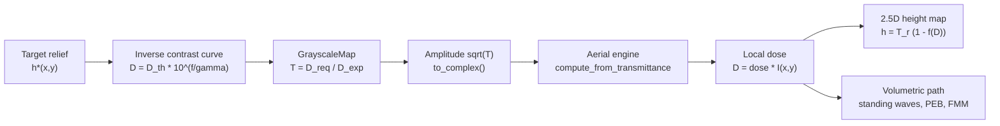

# Grayscale Lithography

**Status:** 🔶 Simplified — the fast 2.5D height-map path is a closed-form per-pixel contrast-curve model with no standing waves, PEB diffusion, or lateral development; the full volumetric path in [`volumetric.rs`](../../crates/highuvlith-core/src/volumetric.rs) captures those. Taxonomy: [capability matrix](../capability-matrix.md).

## Overview

Binary lithography prints edges; grayscale lithography prints **surfaces**. By varying the local dose across the field — with a continuous-transmittance (HEBS-glass or pixelated sub-resolution) mask — a positive resist clears to a *depth* that follows the dose, sculpting blazed gratings, microlens arrays, and staircase phase elements in a single exposure [1, 2]. The transfer function from dose to removed depth is the resist's contrast (Hurter–Driffield) curve, which over its log-linear regime is fixed by just two numbers: the threshold dose $D_{th}$ below which nothing clears, and the clearing dose $D_{clear}$ at which the film clears to the substrate.

[`grayscale.rs`](../../crates/highuvlith-core/src/grayscale.rs) provides that contrast-curve algebra (with its exact inverse), continuous-transmittance mask synthesis that feeds the real diffraction engine, target-relief generators, and a fast 2.5D height map. It is the first-order design tool; when standing waves and sidewall physics matter, the same masks drive the z-resolved exposure/development tiers instead.

## Physics & math



The log-linear contrast curve, its forward map, and its exact inverse:

$$\gamma = \frac{1}{\log_{10}(D_{clear}/D_{th})}$$

$$f(D) = \mathrm{clamp}\!\big(\gamma \log_{10}(D/D_{th}),\ 0,\ 1\big), \qquad h(D) = T_r\,\big(1 - f(D)\big)$$

$$D(f) = D_{th}\, 10^{f/\gamma}$$

with $T_r$ the film thickness and $f$ the removed-depth fraction. `ContrastCurve::dose_for_depth` is the **exact inverse** of `depth_nm` over the open interval $(D_{th}, D_{clear})$ (pinned by a round-trip test); at the clamp boundaries, $f = 0$ maps to $D_{th}$ and $f = 1$ to $D_{clear}$.

Mask synthesis inverts the whole chain: for a target height $h^*(x,y)$ the required removed depth is $T_r - h^*$, the required dose follows from $D(f)$, and the transmittance is $T = D_{req}/D_{exp}$ for a chosen exposure dose $D_{exp}$. Intensity transmittance becomes field amplitude as $\sqrt{T}$ (zero phase), which is what the diffraction engine propagates.

## Process regime

| Parameter | Typical value | Notes / citation |
|---|---|---|
| Resists | Thick positive DNQ-novolak (AZ 4562, AZ 9260, ma-P 1275); PMMA for e-beam grayscale | [1, 2] |
| Thickness | 2–50 µm (µ-optics); 100 nm–2 µm (diffractive optics) | [1, 2] |
| Contrast $\gamma$ | ~1–3 (low contrast preferred — wider gray window) | [1] |
| Doses | $D_{th}$ tens of mJ/cm², $D_{clear}$ hundreds of mJ/cm² (i-line/broadband) | [1, 3] |
| Gray levels | 8–256 (HEBS glass ~1000 gray shades) | [2] |
| Structures | Blazed gratings (µm-scale sawtooth), microlens arrays (10–500 µm pitch, 1–50 µm sag), staircase DOEs | [1, 2] |
| Post-process | Optional RIE transfer of the resist relief into Si/SiO₂ | [2] |

## Simulation model

All in [`crates/highuvlith-core/src/grayscale.rs`](../../crates/highuvlith-core/src/grayscale.rs):

- **`ContrastCurve`** — built by `ContrastCurve::new(d_th, d_clear)` (requires $0 < D_{th} < D_{clear}$; derives $\gamma$). Methods `removed_depth_fraction`, `depth_nm`, `dose_for_depth`.
- **`GrayscaleMap`** — an `Array2<f64>` of intensity transmittance in [0, 1]. `to_complex()` yields the amplitude-$\sqrt{T}$ map consumed by [`AerialImageEngine::compute_from_transmittance`](../../crates/highuvlith-core/src/aerial.rs), so grayscale masks go through the **same Hopkins TCC/SOCS diffraction engine** as geometric masks (the engine's `compute()` itself delegates to this entry point after rasterizing). `from_target_height()` synthesizes the mask for a target relief and **errors when the exposure dose is infeasible** — if any pixel would need $T > 1$, it reports the maximum required dose so you can raise $D_{exp}$.
- **`MaskFeature::GrayRect`** — the geometric-mask counterpart ([`mask.rs`](../../crates/highuvlith-core/src/mask.rs)): a rectangle carrying its own intensity transmittance, rasterized as amplitude $\sqrt{T}$ with zero phase, ignoring the mask type and dark-field flag. `staircase_mask()` tiles `GrayRect` steps into a discrete-level test mask.
- **Relief generators** — `blazed_grating(n, period_px, depth_nm, thickness_nm)` (sawtooth $h = T_r - d\cdot\mathrm{frac}(x/\Lambda)$) and `microlens_array(n, pitch_px, sag_nm, thickness_nm)` (clamped parabolic bumps, peak $T_r$, base $T_r - \mathrm{sag}$).
- **`height_map(aerial, dose, curve, thickness)`** — the fast **2.5D** path: per-pixel $h = T_r - \mathrm{depth}(D\cdot I(x,y))$.

Two tiers, explicitly separated:

| Path | What it captures | What it ignores |
|---|---|---|
| 2.5D `height_map` | Closed-form dose→height per pixel; instant; exact for contrast-curve design | Standing waves, PEB diffusion, lateral development, sidewall angle — the contrast curve is depth-independent |
| Volumetric (`volumetric.rs`) | Exact TMM `intensity_profile` standing waves, split-step Dill bleaching, 3D PEB, fast-marching development front | Vector in-film imaging; paraxial $z/n$ focus mapping (documented there) |

Both start from the same grayscale-mask aerial image; choose the tier by whether you need first-order relief design or a physical topography with sidewalls.

## Model coverage

| Field | Unit | Consumed by | Status |
|---|---|---|---|
| `ContrastCurve.gamma` | — | `removed_depth_fraction`, `dose_for_depth` | live (derived at construction) |
| `ContrastCurve.dose_threshold_mj_cm2` | mJ/cm² | forward and inverse maps | live |
| `ContrastCurve.dose_clear_mj_cm2` | mJ/cm² | fixes $\gamma$ at construction; not re-read afterward | live (constructor only) |
| `GrayscaleMap.transmittance` | [0, 1] | `to_complex` → aerial engine; feasibility check | live |
| `MaskFeature::GrayRect.transmittance` | [0, 1] | `Mask::rasterize` (amplitude $\sqrt{T}$) | live |
| Grayscale phase (non-zero-phase gray features) | rad | — | planned |
| Sub-pixel antialiased rasterization | — | — | planned (edges are pixel-quantized) |

## Usage

There is **no Python, CLI, or TOML surface for this module yet** (planned); it is Rust-API only.

```rust
use highuvlith_core::grayscale::{microlens_array, ContrastCurve, GrayscaleMap, height_map};
use highuvlith_core::aerial::AerialImageEngine;

// AZ-thick-resist-like curve: D_th = 10, D_clear = 100 mJ/cm^2 -> gamma = 1.
let curve = ContrastCurve::new(10.0, 100.0)?;
let thickness_nm = 5_000.0;

// Target: parabolic microlens array, 2 um sag.
let target = microlens_array(256, 64, 2_000.0, thickness_nm);

// Synthesize the mask; errors if 100 mJ/cm^2 cannot reach the deepest pixel.
let gray = GrayscaleMap::from_target_height(&target, thickness_nm, &curve, 100.0)?;

// Diffract it through the real imaging engine, then map dose to height.
let engine: AerialImageEngine = /* built from source/optics/grid as usual */;
let aerial = engine.compute_from_transmittance(&gray.to_complex(), 0.0);
let relief = height_map(&aerial, 100.0, &curve, thickness_nm); // 2.5D
```

For standing-wave-aware topography, feed the same aerial image into the volumetric exposure/development tiers instead of `height_map`.

## Validation

`#[test]` functions in `grayscale.rs`:

- `test_gamma_fixture` — $D_{th}=10, D_{clear}=100 \Rightarrow \gamma = 1$.
- `test_contrast_curve_round_trip` — depth→dose is the exact inverse for doses strictly inside $(D_{th}, D_{clear})$.
- `test_removed_fraction_bounds` — 0 at/below threshold, 1 at/above clearing, $f{=}0$ inverts to $D_{th}$.
- `test_invalid_contrast_curve` — rejects $D_{th} \le 0$ and $D_{clear} \le D_{th}$.
- `test_blazed_grating_min_max`, `test_microlens_sag_bounds` — generator envelopes are exact.
- `test_staircase_through_height_map` — end-to-end closed-form heights for four intensity levels.
- `test_from_target_height_errors_when_dose_insufficient` — the feasibility error fires, and a sufficient dose yields $T \in [0,1]$.
- `test_to_complex_amplitude_is_sqrt_t`, `test_staircase_mask_builds_gray_rects`.

In `aerial.rs`: `test_compute_from_transmittance_matches_compute` pins that the transmittance entry point is bit-identical to the standard mask path.

## References

1. C. M. Waits, A. Modafe, R. Ghodssi, "Investigation of gray-scale technology for large area 3D silicon MEMS structures," *J. Micromech. Microeng.* **13**, 170–177 (2003).
2. M. T. Gale, M. Rossi, J. Pedersen, H. Schütz, "Fabrication of continuous-relief micro-optical elements by direct laser writing in photoresists," *Opt. Eng.* **33**, 3556–3566 (1994).
3. F. H. Dill, W. P. Hornberger, P. S. Hauge, J. M. Shaw, "Characterization of positive photoresist," *IEEE Trans. Electron Devices* **22**, 445–452 (1975).
4. B. Wagner, H. J. Quenzer, W. Henke, W. Hoppe, W. Pilz, "Microfabrication of complex surface topographies using grey-tone lithography," *Sens. Actuators A* **46**, 89–94 (1995).
5. C. A. Mack, *Fundamental Principles of Optical Lithography*, Wiley (2007) — contrast-curve formalism.
