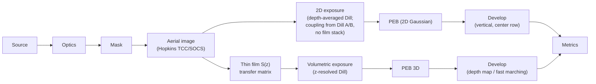

# Process Modules

**Status:** ✅ Implemented — this page is an index; each linked page carries its own badge per the taxonomy in [../capability-matrix.md](../capability-matrix.md).

## Overview

"Process" in highuvlith means everything that happens after light leaves the projection
optics: how the film stack redistributes intensity in depth, how the resist records dose,
how the latent image diffuses during bake, and how development turns it into topography.
These modules are deliberately decoupled from the source/optics front end — the aerial
image is a plain intensity grid, so every process model below works identically for the
F₂ excimer, LPA-FEL, or any future source.

## Where each page hooks into the pipeline

| Pipeline stage | Page | Core module |
|---|---|---|
| Film-stack optics: reflectance, swing curves, standing waves, exact in-film intensity `S(z)` | [thin-film.md](./thin-film.md) | [`thinfilm.rs`](../../crates/highuvlith-core/src/thinfilm.rs) |
| Exposure kinetics, PEB, development rate (depth-averaged 2D path) | [resist-models.md](./resist-models.md) | [`resist.rs`](../../crates/highuvlith-core/src/resist.rs) |
| z-resolved exposure, 3D PEB, 3D development, sidewall metrics | [volumetric-exposure.md](./volumetric-exposure.md) | [`volumetric.rs`](../../crates/highuvlith-core/src/volumetric.rs) |
| Continuous-dose 2.5D topography (contrast-curve map, mask synthesis) | [grayscale.md](./grayscale.md) | [`grayscale.rs`](../../crates/highuvlith-core/src/grayscale.rs) |
| Deep X-ray 1:1 shadow printing (bypasses projection entirely) | [liga-deep-xray.md](./liga-deep-xray.md) | [`deep_xray.rs`](../../crates/highuvlith-core/src/deep_xray.rs) |
| Multi-beam interference / two-photon voxel writing (bypasses mask and pupil) | [interference-volumetric.md](./interference-volumetric.md) | [`interference.rs`](../../crates/highuvlith-core/src/interference.rs) |

Three of these are *off-pipeline* by physics, not by omission:

- **LIGA** is proximity shadow printing — no pupil, no TCC, no `LithographySource`
  illumination. Its input is a synchrotron white-beam spectrum, and its lateral image is a
  near-geometric mask shadow with a first-Fresnel-zone proximity blur.
- **Interference lithography** superposes explicit coherent plane waves on a 3D grid; there
  is no mask or projection optic. Its output PAC volumes feed the same volumetric
  development tiers as the projection path.
- **Grayscale** wraps the aerial-image engine with a continuous-transmittance mask and maps
  local dose to remaining height through a contrast (H–D) curve — an analytic 2.5D
  shortcut around the resist stack entirely.

## The 2D-vs-volumetric split

highuvlith has two resist paths that share the same Dill/Mack physics but differ in
dimensionality:

- **Depth-averaged 2D** ([resist-models.md](./resist-models.md)): the aerial image is
  scaled by a single Beer–Lambert coupling scalar
  $\big(1 - e^{-\alpha d}\big)/(\alpha d)$ and exposed as one `(x, y)` plane; development
  etches each column of the center row vertically. Fast, adequate for CD/Bossung work on
  thin resists, blind to standing waves and sidewalls.
- **Volumetric** ([volumetric-exposure.md](./volumetric-exposure.md)): a full `(x, y, z)`
  latent image built as the separable product of the defocus-tracked aerial image and the
  *exact* transfer-matrix intensity profile `S(z)` — standing waves, absorption, and
  interface reflections included with no double counting — followed by 3D PEB and either a
  per-column threshold depth map or a fast-marching Eikonal etch front that resolves
  sidewall angle and undercut.

The two paths are pinned to each other: the z-mean of the exact `S(z)` reproduces the 2D
coupling scalar for a non-bleaching stack
(`test_z_mean_matches_effective_coupling` in
[`volumetric.rs`](../../crates/highuvlith-core/src/volumetric.rs)).

## Process pages

| Page | Status | One-line honesty note |
|---|---|---|
| [thin-film.md](./thin-film.md) | ✅ Implemented | Exact 2×2 characteristic-matrix stack; oblique-TM in-film intensity is tangential-field only (documented) |
| [resist-models.md](./resist-models.md) | 🔶 Simplified | Depth-averaged exposure; center-row vertical development, no sidewalls |
| [volumetric-exposure.md](./volumetric-exposure.md) | 🔶 Simplified | Separable `I_aer × S(z)` model; paraxial focus mapping; lateral-mean bleaching; frozen-rate FMM |
| [grayscale.md](./grayscale.md) | 🔶 Simplified | Analytic contrast-curve 2.5D height map; no standing waves or lateral development |
| [liga-deep-xray.md](./liga-deep-xray.md) | 🔶 Simplified | Polychromatic depth dose + first-Fresnel-zone blur; full Fresnel–Kirchhoff propagation planned |
| [interference-volumetric.md](./interference-volumetric.md) | ✅ / 🔶 | Exact vector-component plane-wave superposition; per-beam scalar absorption, no substrate reflection |

Statuses follow the taxonomy in [../capability-matrix.md](../capability-matrix.md); every
capability-changing PR must update both that matrix and the badge on the affected page.

## Shared data types and cross-model pins

All process modules exchange the plain grid types from
[`types.rs`](../../crates/highuvlith-core/src/types.rs) (`Grid2D`, `Grid3D`) and the
latent-image wrappers from [`resist.rs`](../../crates/highuvlith-core/src/resist.rs) and
[`volumetric.rs`](../../crates/highuvlith-core/src/volumetric.rs):

| Type | Carries | Produced by | Consumed by |
|---|---|---|---|
| `Grid2D<f64>` | aerial image, depth map, height map | aerial engine, `develop_depth_map`, `height_map_from_times` | resist exposure, metrics, viz |
| `LatentImage` (2D PAC) | depth-averaged `m(x, y)` | `resist::expose` | `peb_diffuse`, `develop` |
| `VolumetricLatentImage` (`Grid3D<f64>` PAC) | `m(x, y, z)` | `expose_volumetric`, interference exposure | `peb_diffuse_3d`, both development tiers, `cd_at_z` |
| `Grid3D<f64>` arrival times | FMM `T(x, y, z)` (s) | `develop_fast_marching` | `height_map_from_times`, sidewall metrics |

Because the interfaces are plain grids, cross-model consistency can be (and is) tested
directly rather than assumed:

- `test_z_mean_matches_effective_coupling` — the volumetric `S(z)` averages to the 2D
  coupling scalar.
- `test_closed_form_beer_lambert_exposure` — the separable volumetric model reproduces
  the closed-form Dill/Beer–Lambert solution when reflections are removed.
- `test_intensity_profile_standing_wave_period` — the thin-film field shows the
  λ/(2n) period every downstream standing-wave claim relies on.

## Choosing a path

- CD, NILS, Bossung curves, process windows on ≤ 200 nm resist → 2D path
  ([resist-models.md](./resist-models.md)); it is orders of magnitude cheaper.
- Swing-curve/BARC design, dose-to-clear vs thickness → [thin-film.md](./thin-film.md)
  reflectance and `intensity_profile` directly, no resist model needed.
- Sidewall angle, standing-wave ripple, undercut, thick or bleaching resists, buried
  resist under a top coat → [volumetric-exposure.md](./volumetric-exposure.md).
- Blazed gratings / microlens relief → [grayscale.md](./grayscale.md) first-order design,
  volumetric path for standing-wave-aware verification.
- Hundreds-of-µm PMMA, aspect ratio ≫ 10 → [liga-deep-xray.md](./liga-deep-xray.md).
