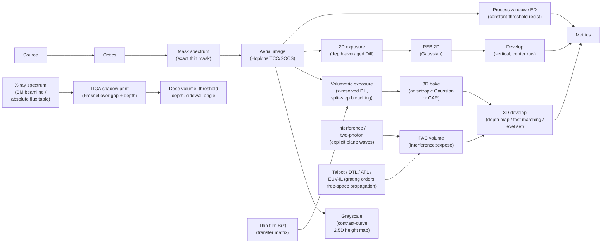

# Process Modules

**Status:** ✅ Implemented — this page is an index of process modules that exist in code; each linked page carries its own badge per the taxonomy in the [capability matrix](../capability-matrix.md).

## Overview

"Process" in highuvlith means everything between the patterned light (or X-rays) arriving
at the wafer and the pattern you measure: how the film stack redistributes intensity in
depth, how the resist records dose, how the latent image diffuses during the bake, how
development turns it into topography, and how CD and the process window are read off the
result.

The projection-lithography modules consume the aerial image as a plain intensity grid on
the periodic simulation field, so every model below works the same way for the F₂
excimer, a 13.5 nm plasma source, or any other `LithographySource`. A few modules bypass
part of that chain *by physics*, not by omission: LIGA and interference lithography have no
projection optic at all, Talbot lithography images a grating by free-space propagation,
and grayscale replaces the resist stack by an analytic contrast curve.

## Where each page hooks into the pipeline

Metrics are image-plane or developed-profile CD, NILS,
contrast and MEEF from [`metrics.rs`](../../crates/highuvlith-core/src/metrics.rs); the mask
and metric stages are documented on [masks-and-metrics.md](../masks-and-metrics.md).

## Process pages

| Page | Status | What it computes | Main documented approximations | Core module |
|---|---|---|---|---|
| [masks-and-metrics.md](../masks-and-metrics.md) | ✅ Implemented (spectra, grids, metrics) · 🔶 Simplified (process-window dose axis) | Exact thin-mask spectra on commensurate periodic grids; tone-aware sub-pixel CD, ILS/NILS, MEEF; dose-aware process window and ED analysis (EL-vs-DOF, DOF at x % EL, best focus, dose-to-size), one spectrum per sweep via `compute_through_focus` | Thin (Kirchhoff) mask, no mask-3D; constant-threshold resist (no blur, no development kinetics); CD on the y = 0 cut; inscribed rectangles only (no ellipse) | [`mask.rs`](../../crates/highuvlith-core/src/mask.rs), [`metrics.rs`](../../crates/highuvlith-core/src/metrics.rs), [`process.rs`](../../crates/highuvlith-core/src/process.rs) |
| [thin-film.md](./thin-film.md) | ✅ Implemented | 2×2 characteristic matrix in the normal-wavevector (q) form: TE/TM/unpolarized R and T, complex r and t at any angle (incl. X-ray grazing incidence), exact in-film intensity `S(z)` | Flat, abrupt interfaces (roughness only in the [multilayer module](../materials.md)); oblique-TM in-film intensity uses the tangential field only. The absorbing-layer reflectance was corrected on 2026-09-30 (default 157 nm stack: R 0.772 → 0.258) | [`thinfilm.rs`](../../crates/highuvlith-core/src/thinfilm.rs) |
| [resist-models.md](./resist-models.md) | 🔶 Simplified | Dill exposure and Mack or threshold development on the depth-averaged 2D path; exact spectral Gaussian bake (optionally anisotropic, depth-dependent) and the chemically amplified acid/quencher reaction–diffusion bake (`car_peb`, `car_peb_2d`) | One Beer–Lambert coupling scalar (no z-resolved dose); only the center row is etched, vertically — no lateral front, no sidewall angle; CAR: no acid loss, constant diffusivities, illustrative constants | [`resist.rs`](../../crates/highuvlith-core/src/resist.rs) |
| [volumetric-exposure.md](./volumetric-exposure.md) | 🔶 Simplified | Full `(x, y, z)` latent image (separable `I_aer × S(z)`, split-step bleaching, focus planes imaged with `compute_through_focus`), anisotropic Gaussian or CAR bake (`apply_peb`), 3D development (threshold depth map, fast-marching arrival times, level set with surface inhibition and developer ageing/loading) | Lateral image and film response decoupled (no vector in-film imaging); paraxial `z / n_r` focus mapping; lateral-mean PAC during bleaching; fast marching needs a static rate field; development-rate factors are phenomenological | [`volumetric.rs`](../../crates/highuvlith-core/src/volumetric.rs) |
| [grayscale.md](./grayscale.md) | 🔶 Simplified | Contrast-curve (H–D) 2.5D height map from continuous-transmittance masks; inverse map from a target relief to the mask | Per-pixel closed form: no standing waves, PEB or lateral development (use the volumetric path for those) | [`grayscale.rs`](../../crates/highuvlith-core/src/grayscale.rs) |
| [liga-deep-xray.md](./liga-deep-xray.md) | 🔶 Simplified | Spectral depth dose (μ for attenuation, μ_en for deposition), absolute dose rate and exposure time, complex thin-screen Au absorber, scalar Fresnel (angular-spectrum) proximity diffraction over gap + depth, straight-edge sidewall tool | Thin-screen absorber; collimated, coherent normal-incidence beam; no photoelectron/secondary-electron transport (optional Grün Gaussian only), no fluorescence, no beamline mirrors; periodic 2D field | [`deep_xray.rs`](../../crates/highuvlith-core/src/deep_xray.rs), [`materials/attenuation.rs`](../../crates/highuvlith-core/src/materials/attenuation.rs) |
| [interference-volumetric.md](./interference-volumetric.md) | ✅ Implemented (analytic N-beam field) · 🔶 Simplified (absorption, interfaces) | Vector-component superposition of N plane waves on a 3D grid (two-beam, three-beam hexagonal, four-beam umbrella presets); two-photon voxel writing with a Gaussian focus | Scalar per-beam absorption along each beam's path; no Fresnel transmission, substrate reflection or vector focusing | [`interference.rs`](../../crates/highuvlith-core/src/interference.rs) |
| [talbot.md](./talbot.md) | 🔶 Simplified | Coherent Talbot carpet, displacement-Talbot (DTL) and achromatic-Talbot (ATL) stationary images, two-grating EUV interference fringes; intensity volumes feed `interference::expose` and the development tiers | Thin (Kirchhoff) grating; perfectly coherent normal illumination; wavelength-independent grating coefficients; no Fresnel coefficients at the resist | [`talbot.rs`](../../crates/highuvlith-core/src/talbot.rs) |

Statuses above are copied from each page's own `**Status:**` line; every capability-changing
PR must update that line, the module's `# Model status` header and the capability matrix
together.

## Modules that bypass part of the pipeline

- **LIGA** is 1:1 proximity shadow printing — no pupil, no TCC, no `LithographySource`
  illumination. Its input is an X-ray spectrum: a synchrotron bending-magnet beamline (absolute
  when the ring current, source distance, horizontal acceptance and vertical scan are given),
  an absolute photon flux-density table at the mask (contract C5: a measured spectrum, or the
  X-ray-tube source's `spectral_flux_density()`), or a relative spectrum (e.g. the betatron's
  synchrotron-like spectrum). The lateral image is the complex absorber field propagated by
  scalar angular-spectrum (Fresnel) diffraction over the gap and through the resist depth;
  the legacy Gaussian first-Fresnel-zone blur remains as `ProximityModel::Gaussian`.
- **Interference lithography** superposes explicit coherent plane waves on a 3D grid; there
  is no mask and no projection optic. `interference::expose` turns the intensity volume into a
  PAC volume that feeds the same development tiers as the projection path.
- **Talbot / DTL / ATL / EUV-IL** propagates the Fourier orders of a periodic grating with
  the exact (or paraxial) angular-spectrum transfer function — no pupil, TCC or illumination
  σ — and hands its intensity volumes to the interference exposure and the development tiers.
- **Grayscale** does use the aerial-image engine (`compute_from_transmittance` with a
  continuous-transmittance mask, e.g. a `GrayRect` staircase) but maps the local dose to
  remaining height through an analytic contrast curve instead of simulating the resist stack.

## The 2D-vs-volumetric split

highuvlith has two resist paths that share the Dill exposure and Mack/threshold development
physics but differ in dimensionality.

**Depth-averaged 2D** ([resist-models.md](./resist-models.md)). The aerial image is scaled by
the single Beer–Lambert coupling scalar $(1 - e^{-\alpha d})/(\alpha d)$ and exposed as one
`(x, y)` plane; PEB is a 2D Gaussian blur (`resist::peb_diffuse`); development etches each
column of the center row vertically. Fast and adequate for CD/Bossung work on thin resists,
blind to standing waves and sidewalls.

**Volumetric** ([volumetric-exposure.md](./volumetric-exposure.md)). A full `(x, y, z)` latent
image built as the separable product `I_aer(x, y; d₀ + z/n_r) · S(z)` of the aerial image,
refocused paraxially to each depth, and the *exact* transfer-matrix intensity `S(z)` —
standing waves, absorption and interface reflections included once. Bleaching is split-step
Dill with the laterally averaged PAC per sublayer. The latent volume then goes through a
bake and one of the development tiers below.

| Post-exposure bake | Function | Notes |
|---|---|---|
| 2D Gaussian (acid diffusion length) | `resist::peb_diffuse` | 2D path |
| 3D isotropic Gaussian | `volumetric::peb_diffuse_3d` | Exact spectral Gaussian per axis (legacy signature; reflecting lateral edges) |
| Anisotropic Gaussian: separate lateral and vertical diffusion lengths, optional depth-dependent vertical diffusivity | `resist::peb_diffuse_anisotropic`, `volumetric::apply_peb` with `PebModel::Gaussian` | Variance exactly σ² per axis |
| Chemically amplified resist: acid/quencher reaction–diffusion (exact local reaction, Strang splitting) | `resist::car_peb`, `resist::car_peb_2d`, `PebModel::ChemicallyAmplified` | Normalized to the PAG; no acid loss |

| Development tier | Function | Captures |
|---|---|---|
| 1. Threshold depth map | `volumetric::develop_depth_map` | Per-column clearing depth; no lateral etching or undercut |
| 2. Fast marching | `volumetric::develop_fast_marching[_with]` | Eikonal arrival times (`‖∇T‖ = 1/R`) for a static rate field → sidewall angle, undercut |
| 3. Level set | `volumetric::develop_level_set` | Moving boundary with the rate re-evaluated at the front every step: surface inhibition (T-topping), developer ageing, global and local developer loading |

Surface inhibition is a static, depth-only rate factor, so the fast-marching tier accepts it
too (`develop_fast_marching_with`); developer loading depends on the developed geometry's
history and needs the level set.

The two resist paths are pinned to each other: the z-mean of the exact `S(z)` reproduces the
2D coupling scalar for an index-matched, non-bleaching resist
(`test_z_mean_matches_effective_coupling` in
[`volumetric.rs`](../../crates/highuvlith-core/src/volumetric.rs)).

## Shared data types and cross-model pins

All process modules exchange the plain grid types from
[`types.rs`](../../crates/highuvlith-core/src/types.rs) (`Grid2D`, `Grid3D`) and the
latent-image wrappers from [`resist.rs`](../../crates/highuvlith-core/src/resist.rs) and
[`volumetric.rs`](../../crates/highuvlith-core/src/volumetric.rs):

| Type | Carries | Produced by | Consumed by |
|---|---|---|---|
| `Grid2D<f64>` | Aerial image, depth map, height map | Aerial engine, `develop_depth_map`, `height_map_from_times`, `grayscale::height_map` | Resist exposure, metrics, process window, visualization |
| `LatentImage` (2D PAC) | Depth-averaged `m(x, y)` | `resist::expose` | `resist::peb_diffuse`, `development_rate`, `develop` |
| `VolumetricLatentImage` (wraps a `Grid3D<f64>` PAC) | `m(x, y, z)` | `expose_volumetric`; `interference::expose` returns the `Grid3D` to wrap | `peb_diffuse_3d`, the development tiers, `metrics::cd_at_z` |
| `Grid3D<f64>` arrival times | Front arrival time `T(x, y, z)` in s | `develop_fast_marching`, the level set's `arrival_times` | `height_map_from_times`, sidewall metrics |

Because the interfaces are plain grids, cross-model consistency is tested directly rather
than assumed:

- `test_z_mean_matches_effective_coupling` (`volumetric.rs`) — the volumetric `S(z)`
  averages to the 2D coupling scalar.
- `test_closed_form_beer_lambert_exposure` (`volumetric.rs`) — an index-matched,
  non-bleaching resist under a clear mask follows the closed form `m(z) = exp(−C·D·I₀·e^(−αz))`.
- `test_intensity_profile_standing_wave_period` and `test_absorbing_film_matches_airy_formula`
  (`thinfilm.rs`) — the λ/(2n) standing-wave period every downstream claim relies on, and the
  Airy formula for an absorbing film.
- `test_knife_edge_field_matches_fft_propagation_including_phase`,
  `test_fresnel_2d_matches_1d_periodic_profile` and
  `test_bending_magnet_absolute_fixture_independent_numpy` (`deep_xray.rs`) — the analytic
  Fresnel straight edge equals FFT propagation (phase included), the 2D and 1D Fresnel paths
  agree, and the absolute depth dose and exposure time match an independent NumPy
  implementation.
- `test_two_beam_period_and_index_invariance` (`interference.rs`),
  `test_gamma_fixture` / `test_contrast_curve_round_trip` (`grayscale.rs`) and
  `test_synthetic_ed_window_closed_form` (`process.rs`) — closed-form anchors of the
  interference, grayscale and process-window paths.
- `test_level_set_matches_fast_marching_for_static_rates` (`volumetric.rs`)
  (level set and fast marching agree within grid error for static rates),
  `test_car_reaction_only_matches_rk4_fixtures` and `test_car_strang_splitting_is_second_order`
  (CAR bake, `resist.rs`), `test_dtl_stationary_equals_brute_force_gap_average` and
  `test_volume_feeds_pac_and_development` (Talbot volumes through exposure and development,
  `talbot.rs`).

## Choosing a path

- CD, NILS, Bossung curves and process windows on thin resists → the aerial image plus the
  constant-threshold process window ([masks-and-metrics.md](../masks-and-metrics.md)), or the
  2D resist path ([resist-models.md](./resist-models.md)); both are orders of magnitude cheaper
  than a volume.
- Swing curves, BARC design, dose-to-clear vs thickness → [thin-film.md](./thin-film.md)
  reflectance and `intensity_profile` directly; no resist model needed.
- Sidewall angle, standing-wave ripple, undercut, thick or bleaching resists, a buried resist
  under a top coat → [volumetric-exposure.md](./volumetric-exposure.md).
- Acid-diffusion blur that differs laterally and vertically, chemically amplified resists,
  T-topping or developer loading → the volumetric path with the anisotropic or CAR bake and
  the level-set tier.
- Blazed gratings and microlens relief → [grayscale.md](./grayscale.md) for first-order
  design, the volumetric path for standing-wave-aware verification.
- Hundreds of µm of PMMA, aspect ratios ≫ 10, exposure-time estimates →
  [liga-deep-xray.md](./liga-deep-xray.md); use the straight-edge tool for sidewall shape.
- Periodic 1D/2D/3D lattices without a mask → [interference-volumetric.md](./interference-volumetric.md);
  lens-less printing of periodic arrays from a grating at EUV / soft-X-ray wavelengths →
  [talbot.md](./talbot.md).

## Running the process modules

| Module | Python (`import highuvlith as huv`) | CLI (`highuvlith deep --config …`, `[deep] mode`) | Example config |
|---|---|---|---|
| Process window | `huv.BatchSimulator(...).process_window(...)` / `.process_window_threshold(...)` → `huv.ProcessWindowResult` | `highuvlith sweep --config … --dose-range …` | [`sim.toml`](../../examples/sim.toml) |
| Volumetric | `huv.expose_volumetric`, `huv.develop_fast_marching`, `huv.height_map_from_times`, `huv.api.simulate_volumetric`, `huv.api.develop_level_set`, `huv.api.peb_gaussian`, `huv.api.peb_car` | `mode = "volumetric"` | [`volumetric.toml`](../../examples/volumetric.toml) |
| LIGA | `huv.simulate_liga`, `huv.api.liga_edge_profile` | `mode = "liga"` | [`liga.toml`](../../examples/liga.toml) |
| Grayscale | `huv.simulate_grayscale`, `huv.grayscale_height_map` | `mode = "grayscale"` | [`grayscale.toml`](../../examples/grayscale.toml) |
| Interference | `huv.simulate_interference` | `mode = "interference"` | [`interference.toml`](../../examples/interference.toml) |
| Talbot / EUV-IL | `huv.api.simulate_talbot`, `huv.api.simulate_euv_il` | `mode = "talbot"` | [`talbot.toml`](../../examples/talbot.toml) |

Configuration keys for every mode are in [configuration.md](../configuration.md); the Python
signatures are in [python-api.md](../python-api.md).
