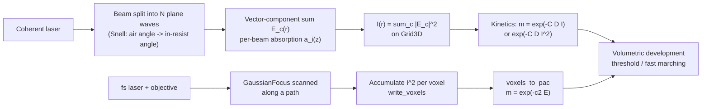

# Multi-beam Interference & Two-photon Voxel Writing

**Status:** ✅ Implemented for the analytic N-beam field (vector-component superposition, validated against closed forms) / 🔶 Simplified for absorption and interfaces (scalar per-beam decay; no Fresnel transmission, substrate reflection, or vector focusing). Taxonomy: [capability matrix](../capability-matrix.md).

## Overview

Interference (holographic) lithography superposes a handful of mutually coherent plane waves so that their stationary intensity lattice exposes an entire periodic structure in a **single shot** — no mask, no scanning: two beams write a 1D grating, three beams a 2D hexagonal lattice, and a central beam plus a three-beam umbrella an FCC-like 3D photonic crystal, the geometry of the landmark Campbell et al. experiment [1]. Two-photon direct writing is the complementary serial technique: a femtosecond focus scanned through the resist polymerizes a sub-diffraction voxel wherever the $I^2$ absorption rate crosses threshold [2, 3].

Both produce inherently **volumetric** latent images, so [`interference.rs`](../../crates/highuvlith-core/src/interference.rs) evaluates fields on a `Grid3D` and emits normalized photo-active-compound (PAC) volumes that plug directly into the z-resolved development tiers in [`volumetric.rs`](../../crates/highuvlith-core/src/volumetric.rs) — per-column threshold depth maps or the 3D fast-marching etch front. Like [LIGA](./liga-deep-xray.md), this path bypasses the projection pipeline: there is no mask, pupil, or TCC.

## Physics & math



Each beam is an ideal infinite plane wave with real unit polarization $\hat\varepsilon_i \perp \hat{\mathbf{k}}_i$. The field is summed per Cartesian component $c \in \{x,y,z\}$ — so polarization-mismatch contrast loss between non-coplanar beams *is* captured:

$$E_c(\mathbf{r}) = \sum_i A_i\, a_i(z)\, \hat\varepsilon_{i,c}\, \exp\!\Big(i\big(\tfrac{2\pi n}{\lambda_{vac}}\, \hat{\mathbf{k}}_i \cdot \mathbf{r} + \phi_i\big)\Big), \qquad I(\mathbf{r}) = \sum_c |E_c(\mathbf{r})|^2,$$

with per-beam amplitude decay along each beam's own slanted path, $a_i(z) = e^{-\alpha z / (2\hat k_{z,i})}$ (intensity $e^{-\alpha z/\hat k_{z,i}}$; skipped for $\hat k_{z,i} \le 0$; z runs downward into the resist).

**Two-beam period is refraction-invariant.** The presets take the *air-side* half-angle $\theta_{air}$ and refract it into the resist via Snell's law, $n \sin\theta_{med} = \sin\theta_{air}$. The fringe period is set by the transverse wavevector inside the medium:

$$\Lambda = \frac{\lambda_{vac}/n}{2\sin\theta_{med}} = \frac{\lambda_{vac}}{2\,n\sin\theta_{med}} = \frac{\lambda_{vac}}{2\sin\theta_{air}},$$

i.e. refraction bends the beams toward normal exactly as much as the in-medium wavelength shrinks, so the resist index drops out — the printed pitch depends only on the air-side geometry. (The *depth* structure of 3D lattices does depend on $n$.)

Exposure kinetics map intensity to normalized PAC ($m = 1$ unexposed, $m \to 0$ consumed):

$$m = e^{-C\,D\,I} \ \text{(one-photon)}, \qquad m = e^{-C\,D\,I^2} \ \text{(two-photon)},$$

the quadratic dependence being what confines two-photon polymerization below the diffraction limit. The serial writer models the focus as a Gaussian beam,

$$z_R = \frac{\pi w_0^2\, n}{\lambda_{vac}}, \qquad w(z) = w_0\sqrt{1 + (z/z_R)^2}, \qquad I(r,z) = \Big(\frac{w_0}{w(z)}\Big)^2 e^{-2r^2/w(z)^2},$$

accumulating $\propto I^2$ into every voxel for each point of the scan path.

## Process regime

| Parameter | Typical value | Notes / citation |
|---|---|---|
| Resists | SU-8, thick negative epoxies (interference); acrylate/IP-series photopolymers (two-photon) | [1, 2] |
| Thickness | 0.5–100 µm films; mm-scale two-photon volumes | [1, 2] |
| Wavelengths | 325–532 nm CW/pulsed (interference); 780–800 nm fs (two-photon) | [1, 3] |
| Period | $\Lambda = \lambda/(2\sin\theta_{air})$, down to ~λ/2 | [4] |
| Two-photon voxel | ~100–200 nm lateral, elongated ~3× axially | [3] |
| Dose control | Fill fraction tuned by dose/threshold — sets photonic-crystal band structure | [1] |
| Post-process | Develop unexposed regions (negative tone); optional inversion (Si double templating) | [1] |

## Simulation model

All in [`crates/highuvlith-core/src/interference.rs`](../../crates/highuvlith-core/src/interference.rs):

- **`PlaneWave`** — `k_hat` (normalized; error on zero vector), `amplitude`, `phase_rad`, `polarization` (must be unit and orthogonal to `k_hat` within 1e-6, else rejected).
- **`InterferenceSetup`** — beams + `wavelength_vacuum_nm` + `medium_index` + `absorption_per_nm`; `intensity(&mut Grid3D)` evaluates $I(\mathbf{r})$ at every voxel. Presets (all take the **air-side** half-angle and apply Snell internally, absorption defaulting to 0):
  - `two_beam` — two TE ($\hat\varepsilon = \hat y$) beams at $\pm\theta_{med}$ in the xz-plane: 1D grating, period $\lambda/(2\sin\theta_{air})$.
  - `three_beam_hex` — azimuths 0°/120°/240° at a common polar angle, azimuthal TE polarization ($\hat z \times \hat k$): 2D hexagonal lattice (equal pairwise $|\Delta\hat{\mathbf{k}}|$, C₃-symmetric).
  - `four_beam_umbrella` — central beam along $+z$ ($\hat x$-polarized) plus the umbrella: FCC-like 3D lattice [1].
- **`ExposureKinetics` / `expose`** — Dill-style one- or two-photon PAC map on the intensity volume.
- **`GaussianFocus` / `write_voxels` / `voxels_to_pac`** — scanned two-photon voxel writer: per path point, every voxel accumulates `exposure_per_point * I(r, Δz)²`; then $m = e^{-c_2 E}$.
- **`iso_surface_fill_fraction(pac, threshold)`** — fraction of voxels with $m <$ threshold: the developed/written fill fraction of the lattice, the knob photonic-crystal design cares about.

The resulting PAC `Grid3D` feeds the volumetric development tiers (`develop_depth_map`, `develop_fast_marching`, optional `peb_diffuse_3d`) in [`volumetric.rs`](../../crates/highuvlith-core/src/volumetric.rs).

Stated approximations: ideal infinite plane waves (no beam envelope or pointing/phase jitter); **no Fresnel transmission coefficients** at the air/resist interface and **no substrate reflection** (the real back-reflected wave adds an extra standing-wave term); absorption is a scalar per-beam decay rather than a self-consistent absorbing-medium solution; the Gaussian focus is scalar/paraxial (no high-NA vector focusing, so the simulated voxel lacks the polarization-dependent asymmetry of real 1.4-NA writing); and exposure is dose-integrated with no polymerization threshold dynamics, diffusion, or oxygen inhibition.

## Model coverage

| Field | Unit | Consumed by | Status |
|---|---|---|---|
| `PlaneWave.k_hat` | unit vector | phase term + absorption path length | live |
| `PlaneWave.amplitude` | — | field sum | live |
| `PlaneWave.phase_rad` | rad | carrier phase (lattice offset control) | live |
| `PlaneWave.polarization` | unit vector | per-component projection $\hat\varepsilon_{i,c}$ | live |
| `InterferenceSetup.wavelength_vacuum_nm` | nm | spatial frequency $2\pi n/\lambda$ | live |
| `InterferenceSetup.medium_index` | — | spatial frequency $2\pi n/\lambda$ in `intensity` (and Snell at preset construction) | live |
| `InterferenceSetup.absorption_per_nm` | 1/nm | per-beam decay $a_i(z)$ | live |
| `GaussianFocus.waist_nm` / `.wavelength_nm` / `.medium_index` | nm / nm / — | $w(z)$, $z_R$, `intensity_at` | live |
| Interface Fresnel coefficients, substrate reflection | — | — | planned |
| Polymerization threshold/diffusion kinetics | — | — | planned |

## Usage

There is **no Python, CLI, or TOML surface for this module yet** (planned); it is Rust-API only.

```rust
use highuvlith_core::interference::{
    expose, iso_surface_fill_fraction, ExposureKinetics, InterferenceSetup,
};
use highuvlith_core::types::Grid3D;

// Campbell-style FCC-like lattice: 355 nm in SU-8 (n = 1.67), 40 deg air-side.
let mut setup = InterferenceSetup::four_beam_umbrella(355.0, 1.67, 40.0)?;
setup.absorption_per_nm = 1e-5;

let mut grid = Grid3D::<f64>::new(
    128, 128, 64,
    (0.0, 2_000.0), (0.0, 2_000.0), (0.0, 5_000.0), // nm
)?;
setup.intensity(&mut grid);

let pac = expose(&grid, 1.0, 0.5, ExposureKinetics::OnePhoton);
let fill = iso_surface_fill_fraction(&pac, 0.5);
// `pac` feeds volumetric::develop_fast_marching for the 3D etch front.
```

```rust
use highuvlith_core::interference::{voxels_to_pac, write_voxels, GaussianFocus};

// Two-photon writer: 800 nm fs focus, 200 nm waist, scanning a line of voxels.
let focus = GaussianFocus { waist_nm: 200.0, wavelength_nm: 800.0, medium_index: 1.5 };
let path: Vec<(f64, f64, f64)> = (0..10).map(|i| (i as f64 * 300.0, 0.0, 0.0)).collect();
write_voxels(&mut grid, &focus, &path, 10.0); // accumulates I^2
let pac = voxels_to_pac(&grid, 5.0);
```

## Validation

`#[test]` functions in `interference.rs`:

- `test_two_beam_period_and_index_invariance` — measured fringe period matches $\lambda/(2\sin\theta_{air}) = 200$ nm to within one grid pixel, and agrees between $n = 1.0$ and $n = 1.7$ to $10^{-9}$ relative (index invariance).
- `test_two_beam_visibility_unity` — equal-amplitude TE beams give visibility 1 (within $10^{-6}$) with a near-zero fringe null.
- `test_two_beam_absorption_decays_exponentially` — x-averaged intensity ratio matches $e^{-\alpha \Delta z / \cos\theta}$ exactly.
- `test_three_beam_hex_c3_symmetry` — equal pairwise fringe wavevector magnitudes (hexagonal lattice).
- `test_four_beam_umbrella_shape`, `test_intensity_non_negative`.
- `test_gaussian_focus_waist_and_two_photon_falloff` — $w(z_R) = w_0\sqrt{2}$, on-axis $I(z_R) = 1/2$, two-photon exposure falls 4× at $z_R$.
- `test_write_voxels_peak_at_focus_and_fill_fraction` — exposure peaks at the focus voxel; fill fraction is small and positive.
- `test_expose_two_photon_sharper_than_one_photon` — $m$ values match the closed forms $e^{-CDI}$ / $e^{-CDI^2}$.
- Constructor guards: `test_planewave_zero_k_rejected`, `test_planewave_non_orthogonal_polarization_rejected`, `test_planewave_non_unit_polarization_rejected`, `test_planewave_normalizes_non_unit_k`, `test_invalid_preset_parameters`.

## References

1. M. Campbell, D. N. Sharp, M. T. Harrison, R. G. Denning, A. J. Turberfield, "Fabrication of photonic crystals for the visible spectrum by holographic lithography," *Nature* **404**, 53–56 (2000).
2. S. Maruo, J. T. Fourkas, "Recent progress in multiphoton microfabrication," *Laser Photonics Rev.* **2**, 100–111 (2008).
3. S. Kawata, H.-B. Sun, T. Tanaka, K. Takada, "Finer features for functional microdevices," *Nature* **412**, 697–698 (2001).
4. S. R. J. Brueck, "Optical and interferometric lithography — nanotechnology enablers," *Proc. IEEE* **93**, 1704–1721 (2005).
5. B. E. A. Saleh, M. C. Teich, *Fundamentals of Photonics*, Wiley — Gaussian-beam formulas ($w(z)$, $z_R$).
