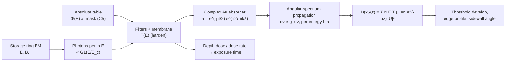

# LIGA Deep X-ray Lithography

**Status:** 🔶 Simplified — spectral depth dose, absolute exposure time and scalar Fresnel proximity diffraction are computed and validated (analytic straight edge, an independent numpy re-implementation, NIST/CXRO data), but photoelectron transport, secondary radiation, beam divergence and beamline mirrors are not modelled. Taxonomy: [capability matrix](../capability-matrix.md).

## Overview

LIGA (**Li**thographie, **G**alvanoformung, **A**bformung — lithography, electroforming, molding) was developed at Kernforschungszentrum Karlsruhe (KfK) in the early 1980s to mass-produce separation nozzles for uranium enrichment — first published by Becker et al. in 1982 [1] — and became the canonical route to metal and polymer microstructures with extreme aspect ratios [2]. KfK became Forschungszentrum Karlsruhe in 1995 and part of KIT in 2009; KIT's Institute of Microstructure Technology runs three LIGA beamlines at the KARA storage ring and makes structures from a few µm to several mm tall [10]. A synchrotron bending-magnet **white beam** (multi-keV, broadband) exposes 10–1000 µm of PMMA or SU-8 through a 1:1 proximity mask; the developed resist mold is then electroformed (Ni, NiFe, Au) and optionally replicated by injection molding or hot embossing. Because hard X-rays barely diffract and barely scatter in low-Z resists, sidewall runout of < 0.1 µm over 500 µm of depth — aspect ratios beyond 100:1 — is routine [2, 3].

This is **shadow printing, not projection**: no practical imaging optic exists at these photon energies and field sizes, so the mask sits a small gap above the resist and casts a near-geometric shadow. Consequently the `LithographySource` trait, pupil model, and Hopkins TCC/SOCS engine of the main pipeline **do not apply here** — [`deep_xray.rs`](../../crates/highuvlith-core/src/deep_xray.rs) bypasses the projection pipeline entirely. Simulation scope ends at the developed resist geometry; the electroforming and molding steps (the G and A of LIGA) are not modeled.

## Physics & math



### Spectrum and absolute flux

The bending-magnet spectrum is characterized by its critical energy $E_c = 0.665 E^2[\mathrm{GeV}] B[\mathrm{T}]$ keV. The vertically integrated photon flux per unit horizontal angle is the standard synchrotron-radiation result [4]

```math
\frac{\mathrm{d}\dot N}{\mathrm{d}\theta} = 2.457\times10^{13}\,E[\mathrm{GeV}]\,I[\mathrm{A}]\,G_1(y)\ \ \mathrm{photons\,s^{-1}\,mrad^{-1}\,(0.1\%\,BW)^{-1}},\qquad G_1(y) = y\int_y^\infty K_{5/3}(x)\,\mathrm{d}x,\quad y = E/E_c ,
```

with the constant rebuilt from CODATA values as $\sqrt3 \alpha \gamma(1 \mathrm{GeV})/(2\pi e)\times10^{-6}$ (`bm_flux_constant`); the computation itself calls the source-model function `physics::bm_flux_per_mrad` (the same one `SynchrotronSource::bm_flux_per_mrad` uses, with γ = 1 + E/mc²). Because 0.1 % bandwidth is a fixed interval of $\ln E$, photons per **log-spaced** energy bin are proportional to $G_1$ — the spectrum is sampled on bins equally spaced in $\ln E$ over $[0.1, 8] E_c$. A scanner sweeps mask and substrate uniformly through the fan over a height $H$; at source distance $L$ one mrad covers $L$[m] mm, so the scan-averaged flux density at the mask is

```math
\Phi(E) = \frac{\mathrm{d}\dot N/(\mathrm{d}\theta\,\mathrm{d}E)}{L\,H}\ \ \mathrm{photons\,s^{-1}\,mm^{-2}\,keV^{-1}} .
```

Any other source (X-ray tube, betatron) can supply $\Phi(E)$ directly as an `(E_keV, value)` table (contract C5, `XraySpectrum::from_flux_density`).

### Depth dose and exposure time

Every layer the beam crosses transmits $e^{-\mu(E)t}$ with the total attenuation $\mu$; the energy deposited locally uses the **energy-absorption** coefficient $\mu_{en}$ (NIST tables, [materials](../materials.md)). With $N_j$ photons s⁻¹ mm⁻² in bin $j$:

```math
\dot D(z) = \sum_j N_j\,E_j\,T_{\mathrm{beam}}(E_j)\,\mu_{en,j}\,e^{-\mu_j z},\qquad T_{\mathrm{beam}} = e^{-\mu_{\mathrm{mem}}t_{\mathrm{mem}}}\prod_f e^{-\mu_f t_f},
```

in W mm⁻³ = kJ cm⁻³ s⁻¹, and the exposure time to reach the clearing dose is $t = D_{\mathrm{target}}/\dot D(T)$. Relative spectra use the same expression with normalized weights and are scaled so $D(T) = D_{\mathrm{target}}$. Because soft photons are absorbed preferentially near the surface, the local decay rate $-\mathrm{d}\ln D/\mathrm{d}z$ **falls with depth** (spectral hardening); upstream filters pre-harden the beam to reduce the top/bottom dose ratio. The $\mu$/$\mu_{en}$ distinction matters: in PMMA $\mu_{en}/\mu$ = 0.94 at 8 keV but 0.58 at 20 keV (Compton photons leave).

<figure markdown="span">


<figcaption>LIGA deep X-ray exposure of 500 µm PMMA through 20 µm Au on 2 µm Ti, every curve scaled so the bottom receives 3 kJ/cm³. A harder (filtered) beam flattens the depth dose and keeps the top below the 20 kJ/cm³ damage ceiling at the cost of exposure time; times are absolute, from the bending-magnet flux at 200 mA. Model: LIGA depth dose with NIST μ / μ<sub>en</sub> and the bending-magnet spectrum per log-energy bin ✅ (scan-averaged, collimated beam, no beamline mirrors).</figcaption>
</figure>

### Proximity diffraction (default: Fresnel)

Per energy bin the mask is a thin complex screen, $t_j(x,y) = m + (1-m) a_j$ with the open fraction $m$ and the Au absorber transmission

```math
a_j = e^{-\mu_{\mathrm{Au}} t/2}\,e^{-i\,2\pi\delta_{\mathrm{Au}} t/\lambda_j},
```

$\mu$ from NIST, $\delta$ from the Henke/CXRO $f_1$ tables ($\delta = r_e\lambda^2 n_a f_1/2\pi$; $f_1$ held at its 30 keV value above 30 keV). The field propagates by the exact scalar angular spectrum (dropping the common phase $e^{ikd}$)

```math
U_j(x,y;d) = \mathcal F^{-1}\!\left[\mathcal F[t_j]\;e^{\,i2\pi d\left(\sqrt{\lambda_j^{-2}-f^2}-\lambda_j^{-1}\right)}\right] = a_j + (1-a_j)\,\mathcal F^{-1}\!\left[\mathcal F[m]\,H_j\right],
```

and — because the resist index differs from 1 by only ~10⁻⁶ — it keeps diffracting inside the resist: depth $z$ sees $d = g + z$. The dose is $D(x,y,z) = s\sum_j W_j(z) |U_j(x,y;g+z)|^2$ with $W_j = N_jE_jT_j\mu_{en,j}e^{-\mu_j z}$. For a single straight edge the paraxial solution is analytic,

```math
U = a + (1-a)\,\tfrac{1-i}{2}\Big[\big(\tfrac12 + C(v)\big) + i\big(\tfrac12 + S(v)\big)\Big],\qquad v = x\sqrt{2/(\lambda d)},
```

with the Fresnel integrals $C$, $S$; for an opaque edge $|U|^2 = 1/4$ at the geometric edge and the first maximum is 1.3704 at $v = 1.2172$ [5]. The 10 %–90 % rise is $0.829\sqrt{\lambda d}$. The legacy **Gaussian** option blurs the partial-absorber intensity $T_{\mathrm{abs}} + (1-T_{\mathrm{abs}})m$ with $\sigma = \tfrac12\sqrt{\lambda g}$ at the gap only (10–90 % width $1.28\sqrt{\lambda g}$, ~1.5× wider, no overshoot, no growth with depth). An optional Grün-range Gaussian, $R_G[\mu\mathrm{m}] = 0.046 E^{1.75}[\mathrm{keV}]/\rho$ [6], stands in for photoelectron transport (off by default; a deliberately crude upper bound). PMMA develops with **no post-exposure bake** at the empirical rate $R = R_0(D/D_0)^q$ [3].

<figure markdown="span">


<figcaption>LIGA proximity diffraction. (a) Monochromatic 8 keV straight edge, 100 µm gap: the default Fresnel (angular-spectrum) model gives the knife-edge pattern — 0.25 at the geometric edge, a 1.37 maximum and ringing — while the legacy <code>gaussian</code> option smooths the step with σ = ½√(λg). Both curves are simulator output. (b) Polychromatic bending-magnet beam (no filter): absorbed dose across the edge at five depths and the developed edge at a 2.5 kJ/cm³ threshold. Model: LIGA proximity diffraction ✅/🔶 (thin-screen absorber; no photo-/secondary-electron transport).</figcaption>
</figure>

## Process regime

| Parameter | Typical value | Notes / citation |
|---|---|---|
| Resist | PMMA (positive, scission); SU-8 (negative, crosslinking) | [2, 3] |
| Thickness | 10–1000 µm (PMMA); up to mm-scale SU-8 | [2, 3] |
| Aspect ratio | > 100:1 (e.g. 500 µm / 5 µm) | [2] |
| Bottom (clearing) dose, PMMA | 2–4 kJ/cm³ | GG developer window [3, 7] |
| Damage ceiling (top dose) | ~20 kJ/cm³ (foaming, T-topping) | [3, 7] |
| Spectrum | Bending-magnet white beam, $E_c$ = 2–10 keV | e.g. 2.5 GeV / 1.5 T → $E_c$ = 6.23 keV |
| Real beamlines (KIT/KARA) | 2.2–3.3 keV (X-ray mask making), 2.5–12.4 keV (deep XRL), 2.2–20 keV (ultra-deep) | [10] |
| Mask absorber | 10–25 µm electroplated Au | [2, 7] |
| Mask membrane | 1–3 µm Ti or 100–500 µm Be | [7] |
| Proximity gap | ~10–500 µm; semiconductor proximity XRL used "tens of µm, shrinking with feature size" (10–15 µm for 100 nm features, 40–50 µm in IBM's early stepper) [9] | Fresnel scale $\sqrt{\lambda g}$ ≈ 0.1–0.4 µm at 100 µm |
| Downstream | Ni/NiFe electroforming, injection molding | not simulated |

Worked numbers (tests pin them): 2.5 GeV / 1.5 T / 200 mA, $L$ = 15 m, $H$ = 50 mm, 2 µm Ti, 500 µm PMMA, 3 kJ/cm³ bottom dose → unfiltered top/bottom ratio **20.8** (top 62 kJ/cm³: damaged), exposure **605 s**; with a 20 µm Al filter ratio **2.86** (top 8.6 kJ/cm³), exposure **996 s** (55 mA·h); dose-weighted mean photon energy 6.0 keV at the top, 8.7 keV at the bottom.

## Simulation model

Everything lives in [`crates/highuvlith-core/src/deep_xray.rs`](../../crates/highuvlith-core/src/deep_xray.rs):

- **`XraySpectrum`** — `Tabulated {energies_kev, relative_flux}` (discrete lines), `BendingMagnet {critical_energy_kev}` (relative), `FluxDensity {energies_kev, photons_per_s_mm2_kev}` (absolute table, each point carrying its Voronoi cell; build with `from_flux_density`), `BendingMagnetBeamline(BendingMagnetBeamline)` (absolute, `from_synchrotron_beamline`). `sample()` returns normalized photon weights, `sample_absolute()` photons s⁻¹ mm⁻² per sample.
- **`BendingMagnetBeamline`** — ring energy, field, current, source distance, horizontal acceptance, vertical scan; `flux_density(E)`, `power_per_mrad_w()` (closed form $\int G_1 = 8\pi/9\sqrt3$), `incident_power_w()`, `field_width_mm()`, `warnings()` (scan shorter than ~2 L/γ).
- **`BeamFilter`** — a `Compound` + thickness; `transmission(E)` and the complex `amplitude_transmission(E)` (NIST μ + Henke δ).
- **`DeepXrayConfig`** — spectrum, filters, absorber, membrane, resist, geometry, dose targets, `energy_bins`, `proximity_model` (`Fresnel` default / `Gaussian`), optional `energy_range_kev`. `pmma_default()`: 500 µm PMMA, 20 µm Au on 2 µm Ti, 100 µm gap, 3 / 20 kJ/cm³.
- **`depth_dose` / `expose_depth`** — 128-sample profile scaled to the target; `LigaExposure` adds `exposure_time_estimate` (s), top/bottom dose rates, `resist_power_density_w_mm2`, `exposure_charge_ma_h`, dose-weighted mean energies, `window_power_fraction` (share of the filter-transmitted beam power inside the sampled energy window — a bending magnet is integrated over [10⁻⁴, 40] E_c to measure what the default [0.1, 8] E_c window clips; a warning is added below 0.99) and warnings.
- **`shadow_image` / `expose_volumetric`** — surface-dose-normalized shadow and the volumetric dose `Grid3D` in kJ/cm³ (Fresnel: per bin and per depth slice, slices in parallel; Gaussian: legacy gap-only blur). The Fresnel path is periodic over the field.
- **`fresnel_sampling`** — dose-weighted $\sqrt{\lambda g}$ at the top and $\sqrt{\lambda(g+T)}$ at the bottom, a `resolved` flag (pixel ≤ half the finest scale), a wrap-around check, `warnings`, and `require_resolved()` for strict callers. On an unresolved grid the Fresnel result converges to the pixel-averaged geometric shadow — a valid pixel-scale dose map without edge shape.
- **`fresnel_edge_profile_1d`** → **`EdgeProfile`** — exact straight-edge dose at arbitrary sampling (e.g. 10 nm) and depths; `edge_positions_nm(threshold)`, `sidewall_angle_deg(threshold)`, `max_gradient_kj_cm3_nm()`. **`fresnel_profile_1d`** — periodic 1D masks (dense line/space) by 1D FFT.
- **`fresnel_integrals`, `knife_edge_field`, `knife_edge_intensity`** — the analytic reference.
- **Development & metrics** — `develop_depth`, `pmma_development_rate`, `dose_ratio`, `max_aspect_ratio`, `sidewall_dose_gradient`.

Attenuation data: [`materials/attenuation.rs`](../../crates/highuvlith-core/src/materials/attenuation.rs) — NIST Hubbell–Seltzer μ/ρ and μ_en/ρ (1 keV–20 MeV, edges resolved) plus Henke photoabsorption below 1 keV [8]; see [materials](../materials.md). The previous hand-transcribed table had Au ~1.9× too transparent at 4–20 keV.

### Honest limits

- **Thin-screen absorber:** the 20 µm Au is a phase/amplitude screen; valid while its own Fresnel scale $\sqrt{\lambda t_{\mathrm{abs}}}$ (≈ 55 nm at 8 keV) is small against $\sqrt{\lambda g}$ (≈ 125 nm at 100 µm) — a ~10 % effect on the edge width is not captured (no multislice through the absorber).
- **Beam:** collimated, spatially coherent plane wave at normal incidence — no horizontal-fan runout, no source-size penumbra ($\sigma_s(g+z)/L$ is nm-scale for bending magnets), no beamline mirrors (emulate their high-energy cut-off with filters or a measured `FluxDensity` table).
- **Scan average:** uniform vertical scan taller than the beam (≈ L/γ); the vertical angular profile is not modelled (flagged when the scan is shorter than 2 L/γ).
- **Electrons and secondaries:** no photoelectron / Auger transport beyond the optional Grün Gaussian, no secondary electrons or fluorescence from the absorber, membrane or substrate (which blur the mask edge and dose the resist bottom [11]), no mask heating.
- **Resist:** no PEB (correct for PMMA); threshold development and a power-law rate only.
- **Data:** $\mu_{en}$ of compounds by the mixture rule; $\delta$ above 30 keV from $f_1$(30 keV).

### Corrections of 2026-09-30 (behaviour change)

Three pre-existing errors shifted every LIGA number: (1) the bending-magnet spectrum weighted **equal-width** energy bins with $G_1$, which is the photon number per *relative* bandwidth — hard photons were over-weighted by a factor E (now: log-spaced bins with weight $G_1$, pinned by the closed-form moments $\int G_1 dy = 8\pi/(9\sqrt3)$, $\int G_1/y dy = 5\pi/3$, mean photon energy $8/(15\sqrt3)$ E_c); (2) the Au attenuation table was ~1.9× too transparent at 4–20 keV; (3) the dose used μ instead of μ_en. The default 500 µm unfiltered stack went from a top/bottom ratio of ~7.4 (top ~22 kJ/cm³) to **20.8** (top 62 kJ/cm³). The attenuation data now reach 20 MeV, so tube and hard bending-magnet spectra are no longer clipped at 20 keV.

## Model coverage

| Field | Unit | Consumed by | Status |
|---|---|---|---|
| `DeepXrayConfig.spectrum` | keV bins | `spectral_bins` → every dose path | live |
| `DeepXrayConfig.filters` | µm layers | beam transmission (hardening) | live |
| `DeepXrayConfig.absorber` | µm Au | complex transmission $a_j$ (Fresnel), $T_{\mathrm{abs}}$ (Gaussian) | live |
| `DeepXrayConfig.membrane` | µm Ti/Be | beam transmission | live |
| `DeepXrayConfig.resist` | `Compound` | $\mu$ (attenuation) and $\mu_{en}$ (deposition) | live |
| `DeepXrayConfig.resist_thickness_um` | µm | depth grid, propagation distance, aspect ratio | live |
| `DeepXrayConfig.proximity_gap_um` | µm | Fresnel distance $g+z$ / Gaussian σ | live |
| `DeepXrayConfig.target_bottom_dose_kj_cm3` | kJ/cm³ | dose scaling, exposure time | live |
| `DeepXrayConfig.damage_dose_kj_cm3` | kJ/cm³ | `exceeds_damage_ceiling` | live |
| `DeepXrayConfig.photoelectron_blur` | bool | Grün Gaussian (both models) | live |
| `DeepXrayConfig.energy_bins` | — | bending-magnet log bins (default 100; absorption edges in the attenuation tables make the bin sum first-order in the bin width — e.g. the betatron example's dose ratio is 4.589 at 100 bins, 4.559 at 1000, 4.566 from the 200-bin absolute table) | live |
| `DeepXrayConfig.proximity_model` | enum | lateral model selection | live |
| `DeepXrayConfig.energy_range_kev` | keV | sampling window override (clipping reported by `window_power_fraction`) | live |
| `BendingMagnetBeamline.*` | GeV, T, mA, m, mrad, mm | absolute flux, power, charge, warnings | live |
| `LigaExposure.exposure_time_estimate` | s | reported for absolute spectra | live |
| Multislice absorber, electron transport, mirrors, divergence | — | — | planned |

## Usage

Python:

<!-- verify-example -->
```python
import highuvlith as huv
from highuvlith import api

src = huv.SourceConfig.synchrotron_liga_bending_magnet()   # 2.5 GeV, 1.5 T, 200 mA
r = api.simulate_liga(source=src, source_distance_m=15.0, vertical_scan_mm=50.0,
                      filters=[("Al", 20.0)], grid_size=128, pixel_nm=200.0)
print(f"top/bottom {r.dose_ratio:.2f}, {r.exposure_time_s:.0f} s, {r.exposure_charge_ma_h:.1f} mA h")
print(r.warnings)  # here: the 200 nm pixel under-resolves the Fresnel scale

# Fine sidewall analysis at 10 nm sampling (exact straight-edge Fresnel solution)
p = api.liga_edge_profile(filters=[("Al", 20.0)], dx_nm=10.0)
print([round(x, 1) for x in p.edge_positions_nm(2.5)], f"{p.sidewall_angle_deg(2.5):.4f} deg")

# Absolute flux-density table at the mask (e.g. an X-ray tube; contract C5)
r2 = api.simulate_liga(flux_density=[(7.999, 2.5e14), (8.001, 2.5e14)],
                       resist_thickness_um=200.0, membrane_thickness_um=0.0)
```

??? success "Output"

    ```text
    top/bottom 2.86, 996 s, 55.3 mA h
    ['pixel 200.0 nm under-resolves the Fresnel scale sqrt(lambda d) = 162.0 nm (dose-weighted, at the resist top): edge ringing and edge shape are not represented and the lateral dose tends to the pixel-averaged geometric shadow; use pixel <= 81.0 nm or fresnel_edge_profile_1d for sidewall analysis']
    [7.8, 42.4, 73.1, 104.2, 136.2] 0.0146 deg
    ```

CLI (`[deep] mode = "liga"`, see [`examples/liga.toml`](../../examples/liga.toml)): `diffraction`, `energy_bins`, `photoelectron_blur`, `[[deep.filters]]`, `absorber`/`membrane` (+ thicknesses), dose targets, `source_distance_m` + `vertical_scan_mm` (+ `horizontal_acceptance_mrad`) for an absolute `[source]` bending magnet, `flux_density = [[E, Φ], ...]`, `strict_sampling`, `edge_profile` (+ `edge_dx_nm`, `edge_half_width_nm`).

```bash
highuvlith deep --config examples/liga.toml --output /tmp/liga.json
```

Rust:

```rust
use highuvlith_core::deep_xray::*;
use highuvlith_core::source_models::synchrotron::SynchrotronSource;

let spectrum = XraySpectrum::from_synchrotron_beamline(
    &SynchrotronSource::liga_bending_magnet(), 15.0, 5.0, 50.0).unwrap();
let config = DeepXrayConfig::pmma_default(spectrum);
let exposure = expose_depth(&config);            // exposure_time_estimate = Some(605.3 s)
let edge = fresnel_edge_profile_1d(&config, -2000.0, 2000.0, 10.0, &[0.0, 250.0, 500.0])?;
```

## Validation

`#[test]` functions in `deep_xray.rs`:

- `test_fresnel_integrals_fixture` — $C$, $S$ vs quadrature/tables to 1e-11; `test_knife_edge_intensity_fixtures` — 0.25 at the edge, maximum 1.370443 at $v$ = 1.2172, minimum 0.778251 at 1.8725.
- `test_knife_edge_field_matches_fft_propagation_including_phase` — FFT angular-spectrum propagation of a wide slit reproduces the complex analytic edge field (pins the sign convention of the absorber phase).
- `test_edge_profile_opaque_monochromatic_matches_analytic`, `test_fresnel_edge_width_vs_gaussian_blur_scale` (10–90 %: 0.82878 $\sqrt{\lambda d}$ vs 1.28155 $\sqrt{\lambda g}$), `test_edge_blur_grows_with_depth_in_fresnel_volume` (∝ $\sqrt{g+z}$).
- `test_fresnel_2d_matches_1d_periodic_profile` (2D FFT = 1D FFT to 1e-9), `test_fresnel_propagation_conserves_mean_intensity` (Parseval), `test_fresnel_open_field_is_unity_and_absorber_floor_exact`, `test_volumetric_fresnel_slices_match_shadow_image`, `test_photoelectron_blur_smooths_but_preserves_open_field`, `test_fresnel_sampling_check`.
- `test_bm_flux_constant_fixture` (2.457e13), `test_bm_power_matches_radiated_power_formula` (14.08 E⁴I/ρ W/mrad), `test_bm_log_bins_are_photon_numbers` (photon normalization 5π/3, power normalization 8π/(9√3), mean photon energy 8/(15√3) E_c = 0.30792 E_c from the closed-form moments), `test_window_power_fraction_reports_clipping`, `test_flux_density_scaling_and_geometry` (independent formula to 1e-12 and identity with `SynchrotronSource::bm_flux_per_mrad`), `test_flux_density_table_voronoi_weights`.
- `test_absolute_dose_rate_and_exposure_time_fixture` (hand calculation with NIST PMMA: 3755.7 s), `test_bending_magnet_absolute_fixture_independent_numpy` (ratio 20.777, 605.265 s; Al filter 2.85671, 995.933 s), `test_bending_magnet_exposure_time_scaling`, `test_absorber_amplitude_uses_henke_delta`.
- Carried over: `test_monochromatic_depth_dose_exponential`, `test_spectral_hardening_decay_slows_with_depth`, `test_filter_hardens_beam_lowers_ratio`, `test_shadow_image_open_brighter_than_absorber`, `test_volumetric_open_column_hits_target`, `test_edge_profile_sidewall_metrics`, `test_sidewall_gradient_detects_edge`, `test_develop_depth_full_and_zero`, `test_max_aspect_ratio_sanity`, `test_grun_range_fixture`, `test_from_synchrotron_bending_magnet`, `test_sample_weights_sum_to_one`, `test_pmma_development_rate_power_law`.

Python: `tests/python/test_liga.py` (models, strict sampling, filters, absolute bending-magnet and flux-density exposure times, straight-edge profile, materials bindings). CLI: `test_parse_liga_extended_options`, `test_liga_absolute_bending_magnet_exposure_time`, `test_liga_end_to_end_dose_ratio`.

## References

1. E. W. Becker et al., *Naturwissenschaften* **69**, 520–523 (1982), doi:10.1007/BF00463495 — first LIGA paper (separation nozzles for uranium enrichment).
2. E. W. Becker, W. Ehrfeld, P. Hagmann, A. Maner, D. Münchmeyer, "Fabrication of microstructures with high aspect ratios and great structural heights by synchrotron radiation lithography, galvanoforming, and plastic moulding (LIGA process)," *Microelectron. Eng.* **4**(1), 35–56 (1986), doi:10.1016/0167-9317(86)90004-3.
3. W. Ehrfeld, H. Lehr, "Deep X-ray lithography for the production of three-dimensional microstructures from metals, polymers and ceramics," *Radiat. Phys. Chem.* **45**, 349–365 (1995).
4. K.-J. Kim, "Characteristics of synchrotron radiation," in *X-Ray Data Booklet*, Lawrence Berkeley National Laboratory, section 2.1 — bending-magnet flux and $G_1$.
5. M. Born, E. Wolf, *Principles of Optics* — Fresnel diffraction at a straight edge; J. W. Goodman, *Introduction to Fourier Optics* — angular-spectrum propagation.
6. A. E. Grün, "Lumineszenz-photometrische Messungen der Energieabsorption im Strahlungsfeld von Elektronenquellen," *Z. Naturforsch.* **12a**, 89 (1957).
7. J. Mohr, W. Ehrfeld, D. Münchmeyer, "Requirements on resist layers in deep-etch synchrotron radiation lithography," *J. Vac. Sci. Technol. B* **6**, 2264 (1988).
8. J. H. Hubbell, S. M. Seltzer, *X-Ray Mass Attenuation Coefficients* (NIST, physics.nist.gov/PhysRefData/XrayMassCoef); B. L. Henke, E. M. Gullikson, J. C. Davis, *At. Data Nucl. Data Tables* **54**, 181 (1993) (CXRO, henke.lbl.gov).
9. H. I. Smith, M. L. Schattenburg, "X-ray lithography, from 500 to 30 nm: X-ray nanolithography," *IBM J. Res. Dev.* **37**(3), 319 (1993), doi:10.1147/rd.373.0319.
10. KIT Institute of Microstructure Technology, LIGA beamlines at KARA — https://www.imt.kit.edu/2330.php ; structure heights — https://www.imt.kit.edu/2332.php .
11. F. J. Pantenburg, J. Mohr, "Influence of secondary effects on the structure quality in deep X-ray lithography," *Nucl. Instrum. Methods B* **97**, 551–556 (1995).
