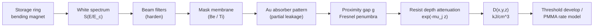

# LIGA Deep X-ray Lithography

**Status:** 🔶 Simplified — the full spectral depth-dose and shadow-image chain runs end-to-end, with documented approximations (first-Fresnel-zone proximity blur, $\mu_{en} \approx \mu$, edge-smoothed attenuation tables, relative flux only). Taxonomy: [capability matrix](../capability-matrix.md).

## Overview

LIGA (**Li**thographie, **G**alvanoformung, **A**bformung — lithography, electroforming, molding) was developed at Kernforschungszentrum Karlsruhe in the early 1980s to mass-produce uranium-enrichment separation nozzles, and became the canonical route to metal and polymer microstructures with extreme aspect ratios [1]. A synchrotron bending-magnet **white beam** (multi-keV, broadband) exposes 10–1000 µm of PMMA or SU-8 through a 1:1 proximity mask; the developed resist mold is then electroformed (Ni, NiFe, Au) and optionally replicated by injection molding or hot embossing. Because hard X-rays barely diffract and barely scatter in low-Z resists, sidewall runout of < 0.1 µm over 500 µm of depth — aspect ratios beyond 100:1 — is routine [1, 2].

This is **shadow printing, not projection**: no practical imaging optic exists at these photon energies and field sizes, so the mask sits a small gap above the resist and casts a near-geometric shadow. Consequently the `LithographySource` trait, pupil model, and Hopkins TCC/SOCS engine of the main pipeline **do not apply here** — [`deep_xray.rs`](../../crates/highuvlith-core/src/deep_xray.rs) bypasses the projection pipeline entirely. Simulation scope ends at the developed resist geometry; the electroforming and molding steps (the G and A of LIGA) are not modeled.

## Physics & math



The bending-magnet spectrum is characterized entirely by its critical energy,

$$E_c = 0.665\, E^2[\mathrm{GeV}]\, B[\mathrm{T}] \;\;\mathrm{keV},$$

with relative photon flux following the universal function $S(E/E_c)$. The spectrum is sampled into $j = 1..N$ energy bins with normalized weights $w_j$. Every layer the beam crosses transmits $e^{-\mu(E)t}$; the depth-resolved absorbed-energy density in the resist (relative units) is

$$u(z) = \sum_j w_j\, E_j\, T_{\mathrm{beam}}(E_j)\, \mu_j\, e^{-\mu_j z}, \qquad T_{\mathrm{beam}}(E) = e^{-\mu_{\mathrm{mem}}(E)\, t_{\mathrm{mem}}} \prod_{f \in \mathrm{filters}} e^{-\mu_f(E)\, t_f},$$

where $\mu_j$ is the resist linear attenuation at $E_j$. Because soft photons are absorbed preferentially near the surface, the effective decay rate $-\mathrm{d}\ln u/\mathrm{d}z$ **falls with depth** — spectral hardening — and upstream filters deliberately pre-harden the beam to reduce the top/bottom dose ratio.

Laterally, the Au absorber is only *partially* opaque to hard photons. Per energy bin, with mask intensity transmittance $P(x,y) \in [0,1]$:

$$I_j(x,y) = T_{\mathrm{abs}}(E_j) + \big(1 - T_{\mathrm{abs}}(E_j)\big)\, P(x,y),$$

so covered regions sit on a nonzero leakage floor. Each bin is blurred by the first-Fresnel-zone proximity penumbra

$$\sigma_{\mathrm{prox}} = \tfrac{1}{2}\sqrt{\lambda\, g}, \qquad \lambda = hc/E_j,$$

optionally combined in quadrature with the Grün photoelectron range $R_G[\mu\mathrm{m}] = 0.046\, E^{1.75}[\mathrm{keV}]/\rho[\mathrm{g/cm^3}]$ (off by default) [3, 4]. The volumetric dose is the separable product

$$D(x,y,z) = s \sum_j w_j'\, I_j(x,y)\, E_j\, \mu_j\, e^{-\mu_j z},$$

scaled by $s$ so that a fully open column reaches the target bottom dose. PMMA develops with **no post-exposure bake** — main-chain scission is direct radiolysis — at the empirical power-law rate

$$R = R_0\, (D/D_0)^{q},$$

a fit to GG/PGMEA developer data [2].

## Process regime

| Parameter | Typical value | Notes / citation |
|---|---|---|
| Resist | PMMA (positive, scission); SU-8 (negative, crosslinking) | [1, 2] |
| Thickness | 10–1000 µm (PMMA); up to mm-scale SU-8 | [1, 2] |
| Aspect ratio | > 100:1 (e.g. 500 µm / 5 µm) | [1] |
| Bottom (clearing) dose, PMMA | 2–4 kJ/cm³ | GG developer window [2, 5] |
| Damage ceiling (top dose) | ~20 kJ/cm³ (foaming, T-topping) | [2, 5] |
| Spectrum | Bending-magnet white beam, $E_c$ = 2–10 keV | e.g. 2.5 GeV / 1.5 T → $E_c$ = 6.23 keV |
| Mask absorber | 10–25 µm electroplated Au | [1, 5] |
| Mask membrane | 1–3 µm Ti or 100–500 µm Be | [5] |
| Proximity gap | 50–500 µm | sets $\sigma_{\mathrm{prox}}$ |
| Downstream | Ni/NiFe electroforming, injection molding | not simulated |

## Simulation model

Everything lives in [`crates/highuvlith-core/src/deep_xray.rs`](../../crates/highuvlith-core/src/deep_xray.rs):

- **`XraySpectrum`** — `Tabulated {energies_kev, relative_flux}` or `BendingMagnet {critical_energy_kev}`; `from_synchrotron()` maps a `SynchrotronSource` bending-magnet beamline via its critical energy (undulators return `None` — no white beam). `sample()` returns flux-weighted bins normalized to sum 1; the default window is $[0.1 E_c, 5 E_c]$ clamped to the tabulated 0.1–20 keV range.
- **`BeamFilter`** — a `Compound` + thickness; transmission $e^{-\mu(E)t}$.
- **`DeepXrayConfig`** — spectrum, filters, absorber, membrane, resist, geometry, dose targets. `pmma_default()` is 500 µm PMMA, 20 µm Au on 2 µm Ti, 100 µm gap, 3 kJ/cm³ bottom / 20 kJ/cm³ damage.
- **`depth_dose` / `expose_depth`** — 128-sample $u(z)$, scaled so the bottom hits the target; reports top/bottom `dose_ratio` and a `exceeds_damage_ceiling` flag.
- **`shadow_image` / `expose_volumetric`** — per-bin partial-absorber contrast, Gaussian penumbra blur, spectral accumulation; `expose_volumetric` returns `Grid3D<f64>` in absolute kJ/cm³.
- **Development & metrics** — `develop_depth` (per-column contiguous threshold scan, positive tone), `pmma_development_rate`, `dose_ratio`, `max_aspect_ratio`, `sidewall_dose_gradient` (per-slice max $|\mathrm{d}D/\mathrm{d}x|$ at the threshold crossing along the center row).

Attenuation data come from [`materials/attenuation.rs`](../../crates/highuvlith-core/src/materials/attenuation.rs): per-element $\mu/\rho$ [cm²/g] for H, C, N, O, Si, Au, Be, Ti, transcribed from **NIST XCOM/FFAST-style tables** onto a 17-node log grid (0.1–20 keV) with log-log interpolation and the mixture rule $\sum_i w_i (\mu/\rho)_i$. The grid *brackets* absorption edges (Au M/L, Ti K at 4.966 keV, Si K, …) rather than resolving them — near-edge fine structure is smoothed, and energies outside the grid clamp to the endpoints. Dose modelling takes $\mu_{en} \approx \mu$, justified in the 0.1–20 keV band by photoelectric dominance for low-Z resist elements (fluorescence/Compton losses are minor).

Known limitations, stated in code: the proximity blur is the first-Fresnel-zone width, not a full Fresnel–Kirchhoff propagation (planned); the beam is treated as normally incident and collimated (no divergence or scanner geometry); no mask heating, fluorescence, or substrate backscatter; and **absolute exposure time is deliberately `None`** — the spectral model carries relative flux only, so doses and ratios are physical but seconds are not.

## Model coverage

| Field | Unit | Consumed by | Status |
|---|---|---|---|
| `DeepXrayConfig.spectrum` | keV bins | `sample_spectrum` → all dose paths | live |
| `DeepXrayConfig.filters` | µm layers | `beam_transmission` (hardening) | live |
| `DeepXrayConfig.absorber` | µm Au | `absorber_image` (lateral leakage contrast) | live |
| `DeepXrayConfig.membrane` | µm Ti/Be | `beam_transmission` | live |
| `DeepXrayConfig.resist` | `Compound` | `mu_per_um` in every depth term | live |
| `DeepXrayConfig.resist_thickness_um` | µm | depth grid, aspect-ratio metric | live |
| `DeepXrayConfig.proximity_gap_um` | µm | `proximity_sigma_nm` blur | live |
| `DeepXrayConfig.target_bottom_dose_kj_cm3` | kJ/cm³ | absolute dose scaling | live |
| `DeepXrayConfig.damage_dose_kj_cm3` | kJ/cm³ | `exceeds_damage_ceiling` flag | live |
| `DeepXrayConfig.photoelectron_blur` | bool | `bin_sigma_nm` (Grün quadrature) | live |
| `DeepXrayConfig.energy_bins` | — | bending-magnet sampling | live |
| `LigaExposure.exposure_time_estimate` | s | nothing — always `None` (needs absolute ring flux) | stored (inert) |
| Full Fresnel–Kirchhoff gap propagation | — | — | planned |

## Usage

There is **no Python, CLI, or TOML surface for this module yet** (planned); it is Rust-API only.

```rust
use highuvlith_core::deep_xray::{expose_depth, expose_volumetric, DeepXrayConfig, XraySpectrum};
use highuvlith_core::source_models::synchrotron::SynchrotronSource;
use highuvlith_core::mask::Mask;
use highuvlith_core::types::GridConfig;

let spectrum = XraySpectrum::from_synchrotron(&SynchrotronSource::liga_bending_magnet())
    .expect("bending magnet has a critical energy"); // E_c = 6.234 keV
let config = DeepXrayConfig::pmma_default(spectrum);

let exposure = expose_depth(&config);
println!("top/bottom dose ratio: {:.2}", exposure.dose_ratio);
assert!(!exposure.exceeds_damage_ceiling);

let mask = Mask::line_space(2_000.0, 6_000.0)?; // 2 um lines, 6 um pitch
let grid = GridConfig::new(256, 50.0)?;
let dose = expose_volumetric(&config, &mask, &grid, 64)?; // D(x,y,z) in kJ/cm^3
```

## Validation

Physics pinned by `#[test]` functions in `deep_xray.rs`:

- `test_monochromatic_depth_dose_exponential` — single line reduces $u(z)$ to an exact $e^{-\mu z}$ and the bottom hits the target dose.
- `test_spectral_hardening_decay_slows_with_depth` — $-\mathrm{d}\ln u/\mathrm{d}z$ falls monotonically for a white beam.
- `test_filter_hardens_beam_lowers_ratio` — a 100 µm Be filter lowers the top/bottom ratio.
- `test_shadow_image_open_brighter_than_absorber` — nonzero Au leakage floor, open areas ≤ 1.
- `test_volumetric_open_column_hits_target`, `test_develop_depth_full_and_zero`, `test_sidewall_gradient_detects_edge`, `test_max_aspect_ratio_sanity`.
- `test_grun_range_fixture` — Grün range ≈ 1.47 µm for PMMA at 8 keV.
- `test_from_synchrotron_bending_magnet`, `test_sample_weights_sum_to_one`, `test_pmma_development_rate_power_law`.

Attenuation anchors in `materials/attenuation.rs`: `test_pmma_anchor_8kev` (~6.5 cm²/g), `test_pmma_anchor_3kev` (~125 cm²/g), `test_element_anchors` (C, Au at 8 keV), `test_log_log_between_nodes`, `test_carbon_monotone_decreasing_1_to_20_kev`, `test_mu_per_um_units`.

## References

1. E. W. Becker, W. Ehrfeld, P. Hagmann, A. Maner, D. Münchmeyer, "Fabrication of microstructures with high aspect ratios and great structural heights by synchrotron radiation lithography, galvanoforming, and plastic moulding (LIGA process)," *Microelectron. Eng.* **4**, 35–56 (1986).
2. W. Ehrfeld, H. Lehr, "Deep X-ray lithography for the production of three-dimensional microstructures from metals, polymers and ceramics," *Radiat. Phys. Chem.* **45**, 349–365 (1995).
3. A. E. Grün, "Lumineszenz-photometrische Messungen der Energieabsorption im Strahlungsfeld von Elektronenquellen," *Z. Naturforsch.* **12a**, 89 (1957).
4. F. J. Pantenburg, J. Mohr, "Influence of secondary effects on the structure quality in deep X-ray lithography," *Nucl. Instrum. Methods B* **97**, 551–556 (1995).
5. J. Mohr, W. Ehrfeld, D. Münchmeyer, "Requirements on resist layers in deep-etch synchrotron radiation lithography," *J. Vac. Sci. Technol. B* **6**, 2264 (1988).
6. M. J. Berger et al., *XCOM: Photon Cross Sections Database*, NIST Standard Reference Database 8; C. T. Chantler et al., *FFAST*, NIST SRD 66.
