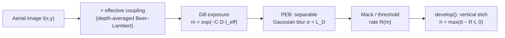

# Resist Models: Dill Exposure, PEB, Mack Development

**Status:** 🔶 Simplified — depth-averaged 2D exposure and center-row vertical development; the z-resolved path is [volumetric-exposure.md](./volumetric-exposure.md).

## Overview

The resist model turns an aerial intensity image into a developed profile, and with it
every dose-dependent quantity the framework reports: dose-to-size, exposure latitude,
resist CD, and the profile heights plotted by the Python viz layer. highuvlith implements
the classical positive-tone chemistry pair — Dill ABC exposure kinetics and the Mack
development rate — in [`crates/highuvlith-core/src/resist.rs`](../../crates/highuvlith-core/src/resist.rs).
This page documents exactly what the 2D path computes and, just as importantly, what it
does not: exposure is collapsed to a single depth-averaged coupling scalar, and
development is a vertical etch of the image's center row. Standing waves, sidewall
angles, and undercut live in the [volumetric path](./volumetric-exposure.md).

## Physics & math



### Dill exposure kinetics

The normalized photo-active compound (PAC) concentration `m` (1 = unexposed, 0 = fully
exposed) follows first-order Dill kinetics under dose $D$ (mJ/cm²):

$$
m(x,y) = \exp\left(-C \, D \, I_\mathrm{eff}(x,y)\right),
\qquad
I_\mathrm{eff} = I_\mathrm{aer} \cdot \frac{1 - e^{-\alpha d}}{\alpha d}
$$

where $C$ (cm²/mJ) is the exposure rate constant and the second factor is the
depth-average of Beer–Lambert decay through resist thickness $d$. The absorption
coefficient combines bleachable ($A$) and non-bleachable ($B$) parts:

$$
\alpha(m) = A\,m + B \quad [\mu\mathrm{m}^{-1}]
$$

(`ResistParams::absorption` converts to nm⁻¹ internally). The coupling factor
`effective_coupling()` is evaluated once at $m = 1$ (unbleached), so **bleaching does not
evolve during 2D exposure** — $A$ enters only through the initial $\alpha$. For an
optically thin film ($\alpha d < 0.01$) the coupling short-circuits to 1. The split-step
bleaching model that actually consumes $A$ dynamically is in the
[volumetric path](./volumetric-exposure.md#split-step-dill-bleaching).

### Post-exposure bake

`peb_diffuse` applies acid diffusion as a separable Gaussian blur of the latent image
with standard deviation equal to the diffusion length $L_D$ (`peb_diffusion_nm`),
converted to pixels as $\sigma = L_D / \mathrm{pixel_{nm}}$. The kernel is truncated at
$3\sigma$, normalized to unit sum, and applied along x then y with clamped (replicate)
boundaries. `peb_diffusion_nm = 0` is a no-op. This is isotropic Fickian diffusion of `m`
itself; no acid/quencher reaction–diffusion system is modeled.

### Mack development rate

`DevelopmentModel::Mack` implements the Mack "kinetic" rate (nm/s):

$$
R(m) = R_\mathrm{max}\,\frac{(a+1)(1-m)^n}{a + (1-m)^n} + R_\mathrm{min},
\qquad
a = \frac{n+1}{n-1}\,(1 - m_\mathrm{th})^n
$$

with `m` clamped to $[0, 1]$ before evaluation. The prefactor $a$ is singular at
$n = 1$; the code guards $|n - 1| < 10^{-12}$ and falls back to the linear interpolation
$R = R_\mathrm{max}(1 - m) + R_\mathrm{min}$ (pinned by `test_mack_n_near_one_no_panic`).
`DevelopmentModel::Threshold` is the fast alternative: 1000 nm/s where
$m < m_\mathrm{threshold}$, 0.01 nm/s otherwise.

### Development — center-row vertical limitation

`develop()` reads the rate on the **center row only** (`ny / 2`) of the 2D rate image and
etches each column straight down:

$$
h(x) = \max\big(d - R(m(x, y_c))\cdot t_\mathrm{dev},\; 0\big)
$$

There is no lateral development front, no rate variation with depth, and no y-resolved
profile — `ResistProfile` is a 1D cross-section (`x_nm`, `height_nm`). This is honest
for symmetric line/space cuts at best focus; for anything requiring sidewall angle or
undercut use `develop_fast_marching` in [volumetric-exposure.md](./volumetric-exposure.md).

## Process regime

Defaults model a VUV (157 nm) fluoropolymer resist; all parameters are user-settable.

| Quantity | Default (`ResistParams::vuv_fluoropolymer`) | Typical range modeled |
|---|---|---|
| Thickness | 150 nm | 50–400 nm (thin single layer; thick resists → volumetric/LIGA) |
| Dill A (bleachable) | 0.2 µm⁻¹ | 0.1–0.3 µm⁻¹ for VUV fluoropolymers (≪ DUV novolacs) |
| Dill B (non-bleachable) | 0.45 µm⁻¹ | 0.3–0.6 µm⁻¹ |
| Dill C | 0.02 cm²/mJ | resist-dependent |
| PEB diffusion length | 30 nm | 0–50 nm |
| Mack $R_\mathrm{max}$ / $R_\mathrm{min}$ / $m_\mathrm{th}$ / $n$ | 100 / 0.1 nm/s / 0.5 / 3 | — |
| Dose | 30 mJ/cm² (pipeline default) | 10–50 mJ/cm² |
| Aspect ratio | ≲ 3 (thin film, vertical etch only) | — |

## Model coverage

| Field (`ResistParams`) | Unit | Consumed by | Status |
|---|---|---|---|
| `thickness_nm` | nm | `effective_coupling`, `develop` height clamp | live |
| `dill_a` | 1/µm | `absorption(m)` → coupling (at m = 1 here; dynamically in volumetric bleaching) | live |
| `dill_b` | 1/µm | `absorption(m)` → coupling | live |
| `dill_c` | cm²/mJ | `expose` exponent | live |
| `peb_diffusion_nm` | nm | `peb_diffuse` σ (passed by `SimulationEngine.compute_resist_profile`) | live |
| `development` | enum | `development_rate` → `develop` / FMM | live |

## Usage

Python (real factory names from
[`crates/highuvlith-py/src/py_config.rs`](../../crates/highuvlith-py/src/py_config.rs)):

```python
import highuvlith as huv

resist = huv.ResistConfig(
    thickness_nm=150.0,
    dill_a=0.2, dill_b=0.45, dill_c=0.02,
    peb_diffusion_nm=30.0,
    model="mack",            # or "threshold"
)
# or: resist = huv.ResistConfig.vuv_fluoropolymer()

engine = huv.SimulationEngine(
    source=huv.SourceConfig.f2_laser(sigma=0.7),
    optics=huv.OpticsConfig(numerical_aperture=0.75),
    mask=huv.MaskConfig.line_space(cd_nm=65.0, pitch_nm=180.0),
    resist=resist,
)
profile = engine.compute_resist_profile(dose_mj_cm2=30.0, focus_nm=0.0, dev_time_s=60.0)
```

TOML — the CLI `simulate` command computes aerial images and metrics only and never runs
this 2D resist path; `[process]` carries dose and focus (fields from
[`crates/highuvlith-cli/src/config.rs`](../../crates/highuvlith-cli/src/config.rs)), and
resist chemistry parameters (Dill A/B/C, PEB, Mack) are **not** TOML-configurable today
(use the Python or Rust API). The z-resolved path does have a CLI surface — the `deep`
subcommand with `[deep] mode = "volumetric"` (see
[volumetric-exposure.md](./volumetric-exposure.md)):

```toml
[process]
dose_mj_cm2 = 30.0
focus_nm = 0.0
```

## Validation

`#[test]` functions in [`resist.rs`](../../crates/highuvlith-core/src/resist.rs):

- `test_unexposed_pac_is_one`, `test_expose_zero_dose_pac_one` — Dill boundary conditions ($I = 0$ or $D = 0$ ⇒ $m = 1$).
- `test_high_dose_pac_near_zero`, `test_higher_dose_lower_pac` — exposure monotonicity.
- `test_beer_lambert_coupling` — coupling → 1 at zero absorption.
- `test_mack_development_rate` — $R(0) \to R_\mathrm{max}$, $R(1) \to R_\mathrm{min}$.
- `test_mack_n_near_one_no_panic` — the $n \to 1$ singularity guard.
- `test_threshold_model_exposed` — threshold-model rate switching.
- `test_peb_diffusion_broadens` — Gaussian PEB reduces the peak of a delta latent image.
- `test_development_profile`, `test_develop_zero_time_full_thickness` — vertical develop behavior.

Cross-model pin: `test_z_mean_matches_effective_coupling` in
[`volumetric.rs`](../../crates/highuvlith-core/src/volumetric.rs) shows the exact
transfer-matrix `S(z)` averages to this page's coupling factor for a non-bleaching stack.

## References

- F. H. Dill, W. P. Hornberger, P. S. Hauge, J. M. Shaw, "Characterization of positive photoresist," *IEEE Trans. Electron Devices* **22**, 445 (1975).
- C. A. Mack, "Development of positive photoresists," *J. Electrochem. Soc.* **134**, 148 (1987).
- C. A. Mack, *Fundamental Principles of Optical Lithography*, Wiley (2007) — depth-averaged coupling and PEB diffusion length.
