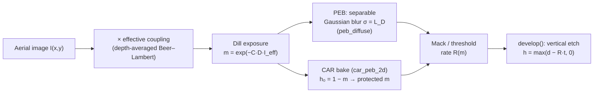
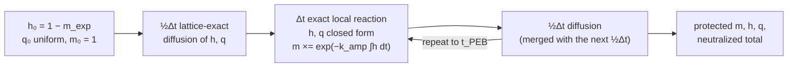

# Resist Models: Dill Exposure, PEB, CAR Chemistry, Mack Development

**Status:** 🔶 Simplified — depth-averaged 2D exposure and center-row vertical development, plus exact spectral (optionally anisotropic, depth-dependent) PEB diffusion and a standard chemically amplified acid/quencher reaction–diffusion bake with stated approximations; the z-resolved path is [volumetric-exposure.md](./volumetric-exposure.md).

## Overview

The resist model turns an aerial intensity image into a developed profile, and with it
every dose-dependent quantity the framework reports: dose-to-size, exposure latitude,
resist CD, and the profile heights plotted by the Python viz layer. highuvlith implements
the classical positive-tone chemistry pair — Dill ABC exposure kinetics and the Mack
development rate — and the chemically amplified resist (CAR) post-exposure bake in
[`crates/highuvlith-core/src/resist.rs`](../../crates/highuvlith-core/src/resist.rs).
This page documents exactly what the 2D path computes and, just as importantly, what it
does not: exposure is collapsed to a single depth-averaged coupling scalar, and
development is a vertical etch of the image's center row. Standing waves, sidewall
angles, and undercut live in the [volumetric path](./volumetric-exposure.md), which uses
the PEB and CAR solvers documented here on `(z, y, x)` volumes.

## Physics & math



### Dill exposure kinetics

The normalized photo-active compound (PAC) concentration `m` (1 = unexposed, 0 = fully
exposed) follows first-order Dill kinetics under dose $D$ (mJ/cm²):

```math
m(x,y) = \exp\left(-C \, D \, I_\mathrm{eff}(x,y)\right),
\qquad
I_\mathrm{eff} = I_\mathrm{aer} \cdot \frac{1 - e^{-\alpha d}}{\alpha d}
```

where $C$ (cm²/mJ) is the exposure rate constant and the second factor is the
depth-average of Beer–Lambert decay through resist thickness $d$. The absorption
coefficient combines bleachable ($A$) and non-bleachable ($B$) parts:

```math
\alpha(m) = A\,m + B \quad [\mu\mathrm{m}^{-1}]
```

(`ResistParams::absorption` converts to nm⁻¹ internally). The coupling factor
`effective_coupling()` is evaluated once at $m = 1$ (unbleached), so **bleaching does not
evolve during 2D exposure** — $A$ enters only through the initial $\alpha$. For an
optically thin film ($\alpha d < 0.01$) the coupling short-circuits to 1. The split-step
bleaching model that actually consumes $A$ dynamically is in the
[volumetric path](./volumetric-exposure.md#split-step-dill-bleaching). For a chemically
amplified resist the same Dill map describes photo-acid-generator (PAG) decomposition:
$m$ is the remaining PAG fraction and $1 - m$ the photogenerated acid.

### Post-exposure bake (2D Gaussian)

`peb_diffuse` applies acid diffusion as a separable Gaussian blur of the latent image
with standard deviation equal to the diffusion length $L_D$ (`peb_diffusion_nm`),
converted to pixels as $\sigma = L_D / \mathrm{pixel_{nm}}$. The kernel is truncated at
$3\sigma$, normalized to unit sum, and applied along x then y with clamped (replicate)
boundaries. `peb_diffusion_nm = 0` is a no-op. This is isotropic Fickian diffusion of `m`
itself. It is what `SimulationEngine.compute_resist_profile` (Python) uses. The exact
spectral and anisotropic diffusion helpers and the CAR reaction–diffusion bake below are
separate entry points; on the 2D path the CAR bake is reached through `car_peb_2d` (Rust)
or, from Python, `peb_car` on a single-slice `VolumetricResult`.

### Exact spectral diffusion helpers

Diffusion for a time $t$ is a Gaussian of standard deviation $\sigma = \sqrt{2Dt}$ per axis.
The helpers apply it exactly in Fourier space, one axis at a time, on `(z, y, x)` arrays:

| Function | Transfer function | Properties |
|---|---|---|
| `gaussian_diffuse_axis(data, axis, sigma_nm, spacing_nm, boundary)` | $\hat c(f) \leftarrow \hat c(f) e^{-2\pi^2\sigma^2 f^2}$ | exact heat-equation solution for the band-limited (trigonometric) interpolant of the samples; mass-conserving |
| `lattice_diffuse_axis(...)` (same arguments) | $\hat c_k \leftarrow \hat c_k e^{-(\sigma/h)^2 (1 - \cos 2\pi k/N)}$ | exact solution of the three-point semi-discrete diffusion equation (kernel $e^{-t} I_n(t)$, $t = (\sigma/h)^2$); strictly positive, variance exactly σ² for any σ, O(h²) dispersion error on barely resolved frequencies |

`DiffusionBoundary::Periodic` uses the plain FFT (matching the periodic field of the FFT
aerial engine); `DiffusionBoundary::Reflecting` is zero flux through the half-sample-
symmetric even extension of length 2N (the DCT-II eigenbasis of the Neumann problem). The
band-limited continuous Gaussian has small negative side lobes on sharp data when σ is
below ~1.5 samples: a unit impulse undershoots by −1.8·10⁻² at σ = 0.5 sample, −1.6·10⁻⁴
at σ = 1, −2.3·10⁻⁷ at σ = 1.5, and −2.6·10⁻¹¹ at σ = 2; smooth, well-sampled fields are
unaffected. The CAR bake therefore uses the positivity-preserving lattice kernel.

`peb_diffuse_anisotropic(data, [dz, dy, dx], &PebDiffusion)` combines them into a z-resolved
bake with independent lateral (`lateral_nm`, `lateral_boundary`) and vertical
(`vertical_nm`) lengths; z is always zero-flux (resist/air top, resist/substrate bottom).
With `vertical_diffusivity_scale = Some(s)` the vertical diffusivity varies with depth,
$D_z(z_k) = D_\mathrm{ref} s_k$ with $\sigma_z^2 = 2 D_\mathrm{ref} t$, and the z axis gets
the exact-in-time propagator $\exp\big((\sigma_z^2/2) L_s\big)$ of the cell-centred
finite-volume operator $L_s = \partial_z s(z) \partial_z$ (harmonic-mean face
diffusivities, zero flux at both ends). It is computed by uniformization plus scaling and
squaring — every term is entrywise non-negative, so the propagator preserves positivity
and conserves mass to roundoff. `PebDiffusion::with_exponential_depth_profile(nz, dz, r, δ)`
builds $s(z) = 1 + (r - 1)e^{-z/\delta}$ ($r > 1$: enhanced acid mobility near the top;
$r < 1$: a denser skin — a convenience parametrization, not a fitted law). The lateral
operator (constant $D$) commutes with the vertical one, so the axis-by-axis split is
exact.

### Chemically amplified resist (CAR) bake

`car_peb(acid0, [dz, dy, dx], &CarParams)` solves the standard Mack/PROLITH-class CAR
post-exposure bake, with all concentrations normalized to the initial PAG concentration
(so the rate constants are in 1/s):

```math
\frac{\partial m}{\partial t} = -k_\mathrm{amp}\, m\, h, \qquad
\frac{\partial h}{\partial t} = D_h \nabla^2 h - k_q\, h\, q, \qquad
\frac{\partial q}{\partial t} = D_q \nabla^2 q - k_q\, h\, q,
```

$h$ = acid, $q$ = base quencher, $m$ = protected (blocked) site fraction;
$h(0) = h_0 = 1 - m_\mathrm{exposure}$ (the decomposed PAG of the Dill latent image),
$q(0) = q_0$ (`quencher_initial`, uniform), $m(0) = 1$. The lateral diffusivities are
$D_h$, $D_q$; the vertical ones are scaled by `vertical_diffusivity_ratio` $= D_z/D_{xy}$.
After the bake $m$ is what the Mack rate consumes (1 protected / slow, 0 deprotected / fast).



Time integration is **Strang operator splitting**: half-step diffusion of $h$ and $q$ with
the exact lattice kernel (`lattice_diffuse_axis`; lateral per `lateral_boundary`, z
reflecting), a full-step **exact** local reaction, and another half-step of diffusion
(consecutive half steps merged into one full step, which is exact because the diffusion
propagators compose). The local pair $\dot h = \dot q = -k_q h q$ conserves
$c = h - q$ and has a closed form; with $a = |c|$, $F = 1 - e^{-k_q a \Delta t}$,
$\phi = F/(k_q a \Delta t)$:

```math
c \ge 0:\quad h' = \frac{h}{1 + q\,k_q\Delta t\,\phi},\quad
q' = \frac{q\,e^{-k_q a\Delta t}}{1 + q\,k_q\Delta t\,\phi},\quad
\int h\,dt = a\,\Delta t + \frac{\ln(1 + q\,k_q\Delta t\,\phi)}{k_q}
```

```math
c < 0:\quad h' = \frac{h\,e^{-k_q a\Delta t}}{1 + h\,k_q\Delta t\,\phi},\quad
q' = \frac{q}{1 + h\,k_q\Delta t\,\phi},\quad
\int h\,dt = \frac{\ln(1 + h\,k_q\Delta t\,\phi)}{k_q}
```

and the deprotection over the same substep is exact: $m' = m \exp(-k_\mathrm{amp}\int h dt)$.
These forms stay finite as $a \to 0$, $q_0 \to 0$, $h_0 \to 0$, or $k_q \to 0$. Both
substeps are unconditionally stable, so the step limit is an **accuracy** limit on the
$O(\Delta t^2)$ splitting error: the automatic step keeps the diffusion length per step at
or below one sample on every diffused axis ($\Delta t \le h^2 / 2D_\mathrm{max}$), capped by
`max_time_step_s`, with an integer number of steps ending exactly at `peb_time_s`; without
diffusion a single exact step is taken, and a bake that would need more than 10⁶ steps is
rejected. `CarPebResult` returns `protected`, `acid`, `quencher`, `neutralized_total`
($\sum h +$ `neutralized_total` $= \sum h_0$), `steps`, and `time_step_s`.

**2D connection.** `car_peb_2d(&mut latent, &params, pixel_nm)` treats the depth-averaged
`LatentImage` as a single slice ($h_0 = 1 -$ `pac`, no vertical diffusion) and writes the
protected fraction back into `latent.pac`, so `development_rate` / `develop` consume it
unchanged — after the call `pac` holds the protected-site fraction, not the PAG.

**Approximations (stated in the module header).** Concentrations are normalized to the
initial PAG; deprotection is first order in acid; there is no acid evaporation or trapping
loss; the diffusivities are constant (no deprotection- or free-volume-dependent
diffusivity); the time integration carries the $O(\Delta t^2)$ splitting error. The
`CarParams::default()` values are illustrative (60 s bake, $k_\mathrm{amp}$ = 0.1 s⁻¹,
$k_q$ = 10 s⁻¹, $q_0$ = 0.15, $D_h$ = 2 nm²/s i.e. $\sqrt{2D_h t}$ ≈ 15.5 nm,
$D_q$ = 0.5 nm²/s), not a fit to a specific resist.

<figure markdown="span">


<figcaption>Chemically amplified resist (CAR) post-exposure bake: acid/quencher reaction–diffusion with deprotection, default rates (60 s, k<sub>amp</sub> 0.1 s⁻¹, D<sub>acid</sub> 2 nm²/s). (a) A fixed 1-D acid profile baked with more quencher deprotects less and with a steeper edge. (b, c) A real volumetric latent image — F<sub>2</sub> 157.63 nm, NA 0.75, 150 nm lines on a 300 nm pitch, 150 nm resist on silicon, so standing waves band the acid — before and after the bake. Model: CAR PEB 🔶 (standard Mack/PROLITH-class equations; illustrative constants, no acid loss).</figcaption>
</figure>

### Mack development rate

`DevelopmentModel::Mack` implements the Mack "kinetic" rate (nm/s):

```math
R(m) = R_\mathrm{max}\,\frac{(a+1)(1-m)^n}{a + (1-m)^n} + R_\mathrm{min},
\qquad
a = \frac{n+1}{n-1}\,(1 - m_\mathrm{th})^n
```

with `m` clamped to $[0, 1]$ before evaluation. The prefactor $a$ is singular at
$n = 1$; the code guards $|n - 1| < 10^{-12}$ and falls back to the linear interpolation
$R = R_\mathrm{max}(1 - m) + R_\mathrm{min}$ (pinned by `test_mack_n_near_one_no_panic`).
`DevelopmentModel::Threshold` is the fast alternative: 1000 nm/s where
$m < m_\mathrm{threshold}$, 0.01 nm/s otherwise. For a CAR, $m$ is the protected fraction
after `car_peb` / `car_peb_2d`.

### Development — center-row vertical limitation

`develop()` reads the rate on the **center row only** (`ny / 2`) of the 2D rate image and
etches each column straight down:

```math
h(x) = \max\big(d - R(m(x, y_c))\cdot t_\mathrm{dev},\; 0\big)
```

There is no lateral development front, no rate variation with depth, and no y-resolved
profile — `ResistProfile` is a 1D cross-section (`x_nm`, `height_nm`). This is honest
for symmetric line/space cuts at best focus; for anything requiring sidewall angle,
undercut, surface inhibition, or developer depletion use the fast-marching or level-set
tiers in [volumetric-exposure.md](./volumetric-exposure.md).

## Process regime

Defaults model a VUV (157 nm) fluoropolymer resist; all parameters are user-settable.

| Quantity | Default (`ResistParams::vuv_fluoropolymer`) | Typical range modeled |
|---|---|---|
| Thickness | 150 nm | 50–400 nm (thin single layer; thick resists → volumetric/LIGA) |
| Dill A (bleachable) | 0.2 µm⁻¹ | 0.1–0.3 µm⁻¹ for VUV fluoropolymers (≪ DUV novolacs) |
| Dill B (non-bleachable) | 0.45 µm⁻¹ | 0.3–0.6 µm⁻¹ |
| Dill C | 0.02 cm²/mJ | resist-dependent |
| PEB diffusion length | 30 nm | 0–50 nm |
| Mack $R_\mathrm{max}$ / $R_\mathrm{min}$ / $m_\mathrm{th}$ / $n$ | 100 / 0.1 nm/s / 0.5 / 3 | — |
| Dose | 30 mJ/cm² (pipeline default) | 10–50 mJ/cm² |
| Aspect ratio | ≲ 3 (thin film, vertical etch only) | — |

CAR bake (`CarParams::default()`, illustrative):

| Quantity | Default | Typical range modeled |
|---|---|---|
| Bake time | 60 s | 30–120 s |
| $k_\mathrm{amp}$ (deprotection) | 0.1 s⁻¹ | resist- and temperature-dependent |
| $k_q$ (neutralization) | 10 s⁻¹ | fast relative to the bake |
| Quencher loading $q_0$ | 0.15 of the PAG | 0.05–0.3 |
| Acid diffusivity $D_h$ | 2 nm²/s ($\sqrt{2D_h t}$ ≈ 15.5 nm at 60 s) | diffusion lengths 5–30 nm |
| Quencher diffusivity $D_q$ | 0.5 nm²/s | usually ≤ $D_h$ |
| Vertical ratio $D_z/D_{xy}$ | 1 | < 1 for interface-hindered vertical diffusion |

Representative values from the literature for a calibrated EUV CAR model (Bhattarai,
Neureuther, Naulleau [4]; not used as defaults, and not a calibration of this code):

| Quantity | Reported value | Mapping onto `CarParams` |
|---|---|---|
| PAG / quencher loading | 0.4 nm⁻³ / 0.04 nm⁻³ | `quencher_initial` ≈ 0.1 (quencher / PAG) |
| Acids per absorbed EUV photon | 2 (≈ 3 nm electron range) | sets $h_0$ scale; electron blur is outside this model |
| Measured deprotection blur | ≈ 2–3.5 nm at 90 °C PEB, 4.5–5.5 nm at 110 °C | first guess: $D_h \approx \sigma^2 / (2 t_\mathrm{PEB})$, e.g. σ = 3 nm over 60 s → 0.075 nm²/s |
| Organic CAR absorption at 13.5 nm | ≈ 4.8 µm⁻¹ (a 35 nm film absorbs ≈ 15 %) [5] | Dill absorption $A m + B$ in µm⁻¹ (exposure, not the bake) |

The default `CarParams` diffusion length (≈ 15.5 nm) is therefore long for an EUV CAR; set
the diffusivities from the measured blur when modeling EUV. The model is a deterministic
continuum: photon shot noise and acid/quencher counting statistics — which the same
calibrated model attributes 46 %, 22 %, and 32 % of the LER budget to [4] — and the
resolution–LER–sensitivity trade-off summarized by the Z-factor $Z = \mathrm{HP}^3 \cdot \mathrm{LER}^2 \cdot \mathrm{dose}$ [6]
are outside it.

## Model coverage

`ResistParams`:

| Field | Unit | Consumed by | Status |
|---|---|---|---|
| `thickness_nm` | nm | `effective_coupling`, `develop` height clamp | live |
| `dill_a` | 1/µm | `absorption(m)` → coupling (at m = 1 here; dynamically in volumetric bleaching) | live |
| `dill_b` | 1/µm | `absorption(m)` → coupling | live |
| `dill_c` | cm²/mJ | `expose` exponent | live |
| `peb_diffusion_nm` | nm | `peb_diffuse` σ (passed by `SimulationEngine.compute_resist_profile`) | live |
| `development` | enum | `development_rate` → `develop` / FMM / level set | live |

`CarParams` (`car_peb`, `car_peb_2d`, `PebModel::ChemicallyAmplified`):

| Field | Unit | Consumed by | Status |
|---|---|---|---|
| `peb_time_s` | s | bake duration (step count) | live |
| `k_amp_per_s` | 1/s | deprotection $m' = m e^{-k_\mathrm{amp}\int h dt}$ | live |
| `k_quench_per_s` | 1/s | exact local neutralization | live |
| `quencher_initial` | fraction of PAG | uniform $q_0$ | live |
| `acid_diffusivity_nm2_s` | nm²/s | lattice diffusion of $h$ | live |
| `quencher_diffusivity_nm2_s` | nm²/s | lattice diffusion of $q$ | live |
| `vertical_diffusivity_ratio` | — | $D_z =$ ratio · $D_{xy}$ for both species | live |
| `lateral_boundary` | enum | periodic / reflecting x, y (z always zero-flux) | live |
| `max_time_step_s` | s | optional cap on the splitting step | live |
| Acid evaporation / trapping loss, deprotection-dependent diffusivity, higher reaction orders | — | — | planned |

`PebDiffusion` (`peb_diffuse_anisotropic`, `PebModel::Gaussian`):

| Field | Unit | Consumed by | Status |
|---|---|---|---|
| `lateral_nm` | nm | σ of the x and y passes | live |
| `vertical_nm` | nm | σ of the z pass (reference σ with a depth profile) | live |
| `vertical_diffusivity_scale` | — (length nz) | depth-dependent $D_z$ propagator | live |
| `lateral_boundary` | enum | periodic / reflecting x, y | live |
| Depth-dependent lateral diffusivity | — | — | planned |

## Usage

Python (real factory names from
[`crates/highuvlith-py/src/py_config.rs`](../../crates/highuvlith-py/src/py_config.rs)):

<!-- verify-example -->
```python
import highuvlith as huv

resist = huv.ResistConfig(
    thickness_nm=150.0,
    dill_a=0.2, dill_b=0.45, dill_c=0.02,
    peb_diffusion_nm=30.0,
    model="mack",            # or "threshold"
)
# or: resist = huv.ResistConfig.vuv_fluoropolymer()

engine = huv.SimulationEngine(
    source=huv.SourceConfig.f2_laser(sigma=0.7),
    optics=huv.OpticsConfig(numerical_aperture=0.75),
    mask=huv.MaskConfig.line_space(cd_nm=65.0, pitch_nm=180.0),
    resist=resist,
)
profile = engine.compute_resist_profile(dose_mj_cm2=30.0, focus_nm=0.0, dev_time_s=60.0)
```

The CAR bake and the anisotropic Gaussian bake are exposed in `highuvlith.api` for
volumes (a 2D latent image is a single-slice volume):

<!-- verify-example -->
```python
import numpy as np
import highuvlith as huv
from highuvlith.api import peb_car, peb_gaussian

engine = huv.SimulationEngine(huv.SourceConfig.f2_laser(sigma=0.7),
                              huv.OpticsConfig(numerical_aperture=0.85),
                              huv.MaskConfig.line_space(cd_nm=64.0, pitch_nm=128.0),
                              grid=huv.GridConfig(size=256, pixel_nm=1.0))
intensity = engine.compute_aerial_image(focus_nm=0.0).intensity
m_exp = np.exp(-0.05 * 30.0 * intensity)  # Dill bleaching exp(-C E I): C = 0.05 cm²/mJ, 30 mJ/cm²
vol = huv.VolumetricResult.from_array(m_exp[None, :, :], (0.0, 256.0), (0.0, 256.0), (0.0, 1.0))
car = peb_car(vol, peb_time_s=60.0, k_amp=0.1, k_quench=10.0, quencher=0.15,
              acid_diffusivity_nm2_s=2.0, quencher_diffusivity_nm2_s=0.5)
protected = car.protected.values[0]          # feed to the development rate
acid_left, neutralized = car.acid.values, car.neutralized_total
blurred = peb_gaussian(vol, 20.0)                     # exact Gaussian (lateral only for nz = 1)
```

Rust:

```rust
use highuvlith_core::resist::{car_peb_2d, develop, expose, CarParams, ResistParams};

let params = ResistParams::default();
let mut latent = expose(&aerial.data, 30.0, &params);        // remaining PAG
let state = car_peb_2d(&mut latent, &CarParams::default(), pixel_nm)?;
// latent.pac now holds the protected fraction the Mack rate consumes.
let profile = develop(&latent, &params, 60.0, pixel_nm);
```

TOML — the CLI `simulate` command computes aerial images and metrics only and never runs
this 2D resist path; `[process]` carries dose and focus (fields from
[`crates/highuvlith-cli/src/config.rs`](../../crates/highuvlith-cli/src/config.rs)), and
the 2D resist chemistry (Dill A/B/C, PEB, Mack) is **not** TOML-configurable today (use
the Python or Rust API). The z-resolved path has a CLI surface — `highuvlith deep` with
`[deep] mode = "volumetric"`, including the Gaussian or CAR bake (`peb`, `car_*` keys; see
[volumetric-exposure.md](./volumetric-exposure.md#usage)):

```toml
[process]
dose_mj_cm2 = 30.0
focus_nm = 0.0
```

## Validation

`#[test]` functions in [`resist.rs`](../../crates/highuvlith-core/src/resist.rs):

2D path:

- `test_unexposed_pac_is_one`, `test_expose_zero_dose_pac_one` — Dill boundary conditions ($I = 0$ or $D = 0$ ⇒ $m = 1$).
- `test_high_dose_pac_near_zero`, `test_higher_dose_lower_pac` — exposure monotonicity.
- `test_beer_lambert_coupling` — coupling → 1 at zero absorption.
- `test_mack_development_rate` — $R(0) \to R_\mathrm{max}$, $R(1) \to R_\mathrm{min}$.
- `test_mack_n_near_one_no_panic` — the $n \to 1$ singularity guard.
- `test_threshold_model_exposed` — threshold-model rate switching.
- `test_peb_diffusion_broadens` — Gaussian PEB reduces the peak of a delta latent image.
- `test_development_profile`, `test_develop_zero_time_full_thickness` — vertical develop behavior.

Spectral diffusion (fixtures from independent numpy / power-series evaluations):

- `test_gaussian_diffuse_axis_fixture_periodic_and_reflecting` — periodic and reflecting kernels on every axis to 1e-14 (including the −5.2·10⁻⁴ side lobe at σ = 1 sample).
- `test_lattice_kernel_matches_modified_bessel` — the lattice kernel equals $e^{-t}I_n(t)$ at $t$ = 1 and 2.25 to 1e-14 and is non-negative.
- `test_gaussian_variance_exact_per_axis` — anisotropic variances (16, 16, 36 nm²) to 1e-9, periodic and reflecting.
- `test_lattice_variance_exact_even_for_small_sigma` — variance exactly σ² at σ = 0.3 sample (1e-12).
- `test_peb_axes_independent_and_commuting` — lateral-only and vertical-only bakes leave the other axis' projections unchanged; the axis passes commute.
- `test_depth_profile_uniform_scale_matches_lattice_and_gaussian` — a uniform depth profile reproduces the reflecting lattice kernel (1e-12) and converges to the continuous Gaussian at second order (2.46·10⁻³ → 6.3·10⁻⁴ from dz = 4 to 2 nm).
- `test_depth_profile_conserves_mass_and_slows_low_d_region` — variance 36 nm² where $D = D_\mathrm{ref}$ and 3.6 nm² where $D$ is 10× lower; mass conserved; entrywise non-negative.
- `test_peb_zero_sigma_identity_and_invalid_params`.

CAR bake:

- `test_car_no_quencher_no_diffusion_exact_exponential` — $m = e^{-k_\mathrm{amp}h_0t}$ = $e^{-1.2}, e^{-3}, e^{-5.4}$ to 1e-12, in one exact step or many.
- `test_car_reaction_only_matches_rk4_fixtures` — four reaction-only cases (including a stiff $k_q$ = 50 s⁻¹ one) against an independent RK4 integration to 1e-10.
- `test_car_pure_diffusion_variance_is_2dt` — variance $2Dt$ per axis (6, 6, 3 nm² with $D_z/D_{xy}$ = 0.5) to 1e-8, periodic and reflecting.
- `test_car_mass_balance` — $\sum(h - q)$ conserved and $\sum h$ + neutralized $= \sum h_0$ to 1e-12.
- `test_car_quencher_reduces_deprotection_and_sharpens_edge` — raising $q_0$ from 0 to 0.3 lowers the mean deprotection and raises the normalized edge slope monotonically (in that test case 0.654 → 0.366 and 0.042 → 0.077 nm⁻¹) while the unexposed line stays protected ($m$ > 0.999).
- `test_car_strang_splitting_is_second_order` — halving Δt reduces the error ≈ 4× for $m$ and $h$.
- `test_car_default_step_is_accuracy_limited`, `test_car_2d_writes_protected_fraction` (identical to the single-slice 3D call; the Mack rate then develops the exposed centre > 100× faster than the edges), `test_car_zero_time_identity_and_invalid_params`.

Cross-model pins in [`volumetric.rs`](../../crates/highuvlith-core/src/volumetric.rs):
`test_z_mean_matches_effective_coupling` shows the exact transfer-matrix `S(z)` averages to
this page's coupling factor for a non-bleaching stack; `test_apply_peb_models` checks the CAR
exact limit through the volumetric pipeline. Python: `test_peb_car_exact_limit_and_mass_balance`,
`test_peb_gaussian_anisotropic_moments` in `tests/python/test_volumetric.py`.

## References

1. F. H. Dill, W. P. Hornberger, P. S. Hauge, J. M. Shaw, "Characterization of positive photoresist," *IEEE Trans. Electron Devices* **22**, 445 (1975).
2. C. A. Mack, "Development of positive photoresists," *J. Electrochem. Soc.* **134**, 148 (1987).
3. C. A. Mack, *Fundamental Principles of Optical Lithography*, Wiley (2007) — depth-averaged coupling, PEB diffusion length, and the chemically amplified resist reaction–diffusion model.
4. Bhattarai, Neureuther, Naulleau, *J. Vac. Sci. Technol. B* **35**, 061602 (2017), doi:10.1116/1.4991054, and Bhattarai, UC Berkeley thesis UCB/EECS-2017-125 — calibrated EUV CAR model parameters and measured deprotection blur.
5. Fallica et al., *J. Micro/Nanolithogr. MEMS MOEMS* **17**(2), 023505 (2018) — EUV resist absorption.
6. Wallow et al., *Proc. SPIE* **6921** (2008) — the Z-factor.
