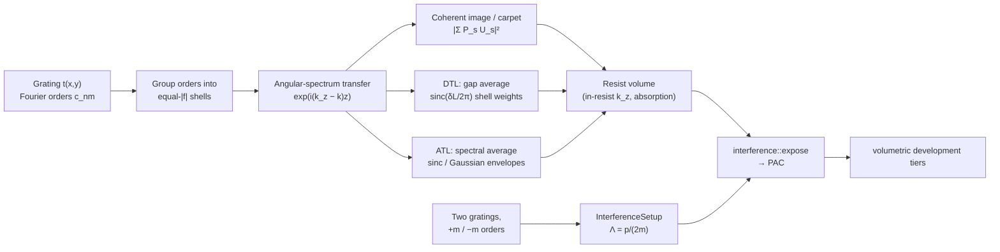

# Talbot & EUV Interference Lithography

**Status:** 🔶 Simplified — the scalar angular-spectrum Talbot carpet, displacement-Talbot (DTL) and achromatic-Talbot (ATL) stationary images, and two-grating EUV interference fringes are computed and pinned to closed forms, with documented approximations (thin-mask Kirchhoff grating, perfectly coherent normal illumination, wavelength-independent grating coefficients, no Fresnel coefficients at the resist). Taxonomy: [capability matrix](../capability-matrix.md).

## Overview

A periodic transmission grating illuminated by a coherent plane wave re-images itself behind the mask every **Talbot length** — the Talbot effect — with a half-period-shifted copy halfway between and sub-period "fractional" images in between: the Talbot carpet. That makes a single grating a lens-less printer for periodic arrays, and at EUV/soft-X-ray wavelengths, where lenses are unavailable or impractical, it is one of the most direct ways to pattern dense lines and dot arrays over large areas.

Printing at one fixed gap is fragile (the image changes completely within a fraction of a Talbot length), so two methods make the printed image **stationary**:

- **Displacement Talbot lithography (DTL)** scans the mask–wafer gap over (an integer number of) Talbot lengths during the exposure; the time-integrated image no longer depends on the gap.
- **Achromatic Talbot lithography (ATL)** instead uses a broadband source (synchrotron, HHG, soft-X-ray laser) and puts the wafer beyond the *achromatic distance*, where the spectral average washes out the Talbot revivals.

For a 1D grating both give an image with **half the mask period** (spatial-frequency doubling). The related **two-grating EUV interference lithography (EUV-IL)** scheme overlaps the +m order of one transmission grating with the −m order of a second one; the fringes have period `p/(2m)` whatever the wavelength.

[`talbot.rs`](../../crates/highuvlith-core/src/talbot.rs) implements all four and emits intensity volumes that feed the same PAC and development tiers as [interference lithography](./interference-volumetric.md) and the [volumetric path](./volumetric-exposure.md). Like LIGA and interference lithography it bypasses the projection pipeline: there is no pupil, TCC, or illumination σ.

## Physics & math



### Grating orders

The mask is a thin (Kirchhoff) transmission `t(x, y) = Σ c_nm exp(2πi(n x/p_x + m y/p_y))`. For a binary 1D grating whose "line" of width $f p$ (transmission $t_l$) is centred at $x = 0$ in a space of transmission $t_s$:

```math
c_0 = t_s + (t_l - t_s)\,f, \qquad c_n = (t_l - t_s)\, f\, \mathrm{sinc}(n f), \qquad \mathrm{sinc}(u) = \frac{\sin \pi u}{\pi u}.
```

An **amplitude** grating is $t_l = 1, t_s = 0$ (open fraction $f$); a **phase** grating is $t_l = e^{i\varphi}, t_s = 1$, and a π step at 50 % duty cycle suppresses the zeroth order ($|c_{\pm1}|^2 = 4/\pi^2 \approx 0.405$). Circular-hole arrays use the exact Airy form factor

```math
c_{nm} = \frac{\pi r^2}{A}\, S_{nm}\, \frac{2 J_1(2\pi r |\mathbf f|)}{2\pi r |\mathbf f|},
```

with $A$ the unit-cell area and $S_{nm}$ the structure factor of the holes in the cell (the hexagonal lattice uses the rectangular supercell $a \times \sqrt3 a$ with $S = 1 + (-1)^{n+m}$). Arbitrary unit cells are sampled and transformed exactly as pixelated (piecewise-constant) cells.

### Propagation and the Talbot length

Each order is a plane wave of transverse frequency $\mathbf f = (n/p_x, m/p_y)$. Dropping the common carrier $e^{ikz}$, the exact scalar (angular-spectrum) transfer through a medium of index $n_g$ is

```math
U(\mathbf r, z) = \sum_{nm} c_{nm}\, e^{2\pi i \mathbf f\cdot\mathbf r}\, e^{i(k_z - k)z}, \qquad k_z - k = -\frac{2\pi |\mathbf f|^2}{n_g/\lambda + \sqrt{(n_g/\lambda)^2 - |\mathbf f|^2}},
```

(orders with $|\mathbf f| > n_g/\lambda$ are evanescent and decay), or in the paraxial (Fresnel) approximation $k_z - k = -\pi\lambda|\mathbf f|^2/n_g$. In the paraxial model every order rephases after the **Talbot length**, and half-way the image is shifted by $p/2$:

```math
z_T = \frac{2p^2}{\lambda}, \qquad U(x, z_T/2) = U(x + p/2, 0).
```

The exact rephasing length of the 0 and ±1 orders is

```math
z_T^{\text{exact}} = \frac{\lambda}{1 - \sqrt{1 - \lambda^2/p^2}} = \frac{p^2}{\lambda}\left(1 + \sqrt{1 - \lambda^2/p^2}\right) = \frac{2p^2}{\lambda}\left(1 - \frac{\lambda^2}{4p^2} + \dots\right).
```

It is an exact period of the field only when those are the only propagating orders ($p < 2\lambda$) or for a sinusoidal grating; with more propagating orders the non-paraxial field is quasi-periodic.

<figure markdown="span">


<figcaption>Talbot self-imaging at 13.5 nm. (a) Intensity behind a 100 nm-period binary amplitude grating (±10 orders, exact angular-spectrum propagation): the grating re-images at the Talbot length (2p²/λ ≈ 1481 nm paraxially, 1475 nm exactly) and shows the half-shifted and doubled images in between. (b) Averaging over a scanned gap (displacement Talbot lithography) gives a stationary image with half the period. Model: Talbot / DTL 🔶 (scalar thin mask, coherent normal illumination).</figcaption>
</figure>

<figure markdown="span">


<figcaption>Scanning the carpet (a still from the demo video, <code>examples/generate_demo.py</code>). Same grating as above (100 nm, 1:1 amplitude, 13.5 nm, ±10 orders). At z = 2216 nm (≈ 3z_T/2) the image is the half-period-shifted copy of the grating; the running average over up to one Talbot length (green) converges to the engine's DTL image (dashed), which has half the mask period. Model: Talbot / DTL 🔶 (scalar thin mask, coherent normal illumination).</figcaption>
</figure>

### Shell formulation of incoherent averages

The transfer function depends on $|\mathbf f|$ only, so orders are grouped into *shells* $s$ of equal $|\mathbf f|$ with shell fields $U_s(\mathbf r) = \sum_{a \in s} c_a e^{2\pi i \mathbf f_a\cdot\mathbf r}$. Every exposure mode is then $I(\mathbf r) = \sum_{st} W_{st} U_s U_t^*$ with the Hermitian weight matrix $W_{st} = \langle P_s P_t^*\rangle$:

- **Coherent**: $W = P P^\dagger$ at the gap $g$.
- **DTL** (gap uniformly scanned over $[g, g + L]$), a closed form: $W_{st} = P_s P_t^*\big|_{g + L/2}\ \mathrm{sinc}(\delta_{st} L / 2\pi)$, $\delta_{st} = \partial_g(\phi_s - \phi_t)$. In the paraxial model $\delta_{st} L/2\pi = -(n_s^2 - n_t^2)$ for $L = z_T$, so every cross term between different shells vanishes; $L \to \infty$ gives the **stationary image**

```math
I_\text{DTL}(\mathbf r) = \sum_s |U_s(\mathbf r)|^2 \;\xrightarrow{\ \text{1D}\ }\; \sum_n |c_n|^2 + 2\,\mathrm{Re}\sum_{n>0} c_n c_{-n}^* e^{4\pi i n x/p},
```

whose period is $p/2$.
- **ATL** (spectral average at gap $g$). Paraxially the cross-term phase is linear in λ, $\phi_s - \phi_t = -\pi\lambda z (f_s^2 - f_t^2)$, so for a flat-top band of full width $\Delta\lambda$ and $f^2 = n^2/p^2$:

```math
\left\langle e^{-i\pi\lambda z D/p^2}\right\rangle = e^{-i\pi\lambda_0 z D/p^2}\,\mathrm{sinc}\!\left(\frac{D\,\Delta\lambda\, z}{2p^2}\right), \qquad D = n^2 - n'^2,
```

whose first zero for the slowest term ($D = 1$, orders 0/±1) defines the **achromatic distance**

```math
z_A = \frac{2p^2}{\Delta\lambda}.
```

For a Gaussian band of rms width $\sigma_\lambda$ the envelope is $\exp[-(\pi\sigma_\lambda z D/p^2)^2/2]$ (≈ 0.03 at $z = z_A$ for FWHM $= \Delta\lambda$). Beyond a few $z_A$ the ATL image equals the stationary DTL image. With exact propagation the phase is not linear in λ; the spectrum is split into bins, each treated with a linear phase across the bin (a sinc-weighted midpoint rule that damps, rather than aliases, rapidly varying high-order terms).

### Recording in the resist

Inside a resist of real index $n_r$ (which may be < 1 at EUV) each order continues with its own $k_z$ at $\lambda/n_r$ and decays as $\exp(-\alpha z/(2\cos\theta))$ along its slanted path — the convention of [interference-volumetric.md](./interference-volumetric.md). No Fresnel transmission coefficients or back-reflections are applied. Because the stationary DTL image only contains equal-$|\mathbf f|$ pairs, which share the in-resist $k_z$, it is depth-invariant apart from absorption: DTL/ATL prints have essentially unlimited depth of field.

### Two-grating EUV interference

The +m order of one grating and the −m order of a second grating of the same period overlap at $\pm\theta$ with $\sin\theta = m\lambda/p$ (requires $m\lambda < p$):

```math
\Lambda = \frac{\lambda}{2\sin\theta} = \frac{p}{2m}, \qquad V = \frac{2\sqrt{I_1 I_2}}{I_1 + I_2}, \qquad I_{1,2} = |c_{\pm m}|^2.
```

The fringe period is set by the grating alone — wavelength and resist index drop out (the same refraction invariance as [two-beam interference](./interference-volumetric.md)). For $m = 1$ the printed half-pitch is $p/4$, the relation used at the PSI EUV-IL beamline [7]. `TwoGratingInterference::to_interference_setup` turns the geometry into a two-beam, TE-polarized [`InterferenceSetup`](../../crates/highuvlith-core/src/interference.rs), so vector contrast and absorption are handled by that module.

## Process regime

Illustrative numbers computed with the formulas above (they are what `examples/talbot.toml` prints).

| Quantity | Example | Notes |
|---|---|---|
| Wavelength | 13.5 nm (EUV undulator / HHG / SXRL); UV lasers for DTL | ATL and EUV-IL need spatially coherent sources |
| Mask period $p$ | 100 nm (EUV); µm-scale for UV DTL | printed period $p/2$ (DTL/ATL, 1D) or $p/(2m)$ (EUV-IL) |
| Talbot length | $2p^2/\lambda$ = 1.48 µm (p = 100 nm, 13.5 nm) | exact 0/±1 value 1.474 µm |
| Achromatic distance | $2p^2/\Delta\lambda$ = 66.7 µm (Δλ = 0.3 nm) | proximity gaps of 10²-µm scale |
| First-order efficiency | $1/\pi^2 \approx 10$ % (50 % slits), $4/\pi^2 \approx 41$ % (π-phase) | sets the EUV-IL dose |
| EUV-IL angle | θ = 7.76° for m = 1, p = 100 nm, 13.5 nm | $\sin\theta = m\lambda/p$ |

Reported experimental context (for orientation only; nothing here is simulated or calibrated against these results):

| Topic | Reported | Source |
|---|---|---|
| Achromatic Talbot lithography | 1D/2D patterns with 50 nm features at EUV; depth of field described as "practically unlimited" | [5] |
| Displacement Talbot lithography | gap-integrated image independent of the mask–wafer gap | [4] |
| Coherent (single-plane) Talbot printing | table-top 46.9 nm laser, up to the 6th Talbot plane (not achromatic) | [8] |
| EUV-IL half-pitch records (PSI) | 7 nm [9], 6 nm [10]; 5 nm reported in 2024 with mirror interference lithography (two mirrors + central stop) [11] | [9–11] |
| EUV-IL resist screening | down to 18 nm half-pitch across resist families | [7] |
| PSI XIL-II beamline | ≈ 3×10¹⁵ photons s⁻¹ cm⁻² per 4 % bandwidth at 92 eV, 5 × 5 mm² field (SLS 2.0 user operation expected from mid-2026) | [12] |

## Simulation model

All in [`crates/highuvlith-core/src/talbot.rs`](../../crates/highuvlith-core/src/talbot.rs):

- **`Grating`** — `period_x_nm`, `period_y_nm` (None for 1D), and the retained `orders: Vec<DiffractionOrder>` (`n`, `m`, complex `amplitude`). Constructors: `binary`, `binary_amplitude`, `binary_phase`, `sinusoidal_amplitude`, `from_coefficients`, `from_profile`, `separable`, `from_unit_cell`, `hole_array_square`, `hole_array_hexagonal` (hole arrays truncate orders on a circle so the retained set keeps the lattice symmetry). Helpers `coefficient`, `efficiency`, `total_efficiency`, `transmission`.
- **`TalbotSetup`** — grating + `wavelength_nm` + `gap_index` + `propagation` (`AngularSpectrum` default, or `Paraxial`). `talbot_length_nm`, `talbot_length_exact_nm`, `propagating_efficiency`, `field`, `intensity_plane`, `carpet` (optionally spectrally averaged), `exposure_image`, `resist_volume`.
- **`ExposureMode`** — `Coherent`, `Displacement { scan_length_nm }`, `DisplacementStationary`, `Achromatic(Spectrum)`; **`Spectrum`** — `FlatTop`, `Gaussian`, or discrete `Lines` (e.g. HHG harmonics, summed incoherently).
- **`ResistMedium`** — resist `index` and `absorption_per_nm`.
- **`TwoGratingInterference`** — period, wavelength, order, beam intensities, relative phase; constructors `new` (beam intensities from a `Grating`'s ±m orders) and `from_efficiencies`; `sin_theta`, `fringe_period_nm`, `diffraction_angle_deg`, `visibility`, `intensity_at`, `to_interference_setup`.
- Free functions: `talbot_length_paraxial_nm`, `talbot_length_exact_nm`, `achromatic_distance_nm`, `two_grating_fringe_period_nm`, `dominant_period_nm`, `sinc`, `bessel_j1`.

Intensities are normalized to the incident plane wave (a clear mask gives 1 everywhere). The `resist_volume` output feeds `interference::expose` (Dill one-photon map to PAC) and then the volumetric bake and development tiers — `volumetric::apply_peb` (Gaussian or chemically amplified), `develop_depth_map`, `develop_fast_marching`, or `develop_level_set` ([volumetric-exposure.md](./volumetric-exposure.md)).

## Model coverage

| Field | Unit | Consumed by | Status |
|---|---|---|---|
| `Grating.period_x_nm` / `.period_y_nm` | nm | order frequencies, Talbot lengths | live |
| `Grating.orders[].amplitude` | — | shell fields $U_s$ | live |
| `TalbotSetup.wavelength_nm` | nm | transfer function, centre of the spectra | live |
| `TalbotSetup.gap_index` | — | $k_z$ in the gap, $z_T$ at $\lambda/n_g$ | live |
| `TalbotSetup.propagation` | enum | exact vs Fresnel transfer | live |
| `Spectrum::{FlatTop, Gaussian}.bins` | — | exact-propagation ATL quadrature (ignored by the paraxial closed forms) | live |
| `ResistMedium.index` / `.absorption_per_nm` | — / 1/nm | in-resist $k_z$, slanted-path decay | live |
| `TwoGratingInterference.beam_intensity_{1,2}`, `.relative_phase_rad` | — / rad | fringe visibility and position | live |
| Source spatial coherence / angular spread | — | — | planned |
| Wavelength-dependent grating coefficients (phase step ∝ 1/λ, EUV absorber n,k) | — | — | planned |
| Mask 3D / rigorous (EMF) grating diffraction | — | — | planned (non-goal for now, see roadmap) |
| Fresnel coefficients and substrate reflection at the resist | — | — | planned |
| Finite illuminated field (walk-off of high orders at large gaps) | — | — | planned |

## Usage

Rust:

```rust
use highuvlith_core::talbot::{
    achromatic_distance_nm, ExposureMode, Grating, ResistMedium, Spectrum, TalbotSetup,
    TwoGratingInterference,
};
use highuvlith_core::types::{Grid2D, Grid3D};

// 100 nm binary amplitude grating (50 % open), orders |n| <= 10, at 13.5 nm.
let setup = TalbotSetup::new(Grating::binary_amplitude(100.0, 0.5, 10)?, 13.5)?;
let z_t = setup.talbot_length_nm(); // 2p²/λ ≈ 1481 nm

// Talbot carpet over two periods and two Talbot lengths.
let carpet = setup.carpet((0.0, 200.0), 128, (0.0, 2.0 * z_t), 256, None)?;

// ATL image beyond the achromatic distance (Gaussian band, 0.3 nm FWHM).
let spectrum = Spectrum::Gaussian { fwhm_nm: 0.3, bins: 256 };
let gap = 2.0 * achromatic_distance_nm(100.0, 0.3);
let mut image = Grid2D::<f64>::new(128, 1, (0.0, 200.0), (-0.5, 0.5))?;
setup.exposure_image(&mut image, gap, &ExposureMode::Achromatic(spectrum))?; // period 50 nm

// DTL volume in a 50 nm EUV resist → PAC → development tiers.
let mut vol = Grid3D::<f64>::new(128, 1, 16, (0.0, 200.0), (-0.5, 0.5), (0.0, 50.0))?;
let resist = ResistMedium { index: 0.97, absorption_per_nm: 0.004 };
setup.resist_volume(&mut vol, 1e5, &resist, &ExposureMode::DisplacementStationary)?;

// Two-grating EUV-IL: ±1 orders of 100 nm gratings → 50 nm fringes at any λ.
let il = TwoGratingInterference::new(&setup.grating, 13.5, 1)?;
let beams = il.to_interference_setup(0.97, 0.004)?; // an InterferenceSetup
```

Python (wrappers in [`python/highuvlith/api.py`](../../python/highuvlith/api.py); import them from `highuvlith.api`):

<!-- verify-example -->
```python
from highuvlith.api import simulate_euv_il, simulate_talbot

res = simulate_talbot(13.5, 100.0, bandwidth_nm=0.3, max_order=10, nx=128,
                      resist_thickness_nm=50.0, resist_index=0.97,
                      absorption_per_nm=0.004, exposure="stationary",
                      dose_scale=15.0, dill_c=0.1)
res.carpet               # (nz, nx) coherent Talbot carpet, rows = z
res.stationary_image     # DTL limit, period p/2
res.atl_image            # spectrally averaged image at res.gap_nm (= 2 z_A)
res.talbot_length_nm, res.achromatic_distance_nm
res.pac_volume.depth_map(0.5)   # VolumetricResult → development

il = simulate_euv_il(100.0, 13.5, order=1, intensity_ratio=0.8)
il.fringe_period_nm, il.visibility, il.intensity.values
```

CLI — [`examples/talbot.toml`](../../examples/talbot.toml) with `[deep] mode = "talbot"` and `talbot_mode = "carpet" | "dtl" | "atl" | "euv_il"`:

```bash
highuvlith deep --config examples/talbot.toml --output /tmp/talbot.json  # summary
highuvlith deep --config examples/talbot.toml --output /tmp/talbot.png   # image / carpet
```

`[deep]` keys: `grating_period_nm` (default `[mask] pitch_nm`), `grating_type` (`amplitude` / `phase`), `duty_cycle`, `phase_rad`, `max_order`, `propagation`, `gap_um`, `bandwidth_nm` (default: the `[source]` model's `bandwidth_pm` / 1000), `spectrum_shape`, `scan_talbot_lengths`, `carpet_z_max_um`, `carpet_nz`, `il_order`, plus the shared `n_medium`, `absorption_per_nm`, `z_span_nm`, `nz`, `dose_scale`, `dill_c`, `fill_threshold`. The summary reports the Talbot lengths, achromatic distance, printed period (DFT of the centre row), image contrast, and PAC fill fraction.

## Validation

`#[test]` functions in [`talbot.rs`](../../crates/highuvlith-core/src/talbot.rs) (fixture numbers computed independently with numpy / 60-digit decimal series):

- `test_sinc_and_bessel_fixtures` — `J₁(1, 5, 10, 30)` to ≤ 1e-13 against a 60-digit power series, first zero at 3.8317.
- `test_binary_amplitude_coefficients_fixture`, `test_binary_phase_coefficients_fixture` — $c_n$ for f = 0.5, 0.3 and φ = π, π/2, π/3 to 1e-15; π-phase 50 % kills the zeroth order, $|c_{\pm1}|^2 = 4/\pi^2$.
- `test_parseval_total_efficiency` — $\sum |c_n|^2 \to \langle|t|^2\rangle$ (f for amplitude, 1 for phase).
- `test_from_profile_is_exact_for_pixelated_profile`, `test_unit_cell_sampler_converges_to_analytic_holes` (8×8-supersampled 128² cell within 2e-4 of the Airy coefficients), `test_hole_array_coefficients_fixture` (square and hexagonal lattices; odd $n+m$ vanish).
- `test_talbot_length_fixtures_and_limits` — 1481.48 / 1474.70 nm (p = 100, λ = 13.5), 2+√3 vs 4 at λ/p = ½, ratio $1 - \epsilon^2/4$ as λ/p → 0, $p^2$ scaling, $z_A$, $p/(2m)$.
- `test_paraxial_self_image_and_half_talbot_shift` — revival at $z_T$ and $p/2$ shift at $z_T/2$ to 1e-10.
- `test_exact_first_order_pair_rephases_at_exact_length` — at λ/p = 0.6 the exact field revives at the exact $z_T$ (1e-10) and not at $2p^2/\lambda$.
- `test_energy_conservation_with_evanescent_orders` — period-mean intensity = $\sum_{|n| \le 7}|c_n|^2$ at 5 µm (evanescent orders gone), = $\sum_{\text{all}}|c_n|^2$ at z = 0.
- `test_clear_mask_is_unity_everywhere`, `test_carpet_rows_and_revival`, `test_dominant_period_helper`.
- `test_dtl_stationary_equals_brute_force_gap_average` — closed-form finite scan over $z_T$, the stationary image, and a brute-force 128-gap average agree to 1e-12 (paraxial).
- `test_dtl_image_has_half_period_and_closed_form` — period $p/2$ and the 1D closed form to 1e-12; gap independent.
- `test_pi_phase_grating_dtl_and_zero_order`, `test_exact_finite_scan_converges_to_stationary` (residual 1.5e-2 → 9.6e-6 as the exact-propagation scan grows from 1 to 100 $z_T$).
- `test_atl_flat_top_is_stationary_exactly_at_z_a` — flat-top ATL = stationary at $z = z_A$ to 1e-12 and matches the closed form at $z_A/2$.
- `test_atl_gaussian_converges_beyond_z_a_only` — exact propagation, Gaussian 0.5 nm FWHM: within 2e-3 of the stationary image at 2 and 2.5 $z_A$ (typically ~1e-4), but > 0.05 away at 0.05 $z_A$.
- `test_atl_carpet_washes_out`, `test_hex_lattice_images_are_six_fold_symmetric`.
- `test_index_matched_volume_equals_free_space_propagation`, `test_dtl_volume_is_depth_invariant_up_to_absorption`, `test_volume_feeds_pac_and_development`.
- `test_euv_il_fringe_period_is_wavelength_independent` (50 nm at 13.5 and 6.7 nm, 25 nm for m = 2, measured from `InterferenceSetup` intensities), `test_euv_il_visibility_formula` (V = 0.8 for 4:1 beams), `test_euv_il_beam_intensities_from_grating` ($1/\pi^2$, $4/\pi^2$), `test_invalid_inputs_rejected`.

Python (`tests/python/test_volumetric.py`): `test_talbot_lengths_and_paraxial_revival`, `test_talbot_dtl_prints_half_period`, `test_talbot_atl_converges_beyond_achromatic_distance`, `test_talbot_resist_volume_feeds_development`, `test_talbot_hex_hole_array_is_2d`, `test_euv_il_fringe_period_independent_of_wavelength`, `test_euv_il_visibility_and_beam_intensities`. CLI (`commands/deep.rs`): `test_parse_talbot_config`, `test_talbot_end_to_end_modes`.

## Limits

- **Thin, scalar mask.** Coefficients are Kirchhoff thin-mask transmissions; absorber thickness, shadowing, and polarization effects of real EUV gratings (mask 3D) are not modeled, and the grating coefficients do not change with wavelength across an ATL band (a real phase step scales ∝ 1/λ).
- **Perfect coherence.** Normal plane-wave illumination; the angular spread of a real source blurs DTL/ATL images (a lateral smear growing with the gap) and is not included.
- **Infinite mask.** Every order is assumed to overlap everywhere; at large gaps a finite illuminated field loses the high orders near its edges.
- **Interfaces.** No Fresnel coefficients, back-reflection, or standing waves at the resist; absorption is a per-order scalar decay.
- **EUV-IL.** Ideal two-beam overlap: no zero-order or higher-order background, TE beams only (vector contrast loss for TM is only available by building the `InterferenceSetup` by hand), no beam-overlap walk-off with bandwidth.

## References

1. H. F. Talbot, "Facts relating to optical science. No. IV," *Philos. Mag.* **9**, 401–407 (1836) — discovery of self-imaging.
2. Lord Rayleigh, "On copying diffraction-gratings, and on some phenomena connected therewith," *Philos. Mag.* **11**, 196–205 (1881) — the self-imaging distance $2p^2/\lambda$.
3. J. W. Goodman, *Introduction to Fourier Optics*, McGraw-Hill / Roberts & Co. — angular-spectrum and Fresnel transfer functions.
4. H. H. Solak, C. Dais, F. Clube, "Displacement Talbot lithography: a new method for high-resolution patterning of large areas," *Opt. Express* **19**, 10686–10691 (2011), doi:10.1364/OE.19.010686.
5. H. H. Solak, Y. Ekinci, "Achromatic spatial frequency multiplication: a method for production of nanometer-scale periodic structures," *J. Vac. Sci. Technol. B* **23**, 2705 (2005), doi:10.1116/1.2121735.
6. H. H. Solak, "Nanolithography with coherent extreme ultraviolet light," *J. Phys. D: Appl. Phys.* (2006) — review of EUV interference lithography with transmission gratings.
7. Mojarad, Gobrecht, Ekinci, *Sci. Rep.* **5**, 9235 (2015), doi:10.1038/srep09235 — two-grating EUV-IL (half-pitch $p/4$), resist screening down to 18 nm half-pitch.
8. Isoyan et al., *J. Vac. Sci. Technol. B* **27**, 2931 (2009), doi:10.1116/1.3258144 — generalized (coherent) Talbot imaging with a table-top 46.9 nm laser.
9. Mojarad et al., *Nanoscale* **7**, 4031 (2015), doi:10.1039/c4nr07420c — 7 nm half-pitch EUV-IL.
10. Fan, Ekinci, *J. Micro/Nanolithogr. MEMS MOEMS* **15**(3), 033505 (2016), doi:10.1117/1.JMM.15.3.033505 — 6 nm half-pitch.
11. Giannopoulos et al., *Proc. SPIE* (2024), doi:10.1117/12.3010388 — 5 nm half-pitch by mirror interference lithography (reported).
12. Paul Scherrer Institut, XIL-II beamline (X09LB), https://www.psi.ch/en/sls/xil — flux and field size.

The closed forms on this page (DTL shell weights, ATL envelopes, $z_A$, the exact 0/±1 rephasing length) are derived here from the angular-spectrum model and pinned by the tests above.
