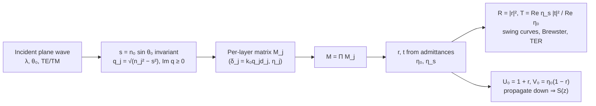

# Thin-Film Transfer Matrix

**Status:** ✅ Implemented — exact 2×2 characteristic-matrix stack optics in the normal-wavevector (q) formulation, valid for complex indices at any angle (TE/TM/unpolarized reflectance, amplitude coefficients, transmittance) and an exact in-film intensity profile; validated against Fresnel, Airy and X-ray total-external-reflection results; oblique-TM in-film intensity is the tangential-field |U|², a documented approximation.

## Overview

The resist never sees the bare aerial image: it sits in a stratified stack (top coat /
resist / BARC / substrate) whose interface reflections superpose with the incident wave.
The result is the standing wave that ripples resist sidewalls, and the swing curve — the
oscillation of coupled dose with resist thickness that sets dose-to-clear stability. Both
are first-order effects at VUV wavelengths over silicon (Si at 157 nm is a strong
reflector, `n ≈ 0.88 + 2.10i`). The module
[`crates/highuvlith-core/src/thinfilm.rs`](../../crates/highuvlith-core/src/thinfilm.rs)
implements the Macleod characteristic-matrix method for absorbing layers at arbitrary
incidence, and feeds the exact depth profile `S(z)` to
[volumetric exposure](./volumetric-exposure.md) and the approximate one to MNSL.

## Physics & math



### Layer matrix and admittances

With the Snell invariant $s = n_0\sin\theta_0$, every medium $j$ (index $n_j = n + ik$,
$k \ge 0$) has the normal wave-vector component, in units of $k_0 = 2\pi/\lambda$,

```math
q_j = \sqrt{n_j^2 - s^2},\qquad \operatorname{Im} q_j \ge 0\ \ (\operatorname{Re} q_j \ge 0\ \text{if}\ \operatorname{Im} q_j = 0),
```

the branch on which the field decays (or propagates forward) into the medium. Writing
everything with $q_j$ rather than $\cos\theta_j = \sqrt{1 - (s/n_j)^2}$ keeps the solution
valid for absorbing media at any angle, including X-ray grazing incidence. The tilted
admittances and layer matrices (physics convention, fields $e^{i(kz-\omega t)}$) are

```math
\eta_j^{TE} = q_j,\qquad \eta_j^{TM} = \frac{n_j^2}{q_j},\qquad
M_j = \begin{pmatrix} \cos\delta_j & -i\sin\delta_j/\eta_j \\ -i\,\eta_j \sin\delta_j & \cos\delta_j \end{pmatrix},
\qquad \delta_j = k_0\,q_j\,d_j .
```

This is the complex conjugate of Macleod's $e^{i(\omega t - kz)}$ form (which needs
$N = n - ik$). The stack matrix is the ordered product $M = \prod_j M_j$ (top to bottom),
and the amplitude coefficients follow from the superstrate/substrate admittances
$\eta_0, \eta_s$ exactly as coded in `FilmStack::solve`:

```math
r = \frac{\eta_0 m_{00} + \eta_0\eta_s m_{01} - m_{10} - \eta_s m_{11}}
         {\eta_0 m_{00} + \eta_0\eta_s m_{01} + m_{10} + \eta_s m_{11}},
\qquad
t = \frac{2\eta_0}{\text{(same denominator)}},
\qquad
T = \frac{\operatorname{Re}\eta_s}{\operatorname{Re}\eta_0}\,|t|^2 .
```

`reflectance_at_angle` returns $|r|^2$ for TE or TM and `transmittance_at_angle` returns $T$;
`Unpolarized` is the mean of the two (both for reflectance and for `intensity_profile`,
pinned by `test_intensity_profile_unpolarized_is_te_tm_mean`). `amplitude_coefficients`
returns the complex $(r, t)$ for TE or TM (the TM values are ratios of tangential E fields —
the admittance convention, which differs by a sign from the Fresnel $r_p$; the reflectance is
the same). TM reflectance vanishes at Brewster's angle $\theta_B = \arctan(n_s/n_0)$ for a
lossless substrate (`test_brewster_angle`).

### Correction of 2026-09-30 (behaviour change)

Until this date the reflectance path inserted the stored $n + ik$ directly into Macleod's
matrix, which is derived for $n - ik$. Reflectance is invariant under complex conjugation
only if the matrix is conjugated too, so the result was wrong for **absorbing layers**
(lossless stacks and bare substrates were unaffected): a 50 nm, $n = 1.65 + 0.3i$ film on
Si at 157 nm gave $R = 2.75$ (unphysical) instead of the Airy value 0.135, and the default
150 nm resist ($k = 0.015$) on Si gave $R = 0.772$ instead of **0.258**. The legacy
`standing_wave` (used by MNSL) takes its stack-top reflection coefficient from the same
path, so MNSL's default near-field substrate factor changes from 0.745 to 1.346.
`intensity_profile` already conjugated correctly and is numerically unchanged at normal
incidence.

### Swing curves and standing waves

Sweeping resist thickness through `reflectance` traces the swing curve; the quarter-wave
condition $d = \lambda/(4 n_f)$ with $n_f = \sqrt{n_s}$ is its antireflective minimum
(`test_quarter_wave_ar`, `test_quarter_wave_is_minimum`). Inside the resist, incident and
substrate-reflected waves interfere with intensity period

```math
\Lambda_{sw} = \frac{\lambda}{2 n_\mathrm{resist}}
```

— about 47.6 nm for `n = 1.65` at 157 nm — pinned by
`test_intensity_profile_standing_wave_period`.

### The two field methods

The module deliberately ships **two** in-film intensity calculators:

| Method | What it does | Accuracy | Use it for |
|---|---|---|---|
| `FilmStack::intensity_profile` | Propagates the exact tangential fields: $U_0 = 1 + r$, $V_0 = \eta_0(1 - r)$ at the stack top, then downward through each layer with the **inverse** layer matrix (det = 1), plus a partial-thickness matrix inside the containing layer. Above the stack it returns the superstrate standing wave $\lvert e^{-ik_z z} + r e^{ik_z z}\rvert^2$; below it, $\lvert U_\mathrm{bottom}\rvert^2 e^{2 \mathrm{Im}(k_{z,s}) \Delta z}$ (substrate Beer–Lambert). | Exact for TE and for any polarization at normal incidence; oblique TM returns the tangential intensity $\lvert U\rvert^2$ (documented approximation — the longitudinal E-component is dropped). | Quantitative work: volumetric exposure, swing curves, dose coupling. |
| `FilmStack::standing_wave` | Combines only the stack-top reflection coefficient with single-layer plane-wave propagation, ignoring per-layer internal amplitudes. | Approximate; normal incidence, unpolarized only. | **MNSL only** — that module and its tests pin these exact numbers. Do not use for new work. |

Field continuity across interfaces (tangential E is continuous) is verified by
`test_intensity_profile_continuous_at_interfaces`; `standing_wave` has only a smoke test
(`test_standing_wave_not_empty`) by design.

### Index-sign convention: n + ik vs Macleod N = n − ik

`FilmLayer.n` stores the physics-community convention `n + ik` with `k ≥ 0` meaning loss,
for fields $e^{i(kz-\omega t)}$. The reflectance/transmittance path (`FilmStack::solve`)
works directly in that convention with the conjugated matrix shown above, so
`amplitude_coefficients` returns physics-convention amplitudes ($r = (1-n)/(1+n)$ for a bare
substrate at normal incidence). The Macleod matrix formalism, whose downward field goes as
$e^{-i\delta}$, needs $N = n - ik$; `intensity_profile_polarized` conjugates every index
(and takes $Q = \bar q$) and works in the Macleod convention throughout. Reflectance agrees
between the two only because *everything* is conjugated consistently — inserting $n + ik$
into Macleod's matrix unchanged is wrong for absorbing layers (the pre-2026-09-30 bug). If you
construct stacks directly, always supply `k ≥ 0`.

## Process regime

| Stack element | Typical values (VUV, 157 nm) |
|---|---|
| Superstrate | vacuum, `n = 1.0` (`FilmStack::new_vuv`) |
| Resist | 50–400 nm fluoropolymer, `n ≈ 1.65 + 0.015i` (default stack: 150 nm) |
| BARC / ARC | 30–80 nm, `n ≈ 1.8 + 0.3i` (as in the interface-continuity test) |
| Substrate | Si, `n ≈ 0.88 + 2.10i` at 157 nm — highly reflective, strong standing waves |
| Swing amplitude | tens of percent of coupled dose without an ARC; quarter-wave ARC suppresses it |

Optical constants for the 126–160 nm band come from the tabulated VUV materials database
(approximate transcriptions); at EUV/BEUV/X-ray wavelengths use the Henke/CXRO-computed
indices (`henke::Material`, `MaterialsDatabase` `*_euv`/`*_beuv`/`henke:<formula>`
entries — see [materials](../materials.md)). For periodic EUV/BEUV mirrors with interface
roughness use [`materials::multilayer`](../materials.md#multilayer-mirrors-multilayerrs-),
whose Parratt recursion agrees with this module's characteristic matrix to ~10⁻¹² when the
roughness is zero.

## Model coverage

| Field | Unit | Consumed by | Status |
|---|---|---|---|
| `FilmLayer.thickness_nm` | nm | δ_j phase, layer lookup in `intensity_profile` | live |
| `FilmLayer.n` | — (complex, n + ik) | admittances, phases, substrate decay | live |
| `FilmLayer.name` | — | labels only (serialization, volumetric sublayer naming) | stored (inert) |
| `FilmStack.layers` | — | matrix product, field propagation | live |
| `FilmStack.substrate` | — (complex) | η_s, transmitted-field decay | live |
| `FilmStack.superstrate` | — (complex) | η₀, Snell invariant, above-stack standing wave | live |

## Usage

Rust (the compute surface — reflectance/intensity methods are not yet exposed to Python;
EUV/BEUV multilayer mirrors are, via `highuvlith.api.MultilayerMirror`):

```rust
use highuvlith_core::thinfilm::{FilmLayer, FilmStack};
use highuvlith_core::types::{Complex64, Polarization};

let stack = FilmStack::new_vuv(
    vec![FilmLayer { name: "resist".into(), thickness_nm: 150.0,
                     n: Complex64::new(1.65, 0.015) }],
    Complex64::new(0.88, 2.10), // Si at 157 nm
);
let r = stack.reflectance(157.63, Polarization::Unpolarized);            // ~0.26
let (r_te, t_te) = stack.amplitude_coefficients(157.63, 0.3, Polarization::TE)?;
let t = stack.transmittance_at_angle(157.63, 0.3, Polarization::TM);
let z: Vec<f64> = (0..150).map(|k| k as f64).collect();
let s_z = stack.intensity_profile(157.63, 0.0, Polarization::Unpolarized, &z);
```

Python — `FilmStackConfig` (from
[`crates/highuvlith-py/src/py_config.rs`](../../crates/highuvlith-py/src/py_config.rs))
currently supports stack *construction* only — there is no Python method for reflectance
or intensity profiles yet. The stack you build is consumed by `huv.expose_volumetric`
([volumetric-exposure.md](./volumetric-exposure.md)), which evaluates `intensity_profile`
internally:

<!-- verify-example -->
```python
import highuvlith as huv

stack = huv.FilmStackConfig()               # default: 150 nm resist on Si
stack.add_layer("arc", 60.0, 1.8, 0.3)      # name, thickness_nm, n_real, n_imag (k >= 0)
stack.set_substrate(0.88, 2.10)
```

There is no `[film_stack]` TOML section in the CLI today. The `deep` subcommand's
volumetric mode builds a resist-on-Si stack at the source wavelength from the materials
database (`MaterialsDatabase::resist_on_silicon_stack`), with the resist thickness from
`[deep] resist_thickness_nm`
([`commands/deep.rs`](../../crates/highuvlith-cli/src/commands/deep.rs)): `VUV_resist` on
interpolated `Si` in the VUV tables' range (at 157.63 nm: 1.65 + 0.015i on 0.8842 + 2.1042i),
the `EUV_resist` stand-in on Henke Si at 0.0413–41.3 nm, and an error at other wavelengths
(e.g. 193 nm), where the database has no resist entry. Until 2026-10-01 it reused the fixed
157 nm constants of `FilmStack::default()` (Si 0.88 + 2.10i) at every wavelength; for
`examples/volumetric.toml` (157.63 nm) the switch to the interpolated Si index moves the top
latent CD from 264.8 to 265.5 nm; the developed CD (75.0 / 112.5 / 112.5 nm), developed
sidewall (93.6°) and mean remaining height (98.1 nm) are unchanged.
`FilmStack::default()` and the Python `FilmStackConfig()` default keep the fixed 157 nm values; see
the [materials range policy](../materials.md#range-policy-no-silent-extrapolation).

## Validation

`#[test]` functions in [`thinfilm.rs`](../../crates/highuvlith-core/src/thinfilm.rs):

- `test_bare_substrate_reflectance` — Fresnel $R = ((n_1-n_2)/(n_1+n_2))^2 = 0.04$ for n = 1.5.
- `test_quarter_wave_ar`, `test_quarter_wave_is_minimum` — quarter-wave AR null and swing minimum.
- `test_brewster_angle` — TM zero at $\arctan(n_s)$.
- `test_intensity_profile_matches_fresnel_at_bare_interface` — $|1 + r|^2$ continuity at z = 0.
- `test_intensity_profile_beer_lambert_when_index_matched` — pure $e^{-\alpha z}$ with $\alpha = 4\pi k/\lambda$ when all indices match (no reflections).
- `test_intensity_profile_standing_wave_period` — minima spacing $\lambda/(2n)$ over a Si reflector.
- `test_intensity_profile_continuous_at_interfaces` — tangential-field continuity across ARC/resist/Si boundaries.
- `test_intensity_profile_unpolarized_is_te_tm_mean` — polarization averaging.
- `test_standing_wave_not_empty` — smoke test for the legacy MNSL method.
- `test_absorbing_film_matches_airy_formula` — complex $r$ of an absorbing film on Si equals the Airy formula to 1e-12 (the regression test for the 2026-09-30 correction); `test_default_stack_reflectance_regression` — $R = 0.258433$ for the default stack.
- `test_single_absorbing_interface_oblique_fresnel` — complex $r_s$ and $r_p$ of an absorbing substrate at 40° vs the Fresnel formulas.
- `test_lossless_energy_conservation_oblique` — $R + T = 1$ to 1e-12 for a lossless 3-layer stack at 35° (TE, TM, unpolarized); $R + T < 1$ with absorption.
- `test_xray_total_external_reflection` — Au at 8 keV: $R_s$ = 0.9116 / 0.4156 / 0.0047 at grazing 4 / 9.77 / 20 mrad (critical angle $\sqrt{2\delta}$ = 9.77 mrad).
- `test_thick_absorbing_layer_hides_substrate` — a 2 µm, $k = 0.8$ layer reflects like the bare interface; TE = TM at normal incidence.
- Cross-module: `materials::multilayer::tests::test_parratt_matches_characteristic_matrix` — an independent Parratt recursion reproduces `amplitude_coefficients` for 40-period Mo/Si + Ru to 1e-10 (0°, 10°, 25°; TE and TM).

## References

- H. A. Macleod, *Thin-Film Optical Filters*, 4th ed., CRC Press (2010) — characteristic matrices, tilted admittances, sign conventions.
- M. Born, E. Wolf, *Principles of Optics*, 7th ed., §1.6 — stratified media.
- L. G. Parratt, "Surface studies of solids by total reflection of X-rays," *Phys. Rev.* **95**, 359 (1954) — the recursion used by the multilayer module.
- T. A. Brunner, "Optimization of optical properties of resist processes," *Proc. SPIE* **1466**, 297 (1991) — swing curves and swing ratio.
