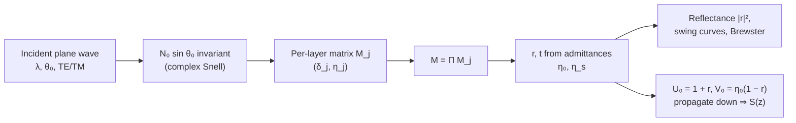

# Thin-Film Transfer Matrix

**Status:** ✅ Implemented — exact 2×2 characteristic-matrix stack optics with TE/TM/unpolarized reflectance and an exact in-film intensity profile; oblique-TM in-film intensity is the tangential-field |U|², a documented approximation.

## Overview

The resist never sees the bare aerial image: it sits in a stratified stack (top coat /
resist / BARC / substrate) whose interface reflections superpose with the incident wave.
The result is the standing wave that ripples resist sidewalls, and the swing curve — the
oscillation of coupled dose with resist thickness that sets dose-to-clear stability. Both
are first-order effects at VUV wavelengths over silicon (Si at 157 nm is a strong
reflector, `n ≈ 0.88 + 2.10i`). The module
[`crates/highuvlith-core/src/thinfilm.rs`](../../crates/highuvlith-core/src/thinfilm.rs)
implements the Macleod characteristic-matrix method for absorbing layers at arbitrary
incidence, and feeds the exact depth profile `S(z)` to
[volumetric exposure](./volumetric-exposure.md) and the approximate one to MNSL.

## Physics & math



### Layer matrix and admittances

Each layer `j` with complex index $N_j$ and thickness $d_j$ contributes the
characteristic matrix

$$
M_j = \begin{pmatrix} \cos\delta_j & i\sin\delta_j/\eta_j \\ i\,\eta_j \sin\delta_j & \cos\delta_j \end{pmatrix},
\qquad
\delta_j = \frac{2\pi}{\lambda} N_j \cos\theta_j \, d_j
$$

with the in-layer angle from the complex Snell invariant
$N_0 \sin\theta_0 = N_j \sin\theta_j$ and polarization-dependent tilted admittance

$$
\eta_j^{TE} = N_j \cos\theta_j, \qquad \eta_j^{TM} = N_j / \cos\theta_j .
$$

The stack matrix is the ordered product $M = \prod_j M_j$ (top to bottom), and the
amplitude coefficients follow from the superstrate/substrate admittances $\eta_0, \eta_s$
exactly as coded in `transfer_matrix`:

$$
r = \frac{\eta_0 m_{00} + \eta_0\eta_s m_{01} - m_{10} - \eta_s m_{11}}
         {\eta_0 m_{00} + \eta_0\eta_s m_{01} + m_{10} + \eta_s m_{11}},
\qquad
t = \frac{2\eta_0}{\text{(same denominator)}} .
$$

`reflectance_at_angle` returns $|r|^2$ for TE or TM; `Unpolarized` is the mean of the two
(both for reflectance and for `intensity_profile`, pinned by
`test_intensity_profile_unpolarized_is_te_tm_mean`). TM reflectance vanishes at Brewster's
angle $\theta_B = \arctan(n_s/n_0)$ for a lossless substrate (`test_brewster_angle`).

### Swing curves and standing waves

Sweeping resist thickness through `reflectance` traces the swing curve; the quarter-wave
condition $d = \lambda/(4 n_f)$ with $n_f = \sqrt{n_s}$ is its antireflective minimum
(`test_quarter_wave_ar`, `test_quarter_wave_is_minimum`). Inside the resist, incident and
substrate-reflected waves interfere with intensity period

$$
\Lambda_{sw} = \frac{\lambda}{2 n_\mathrm{resist}}
$$

— about 47.6 nm for `n = 1.65` at 157 nm — pinned by
`test_intensity_profile_standing_wave_period`.

### The two field methods

The module deliberately ships **two** in-film intensity calculators:

| Method | What it does | Accuracy | Use it for |
|---|---|---|---|
| `FilmStack::intensity_profile` | Propagates the exact tangential fields: $U_0 = 1 + r$, $V_0 = \eta_0(1 - r)$ at the stack top, then downward through each layer with the **inverse** layer matrix (det = 1), plus a partial-thickness matrix inside the containing layer. Above the stack it returns the superstrate standing wave $\lvert e^{-ik_z z} + r\,e^{ik_z z}\rvert^2$; below it, $\lvert U_\mathrm{bottom}\rvert^2 e^{2\,\mathrm{Im}(k_{z,s})\,\Delta z}$ (substrate Beer–Lambert). | Exact for TE and for any polarization at normal incidence; oblique TM returns the tangential intensity $\lvert U\rvert^2$ (documented approximation — the longitudinal E-component is dropped). | Quantitative work: volumetric exposure, swing curves, dose coupling. |
| `FilmStack::standing_wave` | Combines only the stack-top reflection coefficient with single-layer plane-wave propagation, ignoring per-layer internal amplitudes. | Approximate; normal incidence, unpolarized only. | **MNSL only** — that module and its tests pin these exact numbers. Do not use for new work. |

Field continuity across interfaces (tangential E is continuous) is verified by
`test_intensity_profile_continuous_at_interfaces`; `standing_wave` has only a smoke test
(`test_standing_wave_not_empty`) by design.

### Index-sign convention: n + ik vs Macleod N = n − ik

`FilmLayer.n` stores the physics-community convention `n + ik` with `k ≥ 0` meaning loss.
The Macleod matrix formalism, whose downward field goes as $e^{-i\delta}$, needs
$N = n - ik$ for that field to *decay*. Reflectance is invariant under conjugation, so
`transfer_matrix` ignores the distinction; the internal field cannot, so
`intensity_profile_polarized` conjugates every index (`layer.n.conj()`, substrate,
superstrate) and works in the Macleod convention throughout. If you construct stacks
directly, always supply `k ≥ 0`.

## Process regime

| Stack element | Typical values (VUV, 157 nm) |
|---|---|
| Superstrate | vacuum, `n = 1.0` (`FilmStack::new_vuv`) |
| Resist | 50–400 nm fluoropolymer, `n ≈ 1.65 + 0.015i` (default stack: 150 nm) |
| BARC / ARC | 30–80 nm, `n ≈ 1.8 + 0.3i` (as in the interface-continuity test) |
| Substrate | Si, `n ≈ 0.88 + 2.10i` at 157 nm — highly reflective, strong standing waves |
| Swing amplitude | tens of percent of coupled dose without an ARC; quarter-wave ARC suppresses it |

Optical constants for the 126–160 nm band come from the tabulated VUV materials database
(mature); EUV entries other than Si/Mo are approximate — verify against CXRO
(henke.lbl.gov) before quantitative use.

## Model coverage

| Field | Unit | Consumed by | Status |
|---|---|---|---|
| `FilmLayer.thickness_nm` | nm | δ_j phase, layer lookup in `intensity_profile` | live |
| `FilmLayer.n` | — (complex, n + ik) | admittances, phases, substrate decay | live |
| `FilmLayer.name` | — | labels only (serialization, volumetric sublayer naming) | stored (inert) |
| `FilmStack.layers` | — | matrix product, field propagation | live |
| `FilmStack.substrate` | — (complex) | η_s, transmitted-field decay | live |
| `FilmStack.superstrate` | — (complex) | η₀, Snell invariant, above-stack standing wave | live |

## Usage

Rust (the compute surface — reflectance/intensity methods are not yet exposed to Python):

```rust
use highuvlith_core::thinfilm::{FilmLayer, FilmStack};
use highuvlith_core::types::{Complex64, Polarization};

let stack = FilmStack::new_vuv(
    vec![FilmLayer { name: "resist".into(), thickness_nm: 150.0,
                     n: Complex64::new(1.65, 0.015) }],
    Complex64::new(0.88, 2.10), // Si at 157 nm
);
let r = stack.reflectance(157.63, Polarization::Unpolarized);
let z: Vec<f64> = (0..150).map(|k| k as f64).collect();
let s_z = stack.intensity_profile(157.63, 0.0, Polarization::Unpolarized, &z);
```

Python — `FilmStackConfig` (from
[`crates/highuvlith-py/src/py_config.rs`](../../crates/highuvlith-py/src/py_config.rs))
currently supports stack *construction* only — there is no Python method for reflectance
or intensity profiles yet. The stack you build is consumed by `huv.expose_volumetric`
([volumetric-exposure.md](./volumetric-exposure.md)), which evaluates `intensity_profile`
internally:

```python
import highuvlith as huv

stack = huv.FilmStackConfig()               # default: 150 nm resist on Si
stack.add_layer("arc", 60.0, 1.8, 0.3)      # name, thickness_nm, n_real, n_imag (k >= 0)
stack.set_substrate(0.88, 2.10)
```

There is no `[film_stack]` TOML section in the CLI today. The `deep` subcommand's
volumetric mode uses the default resist-on-Si stack internally, resizing only the resist
layer via `[deep] resist_thickness_nm`
([`commands/deep.rs`](../../crates/highuvlith-cli/src/commands/deep.rs)).

## Validation

`#[test]` functions in [`thinfilm.rs`](../../crates/highuvlith-core/src/thinfilm.rs):

- `test_bare_substrate_reflectance` — Fresnel $R = ((n_1-n_2)/(n_1+n_2))^2 = 0.04$ for n = 1.5.
- `test_quarter_wave_ar`, `test_quarter_wave_is_minimum` — quarter-wave AR null and swing minimum.
- `test_brewster_angle` — TM zero at $\arctan(n_s)$.
- `test_intensity_profile_matches_fresnel_at_bare_interface` — $|1 + r|^2$ continuity at z = 0.
- `test_intensity_profile_beer_lambert_when_index_matched` — pure $e^{-\alpha z}$ with $\alpha = 4\pi k/\lambda$ when all indices match (no reflections).
- `test_intensity_profile_standing_wave_period` — minima spacing $\lambda/(2n)$ over a Si reflector.
- `test_intensity_profile_continuous_at_interfaces` — tangential-field continuity across ARC/resist/Si boundaries.
- `test_intensity_profile_unpolarized_is_te_tm_mean` — polarization averaging.
- `test_standing_wave_not_empty` — smoke test for the legacy MNSL-pinned method.

## References

- H. A. Macleod, *Thin-Film Optical Filters*, 4th ed., CRC Press (2010) — characteristic matrices, tilted admittances, sign conventions.
- M. Born, E. Wolf, *Principles of Optics*, 7th ed., §1.6 — stratified media.
- T. A. Brunner, "Optimization of optical properties of resist processes," *Proc. SPIE* **1466**, 297 (1991) — swing curves and swing ratio.
