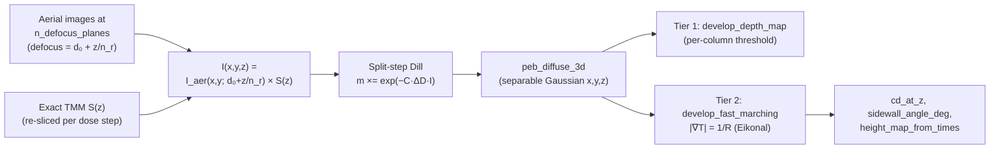

# Volumetric Exposure & 3D Development

**Status:** 🔶 Simplified — full `(x, y, z)` latent image and 3D development, with documented approximations: separable lateral×vertical model, paraxial `z/n` focus mapping, lateral-mean PAC bleaching, frozen-rate fast marching, and the thin-film TM-oblique |U|² inherited from the stack model.

## Overview

The 2D resist path ([resist-models.md](./resist-models.md)) collapses depth into one
coupling scalar, so it cannot see standing-wave ripple, resist-loss-at-depth, sidewall
angle, or undercut — exactly the quantities that decide whether a thick-resist, grayscale,
or interference-lithography process works.
[`crates/highuvlith-core/src/volumetric.rs`](../../crates/highuvlith-core/src/volumetric.rs)
provides the z-resolved path: exposure on a `Grid3D`, 3D PEB, and two development tiers up
to a genuine etch-front solve. It reuses the exact transfer-matrix field from
[thin-film.md](./thin-film.md) and the Dill/Mack chemistry from
[resist-models.md](./resist-models.md), so no physics is re-derived — only re-dimensioned.

## Physics & math



### Separable exposure model — no double counting

$$
I(x, y, z) = I_\mathrm{aer}\!\left(x, y;\; d_0 + z/n_r\right)\, \cdot\, S(z)
$$

- $I_\mathrm{aer}$ is the **in-air** aerial image (Hopkins TCC/SOCS), refocused to depth
  `z` via the paraxial mapping $\Delta f = z / n_r$ ($n_r$ = real part of the resist
  index) added to `base_defocus_nm`.
- $S(z)$ is `FilmStack::intensity_profile` at **unit incidence**: standing waves,
  absorption, and every interface reflection, exactly ([thin-film.md](./thin-film.md)).

Because the aerial image carries no film response and $S(z)$ carries no lateral pattern,
nothing is counted twice. The trade-off is that lateral imaging and vertical film response
are fully decoupled — there is no vector in-film imaging, and mask-diffracted orders all
share the same normal-incidence $S(z)$.

### Defocus-plane interpolation

`expose_volumetric` computes aerial images at `n_defocus_planes` evenly spaced depths
across the resist (default 8, silently capped at `nz`; `1` reuses the mid-thickness plane
everywhere), then
linearly interpolates each of the `nz` slice centers between its two bracketing planes.
This bounds the expensive SOCS evaluations at the plane count, not the slice count.

### Split-step Dill bleaching

The total dose is applied in `dose_steps` increments $\Delta D = D/\mathrm{steps}$. After
each step, the resist layer is re-sliced into `nz` sublayers whose extinction follows the
**laterally averaged** PAC of each slice:

$$
\bar{m}_k = \langle m(x,y,z_k) \rangle_{xy}, \qquad
\kappa_k = \frac{\alpha(\bar m_k)\,\lambda}{4\pi}, \qquad
\alpha(m) = A m + B
$$

(`substack_with_sliced_resist`), the exact $S(z)$ is recomputed for the re-sliced stack,
and every voxel updates $m \mathrel{*}= \exp(-C\,\Delta D\, I)$. As
`dose_steps → ∞` this converges to the coupled Dill exposure PDE
$\partial I/\partial z = -\alpha(m) I$, $\partial m/\partial D = -C I m$ — subject to the
lateral-mean approximation, which exists because a 1D transfer matrix cannot carry
laterally varying extinction. `dose_steps = 1` (static absorption) is fine for thin,
weakly bleaching resists; use 5–20 for thick or strongly bleaching ones
(`test_split_step_converges_toward_more_exposure_at_depth` shows the bottom opening up
as steps increase).

### 3D post-exposure bake

`peb_diffuse_3d` is the separable Gaussian of [resist-models.md](./resist-models.md)
extended to z: three clamped-boundary passes with $\sigma_{xy} = L_D/\mathrm{px}_{xy}$ and
$\sigma_z = L_D/\mathrm{px}_z$. Diffusion is isotropic; z-anisotropy is planned.

### Development tier 1 — per-column threshold depth map

`develop_depth_map(latent, threshold)` scans each `(x, y)` column from the resist top and
returns the depth of **contiguous** development — it stops at the first voxel with
`PAC ≥ threshold`. No lateral etching, no undercut; adequate for LIGA-style and grayscale
depth questions at per-column cost.

### Development tier 2 — fast-marching Eikonal front

`develop_fast_marching` solves the arrival-time Eikonal equation for the developer front:

$$
\lvert \nabla T(x,y,z) \rvert = \frac{1}{R(x,y,z)}, \qquad T\big|_\mathrm{top} \approx 0
$$

where `R` is the Mack/threshold rate (nm/s) evaluated on the latent image. Top voxels are
seeded at $t_0 = \tfrac{1}{2}\,\mathrm{px}_z / R$ (half a cell of etching), then a
min-heap Dijkstra-like sweep applies first-order **Godunov upwind** updates on the
anisotropic grid ($h = [\mathrm{px}_z, \mathrm{px}_{xy}, \mathrm{px}_{xy}]$), solving the
sorted quadratic $\sum_a \max\!\big(0, (T - T_a)/h_a\big)^2 = 1/R^2$ per voxel with a
one-sided fallback. The developed region after `t` seconds is $\{T \le t\}$ — including
lateral etching and undercut. The rate field is **frozen** during development (standard
isotropic wet-etch assumption); a moving-boundary level-set model is planned.
`height_map_from_times(times, dev_time_s)` collapses the volume to a per-column
remaining-height map (undercut cannot survive that projection — read the 3D `times`
directly for re-entrant profiles).

### Multilayer stacks and buried resist

The film stack may contain layers above and below the resist; `config.resist_layer`
indexes which layer is the resist. Layers above it shift the exposure window by
`z_offset = Σ thickness(layers above)` and attenuate/reflect the field exactly through the
transfer matrix — a top coat therefore costs nothing extra. `resist_layer` out of range,
`nz = 0`, `dose_steps = 0`, and `n_defocus_planes = 0` are all rejected up front
(`test_invalid_config_rejected` exercises the first three; the `n_defocus_planes` guard
is code-only).

### Metrics

From [`metrics.rs`](../../crates/highuvlith-core/src/metrics.rs):
`cd_at_z(volume, threshold)` measures the center-row CD in every z-slice (one
`Option<f64>` per slice, top to bottom);
`sidewall_angle_deg(cd_top, cd_bottom, thickness)` $= \mathrm{atan2}(2d,\; CD_\mathrm{top} - CD_\mathrm{bot})$
in trench convention (90° vertical, < 90° narrowing, > 90° re-entrant); `aspect_ratio`
is depth/width.

## Process regime

| Quantity | Typical |
|---|---|
| Resist thickness | 150 nm–several µm (beyond that, use [liga-deep-xray.md](./liga-deep-xray.md)) |
| `nz` | 32–128 slices (≥ 4 slices per standing-wave period λ/2n) |
| `n_defocus_planes` | 8 (default); 1 for thin resist well inside the DOF |
| `dose_steps` | 1 (thin/weak bleaching) to 5–20 (thick/strong bleaching) |
| Dose | 10–60 mJ/cm² |
| Aspect ratios | up to ~10 with tier-2 development |

**Memory:** a `Grid3D<f64>` at 512 × 512 × 128 is 268 MB, and fast marching temporarily
holds the rate volume, arrival-time volume, and an accepted-flag volume alongside it.
Prefer 256² lateral and `nz = 64` unless you need more.

## Model coverage

| Field (`VolumetricExposureConfig`) | Unit | Consumed by | Status |
|---|---|---|---|
| `dose_mj_cm2` | mJ/cm² | split-step exposure (ΔD per step) | live |
| `nz` | — | slice count, sublayer re-slicing, `Grid3D` z-dim | live |
| `n_defocus_planes` | — | aerial-image plane count + interpolation | live |
| `dose_steps` | — | bleaching update count | live |
| `base_defocus_nm` | nm | focus of the aerial image at the resist top | live |
| `resist_layer` | index | stack slicing, `z_offset`, $n_r$, thickness | live |

## Usage

Rust — the full surface (only Rust can reach `peb_diffuse_3d` today):

```rust
use highuvlith_core::volumetric::{
    expose_volumetric, peb_diffuse_3d, develop_fast_marching,
    height_map_from_times, VolumetricExposureConfig,
};
use highuvlith_core::metrics::{cd_at_z, sidewall_angle_deg};

let config = VolumetricExposureConfig {
    dose_mj_cm2: 30.0,
    nz: 64,
    n_defocus_planes: 8,
    dose_steps: 5,            // split-step bleaching
    base_defocus_nm: 0.0,
    resist_layer: 0,
};
let mut latent = expose_volumetric(&engine, &mask, &stack, &resist, 157.63, &config)?;
peb_diffuse_3d(&mut latent, resist.peb_diffusion_nm, pixel_xy, pixel_z);
let times = develop_fast_marching(&latent, &resist, pixel_xy, pixel_z);
let height = height_map_from_times(&times, 60.0);
let cds = cd_at_z(&latent.pac, 0.5);
```

Python — `expose_volumetric`, `develop_fast_marching`, and `height_map_from_times` are
bound in
[`crates/highuvlith-py/src/py_volumetric.rs`](../../crates/highuvlith-py/src/py_volumetric.rs)
and re-exported at package top level. The `VolumetricResult` exposes the `(nz, ny, nx)`
volume as a numpy array (`values`) with cell-center coordinates, and offers
`cd_at_z(threshold)` and tier-1 `depth_map(threshold)`. **`peb_diffuse_3d` is not yet bound** — Python volumes go
straight from exposure to development:

```python
import highuvlith as huv

resist = huv.ResistConfig(thickness_nm=150.0)
vol = huv.expose_volumetric(
    source=huv.SourceConfig.f2_laser(sigma=0.7),
    optics=huv.OpticsConfig(numerical_aperture=0.75),
    mask=huv.MaskConfig.line_space(cd_nm=65.0, pitch_nm=180.0),
    film_stack=huv.FilmStackConfig(),   # default: 150 nm resist on Si
    resist=resist,
    grid=huv.GridConfig(size=256, pixel_nm=1.0),
    dose_mj_cm2=30.0, nz=64, n_defocus_planes=8, dose_steps=5,
)
times = huv.develop_fast_marching(vol, resist, pixel_xy_nm=1.0, pixel_z_nm=150.0 / 64)
height = huv.height_map_from_times(times, dev_time_s=60.0)
cds = vol.cd_at_z(0.5)                  # per-slice CD, top to bottom
```

CLI — the `deep` subcommand runs the exposure stage from TOML
([`crates/highuvlith-cli/src/commands/deep.rs`](../../crates/highuvlith-cli/src/commands/deep.rs)):
`[deep] mode = "volumetric"` with optional `nz`, `n_defocus_planes`, `dose_steps`,
`resist_thickness_nm`, `develop_threshold`, and `dose_mj_cm2`. It reports per-slice CD
(top/mid/bottom) and the sidewall angle from `cd_at_z`; it does **not** run 3D PEB or
fast-marching development, and the film stack is the default resist-on-Si (thickness
override only), with resist chemistry fixed at `ResistParams::default()`.

Interference-lithography PAC volumes (`crate::interference`) feed the same development
tiers directly — the tiers only require a `VolumetricLatentImage` (in Python, any
`VolumetricResult`).

## Validation

Analytical pins, all `#[test]` in
[`volumetric.rs`](../../crates/highuvlith-core/src/volumetric.rs) unless noted:

- `test_closed_form_beer_lambert_exposure` — index-matched, non-bleaching resist under a uniform clear mask reproduces the closed form $m(z) = \exp(-C D I_0 e^{-\alpha z})$.
- `test_z_mean_matches_effective_coupling` — the z-mean of the exact $S(z)$ equals the 2D path's coupling factor $(1 - e^{-\alpha d})/(\alpha d)$, tying the two paths together.
- `test_fmm_uniform_rate_front` — uniform rate ⇒ planar front at $T = z/R$ (and the height map halves at the matching time).
- `test_split_step_converges_toward_more_exposure_at_depth` — bleaching physics direction.
- `test_dose_monotonicity_and_bounds` — PAC stays in [0, 1], monotone in dose.
- `test_develop_depth_map_synthetic` — tier-1 contiguous-depth semantics.
- `test_fmm_blocked_column_stays_undeveloped` — unexposed columns only trickle-develop.
- `test_peb_3d_reduces_variance_preserves_bounds` — 3D PEB smooths without leaving [0, 1].
- `test_invalid_config_rejected` — config validation.
- In [`metrics.rs`](../../crates/highuvlith-core/src/metrics.rs): `test_cd_at_z_synthetic`, `test_sidewall_angle_conventions` (90°/45°/re-entrant conventions).

## References

- F. H. Dill et al., "Characterization of positive photoresist," *IEEE Trans. Electron Devices* **22**, 445 (1975) — exposure PDE that the split-step scheme discretizes.
- C. A. Mack, *Fundamental Principles of Optical Lithography*, Wiley (2007) — standing waves, PEB, development.
- J. A. Sethian, "A fast marching level set method for monotonically advancing fronts," *PNAS* **93**, 1591 (1996) — the Eikonal solver.
- S. Osher, J. A. Sethian, *J. Comput. Phys.* **79**, 12 (1988) — the level-set formulation planned for the moving-boundary upgrade.
