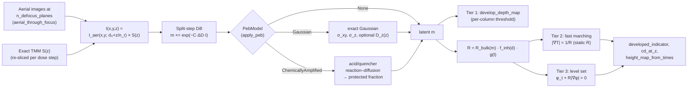

# Volumetric Exposure, Bake & 3D Development

**Status:** 🔶 Simplified — full `(x, y, z)` latent image, exact anisotropic Gaussian or chemically amplified (CAR) post-exposure bake, and 3D development by fast marching (static rate) or a level-set moving boundary (rate re-evaluated at the front, with surface inhibition and developer ageing/loading), with documented approximations: separable lateral×vertical exposure, paraxial `z/n` focus mapping, lateral-mean PAC bleaching, the thin-film TM-oblique |U|² inherited from the stack model, first-order front solvers, and phenomenological development-rate modifiers.

## Overview

The 2D resist path ([resist-models.md](./resist-models.md)) collapses depth into one
coupling scalar, so it cannot see standing-wave ripple, resist-loss-at-depth, sidewall
angle, undercut, or T-topping — exactly the quantities that decide whether a
thick-resist, grayscale, or interference-lithography process works.
[`crates/highuvlith-core/src/volumetric.rs`](../../crates/highuvlith-core/src/volumetric.rs)
provides the z-resolved path: exposure on a `Grid3D`, a post-exposure bake (PEB), and
three development tiers up to a genuine moving-boundary solve. It reuses the exact
transfer-matrix field from [thin-film.md](./thin-film.md) and the Dill/Mack/CAR chemistry
from [resist-models.md](./resist-models.md), so no physics is re-derived — only
re-dimensioned.

## Physics & math



### Separable exposure model — no double counting

```math
I(x, y, z) = I_\mathrm{aer}\!\left(x, y;\; d_0 + z/n_r\right)\, \cdot\, S(z)
```

- $I_\mathrm{aer}$ is the **in-air** aerial image (Hopkins TCC/SOCS), refocused to depth
  `z` via the paraxial mapping $\Delta f = z / n_r$ ($n_r$ = real part of the resist
  index) added to `base_defocus_nm`.
- $S(z) = (n_r/n_0) |E(z)|^2$ is the exposing intensity relative to the incident
  intensity, where $|E(z)|^2$ is `FilmStack::intensity_profile` at **unit incident
  field**: standing waves, absorption, and every interface reflection, exactly
  ([thin-film.md](./thin-film.md)). The factor $n_r/n_0$ (real parts of the resist and
  superstrate indices) turns field intensity into energy flow: the absorbed power density
  is $\alpha n_r |E|^2$ per unit incident $n_0 |E_0|^2$, so a travelling wave just inside a
  lossless entrance has $S = T = 4 n_0 n_r/(n_0 + n_r)^2$, and the Dill $C$ (defined
  against intensity) sees the right dose. Before 2026-10-01 the factor was missing and
  every resist with $n_r \ne n_0$ was under-exposed by $1/n_r$ (×0.61 for the default
  $n_r = 1.65$ in vacuum); `examples/volumetric.toml` moved from 40 to 24 mJ/cm² to keep
  its profile.

!!! note "Standing waves stall development without a bake"
    On the default bare-Si stack at 157 nm the in-resist $|E|^2$ swings between ≈ 0.12
    and ≈ 1.7 of the incident value with period $\lambda/(2 n_r)$ ≈ 48 nm. With the
    default Mack resist (n = 3) at 30 mJ/cm² a node dissolves at only ≈ 0.3–0.8 nm/s
    against ≈ 70–90 nm/s at the antinodes, so with `PebModel::None` the dissolution
    front stops at the first node or two (≈ 110 nm of 300 nm after 60 s in the GUI's
    default scene). A Gaussian bake
    damps the standing-wave modulation by $\exp(-2\pi^2\sigma_z^2/P^2)$ (≈ 0.03 for
    $\sigma_z$ = 20 nm, 0.81 for 5 nm). The default resist is illustrative and low
    contrast, so the developed window is narrow: for the GUI's default F₂ 65/180 nm scene
    (image contrast ≈ 0.46, clear-field peak ≈ 0.66) at 150 nm, 15 mJ/cm², σ = 10/20 nm,
    the spaces reach the substrate between 20 and 30 s and the lines are gone by 60 s.

Because the aerial image carries no film response and $S(z)$ carries no lateral pattern,
nothing is counted twice. The trade-off is that lateral imaging and vertical film response
are fully decoupled — there is no vector in-film imaging, and mask-diffracted orders all
share the same normal-incidence $S(z)$.

### Defocus planes and the per-plane imaging seam

`expose_volumetric` images the mask at `n_defocus_planes` focus planes. With fewer planes
than slices (default 8, capped at `nz`), the planes are evenly spaced across the resist
(`1` reuses the mid-thickness plane everywhere) and each of the `nz` slice centres
interpolates linearly between its two bracketing planes, which bounds the imaging cost at
the plane count, not the slice count. With `n_defocus_planes >= nz` every slice is imaged
exactly at its own centre depth, $d_0 + z_k/n_r$ — no interpolation.

All imaging goes through one internal helper, `aerial_through_focus`, which calls the
engine's batched `compute_through_focus(mask, &planes)`: the mask spectrum is computed once
(the engine's exact mask spectrum, not a separately rasterized transmittance), the planes
are imaged in parallel, and each focus gets its own cached focus-exact kernel set —
identical to calling `engine.compute(mask, z)` per plane. `test_per_plane_imaging_uses_engine_focus`
pins both modes: an interpolated slice equals Dill exposure of the interpolated engine
images, and per-slice planes equal the engine image at each slice's own focus (to 1e-12).

### Split-step Dill bleaching

The total dose is applied in `dose_steps` increments $\Delta D = D/\mathrm{steps}$. After
each step, the resist layer is re-sliced into `nz` sublayers whose extinction follows the
**laterally averaged** PAC of each slice:

```math
\bar{m}_k = \langle m(x,y,z_k) \rangle_{xy}, \qquad
\kappa_k = \frac{\alpha(\bar m_k)\,\lambda}{4\pi}, \qquad
\alpha(m) = A m + B
```

(`substack_with_sliced_resist`), the exact $S(z)$ is recomputed for the re-sliced stack,
and every voxel updates $m \mathrel{*}= \exp(-C \Delta D I)$. As
`dose_steps → ∞` this converges to the coupled Dill exposure PDE
$\partial I/\partial z = -\alpha(m) I$, $\partial m/\partial D = -C I m$ — subject to the
lateral-mean approximation, which exists because a 1D transfer matrix cannot carry
laterally varying extinction. `dose_steps = 1` (static absorption) is fine for thin,
weakly bleaching resists; use 5–20 for thick or strongly bleaching ones
(`test_split_step_converges_toward_more_exposure_at_depth` shows the bottom opening up
as steps increase).

### Post-exposure bake

`apply_peb(latent, &PebModel)` runs one of three bake models in place; sample spacings
come from the latent grid's extents:

| `PebModel` | What it does | Solver |
|---|---|---|
| `None` | latent image goes straight to development | — |
| `Gaussian(PebDiffusion)` | Fickian diffusion of the latent image with separate lateral and vertical lengths $\sigma = \sqrt{2Dt}$, optional depth-dependent $D_z(z)$ | `resist::peb_diffuse_anisotropic` |
| `ChemicallyAmplified(CarParams)` | acid/quencher reaction–diffusion; the latent image is read as the remaining PAG and replaced by the protected-site fraction | `resist::car_peb` |

**Gaussian (z-anisotropic) bake.** Each axis gets the exact Gaussian transfer function
$\hat c(f) \leftarrow \hat c(f) e^{-2\pi^2\sigma^2 f^2}$ (FFT; periodic or zero-flux
even-extension boundaries), with $\sigma_{xy}$ = `lateral_nm` on x and y and
$\sigma_z$ = `vertical_nm` on z. The top (resist/air) and bottom (resist/substrate) are
always zero-flux; the lateral edges are periodic (default, matching the FFT aerial image)
or reflecting. With `vertical_diffusivity_scale = Some(s)` the vertical diffusivity varies
with depth as $D_z(z_k) = D_\mathrm{ref} s_k$ and the bake solves
$\partial_t c = \partial_z (D_z \partial_z c)$ exactly in time on the cell-centred
finite-volume grid (harmonic-mean face diffusivities, positivity-preserving matrix
exponential); `PebDiffusion::with_exponential_depth_profile` builds
$s(z) = 1 + (r - 1)e^{-z/\delta}$. The lateral operator (constant $D$) commutes with the
vertical one, so the axis-by-axis application is exact. The band-limited continuous
Gaussian has small negative side lobes on sharp data when σ is below ~1.5 samples
(details in [resist-models.md](./resist-models.md#exact-spectral-diffusion-helpers)).

`peb_diffuse_3d_anisotropic(latent, &peb)` is the direct entry point. The historical
isotropic `peb_diffuse_3d(latent, diffusion_nm, pixel_xy_nm, pixel_z_nm)` keeps its
signature but is now a wrapper for $\sigma_{xy} = \sigma_z$ = `diffusion_nm` with
reflecting lateral edges. **Behaviour change:** it previously convolved with a sampled
Gaussian truncated at 3σ and clamped (edge-replicated) boundaries; the exact kernel differs
most for σ ≲ 1.5 pixels and within ~3σ of the field edges.

**Chemically amplified bake.** The standard Mack/PROLITH-class model, concentrations
normalized to the initial photo-acid-generator (PAG) concentration:

```math
\frac{\partial m}{\partial t} = -k_\mathrm{amp}\, m\, h, \qquad
\frac{\partial h}{\partial t} = D_h \nabla^2 h - k_q\, h\, q, \qquad
\frac{\partial q}{\partial t} = D_q \nabla^2 q - k_q\, h\, q,
```

with $h(0) = 1 - m_\mathrm{exposure}$ (the Dill latent image is read as the remaining PAG,
so the photogenerated acid is the decomposed fraction), $q(0)$ = `quencher_initial`, and
$m(0) = 1$. After the bake `latent.pac` holds the **protected-site fraction** $m$, which the
Mack rate consumes exactly as it consumes PAC. `apply_peb` returns the full `CarPebResult`
(acid, quencher, neutralized total). The time integration (Strang splitting of
lattice-exact diffusion around an exact local reaction step) and its validation are on
[resist-models.md](./resist-models.md#chemically-amplified-resist-car-bake).

### Dissolution-rate law

Tiers 2 and 3 dissolve the resist at

```math
R(\mathbf x, t) = R_\mathrm{bulk}\big(m(\mathbf x)\big)\cdot f_\mathrm{inh}(d)\cdot g(t),
\qquad
f_\mathrm{inh}(d) = 1 - (1 - r_s)\, e^{-d/\delta_\mathrm{inh}},
```

- $R_\mathrm{bulk}$ is the resist's Mack or threshold rate
  ([resist-models.md](./resist-models.md#mack-development-rate)) on the (baked) latent image.
- $f_\mathrm{inh}$ is **surface inhibition** (`SurfaceInhibition { surface_rate_ratio,
  depth_nm }`): the dissolution rate is reduced to $r_s R_\mathrm{bulk}$ at the top surface
  and recovers over the inhibition depth $\delta_\mathrm{inh}$. The depth $d$ is measured
  below the **original** top surface (slice $k$ sits at $d = (k + \tfrac12) dz$), so the
  factor is static and both solvers accept it. $r_s < 1$ models the slow-dissolving skin
  of DNQ/novolac and chemically amplified resists that produces T-topped and rounded
  profiles; $r_s = 1$ or $\delta_\mathrm{inh} = 0$ disables it.
- $g$ is the developer factor (`DeveloperDepletion`, level set only):

| Variant | $g$ | Meaning |
|---|---|---|
| `None` | 1 | fresh developer throughout |
| `Exponential { time_constant_s }` | $e^{-t/\tau}$ | developer ageing (e.g. puddle exhaustion) |
| `Loading { capacity_nm }` | $\max(0,\ 1 - \bar h/h_\mathrm{cap})$ | developer consumed by dissolved resist; $\bar h$ = dissolved volume per unit area over the whole field |
| `LocalLoading { capacity_nm, length_nm }` | $\max(0,\ 1 - \tilde h(x,y)/h_\mathrm{cap})$ | as `Loading` with $\tilde h$ the per-column dissolved thickness Gaussian-smoothed over `length_nm` — dense open areas deplete their developer faster than isolated openings (micro-loading) |

Surface inhibition uses the standard exponential inhibition-layer form; the ageing and
loading factors are phenomenological first-order models with user-supplied constants, not
fitted developer chemistry.

`development_rate_volume(latent, params, inhibition)` returns the static part
$R_\mathrm{bulk} f_\mathrm{inh}$ as a volume (nm/s).

### Development tier 1 — per-column threshold depth map

`develop_depth_map(latent, threshold)` scans each `(x, y)` column from the resist top and
returns the depth of **contiguous** development — it stops at the first voxel with
`PAC ≥ threshold`. No lateral etching, no undercut; adequate for LIGA-style and grayscale
depth questions at per-column cost.

### Development tier 2 — fast-marching Eikonal front (static rate)

The fast-marching tier solves the arrival-time Eikonal equation for the developer front:

```math
\lvert \nabla T(x,y,z) \rvert = \frac{1}{R(x,y,z)}, \qquad T\big|_\mathrm{top} \approx 0
```

Top voxels are seeded at $t_0 = \tfrac{1}{2} \mathrm{px}_z / R$ (half a cell of etching),
then a min-heap Dijkstra-like sweep applies first-order **Godunov upwind** updates on the
anisotropic grid ($h = [\mathrm{px}_z, \mathrm{px}_{xy}, \mathrm{px}_{xy}]$), solving the
sorted quadratic $\sum_a \max\big(0, (T - T_a)/h_a\big)^2 = 1/R^2$ per voxel with a
one-sided fallback. The developed region after `t` seconds is $\lbrace T \le t\rbrace$ — including
lateral etching and undercut. The rate field must be **static** (standard isotropic
wet-etch assumption).

- `develop_fast_marching(latent, params, pixel_xy_nm, pixel_z_nm)` — the original entry
  point, mirror (reflecting) lateral edges. The solver was refactored onto a shared grid
  topology; the refactored code was checked bit-for-bit against the pre-refactor solver
  (Mack and threshold rates, with ties), and `test_fmm_with_options_reproduces_legacy_solver`
  pins the three entry points to each other.
- `develop_fast_marching_with(latent, params, pixel_xy_nm, pixel_z_nm, &DevelopmentOptions)`
  — adds the surface-inhibition factor and a periodic or reflecting lateral boundary.
- `fast_marching_times(&rate, lateral_boundary)` — the same solver for any static rate
  volume (nm/s), spacings from the grid extents.

`height_map_from_times(times, dev_time_s)` collapses the volume to a per-column
remaining-height map (whole slices; undercut cannot survive that projection — read the 3D
`times` directly for re-entrant profiles), and `developed_indicator(times, dev_time_s)`
returns the 1/0 developed-region volume for `cd_at_z`.

### Development tier 3 — level-set moving boundary

`develop_level_set(latent, params, &DevelopmentOptions, &LevelSetConfig)` evolves a
level-set function $\varphi$ (≈ signed distance in nm, negative in the developed region):

```math
\varphi_t + R(\mathbf x, t)\,\lvert\nabla\varphi\rvert = 0, \qquad
\varphi(\mathbf x, 0) = \text{depth below the top surface},
```

with the rate re-evaluated at the front every step. `evolve_level_set` exposes the same
solver for an arbitrary initial $\varphi_0$ and rate volume (e.g. a front growing from an
interior seed, `top_developer = false`). Numerics:

- **Upwind gradient.** First-order Godunov:
  $\lvert\nabla\varphi\rvert \approx \big[\sum_a \max(D^-_a\varphi,\ -D^+_a\varphi,\ 0)^2\big]^{1/2}$
  (monotone, no speed-up at thin resist walls attacked from both sides).
- **Time step.** Forward Euler with $\Delta t = \mathrm{cfl} / \big(v_\mathrm{max}\sqrt{\textstyle\sum_a h_a^{-2}}\big)$,
  `cfl` ∈ (0, 1] (default 0.5). $v_\mathrm{max}$ is the largest speed *at the front* —
  developed band voxels and resist within one cell of the front; resist further ahead
  moves at most $v_\mathrm{max}$ (it cannot overtake its upwind neighbour anyway), so fast
  resist the front has not reached yet does not shrink the step.
- **Narrow band + reinitialization.** Only voxels within `band_cells` of the front are
  updated. Every `reinit_interval` steps $\varphi$ is rebuilt as a signed distance by unit-
  speed fast marching from the interface-adjacent voxels, whose values are kept frozen.
  (Re-estimating those values from the linear-interpolation crossings each time — the
  usual plane-fit initialization, used only once to turn an arbitrary $\varphi_0$ into a
  distance — shifts the front by O(h²·curvature) per reinitialization: forward at convex
  resist corners, backward on convex developed regions. Freezing them removed that drift.)
  The band must be at least `reinit_interval · cfl + 2` cells wide so the front cannot
  leave it between reinitializations.
- **Extension speeds.** Developed voxels near the front move with the rate of the resist
  across their nearest crossing (set when they develop and refreshed at every
  reinitialization), not with their own — possibly much faster — rate, so the zero level
  set moves at the rate of the resist being dissolved and $\varphi$ is not dragged into
  slow neighbours.
- **Top reservoir.** Developer always fills the space above the resist. On the top slice
  its vertical attack is combined with the in-grid Godunov gradient as an independent
  source ($\max$, the earlier arrival wins) rather than inside the quadratic sum — the
  same way fast marching seeds the top separately — which avoids a $\sqrt2$ kink speed-up
  of top-edge voxels attacked from above and from the side. The bottom (substrate) is
  impermeable.
- **Developer factor.** Exponential ageing is integrated exactly by stepping in the
  pseudo-time $\tau(t) = \tau_d (1 - e^{-t/\tau_d})$ and mapping arrival times back.
  Loading factors are recomputed from the dissolved thickness after every step and
  extrapolated to the step midpoint (second order, Adams–Bashforth).
- **Outputs.** `LevelSetResult { phi, arrival_times, dev_time_s, steps,
  reinitializations, dissolved_thickness_nm, final_rate_factor }`; `arrival_times` holds
  the time the front crossed each voxel centre (INFINITY if never) and is directly
  comparable with fast-marching times; `height_map()` gives the remaining height.
  Exceeding `max_steps` returns an error rather than a silently truncated development.

**Honest scope.** Every rate factor implemented here is *separable* — a static spatial
field times a time factor. The static and exponential-ageing cases are therefore also
reachable with fast marching plus a time reparametrization (and the level set reproduces
the static FMM fronts within grid error); the loading factors depend on the history of
the developed geometry (and, for `LocalLoading`, vary laterally), and those need the moving
boundary. The level-set machinery itself is general and ready for non-separable rates.

<figure markdown="span">


<figcaption>3D development of an exposed trench (PAC m = 1 − 0.9·exp(−x²/2·20²), uniform in depth; default Mack resist). The moving-boundary level set (thin line) and the static-rate fast-marching arrival time (thick line) agree to within a grid cell after 3 s; surface inhibition (top-surface rate × 0.1, 10 nm decay) necks the opening just below the surface — the T-top. Models: fast marching ✅, level set ✅/🔶 (first order; phenomenological inhibition constants).</figcaption>
</figure>

### Which solver when

| Tier | Captures | Cost (release, 128×128×32) | Use for |
|---|---|---|---|
| `develop_depth_map` | contiguous vertical clearing per column | one pass over the voxels (milliseconds) | LIGA / grayscale depth questions |
| Fast marching (`develop_fast_marching[_with]`) | lateral etching, undercut, sidewall angle, surface inhibition, standing-wave scallops; any development time from one solve | ≈ 40–50 ms | static rates — the fast default |
| Level set (`develop_level_set`) | everything FMM does, plus time- and history-dependent rates (developer ageing, global and local loading) | (number of CFL steps) × (narrow band); 0.11 s for 20 steps of a slow, surface-inhibited 60 s development | developer depletion / loading, or a moving-boundary cross-check |

For static rates both front solvers are first order and agree within grid error; FMM is
the faster choice and gives the arrival time of every voxel in one solve.
`highuvlith deep --config examples/volumetric.toml` (128 × 128 × 32 voxels, 5 dose steps,
Gaussian bake, 20 s level-set development with surface inhibition, focus-exact imaging at
4 planes) takes ≈ 10 s end to end in a release build.

### Multilayer stacks and buried resist

The film stack may contain layers above and below the resist; `config.resist_layer`
indexes which layer is the resist. Layers above it shift the exposure window by
`z_offset = Σ thickness(layers above)` and attenuate/reflect the field exactly through the
transfer matrix — a top coat therefore costs nothing extra. `resist_layer` out of range,
`nz = 0`, `dose_steps = 0`, and `n_defocus_planes = 0` are all rejected up front
(`test_invalid_config_rejected`).

### Metrics

From [`metrics.rs`](../../crates/highuvlith-core/src/metrics.rs):
`cd_at_z(volume, threshold)` measures the center-row CD in every z-slice (one
`Option<f64>` per slice, top to bottom) — the width between the two threshold crossings
that straddle the field centre, i.e. whichever feature sits at the centre (for the default
line/space mask, the resist line). Apply it to the latent image for latent CDs, or to
`developed_indicator(times, t)` at threshold 0.5 for developed CDs.
`sidewall_angle_deg(cd_top, cd_bottom, thickness)` $= \mathrm{atan2}(2d, CD_\mathrm{top} - CD_\mathrm{bot})$
in trench convention (90° vertical, < 90° narrowing, > 90° re-entrant); `aspect_ratio`
is depth/width.

## Process regime

| Quantity | Typical |
|---|---|
| Resist thickness | 150 nm–several µm (beyond that, use [liga-deep-xray.md](./liga-deep-xray.md)) |
| `nz` | 32–128 slices (≥ 4 slices per standing-wave period λ/2n) |
| `n_defocus_planes` | 8 (default); 1 for thin resist well inside the DOF; `= nz` for exact per-slice focus |
| `dose_steps` | 1 (thin/weak bleaching) to 5–20 (thick/strong bleaching) |
| Dose | 10–100 mJ/cm² |
| PEB diffusion length | 5–30 nm lateral; vertical often shorter (interfaces, bake-plate gradients) |
| CAR bake | 60–90 s; quencher ≈ 0.1 of the PAG and measured EUV-CAR deprotection blur ≈ 2–5.5 nm (90–110 °C PEB) reported for a calibrated model — see [resist-models.md](./resist-models.md#process-regime); the default $\sqrt{2D_h t}$ ≈ 15.5 nm is illustrative |
| Development | 10–60 s; Mack $R_\mathrm{max}$ ~ 100 nm/s |
| Surface inhibition | $r_s$ ≈ 0.1–0.5, $\delta_\mathrm{inh}$ ≈ 5–30 nm (illustrative) |
| Aspect ratios | up to ~10 with tier-2/3 development |

**Memory:** a `Grid3D<f64>` at 512 × 512 × 128 is 268 MB. Fast marching temporarily
holds the rate, arrival-time, and accepted-flag volumes alongside it; the level set holds
about five volume-sized `f64` buffers. Prefer 256² lateral and `nz = 64` unless you need
more.

## Model coverage

`VolumetricExposureConfig` (consumed by `expose_volumetric`):

| Field | Unit | Consumed by | Status |
|---|---|---|---|
| `dose_mj_cm2` | mJ/cm² | split-step exposure (ΔD per step) | live |
| `nz` | — | slice count, sublayer re-slicing, `Grid3D` z-dim | live |
| `n_defocus_planes` | — | aerial-image plane count + interpolation (`>= nz`: one exact plane per slice) | live |
| `dose_steps` | — | bleaching update count | live |
| `base_defocus_nm` | nm | focus of the aerial image at the resist top | live |
| `resist_layer` | index | stack slicing, `z_offset`, $n_r$, thickness | live |

`PebDiffusion` (`PebModel::Gaussian`; `resist::peb_diffuse_anisotropic`):

| Field | Unit | Consumed by | Status |
|---|---|---|---|
| `lateral_nm` | nm | σ of the x and y Gaussian passes | live |
| `vertical_nm` | nm | σ of the z pass (reference σ with a depth profile) | live |
| `vertical_diffusivity_scale` | — (per slice) | $D_z(z_k)/D_\mathrm{ref}$ of the finite-volume propagator | live |
| `lateral_boundary` | enum | periodic / reflecting x, y edges (z always zero-flux) | live |

`CarParams` (`PebModel::ChemicallyAmplified`; `resist::car_peb`) — every field live; see
[resist-models.md](./resist-models.md#model-coverage).

`SurfaceInhibition` and `DevelopmentOptions` (both front solvers; the depth map ignores them):

| Field | Unit | Consumed by | Status |
|---|---|---|---|
| `SurfaceInhibition.surface_rate_ratio` | — | $r_s$ in $f_\mathrm{inh}$ (FMM and level set) | live |
| `SurfaceInhibition.depth_nm` | nm | $\delta_\mathrm{inh}$ in $f_\mathrm{inh}$ | live |
| `DevelopmentOptions.surface_inhibition` | option | rate volume of both solvers | live |
| `DevelopmentOptions.lateral_boundary` | enum | periodic wrap or mirror edges of both solvers (default periodic; the legacy `develop_fast_marching` is always mirror) | live |

`LevelSetConfig` and `DeveloperDepletion` (level set only):

| Field | Unit | Consumed by | Status |
|---|---|---|---|
| `dev_time_s` | s | end time of the evolution | live |
| `depletion` | enum | developer factor $g$ | live |
| `cfl` | — | time step | live |
| `reinit_interval` | steps | signed-distance reinitialization cadence | live |
| `band_cells` | cells | narrow-band half-width (validated ≥ `reinit_interval·cfl + 2`) | live |
| `max_steps` | — | step budget (error when exceeded) | live |
| `DeveloperDepletion::Exponential.time_constant_s` | s | $\tau$ in $g = e^{-t/\tau}$ | live |
| `DeveloperDepletion::{Loading, LocalLoading}.capacity_nm` | nm | $h_\mathrm{cap}$ | live |
| `DeveloperDepletion::LocalLoading.length_nm` | nm | lateral smoothing σ of the dissolved-thickness map | live |
| Rate dependence on local front geometry (curvature, normal), developer transport in trenches | — | — | planned |

## Usage

Rust:

```rust
use highuvlith_core::metrics::cd_at_z;
use highuvlith_core::resist::{CarParams, DiffusionBoundary, PebDiffusion};
use highuvlith_core::volumetric::{
    apply_peb, develop_fast_marching_with, develop_level_set, developed_indicator,
    expose_volumetric, DeveloperDepletion, DevelopmentOptions, LevelSetConfig, PebModel,
    SurfaceInhibition, VolumetricExposureConfig,
};

let config = VolumetricExposureConfig {
    dose_mj_cm2: 30.0,
    nz: 64,
    n_defocus_planes: 8,
    dose_steps: 5,            // split-step bleaching
    base_defocus_nm: 0.0,
    resist_layer: 0,
};
let mut latent = expose_volumetric(&engine, &mask, &stack, &resist, 157.63, &config)?;

// Bake: exact anisotropic Gaussian (20 nm lateral, 10 nm vertical) ...
apply_peb(&mut latent, &PebModel::Gaussian(PebDiffusion::anisotropic(20.0, 10.0)))?;
// ... or a chemically amplified bake (latent read as remaining PAG):
// let car = apply_peb(&mut latent, &PebModel::ChemicallyAmplified(CarParams::default()))?;

let options = DevelopmentOptions {
    surface_inhibition: Some(SurfaceInhibition::new(0.3, 15.0)?),
    lateral_boundary: DiffusionBoundary::Periodic,
};
// Static rate: fast marching gives every voxel's arrival time in one solve.
let times = develop_fast_marching_with(&latent, &resist, pixel_xy, pixel_z, &options)?;
// Moving boundary with developer ageing: level set.
let ls = develop_level_set(&latent, &resist, &options, &LevelSetConfig {
    depletion: DeveloperDepletion::Exponential { time_constant_s: 40.0 },
    ..LevelSetConfig::new(60.0)
})?;
let height = ls.height_map();
let developed_cd = cd_at_z(&developed_indicator(&ls.arrival_times, 60.0), 0.5);
```

Python — `expose_volumetric`, `develop_fast_marching`, `height_map_from_times`, and
`VolumetricResult` are available at package top level; the bake and level-set functions
live in `highuvlith.api` (wrappers over
[`crates/highuvlith-py/src/py_volumetric.rs`](../../crates/highuvlith-py/src/py_volumetric.rs))
until they are re-exported at top level:

<!-- verify-example -->
```python
import highuvlith as huv
from highuvlith.api import (
    develop_level_set, development_rate, peb_car, peb_gaussian, simulate_volumetric,
)

resist = huv.ResistConfig(thickness_nm=150.0)
vol = huv.expose_volumetric(
    source=huv.SourceConfig.f2_laser(sigma=0.7),
    optics=huv.OpticsConfig(numerical_aperture=0.75),
    mask=huv.MaskConfig.line_space(cd_nm=64.0, pitch_nm=128.0),
    film_stack=huv.FilmStackConfig(),   # default: 150 nm resist on Si
    resist=resist,
    grid=huv.GridConfig(size=256, pixel_nm=1.0),
    dose_mj_cm2=30.0, nz=64, n_defocus_planes=8, dose_steps=5,
)
baked = peb_gaussian(vol, 20.0, vertical_nm=10.0)      # exact anisotropic Gaussian
# car = peb_car(vol, quencher=0.15); baked = car.protected   # CAR bake

# Static rate: fast marching (new keywords are optional; defaults = old behaviour).
times = huv.develop_fast_marching(
    baked, resist, pixel_xy_nm=1.0, pixel_z_nm=150.0 / 64,
    surface_rate_ratio=0.3, inhibition_depth_nm=15.0, lateral="periodic",
)
# Moving boundary with developer ageing.
ls = develop_level_set(
    baked, resist, dev_time_s=60.0, surface_rate_ratio=0.3, inhibition_depth_nm=15.0,
    depletion="exponential", depletion_time_constant_s=40.0,
)
height = ls.height_map()
developed_cds = ls.developed().cd_at_z(0.5)          # per slice, top to bottom
rate = development_rate(baked, resist, surface_rate_ratio=0.3, inhibition_depth_nm=15.0)

# One call: exposure -> bake -> development.
res = simulate_volumetric(
    huv.SourceConfig.f2_laser(sigma=0.7), huv.OpticsConfig(numerical_aperture=0.75),
    huv.MaskConfig.line_space(cd_nm=64.0, pitch_nm=128.0), huv.FilmStackConfig(),
    resist, huv.GridConfig(size=128, pixel_nm=2.0),
    peb="car", develop="level_set", dev_time_s=30.0,
    surface_rate_ratio=0.3, inhibition_depth_nm=15.0,
)
res.developed_cd_nm, res.height_map.values, res.arrival_times.values
```

`huv.VolumetricResult.from_array(values, x_range_nm, y_range_nm, z_range_nm)` wraps any
`(nz, ny, nx)` array (e.g. a latent image from elsewhere) for the bake and development
functions. `develop_level_set` takes `depletion` = `"none"`, `"exponential"`
(`depletion_time_constant_s`), `"loading"` (`loading_capacity_nm`), or `"local_loading"`
(plus `loading_length_nm`), and the solver controls `cfl`, `reinit_interval`,
`band_cells`, `max_steps`. `peb_gaussian` accepts a depth profile either as
`vertical_scale` (length-nz array) or as `vertical_surface_ratio` + `vertical_decay_nm`.

CLI — the `deep` subcommand with `[deep] mode = "volumetric"`
([`crates/highuvlith-cli/src/commands/deep.rs`](../../crates/highuvlith-cli/src/commands/deep.rs),
[`examples/volumetric.toml`](../../examples/volumetric.toml)):

| Keys | Meaning |
|---|---|
| `nz`, `n_defocus_planes`, `dose_steps`, `resist_thickness_nm`, `dose_mj_cm2`, `develop_threshold` | exposure (film stack = default resist-on-Si resized to `resist_thickness_nm`, default 150 nm; resist chemistry = `ResistParams::default()`) |
| `peb` = `none` \| `gaussian` \| `car` | bake model (default `gaussian` with the resist's `peb_diffusion_nm`, 30 nm on both axes, matching Python; was `none` before 0.2.0) |
| `peb_lateral_nm`, `peb_vertical_nm`, `peb_vertical_surface_ratio`, `peb_vertical_decay_nm` | Gaussian bake lengths and optional depth profile |
| `car_peb_time_s`, `car_k_amp`, `car_k_quench`, `car_quencher`, `car_acid_diffusivity_nm2_s`, `car_quencher_diffusivity_nm2_s`, `car_vertical_ratio` | CAR bake parameters (defaults = `CarParams::default()`) |
| `develop` = `threshold` \| `fmm` \| `level_set`, `dev_time_s` | development tier (default `threshold`: latent CDs only) and time (default 60 s) |
| `surface_rate_ratio`, `inhibition_depth_nm` | surface inhibition |
| `lateral_boundary` = `periodic` \| `reflecting` | lateral edges for the bake and development (default `periodic`) |
| `depletion` = `none` \| `exponential` \| `loading` \| `local_loading`, `depletion_time_constant_s`, `loading_capacity_nm`, `loading_length_nm` | developer factor (requires `develop = "level_set"`) |

It reports the latent-image CD (top/mid/bottom at `develop_threshold`) and its sidewall
angle, and with `develop = "fmm"` or `"level_set"` also the developed CD of the feature
straddling the field centre, the developed sidewall angle, the mean remaining height, and
(level set) the step count, dissolved thickness, and final developer factor. With
`--output foo.png` the image is the x–z developed profile through the centre row (or the
mid-depth latent slice when `develop = "threshold"`); otherwise a JSON summary.

**Latent vs developed CD.** Both numbers measure the *same* feature — the one straddling
the field centre (the resist line for the line/space masks) — but they are different
quantities and are not expected to agree. The latent CD (JSON `cd_top_nm` …) is the width
of the PAC $m$ = `develop_threshold` iso-contour, a dose-to-size proxy that ignores
development time; the developed CD (`developed.cd_*_nm`) is where the development front
stands after `dev_time_s`. In `examples/volumetric.toml` (24 mJ/cm², 20 s) the PAC dips
only to $m$ ≈ 0.48 at the top of the space and stays above 0.5 deeper, so the latent CD
is 265.5 nm at the top and n/a below, while the developer, at the Mack rates of the
partially exposed resist, carries the edge to where $m$ ≈ 0.87–0.91 and leaves a
75 / 112.5 / 112.5 nm line. Use the developed CD for print predictions.

Interference-lithography and Talbot PAC volumes (`crate::interference`, `crate::talbot`)
feed the same bake and development tiers directly — they only require a
`VolumetricLatentImage` (in Python, any `VolumetricResult`).

## Validation

Analytical pins, all `#[test]` in
[`volumetric.rs`](../../crates/highuvlith-core/src/volumetric.rs) unless noted:

- `test_closed_form_beer_lambert_exposure` — index-matched, non-bleaching resist under a uniform clear mask reproduces the closed form $m(z) = \exp(-C D I_0 e^{-\alpha z})$.
- `test_exposing_intensity_includes_resist_index` — vacuum over n = 1.65 + iκ resist on an index-matched substrate (pure travelling wave): $m(z) = \exp(-C D T e^{-\alpha z})$ with $T = n_r |2/(1 + n_r)|^2$ = 0.939819, fixtures 0.570343 / 0.591635 / 0.612255 / 0.649026 at z = 4.69 / 79.7 / 154.7 / 295.3 nm (numpy, to 2e-3; the old $|E|^2$ model gave 0.7115 at the top); an index-matched superstrate gives $T = 1$.
- `test_z_mean_matches_effective_coupling` — the z-mean of the exact $S(z)$ equals the 2D path's coupling factor $(1 - e^{-\alpha d})/(\alpha d)$, tying the two paths together.
- `test_per_plane_imaging_uses_engine_focus` — slices are exposed with the engine's own focus-exact images at `base_defocus_nm + z/n_r`: interpolated between planes, or exactly at each slice centre with one plane per slice (to 1e-12).
- `test_split_step_converges_toward_more_exposure_at_depth`, `test_dose_monotonicity_and_bounds`, `test_invalid_config_rejected`.
- `test_develop_depth_map_synthetic` — tier-1 contiguous-depth semantics.
- `test_fmm_uniform_rate_front`, `test_fmm_blocked_column_stays_undeveloped` — planar front at $T = z/R$; unexposed columns only trickle-develop.
- `test_fmm_with_options_reproduces_legacy_solver` — `develop_fast_marching`, `develop_fast_marching_with` (mirror edges, no inhibition), and `fast_marching_times` agree bit for bit.
- `test_surface_inhibition_factor_fixture` — $f_\mathrm{inh}(0) = r_s$, $f_\mathrm{inh}(\delta) = 1 - 0.8/e$ = 0.705696447… for $r_s = 0.2$, → 1 at depth; invalid parameters rejected.
- `test_level_set_uniform_rate_planar_front_is_exact` — uniform rate: slice $k$ arrives at $(k + \tfrac12) dz/R$ (asserted to 1e-9; observed ~4e-16) with periodic and reflecting edges; dissolved thickness $R t$.
- `test_level_set_matches_fast_marching_for_static_rates` — a Gaussian exposure spot (Mack rates ≈ 0.1–100 nm/s), with and without surface inhibition: median relative arrival-time difference < 5 % and 90th percentile < 8 % (asserted; 1.8–3.8 % and ≤ 5.1 % measured on a 24 × 24 × 16 grid during development), and every voxel the two classify differently at the end lies within one voxel of the FMM front.
- `test_level_set_spherical_growth_from_a_seed` — front radius $r_0 + Rt$ from a seed only 3 cells in radius: max radial error ≤ 1 cell, mean ≤ ½ cell (the first-order scheme lags slightly on a barely resolved sphere).
- `test_inhibited_planar_front_converges_to_analytic_integral` — uniform bulk rate through the inhibited layer against $t(z) = (\delta/R)\ln\big[(e^{z/\delta} - a)/(1 - a)\big]$, $a = 1 - r_s$ (fixture $t(40.25\ \mathrm{nm})$ = 0.6311377 s): both solvers converge at first order — FMM 8.5 → 5.2 → 3.0 %, level set 8.0 → 5.5 → 2.8 % at dz = 2, 1, 0.5 nm.
- `test_surface_inhibition_produces_t_top_in_both_solvers` — $r_s = 0.1$, $\delta = 10$ nm on an exposed space: the opening necks just below the surface (FMM 70.4 nm at 6 nm depth vs 73.5 nm at 34 nm; level set 70.5 vs 73.7 nm) while without inhibition it tapers from a widest top; level-set and FMM widths agree within one 2 nm pixel.
- `test_exponential_ageing_is_exact_time_reparametrization` — planar arrivals equal $-\tau\ln(1 - \tau_k/\tau)$ (fixtures to 1e-9) and slices beyond $R\tau(1 - e^{-t/\tau})$ never develop; on a non-uniform field the aged arrivals equal the time-mapped static level-set arrivals (identical in practice).
- `test_global_loading_planar_front_matches_analytic` — arrival $-(h_\mathrm{cap}/R)\ln(1 - z/h_\mathrm{cap})$ within 1 % (asserted; 0.41 % observed), dissolved thickness within 0.5 nm of $h_\mathrm{cap}(1 - e^{-Rt/h_\mathrm{cap}})$.
- `test_local_loading_slows_openings_near_dense_areas` — a 20 nm trench next to a 100 nm opening develops shallower than it does alone (70 nm vs 80 nm alone in the calibration run at $h_\mathrm{cap}$ = σ = 60 nm, 1 s); a 1 nm depletion length decouples them.
- `test_periodic_lateral_boundary_is_translation_invariant` — both solvers are exactly invariant under a whole-pixel roll with periodic edges (< 1e-12); mirror edges are not.
- `test_level_set_rejects_invalid_configuration` — invalid CFL, band, times, depletion parameters, shapes, negative rates and NaN φ₀ are rejected; an exhausted step budget returns `NumericalError`.
- `test_developed_indicator_matches_height_map`.
- `test_apply_peb_models` — `None` is the identity; vertical-only Gaussian diffusion leaves a z-uniform field unchanged and lateral diffusion conserves the mean; CAR without quencher or diffusion gives $m = \exp(-k_\mathrm{amp}(1 - m_\mathrm{exp})t)$ to 1e-12.
- `test_peb_3d_anisotropic_axis_variances` — an interior impulse spreads with variance $\sigma_z^2 = 9$ and $\sigma_{xy}^2 = 64$ nm² (to 1e-6); the legacy isotropic entry point gives $\sigma^2$ on every axis.
- `test_peb_3d_reduces_variance_preserves_bounds`.
- In [`metrics.rs`](../../crates/highuvlith-core/src/metrics.rs): `test_cd_at_z_synthetic`, `test_sidewall_angle_conventions` (90°/45°/re-entrant conventions).

Python (`tests/python/test_volumetric.py`): `test_volumetric_result_from_array_round_trip`,
`test_level_set_planar_front_is_exact`, `test_level_set_agrees_with_fast_marching`,
`test_surface_inhibition_rate_and_top_arrival`, `test_level_set_exponential_developer_ageing`,
`test_peb_gaussian_anisotropic_moments`, `test_peb_car_exact_limit_and_mass_balance`,
`test_simulate_volumetric_end_to_end`, plus the exposure tests
(`test_volumetric_result_shape_and_coords`, `test_expose_volumetric_bounds_and_depth_trend`,
`test_cd_at_z_returns_per_slice`, `test_fast_marching_and_height_map`, …). CLI
(`commands/deep.rs`): `test_parse_volumetric_bake_and_development_keys`,
`test_volumetric_bake_and_development_end_to_end`.

## Limits

- **Separable exposure.** No vector in-film imaging; the lateral image is refocused
  paraxially ($z/n_r$) and every diffraction order shares the normal-incidence $S(z)$;
  bleaching uses the lateral-mean PAC per slice.
- **First-order fronts.** Both front solvers are first order in the grid spacing; arrival
  times near sharp rate contrasts can differ between them by up to the time to cross one
  cell, and a strongly curved front (radius of a few cells) lags by a fraction of a cell.
- **Phenomenological rate modifiers.** Surface inhibition, ageing, and loading use
  user-supplied constants; there is no developer transport (diffusion into narrow
  trenches), no dependence of the rate on front curvature or orientation, and no swelling.
- **Bake.** Gaussian and CAR diffusivities are constant (the CAR diffusivity does not
  depend on deprotection); the lateral diffusivity cannot vary with depth.

## References

- F. H. Dill, W. P. Hornberger, P. S. Hauge, J. M. Shaw, "Characterization of positive photoresist," *IEEE Trans. Electron Devices* **22**, 445 (1975) — exposure PDE that the split-step scheme discretizes.
- C. A. Mack, *Fundamental Principles of Optical Lithography*, Wiley (2007) — standing waves, PEB, chemically amplified resists, surface inhibition, development.
- J. A. Sethian, "A fast marching level set method for monotonically advancing fronts," *PNAS* **93**, 1591 (1996) — the Eikonal solver.
- S. Osher, J. A. Sethian, "Fronts propagating with curvature-dependent speed: algorithms based on Hamilton–Jacobi formulations," *J. Comput. Phys.* **79**, 12 (1988) — the level-set formulation.
- J. A. Sethian, *Level Set Methods and Fast Marching Methods*, 2nd ed., Cambridge University Press (1999) — upwind schemes, narrow bands, reinitialization, extension velocities.
- D. Adalsteinsson, J. A. Sethian, "The fast construction of extension velocities in level set methods," *J. Comput. Phys.* **148**, 2 (1999).
