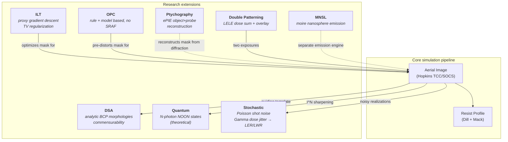

# Research Modules

**Status:** 🔶 Simplified — statuses vary per module (✅ ptychography/MNSL/stochastic/OPC, 🔶 ILT/DSA/double-patterning, 🧪 quantum); each section carries its own badge, mirrored in the [capability matrix](./capability-matrix.md).

Eight modules extend the core pipeline. All but MNSL consume or feed the aerial image engine — MNSL runs its own emission engine — so combined workflows compose naturally (e.g. ILT-optimized mask → stochastic LER analysis).

## ILT — Inverse Lithography 🔶

**Code:** [ilt.rs](../crates/highuvlith-core/src/ilt.rs)

Gradient-descent optimization of a continuous mask transmittance `m ∈ [0,1]²` toward a target aerial image, with total-variation regularization and sigmoid binarization pressure. The forward model is the real SOCS engine:

$$ I(x,y) = \sum_k \lambda_k \left| \mathrm{IFFT}\big(H_k \cdot \mathrm{FFT}(m)\big) \right|^2 $$

**Honesty:** the gradient is an **adjoint-inspired proxy**, not a true adjoint solve. A rigorous adjoint would back-propagate the error through the SOCS kernels,

$$ \frac{\partial C}{\partial m} = 2\,\mathrm{Re}\!\left[\sum_k \lambda_k\, \mathrm{FFT}\big(H_k^* \cdot \mathrm{IFFT}(H_k \cdot \mathrm{FFT}(m)\cdot(I - I_\text{tgt}))\big)\right], $$

but `optimize_ilt` instead uses the local correlation proxy `2·error·sigmoid'(m)` plus the TV gradient — cheaper, adequate for the smooth targets exercised in tests, and documented as such in the module header. A true adjoint is 🗺️ [planned](./roadmap.md). Each iteration re-runs the full SOCS forward model, so the cost signal is genuine even though the descent direction is approximate. `create_target_line_space` builds L/S targets; `ILTResult` returns the continuous transmittance, final aerial image, and cost history.

**Validation:** `test_ilt_runs`, `test_ilt_cost_decreases`, `test_create_target`, `test_total_variation`.

## DSA — Directed Self-Assembly 🔶

**Code:** [dsa.rs](../crates/highuvlith-core/src/dsa.rs)

Block-copolymer pattern multiplication guided by a lithographic template. **Analytic, not SCFT**: the assembled composition is a closed-form profile at the natural period L₀ — sinusoid for lamellae, hexagonal disk array for cylinders, cubic sphere array for spheres — and defectivity is an empirical function of commensurability mismatch, not a free-energy minimization:

$$ r = \frac{p_\text{template}}{L_0}, \qquad P_\text{defect} = \min\big(10\,|r - \mathrm{round}(r)|,\ 1\big), \qquad \rho_\text{defect} = 100\,P_\text{defect}\ /\mu\mathrm{m}^2 $$

`DSAParams::ps_pmma_lamellar(l0_nm)` sets PS-b-PMMA defaults (χN = 20, f = 0.5, interface width L₀/10 — χN and interface width are **stored (inert)**: they parameterize the record but do not currently enter the composition profile). `simulate_dsa_1d` finds template edges and reports defect density; `simulate_dsa_2d` renders 2D morphologies.

**Validation:** `test_commensurability_exact`, `test_commensurability_mismatch`, `test_dsa_1d_basic`, `test_dsa_2d_lamellar`, `test_dsa_2d_cylindrical`, `test_dsa_2d_spherical`, `test_invalid_l0_zero`.

## Ptychography — ePIE ✅

**Code:** [ptychography.rs](../crates/highuvlith-core/src/ptychography.rs)

A genuine extended Ptychographic Iterative Engine: alternating far-field propagation, Fourier-magnitude constraint (replace amplitude with √measured, keep phase), and the standard ePIE object/probe update rules

$$ O' = O + \alpha\, \frac{P^*}{|P|^2_\text{max}}\,(\psi' - \psi), \qquad P' = P + \beta\, \frac{O^*}{|O|^2_\text{max}}\,(\psi' - \psi) $$

with complex object **and** probe refined jointly. `simulate_diffraction_patterns` generates ground-truth data from a known object/probe for closed-loop testing; `epie_reconstruct` recovers both from intensity-only patterns. Intended use: lensless mask metrology at EUV/X-ray wavelengths where lenses are impractical.

**Validation:** `test_simulate_diffraction`, `test_epie_convergence` (final Fourier-magnitude error at or below the initial error on synthetic data — the test pins first vs. last iteration, not per-iteration monotonicity), `test_epie_reconstructs_shape`.

## Quantum lithography — NOON states 🧪

**Code:** [quantum.rs](../crates/highuvlith-core/src/quantum.rs)

**Entirely theoretical** — outputs are research projections, not validated engineering. Models N-photon entangled (NOON-state) exposure: the N-photon absorption pattern is the classical aerial image raised to the Nth power, mixed with the classical image by an entanglement fidelity F:

$$ I_N = F\, I^N + (1-F)\, I, \qquad \Delta x_\text{quantum} = \frac{0.61\,\lambda}{N \cdot \mathrm{NA}} $$

The flux penalty is the honest part of the story: pair-generation efficiency η ≈ 0.01 gives relative flux η^(N−1), i.e. a ~100× exposure-time penalty already at N = 2. `compare_classical_quantum` returns both images, contrasts, resolutions, and the exposure-time ratio side by side. Pairs with the `entangled` source family ([sources](./sources/entangled-photon.md)).

**Validation:** `test_effective_wavelength`, `test_quantum_resolution_better`, `test_quantum_sharpening`, `test_fidelity_interpolation`, `test_exposure_time_very_long`, `test_validate_rejects_zero_photons`, `test_validate_rejects_bad_fidelity`.

## MNSL — Moiré Nanosphere Lithographic Reflection ✅

**Code:** [mnsl.rs](../crates/highuvlith-core/src/mnsl.rs)

Emission-pattern engine for stacked, mutually rotated nanosphere arrays (HCP/FCC/simple-cubic packings; silica and polystyrene presets with VUV optical constants). Rayleigh scattering per sphere, moiré interference between the rotated lattices, and substrate coupling through the thin-film `FilmStack` evaluated at a single z — not a full multiple-scattering solver, but each approximation is stated where used. `MnslEngine::compute_emission` produces the emission `Grid2D`; `calculate_moire_period` and `apply_rotation_transform` support rotation/separation sweeps exposed through the Python `mnsl.py` helpers.

**Validation:** `test_nanosphere_array_volume_fraction`, `test_moire_period_calculation`, `test_rotation_transform_identity`, `test_rotation_transform_90deg`, `test_mnsl_simulation_runs`, `test_substrate_coupling_default`, plus 13 integration tests in [test_mnsl.rs](../crates/highuvlith-core/tests/test_mnsl.rs) and `tests/python/test_mnsl.py`.

## Stochastic — shot noise, dose jitter, LER/LWR ✅

**Code:** [stochastic.rs](../crates/highuvlith-core/src/stochastic.rs)

Monte-Carlo LER/LWR prediction. The `compute_ler_lwr` loop applies two live noise channels per realization:

1. **Photon shot noise** — per-pixel Poisson sampling of the absorbed photon count (Gaussian approximation above 1000 photons), normalized back to intensity.
2. **Shot-to-shot dose jitter** — per-realization dose factor drawn from a **Gamma distribution** with mean 1 and rms `dose_jitter_rms` (Gamma(k, 1/k), k = 1/rms²), the textbook SASE pulse-energy statistic. `StochasticParams::from_source` pulls this **directly from the source model** via `LithographySource::shot_to_shot_rms()` — e.g. the BELLA-target LPA-FEL reports 3%. Because the print threshold is an absolute dose criterion, a hot/cold pulse shifts the printed edge; the jitter measurably raises LWR.

A third channel, **acid diffusion noise** (`apply_acid_noise` — Gaussian perturbation of the PAC field with an empirical scale, the crudest of the three), exists as a standalone tested function but is **not wired into the `compute_ler_lwr` loop**: the reported LER/LWR reflects shot noise and dose jitter only.

**Photon density** is derived from wavelength through the trait: at 157 nm, 1 mJ/cm² carries

$$ \frac{10\ \mathrm{J/m^2}}{hc/\lambda} \times 10^{-18}\ \mathrm{m^2/nm^2} = 7.89\ \mathrm{photons/nm^2} $$

(~237 photons per 1 nm² pixel at a typical 30 mJ/cm² dose). **Changelog note:** an earlier version of this constant was 0.00789 — a m²→nm² conversion slip of 10³ that inflated shot-noise LER by ~√1000 ≈ 32×. It is now pinned against the trait derivation by `test_default_photon_density_matches_source_trait` and against the EUV literature anchor (0.68 photons/nm² per mJ/cm² at 13.5 nm) by `test_photon_density_at_13nm5_matches_literature`.

**Validation:** the two regression tests above, plus `test_shot_noise_preserves_mean`, `test_shot_noise_non_negative`, `test_ler_lwr_computation`, `test_ler_increases_with_noise`, `test_from_source_pulls_dose_jitter`, `test_dose_jitter_increases_lwr`.

## Double patterning — LELE 🔶

**Code:** [double_patterning.rs](../crates/highuvlith-core/src/double_patterning.rs)

Litho-Etch-Litho-Etch simulation: two aerial images (independent masks, foci, doses), the second shifted by the overlay error (rounded to whole pixels, periodic wrap), combined as a **dose-weighted intensity sum** normalized by total dose. `split_mask_lele(cd, pitch)` builds the complementary mask pair at doubled pitch. **Honesty:** this is aerial-domain composition only — no inter-exposure resist chemistry, etch transfer, or freeze process is modeled, which is why the module is 🔶.

**Validation:** `test_double_patterning_basic`, `test_overlay_shifts_result`, `test_split_mask_creates_pair`.

## OPC — Optical Proximity Correction ✅

**Code:** [opc.rs](../crates/highuvlith-core/src/opc.rs)

Two correction paths. **Rule-based** (`OpcRuleTable`): per-feature width lookup applies an edge bias — rectangles move both edges, convex polygons get a miter offset of each vertex along its edge-bisector normal, `GrayRect` footprints follow the rectangle rule. **Model-based** (`model_based_opc`): closes the loop through the real aerial engine, measuring CD each iteration and applying a damped proportional edge correction until CD error < tolerance or the budget is spent.

**Honesty (documented in the module header):** **no SRAF insertion** (🗺️ [planned](./roadmap.md)); the miter offset is exact for convex polygons only (concave vertices get the same rule with no self-intersection cleanup); model-based correction applies one *uniform* bias to all rectangles per iteration (a scalar proportional controller, not per-fragment) and evaluates at nominal focus only.

**Validation:** `test_rule_based_opc_applies_bias`, `test_rule_no_match_zero_bias`, `test_polygon_opc_applies_bias`, `test_polygon_no_bias_when_no_rule`, `test_bias_mask_positive`.

## Related pages

- [Capability matrix](./capability-matrix.md) — authoritative status rows for every module above
- [Processes](./processes/index.md) — the deep-layer process modules (volumetric, LIGA, grayscale, interference)
- [Roadmap](./roadmap.md) — true adjoint ILT, SRAF insertion, and other planned upgrades
