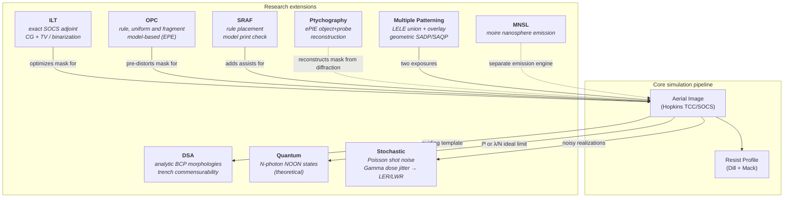

# Research Modules

**Status:** 🔶 Simplified — statuses vary per module (✅ ILT/OPC, 🔶 SRAF/DSA/multiple-patterning/ptychography/stochastic LER, 🧪 quantum/MNSL); each section carries its own badge, mirrored in the [capability matrix](./capability-matrix.md).

Nine modules extend the core pipeline. All but MNSL consume or feed the aerial image engine — MNSL runs its own emission engine — so combined workflows compose naturally (e.g. ILT-optimized mask → stochastic LER analysis).



## ILT — Inverse Lithography ✅

**Code:** [ilt.rs](../crates/highuvlith-core/src/ilt.rs)

Pixel-based mask optimization with the **exact adjoint gradient** through the imaging engine's own SOCS kernels. The mask is a continuous transmission $m = \sigma(\beta G_s \ast \theta)$ of an unconstrained field $\theta$ (optional Gaussian density filter $G_s$ as a soft minimum-feature control, `min_feature_nm`); the complex transmittance is $t = a + (1-a) m$ with $a = 0$ for a binary mask or $a = \sqrt{T}e^{i\phi}$ for an attenuated PSM. The forward model is exactly the engine's (kernels from `AerialImageEngine::kernels(z)`, uniform flare $\varphi$):

```math
A_k = \mathcal F^{-1}\!\big(K_k(z) \odot \mathcal F t\big), \qquad I = (1-\varphi)\sum_k \lambda_k |A_k|^2 + \varphi\,\Big\langle \sum_k \lambda_k |A_k|^2 \Big\rangle
```

The cost sums an image-fidelity term over one or more (focus, dose) conditions — mean-squared image error, or a sigmoid-resist contour error $R = 1/(1+e^{-\alpha(dI - t_r)})$ against the binary target — plus smoothed total variation and a binarization penalty $4m(1-m)$. The gradient is back-propagated exactly,

```math
\frac{\partial C}{\partial m} = 2\,\mathrm{Re}\Big[(1-a)^* \sum_k \lambda_k\, \mathcal F^{-1}\big(K_k^* \odot \mathcal F(G_0 \odot A_k)\big)\Big], \qquad G_0 = (1-\varphi)\,\frac{\partial C}{\partial I} + \frac{\varphi}{N}\sum_x \frac{\partial C}{\partial I},
```

(the adjoint of $\mathcal F^{-1}(K\odot\mathcal F \cdot)$ is $\mathcal F^{-1}(K^*\odot\mathcal F \cdot)$ because $\mathcal F^H = N\mathcal F^{-1}$ in the `Fft2D` convention) and chained through the sigmoid and the self-adjoint filter. `optimize_ilt` runs Polak–Ribière+ conjugate gradient (or steepest descent) with an Armijo backtracking line search, so the cost decreases monotonically within a stage. A binarization penalty that is active from the first iteration freezes the mask at the target shape, so it can be switched on after a warm-up (`binarization_after`, continuation). Process-window ILT sums the cost over `conditions` (each focus uses the engine's kernels at that focus). `ILTResult` returns the continuous and thresholded masks, both images, cost and gradient histories, pattern-error counts, and optional mask snapshots (`snapshot_every`) for mask-evolution figures.

The legacy **local proxy** — $\partial C/\partial I$ used in place of $\partial C/\partial m$, i.e. $\partial I(x)/\partial m(x') \approx \delta(x - x')$ — remains available as `IltGradient::LocalProxy` and is documented as that approximation. On a contact array whose target-shaped mask does not print, it saturates the holes at the target shape and stops on a failed line search, while the adjoint enlarges and reshapes the openings and grows assist-like structures.

**Honesty:** the gradient is exact for the stated forward model, which inherits the engine's approximations; the resist is a constant-threshold sigmoid (no acid diffusion, development or etch); the output is a continuous pixel mask (`binary_mask` thresholds it at 0.5) with no mask-rule check or polygon extraction; `min_feature_nm` is a soft density-filter length scale, not an MRC. With the resist-contour cost, a start whose whole image lies far below the threshold (α·(t − I_max) ≳ 10) saturates the sigmoid: gradients vanish and the optimizer stops almost immediately — lower `steepness`, start from a printing mask, or warm up with the image-fidelity cost.

**Validation:** `test_adjoint_gradient_matches_finite_differences` (central differences, directional relative error < 1e-6 — about 1e-8 in practice — over both cost types, binary and attenuated-PSM absorbers, two focus/dose conditions, flare, TV, binarization and the density filter), `test_forward_model_matches_engine` (ILT forward model equals `compute_from_transmittance` to 1e-10, in focus and defocused), `test_cost_decreases_monotonically`, `test_adjoint_converges_where_proxy_stalls` (2 × 2 array of 90 nm round contacts at 180 nm pitch, 157.63 nm, NA 0.75, σ 0.6, resist threshold 0.25: the proxy's line search fails within the budget — asserted — and the adjoint ends below 0.3× its cost and ¼ of its pattern error: 0.090 → 0.0046 with zero misprinted pixels vs 0.026 and 220 pixels), `test_binarization_continuation_gives_printable_binary_mask`, `test_process_window_ilt_improves_defocus_fidelity` (±100 nm defocus cost reduced by > 30 % relative to nominal-only ILT), `test_regularizer_fixtures`, `test_contact_target_area`, `test_pattern_error_counts_mismatches`, `test_invalid_configs_rejected`; Python: `tests/python/test_optim.py`.

<figure markdown="span">


<figcaption>Inverse lithography (ILT) of 100 nm contacts on a 200 nm pitch (F<sub>2</sub> 157.63 nm, NA 0.75, σ 0.6, 8 kernels, 64 × 8 nm grid): sigmoid-resist cost with the exact adjoint gradient through the SOCS kernels, conjugate gradients, binarization penalty switched on after iteration 20 (converged at 35). Bottom right: on 90 nm contacts the legacy local proxy stops after a few iterations while the adjoint drives the cost down ~18×. Model: ILT ✅ (constant-threshold sigmoid resist; pixel mask, no MRC or polygon extraction).</figcaption>
</figure>

## DSA — Directed Self-Assembly 🔶

**Code:** [dsa.rs](../crates/highuvlith-core/src/dsa.rs)

Block-copolymer pattern multiplication guided by a lithographic template. **Analytic, not SCFT**: the assembled A-block fraction is rendered in closed form — a smoothed square wave for lamellae, smoothed disks on a hexagonal lattice (centre spacing L₀, radius $r = L_0\sqrt{\sqrt3 f/2\pi}$) for cylinders, and on a simple-cubic lattice for spheres — with a tanh interface profile $\phi_A = \tfrac12[1+\tanh(2d/w)]$ of width $w$ = `interface_width_nm`.

For lamellae in **graphoepitaxy** (template open regions = trenches between guiding walls) the lamellae are registered to the trench walls: a trench of width $W$ holds the number of periods $n$ that minimizes the strong-segregation free energy $F(L) = aL^2 + b/L$ (chain stretching + interfacial tension, minimum at $L_0$), the period is strained to $L = W/n$, and the per-trench penalty is reported:

```math
\frac{F(L)}{F(L_0)} = \frac{\lambda^2 + 2/\lambda}{3},\quad \lambda = \frac{L}{L_0}, \qquad n = \operatorname*{argmin}_{n\in\{\lfloor W/L_0\rfloor,\lceil W/L_0\rceil\},\,n\ge1} F(W/n)
```

`simulate_dsa_1d` does this for a 1D template, `simulate_dsa_2d` row by row (lamellae) or by clipping the free-running cylinder/sphere lattice to the template's open region. `DSAParams::validate` rejects χN below the mean-field order–disorder transition of a symmetric diblock, (χN)_ODT = 10.495 (Leibler, Macromolecules 13, 1980); `DSAParams::ps_pmma_lamellar(l0_nm)` sets PS-b-PMMA defaults (χN = 20, f = 0.5, w = L₀/10).

**Honesty:** χN is **live** only in the order–disorder check (mean-field symmetric value — necessary, not sufficient, for asymmetric blocks); the interface width is a user input, not derived from χN. Cylinders and spheres are not registered to the guiding pattern and get no commensurability evaluation. `DSAResult::defect_density` is an **illustrative heuristic index** ($100\cdot\min(10 |W/L_0 - n|, 1)$ "per µm²" for the worst trench) — not calibrated to measured defectivity — and is `NaN` (with `is_defect_free = false`) when nothing was evaluated. Earlier versions ignored the 2D template and always reported zero defects; that overclaim is gone.

**Validation:** `test_free_energy_ratio_fixture` (F = 1.0093939 at λ = 1.1, 1.0107407 at λ = 0.9, minimum at λ = 1), `test_confined_lamellae_period_choice` (W = 90 nm, L₀ = 28 nm → n = 3, L = 30 nm, F = 1.00488), `test_dsa_1d_registers_lamellae_to_trench_walls`, `test_dsa_1d_basic`, `test_mismatched_trench_flags_heuristic_defects`, `test_order_disorder_check`, `test_dsa_2d_cylindrical` (A area fraction equals f = 0.3 within 0.02), `test_dsa_2d_template_clips_pattern`, `test_dsa_2d_lamellar`, `test_dsa_2d_spherical`, `test_commensurability_exact`, `test_commensurability_mismatch`, `test_invalid_l0_zero`.

## Ptychography — ePIE 🔶

**Code:** [ptychography.rs](../crates/highuvlith-core/src/ptychography.rs)

An extended Ptychographic Iterative Engine: alternating far-field propagation, Fourier-magnitude constraint (replace amplitude with √measured, keep phase), and the standard ePIE object/probe update rules

```math
O' = O + \alpha\, \frac{P^*}{|P|^2_\text{max}}\,(\psi' - \psi), \qquad P' = P + \beta\, \frac{O^*}{|O|^2_\text{max}}\,(\psi' - \psi)
```

with complex object **and** probe refined jointly (the probe update uses the freshly updated object). `simulate_diffraction_patterns` generates ground-truth data from a known object/probe for closed-loop testing; `epie_reconstruct` recovers both from intensity-only patterns. Intended use: lensless mask metrology at EUV/X-ray wavelengths where lenses are impractical.

**Honesty (why 🔶):** propagation is a single far-field FFT (Fraunhofer) with a fully coherent probe and noise-free intensities; scan positions are integer pixels and are not refined; there is no partial-coherence (mixed-state) or noise model. The committed tests check that the error does not grow and that shapes are right — none asserts that a known object is recovered, which is what a ✅ would need.

**Validation:** `test_simulate_diffraction`, `test_epie_convergence` (final Fourier-magnitude error at or below the initial error on synthetic data — the test pins first vs. last iteration, not per-iteration monotonicity), `test_epie_reconstructs_shape`.

## Quantum lithography — N-photon and N00N states 🧪

**Code:** [quantum.rs](../crates/highuvlith-core/src/quantum.rs)

**Entirely theoretical**: these are research projections, not engineering predictions. The module keeps two physically different N-photon exposures apart.

- **Classical N-photon absorption** (`n_photon_absorption_image`). An N-th-order absorber records $E = I^N$ of the classical aerial image. This sharpens lines and raises contrast, but it keeps the classical period: it cannot print a pitch the optics does not transmit.
- **Entangled N00N absorption** (Boto et al., *Phys. Rev. Lett.* **85**, 2733 (2000)). N photons in a path-entangled N00N state pick up the two-path phase N times. N-photon absorption of a two-beam interference therefore writes fringes N times finer. `TwoBeamNPhoton` gives both patterns in closed form:

```math
E_\mathrm{NOON}(x) = 1 + \cos\big(N(Kx + \phi)\big), \qquad
E_\mathrm{cl}(x) = \frac{\big(1 + \cos(Kx + \phi)\big)^N}{m_N}, \qquad
K = \frac{4\pi \sin\theta}{\lambda}, \quad m_N = \frac{1}{2^N}\binom{2N}{N}
```

The N00N fringe has period $\lambda/(2N\sin\theta)$. The classical N-photon fringe keeps $\lambda/(2\sin\theta)$ and only adds harmonics.

For general masks, `noon_ideal_image` implements Boto et al.'s ideal limit as a clearly labelled idealization. The same source, optics, mask and grid are imaged at $\lambda/N$ with the same NA and pupil fill. This presumes the required entangled states can be prepared for the pattern.

Decoherence is a fidelity F: the fraction of the exposure from the ideal N00N component. The remainder is classical N-photon absorption, not linear absorption:

```math
E = F\,E_\mathrm{NOON} + (1 - F)\,E_\mathrm{cl} \quad \text{(two beams)}, \qquad
E = F\,I_{\lambda/N} + (1 - F)\,I_\lambda^{\,N} \quad \text{(general masks)}
```

The flux budget (`FluxBudget`) comes from the entangled-photon source's documented constants, not a free efficiency.

- Entangled pairs stay isolated only below about one photon per spectral mode. That crossover flux scales with the down-converted bandwidth, and for broadband light it is of order $10^{13}$ photons/s (Dayan et al., *Phys. Rev. Lett.* **94**, 043602 (2005), Eq. (1)).
- With the ETPA cross-section at its loosest independent bound ($10^{-23}$ cm²), clearing resist at that ceiling takes at least 4.5 × 10¹⁰ times longer than a 30 mJ/cm² exposure at HVM wafer power (N = 2).
- With the disputed $10^{-17}$ cm² claim it is 4.5 × 10⁴ times longer.

No entangled sub-Rayleigh pattern has been recorded in a material. The two-photon demonstration of D'Angelo, Chekhova and Shih (*Phys. Rev. Lett.* **87**, 013602 (2001)) used coincidence detection.

**Validation:**

- `test_two_beam_noon_peaks_at_n_k_classical_keeps_k`: the N00N spectrum peaks at N·K; classical N-photon absorption keeps its fundamental at K, with amplitude 2N/(N+1).
- `test_two_beam_mixture_harmonics_fixture`: exact harmonic amplitudes 2·C(2N, N−j)/C(2N, N).
- `test_two_beam_limits`: F = 0 is exactly classical N-photon absorption; N = 1 is the classical fringe.
- `test_noon_ideal_image_n1_reproduces_classical_exactly`.
- `test_noon_limit_resolves_what_n_photon_absorption_cannot`: at 100 nm pitch, 157.63 nm, NA 0.75, σ 0.5, the classical and Iᴺ contrast is 0 and the λ/2 limit gives 0.73.
- `test_noon_limit_is_classical_imaging_at_lambda_over_n`: scale invariance to 1e-9.
- `test_flux_budget_tied_to_entangled_source_constants`.
- `test_alias_is_classical_n_photon_absorption_for_any_fidelity`, `test_exposure_time_very_long` (now asserts > 1e10), plus validation tests.

## MNSL — Moiré Nanosphere Lithographic Reflection 🧪

**Code:** [mnsl.rs](../crates/highuvlith-core/src/mnsl.rs)

Emission-pattern engine for stacked, mutually rotated nanosphere arrays (HCP/FCC/simple-cubic packings; silica and polystyrene presets with VUV optical constants). `MnslEngine::compute_emission` produces the emission `Grid2D`; `calculate_moire_period` and `apply_rotation_transform` support rotation/separation sweeps exposed through the Python `mnsl.py` helpers.

**Exact parts.** The lattice positions and the moiré period of two gratings with pitches p₁, p₂ at relative rotation θ,

```math
L = \frac{p_1 p_2}{\sqrt{p_1^2 + p_2^2 - 2 p_1 p_2 \cos\theta}} \;\xrightarrow{\,p_1 = p_2 = a\,}\; \frac{a}{2\sin(\theta/2)},
```

the period of the difference of the two reciprocal vectors. Until 2026-09-30 the code returned `p/(2 sin θ)` — about half the true period at small angles, ignoring the second pitch for rotated layers; `test_moire_period_fixtures` now pins the closed form (fixtures cross-checked against the FFT beat of two rotated gratings).

**Why 🧪.** The emission map is a qualitative heuristic, not a solution of Maxwell's equations: each sphere contributes `α e^{ikr}/r²` with the static Clausius–Mossotti polarizability `α = V(n²−1)/(n²+2)` — neither the dipole near field (∝ 1/r³) nor its far field (∝ k²/r) — and the Rayleigh form assumes d ≪ λ while the silica preset has d = 200 nm at λ = 157 nm; the two layers are summed in one plane with a uniform phase k·separation (no multiple scattering); the "enhancement" is the local intensity over its field mean, clamped at 1; and the substrate enters as one scalar from `FilmStack::standing_wave` at z = separation, applied to the whole map. That scalar is 1.346 for the default 157 nm resist stack since the 2026-09-30 thin-film reflectance fix (0.745 before) — a reminder that the number is a stack-dependent coupling, not a validated enhancement.

**Validation:** `test_moire_period_fixtures` (closed-form periods, small-angle limit L·θ → a), `test_nanosphere_array_volume_fraction`, `test_moire_period_calculation`, `test_rotation_transform_identity`, `test_rotation_transform_90deg`, `test_mnsl_simulation_runs`, `test_substrate_coupling_default`, plus 13 integration tests in [test_mnsl.rs](../crates/highuvlith-core/tests/test_mnsl.rs) and `tests/python/test_mnsl.py` — apart from the geometry fixtures these check shapes, ranges and positivity, not physics against a reference.

## Stochastic — shot noise, dose jitter, LER/LWR 🔶

**Code:** [stochastic.rs](../crates/highuvlith-core/src/stochastic.rs)

Monte-Carlo LER/LWR estimate. The photon statistics are exact (✅ in the [capability matrix](./capability-matrix.md#stochastics)); the LER/LWR read-out built on them is 🔶. The `compute_ler_lwr` loop applies two live noise channels per realization:

1. **Photon shot noise** — per-pixel Poisson sampling of the photon count (Gaussian approximation above 1000 photons), normalized back to intensity. The density is the *incident* one by default; `StochasticParams::with_resist_absorption(thickness_nm, absorption_per_um)` (or `with_absorbed_fraction`) rescales it to the absorbed density with Beer–Lambert.
2. **Shot-to-shot dose jitter** — per-realization dose factor drawn from a **Gamma distribution** with mean 1 and rms `dose_jitter_rms` (Gamma(k, 1/k), k = 1/rms²), the textbook SASE pulse-energy statistic. `StochasticParams::from_source` pulls this **directly from the source model** via `LithographySource::shot_to_shot_rms()` — e.g. the BELLA-target LPA-FEL reports 3 % — and applies the single-pulse rms to the whole exposure (exact for single-shot exposures, conservative otherwise); `from_source_multi_pulse(source, N)` divides it by √N for an exposure integrating N pulses (e.g. the `pulses_per_point` of the throughput model). Because the print threshold is an absolute dose criterion, a hot/cold pulse shifts the printed edge; the jitter measurably raises LWR.

**Why 🔶.** The "LER" is the spread of threshold crossings on one row of the noisy aerial image across realizations, not roughness measured along an edge; there is no resist chemistry, secondary-electron or acid-diffusion blur inside the loop, so the result is the photon-noise floor at the chosen pixel size. A third channel, **acid diffusion noise** (`apply_acid_noise` — Gaussian perturbation of the PAC field with an empirical scale), exists as a standalone tested function but is **not wired into the `compute_ler_lwr` loop**. Photon counting is one-photon: N-photon absorption of entangled sources is not modeled.

**Photon density** is derived from wavelength through the trait: at 157 nm, 1 mJ/cm² carries

```math
\frac{10\ \mathrm{J/m^2}}{hc/\lambda} \times 10^{-18}\ \mathrm{m^2/nm^2} = 7.89\ \mathrm{photons/nm^2}
```

(~237 photons per 1 nm² pixel at a typical 30 mJ/cm² dose). **Changelog note:** an earlier version of this constant was 0.00789 — a m²→nm² conversion slip of 10³ that inflated shot-noise LER by ~√1000 ≈ 32×. It is now pinned against the trait derivation by `test_default_photon_density_matches_source_trait` and against the EUV literature anchor (0.68 photons/nm² per mJ/cm² at 13.5 nm) by `test_photon_density_at_13nm5_matches_literature`. Families that override the photon density (the X-ray tube uses its mean photon energy) keep the override when accessed through the type-erased `SourceKind` (`test_source_kind_keeps_xray_tube_photon_density`).

**Validation:** the two regression tests above, plus `test_shot_noise_preserves_mean`, `test_shot_noise_non_negative`, `test_acid_noise_bounded`, `test_ler_lwr_computation`, `test_ler_increases_with_noise`, `test_from_source_pulls_dose_jitter`, `test_multi_pulse_jitter_averages_down`, `test_resist_absorption_scales_photon_density`, `test_dose_jitter_increases_lwr`.

## Multiple patterning — LELE, SADP, SAQP 🔶

**Code:** [double_patterning.rs](../crates/highuvlith-core/src/double_patterning.rs)

**LELE** (litho-etch-litho-etch): `split_mask_lele(cd, pitch)` builds the complementary bright-field masks as infinite gratings (`Mask::line_space_with`: opaque lines of width `cd` at twice the pitch, the second offset by one pitch — image them on a field holding whole double pitches). `simulate_double_patterning` images both (independent foci and doses) and translates the second image by the overlay error with the Fourier shift theorem — exact sub-pixel translation of the band-limited periodic image (earlier versions rounded to whole pixels). Two combinations are reported: the **double-exposure aerial composite** $(d_1I_1 + d_2I_2')/(d_1+d_2)$, which is what a *single* resist exposed twice would see and is **not** the LELE result; and the **LELE printed pattern** (`lele_printed_pattern`), where each exposure is developed on its own (resist line remains where $d I < E_\text{th}$) and the final lines are the union of the two. `lele_cut` measures the printed line intervals along a row (cubic interpolation, bisected edges): an x-overlay error δ leaves the CDs unchanged and alternates the pitch as $p \pm \delta$ — a pitch walk of 2δ.

**SADP / SAQP** (self-aligned double / quadruple patterning) — a **geometric** model on a periodic 1D `LinePattern`: `spacer_process` replaces every mandrel $[x_0, x_1]$ by the sidewall spacers $[x_0 - t, x_0]$ and $[x_1, x_1 + t]$ (conformal deposition, spacer etch, mandrel pull) and fails if spacers of neighbouring mandrels merge. `sadp` applies it once, `saqp` twice (the first spacers become the second mandrels); in the spacer-is-dielectric tone the final lines are the gaps between spacers. Outputs: line CDs, spaces, centre-to-centre pitches, pitch walk (max − min pitch), CD range.

```math
\text{SADP (mandrel pitch } P\text{, CD } W\text{, spacer } t):\quad p_1 = W + t,\;\; p_2 = P - W - t,\;\; p_1 - p_2 = 2W + 2t - P,\;\; W_\text{walk-free} = P/2 - t
```

```math
\text{SAQP } (W, t_1, t_2):\quad \text{spaces } t_1,\; W - 2t_2,\; t_1,\; P - W - 2t_1 - 2t_2 \;\;\Rightarrow\;\; \text{uniform pitch } P/4 \text{ at } W = 3P/8,\; t_1 = t_2 = P/8
```

**Honesty:** LELE uses the engine's aerial images and a constant energy threshold per exposure — no inter-exposure resist interaction, freeze step, or etch bias. SADP/SAQP is purely geometric: ideal conformal deposition with vertical sidewalls, spacer width equal to the deposited thickness, perfect mandrel pull and transfer; deposition and etch physics (sidewall angle, footing, faceting, loading, etch bias) are **not** modeled, and the mandrel CD is an input (for example a CD measured on a printed image).

**Validation:** `test_sadp_exact_pitch_halving` (P = 128, W = t = 32 → 32/32 nm lines/spaces at exactly 64 nm), `test_sadp_pitch_walk_formula` (W + 2 nm → spaces 34/30, pitches 66/62, walk 4 nm; spacer + 1.5 nm → walk 3 nm; closed form vs interval model over a sweep), `test_sadp_spacer_is_dielectric_tone`, `test_saqp_exact_pitch_quartering_and_walk` (W = 48, t₁ = t₂ = 16 → 16/16 at 32 nm; (50, 17, 15) → spaces 14/17/17/20, pitches 29/32/32/35, walk 6 nm), `test_spacer_pinch_off_and_invalid_inputs`, `test_lele_overlay_produces_pitch_walk_of_twice_the_overlay` (6 nm overlay → 12 nm pitch walk to < 0.05 nm, CDs unchanged), `test_fourier_shift_is_exact_for_band_limited_images`, `test_double_patterning_basic`, `test_overlay_shifts_result`, `test_split_mask_creates_pair`; Python: `tests/python/test_optim.py`.

## OPC — Optical Proximity Correction ✅

**Code:** [opc.rs](../crates/highuvlith-core/src/opc.rs)

Three correction paths. **Rule-based** (`OpcRuleTable`): per-feature width lookup applies an edge bias — rectangles move both edges, convex polygons get a miter offset of each vertex along its edge-bisector normal, `GrayRect` footprints follow the rectangle rule, gratings and arrays go through `MaskFeature::with_edge_bias`. **Uniform model-based** (`model_based_opc`, kept for compatibility): one scalar bias for all features (`with_edge_bias`) driven by the centre-row CD through the engine. **Fragment-based model OPC** (`fragment_opc`): every rectangle or rectilinear polygon is cut into edge fragments — corner fragments, interior fragments, line ends (short edges between two convex corners) — and each controlled fragment carries its own bias, updated from its own edge-placement error (EPE) measured at its midpoint along the outward normal where the aerial image crosses the print threshold (Keys-cubic interpolation, bisected crossing):

```math
b_j \leftarrow \mathrm{clamp}\big(b_j + \mathrm{clamp}(-g\,(S\,\overline{\mathrm{EPE}})_j,\ \pm\Delta_\text{max}),\ \pm b_\text{max}\big), \qquad S = (1-s)\,\mathbb 1 + s\,[1,2,1]/4, \qquad \overline{\mathrm{EPE}} = \frac{\sum_c w_c\,\mathrm{EPE}_c}{\sum_c w_c}
```

The along-edge `[1, 2, 1]/4` filter matters: bias patterns that alternate faster than the optics resolve are invisible in the image, and an unfiltered loop integrates any EPE component in that null space up to the bias clamp. Corner fragments are slaved to their interior neighbour by default (corner rounding is a low-pass effect an edge bias cannot remove). Optional (focus, dose, weight) `conditions` make the correction process-window aware. The loop stops when both the rms and the max |EPE| of controlled fragments meet their tolerances; jog cleanup (`min_jog_nm`) and mask-grid snapping (`bias_grid_nm`) are applied to the output and the EPE is re-measured on it. `FragmentOpcConfig::for_engine` scales fragment lengths, search range, clamps and tolerances to λ/NA.

OPC and SRAF image geometry through `AerialImageEngine::compute`, whose mask spectrum (`Mask::spectrum`, see [masks and metrics](./masks-and-metrics.md)) comes from exact analytic Fourier coefficients with the painter's rule for overlaps, so sub-pixel edge moves change the image continuously; `socs_image` states the same image formula for an arbitrary spectrum (ILT uses its kernel fields for the adjoint).

**Honesty:** the "resist" is a constant threshold on the aerial image (dose scales the image); fragment OPC handles rectangles and rectilinear polygons only (gratings, arrays, gray rectangles and general polygons pass through uncorrected); corner rounding is not corrected; there is no mask-rule check beyond the bias clamp, jog cleanup and grid snapping — the clamp must stay below half the smallest width/space or corrected polygons can self-intersect; the rule-based polygon offset is exact for convex polygons only.

**Validation:** `test_fragment_opc_line_end_converges` (90 × 500 nm line, k₁ = 0.43, both tones exposed at dose-to-size, 157.63 nm / NA 0.75 / σ 0.6: the uncorrected line ends pull back 27 nm (bright field) / 36 nm (dark field); OPC extends them by 26 / 38 nm and the rms EPE falls from 9.6 / 12.8 nm to 0.36 / 0.40 nm in 7 / 9 iterations — the test asserts > 20 nm pull-back, > 15 nm extension, < 1.5 nm residual), `test_fragment_opc_t_junction_converges` (100 nm arms at the stem's dose-to-size threshold, default settings: max EPE 20 / 31 nm → 1.5 / 1.1 nm, rms 7.2 / 10.9 → 0.74 / 0.67 nm in 5 / 7 iterations), `test_fragment_opc_process_window_balances_defocus` (EPE at 120 nm defocus < 0.6× the nominal-only correction's), `test_model_based_opc_converges_on_periodic_line_space` (uniform bias on a `Mask::line_space` grating via `with_edge_bias`: drawn 90 nm lines sized to print 80 nm, grating CD 84.5 nm, 13 iterations), `test_fragment_opc_passthrough_snapping_and_errors`, `test_fragmentation_counts_and_kinds`, `test_corrected_polygon_geometry`, `test_jog_cleanup_merges_small_jogs`, `test_normalize_rectilinear`, `test_measure_epe_on_synthetic_edge`, `test_mask_spectrum_matches_numerical_integration` (independent 400² quadrature cross-check of the exact spectrum OPC relies on), `test_socs_image_matches_engine`, `test_sample_image_reproduces_band_limited_field`, plus the rule/uniform tests `test_rule_based_opc_applies_bias`, `test_rule_no_match_zero_bias`, `test_polygon_opc_applies_bias`, `test_polygon_no_bias_when_no_rule`, `test_bias_mask_positive`.

<figure markdown="span">


<figcaption>Fragment-based model OPC of a 90 × 500 nm line (F<sub>2</sub> 157.63 nm, NA 0.75, σ 0.6, threshold at the dose-to-size of the line centre): edges are cut into fragments, each moved by damped feedback on its edge-placement error measured on the aerial image. The uncorrected line ends pull back by tens of nanometres; the corrected polygon extends them and the residual falls below 1 nm. Model: OPC (fragment model-based) ✅ (aerial-image threshold; corners slaved, no MRC beyond bias clamp, jog cleanup and grid snap).</figcaption>
</figure>

## SRAF — Sub-Resolution Assist Features 🔶

**Code:** [sraf.rs](../crates/highuvlith-core/src/sraf.rs)

**Placement** (`place_srafs`) is rule based. For lines, the space from each line edge to the nearest facing feature — including periodic images, because the imaging field is periodic — selects a `LineSrafRule` (bars per side, bar width, first gap, gap between bars); bars fill the space inward from both edges, and when the next pair would crowd, a single centred bar is placed instead. Isolated contacts get a ring of four bars or square assists. Assists have the tone of the main features and are dropped if closer than `min_clearance_nm` to anything else. `SrafRules::for_engine` gives a **heuristic** starting deck: bars of width 0.14 λ/NA centred at multiples of the equivalent dense pitch $p^* = (\lambda/\mathrm{NA})/(2\sigma_c)$ (clamped to 0.7–1.0 λ/NA).

**Print check** (`insert_srafs`): the mask with its assists is imaged at every (focus, dose) corner; an opaque assist prints where $d I < t$, a clear one where $d I > t$, and each assist must keep a relative `margin` from printing. Printing assists are narrowed step by step and then removed, and the check repeats until none prints. **DOF helper** (`line_dof`, `compare_sraf_dof`, `dose_to_size_threshold`): each mask is anchored to its own dose-to-size threshold (in-focus CD = target), and the DOF is the interpolated focus range around best focus where the CD stays within ±tolerance at every dose corner.

Representative low-k₁ case (validated on a textbook **Abbe reference model** in the tests — one kernel per source point with the optics' exact (non-paraxial) defocus phase inside the pupil — because the gain depends on how the imaging model handles defocus under off-axis illumination): 157.63 nm, NA 0.75, isolated 80 nm opaque line (k₁ = 0.38) in a 768 nm periodic field, heuristic deck, print check at ±150 nm focus × ±8 % dose with a 5 % margin, DOF at ±10 % CD:

| Illumination (reference model) | Line CD | DOF without → with SRAF | Assists after print check |
|---|---|---|---|
| Conventional σ 0.5 | 80 nm | 114 → 147 nm (×1.28) | 3 bars (29 nm), none printing |
| Conventional σ 0.8 | 80 nm | 155 → 209 nm (×1.35) | 3 bars |
| Annular σ 0.5–0.8 | 80 nm | 205 → 265 nm (×1.29) | bars at ±162 nm and midway to the periodic neighbour |
| Dipole-x (σ_c 0.7, r 0.15) | 80 nm | 206 → 209 nm (×1.01) | first bars printed → 2 removed, 2 narrowed to 17 nm (at ±300 nm) |
| Conventional σ 0.5 | 100 nm | 158 → 235 nm (×1.49) | 3 bars |
| Annular σ 0.5–0.8 | 100 nm | 233 → 307 nm (×1.32) | 3 bars |
| Dipole-x | 100 nm | 208 → 211 nm (×1.02) | 2 removed, 2 narrowed to 17 nm |

(15 × 15 source samples, 21 focus steps over ±500 nm.) Through the v2 aerial engine (defocus applied inside the pupil at every source point) the same workflow gives ≈ 210 → 275 nm (×1.31) for the annular case with identical assist placement and print margin, and ×1.32 for conventional σ 0.5 (13-point focus sweeps over ±300 nm). With a true two-pole dipole-x the heuristic deck gives no meaningful gain (engine 196 → 204 nm, ×1.05): its first bars, at the equivalent dense pitch (≈ 150 nm), print at the focus/dose corners and are removed, and the surviving narrowed bars at ±300 nm barely change the image. (Dipole numbers published before the 2026-09-30 two-pole fix of `IlluminationShape::Dipole` — ×1.23, ×1.10 and ×1.11 — came from a single off-axis pole and are withdrawn.) The pre-v2 engine — defocus as a phase on the mask-frequency kernels (the legacy kernel-phase approximation) and a TCC truncated at |f| ≤ NA/λ — gave only ×1.20 for the annular case: the mechanism needs the defocus phase applied inside the pupil at every source point.

**Honesty:** the rule deck is heuristic and user-editable, not an optimized or calibrated deck; line assists are placed for parallel lines only (general 2D layouts, jogs and line ends get none); "does not print" means staying on the non-printing side of a constant aerial-image threshold with the requested margin at the sampled corners — no resist-blur, development or etch model; the DOF gain is only as good as the engine's defocus model.

**Validation:** `test_sraf_improves_isolated_line_dof_reference_model` (annular case above: ≥ 20 % DOF gain asserted, ×1.29 measured, with every surviving assist independently re-verified not to print), `test_sraf_improves_isolated_line_dof_engine` (same case through the engine: gain > 1.08, no printing), `test_print_check_shrinks_or_removes_printing_assists` (deliberately 70 nm bars print, are narrowed or removed, and the survivors are re-verified), `test_bars_in_space_fixture`, `test_place_srafs_iso_dense_and_horizontal_lines`, `test_contact_ring_and_clearance_filter`, `test_line_cd_and_dof_interpolation_fixtures` (analytic Gaussian line: CD 77.56 nm at t = 0.5), `test_invalid_inputs_rejected`; Python: `tests/python/test_optim.py` (`api.isolated_line_sraf_study`).

<figure markdown="span">


<figcaption>Sub-resolution assist features for an isolated 80 nm line (F<sub>2</sub> 157.63 nm, NA 0.75, annular σ 0.5–0.8): rule-placed scattering bars are shrunk or removed until none prints at ±150 nm focus and ±8 % dose, then the depth of focus (CD within ±10 %, each mask at its own dose-to-size) is compared. Model: SRAF insertion 🔶 (heuristic rule deck + model print check; constant-threshold resist).</figcaption>
</figure>

## Related pages

- [Capability matrix](./capability-matrix.md) — authoritative status rows for every module above
- [Processes](./processes/index.md) — the process modules (thin film, resist, volumetric, LIGA, grayscale, interference, Talbot)
- [Roadmap](./roadmap.md) — resist-aware OPC/ILT, MRC-aware ILT and model-based SRAF, a stochastic resist Monte Carlo, and other planned upgrades
