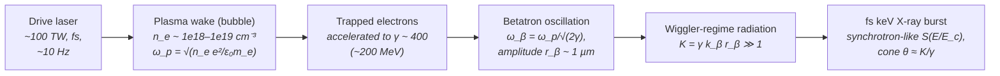

# Laser-Wakefield Betatron X-rays

**Status:** 🧪 Theoretical — LWFA betatron X-rays are keV, broadband, ~10 Hz sources used for imaging, not lithography (µW average power, tens-of-percent shot-to-shot fluctuation); the formula layer of this planar-orbit, synchrotron-like model (plasma and betatron frequencies, strength parameter K, critical energy, photons per period, S(y) spectrum) is textbook physics, fixture-tested against an independent evaluation.

## Overview

In a laser-wakefield accelerator (LWFA) an intense, short laser pulse drives a plasma wave; in the blow-out ("bubble") regime the electrons are expelled from behind the pulse, leaving a column of ions. Electrons injected into this cavity are accelerated to hundreds of MeV over mm distances and, because the uniform ion column pulls them back towards the axis with a linear restoring force, they also oscillate transversely — **betatron oscillations**. The plasma is thereby a µm-amplitude, mm-long wiggler, and the electrons radiate a femtosecond, synchrotron-like burst of keV X-rays from a µm-size source into a ~10 mrad cone (first observed from a laser-plasma accelerator by Rousse et al., 2004; betatron radiation from an electron-beam-driven plasma had been reported earlier).

Betatron sources are compact and ultrafast, and their small source size gives excellent spatial resolution — they are used for (phase-contrast) **imaging, not lithography**. They deliver ~10⁸–10⁹ photons per shot at ≲10 Hz with 100-TW-class drivers, i.e. µW of average X-ray power. For lithography they are at most a curiosity for LIGA-style shadow printing; the model exists to put numbers on that.

`BetatronSource` in [source_models/betatron.rs](../../crates/highuvlith-core/src/source_models/betatron.rs) derives everything from the plasma density, electron energy, oscillation amplitude, interaction length and bunch charge.

## Generation physics



Plasma frequency and wavelength (practical form $\omega_p \approx 5.64\times10^4 \sqrt{n_e[\mathrm{cm^{-3}}]}$ rad/s):

```math
\omega_p = \sqrt{\frac{n_e e^2}{\varepsilon_0 m_e}}, \qquad \lambda_p = \frac{2\pi c}{\omega_p}
```

Betatron frequency in the ion channel ($\gamma \gg 1$) and period:

```math
\omega_\beta = \frac{\omega_p}{\sqrt{2\gamma}}, \qquad \lambda_\beta = \lambda_p\sqrt{2\gamma}
```

Strength parameter (practical form $K \approx 1.33\times10^{-10} \sqrt{\gamma n_e[\mathrm{cm^{-3}}]} r_\beta[\mu\mathrm{m}]$):

```math
K = \gamma\, k_\beta\, r_\beta = \frac{\gamma\,\omega_\beta\, r_\beta}{c}
```

Critical energy in the wiggler regime ($K \gg 1$), from the synchrotron result $\omega_c = \tfrac{3}{2}\gamma^3 c/\rho$ at the orbit's minimum radius of curvature $1/\rho = r_\beta k_\beta^2$:

```math
\hbar\omega_c = \frac{3}{2}\,\frac{\gamma^3\,\hbar\,\omega_\beta^2\, r_\beta}{c} = \frac{3}{2}\,K\gamma^2\,\hbar\omega_\beta
\;\approx\; 5.24\times10^{-24}\,\gamma^2\, n_e[\mathrm{cm^{-3}}]\, r_\beta[\mu\mathrm{m}]\ \ \mathrm{keV}
```

(Note the $\gamma^3$: the form $\tfrac{3}{2}\gamma^2\hbar\omega_\beta^2 r_\beta/c$ is dimensionally consistent but low by a factor $\gamma$.) At fixed $n_e$ and $r_\beta$, $E_c \propto \gamma^2$: doubling the electron energy quadruples the critical energy.

**Photons per period — a planar-orbit result.** For a planar sinusoidal orbit $x = r_\beta \sin(\omega_\beta t)$ the Larmor energy radiated per period is $W = e^2\gamma^2K^2\omega_\beta/(6\varepsilon_0 c)$; dividing by the mean photon energy of a synchrotron spectrum, $\langle\hbar\omega\rangle = \tfrac{8}{15\sqrt3}\hbar\omega_c = 0.3079 \hbar\omega_c$, gives

```math
N_\gamma = \frac{5\pi\sqrt3}{6}\,\alpha K \approx 3.31\times10^{-2}\,K
```

photons per period per electron. A helical (circular) orbit of the same amplitude would radiate twice the energy and twice the photons per period; the model's round flat-top cone stands for an ensemble of randomly oriented orbit planes, not for helical orbits.

Photons per shot $= (Q/e) (L/\lambda_\beta) N_\gamma$. The photon spectrum per shot follows the bending-magnet universal function $S(y) = y\int_y^\infty K_{5/3}$ (shared with the [synchrotron](./synchrotron.md) family):

```math
\frac{dN}{dE} = N_\text{shot}\,\frac{S(E/E_c)}{E\,(5\pi/3)}, \qquad \int_0^\infty \frac{S(y)}{y}\,dy = \frac{5\pi}{3}
```

with divergence half-angle $\theta \approx K/\gamma$.

## Real-machine parameters

Typical published ranges (order of magnitude; see the review by Corde et al., 2013):

| Quantity | Typical range |
|---|---|
| Plasma density | 10¹⁸–10¹⁹ cm⁻³ |
| Electron energy | ~100 MeV to several hundred MeV |
| Betatron amplitude | ~µm |
| Critical energy | ~1 to tens of keV |
| Photons per shot | ~10⁸–10⁹ |
| Divergence | ~10 mrad |
| Source size / duration | ~µm / ~fs to tens of fs |
| Repetition rate | ≲10 Hz (100-TW class drivers) |

Model preset `lwfa_100tw` (illustrative, within those ranges) — every number derived by the code:

| Input | Value | Derived | Value |
|---|---|---|---|
| Electron energy | 200 MeV (γ = 392.4) | ω_p, λ_p | 1.784×10¹⁴ rad/s, 10.56 µm |
| Plasma density | 1×10¹⁹ cm⁻³ | λ_β | 295.8 µm |
| Amplitude r_β | 1 µm | K | 8.34 |
| Interaction length | 3 mm (10.1 periods) | E_c | 8.07 keV |
| Bunch charge | 50 pC (3.1×10⁸ e⁻) | N_γ per period per e⁻ | 0.276 |
| Repetition rate | 10 Hz | photons per shot | 8.7×10⁸ |
| Pulse duration | 10 fs | mean photon energy | 2.48 keV |
| Shot-to-shot rms | 30% (assumed) | X-ray energy per shot / average power | 0.35 µJ / 3.5 µW |
| | | divergence K/γ | 21.2 mrad |
| | | coherent fraction (Kim's form, both planes) | 3.5×10⁻⁶ |
| | | gap to 250 W | ×7×10⁷ |

## Simulation model

`BetatronSource` implements `LithographySource`:

- **Formula layer** — `plasma_frequency_rad_s`, `betatron_frequency_rad_s`, `betatron_strength`, `betatron_critical_energy_kev`, `photons_per_period_per_electron` are public free functions; the struct methods compose them (`strength_k()`, `critical_energy_kev()`, `num_periods()`, `photons_per_shot()`, `mean_photon_energy_kev()`, `xray_energy_per_shot_j()`, `divergence_mrad()`, `coherent_fraction()`).
- **Spectrum** — `photon_spectrum(n)` bins photons per shot on log-spaced energy bins over [0.1, 8] E_c, the window the LIGA module uses for a bending magnet (it holds 46 % of the photons: 53 % of a synchrotron-like photon spectrum lies below 0.1 E_c). `spectral_flux_density(distance_mm, n_bins)` gives the on-axis `(E_keV, photons s⁻¹ mm⁻² keV⁻¹)`, spreading each shot uniformly over a flat-top cone of half-angle K/γ (assumption) and averaging over the repetition rate.
- **LIGA coupling** — `xray_spectrum()` returns `XraySpectrum::BendingMagnet { critical_energy_kev }` (relative: no exposure time), so the betatron beam feeds the [LIGA module](../processes/liga-deep-xray.md) exactly like a bending magnet; `highuvlith deep` accepts `[source] type = "betatron"` directly ([examples/sim_betatron.toml](../../examples/sim_betatron.toml), 100 µm PMMA: top/bottom dose ratio 4.59). For an absolute exposure pass `spectral_flux_density` as a flux-density table.
- **Trait mapping** — `wavelength_nm()` is $hc/\langle E\rangle$, the wavelength at the mean photon energy 0.3079 E_c (the photon-weighted mean *wavelength* of a synchrotron spectrum diverges); `bandwidth_pm()` is nominal Δλ/λ = 1; `spectral_weights()` is the photon spectrum on `spectral_samples` (default 16) log bins. Pulse metadata (energy per shot, rate, duration) is live, and `shot_to_shot_rms()` feeds the stochastic dose jitter. `transverse_coherence()` stays 0 (the ~3.5×10⁻⁶ coherent fraction — Kim's per-plane form `eps_r / (eps + eps_r)` with the photon emittance r_β·K/γ in both planes — is reported as a derived quantity).
- **Validation** — `validate()` rejects K < 1 (undulator regime, whose narrow harmonics this model does not describe), electron energies below 10 MeV (γ ≫ 1 is assumed), and overdense plasma (n_e above the 1.74×10²¹ cm⁻³ critical density of a 0.8 µm driver).
- **Presets** — `BetatronSource::lwfa_100tw()` and `new(electron_energy_mev, plasma_density_cm3, betatron_amplitude_um, interaction_length_mm, bunch_charge_pc, rep_rate_hz)`.

Assumptions of this **planar-orbit, synchrotron-like (S(y)) model**: planar sinusoidal orbits (randomly oriented across the bunch, hence the round flat-top cone of half-angle K/γ; helical orbits would double the photon count); a single electron energy and amplitude and a constant γ over the interaction length (real spectra are ensemble averages over energy, amplitude and acceleration history, usually fitted with an effective synchrotron-like E_c — which is what this model provides); and a photon count evaluated at the peak critical energy (the orbit-averaged spectrum is somewhat softer).

<figure markdown="span">


<figcaption>Hard X-ray spectra of the LIGA-class presets from <code>spectral_flux_density(100 mm)</code>. (a) X-ray tubes: Kramers bremsstrahlung ending at the Duane–Hunt limit (eV<sub>tube</sub>), anode K/L lines gated by their edges, 250 µm Be window — line energies, edges, Duane–Hunt limit and Be filtration ✅; continuum shape and absolute flux 🔶 (Kramers thick target, no self-absorption, heel effect or backscatter; empirical line yields ±×2). (b) Laser-wakefield betatron: synchrotron-like spectrum from the critical energy E<sub>c</sub> of a single-energy, single-amplitude bunch, flat-top cone — 🧪.</figcaption>
</figure>

## Model coverage

| Field | Unit | Consumed by | Status |
|---|---|---|---|
| `electron_energy_mev` | MeV | γ → ω_β, K, E_c, divergence | live |
| `plasma_density_cm3` | cm⁻³ | ω_p → ω_β, K, E_c | live |
| `betatron_amplitude_um` | µm | K, E_c, coherent fraction | live |
| `interaction_length_mm` | mm | number of periods → photons per shot | live |
| `bunch_charge_pc` | pC | electrons per bunch → photons per shot | live |
| `rep_rate_hz` | Hz | average power, flux density | live |
| `pulse_duration_fs` | fs | `pulse_duration_s()` | live |
| `shot_to_shot_rms` | — | `shot_to_shot_rms()` → stochastic dose jitter | live |
| `spectral_samples` | count | bins of `spectral_weights()` | live |
| `illumination` | enum | `intensity_at()` (not a projection-imaging source) | live |
| energy / amplitude distributions, γ evolution | — | — | planned |

## Usage

Python:

<!-- verify-example -->
```python
import highuvlith as huv

src = huv.SourceConfig.betatron(
    electron_energy_mev=200.0, plasma_density_cm3=1e19, betatron_amplitude_um=1.0,
    interaction_length_mm=3.0, bunch_charge_pc=50.0, rep_rate_hz=10.0,
)
dq = {name: value for name, value, *_ in src.derived_quantities()}
print(dq["betatron_strength_k"], dq["critical_energy_kev"], dq["photons_per_shot"])  # 8.34, 8.07, 8.7e8
spectrum = src.xray_spectrum(n_bins=64)                 # [(E_keV, photon fraction)] over [0.1, 8] E_c
flux = src.spectral_flux_density(1000.0, n_bins=64)     # on-axis photons/s/mm^2/keV at 1 m
```

??? success "Output"

    ```text
    8.335178919998581 8.06911259510957 872985923.518901
    ```

TOML ([examples/sim_betatron.toml](../../examples/sim_betatron.toml)):

```toml
[source]
type                  = "betatron"
electron_energy_mev   = 200.0
plasma_density_cm3    = 1.0e19
betatron_amplitude_um = 1.0
interaction_length_mm = 3.0
bunch_charge_pc       = 50.0
rep_rate_hz           = 10.0

[deep]
mode = "liga"      # highuvlith deep --config examples/sim_betatron.toml
```

## Validation

Rust unit tests in [betatron.rs](../../crates/highuvlith-core/src/source_models/betatron.rs), fixture numbers from an independent NumPy evaluation (SI constants; K_{5/3} from its integral representation):

- `test_plasma_frequency_fixture` — ω_p(10¹⁹ cm⁻³) = 1.78399×10¹⁴ rad/s, λ_p = 10.5587 µm, ω_p ∝ √n_e.
- `test_betatron_frequency_and_strength_fixture` — γ, ω_β, λ_β = 295.79 µm, K = 8.3352 (and the 1.33×10⁻¹⁰ practical form), 10.14 periods.
- `test_critical_energy_fixture_and_forms` — E_c = 8.0691 keV, equal to (3/2)Kγ²ħω_β and to the 5.24×10⁻²⁴ practical form.
- `test_critical_energy_scaling_laws` — E_c ∝ γ² at fixed n_e, r_β; linear in n_e and in r_β.
- `test_photon_yield_fixture` — N_γ = 0.27581 (3.31×10⁻² K), 8.7299×10⁸ photons per shot, 3.4752 µW.
- `test_spectrum_normalization_and_shape` — the [0.1, 8] E_c photon fraction 0.462807; weights normalized; BM hand-off at E_c.
- `test_derived_quantities_and_metadata` — coherent fraction 3.4815×10⁻⁶ (Kim's form, both planes).
- `test_spectral_flux_density_scaling`, `test_trait_wavelength_is_mean_photon_energy`, `test_validation`.

CLI: `test_betatron_undulator_regime_rejected` and the LIGA end-to-end test; Python: `tests/python/test_sources_new.py::TestBetatron`.

## References

1. S. Corde et al., "Femtosecond x rays from laser-plasma accelerators," *Rev. Mod. Phys.* **85**, 1 (2013).
2. A. Rousse et al., "Production of a keV X-ray beam from synchrotron radiation in relativistic laser-plasma interaction," *Phys. Rev. Lett.* **93**, 135005 (2004).
3. E. Esarey et al., "Synchrotron radiation from electron beams in plasma-focusing channels," *Phys. Rev. E* **65**, 056505 (2002).
4. Related pages: [synchrotron](./synchrotron.md) (bending-magnet S(y) and critical energy), [LPA-FEL](./lpa-fel.md) (the same accelerator driving an undulator), [X-ray tube](./xray-tube.md), [capability matrix](../capability-matrix.md).
