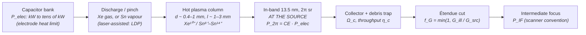

# Discharge-Produced Plasma (DPP / LDP) at 13.5 nm

**Status:** 🔶 Simplified — the electrical-power → in-band (2π sr, at the source) → collected → étendue-limited (intermediate focus) power chain, the in-band spectrum, pulse energy and shot-to-shot jitter are live and fixture-tested, and the presets sit on reported real-machine anchors; but the conversion efficiencies are reported order-of-magnitude values, the pinch size, collector and illuminator étendue are stated assumptions, and discharge dynamics, out-of-band emission and debris are not modelled.

## Overview

A discharge-produced plasma (DPP) source dumps the energy of a capacitor bank directly into a small gas or vapour column: the current pinches and heats it to tens of eV, and Xe¹⁰⁺ or Sn⁸⁺–Sn¹⁴⁺ ions radiate into the 2 % band at 13.5 nm that Mo/Si mirrors reflect. The laser-assisted variant (LDP) uses a laser pulse to vaporize tin from a rotating, tin-coated electrode, triggering and localizing the discharge. With no multi-kW drive laser, DPP was the leading low-cost alternative to laser-produced plasma ([LPP](./lpp.md)) during EUV development, and a laser-assisted Sn source was used on the pre-production ASML NXE:3100.

It lost the high-volume-manufacturing (HVM) race on two counts that this model makes explicit:

- **Power scaling.** Essentially all of the electrical input ends up as heat at the electrodes (CE is a few %), so electrode cooling and erosion cap the input at tens of kW, and with it the in-band power.
- **Étendue.** A discharge pinch is sub-mm to mm in size — much larger than a ~0.1 mm LPP plasma — so less of the collected light fits the scanner illuminator's étendue.

Discharge sources remain in use at lower power as compact sources for actinic (at-wavelength) metrology and inspection, where brightness rather than total power is the figure of merit.

**Two power conventions.** DPP outputs are customarily quoted **into 2π sr at the source**; scanner requirements (the ~250 W HVM class) are **at intermediate focus (IF)**, after collection and the étendue cut — several times lower. The model reports both and never mixes them.

`DppSource` in [source_models/dpp.rs](../../crates/highuvlith-core/src/source_models/dpp.rs) models Xe DPP and Sn DPP/LDP behind one struct, selected by `DppFuel`.

## Generation physics



In-band power into the 2π half-space at the source, with CE the conversion efficiency from electrical input to in-band (2 % bandwidth at 13.5 nm) radiation:

```math
P_{2\pi} = \mathrm{CE}\; P_\text{elec}
```

Collected by a collector subtending $\Omega_c$ with throughput $\eta_c$ (mirror reflectivity × debris-mitigation transmission):

```math
P_\text{coll} = P_{2\pi}\,\frac{\Omega_c}{2\pi}\,\eta_c
```

Source étendue of a cylindrical emitter of diameter $d$ and length $l$, using the side-on projected area and the small-angle form $G = A \Omega$ (a conservative upper estimate for a large collection solid angle):

```math
G_\text{src} = d\, l\, \Omega_c
```

Étendue-limited usable fraction (uniform phase-space density) and the power at intermediate focus:

```math
f_G = \min\!\left(1, \frac{G_\text{ill}}{G_\text{src}}\right), \qquad P_\text{IF} = P_\text{coll}\, f_G
```

The metrology figure of merit, in-band radiance:

```math
L = \frac{P_{2\pi}}{d\,l\;2\pi}\quad[\mathrm{W\,mm^{-2}\,sr^{-1}}]
```

## Real-machine parameters

Reported in-band (13.5 nm) powers — note the plane of each number:

| Source | Fuel | Reported in-band power | Plane | Year | Reference |
|---|---|---|---|---|---|
| Energetiq EQ-10 / EQ-10HP | Xe | 10 → 20 W | 2π sr at the source | product specification | [Energetiq](https://www.energetiq.com/euv-lithography-high-brightness-extreme-ultraviolet-light-source-electrodeless-z-pinch-eq-10hp) |
| EQ-10HP at the LBNL MET5 | Xe | 27 W | 2π sr at the source | 2024 | [Miyakawa (2024)](https://euvlitho.com/2024/P13.pdf) |
| Fraunhofer ILT FS5440 | Xe | 20–40 W (2 % BW) | 2π sr at the source | 2020 | [Vieker (2020)](https://euvlitho.com/2020/P32.pdf) |
| Philips Extreme UV lamp | Sn | 200 W continuous | 2π sr at the source | 2005 | as reported by [Banine & Moors (2011)](https://www.euvlitho.com/2011/S8.pdf) |
| TRINITI rotating-disk-electrode DPP | Sn | 360 W continuous for ≥44 min (180 mJ × 2 kHz); 1 kW for 10 s at 63 kW electrical (implied CE ≈ 1.6 %) | 2π sr at the source | 2010 | [Borisov et al. (2010)](https://euvlitho.com/2010/P1.pdf) |
| XTREME/Ushio laser-assisted DPP on the ASML NXE:3100 | Sn | "20 W at 90 % duty" (≈18 W time-averaged) | intermediate focus (exposure power) | 2011 | [Banine & Moors (2011)](https://www.euvlitho.com/2011/S8.pdf) |

For scale between the two planes: a 2013 LPP example quoted "720 W in 2π → 176 W raw at IF" (Cymer). In-band CE orders of magnitude (2 % BW, 2π sr): ~0.5 % for Xe, ~2 % for Sn (reported).

Model presets (every number not in the table above is an **assumption**, labelled in the code):

| Preset | P_elec | CE | P_2π (at source) | Anchor | d × l | Ω_c, η_c | G_src | f_G (G_ill = 3.3 mm²·sr) | P_IF | Gap to 250 W |
|---|---|---|---|---|---|---|---|---|---|---|
| `xe_13nm5` | 2 kW (implied) | 0.5 % | 10 W | Energetiq EQ-10 class | 1 × 3 mm | 1.5 sr, 0.4 | 4.5 mm²·sr | 0.733 | 0.70 W | ×357 |
| `sn_13nm5` (DPP/LDP) | 18 kW | 2 % | 360 W (180 mJ × 2 kHz) | TRINITI continuous level | 0.4 × 1 mm | 1.5 sr, 0.4 | 0.6 mm²·sr | 1 | 34.4 W | ×7.3 |

The Sn preset's 34 W at IF is the same order as the ≈18–20 W the laser-assisted DPP delivered on the NXE:3100. The default illuminator étendue of 3.3 mm²·sr is an assumption of the order of published EUV scanner étendue budgets (the same value the LPP model uses); the real value depends on the NA, field size and pupil fill — set `illuminator_etendue_mm2_sr` for your illuminator.

## Simulation model

`DppSource` implements `LithographySource`:

- **Spectrum** — `wavelength_nm()` is the in-band centre (13.5 nm) and `bandwidth_pm()` the mirror-selected 2 % band (270 pm), sampled as a Gaussian by `spectral_weights()` (same convention as [LPP](./lpp.md)). The narrow band makes the per-sample-focus polychromatic imaging honest.
- **Power chain (live)** — `in_band_power_2pi_w()` (at the source), `collected_power_w()`, `source_etendue_mm2_sr()`, `etendue_usable_fraction()`, `power_at_if_w()` (at intermediate focus), `in_band_radiance_w_mm2_sr()`. `average_power_w()` reports the usable power at IF and `pulse_energy_j()` divides it by `rep_rate_hz`.
- **Stochastics** — `shot_to_shot_rms()` (default 5 %, an assumed few-% pulse-to-pulse stability) feeds the Gamma dose-jitter term of the stochastic module, so DPP and LPP stability profiles can be compared there.
- **Pupil** — the plasma is spatially incoherent: `transverse_coherence() = 0` and the default pupil is `Conventional { sigma }` (σ validated in (0, 1]).
- **Derived quantities** — P_2π (at the source), P_coll, G_src, f_G, P_IF (at intermediate focus), photon rate at IF, radiance, in-band energy per discharge into 2π, electrode heat load, and the gap of the IF power to a 250 W HVM-class requirement.
- **Presets** — `DppSource::xe_13nm5(sigma)`, `DppSource::sn_13nm5(sigma)`; `validate()` checks every field after overrides.

Not modelled: discharge-circuit and pinch MHD dynamics, the fuel spectra outside the mirror band (out-of-band power; xenon's strongest EUV emission lies near 11 nm), debris generation, electrode erosion and lifetime, and the exact étendue integral of an elongated emitter over a large collection solid angle.

## Model coverage

| Field | Unit | Consumed by | Status |
|---|---|---|---|
| `fuel` | enum (`Xe`/`Sn`) | preset selection | stored (inert) |
| `laser_assisted` | bool | provenance of the preset parameters | stored (inert) |
| `wavelength_nm` | nm | imaging, photon energy, photon rate | live |
| `bandwidth_pm` | pm | `spectral_weights()` | live |
| `electrical_power_w` | W | P_2π, heat load | live |
| `conversion_efficiency` | — | P_2π | live |
| `source_diameter_mm` | mm | G_src, radiance | live |
| `source_length_mm` | mm | G_src, radiance | live |
| `collector_solid_angle_sr` | sr | P_coll, G_src | live |
| `collector_efficiency` | — | P_coll | live |
| `illuminator_etendue_mm2_sr` | mm²·sr | f_G | live |
| `rep_rate_hz` | Hz | `pulse_energy_j()`, energy per discharge | live |
| `shot_to_shot_rms` | — | `shot_to_shot_rms()` → stochastic dose jitter | live |
| `spectral_samples` | count | spectral sampling density | live |
| `spectral_shape` | enum | line shape in `spectral_weights()` | live |
| `illumination` | enum | `intensity_at()` pupil fill | live |
| out-of-band spectrum, debris, electrode lifetime | — | — | planned |

## Usage

Python:

<!-- verify-example -->
```python
import highuvlith as huv

src = huv.SourceConfig.dpp_sn_13nm5(sigma=0.9)   # or .dpp_xe_13nm5()
dq = {name: value for name, value, *_ in src.derived_quantities()}
print(dq["in_band_power_2pi_w"], src.average_power_w)   # 360 W at the source, 34.4 W at IF
print(dq["etendue_usable_fraction"], dq["hvm_power_gap"])   # 1.0, 7.27

optics = huv.OpticsConfig.schwarzschild(numerical_aperture=0.33)
mask = huv.MaskConfig.line_space(cd_nm=30.0, pitch_nm=90.0)
engine = huv.SimulationEngine(src, optics, mask, grid=mask.commensurate_grid(size=64, target_pixel_nm=2.0))
aerial = engine.compute_aerial_image(focus_nm=0.0)
```

??? success "Output"

    ```text
    360.0 34.3774677078494
    1.0 7.272205216643039
    ```

TOML ([examples/sim_dpp.toml](../../examples/sim_dpp.toml); every field is optional and defaults to the fuel preset):

```toml
[source]
type  = "dpp"
fuel  = "sn"                     # "sn" (DPP/LDP) | "xe"
sigma = 0.9
electrical_power_w         = 18000.0
conversion_efficiency      = 0.02
source_diameter_mm         = 0.4
source_length_mm           = 1.0
collector_solid_angle_sr   = 1.5   # the LPP key collection_solid_angle_sr is accepted too
collector_efficiency       = 0.4
illuminator_etendue_mm2_sr = 3.3
rep_rate_hz                = 2000.0
```

## Validation

Rust unit tests in [dpp.rs](../../crates/highuvlith-core/src/source_models/dpp.rs):

- `test_xe_power_chain_fixture` — 10 W into 2π; 0.95493 W collected; G_src = 4.5 mm²·sr; f_G = 3.3/4.5; radiance 10/(6π) W mm⁻² sr⁻¹.
- `test_sn_power_chain_fixture_and_hvm_gap` — 360 W into 2π (180 mJ per discharge at 2 kHz); 34.3775 W at IF; gap 250/34.3775 = 7.2722; 17.19 mJ per discharge at IF.
- `test_etendue_scaling` — doubling the diameter doubles G_src and halves f_G when étendue-limited.
- `test_fuel_ordering_and_band`, `test_validation`, `test_derived_quantities_finite`.

CLI: `test_dpp_fuel_and_etendue_overrides`, `test_lab_compact_key_names_aliases_and_fallbacks`; Python: `tests/python/test_sources_new.py::TestDpp` and the imaging smoke test.

## References

1. V. Bakshi (ed.), *EUV Sources for Lithography*, SPIE Press (2006) — DPP/LDP and LPP source technology of the HVM-candidate era.
2. Real-machine anchors (workshop presentations and product information, linked in the table above): Borisov et al. (2010); Banine & Moors (2011); Vieker (2020); Miyakawa (2024); Energetiq EQ-10 / EQ-10HP.
3. Related pages: [LPP](./lpp.md) (the HVM winner, with the same in-band power-chain conventions), [capability matrix](../capability-matrix.md).
