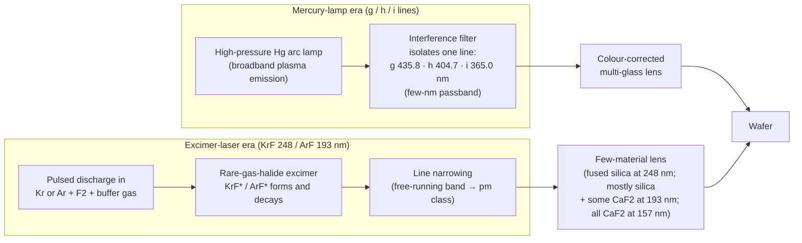

# DUV/UV Heritage Sources (Hg g/h/i lines, KrF 248 nm, ArF 193 nm)

**Status:** ✅ DUV/UV heritage sources — the NIST mercury-line wavelengths, the photon budgets and the line-shape / E95 bandwidth mathematics are exact and test-pinned; 🔶 the excimer-laser bandwidths and pulse energy × rep-rate values are representative (not vendor specifications), and mercury-lamp output power is not modeled.

## Overview

Every optical-lithography generation before EUV is a step down a wavelength
ladder, and each step changed the light source:

| Step | Wavelength | Source | Photon energy | Photons/nm² per mJ/cm² | vs 13.5 nm EUV |
|------|------------|--------|---------------|------------------------|----------------|
| g-line | 435.8328 nm | Hg arc lamp + filter | 2.845 eV | 21.94 | 32.3× |
| h-line | 404.6563 nm | Hg arc lamp + filter | 3.064 eV | 20.37 | 30.0× |
| i-line | 365.0153 nm | Hg arc lamp + filter | 3.397 eV | 18.38 | 27.0× |
| KrF | ~248.3 nm | line-narrowed excimer laser | 4.993 eV | 12.50 | 18.4× |
| ArF | 193.368 nm | line-narrowed excimer laser | 6.412 eV | 9.734 | 14.3× |
| ArF immersion | 193 nm in water (n ≈ 1.44 → ~134 nm effective) | same laser | — | — | — |
| F₂ (dropped 2003–04) | 157.63 nm | F₂ laser — see [vuv-excimer.md](./vuv-excimer.md) | 7.866 eV | 7.935 | 11.7× |
| EUV | 13.5 nm | Sn laser-produced plasma — see [lpp.md](./lpp.md) | 91.84 eV | 0.680 | 1× |

The mercury wavelengths are the NIST **air** wavelengths of the Hg I lines;
the photon columns follow from hc/λ (the last column is λ/13.5 nm, i.e. how
many more photons a given dose carries than at EUV — 14.3× for ArF, which is
one reason EUV is so much more exposed to photon shot noise).

In ASML's own summary, the g-line (436 nm) systems printed features down to
~1 µm; i-line (365 nm) systems went below 1 µm and eventually reached
~220 nm; KrF (248 nm) systems shrank features from the ~280 nm of i-line to
150 nm, and modern KrF tools reach ~80 nm; ArF (193 nm) enabled ~38 nm
features; EUV is more than 14× shorter than DUV. The planned next step to
157 nm (F₂) was dropped when Intel extended 193 nm instead (reported
23 May 2003) and TSMC cancelled its 157 nm orders and backed water
immersion (14 Oct 2003); water (n ≈ 1.44) turns 193 nm into an effective
~134 nm wavelength.

In highuvlith these sources are presets of the same `VuvSource` type as the
F₂ laser: `arf_laser`, `krf_laser`, `hg_i_line`, `hg_h_line`, `hg_g_line`.

## Generation physics



**Mercury lamps.** A high-pressure mercury arc is a plasma that emits many
lines; an interference filter selects one of them. J. H. Bruning's history of
optical lithography describes the first wafer stepper (the GCA 4800 DSW,
introduced 1978: a 10:1 Carl Zeiss lens, NA 0.28, 10 × 10 mm field) as using
"the spectrally isolated mercury g-line (436 nm) from a high-pressure mercury
lamp", and notes that "the relatively large 3 nm bandwidth of the Hg i-line
required multiple glasses to correct color aberrations" — as with earlier
g-line lenses. The lamp line is spatially incoherent and continuous-wave.

**Excimer lasers.** In a pulsed electric discharge through a rare-gas /
fluorine mixture, excited rare-gas atoms bind with fluorine into short-lived
rare-gas-halide excimers (KrF\*, ArF\*) whose ground state is repulsive or
only very weakly bound, so population inversion is automatic. The free-running laser band is far too
wide for a single-material lens; a line-narrowing module reduces it to the
pm class. Bruning: changing the source to a line-narrowed 248 nm KrF excimer
laser "eliminated the need to color correct the lens" — "the few-pm source
bandwidth allowed all elements of the lens to be made from fused silica".

**Bandwidth conventions.** Every `bandwidth_pm` in highuvlith is a **FWHM**.
Lithography-laser vendors specify **E95**, the width that holds the central
95 % of the line energy. The conversion depends on the line shape, and the
model reports it as the derived quantity `e95_bandwidth`:

```math
\frac{E_{95}}{\mathrm{FWHM}} =
\begin{cases}
1.6646 & \text{Gaussian } (\pm 1.96\,\sigma) \\
12.706 & \text{Lorentzian } (\tan(0.95\,\pi/2)) \\
4.680 & \operatorname{sinc}^2 \text{ (undulator line)}
\end{cases}
```

A pure Lorentzian has such heavy tails that its E95 is 12.7 × its FWHM, so
the heritage laser presets use a **Gaussian** line, for which a 0.2 pm FWHM
gives E95 ≈ 0.33 pm. Real line-narrowed spectra sit between the two shapes.

## Real-machine parameters and history

Verified milestones (wording hedged where the sources disagree):

| Year | Milestone | Wavelength | Reference |
|------|-----------|------------|-----------|
| 1970–71 | First excimer laser (Xe₂, e-beam-excited liquid Xe, ~172–176 nm; Lebedev Institute) | ~172 nm | Basov, Danilychev & Popov, *Sov. J. Quantum Electron.* **1**, 18 (1971) |
| 1975 | KrF first lases (5 June 1975), together with XeCl | 248 nm | Ewing & Brau, *Appl. Phys. Lett.* **27**, 350 (1975) |
| 1976 | ArF laser action reported (Sandia) | 193 nm | Hoffman, Hays & Tisone, *Appl. Phys. Lett.* **28**, 538 (1976) |
| 1978 | First wafer stepper, GCA 4800 DSW: 10:1, NA 0.28, Hg g-line | 436 nm | Bruning (2007) |
| 1982 | Excimer-laser lithography first proposed and demonstrated (XeCl 308 nm and KrF 248 nm; about 100× faster than lamp exposure) | 248 / 308 nm | Jain, Willson & Lin, *IEEE Electron Device Lett.* **3**, 53 (1982) |
| 1988 | Nikon NSR-1505EX: first KrF excimer stepper (NA 0.42, 0.5 µm; R&D use) | 248 nm | lithography-history fact-check (Nikon) |
| 1990 | Perkin-Elmer Micrascan I: the first step-and-scan system — lamp DUV, NA 0.35 | ~250 nm (lamp) | Bruning (2007) |
| 1992–93 | SVGL Micrascan II — still lamp DUV, NA 0.50 (Bruning dates it 1993; other sources June 1992) | ~250 nm (lamp) | Bruning (2007) |
| 1995 | Nikon NSR-S201A, described as the first production-worthy KrF scanner | 248 nm | lithography-history fact-check (Nikon) |
| 1996–97 | SVGL Micrascan III — SVGL's first excimer-laser tool, KrF, NA 0.6 (Bruning's table: 1997) | 248 nm | Bruning (2007) |
| 1998–99 | First ArF tools reported: ASML PAS 5500/900 (1998); Nikon NSR-S302A, Canon FPA-5000AS1 and SVGL Micrascan 193 (1999) | 193 nm | lithography-history fact-check |
| 2003 | Intel drops 157 nm (May); TSMC cancels its 157 nm orders and backs immersion (14 Oct) | 157 → 193 nm | EE Times reports (2003) |
| 2004–05 | First water-immersion ArF scanners (ASML 1250i, NA 0.85, shipped 2004; Nikon NSR-S609B, NA 1.07, 2005, the first in mass production) | 193 nm | lithography-history fact-check |

Bruning's tables give the resolution ladder in numbers. His "turning points
in reduction wafer stepper evolution" list a minimum CD of 1.5 µm at 436 nm
(1980, 10:1), 1.0 µm at 436 nm (1985, 5:1), 0.5 µm at 365 nm (1990, 4:1) and
0.25 µm at 248 nm (1993, 4:1). The Micrascan step-and-scan family went from a 250 nm
lamp at NA 0.35 (1990) and 0.50 (1993), to KrF at NA 0.60 (CD 200 nm),
ArF at NA 0.75 (2001, CD 130 nm), and F₂ at NA 0.75 (2003, CD 100 nm).

**Source parameters used by the presets** (all laser values REPRESENTATIVE):

| Preset | λ | Line shape, FWHM | E95 (derived) | Pulse energy × rep rate | Average power | Real-world context |
|--------|---|------------------|---------------|-------------------------|---------------|--------------------|
| `hg_g_line` | 435.8328 nm (NIST air) | Gaussian, 3 nm | 4.99 nm | CW | not modeled | filtered lamp line |
| `hg_h_line` | 404.6563 nm (NIST air) | Gaussian, 3 nm | 4.99 nm | CW | not modeled | filtered lamp line |
| `hg_i_line` | 365.0153 nm (NIST air) | Gaussian, 3 nm | 4.99 nm | CW | not modeled | "relatively large 3 nm bandwidth" (Bruning) |
| `krf_laser` | ~248.3 nm | Gaussian, 0.6 pm | 1.00 pm | 10 mJ × 4 kHz | 40 W | KrF lithography lasers ~30–60 W; "few-pm" bandwidth for the first line-narrowed KrF lasers |
| `arf_laser` | 193.368 nm | Gaussian, 0.2 pm | 0.33 pm | 15 mJ × 6 kHz | 90 W | ArF immersion lasers ~60–120 W (vendor specifications; 120 W reported in 2013) |

The 3 nm lamp passband is the i-line figure Bruning quotes and is applied to
all three lines as a representative value. The laser power classes come from
Cymer and Gigaphoton product specifications and from Rokitski et al.,
"High power 120W ArF immersion XLR laser system" (2013). For comparison, an
early KrF lithography laser (Cymer ELS-4000F, 1995) delivered about 6 W at
600 Hz.

## Simulation model

All five presets are constructors of [`VuvSource`](../../crates/highuvlith-core/src/source.rs)
(the struct gained **no** new fields). They serialize with the TOML/serde tag
`type = "vuv"`, next to `f2_laser` and the hypothetical `ar2_laser`:

```rust
VuvSource::hg_g_line(sigma)  // 435.8328 nm, 3 nm FWHM Gaussian, CW, 1 spectral sample
VuvSource::hg_h_line(sigma)  // 404.6563 nm
VuvSource::hg_i_line(sigma)  // 365.0153 nm
VuvSource::krf_laser(sigma)  // 248.3 nm, 0.6 pm FWHM Gaussian, 10 mJ × 4 kHz, 5 samples
VuvSource::arf_laser(sigma)  // 193.368 nm, 0.2 pm FWHM Gaussian, 15 mJ × 6 kHz, 5 samples
```

The wavelengths are public constants (`HG_G_LINE_NM`, `HG_H_LINE_NM`,
`HG_I_LINE_NM`, `KRF_WAVELENGTH_NM`, `ARF_WAVELENGTH_NM`); the free function
`e95_bandwidth_pm(shape, fwhm_pm)` implements the E95 conversion (for a
`Tabulated` spectrum it integrates the table); `line_label()` identifies a
heritage line within 0.5 nm (used in the derived-quantity notes).

- **Continuous-wave convention.** A mercury lamp is CW: the presets set
  `rep_rate_hz = 0`, and for any `VuvSource` with `rep_rate_hz ≤ 0` the trait
  methods `pulse_energy_j()` and `rep_rate_hz()` return `None`, so
  `average_power_w()` is `None` and `wafer_throughput()` returns `None` —
  lamp output power is simply not modeled (no invented wattage).
- **One spectral sample for lamps.** The lamp presets default to
  `spectral_samples = 1` (monochromatic imaging at the line centre).
  **Multi-sample lamp imaging needs a colour-corrected lens:** set
  `axial_chromatic_nm_per_pm = 0` on `ProjectionOptics` for an achromat
  (`ProjectionOptics::immersion` starts from 0; with `immersion_index = 1.0` —
  Python `OpticsConfig.immersion(numerical_aperture=..., immersion_index=1.0)`,
  TOML `[optics] immersion_index = 1.0` — that is a dry lens without the
  chromatic term). The default of `ProjectionOptics::new`, 15 nm of defocus per
  pm, is a 157 nm CaF₂ singlet figure, while lamp-era g/h/i-line lenses were
  colour-corrected multi-glass designs: sampling a 3 nm lamp band through
  15 nm/pm would add tens of micrometres of spurious defocus. The laser presets
  keep 5 samples (pm-class bands).
- **Air vs vacuum.** The Hg wavelengths are NIST air values, as is
  conventional for lamp lines; vacuum wavelengths are ~0.1 nm longer (a
  3×10⁻⁴ relative difference), immaterial for imaging and photon counting.
- **Coherence and jitter.** Lamps and excimer lasers are spatially
  incoherent/multimode: `transverse_coherence()` keeps the trait default 0 and
  the pupil fill is the conventional disk σ you pass. Excimer pulse-energy
  jitter is not modeled (`shot_to_shot_rms() = 0`).
- **Imaging.** Scalar by default (vector TE/TM imaging is available, see
  [vector-imaging.md](../vector-imaging.md)); the pm-class laser bands are
  honest for the narrow-band path (per-sample focus shift, kernels at the
  centre wavelength; Δλ/λ ≈ 10⁻⁶), and `compute_multiwavelength` gives the
  exact per-wavelength sum.

## Derived quantities

`derived_quantities()` (Python `SourceConfig.derived_quantities()` /
`derived_quantity(name)`; printed by `highuvlith simulate`) reports physics
computed from the stored fields. Informational only — the imaging pipeline
never reads these values.

| Name | Unit | Meaning | g-line | h-line | i-line | KrF | ArF |
|------|------|---------|--------|--------|--------|-----|-----|
| `photon_energy` | eV | hc/λ (note names the line) | 2.845 | 3.064 | 3.397 | 4.993 | 6.412 |
| `relative_bandwidth` | — | FWHM/λ | 6.88×10⁻³ | 7.41×10⁻³ | 8.22×10⁻³ | 2.42×10⁻⁶ | 1.03×10⁻⁶ |
| `e95_bandwidth` | pm | 95 %-energy width of the configured shape | 4 994 | 4 994 | 4 994 | 0.999 | 0.333 |
| `coherence_length` | µm | λ²/Δλ | 63.3 | 54.6 | 44.4 | 102 755 | 186 956 |
| `photons_per_mj` | photons | 1 mJ / (hc/λ) | 2.194×10¹⁵ | 2.037×10¹⁵ | 1.838×10¹⁵ | 1.250×10¹⁵ | 9.734×10¹⁴ |
| `photon_density_per_dose` | photons/nm² per mJ/cm² | incident photons per nm² at 1 mJ/cm² | 21.94 | 20.37 | 18.38 | 12.50 | 9.734 |
| `photons_vs_13nm5` | — | photons per dose relative to 13.5 nm (λ/13.5 nm) | 32.28 | 29.97 | 27.04 | 18.39 | 14.32 |
| `continuous_wave` | bool | 1 for a CW lamp (no pulse metadata) | 1 | 1 | 1 | — | — |
| `photons_per_pulse` | photons | pulse energy / photon energy | — | — | — | 1.250×10¹⁶ | 1.460×10¹⁶ |
| `average_power` | W | pulse energy × rep rate (laser output) | — | — | — | 40 | 90 |
| `photon_rate` | photons/s | average power / photon energy | — | — | — | 5.00×10¹⁹ | 8.76×10¹⁹ |

**Throughput context.** `SourceConfig.wafer_throughput(...)` is a first-order
dose-limited scanner model (🔶, illustrative assumptions). With refractive-tool
settings (`optics_transmission=0.3, mask_efficiency=0.9, slit_height_mm=8.0`)
at 30 mJ/cm²: KrF puts 10.8 W on the wafer → ~172 wafers/h with ~23 pulses per
exposure point; ArF puts 24.3 W on the wafer → ~185 wafers/h with ~15 pulses
per point. Both dose-limited scan speeds (1.4 and 3.1 m/s) exceed real stage
speeds, so the results are overhead-dominated — pass `max_scan_speed_mm_s` to
cap them. At 30 mJ/cm² a (38 nm)² square receives ~4.2×10⁵ ArF photons (0.15 %
relative shot noise). The lamp presets return `None` (no power model).

## Model coverage

| Field | Unit | Consumed by | Status |
|-------|------|-------------|--------|
| `wavelength_nm` | nm | TCC pupil scaling, photon energy/density, derived photon budget | live |
| `bandwidth_pm` | pm FWHM | polychromatic sampling range; `relative_bandwidth`, `e95_bandwidth`, `coherence_length` | live |
| `spectral_samples` | count | number of polychromatic samples (1 for the lamp presets) | live |
| `spectral_shape` | enum | line weighting (Gaussian for the heritage presets); E95 conversion | live |
| `pulse_energy_mj` | mJ | `pulse_energy_j()` → `average_power_w()` → throughput (ignored when CW) | live |
| `rep_rate_hz` | Hz | `average_power_w()`; `0` marks a CW lamp (pulse metadata `None`) | live |
| `illumination` | enum | pupil `intensity_at()` during TCC construction | live |
| — lamp output power / arc spectrum | — | not modeled (`average_power_w() = None`) | planned |
| — laser pulse-energy jitter, E95 stabilization | — | trait default 0 / not modeled | planned |
| — colour-corrected lamp-era lens model | — | engine optics (`axial_chromatic_nm_per_pm`), not the source | planned |

## Usage

Python (factories in [`py_config.rs`](../../crates/highuvlith-py/src/py_config.rs)):

<!-- verify-example -->
```python
import highuvlith as huv

arf = huv.SourceConfig.arf_laser(sigma=0.7)   # 193.368 nm, 90 W representative
krf = huv.SourceConfig.krf_laser(sigma=0.7)   # 248.3 nm, 40 W representative
i_line = huv.SourceConfig.hg_i_line(sigma=0.6)   # 365.0153 nm, CW lamp
g_line = huv.SourceConfig.hg_g_line(sigma=0.5)   # 435.8328 nm, CW lamp

print(arf.derived_quantity("e95_bandwidth"))     # 0.333 pm
print(arf.derived_quantity("photons_vs_13nm5"))  # 14.32
print(i_line.average_power_w, i_line.rep_rate_hz)   # None 0.0  (CW, not modeled)

tp = krf.wafer_throughput(dose_mj_cm2=30.0, optics_transmission=0.3,
                          mask_efficiency=0.9, slit_height_mm=8.0)
print(tp["wafers_per_hour"], tp["pulses_per_point"])   # ~172, ~23
```

??? success "Output"

    ```text
    0.33292802796984766
    14.323555555555556
    None 0.0
    172.35326034917495 23.111111111111107
    ```

TOML (field names from [`config.rs`](../../crates/highuvlith-cli/src/config.rs)):
select a preset with `preset`; explicit `wavelength_nm`, `bandwidth_pm` and
`rep_rate_hz` override it. Without `preset`, the legacy explicit-wavelength
VUV source is built (Lorentzian 1.1 pm, 10 mJ, 4 kHz), exactly as before.

```toml
[source]
type   = "vuv"     # optional: an absent type tag also means "vuv"
preset = "arf"     # f2 | ar2 | arf | krf | hg_i | hg_h | hg_g  (aliases i_line, h_line, g_line)
sigma  = 0.7
# bandwidth_pm = 0.3    # overrides the preset FWHM
```

Examples: [`sim_arf.toml`](../../examples/sim_arf.toml) (dry ArF, NA 0.93),
[`sim_krf.toml`](../../examples/sim_krf.toml) (NA 0.8),
[`sim_hg_iline.toml`](../../examples/sim_hg_iline.toml) (NA 0.6, 350 nm lines),
[`sim_hg_gline.toml`](../../examples/sim_hg_gline.toml) (NA 0.45, 700 nm lines);
`highuvlith simulate --config examples/sim_arf.toml` prints the derived
quantities above. The CLI's refractive optics accept NA ≤ 1, so the examples
are dry (non-immersion) systems.

## Validation

- `source.rs`: `test_heritage_presets_photon_budget` (photon energies and
  photons per mJ of all five presets against mpmath fixtures, NIST wavelengths,
  λ/13.5 ratio, 90 W / 40 W laser budgets, σ validation),
  `test_hg_lamps_are_cw_single_sample` (no pulse metadata, `average_power_w()`
  = `None`, one spectral sample at the line centre, `continuous_wave = 1`,
  E95 of the 3 nm Gaussian passband), `test_e95_bandwidth_conventions`
  (Gaussian 1.6646, Lorentzian 12.706, sinc² 4.680, a tabulated triangle,
  degenerate tables), `test_vuv_derived_quantities`,
  `test_every_family_reports_derived_quantities`.
- CLI `config.rs`: `test_vuv_heritage_presets` (presets, aliases, explicit
  overrides, the legacy no-preset path, unknown preset rejected, `preset` as an
  XFEL alias), `test_family_example_tomls_validate` (the four heritage
  examples parse and validate), `test_toml_back_compat_without_type_tag`.
- Python `tests/python/test_sources_physics.py::TestHeritage` (wavelengths and
  photon energies, lasers vs lamps, and a lamp imaging check: with one
  spectral sample the polychromatic image equals the monochromatic one).

## References

1. NIST, *Handbook of Basic Atomic Spectroscopic Data* — mercury (Hg I) strong
   lines, air wavelengths g 435.8328 nm, h 404.6563 nm, i 365.0153 nm:
   https://physics.nist.gov/PhysRefData/Handbook/Tables/mercurytable2.htm
2. J. H. Bruning, "Optical Lithography … 40 years and holding," *Proc. SPIE*
   **6520**, 652004 (2007).
3. ASML, "Light & lasers" (Lithography principles):
   https://www.asml.com/en/technology/lithography-principles/light-and-lasers
4. Basov, Danilychev & Popov, *Sov. J. Quantum Electron.* **1**, 18 (1971),
   doi:10.1070/QE1971v001n01ABEH003011 — the Xe₂ excimer laser.
5. Ewing & Brau, *Appl. Phys. Lett.* **27**, 350 (1975) — KrF and XeCl lasers.
6. Hoffman, Hays & Tisone, *Appl. Phys. Lett.* **28**, 538 (1976) — ArF laser.
7. Jain, Willson & Lin, *IEEE Electron Device Lett.* **3**, 53 (1982),
   doi:10.1109/EDL.1982.25476 — excimer-laser lithography.
8. Rokitski et al., "High power 120W ArF immersion XLR laser system,"
   *Proc. SPIE* **8683**, 86831H (2013), doi:10.1117/12.2012681.
9. EE Times (2003): Intel drops 157 nm tools from its lithography roadmap;
   TSMC cancels 157 nm litho orders and backs immersion.
10. Related pages: [vuv-excimer.md](./vuv-excimer.md) (F₂ 157 nm, the
    hypothetical Ar₂ 126 nm preset), [lpp.md](./lpp.md) (13.5 nm EUV),
    [index.md](./index.md) (trait contract).
