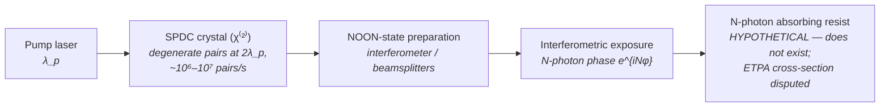

# Entangled-Photon (NOON-State) Source

**Status:** 🧪 Theoretical — runnable end to end, but the pipeline images this source *classically*; the explicit opt-in quantum module (`crate::quantum`) keeps classical N-photon absorption $I^N$ (sharpening at the classical period) apart from an *idealized* N00N model (analytic two-beam fringes at λ/(2N sin θ) and λ/N ideal-limit images) that presumes state preparation and resist chemistry nobody has demonstrated; no entangled sub-Rayleigh pattern has ever been recorded in a material; with the entangled two-photon-absorption cross-section at its independent upper bounds (10⁻²³–10⁻²⁵ cm²) clearing 1 cm² at the default 10⁶ pairs/s takes at least 10¹⁶ s (~3×10⁸ years) — still ~10¹⁰ s (~300 years) with the most optimistic, disputed early claim — and pairs stop acting entangled above ~10¹³ photons/s, ~6 orders of magnitude (in power) below what an HVM scanner delivers to the wafer.

## Overview

An N-photon path-entangled NOON state, $(\lvert N,0\rangle + \lvert 0,N\rangle)/\sqrt{2}$, accumulates interferometric phase N times faster than classical light: the N-photon amplitude acquires $e^{iN\varphi}$ where a single photon acquires $e^{i\varphi}$. An interferometric exposure with such a state therefore writes fringes at an effective wavelength $\lambda/N$, beating the classical resolution limit by a factor of N without shortening the physical wavelength (Boto et al., *PRL* **85**, 2733 (2000)). The lithographic temptation is obvious: N = 2 at 157.63 nm would print like 78.8 nm light through F₂-laser-compatible optics.

The reasons this is tagged 🧪 and not 🔶 are physical, not implementational, and the model now quantifies them:

1. **It has never been recorded in a material.** Every entangled sub-Rayleigh demonstration used coincidence detection, not a recording medium (D'Angelo et al. 2001; Kawabe et al. 2007, "Quantum interference fringes beating the diffraction limit"; Rosen et al. 2012; Rozema et al. 2014). The only material-recorded sub-Rayleigh fringes used *classical* light in PMMA (Chang et al. 2006). A 2012 assessment by Boyd & Dowling (*Quantum Inf. Process.*) found "no compelling laboratory demonstrations".
2. Recording the $\lambda/N$ fringe requires a resist that absorbs N photons *coherently as one event* — no such resist chemistry exists at lithographic wavelengths.
3. The entangled two-photon absorption (ETPA) cross-section is tiny and **disputed**. Early reports claimed 10⁻¹⁷–10⁻²¹ cm²; independent measurements found only upper bounds of 10⁻²³–10⁻²⁵ cm² (Parzuchowski et al. 2021 and 2025; He et al. 2024), alongside null results and artifact explanations (Landes et al. 2021/2024; Mikhaylov et al. 2022 — hot-band absorption; Corona-Aquino et al. 2022 — linear losses; Hickam et al. 2022 — scattering), while positive claims persist from some groups. The model's **default** scenario is therefore the bound range; the claims are reported as an **optimistic** scenario. At the SPDC-class 10⁶ pairs/s, clearing 1 cm² takes at least 10¹⁶ s (~3×10⁸ years) at the bound, and 10¹⁰–10¹⁴ s even with the claims (see [Exposure time](#exposure-time-from-the-pair-rate-derived)).
4. **Flux ceiling.** Photon pairs only behave as isolated, entangled pairs while there is less than about one photon per spectral mode. The crossover flux is roughly the down-converted bandwidth in Hz, $\Phi_{\max} \approx \Delta\nu$ (Dayan et al., *PRL* **94**, 043602 (2005), Eq. (1)). Their broadband source (31 nm at 1064 nm) ran at ~10¹² pairs/s (0.3 µW) against a crossover of 8.2 × 10¹² photons/s (≈ 1.5 µW); the model uses 10¹³ photons/s as the order of magnitude (the crossover scales with bandwidth). An NXE:3400C at 170 wafers/hour and 20 mJ/cm² delivers ≈ 0.67 W to the wafer (derived) — roughly six orders of magnitude more power.
5. The photon budget is ~9–13 orders of magnitude short even before absorption: a classical 30 mJ/cm² dose at 157.63 nm is 2.4×10¹⁶ photons/cm², and a 40 W F₂ lithography laser emits 3.2×10¹⁹ photons/s, against 10⁶–10⁷ entangled pairs/s from SPDC sources.
6. Generating entangled pairs *at* 157 nm would need a transparent χ⁽²⁾ medium pumped near 79 nm, which does not exist.

`EntangledPhotonSource` in [source_models/entangled.rs](../../crates/highuvlith-core/src/source_models/entangled.rs) is the illumination-side bridge to the quantum research module ([quantum.rs](../../crates/highuvlith-core/src/quantum.rs)); the two are kept honest by construction, as described below.

## Generation physics



Phase super-resolution: for a NOON state traversing an interferometer with phase $\varphi$,

```math
\lvert\psi\rangle = \frac{\lvert N,0\rangle + \lvert 0,N\rangle}{\sqrt{2}}
\;\longrightarrow\;
p(\varphi) \propto 1 + \cos(N\varphi)
```

so the fringe period — and, in Boto et al.'s ideal limit, the printable pitch — shrinks by N:

```math
\lambda_\text{eff} = \frac{\lambda}{N}, \qquad
R_\text{quantum} = \frac{0.61\,\lambda}{N\,\mathrm{NA}} \quad \text{vs.} \quad R_\text{classical} = \frac{0.61\,\lambda}{\mathrm{NA}}
```

These are the figures of the ideal limit. The [quantum module](../research-modules.md) keeps two physically different N-photon exposures apart:

- **Classical N-photon absorption** of the classical aerial image, $E = I^N$ (`n_photon_absorption_image`). It sharpens lines and raises contrast but keeps the classical period: it cannot print a pitch the optics does not transmit.
- **Ideal N00N absorption.** `TwoBeamNPhoton` gives the two-beam N00N fringe $1 + \cos(N(Kx + \phi))$, period $\lambda/(2N\sin\theta)$, in closed form. For general masks `noon_ideal_image` images the same system at $\lambda/N$ with the same NA and pupil fill, a clearly labelled idealization.

Imperfect entanglement is a fidelity $F$, the share of the exposure from the ideal N00N component. The remainder is classical N-photon absorption (the fringe $E_\mathrm{cl} \propto (1 + \cos(Kx + \phi))^N$ for two beams, $I_\lambda^N$ for general masks), not linear absorption:

```math
E = F\,E_\mathrm{NOON} + (1 - F)\,E_\mathrm{cl} \quad \text{(two beams)}, \qquad
E = F\,I_{\lambda/N} + (1 - F)\,I_\lambda^{\,N} \quad \text{(general masks)}
```

The flux side (`FluxBudget`) is derived from this source's constants, with no free efficiency. At the entangled-regime ceiling of about 10¹³ photons/s the relative flux is ≈ 1.9 × 10⁻⁵ of the HVM wafer photon rate at 157.63 nm. With the ETPA cross-section at its loosest independent bound (10⁻²³ cm²), the N = 2 exposure takes at least 4.5 × 10¹⁰ times longer than a classical 30 mJ/cm² exposure at HVM wafer power. That is 4.5 × 10¹² at the tightest bound and still 4.5 × 10⁴ with the disputed 10⁻¹⁷ cm² claim. The ratio grows linearly with N.

### Exposure time from the pair rate (derived)

Entangled two-photon absorption is linear in the pair flux $\Phi$ (pairs cm⁻² s⁻¹): each resist molecule reacts at the rate $R = \sigma_E \Phi$. If a fraction $p_\text{clear}$ of the molecules must react to clear the resist, the required pair fluence and the exposure time for an area $A$ at a pair rate $R_\text{pairs}$ are

```math
F_\text{clear} = \frac{p_\text{clear}}{\sigma_E}, \qquad
t = \frac{F_\text{clear}\,A}{R_\text{pairs}}
```

The model uses $p_\text{clear} = 0.1$ (an optimistic, chemically-amplified-like ASSUMPTION) and a 1 cm² reference area. The **default** scenario is the range of independent upper bounds; the disputed early claims form the **optimistic** scenario:

| Scenario | ETPA cross-section $\sigma_E$ | Pair fluence to clear | Time for 1 cm² at 10⁶ pairs/s | at 10⁹ pairs/s |
|---|---|---|---|---|
| **DEFAULT** — loosest independent upper bound | 10⁻²³ cm² | ≥ 10²² pairs/cm² | ≥ 10¹⁶ s ≈ 3×10⁸ years | ≥ 10¹³ s ≈ 3×10⁵ years |
| DEFAULT — tightest independent upper bound | 10⁻²⁵ cm² | ≥ 10²⁴ pairs/cm² | ≥ 10¹⁸ s ≈ 3×10¹⁰ years (longer than the age of the universe) | ≥ 10¹⁵ s ≈ 3×10⁷ years |
| OPTIMISTIC — largest disputed early claim | 10⁻¹⁷ cm² | 10¹⁶ pairs/cm² | 10¹⁰ s ≈ 320 years | 10⁷ s ≈ 116 days |
| OPTIMISTIC — smallest early claim | 10⁻²¹ cm² | 10²⁰ pairs/cm² | 10¹⁴ s ≈ 3×10⁶ years | 10¹¹ s ≈ 3,200 years |

Because the bounds are *upper* bounds on $\sigma_E$, the default-scenario fluences and exposure times are **lower bounds** — the true values may be far larger. Even the most optimistic claim needs 10¹⁶ pairs/cm², comparable to the 2.4×10¹⁶ photons/cm² of a classical 30 mJ/cm² exposure at 157.63 nm, delivered from a source ~10¹⁰× dimmer. The cross-section data come from visible/near-IR experiments on dyes — nothing exists at 157 nm — and there are no data at all for N ≥ 3: the model uses the N = 2 numbers as optimistic stand-ins and says so in each note.

## Real-machine parameters

There is no entangled-photon lithography machine. The table contrasts demonstrated quantum-optics hardware with what lithography would require.

| Quantity | Demonstrated | Required for lithography | Citation / source |
|---|---|---|---|
| Wavelength | visible/NIR SPDC (BBO, KTP, ppKTP) | 157 nm / 13.5 nm photons | [1,2] |
| N | 2 (routine), 3–5 (heroic) | ≥ 2 | [2,3] |
| Pair / N-tuple rate | ~10⁶–10⁷ s⁻¹ | a classical 30 mJ/cm² dose is 2.4×10¹⁶ photons/cm²; a 40 W F₂ laser emits 3.2×10¹⁹ photons/s — ~10⁹–10¹³ short | derived (`classical_photons_30mj`, F₂ `photon_rate`) |
| ETPA cross-section | disputed: early claims 10⁻¹⁷–10⁻²¹ cm²; independent upper bounds 10⁻²³–10⁻²⁵ cm² plus several null results (dyes, visible/NIR) | clearing 1 cm² in 1 s at 10⁶ pairs/s needs σ_E ≈ p_clear / (10⁶ pairs/cm²) = 10⁻⁷ cm² — ≥ 10¹⁰× the largest claim, ≥ 10¹⁶× the bound | Parzuchowski et al. 2021, 2025; He et al. 2024 (bounds); see text |
| Entangled-regime flux | pairs stay entangled below about one photon per spectral mode (crossover ≈ Δν): 8.2 × 10¹² photons/s (≈ 1.5 µW) for a 31 nm band at 1064 nm, ~10¹² pairs/s (0.3 µW) generated | an NXE:3400C delivers ≈ 0.67 W to the wafer (derived) — ~6 orders of magnitude more | Dayan et al., *PRL* **94**, 043602 (2005), Eq. (1) |
| Fringe-doubling proof | coincidence-detected 2-photon fringes at λ/2 (D'Angelo 2001; Kawabe 2007; Rosen 2012; Rozema 2014) | direct resist recording — **never achieved** with entangled light (material-recorded sub-Rayleigh fringes used classical light in PMMA, Chang 2006) | D'Angelo et al., *PRL* **87**, 013602 (2001) |
| N-photon resist | none (coherent-N-photon, entangled regime) | essential | [1] |

## Simulation model

`EntangledPhotonSource` implements `LithographySource` with a deliberate honesty split:

- **The trait reports the PHYSICAL wavelength.** `wavelength_nm()` returns e.g. 157.63, never λ/N — so the Hopkins TCC/SOCS pipeline, thin-film stack, and resist models all see ordinary classical light. Nothing quantum happens implicitly anywhere in the pipeline.
- **N-photon models are explicit.** `quantum_params(na)` packages `{num_entangled_photons, wavelength_nm, na, fidelity}` into a `QuantumLithographyParams` for the quantum module. `n_photon_absorption_image` (and its deprecated alias `compute_quantum_aerial_image`, which ignores `fidelity`) returns $I^N$ of a *classical* aerial image: sharper, at the classical fringe period. The ideal N00N models are separate calls: `TwoBeamNPhoton` (fringes at λ/(2N sin θ)) and `noon_ideal_image` (the λ/N ideal limit for general masks). `effective_wavelength_nm()` (λ/N) and `quantum_resolution_nm()` (0.61λ/(N·NA)) are reference figures for that ideal limit, not properties of the $I^N$ image. `relative_flux()` and `exposure_time_ratio()` come from the derived `FluxBudget`.
- **Exposure-time estimates (new).** `derived_quantities()` turns `pair_rate_hz` into the ETPA clearing fluence and exposure time for the DEFAULT bound scenario (10⁻²³ and 10⁻²⁵ cm²) and the OPTIMISTIC claims scenario (10⁻¹⁷ and 10⁻²¹ cm²); `clearing_time_s(sigma_cm2, area_cm2)` exposes the formula directly, and the constants `ETPA_CROSS_SECTION_UPPER_BOUND_CM2`, `ETPA_CROSS_SECTION_TIGHTEST_BOUND_CM2`, `ETPA_CROSS_SECTION_CLAIMED_MAX_CM2`, `ETPA_CROSS_SECTION_CLAIMED_MIN_CM2` name the scenarios. It also reports the entangled-regime flux ceiling (10¹³ photons/s) against the HVM wafer photon rate (0.67 W at the physical wavelength) and the classical photon count for comparison. These are informational: nothing in the imaging pipeline reads them. The quantum module's `FluxBudget` uses the same constants (flux ceiling, cross-sections, HVM wafer power) but not the pair rate.
- **Constructor validation** — `noon(wavelength_nm, n, fidelity)` rejects non-positive wavelengths, N < 2 (N = 1 is classical light), and fidelity outside [0, 1]; the Python/CLI layers reject negative pair rates.
- **Spectrum / pupil** — narrow Gaussian line (default bandwidth λ × 10⁻³ pm, i.e. Δλ/λ = 10⁻⁶; 3 spectral samples); interferometric setups are fully coherent, so `transverse_coherence()` = 1.0 and the pupil is `CoherentGaussian { sigma: 0.05 }`.
- **What is NOT modeled** — the stochastic module does not model N-photon absorption statistics (its Poisson counting assumes one-photon events); `average_power_w()` stays `None` (there is no meaningful exposure power, so `wafer_throughput()` returns `None` — the `photon_power` derived quantity reports the optical power in the entangled beam instead); SPDC generation physics, NOON-state preparation losses, and the pump chain are absent.

## Derived quantities

`derived_quantities()` (Python: `derived_quantities()` / `derived_quantity(name)`; CLI: printed by `highuvlith simulate`) for the default `noon(157.63, 2, 1.0)` source at 10⁶ pairs/s:

| Name | Value | Unit | Meaning |
|---|---|---|---|
| `effective_wavelength` | 78.8 | nm | λ/N |
| `photon_power` | 2.52×10⁻¹² | W | pair rate × N × photon energy |
| `clearing_fluence_bound` | 1×10²² | pairs/cm² | $p_\text{clear}/\sigma_E$ at the 10⁻²³ cm² upper bound (DEFAULT) — a lower bound on the fluence |
| `exposure_time_bound` | 1×10¹⁶ | s | DEFAULT: time to clear 1 cm² at the stored pair rate, $\sigma_E$ = 10⁻²³ cm² — a lower bound on the time |
| `exposure_time_bound_tight` | 1×10¹⁸ | s | same with the tightest bound, 10⁻²⁵ cm² |
| `clearing_fluence_claims_optimistic` | 1×10¹⁶ | pairs/cm² | OPTIMISTIC: fluence with the largest disputed claim, 10⁻¹⁷ cm² |
| `exposure_time_claims_optimistic` | 1×10¹⁰ | s | OPTIMISTIC: time to clear 1 cm² with 10⁻¹⁷ cm² |
| `exposure_time_claims_pessimistic` | 1×10¹⁴ | s | optimistic-scenario range, smallest claim 10⁻²¹ cm² |
| `pair_rate_for_1s_bound` | 1×10²² | pairs/s | pair rate needed to clear 1 cm² in 1 s at the upper-bound $\sigma_E$ |
| `entangled_flux_ceiling` | 1×10¹³ | photons/s | order of the entangled-regime crossover (one photon per spectral mode, ≈ Δν; 8.2 × 10¹² photons/s for a 31 nm band, Dayan et al. 2005); scales with bandwidth |
| `hvm_wafer_photon_rate` | 5.32×10¹⁷ | photons/s | 0.67 W (NXE:3400C at the wafer, derived) at the physical wavelength |
| `hvm_rate_over_flux_ceiling` | 5.32×10⁴ | – | HVM wafer photon rate / entangled-regime ceiling (at 157.63 nm; ~6 orders in power against the ~µW ceiling) |
| `classical_photons_30mj` | 2.38×10¹⁶ | photons/cm² | photons in a classical 30 mJ/cm² dose at the physical wavelength |
| `classical_rate_gap` | 2.38×10¹⁰ | – | classical photons for 30 mJ/cm² per cm² per second / pair rate |

For N ≥ 3 the fluence notes carry the caveat that no N ≥ 3 data exist and the N = 2 cross-sections are used as optimistic stand-ins.

## Model coverage

| Field | Unit | Consumed by | Status |
|---|---|---|---|
| `wavelength_nm` | nm | classical imaging (physical λ); `quantum_params()`; photon energy in the derived quantities | live |
| `num_entangled_photons` | count | quantum module only (N-photon absorption, N00N models, flux budget), via explicit `quantum_params()` — never the classical pipeline; λ/N and the N ≥ 3 caveat in the derived quantities | live |
| `fidelity` | [0, 1] | quantum module's N00N fidelity mixture (the non-N00N share is classical N-photon absorption), via `quantum_params()`; ignored by the $I^N$ alias | live |
| `pair_rate_hz` | Hz | derived exposure-time / fluence estimates (`derived_quantities()`, `clearing_time_s`); NOT the quantum module's flux budget (set by the entangled-regime ceiling) | live (derived quantities) |
| `bandwidth_pm` | pm | `spectral_weights()` | live |
| `spectral_samples` | count | spectral sampling density | live |
| `illumination` | enum | `intensity_at()` pupil fill | live |
| N-photon absorption statistics in the stochastic module | — | — | planned |

## Usage

Python — the two-step (classical image, then explicit quantum post-step) mirrors the physics honestly. Factories from [py_config.rs](../../crates/highuvlith-py/src/py_config.rs); the post-step is `highuvlith.quantum_aerial_image` from [py_volumetric.rs](../../crates/highuvlith-py/src/py_volumetric.rs):

<!-- verify-example -->
```python
import numpy as np
import highuvlith as huv

src = huv.SourceConfig.entangled_noon(wavelength_nm=157.63, n=2, fidelity=0.9,
                                      pair_rate_hz=1e6)
print(src.derived_quantity("exposure_time_bound"))              # 1e16 s: DEFAULT, a lower bound
print(src.derived_quantity("exposure_time_bound_tight"))        # 1e18 s
print(src.derived_quantity("exposure_time_claims_optimistic"))  # 1e10 s (~320 years for 1 cm^2)
print(src.derived_quantity("hvm_rate_over_flux_ceiling"))       # ~5.3e4

optics = huv.OpticsConfig(numerical_aperture=0.75)
mask = huv.MaskConfig.line_space(cd_nm=90.0, pitch_nm=180.0)
grid = mask.commensurate_grid(size=256, target_pixel_nm=1.0)  # whole periods in the field

engine = huv.SimulationEngine(src, optics, mask, grid=grid)
aerial = engine.compute_aerial_image()            # classical, at 157.63 nm

quantum = huv.quantum_aerial_image(               # explicit opt-in: classical I^N (fidelity ignored)
    np.asarray(aerial.intensity),
    n=2, wavelength_nm=157.63, na=0.75, fidelity=0.9,
)
```

??? success "Output"

    ```text
    1e+16
    1e+18
    10000000000.0
    53166.36456413904
    ```

TOML (field names from [config.rs](../../crates/highuvlith-cli/src/config.rs)). Note the CLI runs the **classical** simulation only — there is no quantum post-step in `highuvlith simulate` — but it prints the derived exposure-time estimates:

```toml
[source]
type = "entangled"
wavelength_nm = 157.63
num_photons = 2
fidelity = 1.0
pair_rate_hz = 1.0e6     # SPDC-class N-tuple rate -> derived exposure-time estimates
```

See `examples/sim_entangled.toml`.

## Validation

Rust unit tests in [entangled.rs](../../crates/highuvlith-core/src/source_models/entangled.rs):

- `test_n2_halves_effective_wavelength` — λ_eff = λ/2 while the trait still reports the physical λ.
- `test_quantum_params_round_trip` — `quantum_params(na)` carries N, λ, NA, fidelity intact into the quantum module.
- `test_invalid_parameters_rejected` — λ ≤ 0, N = 1, fidelity ∉ [0, 1] rejected.
- `test_exposure_time_range` — DEFAULT bound scenario 10²² pairs/cm², ≥ 10¹⁶ s (10⁻²³ cm²) and 10¹⁸ s (10⁻²⁵ cm²); OPTIMISTIC claims 10¹⁰ s (10⁻¹⁷ cm²) and 10¹⁴ s (10⁻²¹ cm²); inverse scaling with the pair rate (10⁹ pairs/s → 10¹³ s at the bound); 2.38×10¹⁶ classical photons/cm² at 157.63 nm (scipy fixture); the HVM wafer photon rate at 157.63 nm and its > 10⁴ ratio to the flux ceiling; zero pair rate → infinite time without NaN.
- `test_weights_sum_to_one`, `test_fully_coherent` — spectral normalization; coherence = 1.

And in [quantum.rs](../../crates/highuvlith-core/src/quantum.rs), pinning the sharpening physics itself:

- `test_quantum_sharpening` — classical N-photon absorption $I^N$ raises image contrast over classical.
- `test_alias_is_classical_n_photon_absorption_for_any_fidelity` — `compute_quantum_aerial_image` equals $I^N$ for F = 0, 0.5 and 1 (0.5 → 0.25 for N = 2).
- `test_two_beam_noon_peaks_at_n_k_classical_keeps_k` — the N00N fringe spectrum peaks at N·K (N = 2–4); classical N-photon absorption keeps its fundamental at K.
- `test_noon_limit_resolves_what_n_photon_absorption_cannot` — 100 nm pitch at 157.63 nm, NA 0.75, σ 0.5: classical and $I^2$ contrast 0, ideal λ/2 limit 0.73.
- `test_flux_budget_tied_to_entangled_source_constants` — relative flux 1.88 × 10⁻⁵; exposure-time ratio 4.47 × 10¹⁰ (bound), 4.47 × 10¹² (tightest bound), 4.47 × 10⁴ (claim) at N = 2.
- `test_quantum_resolution_better` — the reference figure 0.61λ/(N·NA) is exactly classical/N.

CLI ([config.rs](../../crates/highuvlith-cli/src/config.rs)): `test_ics_ssmb_entangled_machine_fields` (`pair_rate_hz = 1e9` → `exposure_time_bound` = 10¹³ s; a negative rate is rejected), `test_family_example_tomls_validate`.

Python: `tests/python/test_sources_physics.py::TestEntangled`, `tests/python/test_sources.py::TestEntangledSource`, and the end-to-end classical imaging smoke test at NA 0.75.

## References

1. A. N. Boto, P. Kok, D. S. Abrams, S. L. Braunstein, C. P. Williams, and J. P. Dowling, "Quantum interferometric optical lithography: exploiting entanglement to beat the diffraction limit," *Phys. Rev. Lett.* **85**, 2733 (2000).
2. M. D'Angelo, M. V. Chekhova, and Y. Shih, "Two-photon diffraction and quantum lithography," *Phys. Rev. Lett.* **87**, 013602 (2001).
3. V. Giovannetti, S. Lloyd, and L. Maccone, "Quantum-enhanced measurements: beating the standard quantum limit," *Science* **306**, 1330 (2004).
4. B. Dayan, A. Pe'er, A. A. Friesem, Y. Silberberg, "Nonlinear interactions with an ultrahigh flux of broadband entangled photons," *Phys. Rev. Lett.* **94**, 043602 (2005), arXiv:quant-ph/0411023 — Eq. (1): crossover flux ≈ down-converted bandwidth (one photon per spectral mode); ~10¹² entangled pairs/s (0.3 µW) generated; crossover 8.2 × 10¹² photons/s (≈ 1.5 µW) for 31 nm at 1064 nm. (Earlier versions cited the same authors' *PRL* **93**, 023005 (2004), a high-power two-photon-absorption experiment that does not give this number.)
5. Boyd & Dowling, *Quantum Inf. Process.* (2012) — review of quantum lithography ("no compelling laboratory demonstrations").
6. Coincidence-detected sub-Rayleigh demonstrations (no material recording): D'Angelo et al. 2001 [2]; Kawabe et al. 2007, "Quantum interference fringes beating the diffraction limit"; Rosen et al. 2012; Rozema et al. 2014. Classical-light sub-Rayleigh fringes recorded in PMMA: Chang et al. 2006.
7. ETPA cross-section literature: independent upper bounds — Parzuchowski et al. 2021 and 2025; He et al. 2024. Null results / artifact explanations — Landes et al. 2021 and 2024; Mikhaylov et al. 2022 (hot-band absorption); Corona-Aquino et al. 2022 (linear losses); Hickam et al. 2022 (scattering). Early claims of 10⁻¹⁷–10⁻²¹ cm² came from several groups; positive claims persist.
8. Status taxonomy: [../capability-matrix.md](../capability-matrix.md); quantum research module row therein. Classical-source baseline at the same wavelength: F₂ excimer `VuvSource` (see [vuv-excimer.md](./vuv-excimer.md)).
