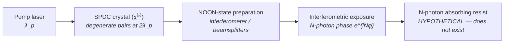

# Entangled-Photon (NOON-State) Source

**Status:** 🧪 Theoretical — runnable end to end, but the pipeline images this source *classically* at its physical wavelength; the λ/N quantum sharpening is an explicit opt-in post-step through `crate::quantum`, and no practical implementation path exists (no N-photon resist at lithographic wavelengths, SPDC flux ~12 orders of magnitude short of dose requirements).

## Overview

An N-photon path-entangled NOON state, $(\lvert N,0\rangle + \lvert 0,N\rangle)/\sqrt{2}$, accumulates interferometric phase N times faster than classical light: the N-photon amplitude acquires $e^{iN\varphi}$ where a single photon acquires $e^{i\varphi}$. An interferometric exposure with such a state therefore writes fringes at an effective wavelength $\lambda/N$, beating the classical resolution limit by a factor of N without shortening the physical wavelength (Boto et al., *PRL* **85**, 2733 (2000)). The lithographic temptation is obvious: N = 2 at 157.63 nm would print like 78.8 nm light through F₂-laser-compatible optics.

The reasons this is tagged 🧪 and not 🔶 are physical, not implementational: (1) recording the $\lambda/N$ fringe requires a resist that absorbs N photons *coherently as one event* — no such resist chemistry exists at lithographic wavelengths; (2) SPDC entangled-pair sources deliver ~10⁶–10⁷ N-tuples/s, roughly twelve orders of magnitude below the photon currents lithographic doses demand; (3) generating entangled pairs *at* 157 nm would need a transparent χ⁽²⁾ medium pumped near 79 nm, which does not exist.

`EntangledPhotonSource` in [source_models/entangled.rs](../../crates/highuvlith-core/src/source_models/entangled.rs) is the illumination-side bridge to the quantum research module ([quantum.rs](../../crates/highuvlith-core/src/quantum.rs)); the two are kept honest by construction, as described below.

## Generation physics



Phase super-resolution: for a NOON state traversing an interferometer with phase $\varphi$,

$$
\lvert\psi\rangle = \frac{\lvert N,0\rangle + \lvert 0,N\rangle}{\sqrt{2}}
\;\longrightarrow\;
p(\varphi) \propto 1 + \cos(N\varphi)
$$

so the fringe period — and the printable pitch — shrinks by N:

$$
\lambda_\text{eff} = \frac{\lambda}{N}, \qquad
R_\text{quantum} = \frac{0.61\,\lambda}{N\,\mathrm{NA}} \quad \text{vs.} \quad R_\text{classical} = \frac{0.61\,\lambda}{\mathrm{NA}}
$$

The quantum module models the recording side as coherent N-photon absorption with imperfect entanglement fidelity $F$:

$$
E_N(x,y) = F\,I(x,y)^N + (1-F)\,I(x,y)
$$

and the flux side as a generation-efficiency penalty $\eta^{\,N-1}$ (with $\eta = 0.01$ fixed in `quantum.rs`), giving an exposure-time ratio $1/\eta^{\,N-1}$ — a factor of 100 for biphotons, 10⁴ for N = 3, before even counting the absorption cross-section.

## Real-machine parameters

There is no entangled-photon lithography machine. The table contrasts demonstrated quantum-optics hardware with what lithography would require.

| Quantity | Demonstrated | Required for lithography | Citation |
|---|---|---|---|
| Wavelength | visible/NIR SPDC (BBO, KTP, ppKTP) | 157 nm / 13.5 nm photons | [1,2] |
| N | 2 (routine), 3–5 (heroic) | ≥ 2 | [2,3] |
| Pair/N-tuple rate | ~10⁶–10⁷ s⁻¹ | ~10¹⁸–10¹⁹ photons·cm⁻²·s⁻¹ for min-scale doses (~12 orders short) | [1,3] |
| Fringe-doubling proof | coincidence-detected 2-photon fringes at λ/2 | direct resist recording | D'Angelo et al., *PRL* **87**, 013602 (2001) |
| N-photon resist | none (coherent-N-photon, entangled regime) | essential | [1] |

## Simulation model

`EntangledPhotonSource` implements `LithographySource` with a deliberate honesty split:

- **The trait reports the PHYSICAL wavelength.** `wavelength_nm()` returns e.g. 157.63, never λ/N — so the Hopkins TCC/SOCS pipeline, thin-film stack, and resist models all see ordinary classical light. Nothing quantum happens implicitly anywhere in the pipeline.
- **Quantum sharpening is explicit.** `quantum_params(na)` packages `{num_entangled_photons, wavelength_nm, na, fidelity}` into a `QuantumLithographyParams`, which `quantum::compute_quantum_aerial_image` applies to a *classical* aerial image: per-pixel $F\,I^N + (1-F)\,I$ mixing (I is normalized intensity, so $I^N$ sharpens bright/dark contrast), plus the derived quantities `effective_wavelength_nm()` (λ/N), `quantum_resolution_nm()` (0.61λ/(N·NA)), `relative_flux()` ($\eta^{N-1}$), and `exposure_time_ratio()`.
- **Constructor validation** — `noon(wavelength_nm, n, fidelity)` rejects non-positive wavelengths, N < 2 (N = 1 is classical light), and fidelity outside [0, 1].
- **Spectrum / pupil** — narrow Gaussian line (default bandwidth λ × 10⁻³ pm, i.e. Δλ/λ = 10⁻⁶; 3 spectral samples); interferometric setups are fully coherent, so `transverse_coherence()` = 1.0 and the pupil is `CoherentGaussian { sigma: 0.05 }`.
- **What is NOT modeled** — the stochastic module does not model N-photon absorption statistics (its Poisson counting assumes one-photon events); `pair_rate_hz` is documentary and does not enter the flux penalty (which uses the fixed η in `quantum.rs`); SPDC generation physics, NOON-state preparation losses, and the pump chain are absent.

## Model coverage

| Field | Unit | Consumed by | Status |
|---|---|---|---|
| `wavelength_nm` | nm | classical imaging (physical λ); `quantum_params()` | live |
| `num_entangled_photons` | count | quantum module only, via explicit `quantum_params()` — never the classical pipeline | live |
| `fidelity` | [0, 1] | quantum module's $F\,I^N + (1-F)\,I$ mixing, via `quantum_params()` | live |
| `pair_rate_hz` | Hz | nothing — flux penalty uses fixed η = 0.01 in `quantum.rs` | stored (inert) |
| `bandwidth_pm` | pm | `spectral_weights()` | live |
| `spectral_samples` | count | spectral sampling density | live |
| `illumination` | enum | `intensity_at()` pupil fill | live |

## Usage

Python — the two-step (classical image, then explicit quantum post-step) mirrors the physics honestly. Factories from [py_config.rs](../../crates/highuvlith-py/src/py_config.rs); the post-step is `highuvlith.quantum_aerial_image` from [py_volumetric.rs](../../crates/highuvlith-py/src/py_volumetric.rs):

```python
import numpy as np
import highuvlith as huv

src = huv.SourceConfig.entangled_noon(wavelength_nm=157.63, n=2, fidelity=0.9)
optics = huv.OpticsConfig(numerical_aperture=0.75)
mask = huv.MaskConfig.line_space(cd_nm=90.0, pitch_nm=180.0)
grid = huv.GridConfig(size=256, pixel_nm=1.0)

engine = huv.SimulationEngine(src, optics, mask, grid=grid)
aerial = engine.compute_aerial_image()            # classical, at 157.63 nm

quantum = huv.quantum_aerial_image(               # explicit opt-in sharpening
    np.asarray(aerial.intensity),
    n=2, wavelength_nm=157.63, na=0.75, fidelity=0.9,
)
```

TOML (field names from [config.rs](../../crates/highuvlith-cli/src/config.rs)). Note the CLI runs the **classical** simulation only; there is no quantum post-step in `highuvlith simulate`:

```toml
[source]
type = "entangled"
wavelength_nm = 157.63
num_photons = 2
fidelity = 1.0
```

## Validation

Rust unit tests in [entangled.rs](../../crates/highuvlith-core/src/source_models/entangled.rs):

- `test_n2_halves_effective_wavelength` — λ_eff = λ/2 while the trait still reports the physical λ.
- `test_quantum_params_round_trip` — `quantum_params(na)` carries N, λ, NA, fidelity intact into the quantum module.
- `test_invalid_parameters_rejected` — λ ≤ 0, N = 1, fidelity ∉ [0, 1] rejected.
- `test_weights_sum_to_one`, `test_fully_coherent` — spectral normalization; coherence = 1.

And in [quantum.rs](../../crates/highuvlith-core/src/quantum.rs), pinning the sharpening physics itself:

- `test_quantum_sharpening` — I^N raises image contrast over classical.
- `test_fidelity_interpolation` — F = 0 reproduces the classical image exactly; F = 1 gives I^N (0.5 → 0.25 for N = 2).
- `test_quantum_resolution_better` — 0.61λ/(N·NA) is exactly classical/N.
- `test_exposure_time_very_long` — the η^(N−1) penalty exceeds 10× already for biphotons.

Python: `tests/python/test_sources.py::TestEntangledSource` and the end-to-end classical imaging smoke test at NA 0.75.

## References

1. A. N. Boto, P. Kok, D. S. Abrams, S. L. Braunstein, C. P. Williams, and J. P. Dowling, "Quantum interferometric optical lithography: exploiting entanglement to beat the diffraction limit," *Phys. Rev. Lett.* **85**, 2733 (2000).
2. M. D'Angelo, M. V. Chekhova, and Y. Shih, "Two-photon diffraction and quantum lithography," *Phys. Rev. Lett.* **87**, 013602 (2001).
3. V. Giovannetti, S. Lloyd, and L. Maccone, "Quantum-enhanced measurements: beating the standard quantum limit," *Science* **306**, 1330 (2004).
4. Status taxonomy: [../capability-matrix.md](../capability-matrix.md); quantum research module row therein. Classical-source baseline at the same wavelength: F₂ excimer `VuvSource` (see `../../crates/highuvlith-core/src/source.rs`).
