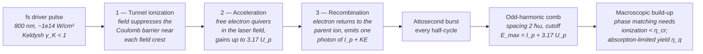

# High-Harmonic Generation (HHG)

**Status:** ✅ Implemented — comb spacing, the cutoff law and cutoff-violation rejection, the Keldysh parameter and the phase-matching critical ionization are textbook-exact and live; 🔶 Simplified for the order-of-magnitude conversion-efficiency estimate (and the harmonic power derived from it, checked against measured HHG power records) and for full-comb mode, which is spectral bookkeeping for the center-wavelength kernels and an honest per-harmonic image only through the exact per-wavelength path `compute_multiwavelength` (see [../capability-matrix.md](../capability-matrix.md)).

## Overview

HHG is the leading table-top route to laser-like coherent EUV (plasma-based soft-X-ray
lasers are the other). An intense femtosecond driver (800 nm Ti:Sapphire or 1030 nm Yb)
focused into a noble-gas jet emits odd harmonics of the driver frequency, extending into the
EUV/soft-X-ray plateau. Flux is low (nJ–µJ per pulse) so HHG is not a wafer-throughput
exposure source — its lithographic relevance is **actinic metrology**: mask inspection, EUV
pellicle and resist characterization, and coherent diffractive imaging at exactly 13.5 nm
with a source that fits on an optical table. Measured powers make the point: at 13.5 nm HHG
has delivered from ~60 nW (Drs et al., 2024) through 0.43 µW (KMLabs / JILA, 2017 EUVL
workshop) to ~1 µW (59th harmonic, University of Hyogo/RIKEN, 2012 EUVL workshop); about
0.14 mW has been shown at 30 eV (Hädrich et al. 2014), and milliwatt-class single harmonics
exist only at 21.7–26.5 eV with fiber-laser drivers (Klas et al. 2016, 2021). The derived quantities make the
throughput gap explicit: at the conversion efficiencies HHG reaches near 13.5 nm, a 250 W source
would need a **GW-class** average driver power.

In highuvlith, `HhgSource` is also the stress-test for the polychromatic imaging honesty
boundary: its comb mode is far wider than anything the center-wavelength Hopkins engine can
honestly image, and the model says so.

## Generation physics

The semiclassical three-step model (Corkum 1993; Kulander/Schafer/Krause 1992):



The ponderomotive (quiver) energy sets the maximum return kinetic energy:

```math
U_p\,[\mathrm{eV}] = 9.33\times10^{-14}\; I\,[\mathrm{W/cm^2}]\; \lambda^2\,[\mathrm{\mu m^2}], \qquad E_{\max} = I_p + 3.17\,U_p
```

The three-step (tunnelling) picture applies when the Keldysh parameter is below one:

```math
\gamma_K = \sqrt{\frac{I_p}{2\,U_p}} < 1
```

Because the process repeats every **half**-cycle of the driver with alternating sign
(inversion symmetry of the gas), the spectrum is a comb of **odd harmonics only**,
spaced by two driver photons:

```math
\Delta E = 2\hbar\omega_{\mathrm{driver}}, \qquad \lambda_q = \frac{\lambda_{\mathrm{driver}}}{q}, \quad q = 1, 3, 5, \dots
```

Harmonics between $I_p$ and $\sim 0.9 E_{\max}$ form a flat plateau; the last ~10 %
below cutoff rolls off steeply (empirical envelope $g = \exp[-(E - 0.9E_{\max})/(0.05E_{\max})]$
above $0.9E_{\max}$).

### Phase matching and the critical ionization

The harmonics build up coherently only if the driver and harmonic phase velocities match.
Neutral-gas dispersion (refractivity $\Delta n = n - 1$ at the driver wavelength) and the
free-electron dispersion of the partly ionized gas pull in opposite directions; in the
plane-wave limit they cancel at the **critical ionization fraction**

```math
\eta_{cr} = \frac{\Delta n}{\Delta n + N_\text{atm}\,r_e\,\lambda_L^2/(2\pi)}
```

($N_\text{atm}$ the Loschmidt density, $r_e$ the classical electron radius; the harmonic's own
refractivity is neglected). Above $\eta_{cr}$ no pressure restores phase matching, so the
**phase-matched cutoff lies below** the single-atom $I_p + 3.17 U_p$ whenever the intensity
needed for a harmonic ionizes more than $\eta_{cr}$ of the gas. Longer drivers extend the
single-atom cutoff ($U_p \propto \lambda^2$) but tolerate less ionization ($\eta_{cr}$ falls
with $\lambda^2$). The model reports $\eta_{cr}$; it does not compute ionization dynamics, so
the phase-matched cutoff itself is not evaluated.

### Conversion efficiency (order-of-magnitude estimate)

The absolute harmonic yield depends on the single-atom dipole, phase matching, and
reabsorption, none of which reduce to a closed-form textbook expression. The model therefore
uses an explicitly labelled estimate:

```math
\eta_q = \eta_\text{gas}(800\ \text{nm})\,\left(\frac{\lambda_L}{800\ \text{nm}}\right)^{-5.5} g\!\left(\frac{E_q}{E_{\max}}\right), \qquad P_q = P_\text{driver}\,\eta_q
```

- $\eta_\text{gas}(800\ \text{nm})$ is an **ASSUMED** absorption-limited, phase-matched plateau
  efficiency per harmonic, representative of best-reported values to roughly one decade either
  way (table below).
- $(\lambda_L/800\ \text{nm})^{-5.5}$ is the single-atom driver-wavelength scaling at constant
  intensity; measured exponents span about 5–6.5 and the midpoint is used
  (`HHG_WAVELENGTH_SCALING_EXPONENT`). A 1030 nm driver pays a factor 0.249.
- $g$ is the cutoff envelope above.

A measured efficiency can replace the estimate (`conversion_efficiency`).

### Power: derived from a driver, checked against measured records

The harmonic power is $P_q = P_\text{driver} \eta_q$. Every constructor sets an
**ASSUMED** driver average power (`driver_average_power_w`): 5 W for `HhgSource::new`,
the Python `SourceConfig.hhg()` factory and CLI `type = "hhg"` (a 5 W-class Ti:Sapphire,
0.5 mJ at the default 10 kHz); 3 W for the Ar preset; 20 W for the Ne preset. With the
estimate above this gives ~0.22 µW at 13.5 nm in Ne (q = 59), 50 µW at 29.6 nm in Ar
(q = 27), and at most ~0.15 mW for any sub-45 nm harmonic of an 800 nm driver (Xe on the
plateau) — never the milliwatt class, which has only been demonstrated below 26.5 eV.

Every monochromatized source also reports where its power sits relative to what HHG has
actually delivered. `measured_power_record_w(E)` is the best measured single-harmonic
average power at photon energy $E$ in the curated record set:

| Photon energy | Record curve | Anchor |
|---|---|---|
| ≤ 26.5 eV | 12.9 mW | Klas et al., *PhotoniX* **2**, 4 (2021) |
| 26.5–30 eV | 0.144 mW | Hädrich et al., *Nat. Photonics* **8**, 779 (2014): 3 × 10¹³ photons/s at 30 eV |
| 30–92 eV | log-linear from 0.144 mW to 1 µW (43 µW at 45 eV) | interpolation — the curated set has no records in between |
| 92 eV (13.5 nm) | ~1 µW | 59th harmonic, University of Hyogo / RIKEN, 2012 EUVL workshop (KMLabs / JILA: 0.43 µW, 2017) |
| > 92 eV | none | no record: powers there are unanchored |

The derived quantities `measured_power_record` and `power_vs_measured_record` carry the
comparison; a ratio above 1 is labelled **PROJECTION** (e.g. an explicit 50 W driver on the
Ar preset derives 0.5 mW at 41.8 eV, 9× the record curve). Without a driver power
(`driver_average_power_w = None`, or a TOML `pulse_energy_nj` given alone) the stored pulse
energy is used instead and the driver power it implies is reported.

### Gas data (per `HhgGas`)

| Gas | $I_p$ (eV) | $n - 1$ at STP | $\eta_{cr}$ at 800 nm | $\eta_{cr}$ at 1030 nm | Assumed plateau CE (800 nm) | Typical use |
|-----|-----------|---------------|---------|---------|---------|-------------|
| Helium | 24.587 | 3.5 × 10⁻⁵ | 0.45 % | 0.27 % | 1 × 10⁻⁸ | Highest cutoff, lowest yield (water-window pushes) |
| Neon | 21.565 | 6.7 × 10⁻⁵ | 0.86 % | 0.52 % | 1 × 10⁻⁷ | 13.5 nm EUV band at $\gtrsim 4\times10^{14}$ W/cm² |
| Argon | 15.760 | 2.81 × 10⁻⁴ | 3.5 % | 2.2 % | 1 × 10⁻⁵ | Workhorse 30–50 nm XUV, best yield/effort ratio |
| Krypton | 14.000 | 4.27 × 10⁻⁴ | 5.2 % | 3.2 % | 2 × 10⁻⁵ | Longer-wavelength XUV, higher yield than Ar |
| Xenon | 12.130 | 7.02 × 10⁻⁴ | 8.3 % | 5.2 % | 3 × 10⁻⁵ | Highest single-atom yield, lowest cutoff |

Ionization potentials are the NIST atomic spectra database values; refractivities are the
visible-wavelength values at 0 °C and 1 atm (within ~1–2 % at 800–1030 nm). The plateau
efficiencies are the model's order-of-magnitude assumptions, not measurements. All are the
exact constants in [`HhgGas`](../../crates/highuvlith-core/src/source_models/hhg.rs)
(`ionization_potential_ev`, `refractivity_stp`, `plateau_efficiency_800nm`).

## Real-machine parameters

| System class | Driver | Gas | Output | In-band performance | Citation |
|--------------|--------|-----|--------|---------------------|----------|
| kHz Ti:Sapphire table-top | 800 nm, ~1 kHz, ~10¹⁴ W/cm² | Ar | q ≈ 21–31 (26–38 nm) | nJ-class per pulse; phase-matched in hollow fiber | Rundquist et al., *Science* **280**, 1412 (1998) |
| Fiber-laser-driven, single harmonic | high-repetition-rate fiber laser | — | 21.7 eV (57.1 nm) | 0.83 mW | Klas et al., *Optica* **3**, 1167 (2016) |
| Fiber-laser-driven, single harmonic | high-repetition-rate fiber laser | — | 26.5 eV (46.8 nm) | 12.9 mW | Klas et al., *PhotoniX* **2**, 4 (2021) |
| Fiber-laser-driven | high-repetition-rate fiber laser | — | 30 eV (41.3 nm) | 3 × 10¹³ photons/s ≈ 0.14 mW | Hädrich et al., *Nat. Photonics* **8**, 779 (2014) |
| 13.5 nm, 59th harmonic | ~800 nm class (59 × 13.5 nm) | — | 13.5 nm | ~1 µW | University of Hyogo / RIKEN, 2012 EUVL workshop |
| 13.5 nm (KMLabs / JILA) | — | — | 92 eV (13.48 nm) | 2.9 × 10¹⁰ photons/s ≈ 0.43 µW | Kapteyn, Murnane et al., 2017 EUVL workshop |
| 13.5 nm | — | — | 13.5 nm | ~60 nW | Drs et al. (2024) |
| 13.5 nm metrology source | 800 nm, kHz | Ne | q = 59 (13.5 nm) | sub-µW in-band; full spatial coherence demonstrated by CDI at 13.5 nm | Gardner et al., *Nat. Photon.* **11**, 259 (2017) |

Milliwatt-class HHG exists only at 21.7–26.5 eV (46.8–57.1 nm); at 13.5 nm the measured range
is ~60 nW to ~1 µW. The presets' derived powers sit inside these measured ranges (below).

## Simulation model

[`HhgSource`](../../crates/highuvlith-core/src/source_models/hhg.rs) stores the driver
wavelength, gas, peak intensity, an optional `HarmonicSelection { harmonic, bandwidth_pm }`
monochromator, pulse metadata (`pulse_energy_nj`, `rep_rate_hz`, `pulse_duration_fs`),
`spectral_samples`, an `IlluminationShape` pupil, `transverse_coherence_fraction`, and three
optional machine fields: `driver_average_power_w`, `conversion_efficiency` (override), and
`comb_passband_nm`. It satisfies `LithographySource` as follows:

- **Cutoff-rejection guard (live):** `HhgSource::new` computes
  $E_{\max} = I_p + 3.17 U_p$ via the shared
  [`physics::ponderomotive_ev` / `physics::hhg_cutoff_ev`](../../crates/highuvlith-core/src/source_models/physics.rs)
  and returns `Err(InvalidParameter)` if the requested harmonic's photon energy
  exceeds it, or if the harmonic is even or zero. Every construction path —
  `HhgSource::new`, the Python `SourceConfig.hhg` factory, the CLI TOML — routes
  through this guard; only a direct struct literal in Rust (the fields are `pub`)
  can bypass it.
- **Wavelength:** monochromatized mode returns $\lambda_{\mathrm{driver}}/q$;
  full-comb mode returns the median comb line's wavelength.
- **Spectrum:** monochromatized mode samples a Gaussian of the post-monochromator
  bandwidth via `evaluate_spectral_weights`. Full-comb mode builds `comb_lines()`
  — every odd harmonic from the first above $I_p$ up to cutoff (restricted to
  `comb_passband_nm` when set), flat plateau with the empirical rolloff, relative
  intensities being relative powers per harmonic — and samples them with
  `evaluate_multiline_weights`. The per-harmonic linewidth is a fixed 1 % of the harmonic
  wavelength (empirical, standing in for driver bandwidth / q).
- **Pulse energy and power:** with `driver_average_power_w` set (every constructor sets
  one, see above) the harmonic power is DERIVED, $P_q = P_\text{driver} \eta_q$, and
  `pulse_energy_j()` is $P_q/f_\text{rep}$ — changing the repetition rate changes the pulse
  energy, not the power. The constructors also write that value into `pulse_energy_nj`
  for reference. With `driver_average_power_w = None` the stored `pulse_energy_nj` ×
  `rep_rate_hz` is used and the derived quantities report the driver power it *implies*.
  Earlier versions stored flat values instead: 1 mW for every `HhgSource::new`
  configuration, then 1 µW (Ne preset 1 µW, Ar preset 0.1 mW).
- **Pupil:** laser-like coherence 0.9 mapped to a tight `CoherentGaussian` pupil via the
  Gaussian–Schell heuristic `sigma_from_coherence` (approximate, documented). At these
  short wavelengths the pupil spans many grid frequencies; the engine's memory guard (`LithographyError::PupilSamplingTooDense`, raised when the factorized TCC matrix would exceed ~1 GiB; see [pipeline.md](../pipeline.md))
  rejects a configuration that would not fit — coarsen the grid, shrink the field, or
  reduce `source_points_per_axis`.
- **Not modeled:** `shot_to_shot_rms()` is the trait default 0 — the strong intensity noise of
  real HHG (highly nonlinear in driver fluctuations) is not modeled; neither are ionization
  dynamics, focusing geometry, or pressure.

### Monochromatized vs full-comb honesty

The default and lithographically honest mode is **monochromatized single-harmonic**
imaging: a pm-scale band that the narrow-band path (`compute_polychromatic`, CLI
`[imaging] spectrum = "narrow_band"`: per-sample chromatic focus shift, kernels built at
the center wavelength) handles correctly. **Full-comb mode** (`monochromator: None` /
`full_comb = true`) spans tens of nm — the Ar preset's comb has 12 lines from harmonic 11
(72.7 nm) to 33 (24.2 nm), a 48.5 nm span. Through the monochromatic default (the median
line only) or the narrow-band path the assumption is badly violated, so there full-comb
results are spectral *bookkeeping* (weights, bandwidth span, photon accounting), **not
honest aerial images**, and every factory defaults to the monochromatized mode.

The exact per-wavelength path — `AerialImageEngine::compute_multiwavelength` (Python
`SimulationEngine.compute_multiwavelength()`, CLI `[imaging] spectrum = "per_wavelength"`),
which rebuilds the kernels at every spectral sample — turns a comb into an honest
incoherent sum of per-harmonic images. For that use:

- set `spectral_samples = 1` — one TCC per harmonic; the lines are only ~1 % wide, so
  within-line samples add cost, not physics;
- set `comb_passband_nm` to the band the optics actually pass — a metal-filter
  transmission window or a multilayer reflectance band (e.g. `[25.0, 35.0]` keeps the Ar
  harmonics 23–31, 34.8 → 25.8 nm, 5 lines).

<figure markdown="span">


<figcaption>Honest comb imaging. A neon HHG source (800 nm driver) filtered to 12.8–14.4 nm keeps harmonics 57, 59 and 61; each has its own cutoff pitch λ<sub>q</sub>/(NA(1+σ)) (grey: each harmonic alone). The exact path rebuilds the TCC at every spectral sample, so the comb image is the weighted sum of the three harmonics' images (q 57 carries most of the filtered flux) and its contrast lies between the single-harmonic curves; the narrow-band path keeps the centre-λ kernels and only shifts focus — with reflective optics (no chromatic focus shift) it is identical to the centre harmonic alone. EUV projection optics NA 0.33, unobscured, no flare; near-coherent Gaussian fill (σ ≈ 0.05). Models: per-wavelength imaging ✅; narrow-band approximation 🔶 (valid for Δλ/λ ≪ 1); HHG source ✅/🔶 (comb and cutoff exact; power assumed).</figcaption>
</figure>

### Preset arithmetic

**`ar_800nm_30nm()`** — Ar, 800 nm, $2\times10^{14}$ W/cm², q = 27, assumed 3 W driver at 100 kHz:

```math
U_p = 9.33\times10^{-14} \cdot 2\times10^{14} \cdot 0.8^2 = 11.94\ \mathrm{eV}, \qquad E_{\max} = 15.760 + 3.17 \cdot 11.94 = 53.6\ \mathrm{eV}
```

$E_{27} = 27 \cdot \tfrac{1239.84}{800} = 41.8$ eV (plateau) $\Rightarrow \lambda = 800/27 = 29.63$ nm.
$\gamma_K = 0.812$, $\eta_{cr} = 3.5$ %, $\eta_{27} = 1\times10^{-5}$: the 3 W driver derives
**30 µW** (0.3 nJ per pulse), and 250 W in this harmonic would need **25 MW** of driver. The
record curve at 41.8 eV is 56 µW (between the 0.14 mW demonstrated at 30 eV and ~1 µW at
13.5 nm), so the preset sits at 0.54 of it; mW-class output has only been shown at 21.7–26.5 eV.

**`ne_800nm_13nm5()`** — Ne, 800 nm, $4\times10^{14}$ W/cm², q = 59, assumed 20 W driver at 10 kHz:

```math
U_p = 23.88\ \mathrm{eV}, \qquad E_{\max} = 21.565 + 3.17 \cdot 23.88 = 97.3\ \mathrm{eV} \;>\; E_{59} = 91.4\ \mathrm{eV} \;\Rightarrow\; \lambda = \tfrac{800}{59} = 13.56\ \mathrm{nm}
```

$\gamma_K = 0.672$, $\eta_{cr} = 0.86$ %. q = 59 sits in the rolloff ($91.4 > 0.9 \times 97.3$
eV, envelope 0.45), so $\eta_{59} \approx 4.5\times10^{-8}$: the 20 W driver derives **0.90 µW**
(90 pJ per pulse), between the measured 0.43 µW and ~1 µW records at 13.5 nm, and 250 W at
13.5 nm would need **≈ 5.6 GW** of average driver power. At only
$2\times10^{14}$ W/cm² in Ne (cutoff 59.4 eV), q = 59 is rejected by the guard.

## Derived quantities

`HhgSource::derived_quantities()` (Python: `SourceConfig.derived_quantities()` /
`derived_quantity(name)`; printed by `highuvlith simulate`):

| Name | Unit | Meaning | Ar preset | Ne preset |
|---|---|---|---|---|
| `photon_energy` | eV | hc/λ (selected harmonic; median comb line in comb mode) | 41.84 | 91.44 |
| `ponderomotive_energy` | eV | 9.33e-14 I λ² | 11.94 | 23.88 |
| `cutoff_energy` | eV | single-atom I_p + 3.17 U_p | 53.62 | 97.28 |
| `keldysh_parameter` | – | √(I_p / 2U_p) | 0.812 | 0.672 |
| `critical_ionization` | – | phase-matching limit η_cr | 0.0352 | 0.00861 |
| `wavelength_scaling_factor` | – | (λ_L / 800 nm)^-5.5 | 1 | 1 |
| `conversion_efficiency` | – | estimate (or the user override), ±1 decade | 1e-5 | 4.5e-8 |
| `implied_driver_power` | W | stored XUV power / η_q (only without a driver power) | — | — |
| `derived_harmonic_power` | W | P_driver × η_q (with `driver_average_power_w`) | 3.0e-5 | 9.0e-7 |
| `driver_power_for_hvm` | W | 250 W / η_q | 2.5e7 | 5.6e9 |
| `measured_power_record` | W | best measured single-harmonic HHG power at this photon energy (record curve above) | 5.57e-5 | 1.05e-6 |
| `power_vs_measured_record` | – | average power / record; > 1 is labelled PROJECTION | 0.54 | 0.86 |
| `comb_line_count` | – | comb mode only: harmonics between I_p and cutoff (in the passband) | 12 (comb) | — |
| `average_power` | W | derived (or stored) power; the note quotes the measured 13.5 nm range | 3.0e-5 | 9.0e-7 |
| `hvm_power_ratio` | – | average power / 250 W | 1.2e-7 | 3.6e-9 |

## Model coverage

| Field | Unit | Consumed by | Status |
|-------|------|-------------|--------|
| `driver_wavelength_nm` | nm | $\lambda_q$, driver photon energy, $U_p$ in cutoff guard, comb line positions, η_cr, λ⁻⁵·⁵ scaling | live |
| `gas` | — | $I_p$ → cutoff guard, comb plateau start, Keldysh; refractivity → η_cr; efficiency anchor | live |
| `driver_intensity_w_cm2` | W/cm² | $U_p$ → cutoff guard, comb extent, Keldysh | live |
| `monochromator.harmonic` | — | `wavelength_nm()` (imaging wavelength); efficiency estimate | live |
| `monochromator.bandwidth_pm` | pm | `bandwidth_pm()` → spectral weights → chromatic focus loop | live |
| `pulse_energy_nj` | nJ | `pulse_energy_j()` → `average_power_w()` only when `driver_average_power_w` is `None`; the constructors store the derived value here for reference | live (fallback) |
| `rep_rate_hz` | Hz | `average_power_w()`; derived pulse energy | live |
| `pulse_duration_fs` | fs | exposed via `pulse_duration_s()`; no time-domain physics | stored (inert) |
| `spectral_samples` | — | number of wavelength samples per line | live |
| `illumination` | — | `intensity_at()` pupil weighting in the TCC | live |
| `transverse_coherence_fraction` | — | pupil σ at construction via `sigma_from_coherence`; reported via trait | live (construction-time) |
| `driver_average_power_w` | W | derived harmonic power → `average_power_w()`, `pulse_energy_j()`; set by every constructor (5 W default, presets 3 W / 20 W, all assumed) | live |
| `conversion_efficiency` | — | overrides the efficiency estimate | live |
| `comb_passband_nm` | nm | filters `comb_lines()` (full-comb mode only) | live |
| HHG intensity noise → dose jitter | — | — | planned |
| phase-matched cutoff from ionization dynamics | — | only η_cr is reported | planned |

## Usage

Python (factories in [`py_config.rs`](../../crates/highuvlith-py/src/py_config.rs)):

<!-- verify-example -->
```python
from highuvlith import SourceConfig

# Neon preset: harmonic 59 -> 13.56 nm
src = SourceConfig.hhg_ne_13nm5()
print(src.derived_quantity("keldysh_parameter"))      # 0.672 (tunnelling regime)
print(src.derived_quantity("critical_ionization"))    # 0.0086
print(src.derived_quantity("driver_power_for_hvm"))   # ~5.6e9 W for 250 W
print(src.average_power_w)                            # ~9.0e-7 W from the assumed 20 W driver
print(src.derived_quantity("power_vs_measured_record"))  # 0.86: within measured 13.5 nm HHG

# Explicit construction; raises ValueError if the harmonic is even or beyond
# the I_p + 3.17 U_p cutoff. A driver power DERIVES the harmonic power.
ar = SourceConfig.hhg(
    driver_wavelength_nm=800.0,
    gas="argon",                     # helium/neon/argon/krypton/xenon (or he/ne/ar/kr/xe)
    driver_intensity_w_cm2=2e14,
    harmonic=27,
    monochromator_bandwidth_pm=30.0,
    driver_average_power_w=50.0,     # -> 50 W x 1e-5 = 0.5 mW
)
print(ar.wavelength_nm, ar.average_power_w)   # 29.63, 5e-4
print(ar.derived_quantity("power_vs_measured_record"))  # ~9: a PROJECTION

# Full comb restricted to a filter / multilayer band (bookkeeping unless imaged
# through the exact per-wavelength engine path):
comb = SourceConfig.hhg(gas="argon", driver_intensity_w_cm2=2e14, harmonic=27,
                        full_comb=True, comb_passband_nm=(25.0, 35.0))
print(comb.derived_quantity("comb_line_count"))  # 5
ar_preset = SourceConfig.hhg_ar_30nm()           # assumed 3 W driver -> 30 uW
print(SourceConfig.hhg().average_power_w)        # ~2.2e-7 W: default 5 W driver, Ne q = 59
```

??? success "Output"

    ```text
    0.6718911626586074
    0.008612991206452742
    5558496134.127893
    8.995238782844779e-07
    0.859924063923649
    29.62962962962963 0.0005
    8.973203721577686
    5.0
    2.2488096957111946e-07
    ```

TOML (`[source]` fields from [`config.rs`](../../crates/highuvlith-cli/src/config.rs)):

```toml
[source]
type = "hhg"
gas = "neon"                       # default "neon"
driver_wavelength_nm = 800.0       # default 800.0
driver_intensity_w_cm2 = 4e14      # default 4e14
harmonic = 59                      # default 59; odd only, cutoff-checked
monochromator_bandwidth_pm = 15.0  # default 15.0
rep_rate_hz = 10000.0              # default; the power stays P_driver x eta_q
pulse_duration_fs = 20.0
# driver_average_power_w = 20.0    # default 5 W (assumed): power = P_driver x eta_q
# pulse_energy_nj = 0.1            # alone (no driver power): use this stored pulse energy
# conversion_efficiency = 1e-7     # measured efficiency (overrides the estimate), in (0, 1]
# full_comb = true                 # bookkeeping mode only — not honest imaging
# comb_passband_nm = [12.5, 20.0]  # restrict the comb to the optics' band
```

`highuvlith simulate --config examples/sim_hhg.toml` prints the derived quantities in a
"Derived source physics" block (and includes them in the JSON output).

## Validation

In [`hhg.rs`](../../crates/highuvlith-core/src/source_models/hhg.rs):
`test_comb_spacing_is_two_driver_photons` (ΔE = 2ħω exactly),
`test_cutoff_rejection` (Ar@2e14 rejects q = 59, Ne@4e14 accepts it),
`test_even_harmonic_rejected`, `test_preset_wavelengths` (800/27 and 800/59 nm),
`test_weights_sum_to_one_in_both_modes`,
`test_plateau_starts_above_ionization_potential`,
`test_comb_passband_filter` (25–35 nm keeps q = 23–31; one sample per line),
`test_pulse_metadata_live` (30 µW Ar preset, 0.3 nJ per pulse; the Ne preset between the
0.43 µW and 1 µW records; the 5 W generic default a quarter of it),
`test_power_anchored_to_measured_records` (record curve values; presets and defaults ≤ the
record; no default 800 nm configuration reaches 0.2 mW for any sub-45 nm harmonic; an
explicit 50 W Ar driver is flagged PROJECTION),
`test_keldysh_and_critical_ionization` (0.812 / 0.672; η_cr 3.5 % for Ar),
`test_efficiency_estimate_and_scaling` (anchor 1e-5 on the plateau, 30 µW derived, 25 MW
for 250 W, 10 W implied by a stored 0.1 mW, the 0.2491 factor at 1030 nm, the rolloff
envelope for Ne q = 59),
`test_derived_power_from_driver` (50 W × 1e-5 = 0.5 mW, override honored). In
[`physics.rs`](../../crates/highuvlith-core/src/source_models/physics.rs):
`test_ponderomotive_and_cutoff_fixture` ($U_p = 11.94$ eV, cutoff 53.6 eV for Ar) and
`test_hhg_critical_ionization_and_keldysh` (η_cr for Ar/Ne from independent scipy values).

CLI: `test_hhg_cutoff_violation_rejected_from_config`, `test_toml_hhg_parsing`,
`test_hhg_driver_power_and_passband`, `test_family_example_tomls_validate`. Python:
`tests/python/test_sources.py::TestHhgSource` and
`tests/python/test_sources_physics.py::TestHhg` (`test_phase_matching_and_efficiency`,
`test_driver_power_derives_harmonic_power`, `test_default_powers_anchored_to_measured_records`,
`test_comb_passband`).

## References

1. P. B. Corkum, "Plasma perspective on strong field multiphoton ionization," *Phys. Rev. Lett.* **71**, 1994 (1993).
2. J. L. Krause, K. J. Schafer, K. C. Kulander, "High-order harmonic generation from atoms and ions in the high intensity regime," *Phys. Rev. Lett.* **68**, 3535 (1992).
3. M. Lewenstein et al., "Theory of high-harmonic generation by low-frequency laser fields," *Phys. Rev. A* **49**, 2117 (1994).
4. A. Rundquist et al., "Phase-matched generation of coherent soft X-rays," *Science* **280**, 1412 (1998).
5. D. Gardner et al., "Subwavelength coherent imaging of periodic samples using a 13.5 nm tabletop high-harmonic light source," *Nat. Photon.* **11**, 259 (2017).
6. R. Klas et al., "Table-top milliwatt-class extreme ultraviolet high harmonic light source," *Optica* **3**, 1167 (2016).
7. C. M. Heyl et al., "Introduction to macroscopic power scaling principles for high-order harmonic generation," *J. Phys. B* **50**, 013001 (2017).
8. NIST Atomic Spectra Database (ionization potentials), https://www.nist.gov/pml/atomic-spectra-database.
9. R. Klas et al., *PhotoniX* **2**, 4 (2021), doi:10.1186/s43074-021-00028-y — 12.9 mW at 26.5 eV.
10. S. Hädrich et al., *Nat. Photonics* **8**, 779 (2014), doi:10.1038/nphoton.2014.214 — 3 × 10¹³ photons/s at 30 eV.
11. Measured 13.5 nm HHG: ~1 µW, 59th harmonic (University of Hyogo / RIKEN), 2012 EUVL workshop, https://euvlitho.com/2012/P33.pdf; 0.43 µW at 92 eV (KMLabs / JILA), 2017 EUVL workshop, https://euvlitho.com/2017/P4.pdf; ~60 nW (Drs et al., 2024).
