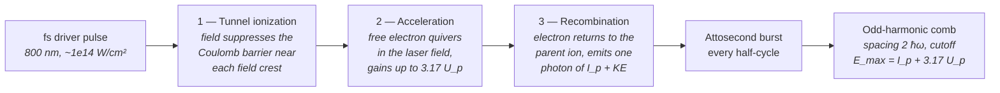

# High-Harmonic Generation (HHG)

**Status:** ✅ Implemented — comb spacing, cutoff law, and cutoff-violation rejection are textbook-exact and live; 🔶 Simplified in full-comb mode, which is spectral bookkeeping only (see [../capability-matrix.md](../capability-matrix.md)).

## Overview

HHG is the only table-top route to laser-like coherent EUV. An intense femtosecond
driver (800 nm Ti:Sapphire or 1030 nm Yb) focused into a noble-gas jet emits odd
harmonics of the driver frequency, extending into the EUV/soft-X-ray plateau. Flux
is low (nJ–µJ per pulse) so HHG is not a wafer-throughput exposure source — its
lithographic relevance is **actinic metrology**: mask inspection, EUV pellicle and
resist characterization, and coherent diffractive imaging at exactly 13.5 nm with a
source that fits on an optical table. In highuvlith, `HhgSource` is also the
stress-test for the polychromatic imaging honesty boundary: its comb mode is far
wider than anything the Hopkins engine can honestly image, and the model says so.

## Generation physics

The semiclassical three-step model (Corkum 1993; Kulander/Schafer/Krause 1992):



The ponderomotive (quiver) energy sets the maximum return kinetic energy:

$$U_p\,[\mathrm{eV}] = 9.33\times10^{-14}\; I\,[\mathrm{W/cm^2}]\; \lambda^2\,[\mathrm{\mu m^2}]$$

$$E_{\max} = I_p + 3.17\,U_p$$

Because the process repeats every **half**-cycle of the driver with alternating sign
(inversion symmetry of the gas), the spectrum is a comb of **odd harmonics only**,
spaced by two driver photons:

$$\Delta E = 2\hbar\omega_{\mathrm{driver}}, \qquad \lambda_q = \frac{\lambda_{\mathrm{driver}}}{q}, \quad q = 1, 3, 5, \dots$$

Harmonics between $I_p$ and $\sim 0.9\,E_{\max}$ form a flat plateau; the last ~10 %
below cutoff rolls off steeply.

### Ionization potentials (per `HhgGas`, NIST atomic spectra database)

| Gas | $I_p$ (eV) | Typical use |
|-----|-----------|-------------|
| Helium | 24.587 | Highest cutoff, lowest yield (water-window pushes) |
| Neon | 21.565 | 13.5 nm EUV band at $\gtrsim 4\times10^{14}$ W/cm² |
| Argon | 15.760 | Workhorse 30–50 nm XUV, best yield/effort ratio |
| Krypton | 14.000 | Longer-wavelength XUV, higher yield than Ar |
| Xenon | 12.130 | Highest single-atom yield, lowest cutoff |

These values are the exact constants in [`HhgGas::ionization_potential_ev`](../../crates/highuvlith-core/src/source_models/hhg.rs).

## Real-machine parameters

| System class | Driver | Gas | Output | In-band performance | Citation |
|--------------|--------|-----|--------|---------------------|----------|
| kHz Ti:Sapphire table-top | 800 nm, ~1 kHz, ~10¹⁴ W/cm² | Ar | q ≈ 21–31 (26–38 nm) | nJ-class per pulse; phase-matched in hollow fiber | Rundquist et al., *Science* **280**, 1412 (1998) |
| High-rep Yb fiber/Innoslab | 1030 nm, 100 kHz–1 MHz | Ar/Ne | 20–50 nm | mW-class average XUV power | Klas et al., *Optica* **3**, 1167 (2016); Heyl et al., *J. Phys. B* **50**, 013001 (2017) |
| 13.5 nm metrology source | 800 nm, kHz | Ne | q = 59 (13.5 nm) | sub-µW in-band; full spatial coherence demonstrated by CDI at 13.5 nm | Gardner et al., *Nat. Photon.* **11**, 259 (2017) |

## Simulation model

[`HhgSource`](../../crates/highuvlith-core/src/source_models/hhg.rs) stores the driver
wavelength, gas, peak intensity, an optional `HarmonicSelection { harmonic, bandwidth_pm }`
monochromator, pulse metadata (`pulse_energy_nj`, `rep_rate_hz`, `pulse_duration_fs`),
`spectral_samples`, an `IlluminationShape` pupil, and `transverse_coherence_fraction`.
It satisfies `LithographySource` as follows:

- **Cutoff-rejection guard (live):** `HhgSource::new` computes
  $E_{\max} = I_p + 3.17\,U_p$ via the shared
  [`physics::ponderomotive_ev` / `physics::hhg_cutoff_ev`](../../crates/highuvlith-core/src/source_models/physics.rs)
  and returns `Err(InvalidParameter)` if the requested harmonic's photon energy
  exceeds it, or if the harmonic is even or zero. Every construction path —
  `HhgSource::new`, the Python `SourceConfig.hhg` factory, the CLI TOML — routes
  through this guard; only a direct struct literal in Rust (the fields are `pub`)
  can bypass it.
- **Wavelength:** monochromatized mode returns $\lambda_{\mathrm{driver}}/q$;
  full-comb mode returns the median plateau harmonic's wavelength.
- **Spectrum:** monochromatized mode samples a Gaussian of the post-monochromator
  bandwidth via `evaluate_spectral_weights`. Full-comb mode builds `comb_lines()`
  — every odd harmonic from the first above $I_p$ up to cutoff, flat plateau
  envelope with an empirical exponential rolloff over the last 10 % below cutoff —
  and samples them with `evaluate_multiline_weights`. The per-harmonic linewidth is
  a fixed 1 % of the harmonic wavelength (empirical, standing in for driver
  bandwidth / q).
- **Pupil:** laser-like coherence 0.9 mapped to a tight `CoherentGaussian` pupil via
  the Gaussian–Schell heuristic `sigma_from_coherence` (approximate, documented).
  The aerial engine's `MAX_PUPIL_SAMPLES` guard rejects pupil grids that would be
  too dense at these short wavelengths.
- **Pulse metadata:** `pulse_energy_j() × rep_rate_hz()` → `average_power_w()` is
  live arithmetic (Ar preset: 10 nJ × 100 kHz = 1 mW, pinned by test).
  `shot_to_shot_rms()` is the trait default 0 — the strong intensity noise of real
  HHG (highly nonlinear in driver fluctuations) is **not yet modeled**.

### Monochromatized vs full-comb honesty

The default and lithographically honest mode is **monochromatized single-harmonic**
imaging: a pm-scale band that the polychromatic loop (per-sample chromatic focus
shift, TCC built at the center wavelength) handles correctly. **Full-comb mode**
(`monochromator: None` / `full_comb = true`) spans tens of nm — e.g. the Ar preset's
comb runs from harmonic 11 (72.7 nm) to 33 (24.2 nm). The imaging engine's
narrow-band assumption is badly violated there, so full-comb results are spectral
*bookkeeping* (weights, bandwidth span, photon accounting), **not honest aerial
images**. This is stated in the module docs and enforced by defaulting to the
monochromatized mode everywhere.

### Preset cutoff arithmetic

**`ar_800nm_30nm()`** — Ar, 800 nm, $2\times10^{14}$ W/cm², q = 27:

$$U_p = 9.33\times10^{-14} \cdot 2\times10^{14} \cdot 0.8^2 = 11.94\ \mathrm{eV}$$
$$E_{\max} = 15.760 + 3.17 \cdot 11.94 = 53.6\ \mathrm{eV} \;\gg\; E_{27} = 27 \cdot \tfrac{1239.84}{800} = 41.8\ \mathrm{eV} \;\Rightarrow\; \lambda = \tfrac{800}{27} = 29.63\ \mathrm{nm}\ ✓$$

**`ne_800nm_13nm5()`** — Ne, 800 nm, $4\times10^{14}$ W/cm², q = 59:

$$U_p = 23.88\ \mathrm{eV}, \qquad E_{\max} = 21.565 + 3.17 \cdot 23.88 = 97.3\ \mathrm{eV} \;>\; E_{59} = 91.4\ \mathrm{eV} \;\Rightarrow\; \lambda = \tfrac{800}{59} = 13.56\ \mathrm{nm}\ ✓$$

At only $2\times10^{14}$ W/cm² in Ne (cutoff 59.4 eV), q = 59 is rejected by the guard.

## Model coverage

| Field | Unit | Consumed by | Status |
|-------|------|-------------|--------|
| `driver_wavelength_nm` | nm | $\lambda_q$, driver photon energy, $U_p$ in cutoff guard, comb line positions | live |
| `gas` | — | $I_p$ → cutoff guard, comb plateau start | live |
| `driver_intensity_w_cm2` | W/cm² | $U_p$ → cutoff guard, comb extent | live |
| `monochromator.harmonic` | — | `wavelength_nm()` (imaging wavelength) | live |
| `monochromator.bandwidth_pm` | pm | `bandwidth_pm()` → spectral weights → chromatic focus loop | live |
| `pulse_energy_nj` | nJ | `pulse_energy_j()` → `average_power_w()` | live |
| `rep_rate_hz` | Hz | `average_power_w()` | live |
| `pulse_duration_fs` | fs | exposed via `pulse_duration_s()`; no time-domain physics | stored (inert) |
| `spectral_samples` | — | number of wavelength samples per line | live |
| `illumination` | — | `intensity_at()` pupil weighting in the TCC | live |
| `transverse_coherence_fraction` | — | pupil σ at construction via `sigma_from_coherence`; reported via trait | live (construction-time) |
| HHG intensity-noise → dose jitter | — | — | planned |

## Usage

Python (factories in [`py_config.rs`](../../crates/highuvlith-py/src/py_config.rs)):

```python
from highuvlith import SourceConfig

# Neon preset: harmonic 59 -> 13.56 nm
src = SourceConfig.hhg_ne_13nm5()

# Explicit construction (Ar preset equivalent); raises ValueError if the
# harmonic is even or beyond the I_p + 3.17 U_p cutoff for gas/intensity.
src = SourceConfig.hhg(
    driver_wavelength_nm=800.0,
    gas="argon",                     # helium/neon/argon/krypton/xenon (or he/ne/ar/kr/xe)
    driver_intensity_w_cm2=2e14,
    harmonic=27,
    monochromator_bandwidth_pm=30.0,
)
print(src.wavelength_nm)             # 29.63
print(src.average_power_w)           # 1e-3 (10 nJ x 100 kHz)
```

TOML (`[source]` fields from [`config.rs`](../../crates/highuvlith-cli/src/config.rs)):

```toml
[source]
type = "hhg"
gas = "neon"                       # default "neon"
driver_wavelength_nm = 800.0       # default 800.0
driver_intensity_w_cm2 = 4e14      # default 4e14
harmonic = 59                      # default 59; odd only, cutoff-checked
monochromator_bandwidth_pm = 15.0  # default 15.0
# full_comb = true                 # bookkeeping mode only — not honest imaging
pulse_energy_nj = 1.0
rep_rate_hz = 10000.0
pulse_duration_fs = 20.0
```

## Validation

In [`hhg.rs`](../../crates/highuvlith-core/src/source_models/hhg.rs):
`test_comb_spacing_is_two_driver_photons` (ΔE = 2ħω exactly),
`test_cutoff_rejection` (Ar@2e14 rejects q = 59, Ne@4e14 accepts it),
`test_even_harmonic_rejected`, `test_preset_wavelengths` (800/27 and 800/59 nm),
`test_weights_sum_to_one_in_both_modes`,
`test_plateau_starts_above_ionization_potential`, `test_pulse_metadata_live`
(1 mW average power arithmetic). In
[`physics.rs`](../../crates/highuvlith-core/src/source_models/physics.rs):
`test_ponderomotive_and_cutoff_fixture` pins $U_p = 11.94$ eV and cutoff 53.6 eV
for the Ar case.

## References

1. P. B. Corkum, "Plasma perspective on strong field multiphoton ionization," *Phys. Rev. Lett.* **71**, 1994 (1993).
2. J. L. Krause, K. J. Schafer, K. C. Kulander, "High-order harmonic generation from atoms and ions in the high intensity regime," *Phys. Rev. Lett.* **68**, 3535 (1992).
3. M. Lewenstein et al., "Theory of high-harmonic generation by low-frequency laser fields," *Phys. Rev. A* **49**, 2117 (1994).
4. A. Rundquist et al., "Phase-matched generation of coherent soft X-rays," *Science* **280**, 1412 (1998).
5. D. Gardner et al., "Subwavelength coherent imaging of periodic samples using a 13.5 nm tabletop high-harmonic light source," *Nat. Photon.* **11**, 259 (2017).
6. R. Klas et al., "Table-top milliwatt-class extreme ultraviolet high harmonic light source," *Optica* **3**, 1167 (2016).
7. C. M. Heyl et al., "Introduction to macroscopic power scaling principles for high-order harmonic generation," *J. Phys. B* **50**, 013001 (2017).
8. NIST Atomic Spectra Database (ionization potentials), https://www.nist.gov/pml/atomic-spectra-database.
