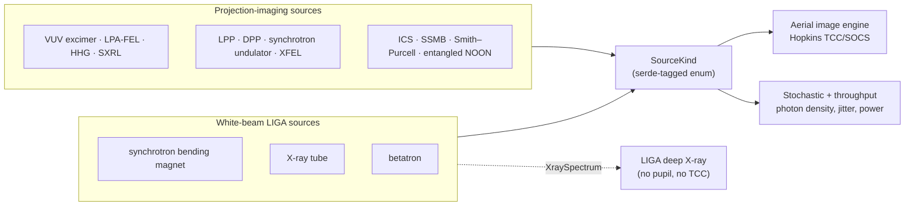
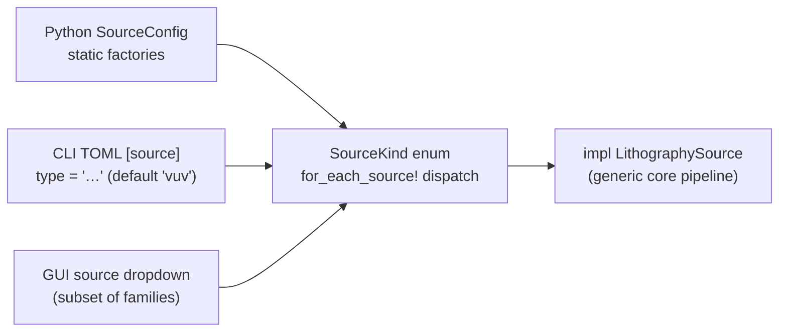

# Illumination Sources

**Status:** ✅ Implemented — the `LithographySource` trait, the type-erased `SourceKind` dispatch and all fourteen concrete families are in code; per-family fidelity ranges from ✅ to 🧪, and the badges in the table below mirror each family page and the [capability matrix](../capability-matrix.md).

## Overview

Every projection simulation in highuvlith starts at a light source, and the imaging
pipeline is generic over one trait,
[`LithographySource`](../../crates/highuvlith-core/src/source.rs). A source influences an
aerial image **only** through that trait surface: its wavelength, spectral weights, pupil
intensity map and bandwidth. Photon density and the pulse/coherence metadata feed the
stochastic and throughput models; everything else a source model computes (plasma power
chains, FEL gain lengths, undulator flux) is reported as *derived quantities* and never
enters the image. That narrow contract is what lets a 157 nm excimer laser and a 13.5 nm
XFEL run through the identical Hopkins TCC/SOCS code path.

Fourteen families implement the trait. Twelve can drive projection imaging; three are
the white-beam sources used by the [LIGA deep-X-ray module](../processes/liga-deep-xray.md)
(the synchrotron family serves both roles):



## The fourteen families at a glance

Rows follow the site navigation; the DUV/UV heritage presets, which have their own page,
sit with the VUV family they belong to. "Power" is what the preset reports as
`average_power_w()` — the usable output into the illuminator, which for plasma sources
means **in-band power at intermediate focus (IF)**. Preset machine parameters are
representative or illustrative, not vendor specifications; each family page says where
its numbers come from.

| Family | `type` tag | λ (nm) and how it is set | Class | Transverse coherence (trait) | Power scale of the presets | Status | Page |
|---|---|---|---|---|---|---|---|
| VUV excimer | `vuv` | 157.63 (F₂); 126.0 (Ar₂) — fixed molecular transitions | Discharge-pumped excimer laser | 0 (multimode; trait default) | F₂ 10 mJ × 4 kHz = 40 W; Ar₂ 5 mJ × 1 kHz = 5 W | ✅ (Ar₂ preset 🧪 hypothetical) | [vuv-excimer.md](./vuv-excimer.md) |
| DUV/UV heritage (presets of the VUV family) | `vuv` with `preset = "arf"`, `"krf"`, `"hg_i"`, `"hg_h"` or `"hg_g"` | 193.368 (ArF), 248.3 (KrF); Hg i / h / g lines 365.0153 / 404.6563 / 435.8328 (NIST air wavelengths) | Line-narrowed excimer lasers; filtered mercury-arc lines (CW) | 0 (trait default) | ArF 15 mJ × 6 kHz = 90 W; KrF 10 mJ × 4 kHz = 40 W; Hg lines are CW and their lamp power is not modelled (`average_power_w()` = None) | ✅ (🔶 representative laser parameters) | [duv-heritage.md](./duv-heritage.md) |
| Laser-produced plasma | `lpp` | 13.5 (Sn), 6.7 (Gd), 6.5 (Tb) — emission band fixed by the fuel | Laser-driven plasma, mirror-band selected | 0 (incoherent plasma) | Sn 250 W in-band at IF (NXE:3400B-class chain: 21.5 kW CO₂ drive, 6 % CE, 50 kHz); a 500 W NXE:3800E-class Sn preset assumes twice the drive power; Gd 13.6 W and Tb 11.6 W at IF are projections (no watt-level 6.x nm in-band source has been demonstrated) | ✅ (🔶 CE defaults, étendue) | [lpp.md](./lpp.md) |
| Discharge-produced plasma | `dpp` | 13.5 (Xe DPP, Sn LDP) | Pinch discharge, optionally laser-assisted | 0 (incoherent plasma) | Sn LDP 34.4 W at IF (360 W in band into 2π, a reported real-machine anchor); Xe 0.70 W at IF (10 W into 2π) | 🔶 | [dpp.md](./dpp.md) |
| Synchrotron | `synchrotron` | Undulator: **derived** from the resonance (compact preset 13.51); bending magnet: monochromator selection 0.2 on a white beam with derived E_c = 6.23 keV | Storage-ring undulator / bending magnet | Undulator: emittance-derived 0.089 (compact preset) or stored 0.2 (generic); bending magnet 0 | Undulator central-cone line 0.232 W at 200 mA; bending magnet reported per mrad only (19.8 W/mrad), `average_power_w()` = None | ✅ (🔶 coherence bound) | [synchrotron.md](./synchrotron.md) |
| XFEL | `xfel` | 13.5 **set-point** (gap-tunable; undulator K derived from it) | Linac-driven FEL, SASE / self-seeded | 0.85 SASE, 0.95 seeded | FLASH-like 0.1 W; FERMI-like 1 mW (20 µJ × 50 Hz); CW-SC ≈ 135 W and ERL ≈ 10.5 kW are design projections | ✅ (🔶 gain / saturation; CW-SC and ERL presets 🧪) | [xfel.md](./xfel.md) |
| LPA-FEL | `lpa_fel` | 25 target **set-point** (420 BELLA-baseline demo); with an undulator the resonance is derived and must agree within 5 % | Laser-plasma accelerator + undulator FEL | 0.9 target, 0.85 baseline (reported; default pupil stays `Conventional`) | 25 nm design projection: 5 µJ × 1 kHz = 5 mW (set-points; the derived FEL physics says the illustrative beam does not lase at 25 nm); the demonstrated anchor is BELLA's 420 nm lasing at 1 Hz | 🔶 | [lpa-fel.md](./lpa-fel.md) |
| HHG | `hhg` | 800 nm / q for odd q: 29.6 (Ar, q = 27), 13.56 (Ne, q = 59) | Table-top high-harmonic upconversion | 0.9 | Derived as an assumed driver power × the order-of-magnitude conversion efficiency: Ar preset ≈ 30 µW (3 W driver), Ne preset ≈ 0.90 µW (20 W driver); each preset also reports the ratio to a curve of measured records (≈ 0.54 and ≈ 0.86) | ✅ (🔶 efficiency estimate) | [hhg.md](./hhg.md) |
| Soft X-ray laser | `sxrl` | Fixed atomic lasing lines: 46.9 (Ne-like Ar), 13.9 (Ni-like Ag), 13.2 (Cd), 18.9 (Mo) | Capillary-discharge / transient-collisional plasma laser | 0.3 (Ar), 0.2 (Ni-like) — assumed | 1 µW–0.16 mW, reproducing reported averages: Ar 13 µJ × 12 Hz = 0.16 mW and Mo 1 µJ × 100 Hz = 0.1 mW (published splits); Ag 10 µJ × 10 Hz = 0.1 mW and Cd 0.1 µJ × 10 Hz = 1 µW (assumed splits) | ✅ lines / 🔶 output presets | [soft-xray-laser.md](./soft-xray-laser.md) |
| Inverse Compton | `ics` | **Derived** from Compton kinematics (13.5 preset needs ≈ 1.73 MeV electrons) | Laser–electron backscatter | 0.5 | 71 µW in the 2 % band (yield derived for an aggressive design point) | 🧪 | [inverse-compton.md](./inverse-compton.md) |
| Betatron | `betatron` | **Derived** spectrum: E_c ≈ 8.07 keV for the LWFA preset; trait λ = hc/⟨E⟩ ≈ 0.499 | Laser-wakefield betatron X-rays | 0 (trait default) | ≈ 3.5 µW (0.35 µJ per shot × 10 Hz) | 🧪 | [betatron.md](./betatron.md) |
| SSMB | `ssmb` | 13.5 = 1053 nm / 78 (integer-harmonic check) | Steady-state-microbunching storage ring | 0.8 (projected) | 1 kW derived — requires bunching factor b ≈ 0.146 | 🧪 | [ssmb.md](./ssmb.md) |
| Smith–Purcell | `smith_purcell` | **Derived** from grating period, electron β and angle (preset: period chosen for 13.5) | Free-electron grating radiation | 0 (trait default) | ≈ 0.67 nW with an assumed coupling ε = 10⁻³ (ideal ε = 1: 0.67 µW) | 🧪 | [smith-purcell.md](./smith-purcell.md) |
| X-ray tube | `xray_tube` | Photon-weighted mean λ (W 60 kV: 0.153; spectrum 0.021–1.24 nm, Duane–Hunt cutoff hc/eV) | Bremsstrahlung + characteristic lines (W / Mo / Cu / Rh) | 0 | W 60 kV × 30 mA: 8.86 W filtered X-ray power (4π-equivalent, from a 1.8 kW beam) | 🔶 continuum, moments, flux / ✅ lines and edges | [xray-tube.md](./xray-tube.md) |
| Entangled photons | `entangled` | 157.63 physical (λ/N appears only through the explicit quantum bridge) | SPDC NOON-state interferometry | 1.0 | 2.5 pW photon power at 10⁶ pairs/s (derived quantity; `average_power_w()` = None) | 🧪 | [entangled-photon.md](./entangled-photon.md) |


How the wavelength column reads:

- **Derived** wavelengths are computed from machine parameters and cannot be set
  independently: the undulator resonance (synchrotron), Compton kinematics (ICS), the
  betatron critical energy, and the Smith–Purcell dispersion relation. The CLI rejects
  over-specified configs that disagree: an explicit `wavelength_nm` must match the
  derived value within 5 % (synchrotron undulator, LPA-FEL with an undulator, X-ray
  tube, betatron, Smith–Purcell with a given grating period) or the fixed lasing line
  within 1 % (SXRL); for ICS the wavelength is the input, the electron energy is derived
  from it, and an explicit `electron_energy_mev` must satisfy the Compton condition
  within 5 %.
- **Set-points** are stored because the real machine is tunable: an XFEL is tuned by its
  undulator gap (the model derives K from the set-point), an LPA-FEL by its beam energy
  (held to the resonance by the 5 % rule when an undulator is given), and a synchrotron
  bending-magnet beamline by its monochromator.
- **Fixed lines** come from atomic or molecular physics: excimer transitions, the LPP/DPP
  emission bands, and the SXRL lasing lines.
- For the two broadband X-ray sources the trait wavelength is a single representative
  value (the X-ray tube's photon-weighted mean wavelength; the betatron's hc/⟨E⟩). Their
  spectra are for LIGA shadow printing, not for projection imaging.

<figure markdown="span">


<figcaption>The source landscape. Blue: 49 published average powers (measured or shipping = filled; projection or design = open; discharge plasmas measured into 2π at the source = squares; vertical bars = ranges), each cited in <code>docs/figures/sim/data/source_power_vs_wavelength.csv</code>. Orange diamonds: what the simulator's presets report as <code>average_power_w</code> (open = projection or what-if; X-ray tubes: total 4π emission, horizontal bars = spectral span). In (a) published points sit 4 % left and presets 4 % right of their wavelength so both stay visible. Powers are defined at different planes (IF, laser output, source), so compare orders of magnitude, not percent. Source models range from ✅ to 🧪 — see each family page.</figcaption>
</figure>

## The `LithographySource` trait contract

Defined in [`source.rs`](../../crates/highuvlith-core/src/source.rs). The trait is
`Send + Sync` and the core pipeline takes `impl LithographySource`, so there is no dynamic
dispatch inside the imaging code.

| Method | Required / default | Consumed by |
|---|---|---|
| `wavelength_nm() -> f64` | **required** | Pupil cutoff NA/λ, source-point scaling σ·NA/λ, defocus phase, photon energy and density, every downstream stage |
| `bandwidth_pm() -> f64` | **required** (FWHM) | Sets the ±2.5 FWHM span that each family's `spectral_weights` samples; derived bandwidth figures; reporting (PyO3 `bandwidth_pm`). The aerial engine reads only the weights. |
| `intensity_at(fx_norm, fy_norm) -> f64` | **required** | Pupil-fill sampling in `aerial::sample_source` (adaptive source grid) when the kernels are built |
| `spectral_weights() -> Vec<(f64, f64)>` | **required** (weights sum to 1) | `compute_polychromatic` (narrow band) and `compute_multiwavelength` (exact per-λ TCC); ignored by the monochromatic `compute` |
| `photon_energy_ev() -> f64` | default `1239.84193 / λ` | Reporting |
| `photon_density_per_mj_cm2() -> f64` | default: photons/nm² at 1 mJ/cm² from hc/λ | `StochasticParams::from_source` (**live** shot-noise photon counts). The X-ray tube overrides it with the mean photon energy (the hc/λ̄ default would overcount photons per dose ≈ 1.6× for the W 60 kV preset). |
| `pulse_energy_j() -> Option<f64>` | default `None` | Default `average_power_w()` arithmetic |
| `rep_rate_hz() -> Option<f64>` | default `None` | Default `average_power_w()`; pulses per exposure point in the throughput model |
| `pulse_duration_s() -> Option<f64>` | default `None` | Reported only (PyO3 `pulse_duration_fs`); no time-domain physics consumes it |
| `average_power_w() -> Option<f64>` | default `pulse_energy × rep_rate` when both are known | The dose-limited throughput model (`throughput::wafer_throughput`); PyO3 `average_power_w`. CW and machine-derived families override it. |
| `transverse_coherence() -> f64` | default `0.0` (unknown / multimode) | Reported (PyO3 `transverse_coherence_fraction`); the high-coherence families use it at construction to size their pupil through `sigma_from_coherence` |
| `shot_to_shot_rms() -> f64` | default `0.0` | `StochasticParams::from_source` (single-pulse rms as dose jitter) and `from_source_multi_pulse` (rms / √N for N pulses per exposure) → Gamma-distributed dose factor in the LER/LWR Monte Carlo (**live**) |
| `derived_quantities() -> Vec<DerivedQuantity>` | default: empty | `highuvlith simulate` (printed to stderr and written to the JSON output under `derived_quantities`); Python `SourceConfig.derived_quantities()` / `derived_quantity(name)`. Informational only: the imaging pipeline never reads them. |

A `DerivedQuantity` is `{ name, value, unit, note }` — a snake_case identifier, the
number, its unit and a one-line provenance or caveat (for example
`pierce_parameter_1d`, `ming_xie_lambda`, `saturation_length_3d`, `central_cone_flux`,
`in_band_power_at_if`, `hvm_power_ratio`).

> **Every trait method is forwarded through `SourceKind`.** The type-erased `SourceKind`
> (used by the Python, CLI and GUI layers) forwards all trait methods, including the
> per-family `photon_energy_ev()` / `photon_density_per_mj_cm2()` overrides, so e.g. the
> X-ray tube's mean-photon-energy photon density reaches `StochasticParams::from_source`
> from every frontend (pinned by `test_source_kind_forwards_every_trait_method`).

## What the pipeline does with a source

- **Source sampling.** The engine samples `intensity_at` on an adaptive grid that zooms
  onto the illuminated part of the pupil (`aerial::sample_source`); a tiny source or
  `source_points_per_axis = 1` collapses to one coherent point. The sampling is
  inspectable (`AerialImageEngine::source_points`; Python `imaging_diagnostics()`).
- **Spectrum: three levels of honesty.** `compute` (Python `compute_aerial_image`, CLI
  `[imaging] spectrum = "monochromatic"`, the default) images the center wavelength.
  `compute_polychromatic` (`"narrow_band"`) shifts focus per spectral sample with the
  center-wavelength kernels — valid only for Δλ/λ ≪ 1 (excimer, FEL, monochromatized
  beamlines). `compute_multiwavelength` (Python `compute_multiwavelength`,
  `"per_wavelength"`) rebuilds the TCC at every spectral sample (cutoff NA/λᵢ, source
  points at σ·NA/λᵢ, pupil at λᵢ, chromatic focus shift) and sums the images
  incoherently. The last one is what makes an HHG harmonic comb (`full_comb` with an
  optional `comb_passband_nm`) an honest image; it costs one kernel decomposition per
  spectral sample, so use one sample per harmonic.
- **Scalar by default, vector on request.** The default imaging model is scalar Hopkins
  imaging. Vector (polarized, high-NA) imaging is selected with `ImagingModel::Vector`
  in Rust or `SimulationEngine(..., vector=VectorSettings(...))` in Python
  (`highuvlith.api.VectorSettings`); `highuvlith.api` also has the pupil-level helpers
  `pupil_polarization_map` and `vector_two_beam_contrast`.
  See [vector-imaging.md](../vector-imaging.md). Sources carry no polarization state of
  their own; polarization is an imaging setting.
- **Memory guard.** The engine builds a factorized TCC `A` (mask frequencies × source
  columns). If `A` would exceed 1 GiB of complex entries the constructor returns
  `LithographyError::PupilSamplingTooDense` instead of silently mis-sampling — the usual
  cause is a short wavelength on a large, finely pixelated field.
- **Pulse metadata is arithmetic, not pulse physics.** Pulse energy × repetition rate →
  average power, and `shot_to_shot_rms` → dose jitter, are computed; time-domain pulse
  structure is modelled nowhere.
- **Illumination shapes.** `IlluminationShape` offers `Conventional`, `Annular`,
  `Quadrupole`, `Dipole` and the graded `CoherentGaussian`. The `Dipole` variant placed
  both poles at the same point (a single off-axis pole) until 2026-09-30; it now has poles
  at the orientation angle and 180° from it (`test_dipole_has_two_symmetric_poles`). The
  source families' presets do not use it; the optimization bindings'
  `illumination=("dipole", …)` override does.

## Type erasure: `SourceKind` and `for_each_source!`

The PyO3, CLI and GUI layers cannot be generic over a trait, so they carry the
serde-tagged enum `SourceKind`, one variant per family. The TOML/JSON discriminator is the
`type` tag, which equals `kind_label()`:

`vuv` · `lpa_fel` · `lpp` · `synchrotron` · `hhg` · `xfel` · `ics` · `ssmb` · `entangled` ·
`xray_tube` · `dpp` · `sxrl` · `betatron` · `smith_purcell`



Dispatch stays one line per method through the `for_each_source!` macro, which applies
the same expression to whichever concrete source the enum holds. A new family costs one
enum variant, one macro arm, one `kind_label` arm and a `From<NewSource> for SourceKind`
impl; every dispatched method then picks it up. Helper accessors on `SourceKind`:
`sigma_outer()` (conventional, annular and Gaussian pupils only), `kind_label()`,
`spectral_samples()` and `illumination()`.

Frontend entry points per family:

| Family | Python `SourceConfig` factories | CLI `[source]` |
|---|---|---|
| VUV excimer and DUV/UV heritage | `SourceConfig(...)` (custom VUV), `f2_laser`, `ar2_laser`, `arf_laser`, `krf_laser`, `hg_i_line`, `hg_h_line`, `hg_g_line` | `type = "vuv"` (the default), optional `preset` |
| LPA-FEL | `lpa_fel_bella_25nm`, `lpa_fel(...)` (optional undulator and beam) | `type = "lpa_fel"` |
| LPP | `lpp_sn_13nm5(sigma, drive_laser=...)`, `lpp_sn_13nm5_500w`, `lpp_gd_6nm7`, `lpp_tb_6nm5` | `type = "lpp"`, `fuel`, `drive_laser`, `preset = "nxe3800e"` |
| DPP | `dpp_sn_13nm5`, `dpp_xe_13nm5` | `type = "dpp"`, `fuel` |
| Synchrotron | `synchrotron_undulator(...)`, `synchrotron_compact_euv`, `synchrotron_liga_bending_magnet` | `type = "synchrotron"`, `beamline` |
| XFEL | `xfel_flash_13nm5`, `xfel_fermi_seeded`, `xfel_cw_sc_13nm5`, `xfel_erl_13nm5` | `type = "xfel"`, `xfel_preset` |
| HHG | `hhg(...)`, `hhg_ar_30nm`, `hhg_ne_13nm5` | `type = "hhg"`, `gas`, `harmonic` |
| SXRL | `sxrl(scheme=...)`, `sxrl_ar_46nm9`, `sxrl_ag_13nm9` | `type = "sxrl"`, `scheme` |
| ICS | `ics(...)`, `ics_compact_euv_13nm5` | `type = "ics"` |
| Betatron | `betatron(...)` | `type = "betatron"` |
| SSMB | `ssmb(...)`, `ssmb_euv_13nm5` | `type = "ssmb"` |
| Smith–Purcell | `smith_purcell(...)` | `type = "smith_purcell"` |
| X-ray tube | `xray_tube(anode="W", ...)` | `type = "xray_tube"`, `anode` |
| Entangled photons | `entangled_noon(...)` | `type = "entangled"` |

The per-family keys are listed in [configuration.md](../configuration.md) and the factory
signatures in [python-api.md](../python-api.md). The desktop GUI exposes a subset of the
families (see [gui.md](../gui.md)).

## Coherence → pupil fill: `sigma_from_coherence`

High-coherence sources fill only a small core of the pupil. The bridge from a transverse
coherence fraction ζ to a partial-coherence pupil σ is a Gaussian–Schell mode-count
heuristic:

```math
\sigma_{\text{pupil}} = \operatorname{clamp}\left(\frac{\sigma_{\text{core}}}{\sqrt{\zeta}},\ \sigma_{\text{core}},\ 1\right), \qquad \zeta \le 0 \Rightarrow \sigma_{\text{pupil}} = 1
```

A beam with coherence fraction ζ carries roughly M ≈ 1/ζ transverse modes, and far-field
divergence (hence pupil fill) grows as √M. This is **approximate by design** — a
bookkeeping bridge to partial-coherence imaging, not a coherent-mode decomposition — and
the code says so. The resulting pupil is the graded `IlluminationShape::CoherentGaussian`,
I(ρ) = exp(−ρ²/2σ²) for ρ ≤ 1.

- Built with `sigma_from_coherence(ζ, 0.05)`: synchrotron undulator, HHG, XFEL, ICS, SSMB
  and SXRL.
- `CoherentGaussian` with a fixed σ = 0.05: the entangled-photon source.
- Top-hat `Conventional` fills: VUV, LPP, DPP (plasma sources are incoherent), the
  synchrotron bending magnet, the X-ray tube and betatron (σ = 1; broadband LIGA
  sources), Smith–Purcell, and the LPA-FEL. The LPA-FEL *reports* a coherence of
  0.85–0.9 but keeps `Conventional` for back-compat, because its `sigma` argument and the
  GUI slider mean a top-hat radius.

<figure markdown="span">


<figcaption>What each source preset hands to the imaging engine: the spectral samples and weights (top; offset from the weighted mean wavelength) and the pupil fill (bottom; the circle is the NA). The excimer laser and the plasma source fill a disk (conventional σ); the undulator, FEL, HHG and ICS presets get a near-coherent Gaussian fill with σ derived from their transverse coherence; the filtered HHG comb is three harmonics (q 57, 59, 61), each sampled across its own linewidth. From each preset's <code>spectrum()</code> and <code>pupil_fill()</code>; the presets' own status (✅/🔶/🧪) is given on each family page.</figcaption>
</figure>

## Derived quantities and the machine-parameter physics layer

Every family reports `derived_quantities()`: physics computed from its machine
parameters rather than stored as free numbers. Examples: the LPP power chain from drive
power, conversion efficiency, collection and étendue to IF; the synchrotron's harmonic
factors, central-cone flux and total undulator power; the FEL Pierce parameter, 1D and
Ming Xie gain lengths and saturation estimates; the ICS Thomson yield and collection
fraction; the SSMB coherent power and the bunching factor 1 kW would require; the
entangled source's ETPA clearing times for the disputed cross-section range; the X-ray
tube's bremsstrahlung efficiency, characteristic-line photon fraction and mean photon
energy; the betatron critical energy and photons per shot. Short-wavelength families also report their power relative to the 250 W at IF of
production 13.5 nm sources (`hvm_power_ratio` or `hvm_power_gap`; reference
`throughput::HVM_EUV_POWER_AT_IF_W`).

```bash
highuvlith simulate --config examples/sim_lpa_fel.toml   # prints the derived table
```

<!-- verify-example -->
```python
import highuvlith as huv

src = huv.SourceConfig.xfel_flash_13nm5()
for name, value, unit, note in src.derived_quantities():
    print(f"{name:32s} {value:12.4e} {unit}")
print(src.derived_quantity("pierce_parameter_1d"))
```

??? success "Output"

    ```text
    photon_energy                      9.1840e+01 eV
    average_power                      1.0000e-01 W
    photon_rate                        6.7961e+15 photons/s
    hvm_power_ratio                    4.0000e-04 -
    coherence_time                     9.7315e+00 fs
    longitudinal_modes                 3.0828e+00 -
    electron_gamma                     1.3317e+03 -
    undulator_k                        1.0247e+00 -
    pierce_parameter_1d                2.3137e-03 -
    beam_size_rms                      8.2208e+01 um
    gain_length_1d                     6.2353e-01 m
    ming_xie_lambda                    2.7405e-01 -
    gain_length_3d                     7.9441e-01 m
    energy_spread_over_rho             3.0255e-01 -
    emittance_over_photon_emittance    1.0485e+00 -
    beam_power_peak                    1.7013e+12 W
    saturation_power_1d                3.9362e+09 W
    saturation_power_3d                3.8799e+09 W
    saturation_pulse_energy_3d         1.1640e-04 J
    saturation_length_3d               1.7291e+01 m
    undulator_over_saturation_length   1.7343e+00 -
    sase_bandwidth_from_rho            6.2469e+01 pm
    pulse_energy_over_saturation       8.5913e-01 -
    beam_power_average                 5.1000e+01 W
    fel_efficiency                     1.9608e-03 -
    0.002313671640192721
    ```

The shared formulas live in
[`source_models/physics.rs`](../../crates/highuvlith-core/src/source_models/physics.rs),
each fixture-tested against independent scipy/mpmath evaluations: CODATA constants;
Bessel functions; planar-undulator harmonic factors F_n(K) and Q_n(K); Kim's central-cone
flux, on-axis flux density and line power; total undulator power; bending-magnet flux and
power per mrad with the Kostroun S(y) integral; the emittance-limited coherent fraction;
gap-tuned K for a target wavelength; the 1D Pierce parameter, gain length and saturation;
the Ming Xie 3D gain-length fit (an empirical fit, ≈ 10–20 % inside its range); head-on
Thomson yield and exact collection fraction; laser critical density; the Keldysh
parameter; HHG critical ionization; coherent (bunched-beam) undulator power and the
Gaussian microbunch form factor. The X-ray tube, DPP, SXRL, betatron and Smith–Purcell
models keep their formula helpers in their own files (e.g. the betatron critical energy,
the Smith–Purcell dispersion relation), with the same fixture-test standard.

## Dose-limited throughput calculator

[`source_models/throughput.rs`](../../crates/highuvlith-core/src/source_models/throughput.rs)
turns any source's `average_power_w()` into wafers per hour for a step-and-scan tool
(🔶 Simplified: one optics-transmission factor, a dose-limited scan, two lumped overheads):

```math
P_w = P_\text{source} T_\text{optics} T_\text{mask}, \qquad v = \frac{P_w}{D W}, \qquad \text{WPH} = \frac{3600}{N_\text{fields}\left(\frac{H + h}{v} + t_\text{field}\right) + t_\text{wafer}}, \qquad N_p = \frac{f_\text{rep} h}{v}
```

with dose D, slit length W across the scan, field length H, slit height h, and N_p the
pulses per exposure point (which averages single-pulse jitter down by 1/√N_p; feed it to
`StochasticParams::from_source_multi_pulse`). From Python:

<!-- verify-example -->
```python
import highuvlith as huv

r = huv.SourceConfig.lpp_sn_13nm5(sigma=0.9).wafer_throughput(dose_mj_cm2=30.0, cd_nm=16.0)
print(r["wafers_per_hour"], r["power_at_wafer_w"], r["pulses_per_point"])
```

??? success "Output"

    ```text
    153.87353586508289 4.590222796249997 169.926392382789
    ```

`wafer_throughput` returns `None` for sources without an average power (the bending
magnet, the entangled source). With the method's EUV-like defaults at 30 mJ/cm² —
**illustrative** assumptions, not vendor data: 10 mirrors of R = 0.70 between IF and
wafer, mask efficiency 0.65, 300 mm wafers with 84 fields of 26 × 33 mm, 2 mm slit,
0.1 s per field and 10 s per wafer:

| Preset | Source power | WPH | Note |
|---|---|---|---|
| `lpp_sn_13nm5` | 250 W at IF | 153.9 | 4.59 W at the wafer, ≈ 170 pulses per point |
| `lpp_sn_13nm5_500w` | 500 W at IF | 172.3 | increasingly overhead-limited |
| `xfel_erl_13nm5` | ≈ 10.5 kW | 194 | overhead-limited (ceiling ≈ 196 WPH) — design projection |
| `ssmb_euv_13nm5` | 1 kW | 183 | design projection |
| `xfel_cw_sc_13nm5` | ≈ 135 W | 130 | design projection |
| `synchrotron_compact_euv` | 0.232 W | 0.67 | central-cone line power |
| `xfel_flash_13nm5` | 0.1 W | 0.29 | |
| `ics_compact_euv_13nm5` | 71 µW | 2.1 × 10⁻⁴ | |
| `arf_laser` (refractive-like: `optics_transmission=0.3, mask_efficiency=0.9, slit_height_mm=8`) | 90 W | 185 | 15 pulses per point |
| `f2_laser` (same refractive-like settings) | 40 W | 172 | 23 pulses per point |


At 13.5 nm and 30 mJ/cm², a (16 nm)² pixel receives about 5,200 photons — 1.4 % relative
shot noise (`throughput::photons_per_square`, `relative_shot_noise`). For 6.x nm work the
Rust preset `ThroughputParams::beuv_la_b_like` swaps in La/B multilayers at the record
64.1 % reflectance (0.641¹¹ ≈ 0.75 % of the IF power reaches the wafer); from Python pass
`n_mirrors=10, mirror_reflectivity=0.641, mask_efficiency=0.641`.

<figure markdown="span">


<figcaption>Dose-limited throughput from each preset's <code>average_power_w</code> through <code>SourceConfig.wafer_throughput</code> at 30 mJ/cm² on 300 mm wafers (84 fields of 26 × 33 mm, 0.1 s per field and 10 s per wafer overhead, which caps the model near 196 wph). Columns: EUV 10 mirrors × 0.70 and mask 0.65 (1.8 % IF→wafer); BEUV 11 × 0.641 (record La/B); refractive transmission 0.3, mask 0.9. X-ray tubes, betatron and the NOON source are not projection-scanner sources and are omitted. Model: dose-limited throughput 🔶 (illustrative overheads; no stage-acceleration or vendor calibration).</figcaption>
</figure>

## Sources for LIGA and proximity printing

LIGA shadow printing bypasses the projection pipeline and consumes an `XraySpectrum`
directly ([liga-deep-xray.md](../processes/liga-deep-xray.md)):

- **Synchrotron bending magnet** (`synchrotron_liga_bending_magnet`, TOML
  `beamline = "bending_magnet"`): a relative white-beam spectrum from the critical
  energy, or an absolute one (dose rate and exposure time) when the beamline geometry is
  given (`source_distance_m`, `vertical_scan_mm`, horizontal acceptance).
- **X-ray tube**: `xray_spectrum()` gives a tabulated relative spectrum and
  `spectral_flux_density(distance_mm)` the absolute photons s⁻¹ mm⁻² keV⁻¹ at the mask
  plane, which the LIGA module accepts as an absolute flux-density table (Python
  `simulate_liga(flux_density=...)`, TOML `[deep] flux_density`).
- **Betatron**: a synchrotron-like spectrum characterized by its critical energy.

`highuvlith deep` (`[deep] mode = "liga"`) takes the spectrum from `[deep] flux_density`,
from a bending-magnet `[source]`, from `[deep] critical_energy_kev`, or from an
`xray_tube` / `betatron` `[source]`. From Python, `simulate_liga` accepts a bending-magnet
`source=`, an absolute `flux_density=` table, or a relative `spectrum_table=` (e.g. from
`SourceConfig.xray_spectrum()`).

## Example configurations

One TOML per family preset lives in [`examples/`](../../examples):

| File | `type` | Run with |
|---|---|---|
| [`sim.toml`](../../examples/sim.toml) | `vuv` (implicit, F₂) | `highuvlith simulate` |
| [`sim_arf.toml`](../../examples/sim_arf.toml), [`sim_krf.toml`](../../examples/sim_krf.toml), [`sim_hg_iline.toml`](../../examples/sim_hg_iline.toml), [`sim_hg_gline.toml`](../../examples/sim_hg_gline.toml) | `vuv` with a heritage `preset` | `highuvlith simulate` |
| [`sim_lpp_sn.toml`](../../examples/sim_lpp_sn.toml), [`sim_lpp_gd.toml`](../../examples/sim_lpp_gd.toml) | `lpp` | `highuvlith simulate` |
| [`sim_dpp.toml`](../../examples/sim_dpp.toml) | `dpp` | `highuvlith simulate` |
| [`sim_synchrotron.toml`](../../examples/sim_synchrotron.toml) | `synchrotron` (undulator) | `highuvlith simulate` |
| [`liga.toml`](../../examples/liga.toml) | `synchrotron` (bending magnet) | `highuvlith deep` |
| [`sim_xfel.toml`](../../examples/sim_xfel.toml), [`sim_xfel_cw_sc.toml`](../../examples/sim_xfel_cw_sc.toml), [`sim_xfel_erl.toml`](../../examples/sim_xfel_erl.toml) | `xfel` | `highuvlith simulate` |
| [`sim_lpa_fel.toml`](../../examples/sim_lpa_fel.toml) | `lpa_fel` | `highuvlith simulate` |
| [`sim_hhg.toml`](../../examples/sim_hhg.toml) | `hhg` | `highuvlith simulate` |
| [`sim_sxrl.toml`](../../examples/sim_sxrl.toml) | `sxrl` | `highuvlith simulate` |
| [`sim_ics.toml`](../../examples/sim_ics.toml) | `ics` | `highuvlith simulate` |
| [`sim_betatron.toml`](../../examples/sim_betatron.toml) | `betatron` | `highuvlith deep` |
| [`sim_ssmb.toml`](../../examples/sim_ssmb.toml) | `ssmb` | `highuvlith simulate` |
| [`sim_smith_purcell.toml`](../../examples/sim_smith_purcell.toml) | `smith_purcell` | `highuvlith simulate` |
| [`sim_xray_tube.toml`](../../examples/sim_xray_tube.toml) | `xray_tube` | `highuvlith deep` |
| [`sim_entangled.toml`](../../examples/sim_entangled.toml) | `entangled` | `highuvlith simulate` |

## Adding a source family

Create `source_models/<family>.rs`, implement the trait (reuse `evaluate_illumination`,
`evaluate_spectral_weights` and the `physics.rs` helpers, derive the wavelength from
machine parameters where the physics fixes it, and report `derived_quantities()`), add the
`SourceKind` variant with its `for_each_source!` arm, `kind_label` arm and `From` impl,
then wire the Python factory (with its `_native.pyi` stub), the CLI `type` tag, an example
TOML, a family page and the capability-matrix row. The full recipe with the required tests
is in [extending.md](../extending.md); build, test and documentation conventions are in
[CONTRIBUTING.md](../../CONTRIBUTING.md).
